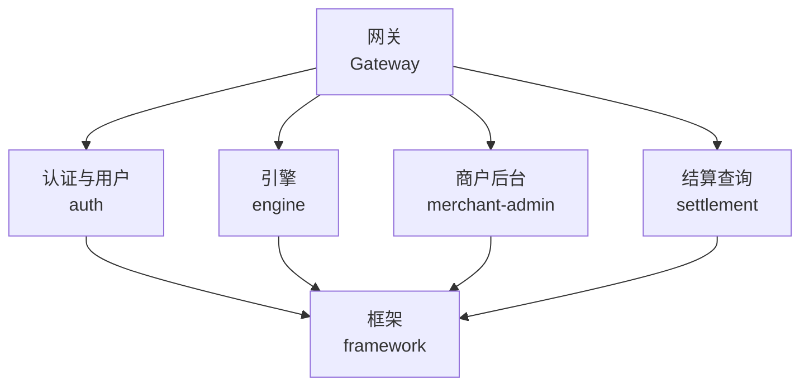
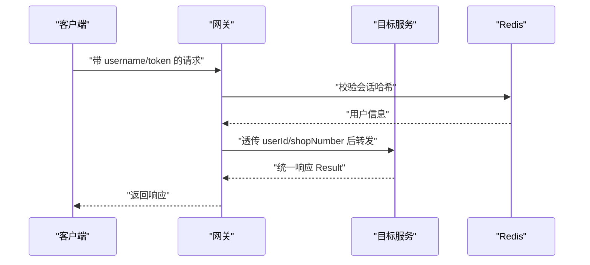
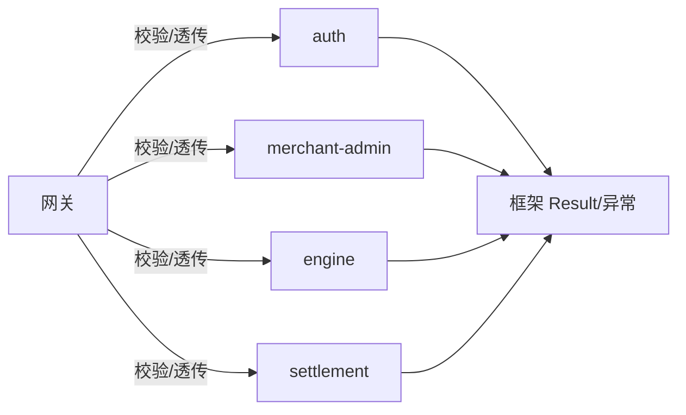

# API接口文档

<cite>
**本文引用的文件**
- [UserController.java](file://auth/src/main/java/com/fengxin/maplecoupon/auth/controller/UserController.java)
- [MerchantAdminController.java](file://auth/src/main/java/com/fengxin/maplecoupon/auth/controller/MerchantAdminController.java)
- [CouponTemplateController.java（引擎）](file://engine/src/main/java/com/fengxin/maplecoupon/engine/controller/CouponTemplateController.java)
- [UserCouponController.java](file://engine/src/main/java/com/fengxin/maplecoupon/engine/controller/UserCouponController.java)
- [CouponTemplateController.java（商户后台）](file://merchant-admin/src/main/java/com/fengxin/maplecoupon/merchantadmin/controller/CouponTemplateController.java)
- [CouponTaskController.java](file://merchant-admin/src/main/java/com/fengxin/maplecoupon/merchantadmin/controller/CouponTaskController.java)
- [CouponQueryController.java](file://settlement/src/main/java/com/fengxin/maplecoupon/settlement/controller/CouponQueryController.java)
- [UserService.java](file://auth/src/main/java/com/fengxin/maplecoupon/auth/service/UserService.java)
- [UserLoginReqDTO.java](file://auth/src/main/java/com/fengxin/maplecoupon/auth/dto/req/UserLoginReqDTO.java)
- [UserLoginRespDTO.java](file://auth/src/main/java/com/fengxin/maplecoupon/auth/dto/resp/UserLoginRespDTO.java)
- [CouponTemplateRedeemReqDTO.java](file://engine/src/main/java/com/fengxin/maplecoupon/engine/dto/req/CouponTemplateRedeemReqDTO.java)
- [CouponTemplateSaveReqDTO.java](file://merchant-admin/src/main/java/com/fengxin/maplecoupon/merchantadmin/dto/req/CouponTemplateSaveReqDTO.java)
- [GlobalExceptionHandler.java](file://framework/src/main/java/com/fengxin/web/GlobalExceptionHandler.java)
- [Result.java](file://framework/src/main/java/com/fengxin/web/Result.java)
- [BaseErrorCode.java](file://framework/src/main/java/com/fengxin/errorcode/BaseErrorCode.java)
- [UserErrorCodeEnum.java](file://auth/src/main/java/com/fengxin/maplecoupon/auth/common/enums/UserErrorCodeEnum.java)
- [TokenValidateGatewayFilterFactory.java](file://gateway/src/main/java/com/fengxin/maplecoupon/gateway/filter/TokenValidateGatewayFilterFactory.java)
- [application.yml（网关）](file://gateway/src/main/resources/application.yml)
</cite>

## 目录
1. [简介](#简介)
2. [项目结构](#项目结构)
3. [核心组件](#核心组件)
4. [架构总览](#架构总览)
5. [详细组件分析](#详细组件分析)
6. [依赖分析](#依赖分析)
7. [性能考虑](#性能考虑)
8. [故障排查指南](#故障排查指南)
9. [结论](#结论)
10. [附录](#附录)

## 简介
本文件为 MapleCoupon 系统的完整 API 接口文档，覆盖认证与用户管理、优惠券模板与兑换、商户后台管理、结算查询等模块。文档提供各 RESTful 接口的端点规范、请求参数、响应格式、示例、错误码与异常处理、认证与安全策略、版本控制与兼容性建议、以及测试与调试方法。

## 项目结构
MapleCoupon 采用多模块微服务架构，API 主要分布在以下模块：
- 认证与用户：auth
- 引擎（优惠券模板与用户兑换）：engine
- 商户后台：merchant-admin
- 结算查询：settlement
- 网关与安全：gateway
- 框架与公共能力：framework

图表来源
- [application.yml（网关）:17-63](file://gateway/src/main/resources/application.yml#L17-L63)

章节来源
- [application.yml（网关）:1-72](file://gateway/src/main/resources/application.yml#L1-L72)

## 核心组件
- 统一响应包装：Result<T>，包含 code、message、data 字段；success 以固定成功码标识。
- 全局异常处理：统一拦截参数校验、业务异常与未捕获异常，返回标准化错误码与消息。
- 网关鉴权：基于 Header 中 username 与 token，校验 Redis 中会话哈希有效性，并透传用户标识到下游服务。

章节来源
- [Result.java:17-45](file://framework/src/main/java/com/fengxin/web/Result.java#L17-L45)
- [GlobalExceptionHandler.java:26-77](file://framework/src/main/java/com/fengxin/web/GlobalExceptionHandler.java#L26-L77)
- [TokenValidateGatewayFilterFactory.java:44-87](file://gateway/src/main/java/com/fengxin/maplecoupon/gateway/filter/TokenValidateGatewayFilterFactory.java#L44-L87)

## 架构总览
下图展示 API 的总体调用链：客户端经网关路由至对应服务，网关进行鉴权与会话透传，服务内部完成业务处理并返回统一响应。

图表来源
- [TokenValidateGatewayFilterFactory.java:44-87](file://gateway/src/main/java/com/fengxin/maplecoupon/gateway/filter/TokenValidateGatewayFilterFactory.java#L44-L87)
- [application.yml（网关）:17-63](file://gateway/src/main/resources/application.yml#L17-L63)

## 详细组件分析

### 认证与用户管理接口
- 服务模块：auth
- 基础路径：/api/auth

端点一览
- GET /api/auth/admin/user/{username}
  - 功能：按用户名查询用户信息（脱敏）
  - 请求参数：路径变量 username
  - 响应：Result<UserRespDTO>
- GET /api/auth/actual/user/{username}
  - 功能：按用户名查询用户信息（不脱敏）
  - 请求参数：路径变量 username
  - 响应：Result<UserActualRespDTO>
- GET /api/auth/user/has-username
  - 功能：检查用户名是否存在
  - 请求参数：username（查询参数）
  - 响应：Result<Boolean>
- POST /api/auth/user/register
  - 功能：用户注册
  - 请求体：UserRegisterReqDTO
  - 响应：Result<Void>
- PUT /api/auth/user
  - 功能：更新用户信息
  - 请求体：UserUpdateReqDTO
  - 查询参数：token
  - 响应：Result<Void>
- POST /api/auth/user/login
  - 功能：用户登录
  - 请求体：UserLoginReqDTO
  - 响应：Result<UserLoginRespDTO>
- GET /api/auth/user/check-login
  - 功能：检查登录状态
  - 查询参数：username、token
  - 响应：Result<Boolean>
- DELETE /api/auth/user/logout
  - 功能：用户登出
  - 查询参数：username、token
  - 响应：Result<Void>

请求示例（JSON）
- 登录请求体
  {
    "username": "string",
    "password": "string"
  }

响应示例（JSON）
- 成功响应
  {
    "code": "200",
    "message": "string",
    "data": {}
  }
- 登录成功
  {
    "code": "200",
    "message": "string",
    "data": {
      "token": "string"
    }
  }

章节来源
- [UserController.java:30-79](file://auth/src/main/java/com/fengxin/maplecoupon/auth/controller/UserController.java#L30-L79)
- [UserLoginReqDTO.java:12-22](file://auth/src/main/java/com/fengxin/maplecoupon/auth/dto/req/UserLoginReqDTO.java#L12-L22)
- [UserLoginRespDTO.java:16-18](file://auth/src/main/java/com/fengxin/maplecoupon/auth/dto/resp/UserLoginRespDTO.java#L16-L18)

### 商家后管接口（认证模块转发）
- 服务模块：auth（通过远程服务转发至 merchant-admin）
- 基础路径：/api/auth/merchant-admin

端点一览
- POST /api/auth/merchant-admin/coupon-task/create
  - 功能：创建优惠券推送任务
  - 请求体：CouponTaskCreateReqDTO
  - 响应：Result<Void>
- POST /api/auth/merchant-admin/coupon-template/create
  - 功能：创建优惠券模板
  - 请求体：CouponTemplateSaveReqDTO
  - 响应：Result<Void>
- GET /api/auth/merchant-admin/coupon-template/page
  - 功能：分页查询优惠券模板
  - 查询参数：name、target、goods、type、current、size
  - 响应：Result<Page<CouponTemplatePageQueryRespDTO>>
- GET /api/auth/merchant-admin/coupon-template/find
  - 功能：查询优惠券模板详情
  - 查询参数：couponTemplateId
  - 响应：Result<CouponTemplateQueryRespDTO>
- POST /api/auth/merchant-admin/coupon-template/increase-number
  - 功能：增加发行量
  - 请求体：CouponTemplateNumberReqDTO
  - 响应：Result<Void>
- POST /api/auth/merchant-admin/coupon-template/terminate
  - 功能：结束模板
  - 请求体：TerminateCouponTemplateReqDTO
  - 响应：Result<Void>
- DELETE /api/auth/merchant-admin/coupon-template/delete
  - 功能：删除模板
  - 查询参数：couponTemplateId
  - 响应：Result<Void>

章节来源
- [MerchantAdminController.java:24-74](file://auth/src/main/java/com/fengxin/maplecoupon/auth/controller/MerchantAdminController.java#L24-L74)

### 商户后台接口（直接实现）
- 服务模块：merchant-admin
- 基础路径：/api/merchant-admin

端点一览
- POST /api/merchant-admin/coupon-template/create
  - 功能：创建优惠券模板
  - 请求体：CouponTemplateSaveReqDTO
  - 响应：Result<Void>
- GET /api/merchant-admin/coupon-template/page
  - 功能：分页查询优惠券模板
  - 查询参数：CouponTemplatePageQueryReqDTO
  - 响应：Result<IPage<CouponTemplatePageQueryRespDTO>>
- GET /api/merchant-admin/coupon-template/find
  - 功能：查询优惠券模板详情
  - 查询参数：couponTemplateId
  - 响应：Result<CouponTemplateQueryRespDTO>
- POST /api/merchant-admin/coupon-template/increase-number
  - 功能：增加发行量
  - 请求体：CouponTemplateNumberReqDTO
  - 响应：Result<Void>
- POST /api/merchant-admin/coupon-template/terminate
  - 功能：结束模板
  - 请求体：TerminateCouponTemplateReqDTO
  - 响应：Result<Void>
- DELETE /api/merchant-admin/coupon-template/delete
  - 功能：删除模板
  - 查询参数：couponTemplateId
  - 响应：Result<Void>
- POST /api/merchant-admin/coupon-task/create
  - 功能：创建优惠券推送任务
  - 请求体：CouponTaskCreateReqDTO
  - 响应：Result<Void>

章节来源
- [CouponTemplateController.java（商户后台）:33-71](file://merchant-admin/src/main/java/com/fengxin/maplecoupon/merchantadmin/controller/CouponTemplateController.java#L33-L71)
- [CouponTaskController.java:34-37](file://merchant-admin/src/main/java/com/fengxin/maplecoupon/merchantadmin/controller/CouponTaskController.java#L34-L37)
- [CouponTemplateSaveReqDTO.java:21-113](file://merchant-admin/src/main/java/com/fengxin/maplecoupon/merchantadmin/dto/req/CouponTemplateSaveReqDTO.java#L21-L113)

### 引擎接口（优惠券模板与用户兑换）
- 服务模块：engine
- 基础路径：/api/engine

端点一览
- GET /api/engine/coupon-template/query
  - 功能：查询优惠券模板
  - 查询参数：CouponTemplateQueryReqDTO
  - 响应：Result<CouponTemplateQueryRespDTO>
- POST /api/engine/user-coupon/redeem
  - 功能：兑换优惠券模板（高并发场景）
  - 请求体：CouponTemplateRedeemReqDTO
  - 响应：Result<Void>
- POST /api/engine/coupon-template-remind/create
  - 功能：设置优惠券提醒时间
  - 请求体：CouponTemplateRemindTimeReqDTO
  - 响应：Result<Void>
- GET /api/engine/coupon-template-remind/list
  - 功能：查询优惠券预约提醒
  - 响应：Result<List<CouponTemplateRemindQueryRespDTO>>
- POST /api/engine/coupon-template-remind/cancel
  - 功能：取消优惠券预约提醒
  - 请求体：CouponTemplateRemindCancelReqDTO
  - 响应：Result<Void>
- POST /api/engine/user-coupon/create-payment-record
  - 功能：创建用户优惠券结算单（下单锁定）
  - 请求体：CouponCreatePaymentReqDTO
  - 响应：Result<Void>
- POST /api/engine/user-coupon/process-payment
  - 功能：核销优惠券结算单（支付后）
  - 请求体：CouponProcessPaymentReqDTO
  - 响应：Result<Void>
- POST /api/engine/user-coupon/process-refund
  - 功能：退款优惠券结算单（退款后）
  - 请求体：CouponProcessRefundReqDTO
  - 响应：Result<Void>

请求示例（JSON）
- 兑换请求体
  {
    "source": 0,
    "shopNumber": "string",
    "couponTemplateId": "string"
  }

章节来源
- [CouponTemplateController.java（引擎）:28-31](file://engine/src/main/java/com/fengxin/maplecoupon/engine/controller/CouponTemplateController.java#L28-L31)
- [UserCouponController.java:33-80](file://engine/src/main/java/com/fengxin/maplecoupon/engine/controller/UserCouponController.java#L33-L80)
- [CouponTemplateRedeemReqDTO.java:16-38](file://engine/src/main/java/com/fengxin/maplecoupon/engine/dto/req/CouponTemplateRedeemReqDTO.java#L16-L38)

### 结算查询接口
- 服务模块：settlement
- 基础路径：/api/settlement

端点一览
- POST /api/settlement/coupon-query
  - 功能：异步查询用户可用/不可用优惠券列表
  - 请求体：QueryCouponsReqDTO
  - 响应：Result<QueryCouponsRespDTO>
- POST /api/settlement/coupon-query-sync
  - 功能：同步查询用户可用/不可用优惠券列表
  - 请求体：QueryCouponsReqDTO
  - 响应：Result<QueryCouponsRespDTO>

章节来源
- [CouponQueryController.java:29-38](file://settlement/src/main/java/com/fengxin/maplecoupon/settlement/controller/CouponQueryController.java#L29-L38)

## 依赖分析
- 网关路由与鉴权
  - 路由规则：/api/auth/** → auth；/api/merchant-admin/** → merchant-admin；/api/engine/** → engine；/api/settlement/** → settlement
  - 鉴权过滤：TokenValidateGatewayFilterFactory 校验 username/token，透传 userId/shopNumber
  - 白名单：/api/auth/user/register、/api/auth/user/has-username、/api/auth/user/login

- 统一响应与异常
  - Result<T>：统一返回结构
  - GlobalExceptionHandler：拦截参数校验、业务异常、未捕获异常，返回标准错误码与消息

图表来源
- [application.yml（网关）:17-63](file://gateway/src/main/resources/application.yml#L17-L63)
- [TokenValidateGatewayFilterFactory.java:44-87](file://gateway/src/main/java/com/fengxin/maplecoupon/gateway/filter/TokenValidateGatewayFilterFactory.java#L44-L87)
- [Result.java:17-45](file://framework/src/main/java/com/fengxin/web/Result.java#L17-L45)
- [GlobalExceptionHandler.java:26-77](file://framework/src/main/java/com/fengxin/web/GlobalExceptionHandler.java#L26-L77)

章节来源
- [application.yml（网关）:17-63](file://gateway/src/main/resources/application.yml#L17-L63)
- [TokenValidateGatewayFilterFactory.java:44-87](file://gateway/src/main/java/com/fengxin/maplecoupon/gateway/filter/TokenValidateGatewayFilterFactory.java#L44-L87)
- [Result.java:17-45](file://framework/src/main/java/com/fengxin/web/Result.java#L17-L45)
- [GlobalExceptionHandler.java:26-77](file://framework/src/main/java/com/fengxin/web/GlobalExceptionHandler.java#L26-L77)

## 性能考虑
- 兑换高并发场景：用户兑换接口明确标注高流量场景，建议结合分布式锁、库存 Lua 原子扣减、消息队列削峰填谷等策略保障一致性与吞吐。
- 分布式缓存与布隆过滤器：用户名校验使用布隆过滤器降低数据库压力，建议结合缓存预热与合理的过期策略。
- 幂等性：多处接口使用幂等注解防止重复提交，建议配合唯一键与去重表保障最终一致性。
- 异步查询：结算模块提供异步查询接口，适合大数据量场景提升用户体验。

## 故障排查指南
- 统一错误码
  - 客户端错误：如参数校验失败、幂等 Token 缺失等
  - 业务错误：如用户相关错误码（用户名不存在、已存在、登录/登出失败等）
  - 系统错误：如服务执行超时、调用第三方失败等
- 错误响应结构
  - code：错误码
  - message：错误描述
  - data：通常为空或具体上下文
- 常见问题定位
  - 参数校验失败：查看全局异常处理器对 MethodArgumentNotValidException 的处理
  - 业务异常：查看 AbstractException 及其子类，确认错误码来源
  - 未捕获异常：默认错误处理器返回通用错误码

章节来源
- [BaseErrorCode.java:8-53](file://framework/src/main/java/com/fengxin/errorcode/BaseErrorCode.java#L8-L53)
- [UserErrorCodeEnum.java:9-35](file://auth/src/main/java/com/fengxin/maplecoupon/auth/common/enums/UserErrorCodeEnum.java#L9-L35)
- [GlobalExceptionHandler.java:31-68](file://framework/src/main/java/com/fengxin/web/GlobalExceptionHandler.java#L31-L68)
- [Result.java:25-44](file://framework/src/main/java/com/fengxin/web/Result.java#L25-L44)

## 结论
本接口文档梳理了 MapleCoupon 的认证、优惠券模板与兑换、商户后台、结算查询等核心能力，明确了统一响应与异常处理、网关鉴权与路由策略。建议在生产环境中结合幂等、缓存、消息队列与限流策略，确保高并发下的稳定性与一致性。

## 附录

### 认证机制与安全
- 令牌获取与使用
  - 登录成功后返回 token
  - 请求头携带 username 与 token，网关校验通过后透传 userId/shopNumber
- 会话有效期
  - 网关校验通过后刷新 Redis 会话有效期，防止用户操作期间被强制登出
- 白名单
  - 注册、用户名存在性检查、登录接口无需鉴权

章节来源
- [TokenValidateGatewayFilterFactory.java:44-87](file://gateway/src/main/java/com/fengxin/maplecoupon/gateway/filter/TokenValidateGatewayFilterFactory.java#L44-L87)
- [application.yml（网关）:60-63](file://gateway/src/main/resources/application.yml#L60-L63)

### 错误码定义与处理
- 基础错误码
  - 客户端错误、用户注册/校验错误、幂等 Token 错误、系统执行错误、远程调用错误
- 业务错误码
  - 用户相关：用户名/用户不存在、已存在、保存失败、已登录、退出失败
- 异常处理
  - 参数校验异常、业务异常、未捕获异常均返回统一结构

章节来源
- [BaseErrorCode.java:8-53](file://framework/src/main/java/com/fengxin/errorcode/BaseErrorCode.java#L8-L53)
- [UserErrorCodeEnum.java:9-35](file://auth/src/main/java/com/fengxin/maplecoupon/auth/common/enums/UserErrorCodeEnum.java#L9-L35)
- [GlobalExceptionHandler.java:31-68](file://framework/src/main/java/com/fengxin/web/GlobalExceptionHandler.java#L31-L68)

### API 版本控制与兼容性
- 当前未发现显式的 API 版本号路径（如 /v1），建议后续引入 /api/v1 前缀并保持向后兼容，逐步迁移旧接口
- 对高风险变更采用双轨并行与灰度发布策略

### 测试工具与调试方法
- Postman 集成
  - 使用环境变量设置基础 URL 与鉴权头（username、token）
  - 将登录接口返回的 token 写入环境变量，后续接口自动携带
- curl 示例
  - 登录
    curl -X POST "{{baseUrl}}/api/auth/user/login" -H "Content-Type: application/json" -d '{"username":"string","password":"string"}'
  - 兑换优惠券
    curl -X POST "{{baseUrl}}/api/engine/user-coupon/redeem" -H "Content-Type: application/json" -d '{"source":0,"shopNumber":"string","couponTemplateId":"string"}'