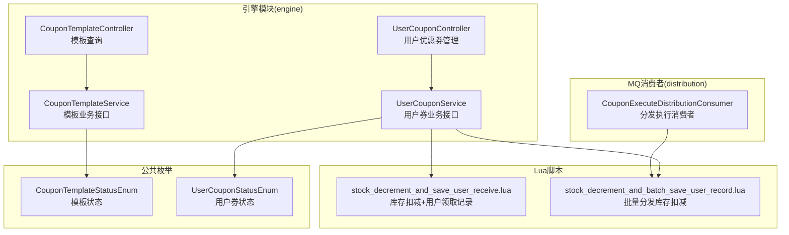
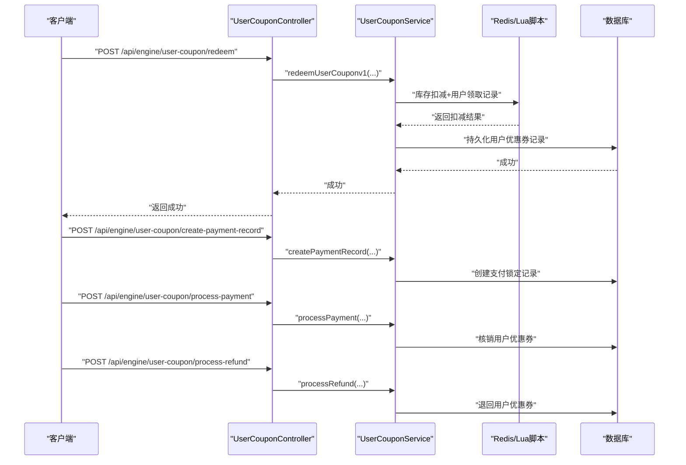
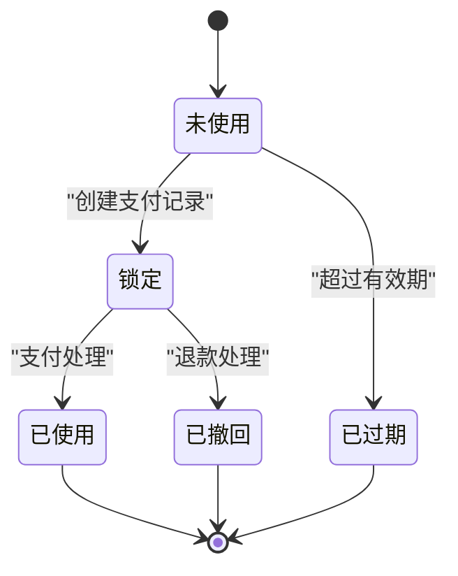
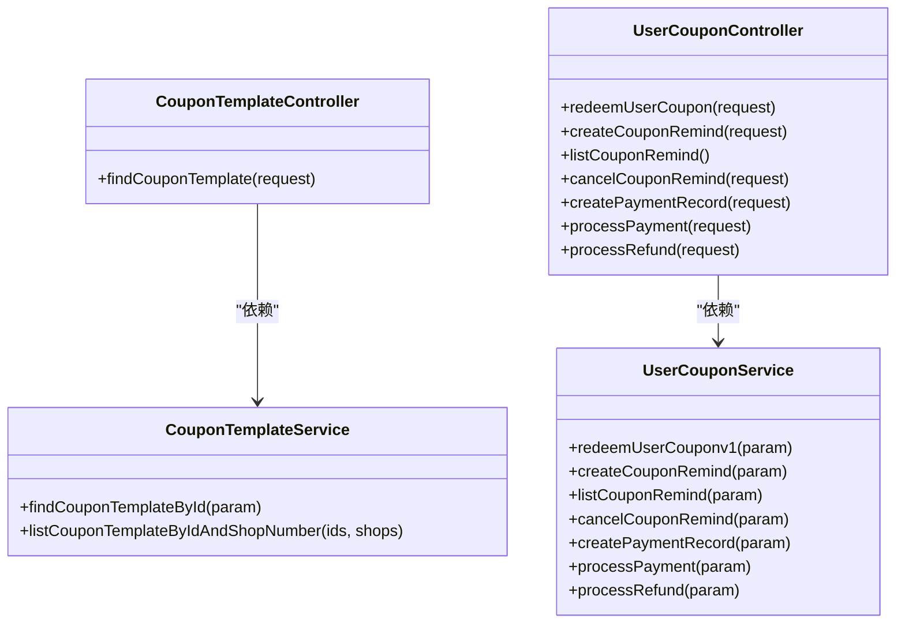

# 优惠券管理接口

<cite>
**本文引用的文件**
- [CouponTemplateController.java](file://engine/src/main/java/com/fengxin/maplecoupon/engine/controller/CouponTemplateController.java)
- [UserCouponController.java](file://engine/src/main/java/com/fengxin/maplecoupon/engine/controller/UserCouponController.java)
- [CouponTemplateService.java](file://engine/src/main/java/com/fengxin/maplecoupon/engine/service/CouponTemplateService.java)
- [UserCouponService.java](file://engine/src/main/java/com/fengxin/maplecoupon/engine/service/UserCouponService.java)
- [CouponTemplateQueryReqDTO.java](file://engine/src/main/java/com/fengxin/maplecoupon/engine/dto/req/CouponTemplateQueryReqDTO.java)
- [CouponTemplateQueryRespDTO.java](file://engine/src/main/java/com/fengxin/maplecoupon/engine/dto/resp/CouponTemplateQueryRespDTO.java)
- [CouponTemplateRedeemReqDTO.java](file://engine/src/main/java/com/fengxin/maplecoupon/engine/dto/req/CouponTemplateRedeemReqDTO.java)
- [CouponTemplateRemindTimeReqDTO.java](file://engine/src/main/java/com/fengxin/maplecoupon/engine/dto/req/CouponTemplateRemindTimeReqDTO.java)
- [CouponTemplateRemindCancelReqDTO.java](file://engine/src/main/java/com/fengxin/maplecoupon/engine/dto/req/CouponTemplateRemindCancelReqDTO.java)
- [CouponTemplateRemindQueryReqDTO.java](file://engine/src/main/java/com/fengxin/maplecoupon/engine/dto/req/CouponTemplateRemindQueryReqDTO.java)
- [CouponTemplateRemindQueryRespDTO.java](file://engine/src/main/java/com/fengxin/maplecoupon/engine/dto/resp/CouponTemplateRemindQueryRespDTO.java)
- [CouponCreatePaymentReqDTO.java](file://engine/src/main/java/com/fengxin/maplecoupon/engine/dto/req/CouponCreatePaymentReqDTO.java)
- [CouponProcessPaymentReqDTO.java](file://engine/src/main/java/com/fengxin/maplecoupon/engine/dto/req/CouponProcessPaymentReqDTO.java)
- [CouponProcessRefundReqDTO.java](file://engine/src/main/java/com/fengxin/maplecoupon/engine/dto/req/CouponProcessRefundReqDTO.java)
- [CouponTemplateStatusEnum.java](file://engine/src/main/java/com/fengxin/maplecoupon/engine/common/enums/CouponTemplateStatusEnum.java)
- [UserCouponStatusEnum.java](file://engine/src/main/java/com/fengxin/maplecoupon/engine/common/enums/UserCouponStatusEnum.java)
- [stock_decrement_and_save_user_receive.lua](file://engine/src/main/resources/lua/stock_decrement_and_save_user_receive.lua)
- [stock_decrement_and_batch_save_user_record.lua](file://distribution/src/main/resources/lua/stock_decrement_and_batch_save_user_record.lua)
- [CouponExecuteDistributionConsumer.java](file://distribution/src/main/java/com/fengxin/maplecoupon/distribution/mq/consumer/CouponExecuteDistributionConsumer.java)
</cite>

## 目录
1. [简介](#简介)
2. [项目结构](#项目结构)
3. [核心组件](#核心组件)
4. [架构总览](#架构总览)
5. [详细组件分析](#详细组件分析)
6. [依赖分析](#依赖分析)
7. [性能考虑](#性能考虑)
8. [故障排查指南](#故障排查指南)
9. [结论](#结论)
10. [附录](#附录)

## 简介
本文件为 MapleCoupon 系统的优惠券管理接口文档，覆盖引擎模块（engine）中的优惠券模板与用户优惠券相关接口，重点说明以下内容：
- 优惠券模板查询接口
- 用户优惠券兑换、提醒设置与查询、取消提醒
- 用户下单锁定优惠券、支付核销、退款返还的结算流程
- 接口请求参数、响应结构、状态枚举
- 优惠券生命周期管理（从创建到核销）
- 库存扣减与并发控制的技术实现要点
- 实际调用示例与常见错误处理建议

## 项目结构
MapleCoupon 采用多模块架构，优惠券管理相关能力主要集中在 engine 模块的控制器与服务层，配合枚举、DTO、Lua 脚本与 MQ 消费者完成高并发下的库存与状态流转。

图表来源
- [CouponTemplateController.java:21-33](file://engine/src/main/java/com/fengxin/maplecoupon/engine/controller/CouponTemplateController.java#L21-L33)
- [UserCouponController.java:26-82](file://engine/src/main/java/com/fengxin/maplecoupon/engine/controller/UserCouponController.java#L26-L82)
- [CouponTemplateService.java:18-37](file://engine/src/main/java/com/fengxin/maplecoupon/engine/service/CouponTemplateService.java#L18-L37)
- [UserCouponService.java:15-80](file://engine/src/main/java/com/fengxin/maplecoupon/engine/service/UserCouponService.java#L15-L80)
- [CouponTemplateStatusEnum.java:14-23](file://engine/src/main/java/com/fengxin/maplecoupon/engine/common/enums/CouponTemplateStatusEnum.java#L14-L23)
- [UserCouponStatusEnum.java:14-42](file://engine/src/main/java/com/fengxin/maplecoupon/engine/common/enums/UserCouponStatusEnum.java#L14-L42)
- [stock_decrement_and_save_user_receive.lua:1-58](file://engine/src/main/resources/lua/stock_decrement_and_save_user_receive.lua#L1-L58)
- [stock_decrement_and_batch_save_user_record.lua:1-33](file://distribution/src/main/resources/lua/stock_decrement_and_batch_save_user_record.lua#L1-L33)
- [CouponExecuteDistributionConsumer.java:252-257](file://distribution/src/main/java/com/fengxin/maplecoupon/distribution/mq/consumer/CouponExecuteDistributionConsumer.java#L252-L257)

章节来源
- [CouponTemplateController.java:1-34](file://engine/src/main/java/com/fengxin/maplecoupon/engine/controller/CouponTemplateController.java#L1-L34)
- [UserCouponController.java:1-83](file://engine/src/main/java/com/fengxin/maplecoupon/engine/controller/UserCouponController.java#L1-L83)

## 核心组件
- 控制器层
  - CouponTemplateController：提供模板查询接口
  - UserCouponController：提供兑换、提醒、结算单创建与处理、退款等接口
- 服务层
  - CouponTemplateService：模板查询与批量查询
  - UserCouponService：兑换、提醒、结算单创建与处理、退款
- 枚举
  - CouponTemplateStatusEnum：模板状态（生效中/已结束）
  - UserCouponStatusEnum：用户券状态（未使用/锁定/已使用/已过期/已撤回）

章节来源
- [CouponTemplateService.java:18-37](file://engine/src/main/java/com/fengxin/maplecoupon/engine/service/CouponTemplateService.java#L18-L37)
- [UserCouponService.java:15-80](file://engine/src/main/java/com/fengxin/maplecoupon/engine/service/UserCouponService.java#L15-L80)
- [CouponTemplateStatusEnum.java:14-23](file://engine/src/main/java/com/fengxin/maplecoupon/engine/common/enums/CouponTemplateStatusEnum.java#L14-L23)
- [UserCouponStatusEnum.java:14-42](file://engine/src/main/java/com/fengxin/maplecoupon/engine/common/enums/UserCouponStatusEnum.java#L14-L42)

## 架构总览
下图展示了用户通过引擎模块接口完成优惠券生命周期管理的整体流程。

图表来源
- [UserCouponController.java:32-80](file://engine/src/main/java/com/fengxin/maplecoupon/engine/controller/UserCouponController.java#L32-L80)
- [UserCouponService.java:15-80](file://engine/src/main/java/com/fengxin/maplecoupon/engine/service/UserCouponService.java#L15-L80)
- [stock_decrement_and_save_user_receive.lua:1-58](file://engine/src/main/resources/lua/stock_decrement_and_save_user_receive.lua#L1-L58)

## 详细组件分析

### 优惠券模板查询接口
- 接口描述：根据店铺编号与模板ID查询模板详情
- 请求方法与路径：GET /api/engine/coupon-template/query
- 请求参数
  - shopNumber：店铺编号（字符串，必填）
  - couponTemplateId：模板ID（字符串，必填）
- 响应数据
  - id：模板ID
  - name：模板名称
  - shopNumber：店铺编号
  - source：优惠券来源（0：店铺券；1：平台券）
  - target：优惠对象（0：商品专属；1：全店通用）
  - goods：优惠商品编码
  - type：优惠类型（0：立减券；1：满减券；2：折扣券）
  - validStartTime：有效期开始时间
  - validEndTime：有效期结束时间
  - stock：库存
  - receiveRule：领取规则
  - consumeRule：消耗规则
  - status：模板状态（0：生效中；1：已结束）

章节来源
- [CouponTemplateController.java:27-31](file://engine/src/main/java/com/fengxin/maplecoupon/engine/controller/CouponTemplateController.java#L27-L31)
- [CouponTemplateQueryReqDTO.java:18-33](file://engine/src/main/java/com/fengxin/maplecoupon/engine/dto/req/CouponTemplateQueryReqDTO.java#L18-L33)
- [CouponTemplateQueryRespDTO.java:17-98](file://engine/src/main/java/com/fengxin/maplecoupon/engine/dto/resp/CouponTemplateQueryRespDTO.java#L17-L98)
- [CouponTemplateStatusEnum.java:14-23](file://engine/src/main/java/com/fengxin/maplecoupon/engine/common/enums/CouponTemplateStatusEnum.java#L14-L23)

### 用户优惠券兑换接口
- 接口描述：用户兑换指定模板的优惠券（高并发场景，类似“秒杀”）
- 请求方法与路径：POST /api/engine/user-coupon/redeem
- 请求参数
  - source：券来源（0：领券中心；1：平台发放；2：店铺领取）
  - shopNumber：店铺编号（字符串，必填）
  - couponTemplateId：模板ID（字符串，必填）
- 响应：成功即返回空结果
- 并发与库存控制
  - 使用 Lua 脚本原子性地检查库存、用户领取上限并扣减库存
  - 返回组合状态码用于快速判定失败原因（如库存不足、已达上限）

章节来源
- [UserCouponController.java:32-37](file://engine/src/main/java/com/fengxin/maplecoupon/engine/controller/UserCouponController.java#L32-L37)
- [CouponTemplateRedeemReqDTO.java:16-38](file://engine/src/main/java/com/fengxin/maplecoupon/engine/dto/req/CouponTemplateRedeemReqDTO.java#L16-L38)
- [stock_decrement_and_save_user_receive.lua:1-58](file://engine/src/main/resources/lua/stock_decrement_and_save_user_receive.lua#L1-L58)

### 优惠券提醒设置与查询
- 设置提醒
  - 接口：POST /api/engine/coupon-template-remind/create
  - 请求参数：couponTemplateId、shopNumber、type（提醒方式）、remindTime（提醒时间）
- 查询提醒
  - 接口：GET /api/engine/coupon-template-remind/list
  - 请求参数：userId（通过上下文注入）
  - 响应：包含模板基础信息与按顺序一一对应的提醒时间与提醒类型列表
- 取消提醒
  - 接口：POST /api/engine/coupon-template-remind/cancel
  - 请求参数：shopNumber、couponTemplateId、remindTime、type

章节来源
- [UserCouponController.java:39-59](file://engine/src/main/java/com/fengxin/maplecoupon/engine/controller/UserCouponController.java#L39-L59)
- [CouponTemplateRemindTimeReqDTO.java:15-43](file://engine/src/main/java/com/fengxin/maplecoupon/engine/dto/req/CouponTemplateRemindTimeReqDTO.java#L15-L43)
- [CouponTemplateRemindCancelReqDTO.java:15-44](file://engine/src/main/java/com/fengxin/maplecoupon/engine/dto/req/CouponTemplateRemindCancelReqDTO.java#L15-L44)
- [CouponTemplateRemindQueryReqDTO.java:19-27](file://engine/src/main/java/com/fengxin/maplecoupon/engine/dto/req/CouponTemplateRemindQueryReqDTO.java#L19-L27)
- [CouponTemplateRemindQueryRespDTO.java:27-111](file://engine/src/main/java/com/fengxin/maplecoupon/engine/dto/resp/CouponTemplateRemindQueryRespDTO.java#L27-L111)

### 用户下单锁定与支付核销
- 创建支付记录（锁定优惠券）
  - 接口：POST /api/engine/user-coupon/create-payment-record
  - 请求参数：couponId、orderId、orderAmount、payableAmount、shopNumber、goodsList
- 支付处理（核销）
  - 接口：POST /api/engine/user-coupon/process-payment
  - 请求参数：couponId
- 退款处理（返还）
  - 接口：POST /api/engine/user-coupon/process-refund
  - 请求参数：couponId

章节来源
- [UserCouponController.java:61-80](file://engine/src/main/java/com/fengxin/maplecoupon/engine/controller/UserCouponController.java#L61-L80)
- [CouponCreatePaymentReqDTO.java:24-66](file://engine/src/main/java/com/fengxin/maplecoupon/engine/dto/req/CouponCreatePaymentReqDTO.java#L24-L66)
- [CouponProcessPaymentReqDTO.java:16-28](file://engine/src/main/java/com/fengxin/maplecoupon/engine/dto/req/CouponProcessPaymentReqDTO.java#L16-L28)
- [CouponProcessRefundReqDTO.java:16-28](file://engine/src/main/java/com/fengxin/maplecoupon/engine/dto/req/CouponProcessRefundReqDTO.java#L16-L28)

### 优惠券生命周期管理
- 模板阶段
  - 创建：由商户后台或平台侧创建模板，设置有效期、库存、规则等
  - 生效：模板状态为“生效中”，用户可参与兑换
  - 结束：模板状态为“已结束”，不再允许兑换
- 用户券阶段
  - 未使用：用户成功兑换后处于未使用状态
  - 锁定：下单时创建支付记录，锁定优惠券
  - 已使用：支付成功后核销，状态变更为已使用
  - 已过期：超过有效期未使用
  - 已撤回：退款后返还，状态变更为已撤回

图表来源
- [UserCouponStatusEnum.java:14-42](file://engine/src/main/java/com/fengxin/maplecoupon/engine/common/enums/UserCouponStatusEnum.java#L14-L42)

## 依赖分析
- 控制器与服务
  - 控制器仅负责参数接收与结果封装，具体业务逻辑委托给服务层
- 服务与数据访问
  - 服务层通过数据库与 Redis/Lua 脚本完成库存与状态变更
- 并发与幂等
  - 兑换接口使用幂等注解防止重复提交
  - 库存扣减通过 Lua 原子脚本保证一致性

图表来源
- [CouponTemplateController.java:21-33](file://engine/src/main/java/com/fengxin/maplecoupon/engine/controller/CouponTemplateController.java#L21-L33)
- [UserCouponController.java:26-82](file://engine/src/main/java/com/fengxin/maplecoupon/engine/controller/UserCouponController.java#L26-L82)
- [CouponTemplateService.java:18-37](file://engine/src/main/java/com/fengxin/maplecoupon/engine/service/CouponTemplateService.java#L18-L37)
- [UserCouponService.java:15-80](file://engine/src/main/java/com/fengxin/maplecoupon/engine/service/UserCouponService.java#L15-L80)

## 性能考虑
- 兑换高并发
  - 使用 Lua 原子脚本进行库存检查与扣减，避免超卖
  - 对用户领取次数进行限流与过期控制，减少重复领取
- 批量分发
  - 分发模块通过 Lua 脚本批量扣减库存并记录用户集合，提升吞吐
- 数据库与分片
  - 模板与用户券均配置了分片策略，降低热点写入压力
- 缓存与消息
  - 通过 MQ 异步处理核销、提醒等事件，削峰填谷

章节来源
- [stock_decrement_and_save_user_receive.lua:1-58](file://engine/src/main/resources/lua/stock_decrement_and_save_user_receive.lua#L1-L58)
- [stock_decrement_and_batch_save_user_record.lua:1-33](file://distribution/src/main/resources/lua/stock_decrement_and_batch_save_user_record.lua#L1-L33)
- [CouponExecuteDistributionConsumer.java:252-257](file://distribution/src/main/java/com/fengxin/maplecoupon/distribution/mq/consumer/CouponExecuteDistributionConsumer.java#L252-L257)

## 故障排查指南
- 兑换失败
  - 库存不足：检查模板库存与 Redis 中的剩余库存
  - 达到领取上限：确认用户领取次数与上限配置
  - 参数校验失败：确保 shopNumber、couponTemplateId、source 等参数非空且格式正确
- 提醒设置/取消异常
  - 确认提醒时间与提醒方式参数合法
  - 检查用户上下文是否正确注入
- 结算单处理
  - 支付核销失败：检查订单状态与用户券状态是否匹配
  - 退款失败：确认退款回调是否触发，核对券状态是否回到可用

章节来源
- [CouponTemplateRedeemReqDTO.java:16-38](file://engine/src/main/java/com/fengxin/maplecoupon/engine/dto/req/CouponTemplateRedeemReqDTO.java#L16-L38)
- [CouponTemplateRemindTimeReqDTO.java:15-43](file://engine/src/main/java/com/fengxin/maplecoupon/engine/dto/req/CouponTemplateRemindTimeReqDTO.java#L15-L43)
- [CouponTemplateRemindCancelReqDTO.java:15-44](file://engine/src/main/java/com/fengxin/maplecoupon/engine/dto/req/CouponTemplateRemindCancelReqDTO.java#L15-L44)
- [CouponCreatePaymentReqDTO.java:24-66](file://engine/src/main/java/com/fengxin/maplecoupon/engine/dto/req/CouponCreatePaymentReqDTO.java#L24-L66)
- [CouponProcessPaymentReqDTO.java:16-28](file://engine/src/main/java/com/fengxin/maplecoupon/engine/dto/req/CouponProcessPaymentReqDTO.java#L16-L28)
- [CouponProcessRefundReqDTO.java:16-28](file://engine/src/main/java/com/fengxin/maplecoupon/engine/dto/req/CouponProcessRefundReqDTO.java#L16-L28)

## 结论
本接口文档梳理了 MapleCoupon 系统中优惠券模板与用户优惠券的全链路管理能力，明确了各接口的职责、参数与响应结构，并结合枚举与 Lua 脚本说明了库存与并发控制的关键实现。建议在生产环境中结合幂等、限流与异步消息机制，保障高并发场景下的稳定性与一致性。

## 附录

### 接口清单与示例

- 模板查询
  - 方法：GET
  - 路径：/api/engine/coupon-template/query
  - 示例请求参数：shopNumber=1810714735922956666&couponTemplateId=1810966706881941507
  - 响应：模板详情（含有效期、库存、规则、状态）

- 用户兑换
  - 方法：POST
  - 路径：/api/engine/user-coupon/redeem
  - 示例请求体：
    - source: 0
    - shopNumber: "1810714735922956666"
    - couponTemplateId: "1810966706881941507"

- 设置提醒
  - 方法：POST
  - 路径：/api/engine/coupon-template-remind/create
  - 示例请求体：
    - couponTemplateId: "xxxxxx"
    - shopNumber: "1810714735922956666"
    - type: 0
    - remindTime: 5

- 查询提醒
  - 方法：GET
  - 路径：/api/engine/coupon-template-remind/list
  - 示例请求参数：userId=1810518709471555585
  - 响应：模板基础信息 + 提醒时间与类型列表

- 取消提醒
  - 方法：POST
  - 路径：/api/engine/coupon-template-remind/cancel
  - 示例请求体：
    - shopNumber: "1810714735922956666"
    - couponTemplateId: "1810966706881941507"
    - remindTime: 15
    - type: 0

- 创建支付记录（锁定）
  - 方法：POST
  - 路径：/api/engine/user-coupon/create-payment-record
  - 示例请求体：
    - couponId: 123456789
    - orderId: 987654321
    - orderAmount: 100.00
    - payableAmount: 80.00
    - shopNumber: "1810714735922956666"
    - goodsList: []

- 支付处理（核销）
  - 方法：POST
  - 路径：/api/engine/user-coupon/process-payment
  - 示例请求体：
    - couponId: 123456789

- 退款处理（返还）
  - 方法：POST
  - 路径：/api/engine/user-coupon/process-refund
  - 示例请求体：
    - couponId: 123456789

### 状态枚举参考
- 模板状态
  - 0：生效中
  - 1：已结束
- 用户券状态
  - 0：未使用
  - 1：锁定
  - 2：已使用
  - 3：已过期
  - 4：已撤回

章节来源
- [CouponTemplateStatusEnum.java:14-23](file://engine/src/main/java/com/fengxin/maplecoupon/engine/common/enums/CouponTemplateStatusEnum.java#L14-L23)
- [UserCouponStatusEnum.java:14-42](file://engine/src/main/java/com/fengxin/maplecoupon/engine/common/enums/UserCouponStatusEnum.java#L14-L42)