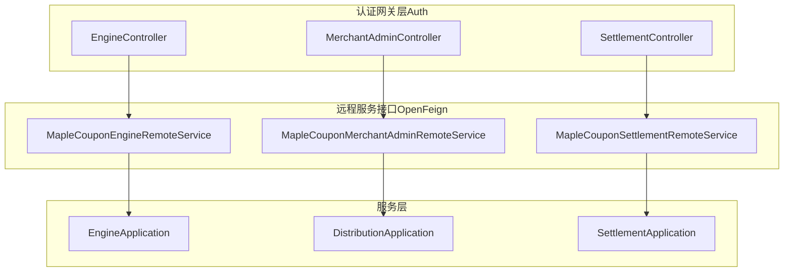
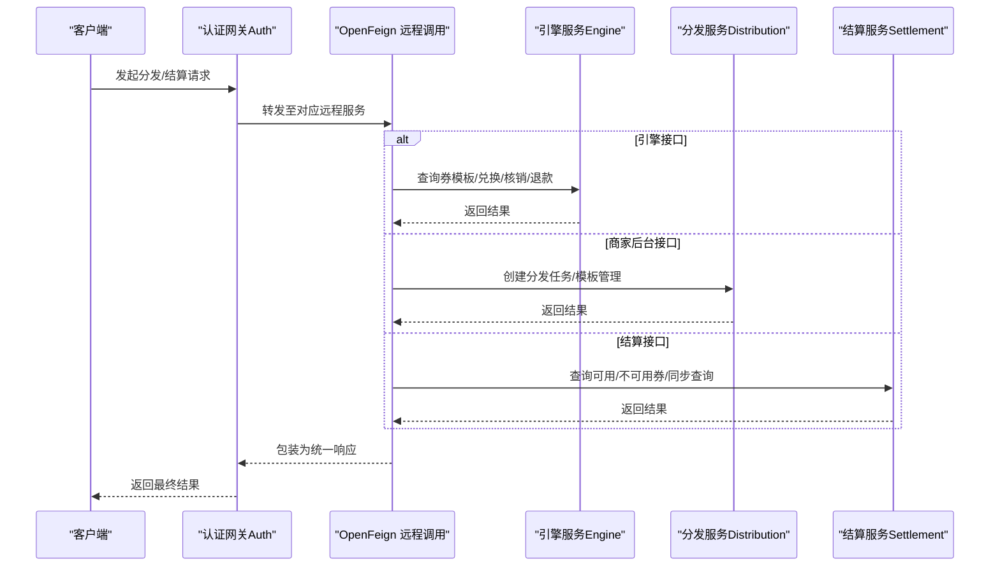
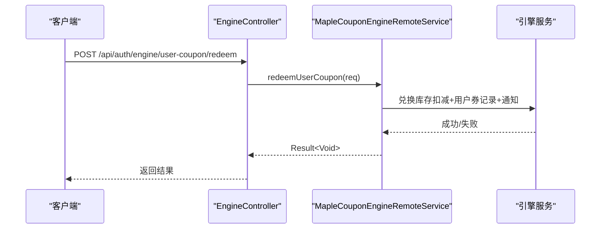
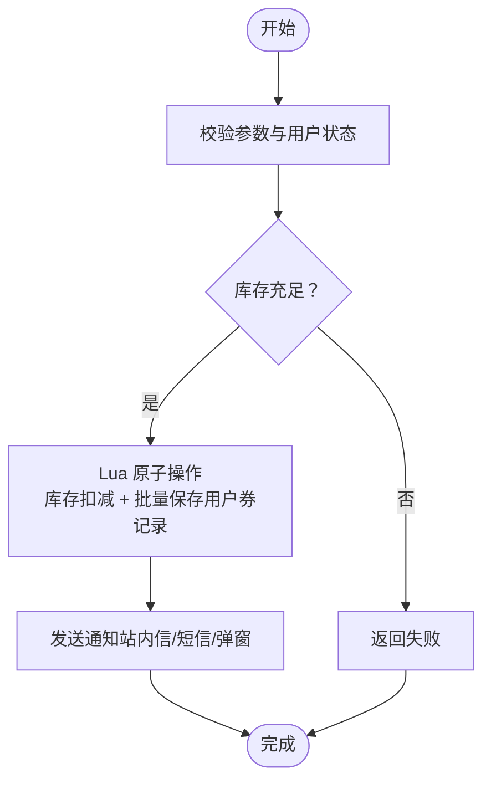
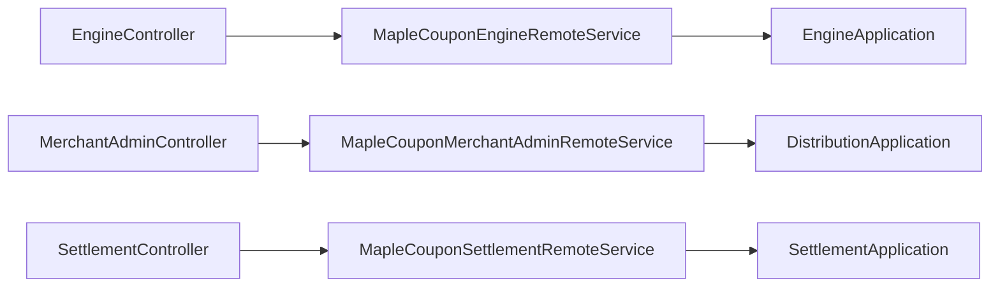

# 分发与结算接口

<cite>
**本文引用的文件**
- [EngineController.java](file://auth/src/main/java/com/fengxin/maplecoupon/auth/controller/EngineController.java)
- [MerchantAdminController.java](file://auth/src/main/java/com/fengxin/maplecoupon/auth/controller/MerchantAdminController.java)
- [SettlementController.java](file://auth/src/main/java/com/fengxin/maplecoupon/auth/controller/SettlementController.java)
- [MapleCouponEngineRemoteService.java](file://auth/src/main/java/com/fengxin/maplecoupon/auth/remote/MapleCouponEngineRemoteService.java)
- [MapleCouponMerchantAdminRemoteService.java](file://auth/src/main/java/com/fengxin/maplecoupon/auth/remote/MapleCouponMerchantAdminRemoteService.java)
- [MapleCouponSettlementRemoteService.java](file://auth/src/main/java/com/fengxin/maplecoupon/auth/remote/MapleCouponSettlementRemoteService.java)
- [EngineApplication.java](file://engine/src/main/java/com/fengxin/maplecoupon/engine/EngineApplication.java)
- [DistributionApplication.java](file://distribution/src/main/java/com/fengxin/maplecoupon/distribution/DistributionApplication.java)
- [SettlementApplication.java](file://settlement/src/main/java/com/fengxin/maplecoupon/settlement/SettlementApplication.java)
</cite>

## 目录
1. [简介](#简介)
2. [项目结构](#项目结构)
3. [核心组件](#核心组件)
4. [架构总览](#架构总览)
5. [详细组件分析](#详细组件分析)
6. [依赖分析](#依赖分析)
7. [性能考虑](#性能考虑)
8. [故障排查指南](#故障排查指南)
9. [结论](#结论)
10. [附录：接口规范与示例](#附录接口规范与示例)

## 简介
本文件面向MapleCoupon系统的“分发与结算”相关接口，聚焦以下目标：
- 全面梳理分发（优惠券发放）与结算（价格计算与优惠核销）相关的接口规范
- 深入解析EngineController、MerchantAdminController、SettlementController等控制器的核心接口
- 描述分发接口的调用流程（库存扣减、用户记录创建、通知发送等）
- 说明结算接口的价格计算逻辑（满减规则、折扣计算、优惠券抵扣等）
- 提供请求/响应示例，覆盖订单查询、优惠券使用、结算结果等数据格式
- 说明分布式事务处理机制与幂等性保障
- 给出性能优化建议与高并发最佳实践
- 提供API监控与调试方法，帮助快速定位问题

## 项目结构
MapleCoupon采用多模块微服务架构，围绕“引擎服务（Engine）”、“分发服务（Distribution）”、“结算服务（Settlement）”以及“认证网关与远程调用（Auth）”协同工作：
- 认证网关层通过OpenFeign远程调用各服务接口
- 引擎服务负责券模板管理、用户券状态、支付/退款核销等
- 分发服务负责批量分发、任务调度、库存扣减与用户记录写入
- 结算服务负责订单金额计算与优惠券可用性查询

图表来源
- [EngineController.java:1-79](file://auth/src/main/java/com/fengxin/maplecoupon/auth/controller/EngineController.java#L1-L79)
- [MerchantAdminController.java:1-76](file://auth/src/main/java/com/fengxin/maplecoupon/auth/controller/MerchantAdminController.java#L1-L76)
- [SettlementController.java:1-36](file://auth/src/main/java/com/fengxin/maplecoupon/auth/controller/SettlementController.java#L1-L36)
- [MapleCouponEngineRemoteService.java:1-50](file://auth/src/main/java/com/fengxin/maplecoupon/auth/remote/MapleCouponEngineRemoteService.java#L1-L50)
- [MapleCouponMerchantAdminRemoteService.java:1-48](file://auth/src/main/java/com/fengxin/maplecoupon/auth/remote/MapleCouponMerchantAdminRemoteService.java#L1-L48)
- [MapleCouponSettlementRemoteService.java:1-25](file://auth/src/main/java/com/fengxin/maplecoupon/auth/remote/MapleCouponSettlementRemoteService.java#L1-L25)
- [EngineApplication.java:1-19](file://engine/src/main/java/com/fengxin/maplecoupon/engine/EngineApplication.java#L1-L19)
- [DistributionApplication.java:1-19](file://distribution/src/main/java/com/fengxin/maplecoupon/distribution/DistributionApplication.java#L1-L19)
- [SettlementApplication.java:1-17](file://settlement/src/main/java/com/fengxin/maplecoupon/settlement/SettlementApplication.java#L1-L17)

章节来源
- [EngineController.java:1-79](file://auth/src/main/java/com/fengxin/maplecoupon/auth/controller/EngineController.java#L1-L79)
- [MerchantAdminController.java:1-76](file://auth/src/main/java/com/fengxin/maplecoupon/auth/controller/MerchantAdminController.java#L1-L76)
- [SettlementController.java:1-36](file://auth/src/main/java/com/fengxin/maplecoupon/auth/controller/SettlementController.java#L1-L36)
- [EngineApplication.java:1-19](file://engine/src/main/java/com/fengxin/maplecoupon/engine/EngineApplication.java#L1-L19)
- [DistributionApplication.java:1-19](file://distribution/src/main/java/com/fengxin/maplecoupon/distribution/DistributionApplication.java#L1-L19)
- [SettlementApplication.java:1-17](file://settlement/src/main/java/com/fengxin/maplecoupon/settlement/SettlementApplication.java#L1-L17)

## 核心组件
- 引擎服务（Engine）：提供券模板查询、用户券兑换、支付/退款核销、提醒设置等能力
- 分发服务（Distribution）：负责批量分发、库存扣减、用户记录创建、通知发送等
- 结算服务（Settlement）：负责订单金额计算与优惠券可用性查询
- 认证网关层（Auth）：统一暴露REST接口，内部通过OpenFeign调用具体服务

章节来源
- [EngineController.java:1-79](file://auth/src/main/java/com/fengxin/maplecoupon/auth/controller/EngineController.java#L1-L79)
- [MerchantAdminController.java:1-76](file://auth/src/main/java/com/fengxin/maplecoupon/auth/controller/MerchantAdminController.java#L1-L76)
- [SettlementController.java:1-36](file://auth/src/main/java/com/fengxin/maplecoupon/auth/controller/SettlementController.java#L1-L36)
- [EngineApplication.java:1-19](file://engine/src/main/java/com/fengxin/maplecoupon/engine/EngineApplication.java#L1-L19)
- [DistributionApplication.java:1-19](file://distribution/src/main/java/com/fengxin/maplecoupon/distribution/DistributionApplication.java#L1-L19)
- [SettlementApplication.java:1-17](file://settlement/src/main/java/com/fengxin/maplecoupon/settlement/SettlementApplication.java#L1-L17)

## 架构总览
下图展示了从认证网关到各服务的调用链路与职责边界：

图表来源
- [EngineController.java:1-79](file://auth/src/main/java/com/fengxin/maplecoupon/auth/controller/EngineController.java#L1-L79)
- [MerchantAdminController.java:1-76](file://auth/src/main/java/com/fengxin/maplecoupon/auth/controller/MerchantAdminController.java#L1-L76)
- [SettlementController.java:1-36](file://auth/src/main/java/com/fengxin/maplecoupon/auth/controller/SettlementController.java#L1-L36)
- [MapleCouponEngineRemoteService.java:1-50](file://auth/src/main/java/com/fengxin/maplecoupon/auth/remote/MapleCouponEngineRemoteService.java#L1-L50)
- [MapleCouponMerchantAdminRemoteService.java:1-48](file://auth/src/main/java/com/fengxin/maplecoupon/auth/remote/MapleCouponMerchantAdminRemoteService.java#L1-L48)
- [MapleCouponSettlementRemoteService.java:1-25](file://auth/src/main/java/com/fengxin/maplecoupon/auth/remote/MapleCouponSettlementRemoteService.java#L1-L25)

## 详细组件分析

### 引擎服务接口（EngineController）
- 接口概览
  - 查询优惠券模板
  - 兑换优惠券模板（高并发“秒杀”场景）
  - 设置/查询/取消优惠券提醒
  - 创建支付记录（下单锁定）
  - 处理支付（核销）
  - 处理退款（返还）

- 关键流程说明
  - 兑换流程（高并发）
    - 验证参数与用户状态
    - 扣减库存（Lua原子操作）
    - 批量保存用户券记录（Lua原子操作）
    - 发送通知（站内信/短信/弹窗）
  - 支付/退款流程
    - 支付成功后核销已锁定的券
    - 退款成功后返还券并关闭过期状态

图表来源
- [EngineController.java:35-39](file://auth/src/main/java/com/fengxin/maplecoupon/auth/controller/EngineController.java#L35-L39)
- [MapleCouponEngineRemoteService.java:29-30](file://auth/src/main/java/com/fengxin/maplecoupon/auth/remote/MapleCouponEngineRemoteService.java#L29-L30)

章节来源
- [EngineController.java:27-77](file://auth/src/main/java/com/fengxin/maplecoupon/auth/controller/EngineController.java#L27-L77)
- [MapleCouponEngineRemoteService.java:24-48](file://auth/src/main/java/com/fengxin/maplecoupon/auth/remote/MapleCouponEngineRemoteService.java#L24-L48)

### 商家后台接口（MerchantAdminController）
- 接口概览
  - 创建分发任务
  - 创建/分页查询/查询详情/增加发行量/终止/删除券模板

- 幂等性与防重
  - 使用注解进行重复提交防护，避免短时间内的重复任务或模板变更

章节来源
- [MerchantAdminController.java:24-74](file://auth/src/main/java/com/fengxin/maplecoupon/auth/controller/MerchantAdminController.java#L24-L74)
- [MapleCouponMerchantAdminRemoteService.java:20-46](file://auth/src/main/java/com/fengxin/maplecoupon/auth/remote/MapleCouponMerchantAdminRemoteService.java#L20-L46)

### 结算服务接口（SettlementController）
- 接口概览
  - 异步查询用户可用/不可用券列表
  - 同步查询用户可用/不可用券列表

- 适用场景
  - 异步：对实时性要求不高，降低调用延迟
  - 同步：下单前必须确认可用券与抵扣金额

章节来源
- [SettlementController.java:24-34](file://auth/src/main/java/com/fengxin/maplecoupon/auth/controller/SettlementController.java#L24-L34)
- [MapleCouponSettlementRemoteService.java:19-23](file://auth/src/main/java/com/fengxin/maplecoupon/auth/remote/MapleCouponSettlementRemoteService.java#L19-L23)

### 分发服务与库存扣减流程
- 流程要点
  - 批次化任务驱动分发
  - Lua脚本原子性执行：库存扣减 + 用户券记录批量保存
  - MQ异步通知：站内信/短信/弹窗
- 幂等性保障
  - 基于任务ID/用户ID/模板ID的唯一索引
  - MQ去重消费（幂等注解）

图表来源
- [EngineController.java:35-39](file://auth/src/main/java/com/fengxin/maplecoupon/auth/controller/EngineController.java#L35-L39)
- [MapleCouponEngineRemoteService.java:29-30](file://auth/src/main/java/com/fengxin/maplecoupon/auth/remote/MapleCouponEngineRemoteService.java#L29-L30)

## 依赖分析
- 认证网关层仅作为入口与远程调用适配器，不承载业务逻辑
- 引擎/分发/结算服务各自独立部署，通过OpenFeign进行跨服务通信
- 服务间通过MQ实现异步解耦（如通知、任务执行、核销/退款事件）

图表来源
- [EngineController.java:1-79](file://auth/src/main/java/com/fengxin/maplecoupon/auth/controller/EngineController.java#L1-L79)
- [MerchantAdminController.java:1-76](file://auth/src/main/java/com/fengxin/maplecoupon/auth/controller/MerchantAdminController.java#L1-L76)
- [SettlementController.java:1-36](file://auth/src/main/java/com/fengxin/maplecoupon/auth/controller/SettlementController.java#L1-L36)
- [MapleCouponEngineRemoteService.java:1-50](file://auth/src/main/java/com/fengxin/maplecoupon/auth/remote/MapleCouponEngineRemoteService.java#L1-L50)
- [MapleCouponMerchantAdminRemoteService.java:1-48](file://auth/src/main/java/com/fengxin/maplecoupon/auth/remote/MapleCouponMerchantAdminRemoteService.java#L1-L48)
- [MapleCouponSettlementRemoteService.java:1-25](file://auth/src/main/java/com/fengxin/maplecoupon/auth/remote/MapleCouponSettlementRemoteService.java#L1-L25)
- [EngineApplication.java:1-19](file://engine/src/main/java/com/fengxin/maplecoupon/engine/EngineApplication.java#L1-L19)
- [DistributionApplication.java:1-19](file://distribution/src/main/java/com/fengxin/maplecoupon/distribution/DistributionApplication.java#L1-L19)
- [SettlementApplication.java:1-17](file://settlement/src/main/java/com/fengxin/maplecoupon/settlement/SettlementApplication.java#L1-L17)

## 性能考虑
- 原子性与Lua脚本
  - 使用Lua脚本在引擎侧实现库存扣减与用户券记录的原子写入，减少锁竞争与数据库往返
- 批量写入
  - 分发侧批量保存用户券记录，降低写放大
- MQ异步化
  - 通知与后续处理通过MQ异步执行，降低主流程延迟
- 缓存与布隆过滤器
  - 利用缓存与布隆过滤器预判用户/模板状态，减少无效查询
- 幂等与防重
  - 使用注解与MQ去重，避免重复提交与重复消费
- 数据分片
  - 用户/券表采用哈希分片策略，提升水平扩展能力

## 故障排查指南
- 常见问题定位
  - 兑换失败：检查库存是否充足、Lua脚本执行是否异常、用户状态是否有效
  - 通知未达：检查MQ消费者状态、消费者幂等配置、通知渠道可用性
  - 结算查询超时：评估异步/同步模式选择、数据库索引与分页参数
- 监控与日志
  - 开启OpenFeign调用链追踪，定位慢调用与错误
  - 在引擎/分发/结算服务中启用统一异常处理与全局错误码
- 快速验证
  - 使用最小化请求体复现问题，逐步缩小范围
  - 对比异步与同步查询结果，判断是否为异步延迟导致

## 结论
- 本方案通过“认证网关 + OpenFeign + 多服务”的架构，清晰划分了分发、结算与引擎职责
- 在高并发场景下，Lua原子操作、批量写入、MQ异步化与幂等设计共同保障了性能与一致性
- 建议在生产环境结合压测与容量规划，持续优化分片策略与缓存命中率

## 附录：接口规范与示例

### 引擎服务接口
- 查询优惠券模板
  - 方法与路径：GET /api/auth/engine/coupon-template/query
  - 请求参数：couponTemplateId（模板ID）、shopNumber（商户编号）
  - 响应：模板详情对象
- 兑换优惠券模板（高并发）
  - 方法与路径：POST /api/auth/engine/user-coupon/redeem
  - 请求体：兑换请求对象（含模板ID、用户ID、数量等）
  - 响应：空结果（成功/失败）
- 设置优惠券提醒时间
  - 方法与路径：POST /api/auth/engine/coupon-template-remind/create
  - 请求体：提醒时间设置请求
  - 响应：空结果
- 查询优惠券提醒列表
  - 方法与路径：GET /api/auth/engine/coupon-template-remind/list
  - 响应：提醒列表
- 取消优惠券提醒
  - 方法与路径：POST /api/auth/engine/coupon-template-remind/cancel
  - 请求体：取消提醒请求
  - 响应：空结果
- 创建支付记录（下单锁定）
  - 方法与路径：POST /api/auth/engine/user-coupon/create-payment-record
  - 请求体：创建支付记录请求
  - 响应：空结果
- 处理支付（核销）
  - 方法与路径：POST /api/auth/engine/user-coupon/process-payment
  - 请求体：支付处理请求
  - 响应：空结果
- 处理退款（返还）
  - 方法与路径：POST /api/auth/engine/user-coupon/process-refund
  - 请求体：退款处理请求
  - 响应：空结果

章节来源
- [EngineController.java:27-77](file://auth/src/main/java/com/fengxin/maplecoupon/auth/controller/EngineController.java#L27-L77)
- [MapleCouponEngineRemoteService.java:24-48](file://auth/src/main/java/com/fengxin/maplecoupon/auth/remote/MapleCouponEngineRemoteService.java#L24-L48)

### 商家后台接口
- 创建分发任务
  - 方法与路径：POST /api/auth/merchant-admin/coupon-task/create
  - 请求体：任务创建请求
  - 响应：空结果
- 创建优惠券模板
  - 方法与路径：POST /api/auth/merchant-admin/coupon-template/create
  - 请求体：模板保存请求
  - 响应：空结果
- 分页查询优惠券模板
  - 方法与路径：GET /api/auth/merchant-admin/coupon-template/page
  - 请求参数：name、target、goods、type、current、size
  - 响应：分页结果
- 查询优惠券模板详情
  - 方法与路径：GET /api/auth/merchant-admin/coupon-template/find
  - 请求参数：couponTemplateId
  - 响应：模板详情
- 增加发行量
  - 方法与路径：POST /api/auth/merchant-admin/coupon-template/increase-number
  - 请求体：增加发行量请求
  - 响应：空结果
- 终止优惠券模板
  - 方法与路径：POST /api/auth/merchant-admin/coupon-template/terminate
  - 请求体：终止请求
  - 响应：空结果
- 删除优惠券模板
  - 方法与路径：DELETE /api/auth/merchant-admin/coupon-template/delete
  - 请求参数：couponTemplateId
  - 响应：空结果

章节来源
- [MerchantAdminController.java:24-74](file://auth/src/main/java/com/fengxin/maplecoupon/auth/controller/MerchantAdminController.java#L24-L74)
- [MapleCouponMerchantAdminRemoteService.java:20-46](file://auth/src/main/java/com/fengxin/maplecoupon/auth/remote/MapleCouponMerchantAdminRemoteService.java#L20-L46)

### 结算服务接口
- 异步查询用户可用/不可用券列表
  - 方法与路径：POST /api/auth/settlement/coupon-query
  - 请求体：查询请求（用户ID、订单商品等）
  - 响应：券列表结果
- 同步查询用户可用/不可用券列表
  - 方法与路径：POST /api/auth/settlement/coupon-query-sync
  - 请求体：查询请求（用户ID、订单商品等）
  - 响应：券列表结果

章节来源
- [SettlementController.java:24-34](file://auth/src/main/java/com/fengxin/maplecoupon/auth/controller/SettlementController.java#L24-L34)
- [MapleCouponSettlementRemoteService.java:19-23](file://auth/src/main/java/com/fengxin/maplecoupon/auth/remote/MapleCouponSettlementRemoteService.java#L19-L23)

### 请求/响应示例（字段语义说明）
- 兑换请求（redeem）
  - 字段：templateId（模板ID）、userId（用户ID）、count（数量）
  - 示例值：templateId=“T001”，userId=“U123456”，count=1
- 支付处理请求（process-payment）
  - 字段：orderId（订单号）、userId（用户ID）、couponIds（使用券列表）
  - 示例值：orderId=“O987654321”，couponIds=[“C1”, “C2”]
- 退款处理请求（process-refund）
  - 字段：orderId（订单号）、userId（用户ID）、couponIds（返还券列表）
  - 示例值：orderId=“O987654321”，couponIds=[“C1”]
- 结算查询请求（coupon-query）
  - 字段：userId（用户ID）、goods（商品明细）、amount（订单原价）
  - 示例值：goods=[{id=“G1”, price=100}], amount=100

### 分布式事务与幂等性
- 分布式事务
  - 采用“本地消息表/事件驱动 + MQ”实现最终一致
  - 支付/退款核销通过MQ事件触发，确保券状态与订单状态一致
- 幂等性
  - 控制器层使用注解防止重复提交
  - MQ消费端使用幂等键（任务ID/订单号/用户券ID）去重

### 性能优化与高并发最佳实践
- 将热点接口拆分为异步/同步双通道，按需选择
- 使用Lua脚本与批量写入降低数据库压力
- 合理设置分页大小与索引，避免全表扫描
- 对高频查询引入缓存与布隆过滤器
- 严格控制MQ堆积，设置死信队列与告警

### API监控与调试
- 链路追踪
  - 为OpenFeign调用接入链路追踪，定位慢调用与错误
- 日志规范
  - 统一输出请求ID、用户ID、模板ID、订单号等关键上下文
- 告警策略
  - 调用失败率、响应时间、MQ堆积数、库存不足报警