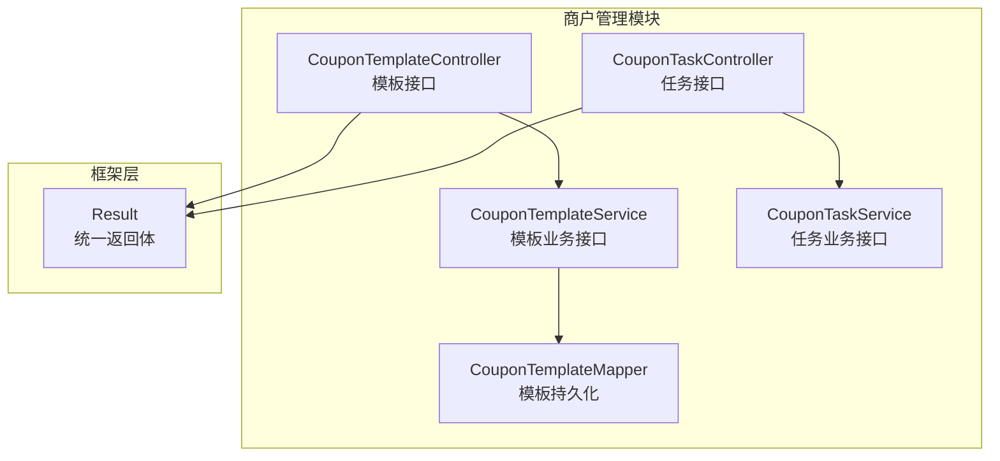
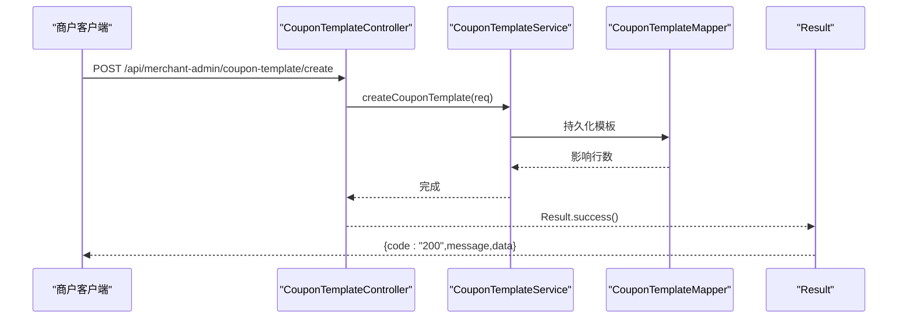
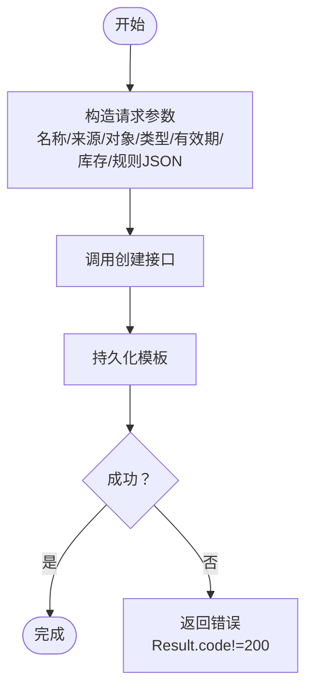
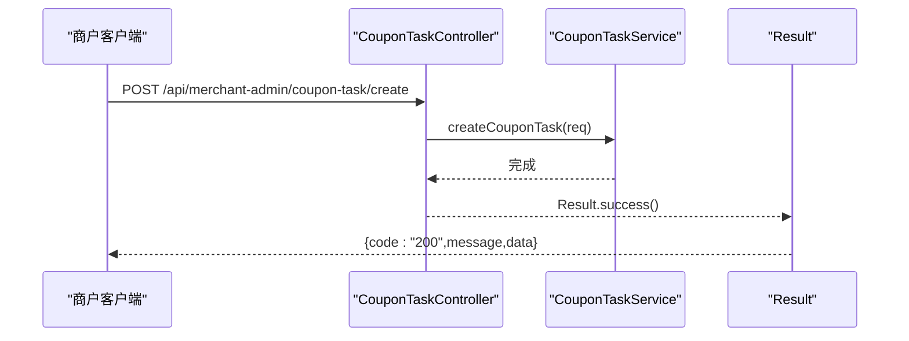
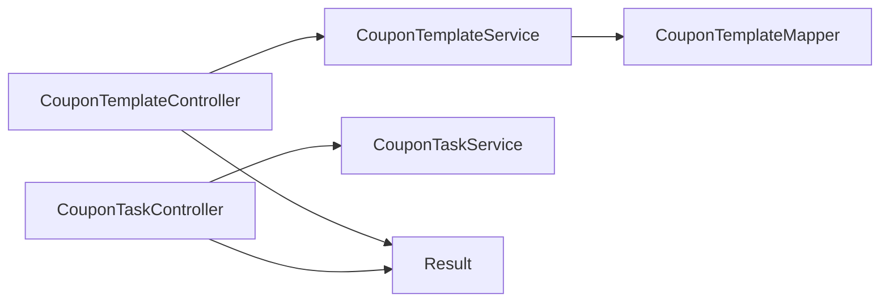

# 商家管理接口

<cite>
**本文引用的文件**
- [CouponTemplateController.java](file://merchant-admin/src/main/java/com/fengxin/maplecoupon/merchantadmin/controller/CouponTemplateController.java)
- [CouponTaskController.java](file://merchant-admin/src/main/java/com/fengxin/maplecoupon/merchantadmin/controller/CouponTaskController.java)
- [CouponTemplateSaveReqDTO.java](file://merchant-admin/src/main/java/com/fengxin/maplecoupon/merchantadmin/dto/req/CouponTemplateSaveReqDTO.java)
- [CouponTemplatePageQueryReqDTO.java](file://merchant-admin/src/main/java/com/fengxin/maplecoupon/merchantadmin/dto/req/CouponTemplatePageQueryReqDTO.java)
- [CouponTemplateNumberReqDTO.java](file://merchant-admin/src/main/java/com/fengxin/maplecoupon/merchantadmin/dto/req/CouponTemplateNumberReqDTO.java)
- [TerminateCouponTemplateReqDTO.java](file://merchant-admin/src/main/java/com/fengxin/maplecoupon/merchantadmin/dto/req/TerminateCouponTemplateReqDTO.java)
- [CouponTaskCreateReqDTO.java](file://merchant-admin/src/main/java/com/fengxin/maplecoupon/merchantadmin/dto/req/CouponTaskCreateReqDTO.java)
- [CouponTemplatePageQueryRespDTO.java](file://merchant-admin/src/main/java/com/fengxin/maplecoupon/merchantadmin/dto/resp/CouponTemplatePageQueryRespDTO.java)
- [CouponTemplateQueryRespDTO.java](file://merchant-admin/src/main/java/com/fengxin/maplecoupon/merchantadmin/dto/resp/CouponTemplateQueryRespDTO.java)
- [CouponTemplateStatusEnum.java](file://merchant-admin/src/main/java/com/fengxin/maplecoupon/merchantadmin/common/enums/CouponTemplateStatusEnum.java)
- [CouponTaskStatusEnum.java](file://merchant-admin/src/main/java/com/fengxin/maplecoupon/merchantadmin/common/enums/CouponTaskStatusEnum.java)
- [CouponTemplateService.java](file://merchant-admin/src/main/java/com/fengxin/maplecoupon/merchantadmin/service/CouponTemplateService.java)
- [CouponTaskService.java](file://merchant-admin/src/main/java/com/fengxin/maplecoupon/merchantadmin/service/CouponTaskService.java)
- [CouponTemplateMapper.java](file://merchant-admin/src/main/java/com/fengxin/maplecoupon/merchantadmin/dao/mapper/CouponTemplateMapper.java)
- [Result.java](file://framework/src/main/java/com/fengxin/web/Result.java)
- [ExcelGenerateTests.java](file://merchant-admin/src/test/java/com/fengxin/test/ExcelGenerateTests.java)
- [RowCountListener.java](file://merchant-admin/src/main/java/com/fengxin/maplecoupon/merchantadmin/service/handler/excel/RowCountListener.java)
</cite>

## 目录
1. [简介](#简介)
2. [项目结构](#项目结构)
3. [核心组件](#核心组件)
4. [架构总览](#架构总览)
5. [详细组件分析](#详细组件分析)
6. [依赖分析](#依赖分析)
7. [性能考虑](#性能考虑)
8. [故障排查指南](#故障排查指南)
9. [结论](#结论)
10. [附录](#附录)

## 简介
本文件面向MapleCoupon系统“商家管理后台”的优惠券模板与批次任务管理接口，覆盖以下能力：
- 模板生命周期管理：创建、编辑（追加发行量）、查询、终止、删除
- 批次任务管理：创建任务、触发执行、监控状态
- Excel导入导出：生成示例Excel、读取行数统计
- 权限与幂等：基于注解的幂等控制与统一返回体
- 错误处理：统一响应结构与常见异常场景说明

## 项目结构
- 控制层位于 merchant-admin 模块，分别暴露模板与任务两类REST接口
- DTO位于 merchant-admin 模块的 req/resp 包，承载请求与响应数据结构
- 枚举位于 merchant-admin/common/enums，用于状态与业务枚举
- 服务层接口位于 merchant-admin/service，DAO层位于 merchant-admin/dao/mapper
- 全局返回体 Result 定义于 framework 模块，所有接口统一返回 Result<T>

图表来源
- [CouponTemplateController.java:25-74](file://merchant-admin/src/main/java/com/fengxin/maplecoupon/merchantadmin/controller/CouponTemplateController.java#L25-L74)
- [CouponTaskController.java:25-40](file://merchant-admin/src/main/java/com/fengxin/maplecoupon/merchantadmin/controller/CouponTaskController.java#L25-L40)
- [CouponTemplateService.java:19-54](file://merchant-admin/src/main/java/com/fengxin/maplecoupon/merchantadmin/service/CouponTemplateService.java#L19-L54)
- [CouponTaskService.java:13-16](file://merchant-admin/src/main/java/com/fengxin/maplecoupon/merchantadmin/service/CouponTaskService.java#L13-L16)
- [CouponTemplateMapper.java:14-27](file://merchant-admin/src/main/java/com/fengxin/maplecoupon/merchantadmin/dao/mapper/CouponTemplateMapper.java#L14-L27)
- [Result.java:17-45](file://framework/src/main/java/com/fengxin/web/Result.java#L17-L45)

章节来源
- [CouponTemplateController.java:25-74](file://merchant-admin/src/main/java/com/fengxin/maplecoupon/merchantadmin/controller/CouponTemplateController.java#L25-L74)
- [CouponTaskController.java:25-40](file://merchant-admin/src/main/java/com/fengxin/maplecoupon/merchantadmin/controller/CouponTaskController.java#L25-L40)
- [Result.java:17-45](file://framework/src/main/java/com/fengxin/web/Result.java#L17-L45)

## 核心组件
- 模板控制器：提供模板创建、分页查询、详情查询、追加发行量、终止、删除等接口
- 任务控制器：提供批次任务创建接口
- DTO与枚举：定义模板与任务的请求/响应结构及状态枚举
- 服务接口：抽象模板与任务的业务逻辑
- DAO映射：提供模板追加发行量的SQL操作

章节来源
- [CouponTemplateController.java:25-74](file://merchant-admin/src/main/java/com/fengxin/maplecoupon/merchantadmin/controller/CouponTemplateController.java#L25-L74)
- [CouponTaskController.java:25-40](file://merchant-admin/src/main/java/com/fengxin/maplecoupon/merchantadmin/controller/CouponTaskController.java#L25-L40)
- [CouponTemplateService.java:19-54](file://merchant-admin/src/main/java/com/fengxin/maplecoupon/merchantadmin/service/CouponTemplateService.java#L19-L54)
- [CouponTaskService.java:13-16](file://merchant-admin/src/main/java/com/fengxin/maplecoupon/merchantadmin/service/CouponTaskService.java#L13-L16)
- [CouponTemplateMapper.java:14-27](file://merchant-admin/src/main/java/com/fengxin/maplecoupon/merchantadmin/dao/mapper/CouponTemplateMapper.java#L14-L27)

## 架构总览
- 接口层：REST控制器负责路由与参数绑定
- 业务层：服务接口定义模板与任务的业务行为
- 数据访问层：MyBatis Mapper封装数据库操作
- 统一返回：Result<T>封装code/message/data，前端统一解析

图表来源
- [CouponTemplateController.java:31-37](file://merchant-admin/src/main/java/com/fengxin/maplecoupon/merchantadmin/controller/CouponTemplateController.java#L31-L37)
- [CouponTemplateService.java:26-26](file://merchant-admin/src/main/java/com/fengxin/maplecoupon/merchantadmin/service/CouponTemplateService.java#L26-L26)
- [CouponTemplateMapper.java:14-27](file://merchant-admin/src/main/java/com/fengxin/maplecoupon/merchantadmin/dao/mapper/CouponTemplateMapper.java#L14-L27)
- [Result.java:17-45](file://framework/src/main/java/com/fengxin/web/Result.java#L17-L45)

## 详细组件分析

### 模板管理接口

- 接口概览
  - 创建模板：POST /api/merchant-admin/coupon-template/create
  - 分页查询：GET /api/merchant-admin/coupon-template/page
  - 查询详情：GET /api/merchant-admin/coupon-template/find
  - 追加发行量：POST /api/merchant-admin/coupon-template/increase-number
  - 终止模板：POST /api/merchant-admin/coupon-template/terminate
  - 删除模板：DELETE /api/merchant-admin/coupon-template/delete

- 请求参数与业务字段
  - 创建模板（CouponTemplateSaveReqDTO）
    - 名称、来源（店铺/平台）、优惠对象（商品专属/全店通用）、优惠商品编码
    - 优惠类型（立减/满减/折扣）、有效期起止时间、库存
    - 领取规则receiveRule（JSON字符串）、消耗规则consumeRule（JSON字符串）
  - 分页查询（CouponTemplatePageQueryReqDTO）
    - 继承分页Page，支持按名称、优惠对象、优惠商品编码、优惠类型过滤
  - 追加发行量（CouponTemplateNumberReqDTO）
    - 模板ID、增加数量
  - 终止模板（TerminateCouponTemplateReqDTO）
    - 模板ID
  - 删除模板（参数在URL）
    - 模板ID

- 响应数据结构
  - 分页查询返回（CouponTemplatePageQueryRespDTO）
    - 字段与创建模板一致，含有效期、库存、规则JSON
  - 详情查询返回（CouponTemplateQueryRespDTO）
    - 增加店铺编号、状态（生效中/已结束）

- 幂等与权限
  - 创建与追加发行量接口标注幂等注解，防止重复提交
  - 统一返回体Result，code=200表示成功

- 示例流程（模板创建）
  1) 准备模板参数（名称、来源、对象、类型、有效期、库存、规则JSON）
  2) 调用创建接口
  3) 成功后可继续调用“追加发行量”或“终止模板”

- 异常与错误处理
  - 参数校验失败：返回Result但code非200，message描述具体问题
  - 重复提交：幂等拦截后提示“请勿短时间内重复...”
  - 业务异常：服务层抛出时由全局异常处理统一包装为Result

章节来源
- [CouponTemplateController.java:31-71](file://merchant-admin/src/main/java/com/fengxin/maplecoupon/merchantadmin/controller/CouponTemplateController.java#L31-L71)
- [CouponTemplateSaveReqDTO.java:21-114](file://merchant-admin/src/main/java/com/fengxin/maplecoupon/merchantadmin/dto/req/CouponTemplateSaveReqDTO.java#L21-L114)
- [CouponTemplatePageQueryReqDTO.java:17-43](file://merchant-admin/src/main/java/com/fengxin/maplecoupon/merchantadmin/dto/req/CouponTemplatePageQueryReqDTO.java#L17-L43)
- [CouponTemplateNumberReqDTO.java:15-33](file://merchant-admin/src/main/java/com/fengxin/maplecoupon/merchantadmin/dto/req/CouponTemplateNumberReqDTO.java#L15-L33)
- [TerminateCouponTemplateReqDTO.java:20-26](file://merchant-admin/src/main/java/com/fengxin/maplecoupon/merchantadmin/dto/req/TerminateCouponTemplateReqDTO.java#L20-L26)
- [CouponTemplatePageQueryRespDTO.java:17-87](file://merchant-admin/src/main/java/com/fengxin/maplecoupon/merchantadmin/dto/resp/CouponTemplatePageQueryRespDTO.java#L17-L87)
- [CouponTemplateQueryRespDTO.java:17-99](file://merchant-admin/src/main/java/com/fengxin/maplecoupon/merchantadmin/dto/resp/CouponTemplateQueryRespDTO.java#L17-L99)
- [CouponTemplateStatusEnum.java:13-24](file://merchant-admin/src/main/java/com/fengxin/maplecoupon/merchantadmin/common/enums/CouponTemplateStatusEnum.java#L13-L24)
- [Result.java:17-45](file://framework/src/main/java/com/fengxin/web/Result.java#L17-L45)

### 批次任务管理接口

- 接口概览
  - 创建任务：POST /api/merchant-admin/coupon-task/create

- 请求参数（CouponTaskCreateReqDTO）
  - 任务名称、Excel文件绝对路径、通知方式（站内信/弹框/邮箱/短信，可多选）、模板ID、发送类型（立即/定时）、发送时间

- 响应
  - 成功返回Result.success()

- 执行与监控
  - 当前仅提供创建接口；执行与监控能力由任务调度与MQ消费链路实现，不在本控制器直接暴露

- Excel导入导出使用说明
  - 生成示例Excel：参考单元测试用例，输出到项目tmp目录下的Excel文件
  - 读取Excel：使用RowCountListener统计行数，便于任务拆分与并发控制

- 示例流程（批次创建）
  1) 使用ExcelGenerateTests生成示例Excel
  2) 在创建任务请求中填写文件绝对路径、模板ID、通知方式、发送类型与时间
  3) 调用创建接口，后续由任务调度与MQ异步分发

章节来源
- [CouponTaskController.java:32-38](file://merchant-admin/src/main/java/com/fengxin/maplecoupon/merchantadmin/controller/CouponTaskController.java#L32-L38)
- [CouponTaskCreateReqDTO.java:18-69](file://merchant-admin/src/main/java/com/fengxin/maplecoupon/merchantadmin/dto/req/CouponTaskCreateReqDTO.java#L18-L69)
- [ExcelGenerateTests.java:34-53](file://merchant-admin/src/test/java/com/fengxin/test/ExcelGenerateTests.java#L34-L53)
- [RowCountListener.java:13-27](file://merchant-admin/src/main/java/com/fengxin/maplecoupon/merchantadmin/service/handler/excel/RowCountListener.java#L13-L27)

### 关键流程图

#### 模板创建流程

图表来源
- [CouponTemplateController.java:31-37](file://merchant-admin/src/main/java/com/fengxin/maplecoupon/merchantadmin/controller/CouponTemplateController.java#L31-L37)
- [CouponTemplateSaveReqDTO.java:21-114](file://merchant-admin/src/main/java/com/fengxin/maplecoupon/merchantadmin/dto/req/CouponTemplateSaveReqDTO.java#L21-L114)

#### 批次任务创建流程

图表来源
- [CouponTaskController.java:32-38](file://merchant-admin/src/main/java/com/fengxin/maplecoupon/merchantadmin/controller/CouponTaskController.java#L32-L38)
- [CouponTaskService.java:14-14](file://merchant-admin/src/main/java/com/fengxin/maplecoupon/merchantadmin/service/CouponTaskService.java#L14-L14)

## 依赖分析
- 控制器依赖服务接口，服务接口依赖DAO映射
- 统一返回体Result在框架模块，所有接口均通过Results工具类返回
- 幂等注解用于防重复提交，提升接口稳定性

图表来源
- [CouponTemplateController.java:25-74](file://merchant-admin/src/main/java/com/fengxin/maplecoupon/merchantadmin/controller/CouponTemplateController.java#L25-L74)
- [CouponTaskController.java:25-40](file://merchant-admin/src/main/java/com/fengxin/maplecoupon/merchantadmin/controller/CouponTaskController.java#L25-L40)
- [CouponTemplateService.java:19-54](file://merchant-admin/src/main/java/com/fengxin/maplecoupon/merchantadmin/service/CouponTemplateService.java#L19-L54)
- [CouponTaskService.java:13-16](file://merchant-admin/src/main/java/com/fengxin/maplecoupon/merchantadmin/service/CouponTaskService.java#L13-L16)
- [CouponTemplateMapper.java:14-27](file://merchant-admin/src/main/java/com/fengxin/maplecoupon/merchantadmin/dao/mapper/CouponTemplateMapper.java#L14-L27)
- [Result.java:17-45](file://framework/src/main/java/com/fengxin/web/Result.java#L17-L45)

章节来源
- [CouponTemplateController.java:25-74](file://merchant-admin/src/main/java/com/fengxin/maplecoupon/merchantadmin/controller/CouponTemplateController.java#L25-L74)
- [CouponTaskController.java:25-40](file://merchant-admin/src/main/java/com/fengxin/maplecoupon/merchantadmin/controller/CouponTaskController.java#L25-L40)
- [Result.java:17-45](file://framework/src/main/java/com/fengxin/web/Result.java#L17-L45)

## 性能考虑
- 批次任务建议分片与限流：根据Excel行数与系统吞吐，拆分为多个子任务，避免单次导入过大导致内存与连接压力
- 幂等控制：对重复提交进行拦截，减少无效重试
- 分页查询：合理设置分页大小，避免一次性返回过多数据
- 规则JSON：领取/消耗规则为字符串，建议在入库前做结构校验，降低运行期开销

## 故障排查指南
- 参数校验失败
  - 现象：返回Result但code非200，message包含具体校验失败原因
  - 处理：检查必填字段、枚举值范围、日期格式、规则JSON结构
- 重复提交
  - 现象：提示“请勿短时间内重复...”
  - 处理：前端在提交后禁用按钮，或等待上一次请求完成
- 业务异常
  - 现象：服务层抛出异常被统一包装
  - 处理：查看日志定位具体异常点，修复后重试
- Excel导入问题
  - 现象：文件路径不正确、列名不匹配、行数过多
  - 处理：使用ExcelGenerateTests生成标准示例文件；确认绝对路径；使用RowCountListener统计行数后再拆分任务

章节来源
- [CouponTemplateController.java:31-37](file://merchant-admin/src/main/java/com/fengxin/maplecoupon/merchantadmin/controller/CouponTemplateController.java#L31-L37)
- [CouponTaskController.java:32-38](file://merchant-admin/src/main/java/com/fengxin/maplecoupon/merchantadmin/controller/CouponTaskController.java#L32-L38)
- [ExcelGenerateTests.java:34-53](file://merchant-admin/src/test/java/com/fengxin/test/ExcelGenerateTests.java#L34-L53)
- [RowCountListener.java:13-27](file://merchant-admin/src/main/java/com/fengxin/maplecoupon/merchantadmin/service/handler/excel/RowCountListener.java#L13-L27)

## 结论
本文档梳理了MapleCoupon系统“商家管理后台”的模板与任务管理接口，明确了请求参数、响应结构、执行流程与错误处理机制。建议在生产环境中结合Excel分片、幂等控制与分页查询策略，确保高并发与高可靠。

## 附录

### 接口清单与字段说明

- 模板创建（POST /api/merchant-admin/coupon-template/create）
  - 请求体：CouponTemplateSaveReqDTO
  - 关键字段：名称、来源、对象、类型、有效期、库存、规则JSON
  - 响应：Result<Void>

- 分页查询（GET /api/merchant-admin/coupon-template/page）
  - 查询参数：CouponTemplatePageQueryReqDTO（继承分页）
  - 响应：IPage<CouponTemplatePageQueryRespDTO>

- 查询详情（GET /api/merchant-admin/coupon-template/find）
  - 查询参数：模板ID（URL参数）
  - 响应：CouponTemplateQueryRespDTO

- 追加发行量（POST /api/merchant-admin/coupon-template/increase-number）
  - 请求体：CouponTemplateNumberReqDTO
  - 响应：Result<Void>

- 终止模板（POST /api/merchant-admin/coupon-template/terminate）
  - 请求体：TerminateCouponTemplateReqDTO
  - 响应：Result<Void>

- 删除模板（DELETE /api/merchant-admin/coupon-template/delete）
  - 查询参数：模板ID
  - 响应：Result<Void>

- 批次任务创建（POST /api/merchant-admin/coupon-task/create）
  - 请求体：CouponTaskCreateReqDTO
  - 响应：Result<Void>

- Excel导入导出示例
  - 生成示例：ExcelGenerateTests
  - 行数统计：RowCountListener

章节来源
- [CouponTemplateController.java:31-71](file://merchant-admin/src/main/java/com/fengxin/maplecoupon/merchantadmin/controller/CouponTemplateController.java#L31-L71)
- [CouponTaskController.java:32-38](file://merchant-admin/src/main/java/com/fengxin/maplecoupon/merchantadmin/controller/CouponTaskController.java#L32-L38)
- [CouponTemplateSaveReqDTO.java:21-114](file://merchant-admin/src/main/java/com/fengxin/maplecoupon/merchantadmin/dto/req/CouponTemplateSaveReqDTO.java#L21-L114)
- [CouponTemplatePageQueryReqDTO.java:17-43](file://merchant-admin/src/main/java/com/fengxin/maplecoupon/merchantadmin/dto/req/CouponTemplatePageQueryReqDTO.java#L17-L43)
- [CouponTemplateNumberReqDTO.java:15-33](file://merchant-admin/src/main/java/com/fengxin/maplecoupon/merchantadmin/dto/req/CouponTemplateNumberReqDTO.java#L15-L33)
- [TerminateCouponTemplateReqDTO.java:20-26](file://merchant-admin/src/main/java/com/fengxin/maplecoupon/merchantadmin/dto/req/TerminateCouponTemplateReqDTO.java#L20-L26)
- [CouponTaskCreateReqDTO.java:18-69](file://merchant-admin/src/main/java/com/fengxin/maplecoupon/merchantadmin/dto/req/CouponTaskCreateReqDTO.java#L18-L69)
- [CouponTemplatePageQueryRespDTO.java:17-87](file://merchant-admin/src/main/java/com/fengxin/maplecoupon/merchantadmin/dto/resp/CouponTemplatePageQueryRespDTO.java#L17-L87)
- [CouponTemplateQueryRespDTO.java:17-99](file://merchant-admin/src/main/java/com/fengxin/maplecoupon/merchantadmin/dto/resp/CouponTemplateQueryRespDTO.java#L17-L99)
- [ExcelGenerateTests.java:34-53](file://merchant-admin/src/test/java/com/fengxin/test/ExcelGenerateTests.java#L34-L53)
- [RowCountListener.java:13-27](file://merchant-admin/src/main/java/com/fengxin/maplecoupon/merchantadmin/service/handler/excel/RowCountListener.java#L13-L27)