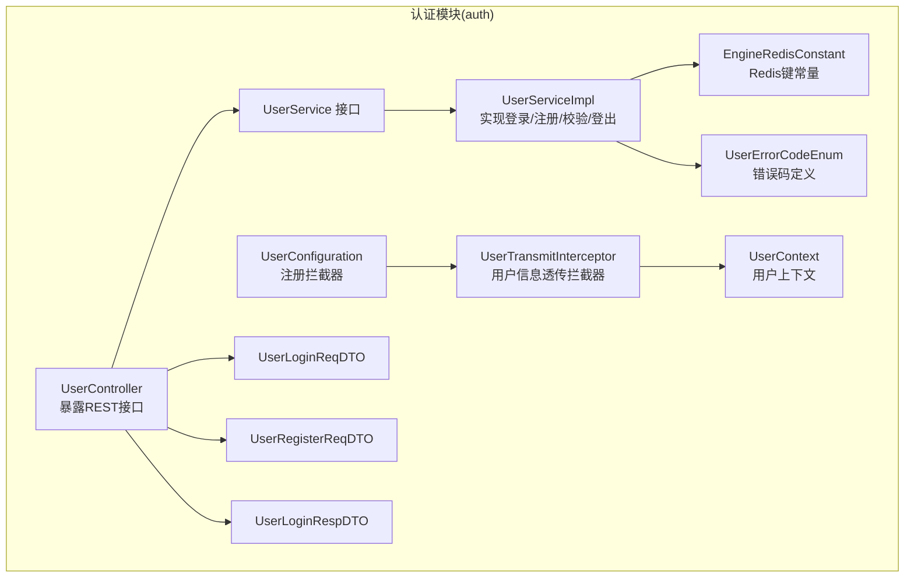
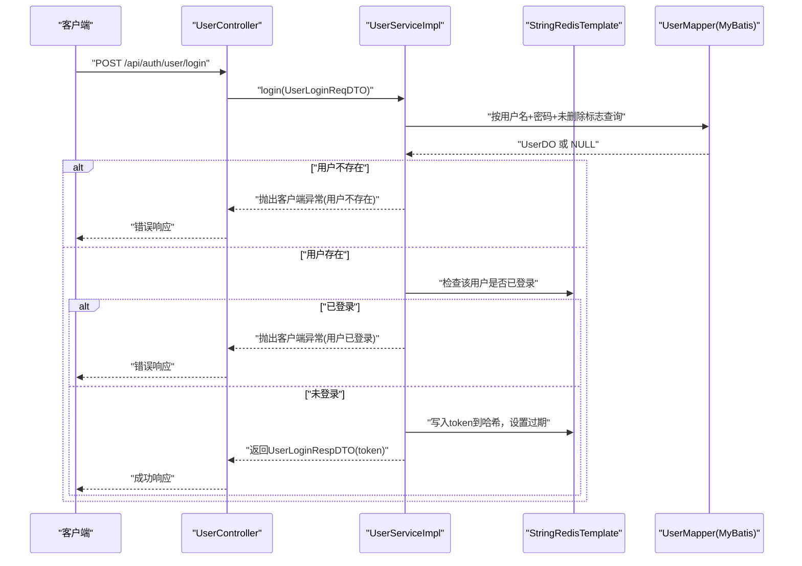
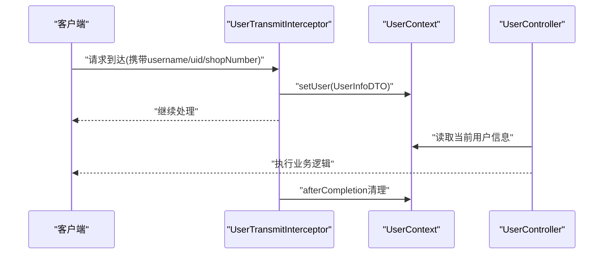
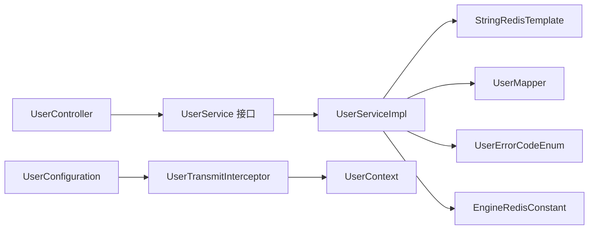

# 认证相关接口

<cite>
**本文引用的文件**
- [UserLoginReqDTO.java](file://auth/src/main/java/com/fengxin/maplecoupon/auth/dto/req/UserLoginReqDTO.java)
- [UserRegisterReqDTO.java](file://auth/src/main/java/com/fengxin/maplecoupon/auth/dto/req/UserRegisterReqDTO.java)
- [UserLoginRespDTO.java](file://auth/src/main/java/com/fengxin/maplecoupon/auth/dto/resp/UserLoginRespDTO.java)
- [UserController.java](file://auth/src/main/java/com/fengxin/maplecoupon/auth/controller/UserController.java)
- [UserService.java](file://auth/src/main/java/com/fengxin/maplecoupon/auth/service/UserService.java)
- [UserServiceImpl.java](file://auth/src/main/java/com/fengxin/maplecoupon/auth/service/impl/UserServiceImpl.java)
- [UserContext.java](file://auth/src/main/java/com/fengxin/maplecoupon/auth/common/context/UserContext.java)
- [UserInfoDTO.java](file://auth/src/main/java/com/fengxin/maplecoupon/auth/common/context/UserInfoDTO.java)
- [UserTransmitInterceptor.java](file://auth/src/main/java/com/fengxin/maplecoupon/auth/common/context/UserTransmitInterceptor.java)
- [UserConfiguration.java](file://auth/src/main/java/com/fengxin/maplecoupon/auth/config/UserConfiguration.java)
- [UserErrorCodeEnum.java](file://auth/src/main/java/com/fengxin/maplecoupon/auth/common/enums/UserErrorCodeEnum.java)
- [EngineRedisConstant.java](file://auth/src/main/java/com/fengxin/maplecoupon/auth/common/constant/EngineRedisConstant.java)
- [application.yaml](file://auth/src/main/resources/application.yaml)
</cite>

## 目录
1. [简介](#简介)
2. [项目结构](#项目结构)
3. [核心组件](#核心组件)
4. [架构总览](#架构总览)
5. [详细组件分析](#详细组件分析)
6. [依赖分析](#依赖分析)
7. [性能考虑](#性能考虑)
8. [故障排查指南](#故障排查指南)
9. [结论](#结论)
10. [附录：接口规范与示例](#附录接口规范与示例)

## 简介
本文件面向MapleCoupon系统的认证相关API，聚焦用户登录、注册、权限校验与登出等核心能力，系统性梳理数据模型、接口规范、调用流程、错误码与安全防护策略。文档同时给出认证中间件的使用方式、权限控制机制说明、常见失败场景与对应错误码，以及基于curl与Postman的测试建议。

## 项目结构
认证模块位于auth子工程，采用分层设计：控制器层负责对外暴露REST接口；服务层封装业务逻辑；数据访问层对接数据库；通用包提供上下文、拦截器、枚举与Redis常量等基础设施。

图表来源
- [UserController.java:1-81](file://auth/src/main/java/com/fengxin/maplecoupon/auth/controller/UserController.java#L1-L81)
- [UserService.java:1-79](file://auth/src/main/java/com/fengxin/maplecoupon/auth/service/UserService.java#L1-L79)
- [UserServiceImpl.java:1-159](file://auth/src/main/java/com/fengxin/maplecoupon/auth/service/impl/UserServiceImpl.java#L1-L159)
- [UserLoginReqDTO.java:1-23](file://auth/src/main/java/com/fengxin/maplecoupon/auth/dto/req/UserLoginReqDTO.java#L1-L23)
- [UserRegisterReqDTO.java:1-44](file://auth/src/main/java/com/fengxin/maplecoupon/auth/dto/req/UserRegisterReqDTO.java#L1-L44)
- [UserLoginRespDTO.java:1-19](file://auth/src/main/java/com/fengxin/maplecoupon/auth/dto/resp/UserLoginRespDTO.java#L1-L19)
- [UserErrorCodeEnum.java:1-36](file://auth/src/main/java/com/fengxin/maplecoupon/auth/common/enums/UserErrorCodeEnum.java#L1-L36)
- [EngineRedisConstant.java:1-55](file://auth/src/main/java/com/fengxin/maplecoupon/auth/common/constant/EngineRedisConstant.java#L1-L55)
- [UserContext.java:1-64](file://auth/src/main/java/com/fengxin/maplecoupon/auth/common/context/UserContext.java#L1-L64)
- [UserTransmitInterceptor.java:1-42](file://auth/src/main/java/com/fengxin/maplecoupon/auth/common/context/UserTransmitInterceptor.java#L1-L42)
- [UserConfiguration.java:1-30](file://auth/src/main/java/com/fengxin/maplecoupon/auth/config/UserConfiguration.java#L1-L30)

章节来源
- [application.yaml:1-19](file://auth/src/main/resources/application.yaml#L1-L19)

## 核心组件
- 控制器层：提供用户查询、注册、登录、登录状态检查、登出等接口。
- 服务层：定义用户管理接口，实现登录、注册、校验与登出逻辑。
- 数据模型：登录请求、注册请求、登录响应等DTO。
- 上下文与拦截器：通过拦截器将请求头中的用户信息注入线程上下文，便于后续业务使用。
- 错误码：统一定义客户端与服务端错误码，便于前端与网关处理。
- Redis常量：集中管理登录态、注册锁等Redis键前缀。

章节来源
- [UserController.java:1-81](file://auth/src/main/java/com/fengxin/maplecoupon/auth/controller/UserController.java#L1-L81)
- [UserService.java:1-79](file://auth/src/main/java/com/fengxin/maplecoupon/auth/service/UserService.java#L1-L79)
- [UserServiceImpl.java:1-159](file://auth/src/main/java/com/fengxin/maplecoupon/auth/service/impl/UserServiceImpl.java#L1-L159)
- [UserLoginReqDTO.java:1-23](file://auth/src/main/java/com/fengxin/maplecoupon/auth/dto/req/UserLoginReqDTO.java#L1-L23)
- [UserRegisterReqDTO.java:1-44](file://auth/src/main/java/com/fengxin/maplecoupon/auth/dto/req/UserRegisterReqDTO.java#L1-L44)
- [UserLoginRespDTO.java:1-19](file://auth/src/main/java/com/fengxin/maplecoupon/auth/dto/resp/UserLoginRespDTO.java#L1-L19)
- [UserContext.java:1-64](file://auth/src/main/java/com/fengxin/maplecoupon/auth/common/context/UserContext.java#L1-L64)
- [UserTransmitInterceptor.java:1-42](file://auth/src/main/java/com/fengxin/maplecoupon/auth/common/context/UserTransmitInterceptor.java#L1-L42)
- [UserErrorCodeEnum.java:1-36](file://auth/src/main/java/com/fengxin/maplecoupon/auth/common/enums/UserErrorCodeEnum.java#L1-L36)
- [EngineRedisConstant.java:1-55](file://auth/src/main/java/com/fengxin/maplecoupon/auth/common/constant/EngineRedisConstant.java#L1-L55)

## 架构总览
认证模块围绕“请求—拦截—业务—存储—响应”的链路展开。拦截器负责将请求头中的用户信息注入上下文；控制器接收请求后调用服务层；服务层通过Redis维护登录态，必要时访问数据库；最终以统一封装的结果返回。

图表来源
- [UserController.java:62-66](file://auth/src/main/java/com/fengxin/maplecoupon/auth/controller/UserController.java#L62-L66)
- [UserServiceImpl.java:121-143](file://auth/src/main/java/com/fengxin/maplecoupon/auth/service/impl/UserServiceImpl.java#L121-L143)
- [EngineRedisConstant.java:51-54](file://auth/src/main/java/com/fengxin/maplecoupon/auth/common/constant/EngineRedisConstant.java#L51-L54)

## 详细组件分析

### 数据模型与字段说明
- UserLoginReqDTO（登录请求）
  - 字段：username（必填）、password（必填）
  - 说明：用于登录校验的凭证载体
- UserRegisterReqDTO（注册请求）
  - 字段：username（必填）、password（必填）、shopName（可选）、realName（可选）、phone（可选）、mail（可选）
  - 说明：注册时可选字段用于完善商户信息
- UserLoginRespDTO（登录响应）
  - 字段：token（字符串）
  - 说明：登录成功后返回的会话标识

章节来源
- [UserLoginReqDTO.java:11-22](file://auth/src/main/java/com/fengxin/maplecoupon/auth/dto/req/UserLoginReqDTO.java#L11-L22)
- [UserRegisterReqDTO.java:11-43](file://auth/src/main/java/com/fengxin/maplecoupon/auth/dto/req/UserRegisterReqDTO.java#L11-L43)
- [UserLoginRespDTO.java:13-18](file://auth/src/main/java/com/fengxin/maplecoupon/auth/dto/resp/UserLoginRespDTO.java#L13-L18)

### 接口清单与调用流程

#### 1) 用户注册
- 方法与路径：POST /api/auth/user/register
- 请求体：UserRegisterReqDTO
- 成功响应：200 OK（无正文），表示注册完成
- 关键行为：
  - 使用布隆过滤器快速判断用户名是否存在
  - 对用户名加分布式锁，防止并发重复注册
  - 写入数据库后，将用户名加入布隆过滤器
- 典型失败场景：
  - 用户名已存在
  - 数据库插入失败或唯一约束冲突
- 安全要点：
  - 注册锁避免竞态条件
  - 布隆过滤器降低数据库压力

章节来源
- [UserController.java:48-53](file://auth/src/main/java/com/fengxin/maplecoupon/auth/controller/UserController.java#L48-L53)
- [UserServiceImpl.java:71-100](file://auth/src/main/java/com/fengxin/maplecoupon/auth/service/impl/UserServiceImpl.java#L71-L100)
- [UserErrorCodeEnum.java:13-18](file://auth/src/main/java/com/fengxin/maplecoupon/auth/common/enums/UserErrorCodeEnum.java#L13-L18)

#### 2) 用户登录
- 方法与路径：POST /api/auth/user/login
- 请求体：UserLoginReqDTO
- 成功响应：UserLoginRespDTO（包含token）
- 关键行为：
  - 查询用户（用户名+密码+未删除）
  - 若用户不存在，抛出“用户不存在”错误
  - 检查该用户是否已处于登录态（Redis哈希键存在）
  - 已登录则拒绝重复登录
  - 未登录则生成UUID作为token，写入Redis哈希并设置过期
- 典型失败场景：
  - 用户不存在
  - 用户已登录（同一账户重复登录）
- 安全要点：
  - 单点登录限制（同一账户仅允许一个token存活）
  - Redis过期保障资源回收

章节来源
- [UserController.java:62-66](file://auth/src/main/java/com/fengxin/maplecoupon/auth/controller/UserController.java#L62-L66)
- [UserServiceImpl.java:121-143](file://auth/src/main/java/com/fengxin/maplecoupon/auth/service/impl/UserServiceImpl.java#L121-L143)
- [EngineRedisConstant.java:53-54](file://auth/src/main/java/com/fengxin/maplecoupon/auth/common/constant/EngineRedisConstant.java#L53-L54)
- [UserErrorCodeEnum.java:15-18](file://auth/src/main/java/com/fengxin/maplecoupon/auth/common/enums/UserErrorCodeEnum.java#L15-L18)

#### 3) 检查登录状态
- 方法与路径：GET /api/auth/user/check-login
- 参数：username、token
- 返回：布尔值，表示该用户与token的配对是否有效
- 关键行为：直接查询Redis哈希中是否存在该token

章节来源
- [UserController.java:68-72](file://auth/src/main/java/com/fengxin/maplecoupon/auth/controller/UserController.java#L68-L72)
- [UserServiceImpl.java:145-148](file://auth/src/main/java/com/fengxin/maplecoupon/auth/service/impl/UserServiceImpl.java#L145-L148)

#### 4) 用户登出
- 方法与路径：DELETE /api/auth/user/logout
- 参数：username、token
- 成功响应：200 OK（无正文）
- 关键行为：若token有效则删除Redis中的该token条目
- 典型失败场景：
  - token无效或不属于该用户

章节来源
- [UserController.java:74-79](file://auth/src/main/java/com/fengxin/maplecoupon/auth/controller/UserController.java#L74-L79)
- [UserServiceImpl.java:150-157](file://auth/src/main/java/com/fengxin/maplecoupon/auth/service/impl/UserServiceImpl.java#L150-L157)
- [UserErrorCodeEnum.java](file://auth/src/main/java/com/fengxin/maplecoupon/auth/common/enums/UserErrorCodeEnum.java#L19)

#### 5) 用户信息查询（管理员/内部使用）
- 方法与路径：GET /api/auth/admin/user/{username}
- 返回：脱敏后的用户信息
- 方法与路径：GET /api/auth/actual/user/{username}
- 返回：原始用户信息（非脱敏）

章节来源
- [UserController.java:30-40](file://auth/src/main/java/com/fengxin/maplecoupon/auth/controller/UserController.java#L30-L40)

#### 6) 用户信息更新（带权限校验）
- 方法与路径：PUT /api/auth/user
- 请求体：UserUpdateReqDTO
- 参数：token
- 关键行为：
  - 通过UserContext校验当前登录用户与请求体用户名一致
  - 更新数据库后，同步刷新Redis中的用户信息缓存

章节来源
- [UserController.java:55-60](file://auth/src/main/java/com/fengxin/maplecoupon/auth/controller/UserController.java#L55-L60)
- [UserServiceImpl.java:104-119](file://auth/src/main/java/com/fengxin/maplecoupon/auth/service/impl/UserServiceImpl.java#L104-L119)
- [UserContext.java:14-64](file://auth/src/main/java/com/fengxin/maplecoupon/auth/common/context/UserContext.java#L14-L64)

### 权限控制与中间件
- 用户信息透传拦截器：
  - 作用：从请求头读取username、userId、shopNumber，封装为UserInfoDTO并注入UserContext
  - 生命周期：preHandle注入，afterCompletion清理
- 中间件注册：
  - 通过UserConfiguration将拦截器注册到WebMvc配置中
- 权限校验：
  - 在需要校验的接口中，读取UserContext中的用户名进行一致性校验（如更新用户信息）

图表来源
- [UserTransmitInterceptor.java:21-40](file://auth/src/main/java/com/fengxin/maplecoupon/auth/common/context/UserTransmitInterceptor.java#L21-L40)
- [UserContext.java:22-61](file://auth/src/main/java/com/fengxin/maplecoupon/auth/common/context/UserContext.java#L22-L61)
- [UserConfiguration.java:24-27](file://auth/src/main/java/com/fengxin/maplecoupon/auth/config/UserConfiguration.java#L24-L27)

## 依赖分析
- 控制器依赖服务接口，服务实现依赖Redis与数据库访问层
- 拦截器依赖UserContext，UserContext由拦截器注入
- 错误码统一由UserErrorCodeEnum提供，便于全局异常处理
- Redis常量集中管理，避免魔法字符串

图表来源
- [UserController.java:1-81](file://auth/src/main/java/com/fengxin/maplecoupon/auth/controller/UserController.java#L1-L81)
- [UserService.java:1-79](file://auth/src/main/java/com/fengxin/maplecoupon/auth/service/UserService.java#L1-L79)
- [UserServiceImpl.java:1-159](file://auth/src/main/java/com/fengxin/maplecoupon/auth/service/impl/UserServiceImpl.java#L1-L159)
- [UserTransmitInterceptor.java:1-42](file://auth/src/main/java/com/fengxin/maplecoupon/auth/common/context/UserTransmitInterceptor.java#L1-L42)
- [UserContext.java:1-64](file://auth/src/main/java/com/fengxin/maplecoupon/auth/common/context/UserContext.java#L1-L64)
- [UserConfiguration.java:1-30](file://auth/src/main/java/com/fengxin/maplecoupon/auth/config/UserConfiguration.java#L1-L30)
- [UserErrorCodeEnum.java:1-36](file://auth/src/main/java/com/fengxin/maplecoupon/auth/common/enums/UserErrorCodeEnum.java#L1-L36)
- [EngineRedisConstant.java:1-55](file://auth/src/main/java/com/fengxin/maplecoupon/auth/common/constant/EngineRedisConstant.java#L1-L55)

## 性能考虑
- 布隆过滤器：在注册前快速判断用户名是否存在，减少数据库压力
- 分布式锁：注册时对用户名加锁，避免并发重复注册导致的数据库异常
- Redis登录态：以哈希形式存储用户登录态，支持按用户维度清理与过期控制
- 过期策略：登录态设置较长有效期，结合单点登录限制，平衡用户体验与安全性

## 故障排查指南
- 常见错误码
  - 用户名不存在：B000200
  - 用户名已存在：B000201
  - 用户不存在：B000202
  - 用户已存在：B000203
  - 用户新增失败：B000204
  - 用户已登录：B000205
  - 用户退出登录失败：B000206
- 登录失败排查
  - 确认用户名与密码正确且用户未被删除
  - 检查是否已存在登录态（同一账户重复登录会被拒绝）
- 注册失败排查
  - 检查用户名是否已被占用（布隆过滤器命中）
  - 查看注册锁是否超时或未释放
  - 关注数据库唯一约束冲突
- 登出失败排查
  - 确认token与username匹配且仍处于登录态

章节来源
- [UserErrorCodeEnum.java:9-36](file://auth/src/main/java/com/fengxin/maplecoupon/auth/common/enums/UserErrorCodeEnum.java#L9-L36)
- [UserServiceImpl.java:121-157](file://auth/src/main/java/com/fengxin/maplecoupon/auth/service/impl/UserServiceImpl.java#L121-L157)

## 结论
认证模块通过清晰的分层设计与完善的基础设施（拦截器、上下文、Redis常量、错误码）实现了稳定可靠的用户登录、注册、权限校验与登出能力。结合布隆过滤器、分布式锁与Redis登录态管理，系统在可用性与安全性之间取得良好平衡。建议在生产环境配合网关鉴权与限流策略进一步强化安全防护。

## 附录：接口规范与示例

### 接口一览
- POST /api/auth/user/register
  - 请求体：UserRegisterReqDTO
  - 成功：200 OK
- POST /api/auth/user/login
  - 请求体：UserLoginReqDTO
  - 成功：200 OK，响应体：UserLoginRespDTO(token)
- GET /api/auth/user/check-login
  - 参数：username、token
  - 成功：200 OK，返回布尔值
- DELETE /api/auth/user/logout
  - 参数：username、token
  - 成功：200 OK
- GET /api/auth/admin/user/{username}
  - 成功：200 OK，返回脱敏用户信息
- GET /api/auth/actual/user/{username}
  - 成功：200 OK，返回原始用户信息
- PUT /api/auth/user
  - 请求体：UserUpdateReqDTO
  - 参数：token
  - 成功：200 OK

章节来源
- [UserController.java:30-80](file://auth/src/main/java/com/fengxin/maplecoupon/auth/controller/UserController.java#L30-L80)

### HTTP请求示例（基于curl）
- 注册
  - curl -X POST http://localhost:10070/api/auth/user/register -H "Content-Type: application/json" -d '{"username":"testuser","password":"pwd","shopName":"店铺A","realName":"张三","phone":"13800001111","mail":"test@example.com"}'
- 登录
  - curl -X POST http://localhost:10070/api/auth/user/login -H "Content-Type: application/json" -d '{"username":"testuser","password":"pwd"}'
- 检查登录
  - curl "http://localhost:10070/api/auth/user/check-login?username=testuser&token=YOUR_TOKEN"
- 登出
  - curl -X DELETE "http://localhost:10070/api/auth/user/logout?username=testuser&token=YOUR_TOKEN"
- 查询用户（管理员）
  - curl http://localhost:10070/api/auth/admin/user/testuser
- 查询用户（实际）
  - curl http://localhost:10070/api/auth/actual/user/testuser
- 更新用户
  - curl -X PUT "http://localhost:10070/api/auth/user?token=YOUR_TOKEN" -H "Content-Type: application/json" -d '{"username":"testuser","realName":"李四","phone":"13900002222"}'

### 响应示例
- 登录成功
  - {"code":"0","message":"操作成功","data":{"token":"xxxxxxxx-xxxx-xxxx-xxxx-xxxxxxxxxxxx"}}
- 检查登录
  - {"code":"0","message":"操作成功","data":true}
- 注册/登出/更新成功
  - {"code":"0","message":"操作成功","data":null}

### Postman集合建议
- 导入Collection时，为每个环境配置基础URL（如http://localhost:10070）
- 为登录接口设置Pre-request Script，自动提取响应中的token并保存为变量
- 为需要鉴权的接口设置Authorization为Bearer Token，引用上述变量
- 为注册接口添加Tests，断言响应码与token存在性（如需）

### JWT令牌生成、刷新与验证流程说明
- 生成：登录成功后返回UUID类型的token，写入Redis哈希并设置过期
- 刷新：当前实现未提供专用刷新接口；建议在网关或服务端引入refresh token机制（概念性建议，非现有实现）
- 验证：通过check-login接口或在各受保护接口中读取Redis哈希确认token有效性

章节来源
- [UserLoginRespDTO.java:13-18](file://auth/src/main/java/com/fengxin/maplecoupon/auth/dto/resp/UserLoginRespDTO.java#L13-L18)
- [UserServiceImpl.java:121-143](file://auth/src/main/java/com/fengxin/maplecoupon/auth/service/impl/UserServiceImpl.java#L121-L143)
- [UserController.java:68-72](file://auth/src/main/java/com/fengxin/maplecoupon/auth/controller/UserController.java#L68-L72)

### 安全防护措施
- 防暴力破解
  - 登录态限制：同一账户仅允许一个token存活，避免多设备同时登录导致的资源竞争
  - 注册锁：对用户名加分布式锁，降低并发注册带来的数据库压力与异常概率
- 防重放攻击
  - 建议在网关层引入时间戳+随机数+签名机制（概念性建议，非现有实现）
- 会话管理
  - Redis过期策略：登录态设置较长有效期，结合单点登录限制，确保资源回收与安全

章节来源
- [UserServiceImpl.java:77-98](file://auth/src/main/java/com/fengxin/maplecoupon/auth/service/impl/UserServiceImpl.java#L77-L98)
- [EngineRedisConstant.java:51-54](file://auth/src/main/java/com/fengxin/maplecoupon/auth/common/constant/EngineRedisConstant.java#L51-L54)