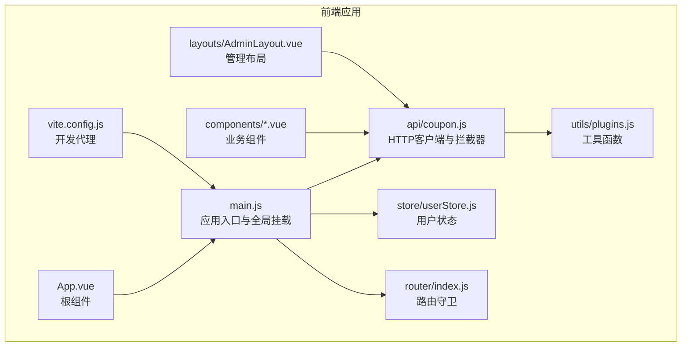
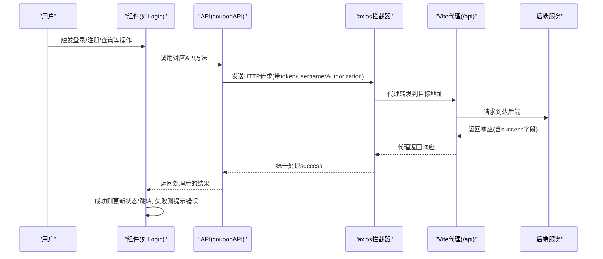
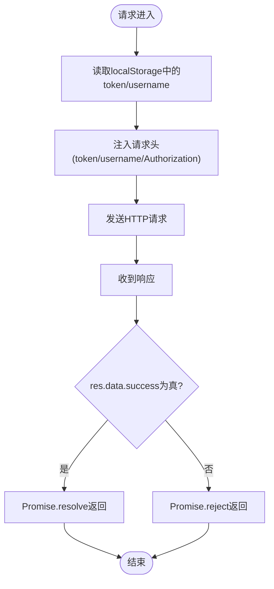
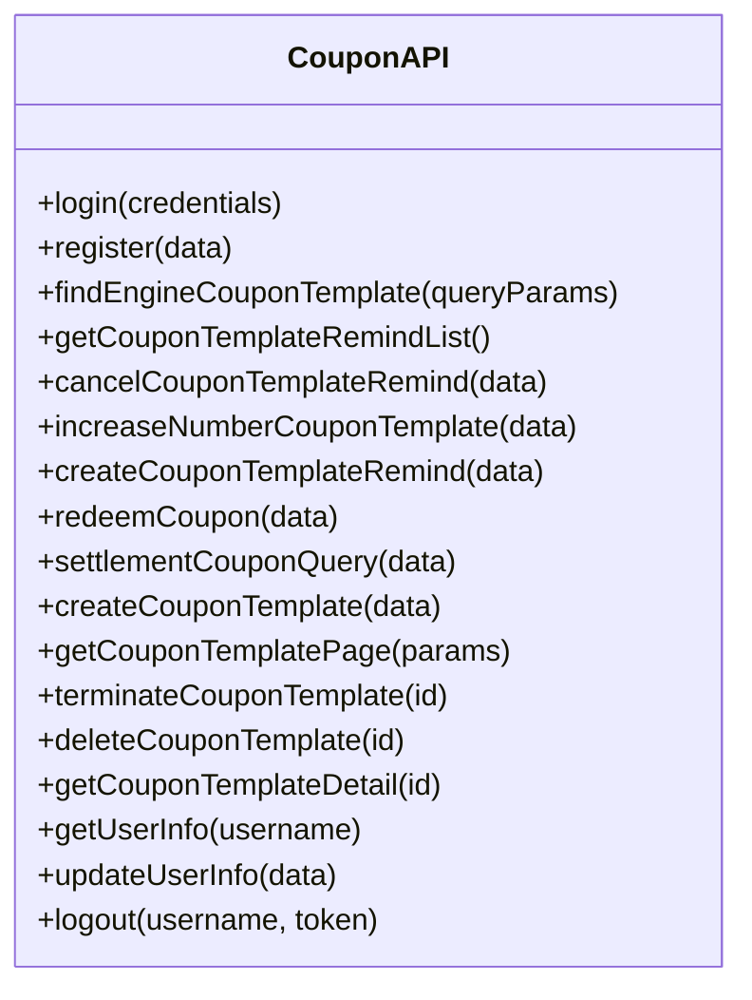
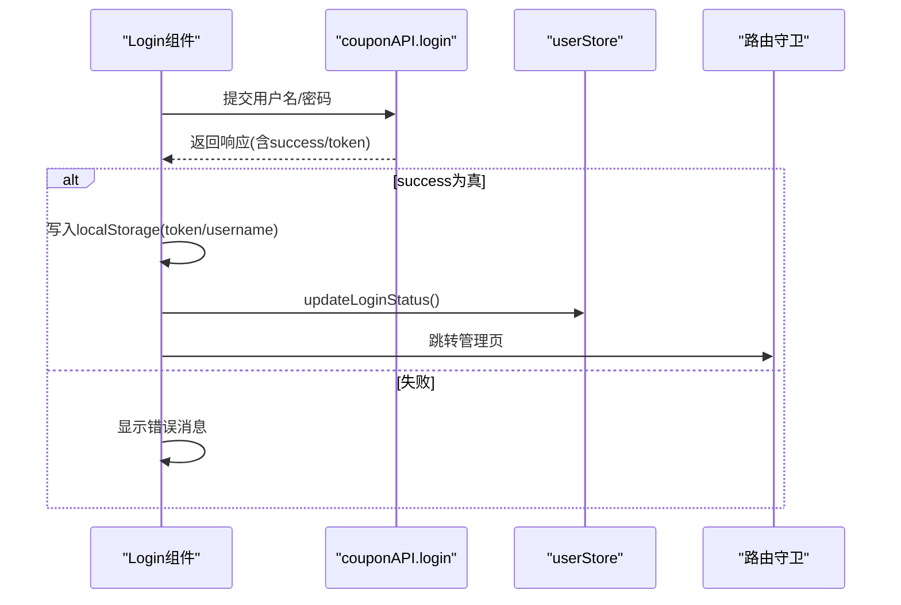
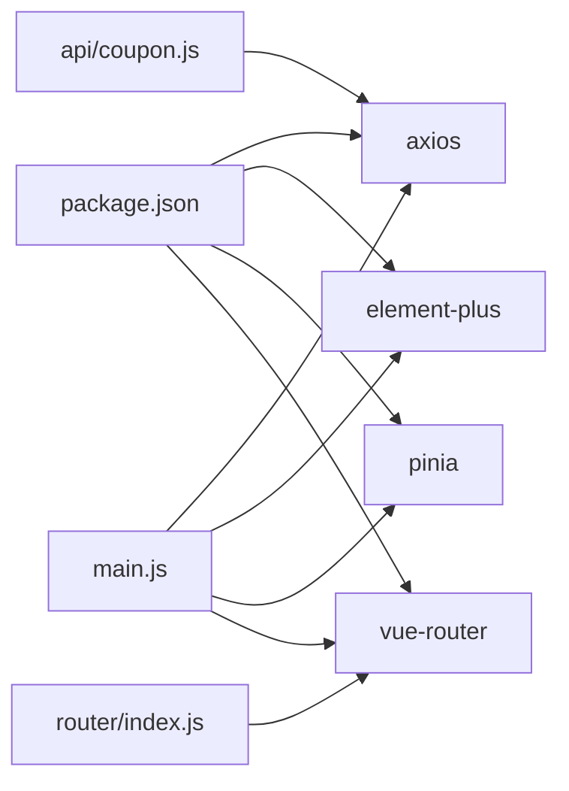

# API接口集成

<cite>
**本文引用的文件**
- [coupon.js](file://coupon/src/api/coupon.js)
- [main.js](file://coupon/src/main.js)
- [plugins.js](file://coupon/src/utils/plugins.js)
- [userStore.js](file://coupon/src/store/userStore.js)
- [Login.vue](file://coupon/src/components/Login.vue)
- [Register.vue](file://coupon/src/components/Register.vue)
- [CouponTemplateManagement.vue](file://coupon/src/components/CouponTemplateManagement.vue)
- [CouponTemplateCreate.vue](file://coupon/src/components/CouponTemplateCreate.vue)
- [AdminLayout.vue](file://coupon/src/layouts/AdminLayout.vue)
- [index.js](file://coupon/src/router/index.js)
- [vite.config.js](file://coupon/vite.config.js)
- [App.vue](file://coupon/src/App.vue)
- [package.json](file://coupon/package.json)
</cite>

## 目录
1. [简介](#简介)
2. [项目结构](#项目结构)
3. [核心组件](#核心组件)
4. [架构总览](#架构总览)
5. [详细组件分析](#详细组件分析)
6. [依赖关系分析](#依赖关系分析)
7. [性能考虑](#性能考虑)
8. [故障排查指南](#故障排查指南)
9. [结论](#结论)
10. [附录](#附录)

## 简介
本文件面向前端API接口集成，系统性梳理HTTP客户端封装与配置（基于axios）、拦截器与统一处理机制、API模块设计与组织、认证与授权流程、错误处理与用户提示、加载状态管理、以及测试与调试方法。文档以代码为依据，结合组件与路由的实际使用场景，提供可操作的最佳实践建议。

## 项目结构
前端位于 coupon 子工程，采用 Vue 3 + Vite + Element Plus 技术栈；API封装集中在 src/api/coupon.js，通过 axios 实例统一发起请求，并在 main.js 中挂载到全局配置，供各组件按需导入使用。

图示来源
- [main.js:1-34](file://coupon/src/main.js#L1-L34)
- [coupon.js:1-145](file://coupon/src/api/coupon.js#L1-L145)
- [plugins.js:1-4](file://coupon/src/utils/plugins.js#L1-L4)
- [userStore.js:1-19](file://coupon/src/store/userStore.js#L1-L19)
- [index.js:1-127](file://coupon/src/router/index.js#L1-L127)
- [AdminLayout.vue:1-800](file://coupon/src/layouts/AdminLayout.vue#L1-L800)
- [App.vue:1-89](file://coupon/src/App.vue#L1-L89)
- [vite.config.js:1-28](file://coupon/vite.config.js#L1-L28)

章节来源
- [main.js:1-34](file://coupon/src/main.js#L1-L34)
- [coupon.js:1-145](file://coupon/src/api/coupon.js#L1-L145)
- [vite.config.js:1-28](file://coupon/vite.config.js#L1-L28)

## 核心组件
- HTTP客户端与拦截器
  - 基于 axios 创建实例，设置基础地址与超时；
  - 请求拦截器注入 token、username、Authorization 头；
  - 响应拦截器统一判断 success 字段，401时清理本地存储并跳转登录。
- API模块组织
  - 导出 couponAPI 对象，按功能分组封装接口（登录、注册、优惠券模板、提醒、兑换、结算、用户信息等）。
- 认证与状态
  - 登录成功写入 localStorage，更新 Pinia 用户状态；
  - 路由守卫与组件内守卫共同保证访问控制。
- 加载与错误
  - 组件内使用 Element Plus 的 v-loading 属性展示表格加载；
  - 错误提示统一通过 $message 或错误消息字段展示。

章节来源
- [coupon.js:1-145](file://coupon/src/api/coupon.js#L1-L145)
- [Login.vue:69-95](file://coupon/src/components/Login.vue#L69-L95)
- [CouponTemplateManagement.vue:276-296](file://coupon/src/components/CouponTemplateManagement.vue#L276-L296)
- [index.js:92-124](file://coupon/src/router/index.js#L92-L124)

## 架构总览
下图展示了从前端请求到后端服务的整体链路，包括代理转发、认证头注入、响应处理与路由守卫。

图示来源
- [coupon.js:8-45](file://coupon/src/api/coupon.js#L8-L45)
- [vite.config.js:14-25](file://coupon/vite.config.js#L14-L25)
- [Login.vue:69-95](file://coupon/src/components/Login.vue#L69-L95)
- [CouponTemplateManagement.vue:276-296](file://coupon/src/components/CouponTemplateManagement.vue#L276-L296)

## 详细组件分析

### HTTP客户端与拦截器
- 客户端配置
  - 基础地址：/api/auth
  - 超时：2000ms
- 请求拦截器
  - 从 localStorage 读取 token 与 username，注入多个头部字段；
  - 使用工具函数判断非空后再注入。
- 响应拦截器
  - 仅当 res.data.success 为真才视为成功；
  - 对 401 错误清理本地存储并跳转登录。

图示来源
- [coupon.js:8-45](file://coupon/src/api/coupon.js#L8-L45)
- [plugins.js:1-4](file://coupon/src/utils/plugins.js#L1-L4)

章节来源
- [coupon.js:1-145](file://coupon/src/api/coupon.js#L1-L145)
- [plugins.js:1-4](file://coupon/src/utils/plugins.js#L1-L4)

### API模块设计与组织
- 接口分组
  - 用户：登录、注册、登出、获取/更新用户信息
  - 优惠券模板：分页查询、详情、创建、增发、终止、删除
  - 提醒：创建提醒、取消提醒、提醒列表
  - 兑换与结算：用户兑换、结算查询
- 参数校验
  - 部分接口在调用前进行参数完整性校验，必要时直接 reject。
- 统一返回
  - 所有接口返回 axios 原生响应，便于上层统一处理 success 字段。

图示来源
- [coupon.js:47-142](file://coupon/src/api/coupon.js#L47-L142)

章节来源
- [coupon.js:47-142](file://coupon/src/api/coupon.js#L47-L142)

### 认证机制集成
- 登录流程
  - 组件发起登录请求，成功后写入 token 与 username；
  - 更新 Pinia 用户状态，跳转管理页。
- 路由守卫
  - 未登录访问受保护路由时跳转登录；
  - 登录/注册页已登录时跳转首页；
  - 详情页缺少参数时回退列表。
- 401处理
  - 响应拦截器检测 401，清理本地存储并跳转登录。

图示来源
- [Login.vue:69-95](file://coupon/src/components/Login.vue#L69-L95)
- [userStore.js:8-11](file://coupon/src/store/userStore.js#L8-L11)
- [index.js:92-124](file://coupon/src/router/index.js#L92-L124)
- [coupon.js:35-42](file://coupon/src/api/coupon.js#L35-L42)

章节来源
- [Login.vue:69-95](file://coupon/src/components/Login.vue#L69-L95)
- [userStore.js:1-19](file://coupon/src/store/userStore.js#L1-L19)
- [index.js:92-124](file://coupon/src/router/index.js#L92-L124)
- [coupon.js:35-42](file://coupon/src/api/coupon.js#L35-L42)

### 错误处理与用户提示
- 统一错误处理
  - 响应拦截器对非成功响应进行 reject；
  - 组件内捕获错误，优先使用响应体中的 message 字段，兜底为通用网络错误提示。
- 表单与业务错误
  - 表单校验失败或参数缺失时，组件内直接抛错并提示；
  - 业务接口返回失败时，使用 Element Plus 的 $message 展示错误。
- 401自动登出
  - 响应拦截器检测 401，清理本地存储并跳转登录。

章节来源
- [coupon.js:22-44](file://coupon/src/api/coupon.js#L22-L44)
- [Login.vue:86-91](file://coupon/src/components/Login.vue#L86-L91)
- [CouponTemplateManagement.vue:292-296](file://coupon/src/components/CouponTemplateManagement.vue#L292-L296)

### 加载状态管理
- 全局loading
  - 通过 Element Plus 的 v-loading 属性在表格等组件上展示加载状态；
  - 组件内使用布尔变量控制 loading 开关。
- 局部加载
  - 表单提交按钮禁用并显示“加载中”文案，避免重复提交。

章节来源
- [CouponTemplateManagement.vue:91-92](file://coupon/src/components/CouponTemplateManagement.vue#L91-L92)
- [Login.vue:69-95](file://coupon/src/components/Login.vue#L69-L95)

### 最佳实践与扩展建议
- 请求合并与防抖/节流
  - 对高频查询（如搜索、分页）建议在组件内引入防抖/节流，避免频繁请求；
  - 对多请求场景可使用 Promise.all 合并，但需注意错误聚合与用户体验。
- 重试机制
  - 对幂等GET请求可在组件层实现有限次数重试；
  - 对非幂等请求谨慎重试，建议通过业务补偿或提示用户重试。
- 缓存策略
  - 对静态或低频变更数据可引入内存缓存，结合失效策略；
  - 对分页数据建议按查询参数作为缓存键。
- 令牌刷新
  - 当前拦截器未实现刷新逻辑，建议在响应拦截器中识别特定错误码触发刷新流程，并在刷新成功后重试原请求。

## 依赖关系分析
- axios 版本：1.7.9
- Element Plus：UI组件库
- Pinia：状态管理
- Vue Router：路由与守卫
- Vite：开发代理与构建

图示来源
- [package.json:11-26](file://coupon/package.json#L11-L26)
- [main.js:9-21](file://coupon/src/main.js#L9-L21)
- [index.js:1-127](file://coupon/src/router/index.js#L1-L127)
- [coupon.js:1-7](file://coupon/src/api/coupon.js#L1-L7)

章节来源
- [package.json:1-37](file://coupon/package.json#L1-L37)
- [main.js:1-34](file://coupon/src/main.js#L1-L34)

## 性能考虑
- 代理与跨域
  - 开发环境通过 Vite 代理将 /api 转发到后端地址，减少跨域问题；
  - 生产环境需确保代理或Nginx正确配置。
- 超时与并发
  - axios 超时设置为2秒，建议根据接口特性调整；
  - 控制并发请求数，避免同时大量请求导致资源争用。
- UI渲染
  - 表格使用 v-loading 与虚拟滚动（如需）提升渲染性能；
  - 合理使用 keep-alive 缓存页面，减少重复渲染。

章节来源
- [vite.config.js:14-25](file://coupon/vite.config.js#L14-L25)
- [coupon.js:4-7](file://coupon/src/api/coupon.js#L4-L7)
- [CouponTemplateManagement.vue:91-92](file://coupon/src/components/CouponTemplateManagement.vue#L91-L92)

## 故障排查指南
- 无法登录/401频繁
  - 检查响应拦截器是否正确识别 401 并清理本地存储；
  - 确认后端返回的 success 字段与业务约定一致。
- 请求头缺失
  - 确认请求拦截器已注入 token/username/Authorization；
  - 检查工具函数 isNotEmpty 是否正确判断空值。
- 路由跳转异常
  - 检查路由守卫逻辑，特别是登录/注册页与详情页参数校验；
  - 确认 Pinia 用户状态与 localStorage 同步。
- 代理转发失败
  - 检查 Vite 代理配置与后端实际地址；
  - 确认 changeOrigin 与 pathRewrite 设置正确。

章节来源
- [coupon.js:8-45](file://coupon/src/api/coupon.js#L8-L45)
- [plugins.js:1-4](file://coupon/src/utils/plugins.js#L1-L4)
- [index.js:92-124](file://coupon/src/router/index.js#L92-L124)
- [vite.config.js:14-25](file://coupon/vite.config.js#L14-L25)

## 结论
本项目通过集中式的 axios 客户端与拦截器，实现了统一的请求/响应处理、认证头注入与401自动登出；配合路由守卫与组件内的加载/错误处理，形成了较为完整的前端API集成方案。建议后续在令牌刷新、重试与缓存策略方面进一步完善，以提升稳定性与用户体验。

## 附录
- 关键文件清单
  - API封装：[coupon.js](file://coupon/src/api/coupon.js)
  - 应用入口：[main.js](file://coupon/src/main.js)
  - 工具函数：[plugins.js](file://coupon/src/utils/plugins.js)
  - 用户状态：[userStore.js](file://coupon/src/store/userStore.js)
  - 登录组件：[Login.vue](file://coupon/src/components/Login.vue)
  - 注册组件：[Register.vue](file://coupon/src/components/Register.vue)
  - 列表组件：[CouponTemplateManagement.vue](file://coupon/src/components/CouponTemplateManagement.vue)
  - 创建组件：[CouponTemplateCreate.vue](file://coupon/src/components/CouponTemplateCreate.vue)
  - 管理布局：[AdminLayout.vue](file://coupon/src/layouts/AdminLayout.vue)
  - 路由配置：[index.js](file://coupon/src/router/index.js)
  - 代理配置：[vite.config.js](file://coupon/vite.config.js)
  - 根组件：[App.vue](file://coupon/src/App.vue)
  - 依赖清单：[package.json](file://coupon/package.json)