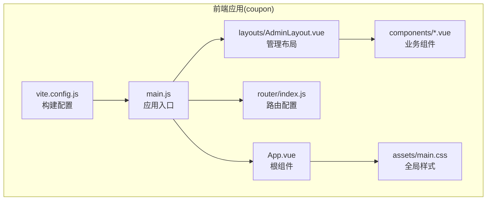
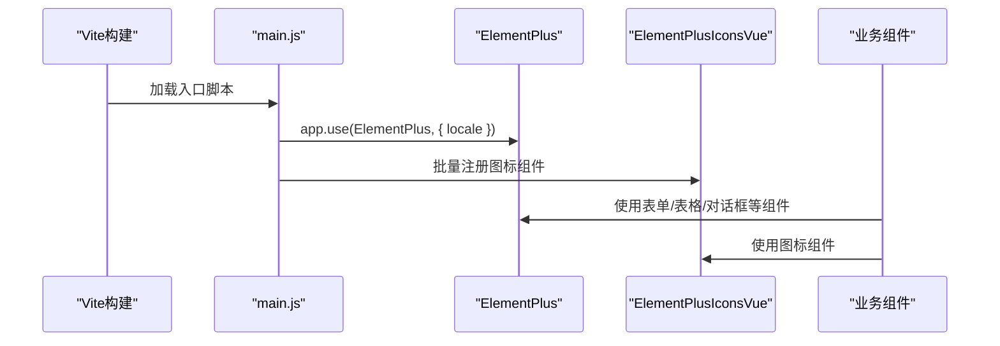
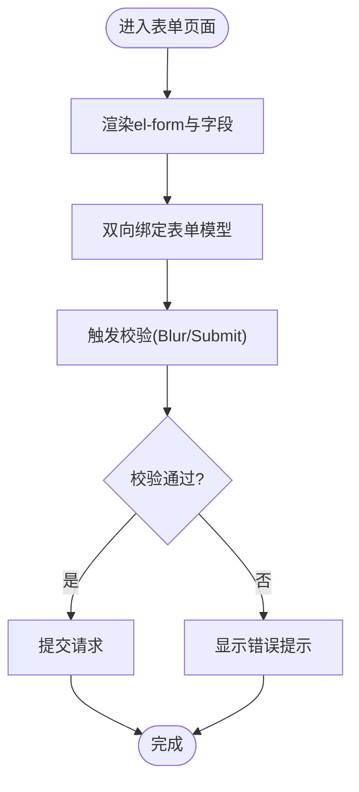
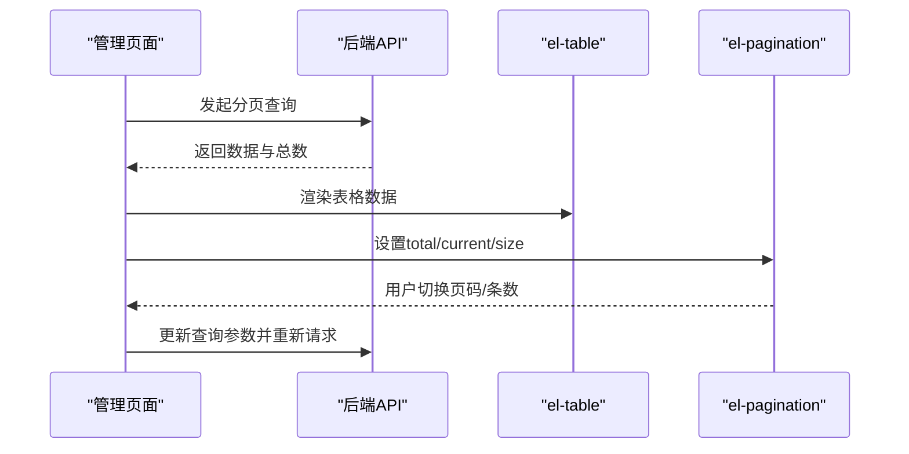
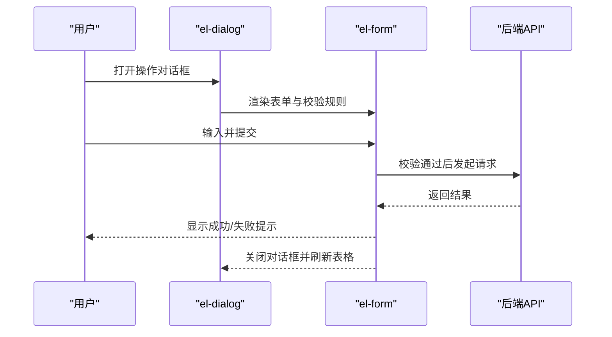
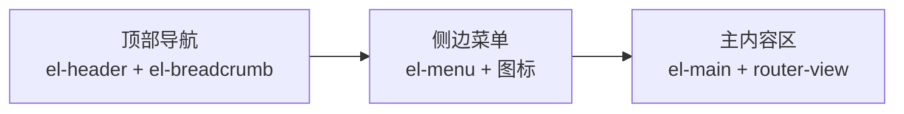
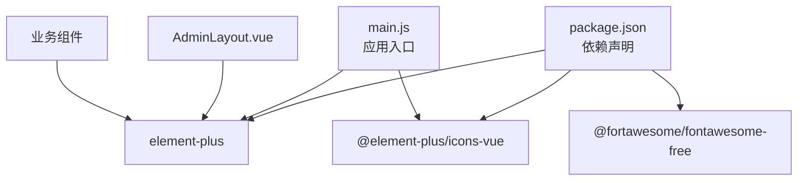

# UI组件库集成

<cite>
**本文引用的文件**
- [package.json](file://coupon/package.json)
- [vite.config.js](file://coupon/vite.config.js)
- [main.js](file://coupon/src/main.js)
- [App.vue](file://coupon/src/App.vue)
- [AdminLayout.vue](file://coupon/src/layouts/AdminLayout.vue)
- [CouponTemplateManagement.vue](file://coupon/src/components/CouponTemplateManagement.vue)
- [CouponTemplateCreate.vue](file://coupon/src/components/CouponTemplateCreate.vue)
- [Login.vue](file://coupon/src/components/Login.vue)
- [main.css](file://coupon/src/assets/main.css)
- [index.js](file://coupon/src/router/index.js)
- [IconCommunity.vue](file://coupon/src/components/icons/IconCommunity.vue)
</cite>

## 目录
1. [简介](#简介)
2. [项目结构](#项目结构)
3. [核心组件](#核心组件)
4. [架构总览](#架构总览)
5. [详细组件分析](#详细组件分析)
6. [依赖关系分析](#依赖关系分析)
7. [性能考量](#性能考量)
8. [故障排查指南](#故障排查指南)
9. [结论](#结论)
10. [附录](#附录)

## 简介
本文件面向Element Plus UI组件库在Vue.js项目中的集成与使用，结合仓库现有代码，系统阐述以下主题：
- 完整导入与按需导入的配置差异与实践建议
- 常用UI组件（表单、数据表格、对话框、导航）的实际应用示例
- 主题定制与样式覆盖（CSS变量、组件样式局部修改）
- 响应式设计策略（断点设置与移动端适配）
- 图标系统（Element Plus图标与Font Awesome图标的集成与使用）
- 国际化配置与本地化支持（中文语言包与日期时间格式）

## 项目结构
本项目前端位于coupon目录，采用Vite构建，Element Plus作为主要UI框架，配合Vue Router进行路由管理。项目通过全局引入Element Plus并注册图标，同时在多个业务组件中广泛使用Element Plus组件。

图表来源
- [main.js:1-34](file://coupon/src/main.js#L1-L34)
- [App.vue:1-89](file://coupon/src/App.vue#L1-L89)
- [index.js:1-127](file://coupon/src/router/index.js#L1-L127)
- [AdminLayout.vue:1-120](file://coupon/src/layouts/AdminLayout.vue#L1-L120)
- [main.css:1-147](file://coupon/src/assets/main.css#L1-L147)
- [vite.config.js:1-28](file://coupon/vite.config.js#L1-L28)

章节来源
- [package.json:1-37](file://coupon/package.json#L1-L37)
- [vite.config.js:1-28](file://coupon/vite.config.js#L1-L28)
- [main.js:1-34](file://coupon/src/main.js#L1-L34)
- [App.vue:1-89](file://coupon/src/App.vue#L1-L89)
- [index.js:1-127](file://coupon/src/router/index.js#L1-L127)
- [AdminLayout.vue:1-120](file://coupon/src/layouts/AdminLayout.vue#L1-L120)
- [main.css:1-147](file://coupon/src/assets/main.css#L1-L147)

## 核心组件
- 应用入口与插件注册：在应用入口完成Element Plus的安装与中文语言包挂载，同时批量注册Element Plus图标，确保全局可直接使用。
- 布局与导航：AdminLayout提供顶部导航、面包屑与侧边菜单，菜单项内嵌Element Plus图标，体现统一的视觉风格。
- 业务组件：CouponTemplateManagement集中展示表单、表格、分页与对话框；CouponTemplateCreate使用日期选择器等表单控件；Login提供基础表单与交互反馈。

章节来源
- [main.js:1-34](file://coupon/src/main.js#L1-L34)
- [AdminLayout.vue:1-120](file://coupon/src/layouts/AdminLayout.vue#L1-L120)
- [CouponTemplateManagement.vue:1-225](file://coupon/src/components/CouponTemplateManagement.vue#L1-L225)
- [CouponTemplateCreate.vue:1-157](file://coupon/src/components/CouponTemplateCreate.vue#L1-L157)
- [Login.vue:1-96](file://coupon/src/components/Login.vue#L1-L96)

## 架构总览
Element Plus在本项目中的集成路径如下：
- 依赖声明：在package.json中引入element-plus与@element-plus/icons-vue
- 构建配置：Vite默认支持ES模块，无需额外按需导入配置
- 应用初始化：在main.js中引入ElementPlus与中文语言包，全局注册图标组件
- 组件使用：各业务组件直接使用Element Plus组件与图标

图表来源
- [package.json:11-25](file://coupon/package.json#L11-L25)
- [main.js:5-31](file://coupon/src/main.js#L5-L31)
- [CouponTemplateManagement.vue:16-18](file://coupon/src/components/CouponTemplateManagement.vue#L16-L18)
- [CouponTemplateCreate.vue:159-166](file://coupon/src/components/CouponTemplateCreate.vue#L159-L166)

章节来源
- [package.json:11-25](file://coupon/package.json#L11-L25)
- [main.js:5-31](file://coupon/src/main.js#L5-L31)

## 详细组件分析

### Element Plus完整导入与按需导入
- 完整导入现状：项目在main.js中直接引入element-plus/dist/index.css与中文语言包，并通过app.use(ElementPlus, { locale: zhCn })完成全局安装。此方式简单直接，适合快速开发与中小型项目。
- 按需导入建议：对于大型项目或对打包体积敏感的场景，推荐采用按需导入（仅引入所需组件与样式），以减少bundle体积。由于本项目未配置按需导入插件，当前为完整导入模式。

章节来源
- [main.js:5-7](file://coupon/src/main.js#L5-L7)
- [main.js:29-31](file://coupon/src/main.js#L29-L31)

### 表单组件使用
- 基础表单：CouponTemplateManagement中使用el-form、el-form-item、el-input、el-select等组合实现搜索表单。
- 表单校验：通过rules与ref进行表单验证，结合Element Plus的表单控件内置校验能力。
- 输入增强：通过prefix插槽在输入框前添加图标，提升交互体验。
- 日期选择：CouponTemplateCreate中使用ElDatePicker与中文语言包，设置日期范围与快捷选项。

图表来源
- [CouponTemplateManagement.vue:18-86](file://coupon/src/components/CouponTemplateManagement.vue#L18-L86)
- [CouponTemplateCreate.vue:20-153](file://coupon/src/components/CouponTemplateCreate.vue#L20-L153)

章节来源
- [CouponTemplateManagement.vue:18-86](file://coupon/src/components/CouponTemplateManagement.vue#L18-L86)
- [CouponTemplateCreate.vue:20-153](file://coupon/src/components/CouponTemplateCreate.vue#L20-L153)

### 数据表格与分页
- 表格展示：CouponTemplateManagement使用el-table展示优惠券列表，结合el-table-column定义列与模板。
- 加载状态：通过v-loading控制表格加载状态，提升用户体验。
- 分页器：使用el-pagination实现分页，结合handleSizeChange与handlePageChange更新查询参数。
- 表格样式：通过CSS变量与深度选择器(:deep)优化表格行高、滚动条与hover效果。

图表来源
- [CouponTemplateManagement.vue:91-180](file://coupon/src/components/CouponTemplateManagement.vue#L91-L180)

章节来源
- [CouponTemplateManagement.vue:91-180](file://coupon/src/components/CouponTemplateManagement.vue#L91-L180)

### 对话框与交互
- 对话框：在管理页面中使用el-dialog实现“增加发行量”、“终止优惠券”、“删除优惠券”等操作确认。
- 表单与校验：对话框内使用el-form与rules进行输入校验，点击确认后调用对应API并刷新表格。
- 提示反馈：通过消息提示组件进行成功/失败反馈。

图表来源
- [CouponTemplateManagement.vue:183-222](file://coupon/src/components/CouponTemplateManagement.vue#L183-L222)

章节来源
- [CouponTemplateManagement.vue:183-222](file://coupon/src/components/CouponTemplateManagement.vue#L183-L222)

### 导航与布局
- 顶部导航：AdminLayout使用el-header、el-breadcrumb实现面包屑导航，展示当前路由层级。
- 侧边菜单：el-menu提供垂直导航，菜单项内嵌Element Plus图标，支持router属性与激活态样式。
- 内容区域：el-main包裹路由视图，配合keep-alive缓存页面，提升切换性能。

图表来源
- [AdminLayout.vue:1-76](file://coupon/src/layouts/AdminLayout.vue#L1-L76)

章节来源
- [AdminLayout.vue:1-120](file://coupon/src/layouts/AdminLayout.vue#L1-L120)

### 登录页与基础交互
- 登录表单：Login组件使用原生input与Element Plus图标，结合表单校验与API调用完成登录流程。
- 错误提示：通过错误消息展示登录失败原因。
- 路由跳转：登录成功后写入token并跳转至管理页面。

章节来源
- [Login.vue:24-95](file://coupon/src/components/Login.vue#L24-L95)

### 主题定制与样式覆盖
- CSS变量：全局样式通过CSS变量定义主色调与背景梯度，便于统一主题风格。
- 组件样式：通过:deep选择器覆盖Element Plus组件的默认样式，如表格、按钮、滚动条等，确保与整体设计一致。
- 局部样式：各业务组件内部使用scoped样式与:deep组合，实现组件级样式隔离与深度定制。

章节来源
- [main.css:1-8](file://coupon/src/assets/main.css#L1-L8)
- [CouponTemplateManagement.vue:621-714](file://coupon/src/components/CouponTemplateManagement.vue#L621-L714)
- [AdminLayout.vue:321-395](file://coupon/src/layouts/AdminLayout.vue#L321-L395)

### 响应式设计策略
- 断点设置：项目在多处使用@media(max-width: 768px)与@media(max-width: 1400px)等断点，针对不同屏幕尺寸调整布局与间距。
- 移动端适配：在管理布局与多个业务组件中，针对小屏设备隐藏冗余元素、调整字体大小与按钮宽度，保证可读性与可触达性。
- 表格与表单：在小屏下调整栅格列宽、按钮堆叠与文本截断策略，确保内容清晰呈现。

章节来源
- [AdminLayout.vue:445-456](file://coupon/src/layouts/AdminLayout.vue#L445-L456)
- [CouponTemplateManagement.vue:576-593](file://coupon/src/components/CouponTemplateManagement.vue#L576-L593)
- [CouponTemplateManagement.vue:654-659](file://coupon/src/components/CouponTemplateManagement.vue#L654-L659)
- [CouponTemplateCreate.vue:504-525](file://coupon/src/components/CouponTemplateCreate.vue#L504-L525)

### 图标系统
- Element Plus图标：在main.js中批量注册@element-plus/icons-vue中的图标组件，随后在业务组件中直接使用。
- Font Awesome图标：在package.json中引入@fortawesome/fontawesome-free，并在登录页中通过类名使用Font Awesome图标。
- 自定义SVG图标：项目提供IconCommunity.vue等自定义SVG组件，可在需要时替换或扩展。

章节来源
- [main.js:10-26](file://coupon/src/main.js#L10-L26)
- [CouponTemplateManagement.vue:227-240](file://coupon/src/components/CouponTemplateManagement.vue#L227-L240)
- [Login.vue:3-8](file://coupon/src/components/Login.vue#L3-L8)
- [IconCommunity.vue:1-8](file://coupon/src/components/icons/IconCommunity.vue#L1-L8)

### 国际化配置与本地化
- 中文语言包：在main.js中引入并配置zhCn语言包，使Element Plus组件的文案与日期格式符合中文习惯。
- 日期时间格式：在CouponTemplateCreate中通过ElDatePicker的locale与value-format设置中文日期范围选择与格式化输出。

章节来源
- [main.js:5-6](file://coupon/src/main.js#L5-L6)
- [CouponTemplateCreate.vue:160-198](file://coupon/src/components/CouponTemplateCreate.vue#L160-L198)

## 依赖关系分析
- Element Plus与图标：Element Plus作为UI基础库，@element-plus/icons-vue提供图标资源；两者在main.js中统一注册。
- 构建工具：Vite负责模块解析与打包，无需额外按需导入配置即可使用完整导入。
- 路由与布局：路由配置与AdminLayout共同构成页面骨架，业务组件在布局内按需渲染。

图表来源
- [package.json:11-25](file://coupon/package.json#L11-L25)
- [main.js:5-26](file://coupon/src/main.js#L5-L26)
- [AdminLayout.vue:1-120](file://coupon/src/layouts/AdminLayout.vue#L1-L120)

章节来源
- [package.json:11-25](file://coupon/package.json#L11-L25)
- [main.js:5-26](file://coupon/src/main.js#L5-L26)
- [AdminLayout.vue:1-120](file://coupon/src/layouts/AdminLayout.vue#L1-L120)

## 性能考量
- 组件懒加载：路由层面对子路由采用动态导入，减少首屏加载压力。
- 表格性能优化：通过:deep选择器优化滚动条与渲染性能，避免不必要的重绘与重排。
- 缓存与复用：AdminLayout使用keep-alive缓存页面组件，提升切换体验。
- 图标按需：批量注册图标组件，避免重复注册带来的开销。

章节来源
- [index.js:40-82](file://coupon/src/router/index.js#L40-L82)
- [AdminLayout.vue:68-72](file://coupon/src/layouts/AdminLayout.vue#L68-L72)
- [CouponTemplateManagement.vue:662-691](file://coupon/src/components/CouponTemplateManagement.vue#L662-L691)

## 故障排查指南
- 路由守卫：router.beforeEach对登录状态与页面参数进行校验，若缺少token或详情页缺少id，会自动跳转至登录或列表页。
- 登录错误：Login组件捕获异常并显示错误消息，便于定位问题。
- 表单校验：CouponTemplateManagement与CouponTemplateCreate均配置了rules与校验逻辑，出现校验失败时需检查字段与规则配置。

章节来源
- [index.js:92-124](file://coupon/src/router/index.js#L92-L124)
- [Login.vue:78-95](file://coupon/src/components/Login.vue#L78-L95)
- [CouponTemplateManagement.vue:259-264](file://coupon/src/components/CouponTemplateManagement.vue#L259-L264)

## 结论
本项目已完整集成了Element Plus与相关图标资源，通过全局安装与批量图标注册，实现了统一的UI风格与良好的开发体验。业务组件中广泛使用表单、表格、对话框与导航等组件，配合响应式设计与样式覆盖，满足管理后台的多样化需求。未来如需进一步优化打包体积与运行性能，可考虑引入按需导入与更细粒度的样式定制策略。

## 附录
- 构建与代理：vite.config.js配置了开发服务器代理，便于前后端联调。
- 全局样式：App.vue与main.css提供了基础样式与主题变量，建议在新增组件时遵循统一规范。

章节来源
- [vite.config.js:14-25](file://coupon/vite.config.js#L14-L25)
- [App.vue:17-88](file://coupon/src/App.vue#L17-L88)
- [main.css:1-147](file://coupon/src/assets/main.css#L1-L147)