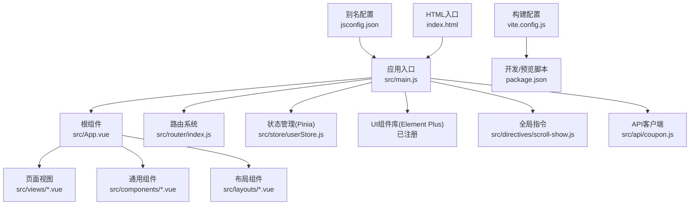
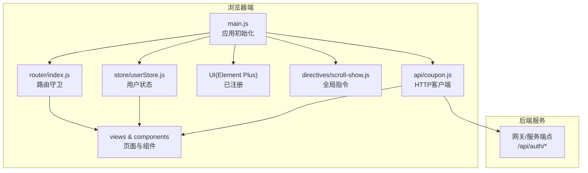
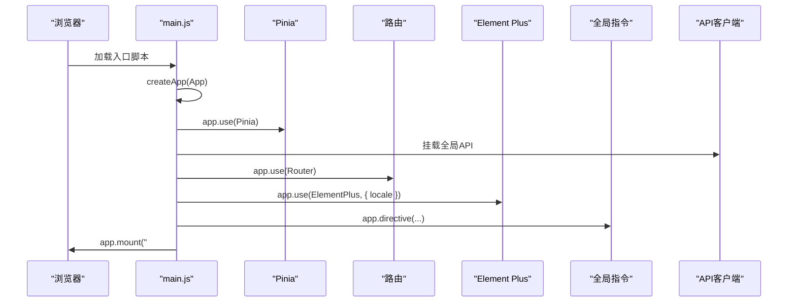
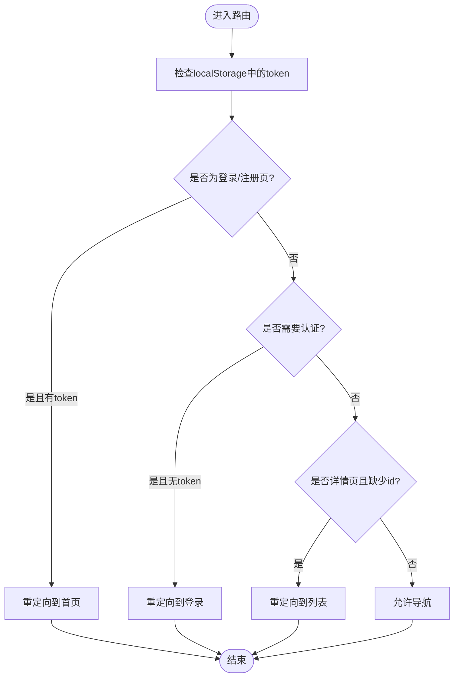
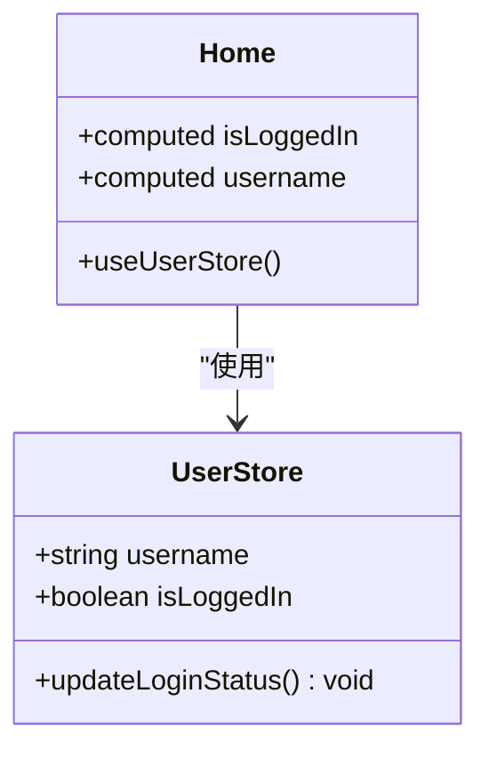
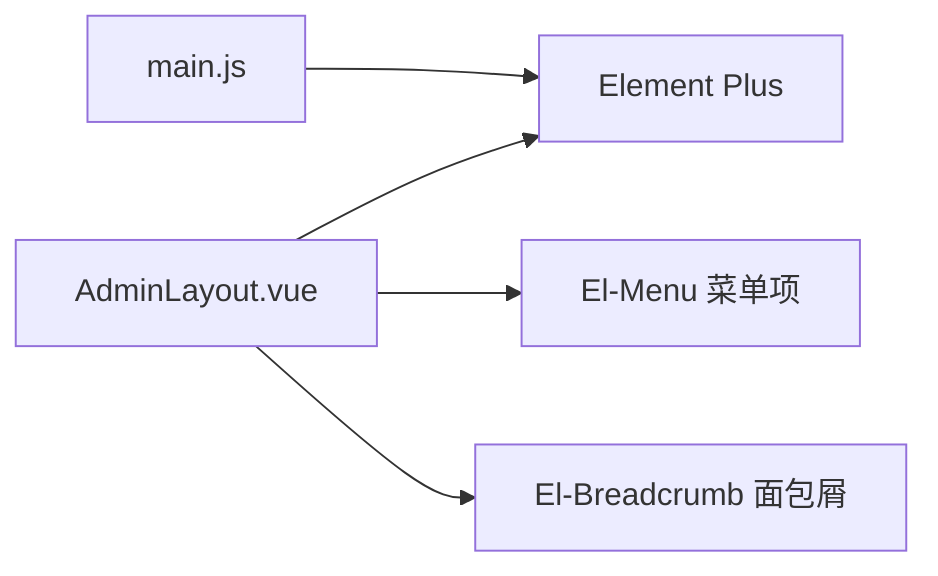
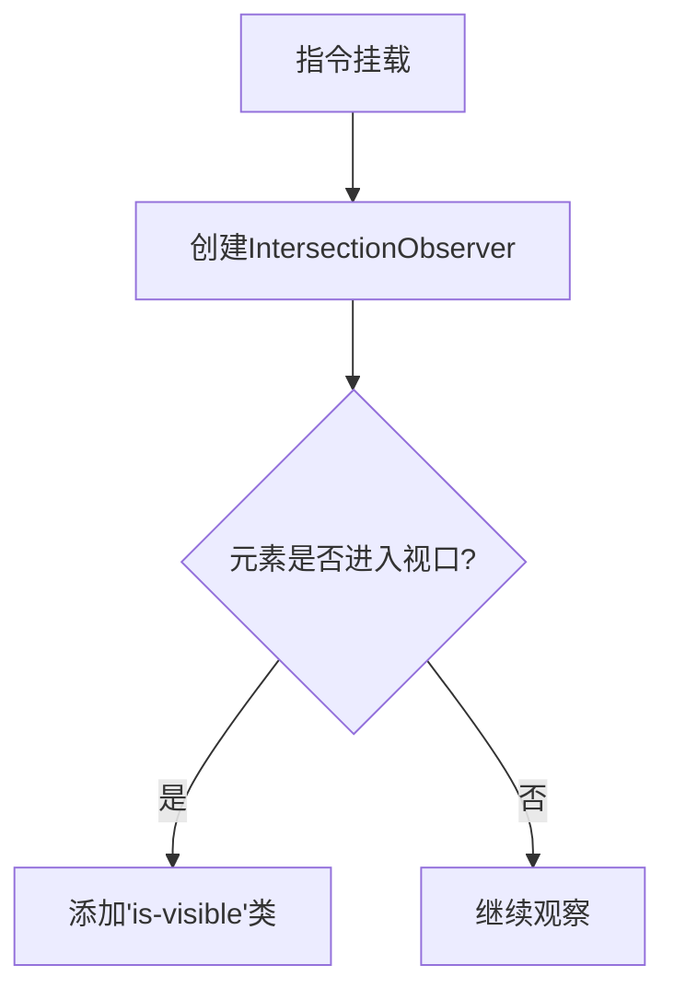
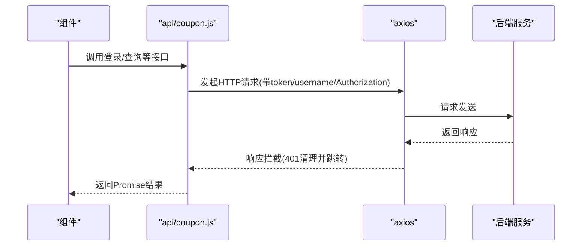
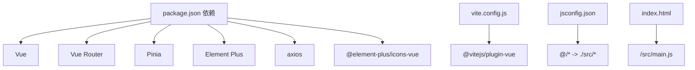

# Vue.js应用结构

<cite>
**本文引用的文件**
- [main.js](file://coupon/src/main.js)
- [App.vue](file://coupon/src/App.vue)
- [router/index.js](file://coupon/src/router/index.js)
- [store/userStore.js](file://coupon/src/store/userStore.js)
- [utils/plugins.js](file://coupon/src/utils/plugins.js)
- [directives/scroll-show.js](file://coupon/src/directives/scroll-show.js)
- [api/coupon.js](file://coupon/src/api/coupon.js)
- [layouts/AdminLayout.vue](file://coupon/src/layouts/AdminLayout.vue)
- [components/Home.vue](file://coupon/src/components/Home.vue)
- [assets/main.css](file://coupon/src/assets/main.css)
- [vite.config.js](file://coupon/vite.config.js)
- [package.json](file://coupon/package.json)
- [jsconfig.json](file://coupon/jsconfig.json)
- [index.html](file://coupon/index.html)
</cite>

## 目录
1. [简介](#简介)
2. [项目结构](#项目结构)
3. [核心组件](#核心组件)
4. [架构总览](#架构总览)
5. [详细组件分析](#详细组件分析)
6. [依赖关系分析](#依赖关系分析)
7. [性能考虑](#性能考虑)
8. [故障排查指南](#故障排查指南)
9. [结论](#结论)
10. [附录](#附录)

## 简介
本文件面向Vue.js 3.x前端应用，系统化梳理从应用初始化、全局配置与插件注册、状态管理与路由体系，到UI组件库集成、构建工具配置与优化策略的完整实现路径。同时给出目录组织原则、第三方库集成最佳实践（图标库、字体库、国际化），帮助开发者快速理解并高效维护该应用。

## 项目结构
应用位于多模块工程中的前端子模块，核心源码集中在 coupon 子模块下，采用“按功能域”组织方式：
- 应用入口与根组件：src/main.js、src/App.vue
- 路由与视图：src/router、src/views、src/components、src/layouts
- 状态管理：src/store（Pinia）
- 工具与指令：src/utils、src/directives
- API封装：src/api
- 样式与资源：src/assets、public（静态资源）
- 构建与脚本：vite.config.js、package.json、jsconfig.json、index.html

图表来源
- [main.js:1-34](file://coupon/src/main.js#L1-L34)
- [App.vue:1-89](file://coupon/src/App.vue#L1-L89)
- [router/index.js:1-127](file://coupon/src/router/index.js#L1-L127)
- [store/userStore.js:1-19](file://coupon/src/store/userStore.js#L1-L19)
- [directives/scroll-show.js:1-16](file://coupon/src/directives/scroll-show.js#L1-L16)
- [api/coupon.js:1-145](file://coupon/src/api/coupon.js#L1-L145)
- [vite.config.js:1-28](file://coupon/vite.config.js#L1-L28)
- [jsconfig.json:1-9](file://coupon/jsconfig.json#L1-L9)
- [index.html:1-15](file://coupon/index.html#L1-L15)

章节来源
- [main.js:1-34](file://coupon/src/main.js#L1-L34)
- [router/index.js:1-127](file://coupon/src/router/index.js#L1-L127)
- [store/userStore.js:1-19](file://coupon/src/store/userStore.js#L1-L19)
- [vite.config.js:1-28](file://coupon/vite.config.js#L1-L28)
- [jsconfig.json:1-9](file://coupon/jsconfig.json#L1-L9)
- [index.html:1-15](file://coupon/index.html#L1-L15)

## 核心组件
- 应用初始化与全局配置
  - 使用 createApp 创建应用实例，挂载 Pinia、路由、Element Plus，并注册全局指令与API客户端。
  - 设置全局警告处理器以抑制控制台告警；将API客户端挂载到全局属性供组件使用。
- 根组件与页面骨架
  - App.vue 作为顶层容器，使用 RouterView 包裹并启用 keep-alive 缓存，底部统一 Footer。
- 路由系统
  - 基于 History 模式的路由表，包含公开页面与受保护的管理后台子路由；在 beforeEach 中实现鉴权守卫。
- 状态管理
  - 使用 Pinia 定义用户状态仓库，持久化到 localStorage 并提供更新方法。
- 全局指令
  - 滚动显示指令，基于 IntersectionObserver 实现进入视口时添加可见类。
- API封装
  - 基于 axios 的客户端，设置基础路径、超时、请求/响应拦截器，统一封装业务接口。

章节来源
- [main.js:1-34](file://coupon/src/main.js#L1-L34)
- [App.vue:1-89](file://coupon/src/App.vue#L1-L89)
- [router/index.js:1-127](file://coupon/src/router/index.js#L1-L127)
- [store/userStore.js:1-19](file://coupon/src/store/userStore.js#L1-L19)
- [directives/scroll-show.js:1-16](file://coupon/src/directives/scroll-show.js#L1-L16)
- [api/coupon.js:1-145](file://coupon/src/api/coupon.js#L1-L145)

## 架构总览
应用采用“单页应用(SPA)”架构，前端负责路由、状态、UI与API交互，后端通过网关暴露REST接口。Element Plus 提供企业级UI能力，Pinia 管理用户会话状态，路由守卫保障受保护页面访问控制。

图表来源
- [main.js:1-34](file://coupon/src/main.js#L1-L34)
- [router/index.js:1-127](file://coupon/src/router/index.js#L1-L127)
- [store/userStore.js:1-19](file://coupon/src/store/userStore.js#L1-L19)
- [directives/scroll-show.js:1-16](file://coupon/src/directives/scroll-show.js#L1-L16)
- [api/coupon.js:1-145](file://coupon/src/api/coupon.js#L1-L145)

## 详细组件分析

### 应用初始化与全局配置
- 初始化流程
  - 创建应用实例 -> 注入 Pinia -> 注入路由 -> 注入 Element Plus(中文语言包) -> 注册全局指令 -> 挂载API客户端 -> 挂载DOM。
- 全局配置要点
  - 关闭全局警告输出，避免开发期干扰。
  - 将API客户端注入全局属性，便于组件直接调用。
  - 注册 Element Plus 图标集，按需注册至全局组件。
- 插件注册机制
  - app.use(...) 串联安装插件，顺序影响生命周期钩子与全局行为。

图表来源
- [main.js:1-34](file://coupon/src/main.js#L1-L34)

章节来源
- [main.js:1-34](file://coupon/src/main.js#L1-L34)

### 路由系统与鉴权守卫
- 路由表设计
  - 公开路由：首页、登录、注册、特性页、关于页。
  - 后台路由：以 AdminLayout 为容器，子路由包含优惠券模板管理、创建、兑换、详情、提醒、用户信息、结算查询等。
  - 路由懒加载：子组件按需动态导入。
- 鉴权逻辑
  - 登录/注册页若检测到token则重定向首页。
  - 需要认证的路由若无token则重定向登录。
  - 详情页缺少必要参数时重定向回列表。
  - 异常捕获并阻止导航。

图表来源
- [router/index.js:92-124](file://coupon/src/router/index.js#L92-L124)

章节来源
- [router/index.js:1-127](file://coupon/src/router/index.js#L1-L127)

### 状态管理（Pinia）与用户仓库
- 用户仓库
  - 状态：用户名、登录态。
  - 行为：从 localStorage 同步状态，提供更新方法。
- 使用方式
  - 在组件中通过组合式API获取仓库实例，读取计算状态并在事件中更新。

图表来源
- [store/userStore.js:1-19](file://coupon/src/store/userStore.js#L1-L19)
- [components/Home.vue:127-176](file://coupon/src/components/Home.vue#L127-L176)

章节来源
- [store/userStore.js:1-19](file://coupon/src/store/userStore.js#L1-L19)
- [components/Home.vue:127-176](file://coupon/src/components/Home.vue#L127-L176)

### UI组件库（Element Plus）集成
- 注册方式
  - 安装并引入 Element Plus，设置中文语言包。
  - 注册图标库，按需在组件中使用。
- 管理后台布局
  - AdminLayout 使用 ElContainer/ElHeader/ElAside/ElMain 构建固定头部+侧边菜单+主内容区。
  - 面包屑根据当前路由名称映射中文标题。
  - 侧边菜单项与路由联动，支持图标与高亮态。

图表来源
- [main.js:5-31](file://coupon/src/main.js#L5-L31)
- [layouts/AdminLayout.vue:1-118](file://coupon/src/layouts/AdminLayout.vue#L1-L118)

章节来源
- [main.js:5-31](file://coupon/src/main.js#L5-L31)
- [layouts/AdminLayout.vue:1-118](file://coupon/src/layouts/AdminLayout.vue#L1-L118)

### 全局指令与工具
- 滚动显示指令
  - 基于 IntersectionObserver，在元素进入视口时添加可见类，用于页面元素的渐显动画。
- 工具函数
  - 非空判断工具，过滤 undefined/null 等无效值。

图表来源
- [directives/scroll-show.js:1-16](file://coupon/src/directives/scroll-show.js#L1-L16)

章节来源
- [directives/scroll-show.js:1-16](file://coupon/src/directives/scroll-show.js#L1-L16)
- [utils/plugins.js:1-4](file://coupon/src/utils/plugins.js#L1-L4)

### API封装与拦截器
- 客户端配置
  - 基础路径指向后端服务，设置超时。
- 请求拦截
  - 自动注入token、username、Authorization头。
- 响应拦截
  - 成功/失败分支处理；当响应状态为401时清理本地存储并跳转登录。
- 接口聚合
  - 封装登录、注册、优惠券查询/兑换/提醒、结算、用户信息等常用接口。

图表来源
- [api/coupon.js:1-145](file://coupon/src/api/coupon.js#L1-L145)

章节来源
- [api/coupon.js:1-145](file://coupon/src/api/coupon.js#L1-L145)

### 根组件与页面骨架
- App.vue
  - 使用 RouterView 包裹并启用 keep-alive，保证切换时缓存组件状态。
  - 统一底部 Footer。
- 样式
  - 全局基础样式、变量与媒体查询，适配移动端布局。

章节来源
- [App.vue:1-89](file://coupon/src/App.vue#L1-L89)
- [assets/main.css:1-147](file://coupon/src/assets/main.css#L1-L147)

## 依赖关系分析
- 运行时依赖
  - Vue 3、Vue Router 4、Pinia、Element Plus、axios、图标库、UI库等。
- 开发时依赖
  - Vite、@vitejs/plugin-vue、PostCSS/TailwindCSS、Sass、Vue Devtools等。
- 别名与入口
  - jsconfig.json 配置 @/* 指向 src/*，简化导入路径。
  - index.html 仅包含挂载点与入口脚本。

图表来源
- [package.json:11-35](file://coupon/package.json#L11-L35)
- [vite.config.js:1-28](file://coupon/vite.config.js#L1-L28)
- [jsconfig.json:1-9](file://coupon/jsconfig.json#L1-L9)
- [index.html:1-15](file://coupon/index.html#L1-L15)

章节来源
- [package.json:11-35](file://coupon/package.json#L11-L35)
- [vite.config.js:1-28](file://coupon/vite.config.js#L1-L28)
- [jsconfig.json:1-9](file://coupon/jsconfig.json#L1-L9)
- [index.html:1-15](file://coupon/index.html#L1-L15)

## 性能考虑
- 路由与组件缓存
  - App.vue 使用 keep-alive 缓存页面组件，减少重复渲染与请求。
- 路由懒加载
  - 子路由组件按需动态导入，降低首屏体积。
- 指令与动画
  - 滚动显示指令基于 IntersectionObserver，避免不必要的DOM操作。
- 构建优化建议
  - 生产构建时开启压缩与Tree-Shaking（由Vite默认提供）。
  - 对第三方库进行按需引入，避免全量打包。
  - 合理拆分异步组件，结合路由懒加载进一步优化首屏。
  - 使用CDN或外部资源时注意跨域与缓存策略。

## 故障排查指南
- 登录态异常
  - 检查路由守卫是否正确读取 localStorage；确认鉴权头是否注入。
- 401自动登出
  - 响应拦截器在401时会清理本地存储并跳转登录，确认后端返回状态码与拦截器逻辑一致。
- 路由跳转问题
  - 确认路由元信息 requiresAuth 是否正确标注；检查 beforeEach 中的条件分支。
- 图标/样式未生效
  - 确认 Element Plus 已注册且语言包正确；检查全局样式与组件scoped样式的优先级。

章节来源
- [router/index.js:92-124](file://coupon/src/router/index.js#L92-L124)
- [api/coupon.js:22-44](file://coupon/src/api/coupon.js#L22-L44)
- [main.js:18-31](file://coupon/src/main.js#L18-L31)

## 结论
该Vue.js应用以清晰的目录结构与职责分离为基础，结合Pinia、Vue Router、Element Plus与axios形成稳定的前端架构。通过路由守卫、全局指令与API拦截器，实现了良好的用户体验与可维护性。配合Vite的现代构建体系，具备良好的开发体验与生产性能表现。后续可在国际化、主题定制、组件库按需引入等方面持续优化。

## 附录
- 第三方库集成最佳实践
  - 图标库：按需引入 Element Plus 图标，或使用 Font Awesome，注意样式冲突与按需加载。
  - 字体库：通过 CDN 引入 Google Fonts，确保网络稳定与缓存策略。
  - 国际化：Element Plus 支持多语言，可结合 i18n 库实现多语言切换。
- 目录组织原则
  - 按功能域划分：router、store、components、views、layouts、api、utils、directives、assets。
  - 统一入口与别名：main.js 作为唯一入口，jsconfig.json 提供路径别名。
  - 静态资源：public 目录放置无需打包的静态文件，assets 放置需要构建处理的资源。