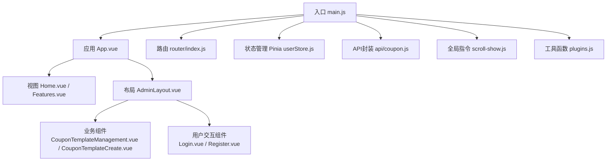
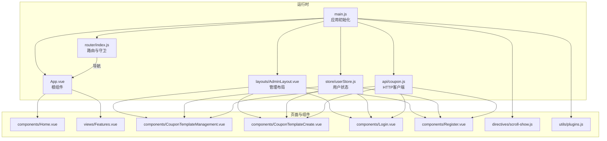
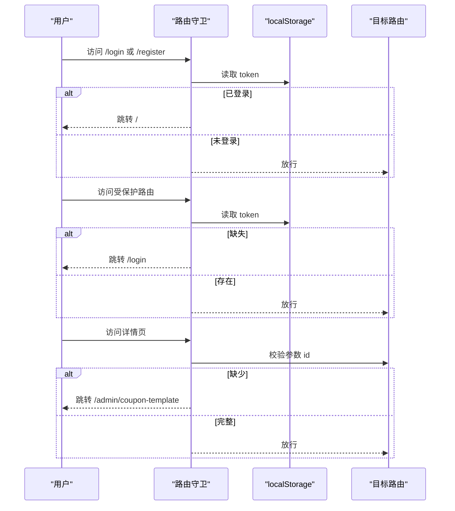
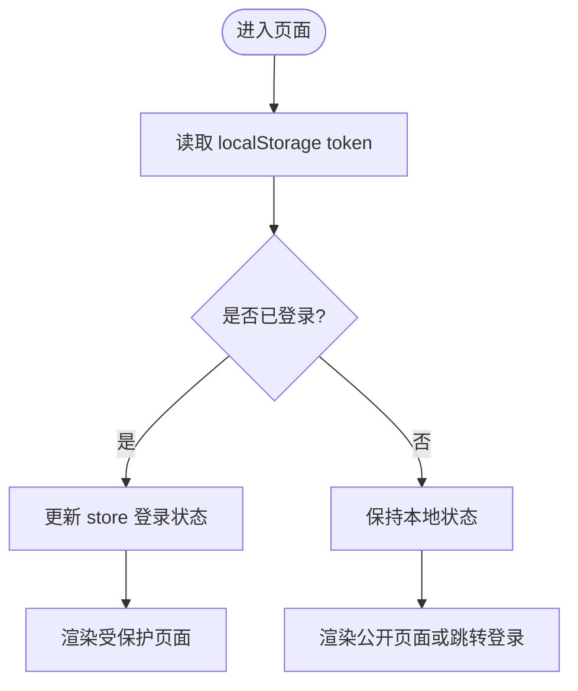
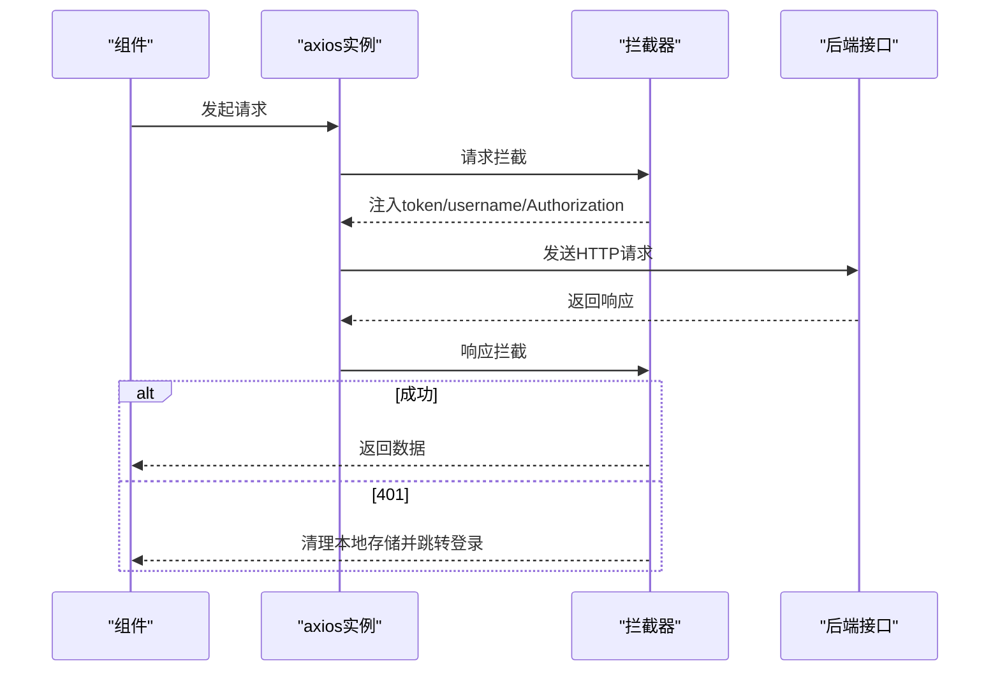
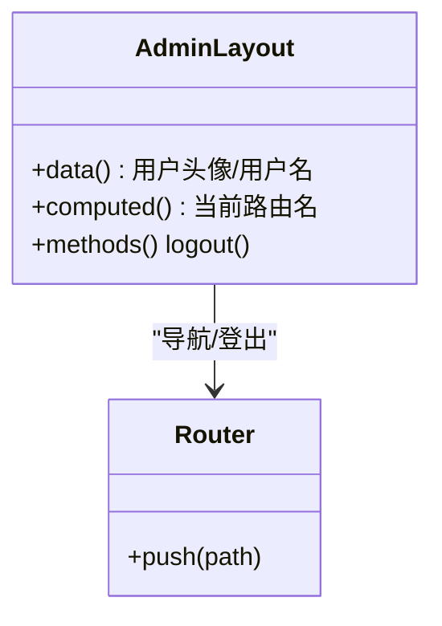
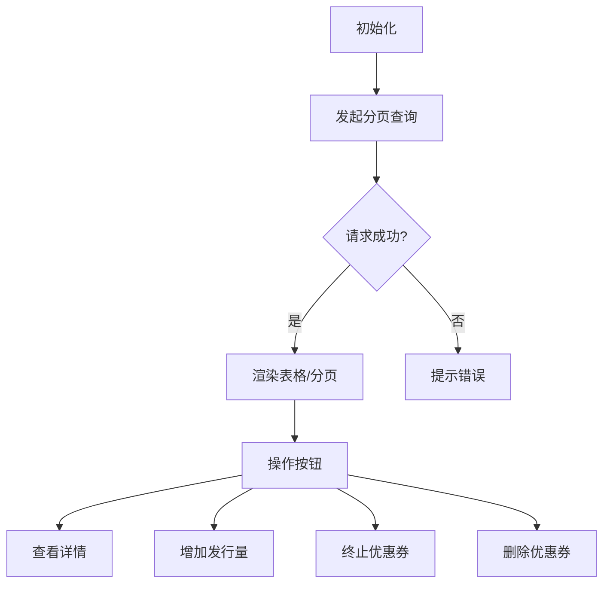
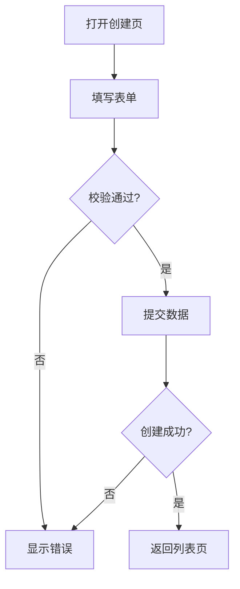
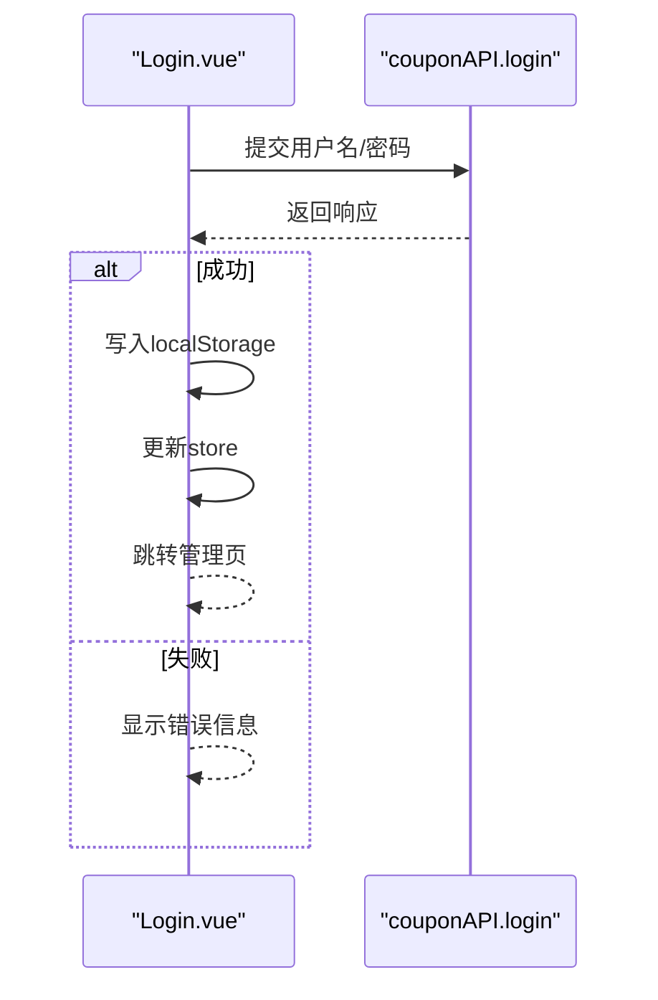
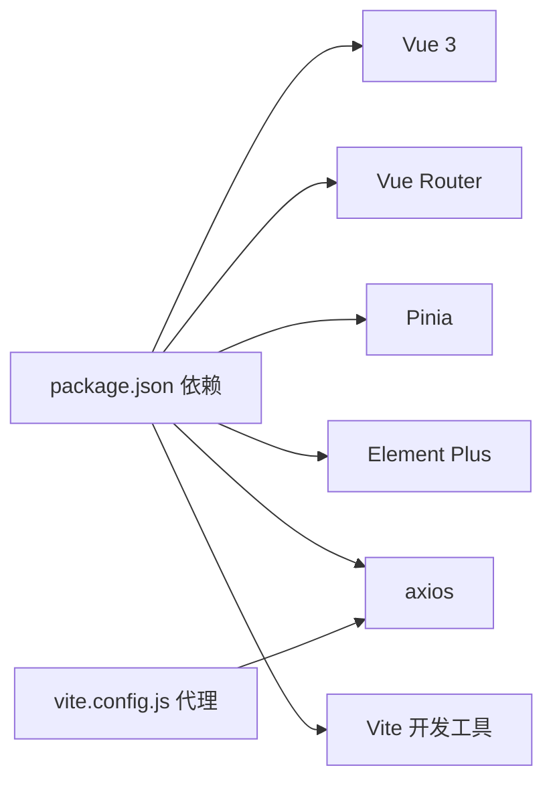

# 前端应用架构

<cite>
**本文档引用的文件**
- [package.json](file://coupon/package.json)
- [vite.config.js](file://coupon/vite.config.js)
- [main.js](file://coupon/src/main.js)
- [index.js](file://coupon/src/router/index.js)
- [userStore.js](file://coupon/src/store/userStore.js)
- [App.vue](file://coupon/src/App.vue)
- [coupon.js](file://coupon/src/api/coupon.js)
- [AdminLayout.vue](file://coupon/src/layouts/AdminLayout.vue)
- [Home.vue](file://coupon/src/components/Home.vue)
- [scroll-show.js](file://coupon/src/directives/scroll-show.js)
- [plugins.js](file://coupon/src/utils/plugins.js)
- [Features.vue](file://coupon/src/views/Features.vue)
- [Login.vue](file://coupon/src/components/Login.vue)
- [Register.vue](file://coupon/src/components/Register.vue)
- [CouponTemplateManagement.vue](file://coupon/src/components/CouponTemplateManagement.vue)
- [CouponTemplateCreate.vue](file://coupon/src/components/CouponTemplateCreate.vue)
- [Footer.vue](file://coupon/src/components/Footer.vue)
</cite>

## 目录
1. [引言](#引言)
2. [项目结构](#项目结构)
3. [核心组件](#核心组件)
4. [架构总览](#架构总览)
5. [详细组件分析](#详细组件分析)
6. [依赖关系分析](#依赖关系分析)
7. [性能考虑](#性能考虑)
8. [故障排除指南](#故障排除指南)
9. [结论](#结论)

## 引言
本文件面向MapleCoupon前端Vue.js应用，系统化梳理其SPA（单页应用）整体架构与实现细节。重点覆盖以下方面：
- Vue.js 3.x Composition API与选项式API的混合使用
- 组件化开发模式与响应式数据管理
- 路由配置、页面导航与权限控制（路由守卫）
- Pinia状态管理最佳实践与数据流
- 核心UI组件、表单校验与业务功能组件设计
- 组件间通信、事件处理与数据传递模式
- 前端与后端API集成（HTTP请求封装、错误处理、加载状态）
- 用户体验与性能优化策略

## 项目结构
前端项目位于coupon目录，采用Vite作为构建工具，使用Vue 3.x、Element Plus UI库、Pinia状态管理、Vue Router进行路由管理。项目结构清晰，按功能模块划分：api、components、layouts、router、store、utils、views等。

**图表来源**
- [main.js:1-34](file://coupon/src/main.js#L1-L34)
- [App.vue:1-15](file://coupon/src/App.vue#L1-L15)
- [index.js:1-127](file://coupon/src/router/index.js#L1-L127)
- [userStore.js:1-19](file://coupon/src/store/userStore.js#L1-L19)
- [coupon.js:1-145](file://coupon/src/api/coupon.js#L1-L145)
- [AdminLayout.vue:1-77](file://coupon/src/layouts/AdminLayout.vue#L1-L77)
- [Home.vue:1-125](file://coupon/src/components/Home.vue#L1-L125)
- [Features.vue:1-101](file://coupon/src/views/Features.vue#L1-L101)
- [Login.vue:1-53](file://coupon/src/components/Login.vue#L1-L53)
- [Register.vue:1-65](file://coupon/src/components/Register.vue#L1-L65)
- [CouponTemplateManagement.vue:1-225](file://coupon/src/components/CouponTemplateManagement.vue#L1-L225)
- [CouponTemplateCreate.vue:1-157](file://coupon/src/components/CouponTemplateCreate.vue#L1-L157)
- [scroll-show.js:1-16](file://coupon/src/directives/scroll-show.js#L1-L16)
- [plugins.js:1-4](file://coupon/src/utils/plugins.js#L1-L4)

**章节来源**
- [package.json:1-37](file://coupon/package.json#L1-L37)
- [vite.config.js:1-28](file://coupon/vite.config.js#L1-L28)
- [main.js:1-34](file://coupon/src/main.js#L1-L34)

## 核心组件
- 应用入口与全局配置：在入口文件中完成应用实例创建、插件安装（Element Plus、Vue Router）、全局指令注册、API模块挂载以及Pinia状态管理初始化。
- 应用根组件：App.vue负责顶层路由视图渲染与页面缓存（keep-alive），并统一注入公共样式。
- 路由系统：基于vue-router配置多级路由，包含公开页面与受保护的管理员页面，并在路由守卫中实现登录态校验与详情页参数校验。
- 状态管理：使用Pinia定义用户登录状态store，集中管理用户名与登录态，并通过全局属性暴露给组件使用。
- API封装：基于axios创建带拦截器的客户端，统一处理鉴权头、响应格式与401错误处理。
- 布局与导航：AdminLayout提供顶部导航、侧边菜单与面包屑，结合Element Plus菜单实现导航与页面缓存。
- 业务组件：优惠券管理列表、创建表单等，采用Element Plus表单与表格组件，结合本地校验与远程调用。
- 用户交互组件：登录、注册页面，包含表单校验、加载状态与错误提示。
- 视图组件：首页与特性页，展示系统亮点与技术特性，配合自定义指令实现滚动动画。

**章节来源**
- [main.js:1-34](file://coupon/src/main.js#L1-L34)
- [App.vue:1-15](file://coupon/src/App.vue#L1-L15)
- [index.js:1-127](file://coupon/src/router/index.js#L1-L127)
- [userStore.js:1-19](file://coupon/src/store/userStore.js#L1-L19)
- [coupon.js:1-145](file://coupon/src/api/coupon.js#L1-L145)
- [AdminLayout.vue:1-77](file://coupon/src/layouts/AdminLayout.vue#L1-L77)
- [CouponTemplateManagement.vue:1-225](file://coupon/src/components/CouponTemplateManagement.vue#L1-L225)
- [CouponTemplateCreate.vue:1-157](file://coupon/src/components/CouponTemplateCreate.vue#L1-L157)
- [Login.vue:1-53](file://coupon/src/components/Login.vue#L1-L53)
- [Register.vue:1-65](file://coupon/src/components/Register.vue#L1-L65)
- [Home.vue:1-125](file://coupon/src/components/Home.vue#L1-L125)
- [Features.vue:1-101](file://coupon/src/views/Features.vue#L1-L101)

## 架构总览
前端采用“入口配置 → 路由 → 布局/视图 → 组件 → 状态/API”的层次化架构。路由守卫统一处理权限，Pinia集中管理用户状态，axios拦截器统一处理鉴权与错误，Element Plus提供一致的UI体验。

**图表来源**
- [main.js:1-34](file://coupon/src/main.js#L1-L34)
- [index.js:1-127](file://coupon/src/router/index.js#L1-L127)
- [userStore.js:1-19](file://coupon/src/store/userStore.js#L1-L19)
- [coupon.js:1-145](file://coupon/src/api/coupon.js#L1-L145)
- [AdminLayout.vue:1-77](file://coupon/src/layouts/AdminLayout.vue#L1-L77)
- [App.vue:1-15](file://coupon/src/App.vue#L1-L15)
- [Home.vue:1-125](file://coupon/src/components/Home.vue#L1-L125)
- [Features.vue:1-101](file://coupon/src/views/Features.vue#L1-L101)
- [CouponTemplateManagement.vue:1-225](file://coupon/src/components/CouponTemplateManagement.vue#L1-L225)
- [CouponTemplateCreate.vue:1-157](file://coupon/src/components/CouponTemplateCreate.vue#L1-L157)
- [Login.vue:1-53](file://coupon/src/components/Login.vue#L1-L53)
- [Register.vue:1-65](file://coupon/src/components/Register.vue#L1-L65)
- [scroll-show.js:1-16](file://coupon/src/directives/scroll-show.js#L1-L16)
- [plugins.js:1-4](file://coupon/src/utils/plugins.js#L1-L4)

## 详细组件分析

### 路由与权限控制
- 路由配置：定义首页、登录、注册、特性页、关于页以及管理员子路由（优惠券管理、创建、兑换、详情、提醒、用户信息、结算查询）。
- 权限控制：在路由守卫中读取localStorage中的token，对访问登录/注册页且已登录的用户进行跳转；对需要认证的页面进行token校验；对详情页缺少参数进行回退。
- 详情页参数校验：当路由名为详情页但无id时，强制跳转到管理页。

**图表来源**
- [index.js:92-124](file://coupon/src/router/index.js#L92-L124)

**章节来源**
- [index.js:1-127](file://coupon/src/router/index.js#L1-L127)

### 状态管理（Pinia）
- 用户store：以ref形式维护用户名与登录态，提供更新方法以同步localStorage变化。
- 全局属性：在入口文件将store挂载为全局属性，便于组件直接使用。
- 与路由守卫协作：在401错误时调用store更新登录状态，确保UI与状态一致。

**图表来源**
- [userStore.js:1-19](file://coupon/src/store/userStore.js#L1-L19)
- [main.js:17-21](file://coupon/src/main.js#L17-L21)

**章节来源**
- [userStore.js:1-19](file://coupon/src/store/userStore.js#L1-L19)
- [main.js:17-21](file://coupon/src/main.js#L17-L21)

### API封装与错误处理
- 基础配置：基于Vite环境变量设置baseURL，设置超时时间。
- 请求拦截：统一注入token、username与Authorization头。
- 响应拦截：根据success字段判断请求结果；对401错误清理本地存储并跳转登录。
- 方法封装：围绕后端接口定义登录、注册、优惠券查询、提醒、兑换、结算、模板增删改查等方法。

**图表来源**
- [coupon.js:1-45](file://coupon/src/api/coupon.js#L1-L45)

**章节来源**
- [coupon.js:1-145](file://coupon/src/api/coupon.js#L1-L145)

### 布局与导航（AdminLayout）
- 顶部导航：包含Logo、面包屑与用户信息展示。
- 侧边菜单：基于Element Plus菜单，支持router模式，与路由路径联动。
- 内容区域：使用keep-alive缓存页面，提升切换体验。
- 登出逻辑：清除本地存储并跳转登录页。

**图表来源**
- [AdminLayout.vue:80-118](file://coupon/src/layouts/AdminLayout.vue#L80-L118)
- [index.js:1-127](file://coupon/src/router/index.js#L1-L127)

**章节来源**
- [AdminLayout.vue:1-77](file://coupon/src/layouts/AdminLayout.vue#L1-L77)

### 业务组件设计

#### 优惠券管理（列表）
- 搜索表单：支持名称、优惠对象、商品编码、优惠类型筛选。
- 列表展示：使用Element Plus表格，包含有效期、库存、规则查看、操作列（查看详情、增加发行量、终止、删除）。
- 分页与加载：支持分页器与加载状态。
- 对话框：增加发行量、终止、删除均采用对话框确认。
- 规则解析：JSON字符串规则解析为HTML提示内容。

**图表来源**
- [CouponTemplateManagement.vue:275-449](file://coupon/src/components/CouponTemplateManagement.vue#L275-L449)

**章节来源**
- [CouponTemplateManagement.vue:1-225](file://coupon/src/components/CouponTemplateManagement.vue#L1-L225)

#### 优惠券创建（表单）
- 表单分段：基本信息、优惠设置、使用规则。
- 校验规则：包含必填项、商品专属时的商品编码校验、有效期范围、数值范围等。
- 提交流程：序列化规则对象为JSON，提交后成功提示并返回列表页。

**图表来源**
- [CouponTemplateCreate.vue:168-264](file://coupon/src/components/CouponTemplateCreate.vue#L168-L264)

**章节来源**
- [CouponTemplateCreate.vue:1-157](file://coupon/src/components/CouponTemplateCreate.vue#L1-L157)

### 用户交互组件

#### 登录页
- 表单字段：用户名、密码。
- 加载与错误：提交时禁用按钮，捕获错误并提示。
- 成功后：写入token与用户名到localStorage，更新store，跳转管理页。

**图表来源**
- [Login.vue:69-95](file://coupon/src/components/Login.vue#L69-L95)
- [coupon.js:48-49](file://coupon/src/api/coupon.js#L48-L49)

**章节来源**
- [Login.vue:1-53](file://coupon/src/components/Login.vue#L1-L53)

#### 注册页
- 表单字段：用户名、密码、店铺名称、真实姓名、手机号、邮箱。
- 流程：提交注册后自动触发登录，成功后跳转首页。

**章节来源**
- [Register.vue:1-65](file://coupon/src/components/Register.vue#L1-L65)

### 视图与通用组件
- 首页与特性页：用于展示系统亮点与技术特性，配合自定义滚动显示指令实现进入视口时的动画。
- 通用指令：scroll-show基于IntersectionObserver实现进入视口时的可见性切换。
- 工具函数：isNotEmpty用于判空辅助。

**章节来源**
- [Home.vue:1-125](file://coupon/src/components/Home.vue#L1-L125)
- [Features.vue:1-101](file://coupon/src/views/Features.vue#L1-L101)
- [scroll-show.js:1-16](file://coupon/src/directives/scroll-show.js#L1-L16)
- [plugins.js:1-4](file://coupon/src/utils/plugins.js#L1-L4)

## 依赖关系分析
- 构建与运行时依赖：Vue 3、Vue Router、Pinia、Element Plus、axios、daisyui、echarts、js-cookie、particles.js等。
- 开发依赖：Vite、Vue插件、PostCSS、TailwindCSS、Sass嵌入式等。
- 代理配置：开发环境通过Vite代理将/api前缀转发到后端服务。

**图表来源**
- [package.json:11-26](file://coupon/package.json#L11-L26)
- [vite.config.js:14-25](file://coupon/vite.config.js#L14-L25)

**章节来源**
- [package.json:1-37](file://coupon/package.json#L1-L37)
- [vite.config.js:1-28](file://coupon/vite.config.js#L1-L28)

## 性能考虑
- 页面缓存：App.vue与AdminLayout.vue均使用keep-alive包裹router-view，避免重复渲染，提升切换性能。
- 指令优化：scroll-show使用IntersectionObserver，仅在元素进入视口时添加可见类，降低DOM开销。
- 表格优化：Element Plus表格启用will-change与transform优化，减少重绘重排。
- 资源懒加载：路由组件采用动态导入，按需加载，降低首屏体积。
- 代理与网络：开发环境通过代理避免跨域，生产环境建议后端配置CORS与CDN加速。

[本节为通用指导，无需特定文件引用]

## 故障排除指南
- 登录后仍被重定向到登录页
  - 检查路由守卫逻辑与localStorage中的token是否存在。
  - 确认登录成功后是否正确写入token与username。
- 401错误频繁出现
  - 检查响应拦截器是否正确清理localStorage并跳转登录。
  - 确认请求拦截器是否正确注入token与Authorization头。
- 详情页无法访问
  - 确认路由参数id是否传入，路由守卫会在此情况下回退到管理页。
- 表单校验不生效
  - 检查Element Plus表单规则与校验时机，确保在提交时触发validate。
- 表格滚动卡顿
  - 确认已启用will-change与transform优化，避免大列表时的重排。

**章节来源**
- [index.js:92-124](file://coupon/src/router/index.js#L92-L124)
- [coupon.js:8-45](file://coupon/src/api/coupon.js#L8-L45)
- [CouponTemplateManagement.vue:313-320](file://coupon/src/components/CouponTemplateManagement.vue#L313-L320)

## 结论
MapleCoupon前端应用采用现代化的Vue 3生态，结合Pinia、Element Plus与Vue Router，实现了清晰的路由权限控制、统一的API封装与良好的用户体验。通过keep-alive缓存、自定义指令与表格优化等手段，在保证开发效率的同时兼顾了性能与可维护性。后续可在以下方向持续优化：完善错误边界与全局异常处理、引入更细粒度的组件拆分与测试、增强主题与无障碍能力、以及在生产环境进一步优化资源加载与CDN策略。