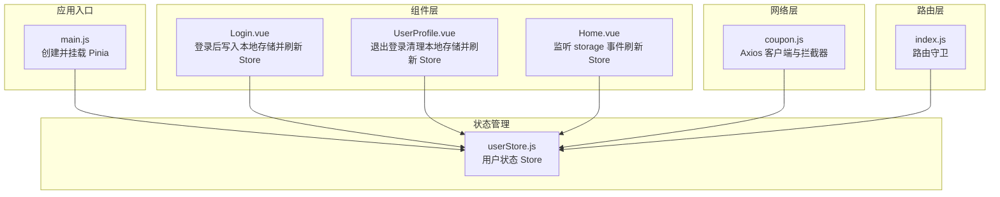
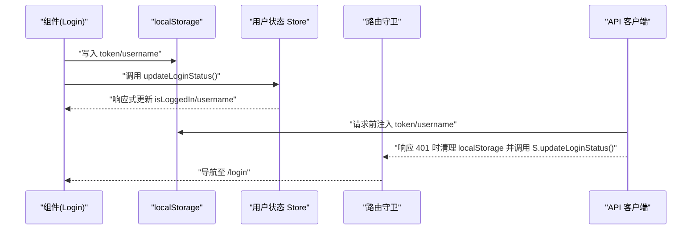
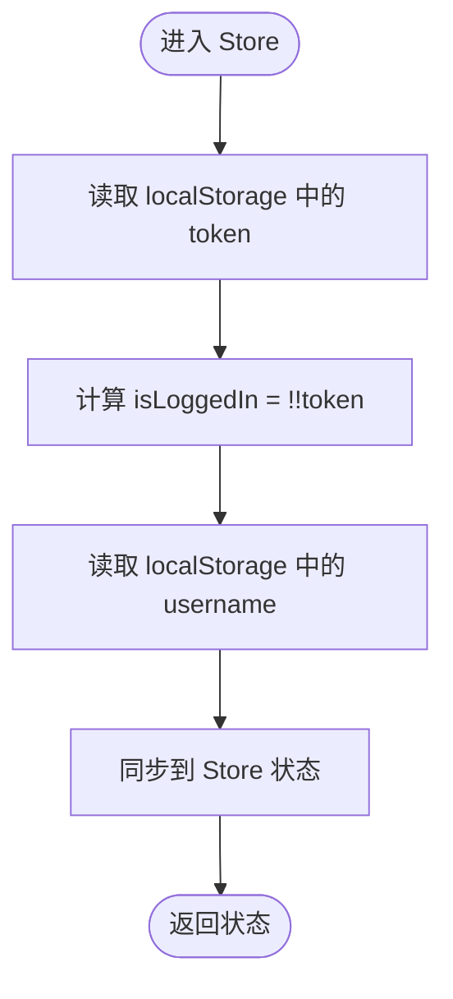
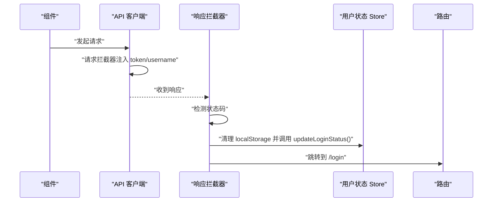
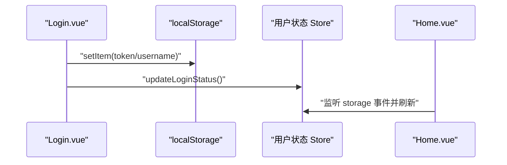
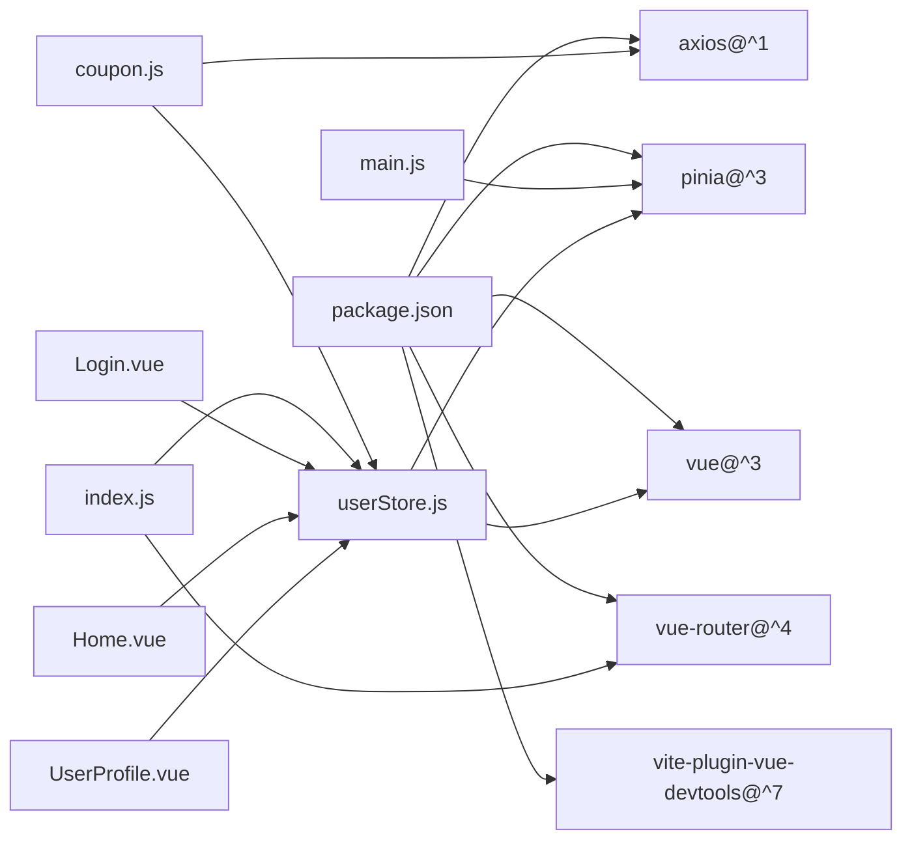

# 状态管理

<cite>
**本文引用的文件**
- [main.js](file://coupon/src/main.js)
- [userStore.js](file://coupon/src/store/userStore.js)
- [coupon.js](file://coupon/src/api/coupon.js)
- [index.js](file://coupon/src/router/index.js)
- [Login.vue](file://coupon/src/components/Login.vue)
- [Home.vue](file://coupon/src/components/Home.vue)
- [UserProfile.vue](file://coupon/src/components/UserProfile.vue)
- [plugins.js](file://coupon/src/utils/plugins.js)
- [package.json](file://coupon/package.json)
</cite>

## 目录
1. [简介](#简介)
2. [项目结构](#项目结构)
3. [核心组件](#核心组件)
4. [架构总览](#架构总览)
5. [详细组件分析](#详细组件分析)
6. [依赖分析](#依赖分析)
7. [性能考虑](#性能考虑)
8. [故障排查指南](#故障排查指南)
9. [结论](#结论)
10. [附录](#附录)

## 简介
本指南围绕 Pinia 在 Vue 3 应用中的使用进行系统化说明，重点覆盖以下方面：
- Store 的定义与状态管理
- 用户状态（登录态、用户名）的存储与同步机制
- 状态持久化策略（localStorage）
- 插件与开发工具集成
- 响应式更新与组件间共享
- 最佳实践与性能优化建议

在当前代码库中，Pinia 已在应用入口完成初始化，并通过一个轻量的用户状态 Store 管理登录态与用户名；同时，API 层与路由守卫均以 localStorage 作为持久化介质，形成“本地存储 → Store 状态”的双向同步闭环。

## 项目结构
与状态管理相关的关键文件分布如下：
- 应用入口：初始化 Pinia 并挂载全局配置
- 用户状态 Store：集中管理用户登录态与用户名
- API 层：统一注入认证头，处理 401 时清理本地存储并刷新 Store
- 路由守卫：基于 localStorage 判断是否放行
- 组件层：在登录、退出等关键流程中更新 Store 与本地存储
- 工具函数：通用校验工具



图表来源
- [main.js:16-19](file://coupon/src/main.js#L16-L19)
- [userStore.js:4-18](file://coupon/src/store/userStore.js#L4-L18)
- [coupon.js:8-45](file://coupon/src/api/coupon.js#L8-L45)
- [index.js:92-124](file://coupon/src/router/index.js#L92-L124)
- [Login.vue:69-95](file://coupon/src/components/Login.vue#L69-L95)
- [Home.vue:173-176](file://coupon/src/components/Home.vue#L173-L176)
- [UserProfile.vue:190-204](file://coupon/src/components/UserProfile.vue#L190-L204)

章节来源
- [main.js:1-34](file://coupon/src/main.js#L1-L34)
- [package.json:11-26](file://coupon/package.json#L11-L26)

## 核心组件
- Pinia 初始化与挂载：在应用入口创建 Pinia 实例并挂载至 Vue 实例，使全局可使用。
- 用户状态 Store：以组合式 Store 形式定义用户名与登录态，提供刷新方法以从 localStorage 同步状态。
- API 客户端与拦截器：请求阶段注入认证头；响应阶段处理 401，清理本地存储并调用 Store 刷新。
- 路由守卫：根据 localStorage 决定是否放行受保护页面。
- 组件交互：登录成功写入本地存储并刷新 Store；退出登录清理本地存储并刷新 Store；Home 监听 storage 事件保持跨标签页一致。

章节来源
- [main.js:16-19](file://coupon/src/main.js#L16-L19)
- [userStore.js:4-18](file://coupon/src/store/userStore.js#L4-L18)
- [coupon.js:8-45](file://coupon/src/api/coupon.js#L8-L45)
- [index.js:92-124](file://coupon/src/router/index.js#L92-L124)
- [Login.vue:69-95](file://coupon/src/components/Login.vue#L69-L95)
- [Home.vue:173-176](file://coupon/src/components/Home.vue#L173-L176)
- [UserProfile.vue:190-204](file://coupon/src/components/UserProfile.vue#L190-L204)

## 架构总览
下图展示了“本地存储 → Store → 组件”以及“API/路由 → Store”的数据流路径：



图表来源
- [Login.vue:69-95](file://coupon/src/components/Login.vue#L69-L95)
- [coupon.js:8-45](file://coupon/src/api/coupon.js#L8-L45)
- [index.js:92-124](file://coupon/src/router/index.js#L92-L124)
- [userStore.js:4-18](file://coupon/src/store/userStore.js#L4-L18)

## 详细组件分析

### 用户状态 Store（userStore）
- 设计要点
  - 使用组合式 Store 定义用户名与登录态两个响应式状态。
  - 提供刷新方法，从 localStorage 读取最新值，保证与本地存储一致。
- 数据结构与复杂度
  - 状态为简单标量，读取/写入均为 O(1)。
- 依赖关系
  - 仅依赖 Vue 的 ref 与 Pinia 的 defineStore。
- 错误处理与边界
  - 未显式处理 localStorage 异常；建议在生产环境增加 try/catch 包裹。
- 性能影响
  - 频繁读取 localStorage 会带来轻微开销，但对用户体验影响有限。



图表来源
- [userStore.js:4-11](file://coupon/src/store/userStore.js#L4-L11)

章节来源
- [userStore.js:1-19](file://coupon/src/store/userStore.js#L1-L19)

### API 客户端与拦截器
- 请求拦截器
  - 从 localStorage 读取 token 与 username，注入到请求头。
- 响应拦截器
  - 对 401 响应清理 localStorage，并调用 Store 的刷新方法；随后跳转到登录页。
- 参数校验
  - 使用工具函数对空值进行统一判断，避免发送无效参数。



图表来源
- [coupon.js:8-45](file://coupon/src/api/coupon.js#L8-L45)
- [userStore.js:8-11](file://coupon/src/store/userStore.js#L8-L11)
- [index.js:95-111](file://coupon/src/router/index.js#L95-L111)

章节来源
- [coupon.js:1-145](file://coupon/src/api/coupon.js#L1-L145)
- [plugins.js:1-4](file://coupon/src/utils/plugins.js#L1-L4)

### 路由守卫
- 逻辑概览
  - 若访问登录/注册页且已存在 token，则重定向至首页。
  - 对于需要认证的页面，若无 token 则强制跳转至登录页。
  - 对详情页缺少参数的情况进行兜底处理。
- 与状态的耦合
  - 通过读取 localStorage 判断登录态，间接依赖 Store 的状态来源。

```mermaid
flowchart TD
Enter(["进入路由守卫"]) --> CheckPage["判断是否为登录/注册页"]
CheckPage --> HasToken{"是否存在 token?"}
HasToken --> |是| RedirectHome["重定向到 /"]
HasToken --> |否| Next()
HasToken --> |否| AuthRequired{"是否需要认证?"}
AuthRequired --> |是| NeedToken{"是否有 token?"}
NeedToken --> |否| GoLogin["跳转到 /login"]
NeedToken --> |是| Next()
AuthRequired --> |否| Next()
```

图表来源
- [index.js:92-124](file://coupon/src/router/index.js#L92-L124)

章节来源
- [index.js:1-127](file://coupon/src/router/index.js#L1-L127)

### 组件层交互（登录与退出）
- 登录流程
  - 成功后写入 token 与 username 至 localStorage，并调用 Store 的刷新方法。
- 退出登录流程
  - 清理 localStorage，调用 Store 刷新，并提示用户成功。
- Home 组件
  - 监听 storage 事件，当其他标签页修改了登录态时自动刷新 Store。



图表来源
- [Login.vue:69-95](file://coupon/src/components/Login.vue#L69-L95)
- [Home.vue:173-176](file://coupon/src/components/Home.vue#L173-L176)
- [UserProfile.vue:190-204](file://coupon/src/components/UserProfile.vue#L190-L204)

章节来源
- [Login.vue:55-95](file://coupon/src/components/Login.vue#L55-L95)
- [Home.vue:125-176](file://coupon/src/components/Home.vue#L125-L176)
- [UserProfile.vue:190-204](file://coupon/src/components/UserProfile.vue#L190-L204)

## 依赖分析
- 运行时依赖
  - Vue 3、Pinia、Vue Router、Axios 等。
- 开发期依赖
  - Vite、Vue DevTools 插件等。
- 关键耦合点
  - Store 与 localStorage 的耦合，API 与 Store 的耦合，路由与 localStorage 的耦合。



图表来源
- [package.json:11-35](file://coupon/package.json#L11-L35)
- [main.js:16-19](file://coupon/src/main.js#L16-L19)
- [userStore.js:1-18](file://coupon/src/store/userStore.js#L1-L18)
- [coupon.js:1-145](file://coupon/src/api/coupon.js#L1-L145)
- [index.js:1-127](file://coupon/src/router/index.js#L1-L127)
- [Login.vue:55-95](file://coupon/src/components/Login.vue#L55-L95)
- [Home.vue:125-176](file://coupon/src/components/Home.vue#L125-L176)
- [UserProfile.vue:190-204](file://coupon/src/components/UserProfile.vue#L190-L204)

章节来源
- [package.json:1-37](file://coupon/package.json#L1-L37)

## 性能考虑
- Store 刷新频率
  - 当前通过手动调用与 storage 事件触发，建议避免在高频渲染中重复刷新。
- localStorage 访问
  - 读写 localStorage 会阻塞主线程，建议在批量操作时合并更新。
- 响应式粒度
  - 将登录态与用户名拆分为独立响应式字段，减少不必要的组件重渲染。
- 缓存策略
  - 对于频繁访问的用户信息，可在 Store 内部增加内存缓存并在刷新时更新。

## 故障排查指南
- 登录后仍显示未登录
  - 检查登录成功后是否正确写入 token/username，并调用了 Store 的刷新方法。
  - 确认 Home 组件是否监听 storage 事件并刷新。
- 401 后未跳转登录页
  - 检查响应拦截器是否被触发，localStorage 是否被清理，Store 是否被刷新。
- 跨标签页登录态不一致
  - 确保各标签页均监听 storage 事件并刷新 Store。
- 路由守卫异常
  - 检查 localStorage 读取是否抛错，必要时增加 try/catch 并降级处理。

章节来源
- [coupon.js:31-44](file://coupon/src/api/coupon.js#L31-L44)
- [Home.vue:157-176](file://coupon/src/components/Home.vue#L157-L176)
- [index.js:95-111](file://coupon/src/router/index.js#L95-L111)

## 结论
本项目以 Pinia 为核心，结合 localStorage 实现了简洁可靠的用户状态管理方案。通过 Store 刷新、API 拦截器与路由守卫的协同，实现了“本地存储 → Store → 组件”的单向数据流与跨标签页同步。建议在生产环境中进一步增强错误处理与性能优化，以提升稳定性与用户体验。

## 附录
- 插件与开发工具
  - 已引入 Vue DevTools 插件，便于调试 Store 状态变化。
- 状态持久化策略
  - 采用 localStorage 存储 token 与 username，适合前端轻量状态持久化场景。
- 最佳实践清单
  - 明确状态来源（localStorage），避免多源不一致。
  - 在关键流程（登录/退出）统一刷新 Store。
  - 对高频访问的状态进行内存缓存与节流。
  - 在拦截器与路由守卫中增加异常处理与降级逻辑。