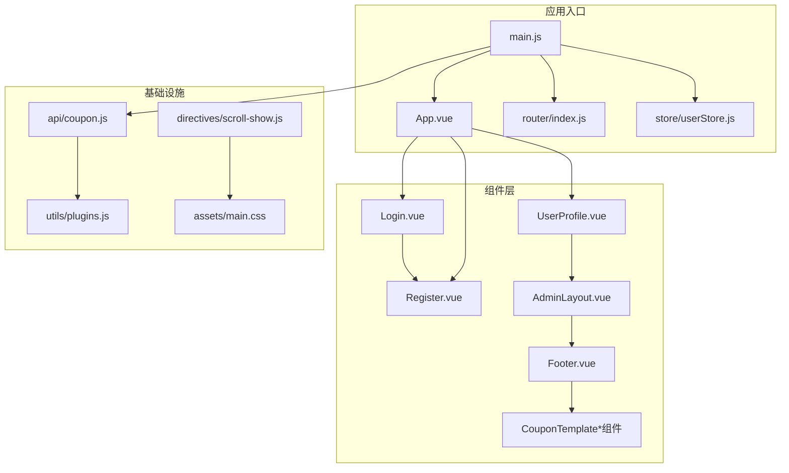
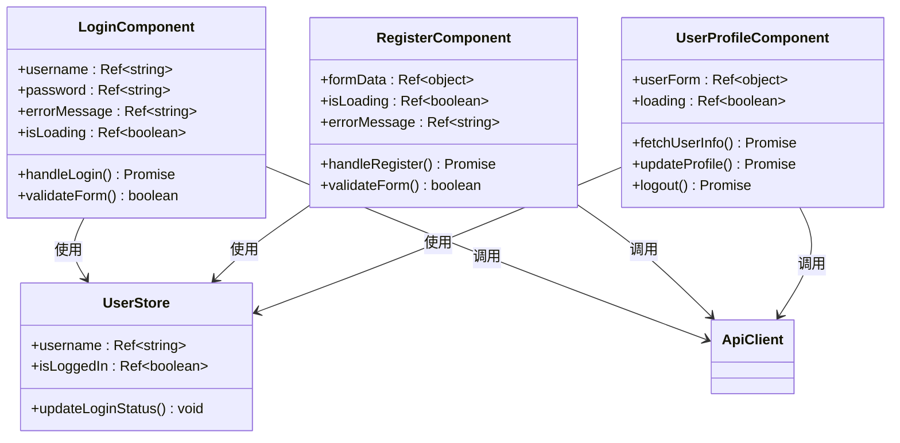
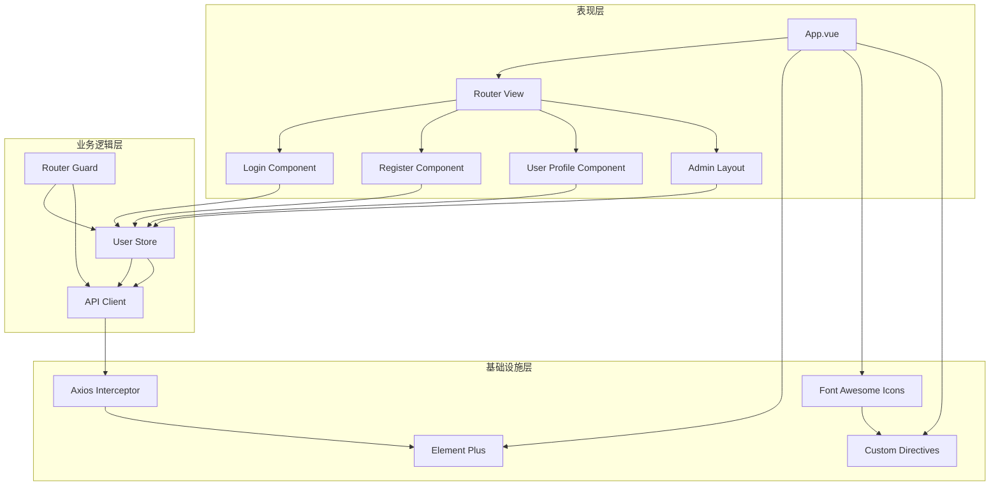
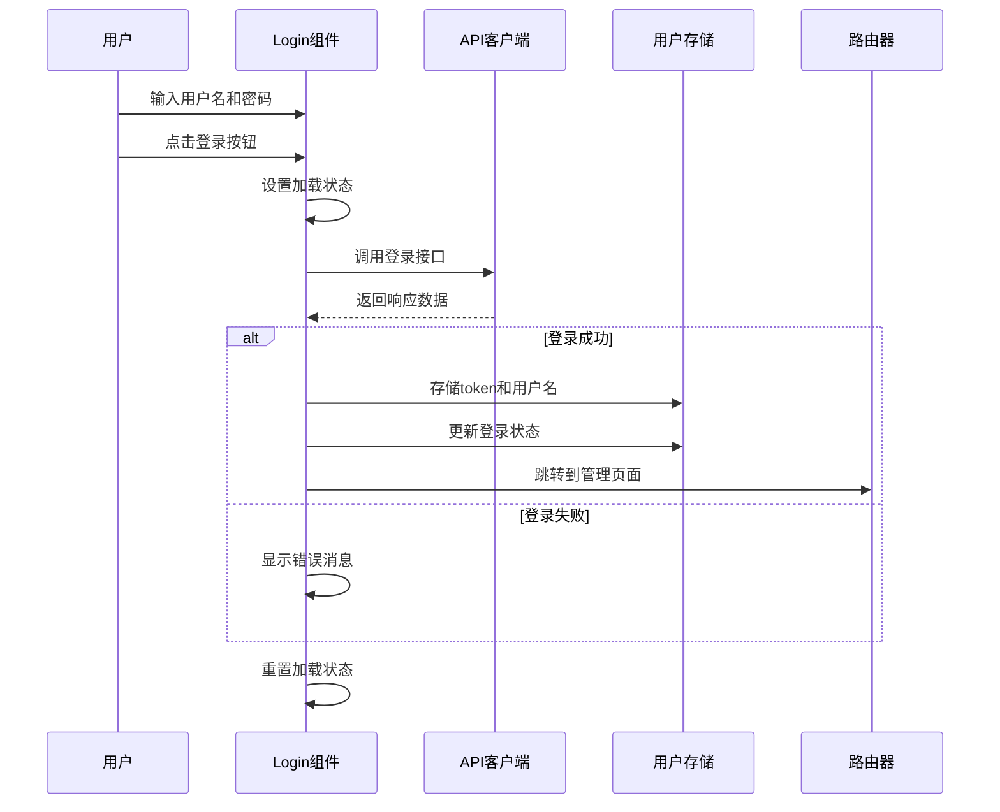
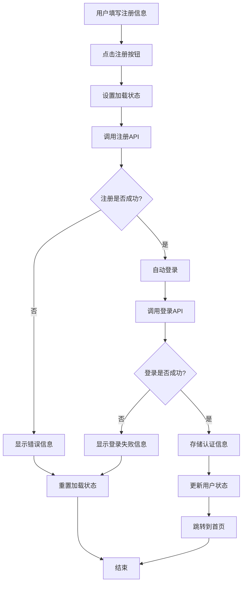
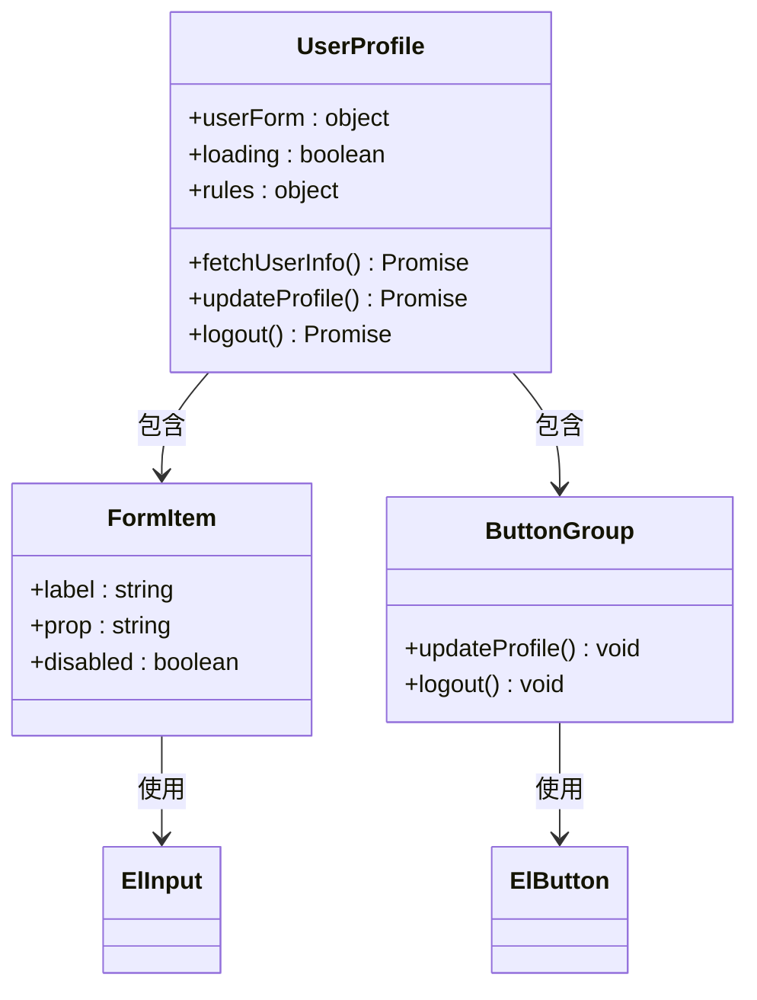
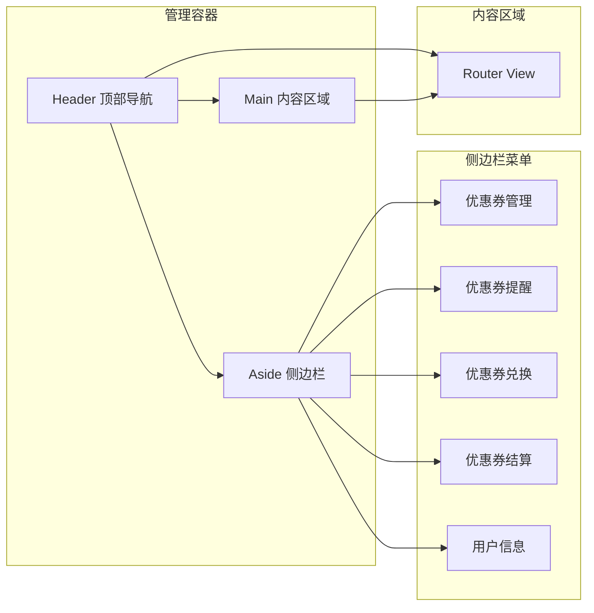
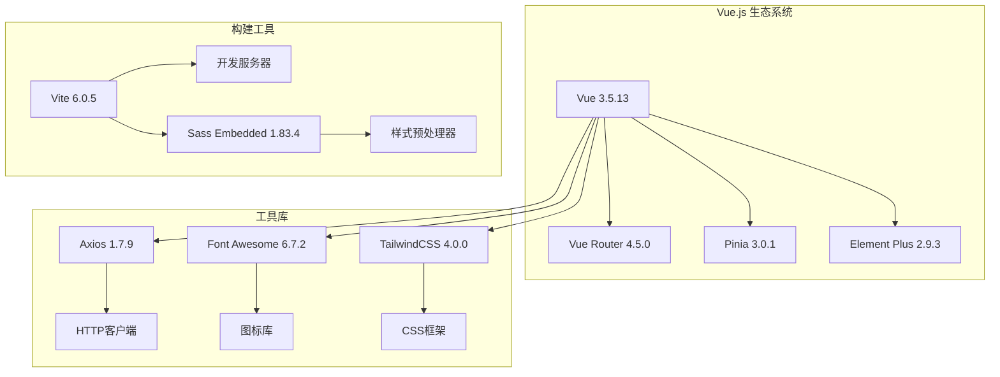
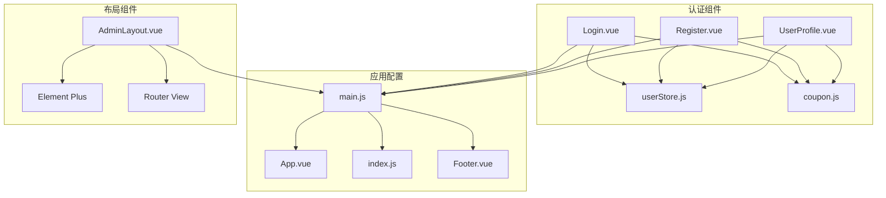
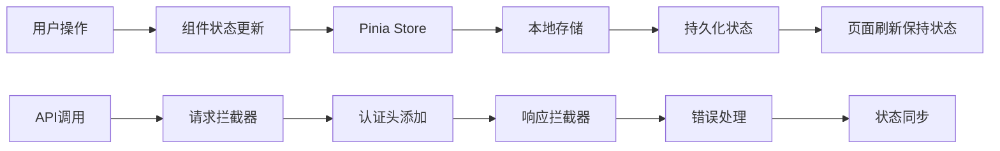

# 组件设计体系

<cite>
**本文档引用的文件**
- [Login.vue](file://coupon/src/components/Login.vue)
- [Register.vue](file://coupon/src/components/Register.vue)
- [UserProfile.vue](file://coupon/src/components/UserProfile.vue)
- [main.js](file://coupon/src/main.js)
- [App.vue](file://coupon/src/App.vue)
- [userStore.js](file://coupon/src/store/userStore.js)
- [coupon.js](file://coupon/src/api/coupon.js)
- [index.js](file://coupon/src/router/index.js)
- [Footer.vue](file://coupon/src/components/Footer.vue)
- [scroll-show.js](file://coupon/src/directives/scroll-show.js)
- [AdminLayout.vue](file://coupon/src/layouts/AdminLayout.vue)
- [plugins.js](file://coupon/src/utils/plugins.js)
- [package.json](file://coupon/package.json)
</cite>

## 目录
1. [简介](#简介)
2. [项目结构](#项目结构)
3. [核心组件](#核心组件)
4. [架构概览](#架构概览)
5. [详细组件分析](#详细组件分析)
6. [依赖关系分析](#依赖关系分析)
7. [性能考虑](#性能考虑)
8. [故障排除指南](#故障排除指南)
9. [结论](#结论)

## 简介

本项目是一个基于Vue.js 3的优惠券管理系统，采用现代化的组件化开发模式。系统通过精心设计的组件体系实现了用户认证、优惠券管理和用户信息维护等核心功能。本文档深入解析了组件设计体系，包括组件定义、注册和使用方式，核心业务组件的设计思路，以及组件间的交互逻辑。

## 项目结构

项目采用模块化的目录组织方式，主要分为以下层次：

**图表来源**
- [main.js:1-34](file://coupon/src/main.js#L1-L34)
- [App.vue:1-89](file://coupon/src/App.vue#L1-L89)
- [index.js:1-127](file://coupon/src/router/index.js#L1-L127)

**章节来源**
- [main.js:1-34](file://coupon/src/main.js#L1-L34)
- [package.json:1-37](file://coupon/package.json#L1-L37)

## 核心组件

### 认证组件体系

系统提供了完整的用户认证解决方案，包括登录、注册和用户信息管理三个核心组件：

**图表来源**
- [Login.vue:55-95](file://coupon/src/components/Login.vue#L55-L95)
- [Register.vue:67-117](file://coupon/src/components/Register.vue#L67-L117)
- [UserProfile.vue:105-206](file://coupon/src/components/UserProfile.vue#L105-L206)
- [userStore.js:1-19](file://coupon/src/store/userStore.js#L1-L19)

### 组件通信模式

系统采用了多种组件通信模式：

1. **Props传递**: 父组件向子组件传递配置和数据
2. **事件发射**: 子组件向父组件发送状态变化
3. **插槽使用**: 提供内容分发机制
4. **全局状态管理**: 通过Pinia实现跨组件状态共享

**章节来源**
- [Login.vue:24-40](file://coupon/src/components/Login.vue#L24-L40)
- [Register.vue:24-52](file://coupon/src/components/Register.vue#L24-L52)
- [UserProfile.vue:21-99](file://coupon/src/components/UserProfile.vue#L21-L99)

## 架构概览

系统采用分层架构设计，确保关注点分离和代码可维护性：

**图表来源**
- [App.vue:6-14](file://coupon/src/App.vue#L6-L14)
- [main.js:16-33](file://coupon/src/main.js#L16-L33)
- [index.js:92-124](file://coupon/src/router/index.js#L92-L124)

## 详细组件分析

### 登录组件 (Login.vue)

登录组件实现了完整的用户认证流程，具有以下特点：

#### 核心功能特性

1. **表单验证**: 实时用户名和密码输入验证
2. **加载状态管理**: 防止重复提交
3. **错误处理**: 友好的错误提示机制
4. **路由集成**: 成功登录后的页面跳转

#### 数据流分析

**图表来源**
- [Login.vue:69-95](file://coupon/src/components/Login.vue#L69-L95)
- [coupon.js:47-51](file://coupon/src/api/coupon.js#L47-L51)
- [userStore.js:8-11](file://coupon/src/store/userStore.js#L8-L11)

#### 最佳实践

1. **响应式数据绑定**: 使用`ref`管理组件状态
2. **异步操作处理**: 完整的try-catch-finally结构
3. **用户体验优化**: 加载状态和动画效果
4. **安全性考虑**: 错误信息的最小化暴露

**章节来源**
- [Login.vue:55-95](file://coupon/src/components/Login.vue#L55-L95)
- [Login.vue:99-346](file://coupon/src/components/Login.vue#L99-L346)

### 注册组件 (Register.vue)

注册组件提供了完整的用户注册流程，集成了自动登录功能：

#### 注册流程设计

**图表来源**
- [Register.vue:86-117](file://coupon/src/components/Register.vue#L86-L117)
- [coupon.js:47-51](file://coupon/src/api/coupon.js#L47-L51)

#### 表单设计特点

1. **网格布局**: 使用CSS Grid实现响应式表单布局
2. **字段完整性**: 包含所有必要的用户信息字段
3. **自动登录**: 注册成功后自动完成登录流程
4. **错误恢复**: 单独的错误处理机制

**章节来源**
- [Register.vue:67-117](file://coupon/src/components/Register.vue#L67-L117)
- [Register.vue:120-385](file://coupon/src/components/Register.vue#L120-L385)

### 用户资料组件 (UserProfile.vue)

用户资料组件实现了完整的用户信息管理功能：

#### 组件架构

**图表来源**
- [UserProfile.vue:109-206](file://coupon/src/components/UserProfile.vue#L109-L206)

#### 功能特性

1. **表单验证**: 基于Element Plus的完整表单验证
2. **动态布局**: 支持响应式网格布局
3. **图标集成**: 使用SVG图标增强用户体验
4. **状态管理**: 与Pinia状态管理集成

**章节来源**
- [UserProfile.vue:105-206](file://coupon/src/components/UserProfile.vue#L105-L206)
- [UserProfile.vue:209-559](file://coupon/src/components/UserProfile.vue#L209-L559)

### 管理布局组件 (AdminLayout.vue)

管理布局组件提供了完整的后台管理系统界面框架：

#### 布局结构

**图表来源**
- [AdminLayout.vue:1-800](file://coupon/src/layouts/AdminLayout.vue#L1-L800)

**章节来源**
- [AdminLayout.vue:1-800](file://coupon/src/layouts/AdminLayout.vue#L1-L800)

## 依赖关系分析

### 技术栈依赖

系统采用了现代化的Vue.js生态系统，主要依赖包括：

**图表来源**
- [package.json:11-26](file://coupon/package.json#L11-L26)
- [package.json:27-35](file://coupon/package.json#L27-L35)

### 组件间依赖关系

**图表来源**
- [main.js:16-33](file://coupon/src/main.js#L16-L33)
- [index.js:1-127](file://coupon/src/router/index.js#L1-L127)

**章节来源**
- [package.json:1-37](file://coupon/package.json#L1-L37)

## 性能考虑

### 组件性能优化策略

1. **懒加载路由**: 使用动态导入实现按需加载
2. **Keep-Alive缓存**: 缓存活跃组件避免重复渲染
3. **虚拟滚动**: 对大量数据使用虚拟滚动技术
4. **图片优化**: 使用现代图片格式和懒加载

### 状态管理优化

**图表来源**
- [userStore.js:4-18](file://coupon/src/store/userStore.js#L4-L18)
- [coupon.js:9-45](file://coupon/src/api/coupon.js#L9-L45)

### 缓存策略

1. **组件缓存**: 使用`keep-alive`缓存组件实例
2. **数据缓存**: API响应结果缓存机制
3. **静态资源**: CDN加速和压缩优化
4. **内存管理**: 合理的生命周期管理和清理

## 故障排除指南

### 常见问题及解决方案

#### 认证相关问题

| 问题类型 | 症状描述 | 解决方案 |
|---------|----------|----------|
| 登录失败 | 显示错误消息但无法登录 | 检查用户名密码格式，确认网络连接 |
| Token过期 | 页面跳转到登录页 | 检查响应拦截器，重新登录 |
| 会话丢失 | 刷新页面后状态重置 | 检查localStorage存储 |

#### 组件渲染问题

| 问题类型 | 症状描述 | 解决方案 |
|---------|----------|----------|
| 组件不显示 | 页面空白或白屏 | 检查组件导入路径，确认模板语法 |
| 样式异常 | 组件样式错乱 | 检查scoped样式作用域，确认CSS变量 |
| 事件不触发 | 点击无反应 | 检查事件绑定语法，确认事件监听器 |

#### 性能问题

| 问题类型 | 症状描述 | 解决方案 |
|---------|----------|----------|
| 页面卡顿 | 滚动不流畅 | 检查重绘重排，优化CSS动画 |
| 加载缓慢 | 页面响应慢 | 检查API调用频率，启用缓存 |
| 内存泄漏 | 内存持续增长 | 检查定时器清理，确认事件解绑 |

**章节来源**
- [coupon.js:35-44](file://coupon/src/api/coupon.js#L35-L44)
- [index.js:92-124](file://coupon/src/router/index.js#L92-L124)

### 调试技巧

1. **Vue DevTools**: 使用浏览器扩展调试组件树
2. **控制台日志**: 合理使用console.log进行调试
3. **断点调试**: 在关键函数设置断点
4. **网络监控**: 检查API请求和响应
5. **状态检查**: 验证Pinia状态同步

## 结论

本Vue.js组件设计体系展现了现代化前端开发的最佳实践。通过精心设计的组件架构、完善的认证机制和灵活的状态管理，系统实现了高可维护性和良好的用户体验。

### 设计优势

1. **模块化设计**: 清晰的组件职责划分
2. **响应式架构**: 适应不同设备和屏幕尺寸
3. **性能优化**: 多层次的性能优化策略
4. **可扩展性**: 易于添加新功能和组件
5. **可维护性**: 规范的代码结构和注释

### 改进建议

1. **单元测试**: 添加组件和API的单元测试
2. **类型安全**: 引入TypeScript提升类型安全
3. **国际化**: 支持多语言切换功能
4. **无障碍访问**: 增强无障碍访问支持
5. **性能监控**: 集成性能监控和错误追踪

该组件设计体系为类似的企业级应用开发提供了优秀的参考模板，体现了现代前端开发的核心理念和技术实践。