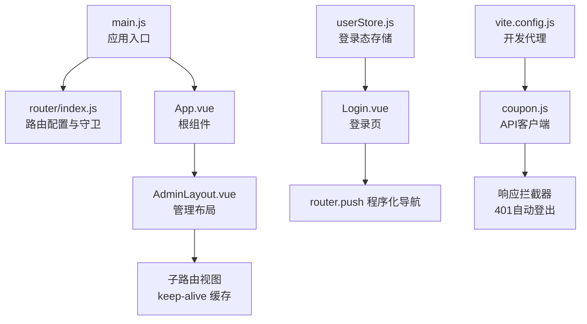
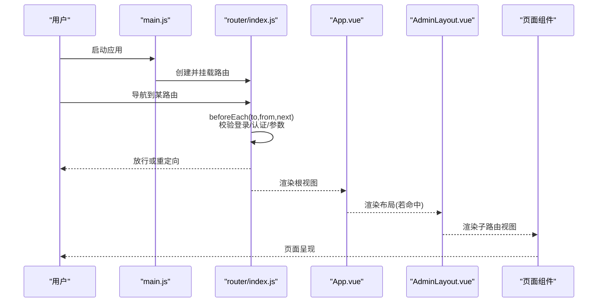
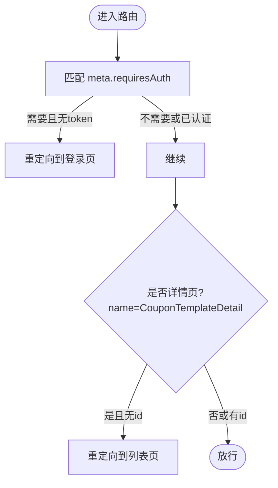
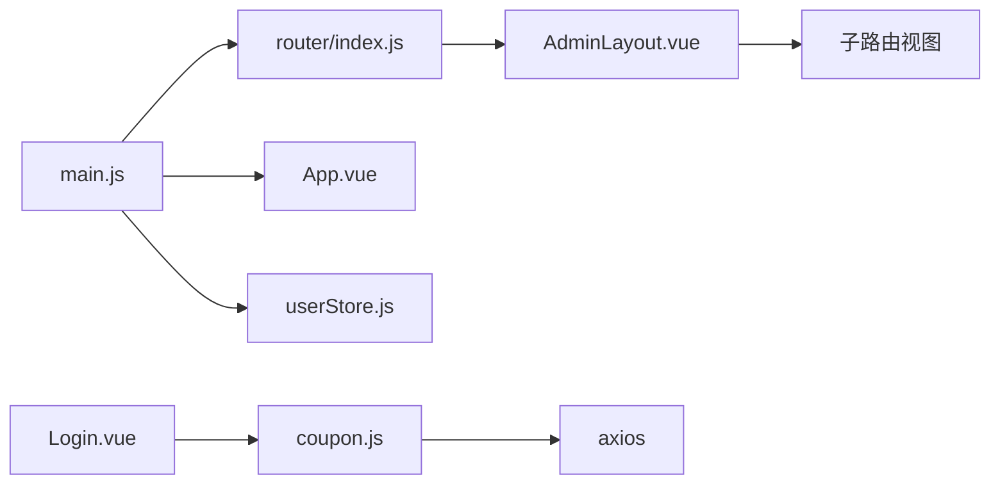

# 路由与导航

<cite>
**本文引用的文件**
- [coupon/src/router/index.js](file://coupon/src/router/index.js)
- [coupon/src/main.js](file://coupon/src/main.js)
- [coupon/src/App.vue](file://coupon/src/App.vue)
- [coupon/src/layouts/AdminLayout.vue](file://coupon/src/layouts/AdminLayout.vue)
- [coupon/src/components/Login.vue](file://coupon/src/components/Login.vue)
- [coupon/src/store/userStore.js](file://coupon/src/store/userStore.js)
- [coupon/src/api/coupon.js](file://coupon/src/api/coupon.js)
- [coupon/package.json](file://coupon/package.json)
- [coupon/vite.config.js](file://coupon/vite.config.js)
- [coupon/src/components/CouponTemplateDetail.vue](file://coupon/src/components/CouponTemplateDetail.vue)
</cite>

## 目录
1. [简介](#简介)
2. [项目结构](#项目结构)
3. [核心组件](#核心组件)
4. [架构总览](#架构总览)
5. [详细组件分析](#详细组件分析)
6. [依赖关系分析](#依赖关系分析)
7. [性能考量](#性能考量)
8. [故障排查指南](#故障排查指南)
9. [结论](#结论)
10. [附录](#附录)

## 简介
本文件面向Vue Router在本项目的应用，系统性梳理路由配置、嵌套路由、动态路由参数、导航守卫、权限控制、布局系统、懒加载与代码分割、路由元信息、以及程序化导航与声明式导航的实践与建议。目标是帮助开发者快速理解并正确扩展路由体系。

## 项目结构
- 路由入口与配置位于 [coupon/src/router/index.js](file://coupon/src/router/index.js)，集中定义所有路由、历史模式与全局前置守卫。
- 应用挂载于 [coupon/src/main.js](file://coupon/src/main.js)，注册路由、状态管理、UI框架等。
- 根组件 [coupon/src/App.vue](file://coupon/src/App.vue) 提供顶层视图容器与缓存策略。
- 管理后台布局 [coupon/src/layouts/AdminLayout.vue](file://coupon/src/layouts/AdminLayout.vue) 实现公共头部、侧边菜单与主内容区。
- 登录组件 [coupon/src/components/Login.vue](file://coupon/src/components/Login.vue) 展示声明式导航与程序化导航的结合使用。
- 用户状态 [coupon/src/store/userStore.js](file://coupon/src/store/userStore.js) 提供登录态与用户名的响应式存储。
- API 客户端 [coupon/src/api/coupon.js](file://coupon/src/api/coupon.js) 配置请求/响应拦截器，含鉴权异常处理。
- 构建与代理 [coupon/vite.config.js](file://coupon/vite.config.js) 提供开发服务器代理与路径别名。
- 依赖版本 [coupon/package.json](file://coupon/package.json) 显示 Vue 与 Vue Router 版本。
- 动态路由参数示例 [coupon/src/components/CouponTemplateDetail.vue](file://coupon/src/components/CouponTemplateDetail.vue) 展示如何读取路由参数并进行业务处理。

**图表来源**
- [coupon/src/main.js:1-34](file://coupon/src/main.js#L1-L34)
- [coupon/src/router/index.js:1-127](file://coupon/src/router/index.js#L1-L127)
- [coupon/src/App.vue:1-89](file://coupon/src/App.vue#L1-L89)
- [coupon/src/layouts/AdminLayout.vue:1-803](file://coupon/src/layouts/AdminLayout.vue#L1-L803)
- [coupon/src/components/Login.vue:1-346](file://coupon/src/components/Login.vue#L1-L346)
- [coupon/src/store/userStore.js:1-19](file://coupon/src/store/userStore.js#L1-L19)
- [coupon/src/api/coupon.js:1-145](file://coupon/src/api/coupon.js#L1-L145)
- [coupon/vite.config.js:1-28](file://coupon/vite.config.js#L1-L28)

**章节来源**
- [coupon/src/router/index.js:1-127](file://coupon/src/router/index.js#L1-L127)
- [coupon/src/main.js:1-34](file://coupon/src/main.js#L1-L34)
- [coupon/src/App.vue:1-89](file://coupon/src/App.vue#L1-L89)
- [coupon/src/layouts/AdminLayout.vue:1-803](file://coupon/src/layouts/AdminLayout.vue#L1-L803)
- [coupon/src/components/Login.vue:1-346](file://coupon/src/components/Login.vue#L1-L346)
- [coupon/src/store/userStore.js:1-19](file://coupon/src/store/userStore.js#L1-L19)
- [coupon/src/api/coupon.js:1-145](file://coupon/src/api/coupon.js#L1-L145)
- [coupon/vite.config.js:1-28](file://coupon/vite.config.js#L1-L28)
- [coupon/package.json:1-37](file://coupon/package.json#L1-L37)

## 核心组件
- 路由配置与守卫
  - 路由表集中定义，包含基础路由与嵌套路由；通过 meta 字段标记需要认证的页面。
  - 全局前置守卫负责：
    - 登录/注册页访问控制（已登录用户禁止再次进入登录页）。
    - 认证页面跳转校验（未登录访问需认证的页面将被重定向至登录页）。
    - 动态路由参数校验（详情页缺少参数时回退到列表页）。
  - 参考路径：[coupon/src/router/index.js:92-124](file://coupon/src/router/index.js#L92-L124)

- 根组件与缓存
  - 根组件通过 keep-alive 包裹 router-view，实现页面级缓存与切换动画。
  - 参考路径：[coupon/src/App.vue:8-14](file://coupon/src/App.vue#L8-L14)

- 管理布局
  - AdminLayout 提供顶部导航、面包屑与侧边菜单，内部同样包裹 keep-alive，保证子路由切换时的缓存行为一致。
  - 参考路径：[coupon/src/layouts/AdminLayout.vue:68-76](file://coupon/src/layouts/AdminLayout.vue#L68-L76)

- 登录与程序化导航
  - 登录成功后使用 router.push 进入后台首页，体现程序化导航。
  - 参考路径：[coupon/src/components/Login.vue:84](file://coupon/src/components/Login.vue#L84)

- 用户状态与登录态
  - Pinia Store 存储用户名与登录态，便于组件与守卫共享状态。
  - 参考路径：[coupon/src/store/userStore.js:4-17](file://coupon/src/store/userStore.js#L4-L17)

- API 客户端与鉴权
  - 请求拦截器注入 token/username/Authorization 头。
  - 响应拦截器处理 401，清除本地存储并跳转登录页。
  - 参考路径：[coupon/src/api/coupon.js:9-45](file://coupon/src/api/coupon.js#L9-L45)

**章节来源**
- [coupon/src/router/index.js:92-124](file://coupon/src/router/index.js#L92-L124)
- [coupon/src/App.vue:8-14](file://coupon/src/App.vue#L8-L14)
- [coupon/src/layouts/AdminLayout.vue:68-76](file://coupon/src/layouts/AdminLayout.vue#L68-L76)
- [coupon/src/components/Login.vue:84](file://coupon/src/components/Login.vue#L84)
- [coupon/src/store/userStore.js:4-17](file://coupon/src/store/userStore.js#L4-L17)
- [coupon/src/api/coupon.js:9-45](file://coupon/src/api/coupon.js#L9-L45)

## 架构总览
下图展示从应用启动到路由导航的关键交互流程，包括全局守卫、布局渲染与缓存策略。

**图表来源**
- [coupon/src/main.js:28](file://coupon/src/main.js#L28)
- [coupon/src/router/index.js:92-124](file://coupon/src/router/index.js#L92-L124)
- [coupon/src/App.vue:8-14](file://coupon/src/App.vue#L8-L14)
- [coupon/src/layouts/AdminLayout.vue:68-76](file://coupon/src/layouts/AdminLayout.vue#L68-L76)

## 详细组件分析

### 路由配置与嵌套路由
- 基础路由
  - 首页、登录、注册、功能介绍、关于页面等基础路由直接定义。
  - 参考路径：[coupon/src/router/index.js:9-34](file://coupon/src/router/index.js#L9-L34)

- 嵌套路由
  - 管理后台以 AdminLayout 作为父级容器，children 中定义多个子路由，形成“后台”域的嵌套结构。
  - 参考路径：[coupon/src/router/index.js:35-84](file://coupon/src/router/index.js#L35-L84)

- 路由元信息
  - 子路由普遍设置 meta：requiresAuth（是否需要认证）、title（页面标题）、keepAlive（是否缓存）。
  - 参考路径：[coupon/src/router/index.js:44](file://coupon/src/router/index.js#L44)

- 动态路由参数
  - 详情页路由使用动态段 :id，用于传递记录标识。
  - 参考路径：[coupon/src/router/index.js:59-62](file://coupon/src/router/index.js#L59-L62)

- 懒加载与代码分割
  - 子路由组件通过函数形式按需导入，实现路由级代码分割。
  - 参考路径：[coupon/src/router/index.js:43](file://coupon/src/router/index.js#L43), [coupon/src/router/index.js:49](file://coupon/src/router/index.js#L49), [coupon/src/router/index.js:55](file://coupon/src/router/index.js#L55), [coupon/src/router/index.js:61](file://coupon/src/router/index.js#L61), [coupon/src/router/index.js:67](file://coupon/src/router/index.js#L67), [coupon/src/router/index.js:73](file://coupon/src/router/index.js#L73), [coupon/src/router/index.js:80](file://coupon/src/router/index.js#L80)

**图表来源**
- [coupon/src/router/index.js:107-117](file://coupon/src/router/index.js#L107-L117)

**章节来源**
- [coupon/src/router/index.js:9-84](file://coupon/src/router/index.js#L9-L84)
- [coupon/src/router/index.js:107-117](file://coupon/src/router/index.js#L107-L117)

### 导航守卫详解
- 全局前置守卫
  - 作用范围：所有路由跳转前。
  - 行为：
    - 已登录用户访问登录/注册页时，自动跳转首页。
    - 访问需要认证的页面但未携带有效 token 时，跳转登录页。
    - 动态路由参数校验（详情页缺少 id 回退列表）。
  - 参考路径：[coupon/src/router/index.js:93-124](file://coupon/src/router/index.js#L93-L124)

- 路由独享守卫与组件内守卫
  - 当前项目未使用路由独享守卫与组件内守卫，如需扩展可在对应路由或组件中添加相应钩子。
  - 参考路径：[coupon/src/router/index.js:9-84](file://coupon/src/router/index.js#L9-L84)

- 与 API 拦截器的协同
  - 响应拦截器在 401 时清理本地存储并跳转登录页，与全局守卫形成互补的安全链路。
  - 参考路径：[coupon/src/api/coupon.js:35-42](file://coupon/src/api/coupon.js#L35-L42)

**章节来源**
- [coupon/src/router/index.js:93-124](file://coupon/src/router/index.js#L93-L124)
- [coupon/src/api/coupon.js:35-42](file://coupon/src/api/coupon.js#L35-L42)

### 权限控制机制
- 基于路由的访问控制
  - 通过 meta.requiresAuth 控制页面是否需要登录；全局守卫统一拦截未授权访问。
  - 参考路径：[coupon/src/router/index.js:107](file://coupon/src/router/index.js#L107)

- 登录态与用户信息
  - 登录成功后写入 token 与 username；API 请求自动附加认证头；Store 同步登录态。
  - 参考路径：[coupon/src/components/Login.vue:80-82](file://coupon/src/components/Login.vue#L80-L82), [coupon/src/api/coupon.js:12-16](file://coupon/src/api/coupon.js#L12-L16), [coupon/src/store/userStore.js:5-11](file://coupon/src/store/userStore.js#L5-L11)

- 与布局的联动
  - AdminLayout 顶部显示用户名，退出时清理本地存储并跳转登录页。
  - 参考路径：[coupon/src/layouts/AdminLayout.vue:93-116](file://coupon/src/layouts/AdminLayout.vue#L93-L116)

- RBAC 扩展建议
  - 当前未实现基于角色的细粒度权限控制。可扩展方向：
    - 在 meta 中加入 roles 字段，守卫中比对当前用户角色与目标路由所需角色。
    - 在用户信息中引入角色集合，配合 Store 管理。
    - 对菜单项与按钮级权限进行指令化封装（例如 v-permission）。

**章节来源**
- [coupon/src/router/index.js:107](file://coupon/src/router/index.js#L107)
- [coupon/src/components/Login.vue:80-82](file://coupon/src/components/Login.vue#L80-L82)
- [coupon/src/api/coupon.js:12-16](file://coupon/src/api/coupon.js#L12-L16)
- [coupon/src/store/userStore.js:5-11](file://coupon/src/store/userStore.js#L5-L11)
- [coupon/src/layouts/AdminLayout.vue:93-116](file://coupon/src/layouts/AdminLayout.vue#L93-L116)

### 布局系统与页面结构
- 公共布局
  - AdminLayout 提供顶部导航、面包屑、侧边菜单与主内容区，统一后台页面风格。
  - 参考路径：[coupon/src/layouts/AdminLayout.vue:1-803](file://coupon/src/layouts/AdminLayout.vue#L1-L803)

- 页面级缓存
  - App.vue 与 AdminLayout.vue 的 router-view 均包裹 keep-alive，结合 key 基于 fullPath 切换，避免重复渲染。
  - 参考路径：[coupon/src/App.vue:8-14](file://coupon/src/App.vue#L8-L14), [coupon/src/layouts/AdminLayout.vue:68-76](file://coupon/src/layouts/AdminLayout.vue#L68-L76)

- 菜单与面包屑
  - 侧边菜单与面包屑根据当前路由动态更新，增强用户体验。
  - 参考路径：[coupon/src/layouts/AdminLayout.vue:13-16](file://coupon/src/layouts/AdminLayout.vue#L13-L16), [coupon/src/layouts/AdminLayout.vue:30-62](file://coupon/src/layouts/AdminLayout.vue#L30-L62)

**章节来源**
- [coupon/src/layouts/AdminLayout.vue:1-803](file://coupon/src/layouts/AdminLayout.vue#L1-L803)
- [coupon/src/App.vue:8-14](file://coupon/src/App.vue#L8-L14)

### 路由懒加载与代码分割
- 路由级懒加载
  - 子路由组件通过函数形式导入，实现按需加载与代码分割，降低首屏体积。
  - 参考路径：[coupon/src/router/index.js:43](file://coupon/src/router/index.js#L43), [coupon/src/router/index.js:49](file://coupon/src/router/index.js#L49), [coupon/src/router/index.js:55](file://coupon/src/router/index.js#L55), [coupon/src/router/index.js:61](file://coupon/src/router/index.js#L61), [coupon/src/router/index.js:67](file://coupon/src/router/index.js#L67), [coupon/src/router/index.js:73](file://coupon/src/router/index.js#L73), [coupon/src/router/index.js:80](file://coupon/src/router/index.js#L80)

- 构建与别名
  - Vite 配置提供路径别名与开发代理，便于 API 调用与开发体验。
  - 参考路径：[coupon/vite.config.js:9-13](file://coupon/vite.config.js#L9-L13), [coupon/vite.config.js:14-25](file://coupon/vite.config.js#L14-L25)

**章节来源**
- [coupon/src/router/index.js:43](file://coupon/src/router/index.js#L43)
- [coupon/src/router/index.js:49](file://coupon/src/router/index.js#L49)
- [coupon/src/router/index.js:55](file://coupon/src/router/index.js#L55)
- [coupon/src/router/index.js:61](file://coupon/src/router/index.js#L61)
- [coupon/src/router/index.js:67](file://coupon/src/router/index.js#L67)
- [coupon/src/router/index.js:73](file://coupon/src/router/index.js#L73)
- [coupon/src/router/index.js:80](file://coupon/src/router/index.js#L80)
- [coupon/vite.config.js:9-13](file://coupon/vite.config.js#L9-L13)
- [coupon/vite.config.js:14-25](file://coupon/vite.config.js#L14-L25)

### 路由元信息的使用
- 元信息字段
  - requiresAuth：控制是否需要登录。
  - title：用于面包屑与页面标题显示。
  - keepAlive：控制页面缓存。
- 参考路径：
  - [coupon/src/router/index.js:44](file://coupon/src/router/index.js#L44)
  - [coupon/src/router/index.js:68](file://coupon/src/router/index.js#L68)
  - [coupon/src/router/index.js:80](file://coupon/src/router/index.js#L80)

**章节来源**
- [coupon/src/router/index.js:44](file://coupon/src/router/index.js#L44)
- [coupon/src/router/index.js:68](file://coupon/src/router/index.js#L68)
- [coupon/src/router/index.js:80](file://coupon/src/router/index.js#L80)

### 程序化导航与声明式导航
- 声明式导航
  - 使用 <router-link> 进行链接跳转，适合静态或简单场景。
  - 示例：登录页返回首页的链接。
  - 参考路径：[coupon/src/components/Login.vue:4](file://coupon/src/components/Login.vue#L4)

- 程序化导航
  - 使用 useRouter/useRoute 或 $router/$route，在逻辑中动态跳转，适合登录成功后的重定向、条件跳转等。
  - 示例：登录成功后跳转后台首页。
  - 参考路径：[coupon/src/components/Login.vue:84](file://coupon/src/components/Login.vue#L84)

- 与守卫协作
  - 守卫中使用 next 控制放行或重定向，与程序化导航共同完成导航控制闭环。
  - 参考路径：[coupon/src/router/index.js:101-111](file://coupon/src/router/index.js#L101-L111)

**章节来源**
- [coupon/src/components/Login.vue:4](file://coupon/src/components/Login.vue#L4)
- [coupon/src/components/Login.vue:84](file://coupon/src/components/Login.vue#L84)
- [coupon/src/router/index.js:101-111](file://coupon/src/router/index.js#L101-L111)

## 依赖关系分析
- 应用层依赖
  - main.js 依赖 router、App、ElementPlus、Pinia、API 客户端。
  - 参考路径：[coupon/src/main.js:16-33](file://coupon/src/main.js#L16-L33)

- 路由层依赖
  - router/index.js 依赖各页面组件与 AdminLayout，并在 beforeEach 中读取 localStorage。
  - 参考路径：[coupon/src/router/index.js:1-8](file://coupon/src/router/index.js#L1-L8), [coupon/src/router/index.js:93-124](file://coupon/src/router/index.js#L93-L124)

- 组件层依赖
  - AdminLayout 依赖 Element UI 图标与 Element Plus 菜单组件。
  - Login 依赖 API 客户端与用户 Store。
  - 参考路径：[coupon/src/layouts/AdminLayout.vue:80](file://coupon/src/layouts/AdminLayout.vue#L80), [coupon/src/components/Login.vue:57-62](file://coupon/src/components/Login.vue#L57-L62)

**图表来源**
- [coupon/src/main.js:16-33](file://coupon/src/main.js#L16-L33)
- [coupon/src/router/index.js:1-8](file://coupon/src/router/index.js#L1-L8)
- [coupon/src/layouts/AdminLayout.vue:80](file://coupon/src/layouts/AdminLayout.vue#L80)
- [coupon/src/components/Login.vue:57-62](file://coupon/src/components/Login.vue#L57-L62)
- [coupon/src/api/coupon.js:1-7](file://coupon/src/api/coupon.js#L1-L7)
- [coupon/src/store/userStore.js:1-19](file://coupon/src/store/userStore.js#L1-L19)

**章节来源**
- [coupon/src/main.js:16-33](file://coupon/src/main.js#L16-L33)
- [coupon/src/router/index.js:1-8](file://coupon/src/router/index.js#L1-L8)
- [coupon/src/layouts/AdminLayout.vue:80](file://coupon/src/layouts/AdminLayout.vue#L80)
- [coupon/src/components/Login.vue:57-62](file://coupon/src/components/Login.vue#L57-L62)
- [coupon/src/api/coupon.js:1-7](file://coupon/src/api/coupon.js#L1-L7)
- [coupon/src/store/userStore.js:1-19](file://coupon/src/store/userStore.js#L1-L19)

## 性能考量
- 代码分割
  - 路由级懒加载显著降低首屏 JS 体积，提升初始加载速度。
  - 参考路径：[coupon/src/router/index.js:43](file://coupon/src/router/index.js#L43), [coupon/src/router/index.js:49](file://coupon/src/router/index.js#L49), [coupon/src/router/index.js:55](file://coupon/src/router/index.js#L55), [coupon/src/router/index.js:61](file://coupon/src/router/index.js#L61), [coupon/src/router/index.js:67](file://coupon/src/router/index.js#L67), [coupon/src/router/index.js:73](file://coupon/src/router/index.js#L73), [coupon/src/router/index.js:80](file://coupon/src/router/index.js#L80)

- 页面缓存
  - keep-alive 与基于 fullPath 的 key 有助于减少重复渲染与数据请求次数。
  - 参考路径：[coupon/src/App.vue:8-14](file://coupon/src/App.vue#L8-L14), [coupon/src/layouts/AdminLayout.vue:68-76](file://coupon/src/layouts/AdminLayout.vue#L68-L76)

- 请求优化
  - API 客户端统一注入认证头，减少重复逻辑；响应拦截器统一处理 401，避免分散错误处理。
  - 参考路径：[coupon/src/api/coupon.js:9-45](file://coupon/src/api/coupon.js#L9-L45)

## 故障排查指南
- 登录后仍被重定向到登录页
  - 检查 localStorage 是否正确写入 token/username。
  - 确认全局守卫逻辑与 meta.requiresAuth 设置。
  - 参考路径：[coupon/src/router/index.js:93-124](file://coupon/src/router/index.js#L93-L124), [coupon/src/components/Login.vue:80-82](file://coupon/src/components/Login.vue#L80-L82)

- 详情页空白或报错
  - 确认路由参数 id 是否传入；守卫中对缺少参数的处理逻辑。
  - 参考路径：[coupon/src/router/index.js:114-117](file://coupon/src/router/index.js#L114-L117), [coupon/src/components/CouponTemplateDetail.vue:154-160](file://coupon/src/components/CouponTemplateDetail.vue#L154-L160)

- 401 未触发自动登出
  - 检查响应拦截器是否正确识别 401 并清理本地存储与 Store。
  - 参考路径：[coupon/src/api/coupon.js:35-42](file://coupon/src/api/coupon.js#L35-L42)

- 开发环境接口跨域
  - 检查 Vite 代理配置与 baseURL 前缀是否匹配。
  - 参考路径：[coupon/vite.config.js:14-25](file://coupon/vite.config.js#L14-L25), [coupon/src/api/coupon.js:3](file://coupon/src/api/coupon.js#L3)

**章节来源**
- [coupon/src/router/index.js:93-124](file://coupon/src/router/index.js#L93-L124)
- [coupon/src/components/Login.vue:80-82](file://coupon/src/components/Login.vue#L80-L82)
- [coupon/src/router/index.js:114-117](file://coupon/src/router/index.js#L114-L117)
- [coupon/src/components/CouponTemplateDetail.vue:154-160](file://coupon/src/components/CouponTemplateDetail.vue#L154-L160)
- [coupon/src/api/coupon.js:35-42](file://coupon/src/api/coupon.js#L35-L42)
- [coupon/vite.config.js:14-25](file://coupon/vite.config.js#L14-L25)
- [coupon/src/api/coupon.js:3](file://coupon/src/api/coupon.js#L3)

## 结论
本项目基于 Vue Router 构建了清晰的路由体系：集中配置、嵌套布局、懒加载与缓存、全局守卫与 API 拦截器协同，实现了基础的认证与访问控制。若需进一步增强，建议引入基于角色的权限控制（RBAC），并对菜单与按钮级权限进行指令化封装，以实现更精细的权限治理。

## 附录
- 依赖版本参考
  - Vue 与 Vue Router 版本见 [coupon/package.json:23-24](file://coupon/package.json#L23-L24)。
- 路由与导航最佳实践
  - 优先使用 meta 管理页面属性；将复杂逻辑集中在守卫中；对关键页面启用 keep-alive；合理拆分路由组件以获得更好的代码分割效果。