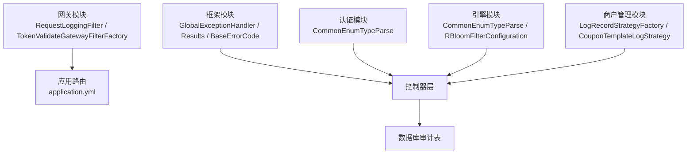
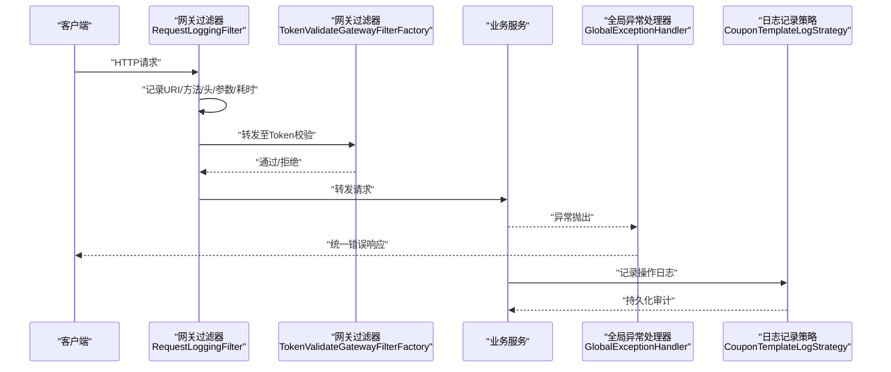
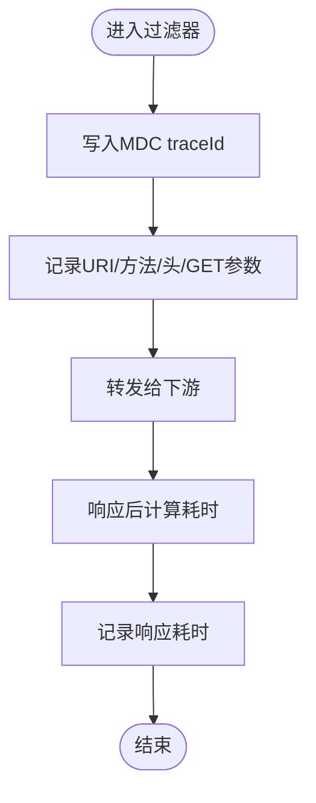
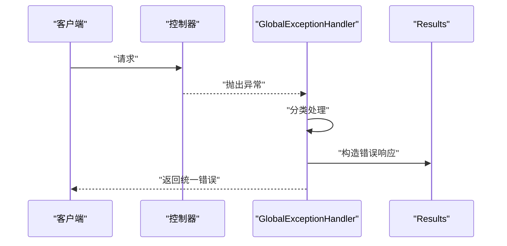
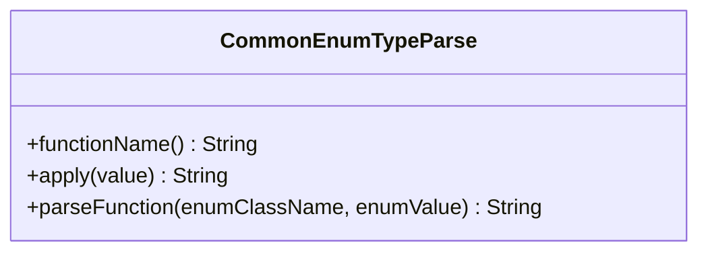
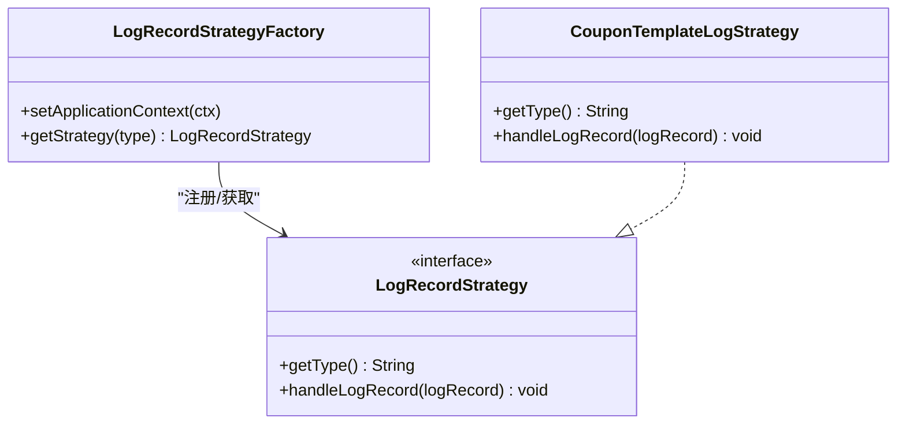
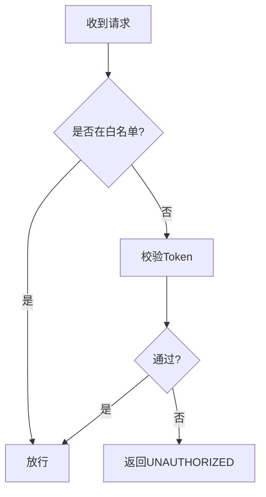
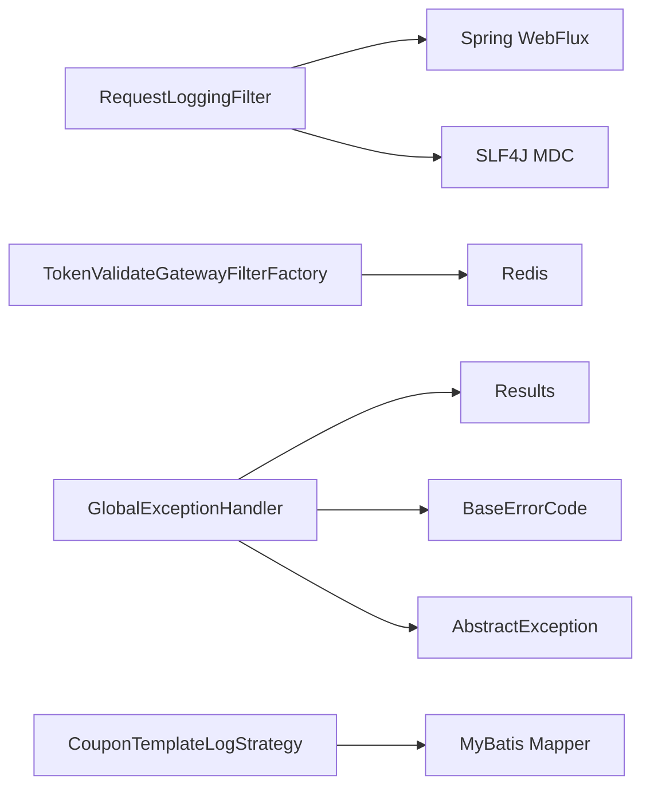

# 安全审计

<cite>
**本文引用的文件**
- [gateway/src/main/java/com/fengxin/maplecoupon/gateway/filter/RequestLoggingFilter.java](file://gateway/src/main/java/com/fengxin/maplecoupon/gateway/filter/RequestLoggingFilter.java)
- [gateway/src/main/java/com/fengxin/maplecoupon/gateway/filter/TokenValidateGatewayFilterFactory.java](file://gateway/src/main/java/com/fengxin/maplecoupon/gateway/filter/TokenValidateGatewayFilterFactory.java)
- [gateway/src/main/resources/application.yml](file://gateway/src/main/resources/application.yml)
- [gateway/src/test/logback-spring.xml](file://gateway/src/test/logback-spring.xml)
- [framework/src/main/java/com/fengxin/web/GlobalExceptionHandler.java](file://framework/src/main/java/com/fengxin/web/GlobalExceptionHandler.java)
- [framework/src/main/java/com/fengxin/web/Results.java](file://framework/src/main/java/com/fengxin/web/Results.java)
- [framework/src/main/java/com/fengxin/errorcode/BaseErrorCode.java](file://framework/src/main/java/com/fengxin/errorcode/BaseErrorCode.java)
- [framework/src/main/java/com/fengxin/exception/AbstractException.java](file://framework/src/main/java/com/fengxin/exception/AbstractException.java)
- [auth/src/main/java/com/fengxin/maplecoupon/auth/common/log/CommonEnumTypeParse.java](file://auth/src/main/java/com/fengxin/maplecoupon/auth/common/log/CommonEnumTypeParse.java)
- [engine/src/main/java/com/fengxin/maplecoupon/engine/common/log/CommonEnumTypeParse.java](file://engine/src/main/java/com/fengxin/maplecoupon/engine/common/log/CommonEnumTypeParse.java)
- [merchant-admin/src/main/java/com/fengxin/maplecoupon/merchantadmin/common/log/CommonEnumTypeParse.java](file://merchant-admin/src/main/java/com/fengxin/maplecoupon/merchantadmin/common/log/CommonEnumTypeParse.java)
- [merchant-admin/src/main/java/com/fengxin/maplecoupon/merchantadmin/service/basic/log/CouponTemplateLogStrategy.java](file://merchant-admin/src/main/java/com/fengxin/maplecoupon/merchantadmin/service/basic/log/CouponTemplateLogStrategy.java)
- [merchant-admin/src/main/java/com/fengxin/maplecoupon/merchantadmin/service/basic/log/LogRecordStrategy.java](file://merchant-admin/src/main/java/com/fengxin/maplecoupon/merchantadmin/service/basic/log/LogRecordStrategy.java)
- [merchant-admin/src/main/java/com/fengxin/maplecoupon/merchantadmin/service/basic/log/LogRecordStrategyFactory.java](file://merchant-admin/src/main/java/com/fengxin/maplecoupon/merchantadmin/service/basic/log/LogRecordStrategyFactory.java)
- [merchant-admin/src/main/java/com/fengxin/maplecoupon/merchantadmin/service/handler/log/CouponTemplateLogSave.java](file://merchant-admin/src/main/java/com/fengxin/maplecoupon/merchantadmin/service/handler/log/CouponTemplateLogSave.java)
- [engine/src/main/java/com/fengxin/maplecoupon/engine/config/RBloomFilterConfiguration.java](file://engine/src/main/java/com/fengxin/maplecoupon/engine/config/RBloomFilterConfiguration.java)
</cite>

## 目录
1. [引言](#引言)
2. [项目结构](#项目结构)
3. [核心组件](#核心组件)
4. [架构总览](#架构总览)
5. [详细组件分析](#详细组件分析)
6. [依赖分析](#依赖分析)
7. [性能考虑](#性能考虑)
8. [故障排查指南](#故障排查指南)
9. [结论](#结论)
10. [附录](#附录)

## 引言
本文件面向MapleCoupon系统的安全审计目标，围绕以下主题展开：请求日志过滤器的实现与敏感信息处理、全局异常处理器的安全机制、通用枚举类型解析在审计中的作用、安全事件的分类与分级、审计日志的存储与保留、检索能力、安全告警与异常检测的自动化机制、合规性审计报告的生成与导出思路，以及日志分析与威胁检测的实现方案。文档以代码为依据，结合流程图与类图，帮助技术与非技术读者理解系统在安全审计方面的现状与改进方向。

## 项目结构
MapleCoupon采用多模块微服务架构，网关层负责统一入口与鉴权，框架层提供全局异常与结果封装，各业务域（认证、引擎、商户管理、分发、结算）分别承担具体业务与日志审计策略。关键安全审计相关模块如下：
- 网关层：请求日志过滤器、Token校验过滤器、路由与白名单配置
- 框架层：全局异常处理器、错误码与结果封装
- 业务域：通用枚举解析、日志记录策略与持久化
- 安全增强：布隆过滤器防缓存穿透

图表来源
- [gateway/src/main/java/com/fengxin/maplecoupon/gateway/filter/RequestLoggingFilter.java:1-57](file://gateway/src/main/java/com/fengxin/maplecoupon/gateway/filter/RequestLoggingFilter.java#L1-L57)
- [gateway/src/main/java/com/fengxin/maplecoupon/gateway/filter/TokenValidateGatewayFilterFactory.java:1-93](file://gateway/src/main/java/com/fengxin/maplecoupon/gateway/filter/TokenValidateGatewayFilterFactory.java#L1-L93)
- [gateway/src/main/resources/application.yml:1-72](file://gateway/src/main/resources/application.yml#L1-L72)
- [framework/src/main/java/com/fengxin/web/GlobalExceptionHandler.java:1-78](file://framework/src/main/java/com/fengxin/web/GlobalExceptionHandler.java#L1-L78)
- [auth/src/main/java/com/fengxin/maplecoupon/auth/common/log/CommonEnumTypeParse.java:1-59](file://auth/src/main/java/com/fengxin/maplecoupon/auth/common/log/CommonEnumTypeParse.java#L1-L59)
- [engine/src/main/java/com/fengxin/maplecoupon/engine/common/log/CommonEnumTypeParse.java:1-59](file://engine/src/main/java/com/fengxin/maplecoupon/engine/common/log/CommonEnumTypeParse.java#L1-L59)
- [merchant-admin/src/main/java/com/fengxin/maplecoupon/merchantadmin/common/log/CommonEnumTypeParse.java:1-59](file://merchant-admin/src/main/java/com/fengxin/maplecoupon/merchantadmin/common/log/CommonEnumTypeParse.java#L1-L59)
- [merchant-admin/src/main/java/com/fengxin/maplecoupon/merchantadmin/service/basic/log/LogRecordStrategyFactory.java:1-29](file://merchant-admin/src/main/java/com/fengxin/maplecoupon/merchantadmin/service/basic/log/LogRecordStrategyFactory.java#L1-L29)
- [merchant-admin/src/main/java/com/fengxin/maplecoupon/merchantadmin/service/basic/log/CouponTemplateLogStrategy.java:1-44](file://merchant-admin/src/main/java/com/fengxin/maplecoupon/merchantadmin/service/basic/log/CouponTemplateLogStrategy.java#L1-L44)

章节来源
- [gateway/src/main/resources/application.yml:1-72](file://gateway/src/main/resources/application.yml#L1-L72)

## 核心组件
- 请求日志过滤器：在网关层对HTTP请求进行统一记录，包含URI、方法、请求头、GET参数与响应耗时，并通过MDC注入traceId便于跨服务串联。
- 全局异常处理器：集中拦截参数校验异常、应用内自定义异常与未捕获异常，统一输出安全的错误码与消息，并记录错误堆栈。
- 通用枚举类型解析：将内部枚举值转换为可读名称，用于审计日志与报表展示，避免直接暴露内部常量。
- 日志记录策略：通过策略工厂与具体策略实现不同业务类型的日志持久化，支持扩展。
- Token校验过滤器：基于白名单与Redis会话校验，拒绝未授权访问并返回标准错误响应。
- 布隆过滤器：在引擎模块中用于防缓存穿透，降低恶意查询对数据库的压力。

章节来源
- [gateway/src/main/java/com/fengxin/maplecoupon/gateway/filter/RequestLoggingFilter.java:1-57](file://gateway/src/main/java/com/fengxin/maplecoupon/gateway/filter/RequestLoggingFilter.java#L1-L57)
- [framework/src/main/java/com/fengxin/web/GlobalExceptionHandler.java:1-78](file://framework/src/main/java/com/fengxin/web/GlobalExceptionHandler.java#L1-L78)
- [framework/src/main/java/com/fengxin/web/Results.java:1-66](file://framework/src/main/java/com/fengxin/web/Results.java#L1-L66)
- [framework/src/main/java/com/fengxin/errorcode/BaseErrorCode.java:1-54](file://framework/src/main/java/com/fengxin/errorcode/BaseErrorCode.java#L1-L54)
- [auth/src/main/java/com/fengxin/maplecoupon/auth/common/log/CommonEnumTypeParse.java:1-59](file://auth/src/main/java/com/fengxin/maplecoupon/auth/common/log/CommonEnumTypeParse.java#L1-L59)
- [engine/src/main/java/com/fengxin/maplecoupon/engine/common/log/CommonEnumTypeParse.java:1-59](file://engine/src/main/java/com/fengxin/maplecoupon/engine/common/log/CommonEnumTypeParse.java#L1-L59)
- [merchant-admin/src/main/java/com/fengxin/maplecoupon/merchantadmin/common/log/CommonEnumTypeParse.java:1-59](file://merchant-admin/src/main/java/com/fengxin/maplecoupon/merchantadmin/common/log/CommonEnumTypeParse.java#L1-L59)
- [merchant-admin/src/main/java/com/fengxin/maplecoupon/merchantadmin/service/basic/log/LogRecordStrategyFactory.java:1-29](file://merchant-admin/src/main/java/com/fengxin/maplecoupon/merchantadmin/service/basic/log/LogRecordStrategyFactory.java#L1-L29)
- [merchant-admin/src/main/java/com/fengxin/maplecoupon/merchantadmin/service/basic/log/CouponTemplateLogStrategy.java:1-44](file://merchant-admin/src/main/java/com/fengxin/maplecoupon/merchantadmin/service/basic/log/CouponTemplateLogStrategy.java#L1-L44)
- [gateway/src/main/java/com/fengxin/maplecoupon/gateway/filter/TokenValidateGatewayFilterFactory.java:1-93](file://gateway/src/main/java/com/fengxin/maplecoupon/gateway/filter/TokenValidateGatewayFilterFactory.java#L1-L93)
- [engine/src/main/java/com/fengxin/maplecoupon/engine/config/RBloomFilterConfiguration.java:33-46](file://engine/src/main/java/com/fengxin/maplecoupon/engine/config/RBloomFilterConfiguration.java#L33-L46)

## 架构总览
下图展示了从网关到各业务域的请求与审计流：

图表来源
- [gateway/src/main/java/com/fengxin/maplecoupon/gateway/filter/RequestLoggingFilter.java:1-57](file://gateway/src/main/java/com/fengxin/maplecoupon/gateway/filter/RequestLoggingFilter.java#L1-L57)
- [gateway/src/main/java/com/fengxin/maplecoupon/gateway/filter/TokenValidateGatewayFilterFactory.java:1-93](file://gateway/src/main/java/com/fengxin/maplecoupon/gateway/filter/TokenValidateGatewayFilterFactory.java#L1-L93)
- [framework/src/main/java/com/fengxin/web/GlobalExceptionHandler.java:1-78](file://framework/src/main/java/com/fengxin/web/GlobalExceptionHandler.java#L1-L78)
- [merchant-admin/src/main/java/com/fengxin/maplecoupon/merchantadmin/service/basic/log/CouponTemplateLogStrategy.java:1-44](file://merchant-admin/src/main/java/com/fengxin/maplecoupon/merchantadmin/service/basic/log/CouponTemplateLogStrategy.java#L1-L44)

## 详细组件分析

### 请求日志过滤器
- 记录内容：请求URI、方法、请求头、GET参数；在响应完成后记录耗时。
- 关联上下文：通过MDC注入traceId，便于跨服务链路追踪。
- 敏感信息处理：当前实现未对请求体与响应体进行脱敏处理，建议在生产环境增加对敏感字段（如手机号、身份证号、密码）的脱敏策略与白名单放行列表。

图表来源
- [gateway/src/main/java/com/fengxin/maplecoupon/gateway/filter/RequestLoggingFilter.java:1-57](file://gateway/src/main/java/com/fengxin/maplecoupon/gateway/filter/RequestLoggingFilter.java#L1-L57)

章节来源
- [gateway/src/main/java/com/fengxin/maplecoupon/gateway/filter/RequestLoggingFilter.java:1-57](file://gateway/src/main/java/com/fengxin/maplecoupon/gateway/filter/RequestLoggingFilter.java#L1-L57)

### 全局异常处理器
- 分类与处理：
  - 参数校验异常：提取首个字段错误信息，记录错误并返回客户端错误码。
  - 应用内自定义异常：若存在根因则记录根因，否则输出前若干栈帧摘要。
  - 未捕获异常：统一记录错误并返回系统错误码。
- 错误码管理：基于基础错误码枚举，保证错误码的一致性与可追溯性。
- 安全日志记录：所有异常均通过日志记录，便于后续审计与告警。

图表来源
- [framework/src/main/java/com/fengxin/web/GlobalExceptionHandler.java:1-78](file://framework/src/main/java/com/fengxin/web/GlobalExceptionHandler.java#L1-L78)
- [framework/src/main/java/com/fengxin/web/Results.java:1-66](file://framework/src/main/java/com/fengxin/web/Results.java#L1-L66)
- [framework/src/main/java/com/fengxin/errorcode/BaseErrorCode.java:1-54](file://framework/src/main/java/com/fengxin/errorcode/BaseErrorCode.java#L1-L54)
- [framework/src/main/java/com/fengxin/exception/AbstractException.java:1-29](file://framework/src/main/java/com/fengxin/exception/AbstractException.java#L1-L29)

章节来源
- [framework/src/main/java/com/fengxin/web/GlobalExceptionHandler.java:1-78](file://framework/src/main/java/com/fengxin/web/GlobalExceptionHandler.java#L1-L78)
- [framework/src/main/java/com/fengxin/web/Results.java:1-66](file://framework/src/main/java/com/fengxin/web/Results.java#L1-L66)
- [framework/src/main/java/com/fengxin/errorcode/BaseErrorCode.java:1-54](file://framework/src/main/java/com/fengxin/errorcode/BaseErrorCode.java#L1-L54)
- [framework/src/main/java/com/fengxin/exception/AbstractException.java:1-29](file://framework/src/main/java/com/fengxin/exception/AbstractException.java#L1-L29)

### 通用枚举类型解析
- 功能：将内部“类名_值”的字符串解析为可读的枚举名称，用于审计日志与报表。
- 审计价值：避免直接记录内部常量，提升日志可读性与合规性。
- 扩展点：可在各业务域复用该解析器，统一审计口径。

图表来源
- [auth/src/main/java/com/fengxin/maplecoupon/auth/common/log/CommonEnumTypeParse.java:1-59](file://auth/src/main/java/com/fengxin/maplecoupon/auth/common/log/CommonEnumTypeParse.java#L1-L59)
- [engine/src/main/java/com/fengxin/maplecoupon/engine/common/log/CommonEnumTypeParse.java:1-59](file://engine/src/main/java/com/fengxin/maplecoupon/engine/common/log/CommonEnumTypeParse.java#L1-L59)
- [merchant-admin/src/main/java/com/fengxin/maplecoupon/merchantadmin/common/log/CommonEnumTypeParse.java:1-59](file://merchant-admin/src/main/java/com/fengxin/maplecoupon/merchantadmin/common/log/CommonEnumTypeParse.java#L1-L59)

章节来源
- [auth/src/main/java/com/fengxin/maplecoupon/auth/common/log/CommonEnumTypeParse.java:1-59](file://auth/src/main/java/com/fengxin/maplecoupon/auth/common/log/CommonEnumTypeParse.java#L1-L59)
- [engine/src/main/java/com/fengxin/maplecoupon/engine/common/log/CommonEnumTypeParse.java:1-59](file://engine/src/main/java/com/fengxin/maplecoupon/engine/common/log/CommonEnumTypeParse.java#L1-L59)
- [merchant-admin/src/main/java/com/fengxin/maplecoupon/merchantadmin/common/log/CommonEnumTypeParse.java:1-59](file://merchant-admin/src/main/java/com/fengxin/maplecoupon/merchantadmin/common/log/CommonEnumTypeParse.java#L1-L59)

### 日志记录策略与审计持久化
- 策略工厂：自动收集所有LogRecordStrategy实现，按类型分派。
- 具体策略：CouponTemplateLogStrategy将操作日志持久化到业务审计表，包含模板ID、门店号、操作人、原始数据、修改数据等。
- 可扩展性：新增业务类型只需实现LogRecordStrategy并注册到工厂。

图表来源
- [merchant-admin/src/main/java/com/fengxin/maplecoupon/merchantadmin/service/basic/log/LogRecordStrategyFactory.java:1-29](file://merchant-admin/src/main/java/com/fengxin/maplecoupon/merchantadmin/service/basic/log/LogRecordStrategyFactory.java#L1-L29)
- [merchant-admin/src/main/java/com/fengxin/maplecoupon/merchantadmin/service/basic/log/LogRecordStrategy.java:1-13](file://merchant-admin/src/main/java/com/fengxin/maplecoupon/merchantadmin/service/basic/log/LogRecordStrategy.java#L1-L13)
- [merchant-admin/src/main/java/com/fengxin/maplecoupon/merchantadmin/service/basic/log/CouponTemplateLogStrategy.java:1-44](file://merchant-admin/src/main/java/com/fengxin/maplecoupon/merchantadmin/service/basic/log/CouponTemplateLogStrategy.java#L1-L44)

章节来源
- [merchant-admin/src/main/java/com/fengxin/maplecoupon/merchantadmin/service/basic/log/LogRecordStrategyFactory.java:1-29](file://merchant-admin/src/main/java/com/fengxin/maplecoupon/merchantadmin/service/basic/log/LogRecordStrategyFactory.java#L1-L29)
- [merchant-admin/src/main/java/com/fengxin/maplecoupon/merchantadmin/service/basic/log/LogRecordStrategy.java:1-13](file://merchant-admin/src/main/java/com/fengxin/maplecoupon/merchantadmin/service/basic/log/LogRecordStrategy.java#L1-L13)
- [merchant-admin/src/main/java/com/fengxin/maplecoupon/merchantadmin/service/basic/log/CouponTemplateLogStrategy.java:1-44](file://merchant-admin/src/main/java/com/fengxin/maplecoupon/merchantadmin/service/basic/log/CouponTemplateLogStrategy.java#L1-L44)
- [merchant-admin/src/main/java/com/fengxin/maplecoupon/merchantadmin/service/handler/log/CouponTemplateLogSave.java:1-48](file://merchant-admin/src/main/java/com/fengxin/maplecoupon/merchantadmin/service/handler/log/CouponTemplateLogSave.java#L1-L48)

### Token校验过滤器与路由白名单
- 白名单：在网关配置中声明无需Token校验的路径（如登录、注册、校验用户名等）。
- 校验逻辑：对需要鉴权的路径进行Token校验，校验失败返回统一错误响应。
- 安全意义：防止未授权访问，减少越权风险。

图表来源
- [gateway/src/main/java/com/fengxin/maplecoupon/gateway/filter/TokenValidateGatewayFilterFactory.java:1-93](file://gateway/src/main/java/com/fengxin/maplecoupon/gateway/filter/TokenValidateGatewayFilterFactory.java#L1-L93)
- [gateway/src/main/resources/application.yml:59-64](file://gateway/src/main/resources/application.yml#L59-L64)

章节来源
- [gateway/src/main/java/com/fengxin/maplecoupon/gateway/filter/TokenValidateGatewayFilterFactory.java:1-93](file://gateway/src/main/java/com/fengxin/maplecoupon/gateway/filter/TokenValidateGatewayFilterFactory.java#L1-L93)
- [gateway/src/main/resources/application.yml:59-64](file://gateway/src/main/resources/application.yml#L59-L64)

### 布隆过滤器与缓存穿透防护
- 目标：在用户注册等高频查询场景，通过布隆过滤器判断是否存在，避免对数据库的无效查询。
- 配置：初始化容量与误判率，降低数据库压力与潜在攻击面。

章节来源
- [engine/src/main/java/com/fengxin/maplecoupon/engine/config/RBloomFilterConfiguration.java:33-46](file://engine/src/main/java/com/fengxin/maplecoupon/engine/config/RBloomFilterConfiguration.java#L33-L46)

## 依赖分析
- 网关层依赖：Spring Cloud Gateway、Reactor、SLF4J MDC。
- 框架层依赖：Spring MVC注解、Hutool工具、错误码与结果封装。
- 业务域依赖：日志记录API（mzt-logapi）、MyBatis Mapper、Redisson（布隆过滤器）。
- 审计依赖：日志落盘与滚动策略（Logback），数据库审计表。

图表来源
- [gateway/src/main/java/com/fengxin/maplecoupon/gateway/filter/RequestLoggingFilter.java:1-57](file://gateway/src/main/java/com/fengxin/maplecoupon/gateway/filter/RequestLoggingFilter.java#L1-L57)
- [gateway/src/main/java/com/fengxin/maplecoupon/gateway/filter/TokenValidateGatewayFilterFactory.java:1-93](file://gateway/src/main/java/com/fengxin/maplecoupon/gateway/filter/TokenValidateGatewayFilterFactory.java#L1-L93)
- [framework/src/main/java/com/fengxin/web/GlobalExceptionHandler.java:1-78](file://framework/src/main/java/com/fengxin/web/GlobalExceptionHandler.java#L1-L78)
- [framework/src/main/java/com/fengxin/web/Results.java:1-66](file://framework/src/main/java/com/fengxin/web/Results.java#L1-L66)
- [framework/src/main/java/com/fengxin/errorcode/BaseErrorCode.java:1-54](file://framework/src/main/java/com/fengxin/errorcode/BaseErrorCode.java#L1-L54)
- [framework/src/main/java/com/fengxin/exception/AbstractException.java:1-29](file://framework/src/main/java/com/fengxin/exception/AbstractException.java#L1-L29)
- [merchant-admin/src/main/java/com/fengxin/maplecoupon/merchantadmin/service/basic/log/CouponTemplateLogStrategy.java:1-44](file://merchant-admin/src/main/java/com/fengxin/maplecoupon/merchantadmin/service/basic/log/CouponTemplateLogStrategy.java#L1-L44)

## 性能考虑
- 请求日志：仅记录必要字段，避免大体量请求体/响应体日志；对高频接口可采样记录。
- 异常处理：仅记录必要栈帧摘要，避免过长堆栈影响I/O与存储成本。
- 日志落盘：采用滚动策略与大小限制，避免磁盘膨胀。
- 缓存穿透：布隆过滤器降低无效查询，减轻数据库压力。

## 故障排查指南
- 请求无法到达下游：检查网关路由与白名单配置，确认Token校验是否阻断。
- 异常未被统一处理：确认异常类型是否落入全局异常处理器分支，必要时补充自定义异常。
- 审计日志缺失：检查日志策略工厂是否正确注册，Mapper是否正常，数据库连接与权限。
- 日志文件过大：调整滚动策略与保留天数，或启用压缩归档。

章节来源
- [gateway/src/main/resources/application.yml:1-72](file://gateway/src/main/resources/application.yml#L1-L72)
- [gateway/src/test/logback-spring.xml:1-54](file://gateway/src/test/logback-spring.xml#L1-L54)
- [framework/src/main/java/com/fengxin/web/GlobalExceptionHandler.java:1-78](file://framework/src/main/java/com/fengxin/web/GlobalExceptionHandler.java#L1-L78)
- [merchant-admin/src/main/java/com/fengxin/maplecoupon/merchantadmin/service/basic/log/LogRecordStrategyFactory.java:1-29](file://merchant-admin/src/main/java/com/fengxin/maplecoupon/merchantadmin/service/basic/log/LogRecordStrategyFactory.java#L1-L29)

## 结论
MapleCoupon在安全审计方面具备较为完善的基础设施：统一的请求日志、严格的异常处理与错误码管理、可扩展的日志记录策略以及基础的鉴权与白名单机制。建议在生产环境中进一步强化敏感信息脱敏、完善审计日志的保留与检索、建立安全告警与异常检测机制，并形成合规性审计报告的自动化流程，以满足更高等级的安全与合规要求。

## 附录

### 审计日志存储策略与保留期限
- 存储位置：本地文件（Logback RollingFileAppender），按日期与大小滚动。
- 保留期限：可通过配置调整（示例中包含ERROR级别文件滚动规则），建议结合合规要求设定7-30天不等。
- 检索能力：建议引入日志聚合平台（如ELK/日志服务），提供全文检索与指标分析。

章节来源
- [gateway/src/test/logback-spring.xml:1-54](file://gateway/src/test/logback-spring.xml#L1-L54)

### 安全事件分类与分级
- 分类：参数校验失败、鉴权失败、业务异常、系统异常、未捕获异常。
- 分级：A级（鉴权失败/越权）、B级（业务异常/参数错误）、C级（系统异常/未捕获异常）。
- 处理：A级立即阻断并告警；B级记录并返回统一错误码；C级触发告警并升级处理。

章节来源
- [framework/src/main/java/com/fengxin/web/GlobalExceptionHandler.java:1-78](file://framework/src/main/java/com/fengxin/web/GlobalExceptionHandler.java#L1-L78)
- [gateway/src/main/java/com/fengxin/maplecoupon/gateway/filter/TokenValidateGatewayFilterFactory.java:1-93](file://gateway/src/main/java/com/fengxin/maplecoupon/gateway/filter/TokenValidateGatewayFilterFactory.java#L1-L93)

### 合规性审计报告生成与导出
- 数据来源：统一错误码、异常日志、审计表（CouponTemplateLog）。
- 报告维度：时间范围、异常类型分布、Top N问题、用户/门店维度统计。
- 导出格式：CSV/Excel/PDF，建议支持筛选与分页。

章节来源
- [merchant-admin/src/main/java/com/fengxin/maplecoupon/merchantadmin/service/basic/log/CouponTemplateLogStrategy.java:1-44](file://merchant-admin/src/main/java/com/fengxin/maplecoupon/merchantadmin/service/basic/log/CouponTemplateLogStrategy.java#L1-L44)
- [framework/src/main/java/com/fengxin/errorcode/BaseErrorCode.java:1-54](file://framework/src/main/java/com/fengxin/errorcode/BaseErrorCode.java#L1-L54)

### 日志分析与威胁检测
- 建议方案：基于日志聚合平台进行规则引擎（如基于IP/路径/错误码的阈值检测），对异常模式（如大量鉴权失败、特定接口异常飙升）触发告警。
- 自动化：结合CI/CD在部署时更新规则与告警策略，定期评估误报与漏报并优化。