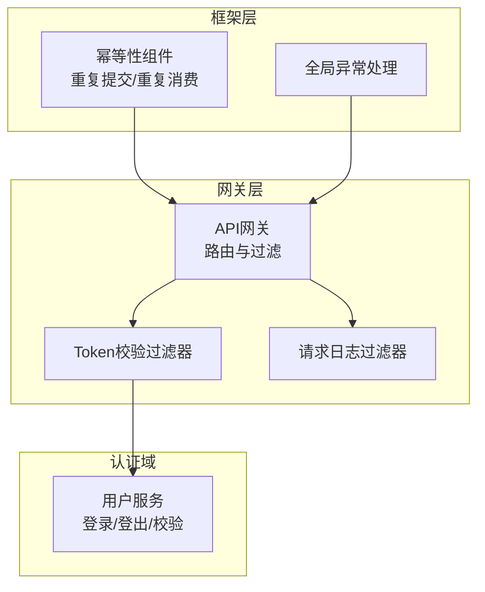
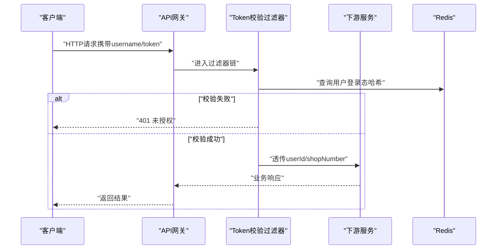
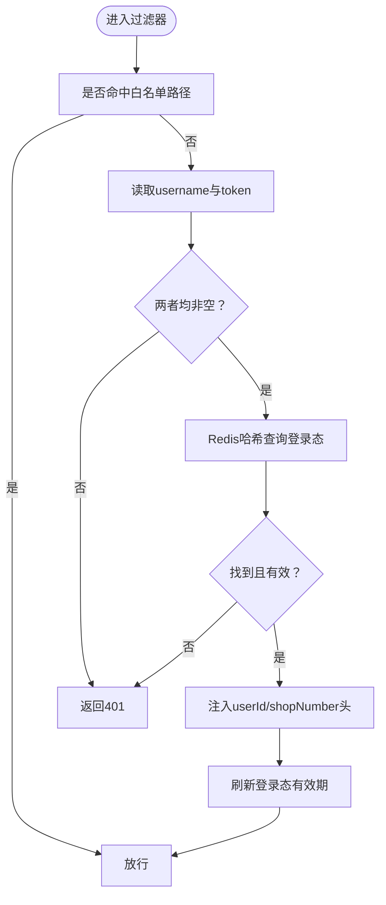
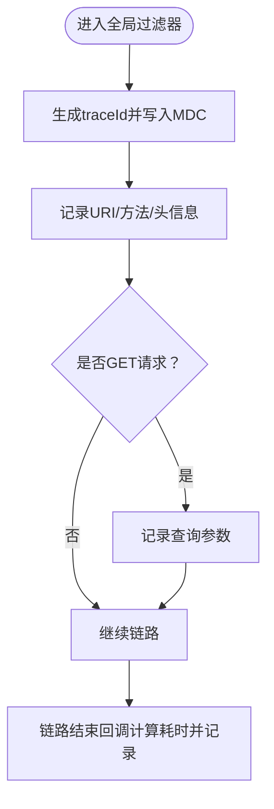
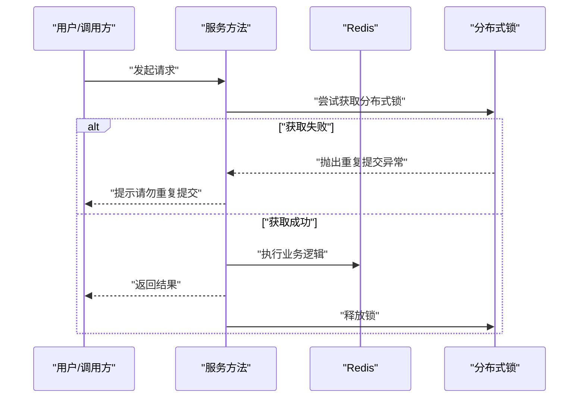
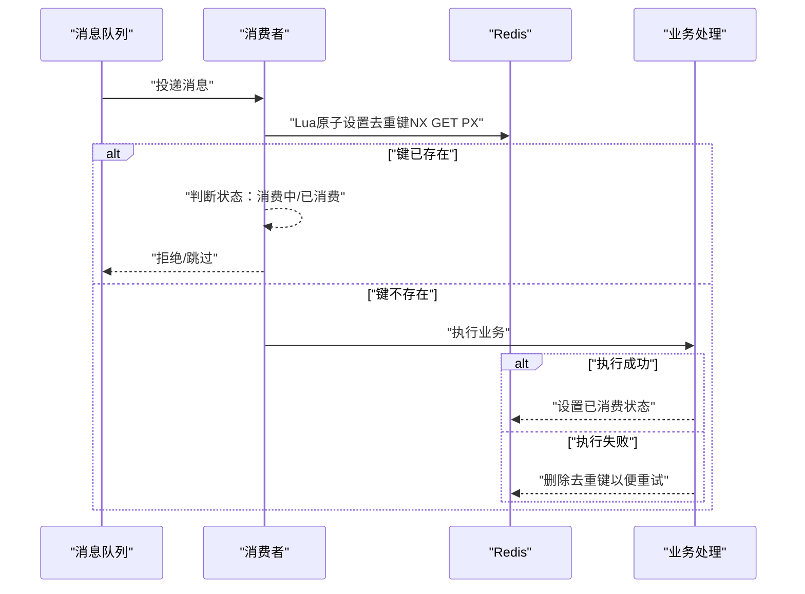
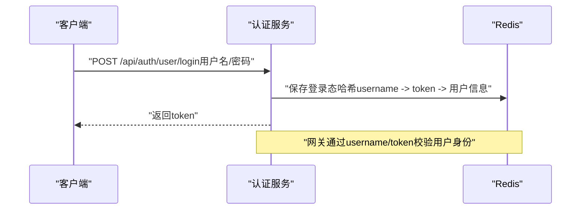
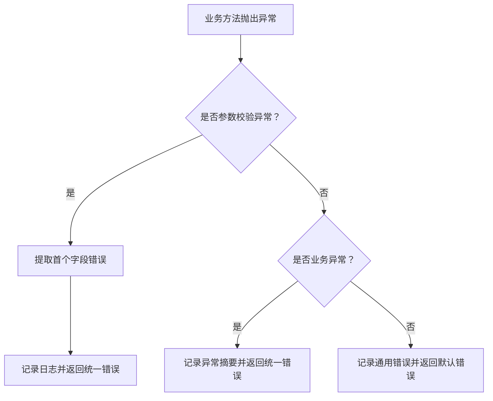
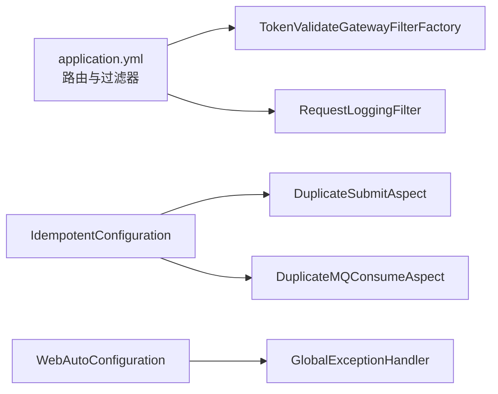

# 安全设计

<cite>
**本文引用的文件**
- [TokenValidateGatewayFilterFactory.java](file://gateway/src/main/java/com/fengxin/maplecoupon/gateway/filter/TokenValidateGatewayFilterFactory.java)
- [RequestLoggingFilter.java](file://gateway/src/main/java/com/fengxin/maplecoupon/gateway/filter/RequestLoggingFilter.java)
- [application.yml](file://gateway/src/main/resources/application.yml)
- [UserController.java](file://auth/src/main/java/com/fengxin/maplecoupon/auth/controller/UserController.java)
- [UserLoginReqDTO.java](file://auth/src/main/java/com/fengxin/maplecoupon/auth/dto/req/UserLoginReqDTO.java)
- [UserLoginRespDTO.java](file://auth/src/main/java/com/fengxin/maplecoupon/auth/dto/resp/UserLoginRespDTO.java)
- [application.yaml](file://auth/src/main/resources/application.yaml)
- [DuplicateSubmit.java](file://framework/src/main/java/com/fengxin/idempotent/DuplicateSubmit.java)
- [DuplicateSubmitAspect.java](file://framework/src/main/java/com/fengxin/idempotent/DuplicateSubmitAspect.java)
- [DuplicateMQConsume.java](file://framework/src/main/java/com/fengxin/idempotent/DuplicateMQConsume.java)
- [DuplicateMQConsumeAspect.java](file://framework/src/main/java/com/fengxin/idempotent/DuplicateMQConsumeAspect.java)
- [IdempotentConfiguration.java](file://framework/src/main/java/com/fengxin/config/IdempotentConfiguration.java)
- [GlobalExceptionHandler.java](file://framework/src/main/java/com/fengxin/web/GlobalExceptionHandler.java)
- [Result.java](file://framework/src/main/java/com/fengxin/web/Result.java)
- [WebAutoConfiguration.java](file://framework/src/main/java/com/fengxin/config/WebAutoConfiguration.java)
</cite>

## 目录
1. [引言](#引言)
2. [项目结构](#项目结构)
3. [核心组件](#核心组件)
4. [架构总览](#架构总览)
5. [详细组件分析](#详细组件分析)
6. [依赖分析](#依赖分析)
7. [性能考虑](#性能考虑)
8. [故障排查指南](#故障排查指南)
9. [结论](#结论)
10. [附录](#附录)

## 引言
本文件面向MapleCoupon系统的安全设计，围绕“认证授权、数据加密、输入验证与访问控制”等维度，结合现有代码实现，给出可落地的安全策略与改进建议。重点覆盖：
- 网关层安全过滤器：请求拦截、参数校验与风险控制
- 认证与授权：基于网关的令牌校验与用户上下文透传
- 幂等性与防重：重复提交与MQ重复消费的防护
- 输入验证与异常统一处理：参数校验与错误输出规范化
- 审计与日志：请求链路追踪与安全事件记录
- SQL注入、XSS、CSRF等常见威胁的工程化缓解建议

## 项目结构
MapleCoupon采用微服务架构，前端通过API网关统一接入，后端按业务域拆分为多个子系统（如auth、merchant-admin、engine、distribution、settlement）。安全相关能力主要分布在：
- 网关层：统一鉴权、日志与路由
- 框架层：幂等性、全局异常处理
- 认证域：用户登录、登出、状态检查等

图表来源
- [application.yml:17-63](file://gateway/src/main/resources/application.yml#L17-L63)
- [TokenValidateGatewayFilterFactory.java:44-87](file://gateway/src/main/java/com/fengxin/maplecoupon/gateway/filter/TokenValidateGatewayFilterFactory.java#L44-L87)
- [RequestLoggingFilter.java:24-56](file://gateway/src/main/java/com/fengxin/maplecoupon/gateway/filter/RequestLoggingFilter.java#L24-L56)
- [UserController.java:24-80](file://auth/src/main/java/com/fengxin/maplecoupon/auth/controller/UserController.java#L24-L80)

章节来源
- [application.yml:1-72](file://gateway/src/main/resources/application.yml#L1-L72)
- [TokenValidateGatewayFilterFactory.java:1-93](file://gateway/src/main/java/com/fengxin/maplecoupon/gateway/filter/TokenValidateGatewayFilterFactory.java#L1-L93)
- [RequestLoggingFilter.java:1-57](file://gateway/src/main/java/com/fengxin/maplecoupon/gateway/filter/RequestLoggingFilter.java#L1-L57)
- [UserController.java:1-81](file://auth/src/main/java/com/fengxin/maplecoupon/auth/controller/UserController.java#L1-L81)

## 核心组件
- 网关安全过滤器：负责在进入下游服务前进行令牌校验，并将用户上下文透传到后端。
- 请求日志过滤器：统一记录请求URI、方法、头信息与耗时，便于审计与问题定位。
- 幂等性组件：通过分布式锁与Redis去重键，防止重复提交与MQ重复消费。
- 全局异常处理：统一捕获参数校验与业务异常，标准化错误返回。

章节来源
- [TokenValidateGatewayFilterFactory.java:34-87](file://gateway/src/main/java/com/fengxin/maplecoupon/gateway/filter/TokenValidateGatewayFilterFactory.java#L34-L87)
- [RequestLoggingFilter.java:24-56](file://gateway/src/main/java/com/fengxin/maplecoupon/gateway/filter/RequestLoggingFilter.java#L24-L56)
- [DuplicateSubmitAspect.java:23-51](file://framework/src/main/java/com/fengxin/idempotent/DuplicateSubmitAspect.java#L23-L51)
- [DuplicateMQConsumeAspect.java:30-72](file://framework/src/main/java/com/fengxin/idempotent/DuplicateMQConsumeAspect.java#L30-L72)
- [GlobalExceptionHandler.java:24-77](file://framework/src/main/java/com/fengxin/web/GlobalExceptionHandler.java#L24-L77)

## 架构总览
下图展示了从客户端到后端服务的典型调用链路，以及安全控制点的分布：

图表来源
- [TokenValidateGatewayFilterFactory.java:44-87](file://gateway/src/main/java/com/fengxin/maplecoupon/gateway/filter/TokenValidateGatewayFilterFactory.java#L44-L87)
- [application.yml:17-63](file://gateway/src/main/resources/application.yml#L17-L63)

章节来源
- [TokenValidateGatewayFilterFactory.java:44-87](file://gateway/src/main/java/com/fengxin/maplecoupon/gateway/filter/TokenValidateGatewayFilterFactory.java#L44-L87)
- [application.yml:17-63](file://gateway/src/main/resources/application.yml#L17-L63)

## 详细组件分析

### 网关安全过滤器：请求拦截与令牌校验
- 路由与白名单：网关对各业务路由启用Token校验过滤器，并配置了认证域的白名单路径（注册、登录、用户名存在性检查）。
- 令牌校验逻辑：从请求头读取username与token，查询Redis中的用户登录态哈希；校验通过后将userId与shopNumber透传至下游服务，并刷新登录态有效期。
- 未授权处理：校验失败直接返回401并写入统一错误体。

图表来源
- [TokenValidateGatewayFilterFactory.java:44-87](file://gateway/src/main/java/com/fengxin/maplecoupon/gateway/filter/TokenValidateGatewayFilterFactory.java#L44-L87)
- [application.yml:58-63](file://gateway/src/main/resources/application.yml#L58-L63)

章节来源
- [TokenValidateGatewayFilterFactory.java:44-87](file://gateway/src/main/java/com/fengxin/maplecoupon/gateway/filter/TokenValidateGatewayFilterFactory.java#L44-L87)
- [application.yml:17-63](file://gateway/src/main/resources/application.yml#L17-L63)

### 请求日志过滤器：统一审计与追踪
- 生成traceId并写入MDC，记录请求URI、方法、头信息与GET参数，计算响应耗时。
- 作为全局过滤器，优先级较低，保证在链路末端输出耗时统计。

图表来源
- [RequestLoggingFilter.java:28-50](file://gateway/src/main/java/com/fengxin/maplecoupon/gateway/filter/RequestLoggingFilter.java#L28-L50)

章节来源
- [RequestLoggingFilter.java:1-57](file://gateway/src/main/java/com/fengxin/maplecoupon/gateway/filter/RequestLoggingFilter.java#L1-L57)

### 幂等性设计：重复提交与MQ重复消费
- 重复提交（表单/接口）：通过注解+AOP，在Redis上以“路径+当前用户+请求参数MD5”为键加分布式锁，避免同一请求重复执行。
- MQ重复消费：通过Redis Lua脚本实现“SET ... NX GET PX”原子性，利用去重键与状态枚举标记消费中/已消费，防止重复处理。

图表来源
- [DuplicateSubmitAspect.java:35-51](file://framework/src/main/java/com/fengxin/idempotent/DuplicateSubmitAspect.java#L35-L51)

图表来源
- [DuplicateMQConsumeAspect.java:33-72](file://framework/src/main/java/com/fengxin/idempotent/DuplicateMQConsumeAspect.java#L33-L72)

章节来源
- [DuplicateSubmit.java:1-19](file://framework/src/main/java/com/fengxin/idempotent/DuplicateSubmit.java#L1-L19)
- [DuplicateSubmitAspect.java:1-94](file://framework/src/main/java/com/fengxin/idempotent/DuplicateSubmitAspect.java#L1-L94)
- [DuplicateMQConsume.java:1-32](file://framework/src/main/java/com/fengxin/idempotent/DuplicateMQConsume.java#L1-L32)
- [DuplicateMQConsumeAspect.java:1-87](file://framework/src/main/java/com/fengxin/idempotent/DuplicateMQConsumeAspect.java#L1-L87)
- [IdempotentConfiguration.java:1-40](file://framework/src/main/java/com/fengxin/config/IdempotentConfiguration.java#L1-L40)

### 认证与授权：登录、校验与登出
- 登录接口：接收用户名与密码，返回token；登录成功后在Redis中持久化用户登录态哈希，供网关校验使用。
- 登录状态检查与登出：提供检查与登出接口，登出时清理登录态。
- 参数模型：登录请求参数包含用户名与密码字段。

图表来源
- [UserController.java:62-79](file://auth/src/main/java/com/fengxin/maplecoupon/auth/controller/UserController.java#L62-L79)
- [UserLoginReqDTO.java:11-22](file://auth/src/main/java/com/fengxin/maplecoupon/auth/dto/req/UserLoginReqDTO.java#L11-L22)
- [UserLoginRespDTO.java:13-18](file://auth/src/main/java/com/fengxin/maplecoupon/auth/dto/resp/UserLoginRespDTO.java#L13-L18)
- [application.yaml:1-19](file://auth/src/main/resources/application.yaml#L1-L19)

章节来源
- [UserController.java:1-81](file://auth/src/main/java/com/fengxin/maplecoupon/auth/controller/UserController.java#L1-L81)
- [UserLoginReqDTO.java:1-23](file://auth/src/main/java/com/fengxin/maplecoupon/auth/dto/req/UserLoginReqDTO.java#L1-L23)
- [UserLoginRespDTO.java:1-19](file://auth/src/main/java/com/fengxin/maplecoupon/auth/dto/resp/UserLoginRespDTO.java#L1-L19)
- [application.yaml:1-19](file://auth/src/main/resources/application.yaml#L1-L19)

### 输入验证与异常处理
- 参数校验：通过全局异常处理器拦截参数校验异常，提取首个字段错误并统一返回。
- 业务异常：拦截自定义异常，记录堆栈摘要并返回标准化错误码与消息。
- 统一返回体：定义Result对象，包含code、message与data，便于前端统一处理。

图表来源
- [GlobalExceptionHandler.java:30-68](file://framework/src/main/java/com/fengxin/web/GlobalExceptionHandler.java#L30-L68)
- [Result.java:15-45](file://framework/src/main/java/com/fengxin/web/Result.java#L15-L45)

章节来源
- [GlobalExceptionHandler.java:1-78](file://framework/src/main/java/com/fengxin/web/GlobalExceptionHandler.java#L1-L78)
- [Result.java:1-47](file://framework/src/main/java/com/fengxin/web/Result.java#L1-L47)
- [WebAutoConfiguration.java:12-21](file://framework/src/main/java/com/fengxin/config/WebAutoConfiguration.java#L12-L21)

## 依赖分析
- 网关路由与过滤器：application.yml中为各业务路由启用TokenValidate过滤器，并配置认证域白名单。
- 幂等性组件：通过IdempotentConfiguration装配DuplicateSubmitAspect与DuplicateMQConsumeAspect，分别处理重复提交与MQ重复消费。
- 全局异常处理：WebAutoConfiguration注册全局异常处理器Bean，确保异常被统一处理。

图表来源
- [application.yml:17-63](file://gateway/src/main/resources/application.yml#L17-L63)
- [IdempotentConfiguration.java:16-39](file://framework/src/main/java/com/fengxin/config/IdempotentConfiguration.java#L16-L39)
- [WebAutoConfiguration.java:12-19](file://framework/src/main/java/com/fengxin/config/WebAutoConfiguration.java#L12-L19)

章节来源
- [application.yml:1-72](file://gateway/src/main/resources/application.yml#L1-L72)
- [IdempotentConfiguration.java:1-40](file://framework/src/main/java/com/fengxin/config/IdempotentConfiguration.java#L1-L40)
- [WebAutoConfiguration.java:1-22](file://framework/src/main/java/com/fengxin/config/WebAutoConfiguration.java#L1-L22)

## 性能考虑
- 网关侧Redis访问：令牌校验涉及Redis哈希查询与过期刷新，建议：
  - 使用连接池与合适的超时配置
  - 对热点用户登录态进行本地缓存兜底
- 幂等性开销：分布式锁与Redis去重键带来额外RT，建议：
  - 合理设置锁超时与去重键过期时间
  - 对高频接口评估是否需要幂等保护
- 日志与追踪：MDC与traceId增加少量开销，建议：
  - 控制日志级别与采样率
  - 对敏感头信息脱敏输出

## 故障排查指南
- 401未授权
  - 检查请求头是否包含正确的username与token
  - 核对Redis中是否存在对应登录态哈希
  - 确认白名单路径配置是否正确
- 重复提交/重复消费
  - 查看幂等键是否正确生成（路径+用户+参数MD5）
  - 检查Redis去重键状态与过期时间
  - 关注分布式锁是否及时释放
- 参数校验失败
  - 查看全局异常处理器返回的首个字段错误
  - 确认请求体格式与字段命名符合DTO定义
- 日志与审计
  - 通过traceId关联请求链路
  - 结合请求日志过滤器输出定位问题

章节来源
- [TokenValidateGatewayFilterFactory.java:44-87](file://gateway/src/main/java/com/fengxin/maplecoupon/gateway/filter/TokenValidateGatewayFilterFactory.java#L44-L87)
- [DuplicateSubmitAspect.java:35-51](file://framework/src/main/java/com/fengxin/idempotent/DuplicateSubmitAspect.java#L35-L51)
- [DuplicateMQConsumeAspect.java:33-72](file://framework/src/main/java/com/fengxin/idempotent/DuplicateMQConsumeAspect.java#L33-L72)
- [GlobalExceptionHandler.java:30-40](file://framework/src/main/java/com/fengxin/web/GlobalExceptionHandler.java#L30-L40)
- [RequestLoggingFilter.java:28-50](file://gateway/src/main/java/com/fengxin/maplecoupon/gateway/filter/RequestLoggingFilter.java#L28-L50)

## 结论
MapleCoupon的安全设计以“网关统一鉴权+幂等性+统一异常处理+日志审计”为核心，已在以下方面形成闭环：
- 请求在网关层完成令牌校验与上下文透传
- 通过分布式锁与Redis去重键实现重复提交与MQ重复消费防护
- 全局异常处理与统一返回体提升了安全性与可观测性
- 请求日志与traceId便于审计与问题定位

建议在后续迭代中补充：
- JWT令牌的生成、验证与刷新策略（当前实现依赖网关侧Redis哈希）
- SQL注入、XSS、CSRF的工程化缓解措施与安全扫描流程
- 传输加密与敏感数据存储策略

## 附录

### 常见威胁与缓解建议（概念性指导）
- SQL注入
  - 使用ORM或参数化查询，避免动态拼接SQL
  - 对输入进行长度与字符集限制
- XSS
  - 前端渲染时对输出进行HTML转义
  - 后端响应头设置Content-Security-Policy
- CSRF
  - 后端校验Referer/Origin或引入CSRF Token
  - 重要操作要求二次确认（短信/邮箱验证码）

### 安全扫描与渗透测试流程（概念性指导）
- 定期扫描
  - 代码静态分析（SonarQube/SAST）
  - 依赖漏洞扫描（OWASP Dependency-Check）
  - API安全扫描（Swagger/Postman自动化）
- 渗透测试
  - 制定测试范围与授权书
  - 模拟常见攻击（注入、越权、爆破、重放）
  - 形成修复清单与回归验证