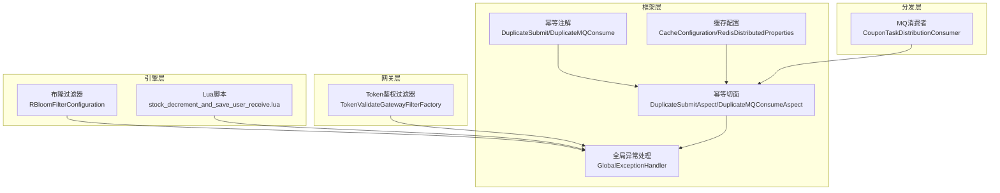
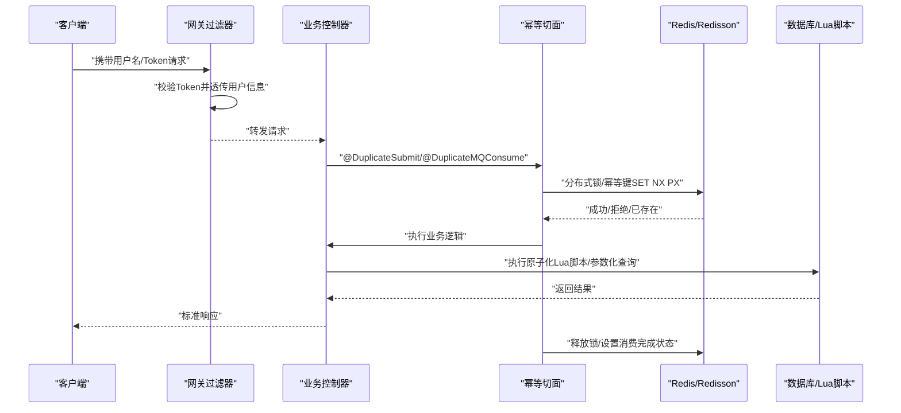
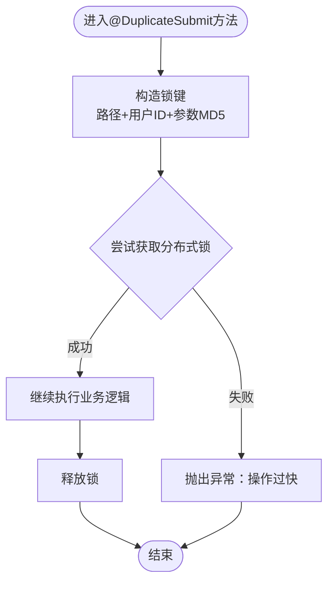
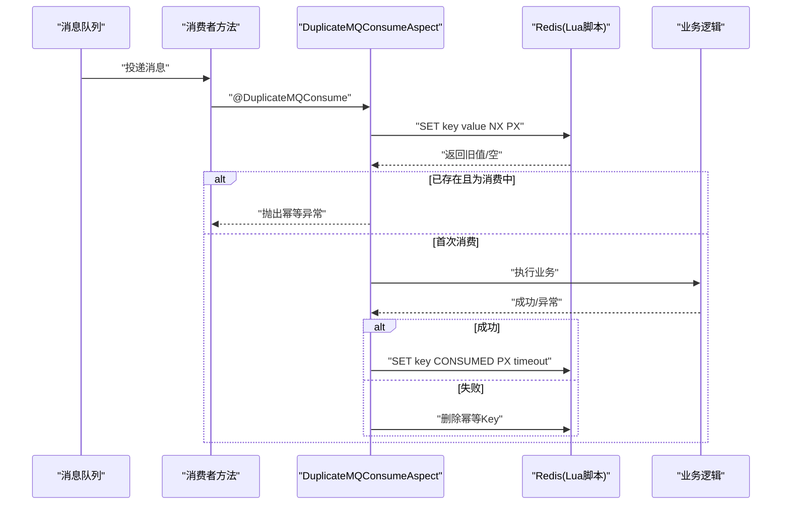
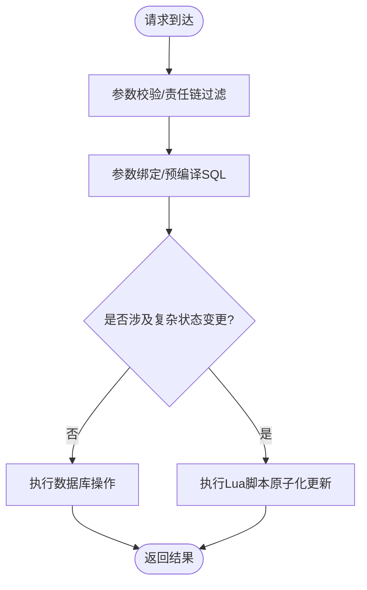
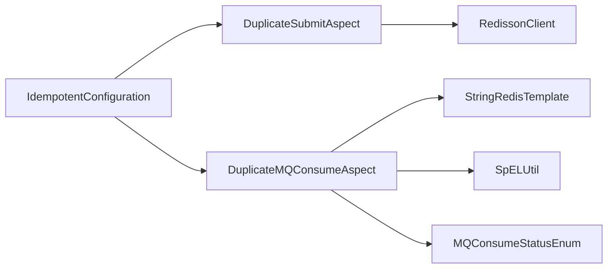

# 攻击防护

<cite>
**本文引用的文件**
- [DuplicateSubmit.java](file://framework/src/main/java/com/fengxin/idempotent/DuplicateSubmit.java)
- [DuplicateSubmitAspect.java](file://framework/src/main/java/com/fengxin/idempotent/DuplicateSubmitAspect.java)
- [DuplicateMQConsume.java](file://framework/src/main/java/com/fengxin/idempotent/DuplicateMQConsume.java)
- [DuplicateMQConsumeAspect.java](file://framework/src/main/java/com/fengxin/idempotent/DuplicateMQConsumeAspect.java)
- [IdempotentConfiguration.java](file://framework/src/main/java/com/fengxin/config/IdempotentConfiguration.java)
- [MQConsumeStatusEnum.java](file://framework/src/main/java/com/fengxin/enums/MQConsumeStatusEnum.java)
- [SpELUtil.java](file://framework/src/main/java/com/fengxin/util/SpELUtil.java)
- [GlobalExceptionHandler.java](file://framework/src/main/java/com/fengxin/web/GlobalExceptionHandler.java)
- [TokenValidateGatewayFilterFactory.java](file://gateway/src/main/java/com/fengxin/maplecoupon/gateway/filter/TokenValidateGatewayFilterFactory.java)
- [CouponTaskDistributionConsumer.java](file://distribution/src/main/java/com/fengxin/maplecoupon/distribution/mq/consumer/CouponTaskDistributionConsumer.java)
- [RBloomFilterConfiguration.java](file://engine/src/main/java/com/fengxin/maplecoupon/engine/config/RBloomFilterConfiguration.java)
- [stock_decrement_and_save_user_receive.lua](file://engine/src/main/resources/lua/stock_decrement_and_save_user_receive.lua)
- [CouponTemplateCreateDuplicateSubmitTests.java](file://merchant-admin/src/test/java/com/fengxin/test/CouponTemplateCreateDuplicateSubmitTests.java)
- [CacheConfiguration.java](file://framework/src/main/java/com/fengxin/config/CacheConfiguration.java)
- [RedisDistributedProperties.java](file://framework/src/main/java/com/fengxin/config/RedisDistributedProperties.java)
</cite>

## 目录
1. [引言](#引言)
2. [项目结构](#项目结构)
3. [核心组件](#核心组件)
4. [架构总览](#架构总览)
5. [详细组件分析](#详细组件分析)
6. [依赖分析](#依赖分析)
7. [性能考虑](#性能考虑)
8. [故障排查指南](#故障排查指南)
9. [结论](#结论)
10. [附录](#附录)

## 引言
本文件面向MapleCoupon系统的攻击防护，围绕以下目标展开：防重复提交、防消息队列重复消费、时间戳与随机数的安全实现建议、分布式幂等与一致性策略、CSRF/XSS防护方案、SQL注入多层防御、请求频率限制与流量控制、以及攻击检测与自动化响应机制。文档以框架层的幂等注解与切面为核心，结合网关鉴权、布隆过滤器、Lua脚本与全局异常处理等模块，形成完整的安全闭环。

## 项目结构
MapleCoupon采用多模块微服务架构，安全能力主要集中在framework（通用安全与幂等）、gateway（统一网关鉴权）、engine（业务与Lua脚本）、distribution（MQ幂等消费）等模块。关键安全组件分布如下：
- 幂等注解与切面：framework/idempotent
- 网关鉴权：gateway/filter
- 布隆过滤器：engine/config
- Lua脚本：engine/resources/lua
- MQ幂等消费：distribution/mq/consumer
- 全局异常处理：framework/web

**图表来源**
- [IdempotentConfiguration.java:17-38](file://framework/src/main/java/com/fengxin/config/IdempotentConfiguration.java#L17-L38)
- [TokenValidateGatewayFilterFactory.java:44-87](file://gateway/src/main/java/com/fengxin/maplecoupon/gateway/filter/TokenValidateGatewayFilterFactory.java#L44-L87)
- [RBloomFilterConfiguration.java:33-45](file://engine/src/main/java/com/fengxin/maplecoupon/engine/config/RBloomFilterConfiguration.java#L33-L45)
- [stock_decrement_and_save_user_receive.lua:1-40](file://engine/src/main/resources/lua/stock_decrement_and_save_user_receive.lua#L1-L40)
- [CouponTaskDistributionConsumer.java:49-53](file://distribution/src/main/java/com/fengxin/maplecoupon/distribution/mq/consumer/CouponTaskDistributionConsumer.java#L49-L53)

**章节来源**
- [IdempotentConfiguration.java:17-38](file://framework/src/main/java/com/fengxin/config/IdempotentConfiguration.java#L17-L38)
- [TokenValidateGatewayFilterFactory.java:44-87](file://gateway/src/main/java/com/fengxin/maplecoupon/gateway/filter/TokenValidateGatewayFilterFactory.java#L44-L87)
- [RBloomFilterConfiguration.java:33-45](file://engine/src/main/java/com/fengxin/maplecoupon/engine/config/RBloomFilterConfiguration.java#L33-L45)
- [stock_decrement_and_save_user_receive.lua:1-40](file://engine/src/main/resources/lua/stock_decrement_and_save_user_receive.lua#L1-L40)
- [CouponTaskDistributionConsumer.java:49-53](file://distribution/src/main/java/com/fengxin/maplecoupon/distribution/mq/consumer/CouponTaskDistributionConsumer.java#L49-L53)

## 核心组件
- 防重复提交注解与切面：基于Redisson分布式锁，对请求路径+用户标识+请求参数MD5生成唯一锁键，避免并发重复提交。
- MQ幂等消费注解与切面：基于Redis SET NX PX + Lua原子脚本，确保同一消息在超时时间内仅被消费一次，并支持消费中/已消费状态判断。
- 网关鉴权：通过Header携带用户名与Token，在Redis中校验有效性并透传用户上下文。
- 布隆过滤器：用于热点查询的缓存穿透防护，降低无效数据库压力。
- Lua脚本：在引擎层对库存扣减与用户领取记录进行原子化处理，减少竞态条件。
- 全局异常处理：统一拦截参数校验与业务异常，输出标准化错误响应。

**章节来源**
- [DuplicateSubmit.java:14-18](file://framework/src/main/java/com/fengxin/idempotent/DuplicateSubmit.java#L14-L18)
- [DuplicateSubmitAspect.java:35-51](file://framework/src/main/java/com/fengxin/idempotent/DuplicateSubmitAspect.java#L35-L51)
- [DuplicateMQConsume.java:14-31](file://framework/src/main/java/com/fengxin/idempotent/DuplicateMQConsume.java#L14-L31)
- [DuplicateMQConsumeAspect.java:39-72](file://framework/src/main/java/com/fengxin/idempotent/DuplicateMQConsumeAspect.java#L39-L72)
- [TokenValidateGatewayFilterFactory.java:44-87](file://gateway/src/main/java/com/fengxin/maplecoupon/gateway/filter/TokenValidateGatewayFilterFactory.java#L44-L87)
- [RBloomFilterConfiguration.java:33-45](file://engine/src/main/java/com/fengxin/maplecoupon/engine/config/RBloomFilterConfiguration.java#L33-L45)
- [stock_decrement_and_save_user_receive.lua:1-40](file://engine/src/main/resources/lua/stock_decrement_and_save_user_receive.lua#L1-L40)
- [GlobalExceptionHandler.java:26-68](file://framework/src/main/java/com/fengxin/web/GlobalExceptionHandler.java#L26-L68)

## 架构总览
下图展示了从客户端到服务端的关键安全路径：请求经网关鉴权，进入业务控制器；幂等切面在服务端进行重复提交与MQ幂等消费控制；Lua脚本保障数据库写入原子性；异常统一由全局处理器返回。

**图表来源**
- [TokenValidateGatewayFilterFactory.java:44-87](file://gateway/src/main/java/com/fengxin/maplecoupon/gateway/filter/TokenValidateGatewayFilterFactory.java#L44-L87)
- [DuplicateSubmitAspect.java:35-51](file://framework/src/main/java/com/fengxin/idempotent/DuplicateSubmitAspect.java#L35-L51)
- [DuplicateMQConsumeAspect.java:39-72](file://framework/src/main/java/com/fengxin/idempotent/DuplicateMQConsumeAspect.java#L39-L72)
- [stock_decrement_and_save_user_receive.lua:1-40](file://engine/src/main/resources/lua/stock_decrement_and_save_user_receive.lua#L1-L40)

## 详细组件分析

### 防重复提交机制（DuplicateSubmit注解与切面）
- 设计原理
  - 使用Redisson分布式锁，锁键由“请求路径+当前用户ID+请求参数MD5”组成，确保同一用户在同一请求上的并发互斥。
  - 切面通过AOP拦截带注解的方法，若获取锁失败则直接抛出非法参数异常，提示操作过快。
- 关键实现要点
  - 锁键构造与tryLock策略，避免死锁与长时间阻塞。
  - 请求路径与当前用户ID的提取，确保隔离粒度。
  - 参数MD5用于区分不同参数组合，避免误判。
- 测试验证
  - 单元测试通过并发线程池触发相同请求，验证重复提交被拦截。

**图表来源**
- [DuplicateSubmitAspect.java:35-51](file://framework/src/main/java/com/fengxin/idempotent/DuplicateSubmitAspect.java#L35-L51)

**章节来源**
- [DuplicateSubmit.java:14-18](file://framework/src/main/java/com/fengxin/idempotent/DuplicateSubmit.java#L14-L18)
- [DuplicateSubmitAspect.java:35-51](file://framework/src/main/java/com/fengxin/idempotent/DuplicateSubmitAspect.java#L35-L51)
- [CouponTemplateCreateDuplicateSubmitTests.java:32-69](file://merchant-admin/src/test/java/com/fengxin/test/CouponTemplateCreateDuplicateSubmitTests.java#L32-L69)

### 防消息队列重复消费（DuplicateMQConsume机制）
- 设计原理
  - 使用Redis SET key value NX PX 原子命令与Lua脚本，确保同一消息在timeout时间内仅被消费一次。
  - 通过SpEL表达式动态生成唯一key，支持消息体字段拼接，提升幂等覆盖范围。
  - 消费状态枚举区分“消费中/已消费”，若返回“消费中”则直接抛错，避免重复执行。
- 关键实现要点
  - Lua脚本一次性完成SET NX PX与返回值读取，保证原子性。
  - 消费完成设置CONSUMED状态，失败删除幂等Key以便重试。
  - 超时时间可配置，兼顾重试与资源占用。
- 使用示例
  - 在MQ消费者方法上标注注解，指定keyPrefix、SpEL key与timeout。

**图表来源**
- [DuplicateMQConsume.java:14-31](file://framework/src/main/java/com/fengxin/idempotent/DuplicateMQConsume.java#L14-L31)
- [DuplicateMQConsumeAspect.java:39-72](file://framework/src/main/java/com/fengxin/idempotent/DuplicateMQConsumeAspect.java#L39-L72)
- [MQConsumeStatusEnum.java:15-37](file://framework/src/main/java/com/fengxin/enums/MQConsumeStatusEnum.java#L15-L37)
- [SpELUtil.java:29-57](file://framework/src/main/java/com/fengxin/util/SpELUtil.java#L29-L57)
- [CouponTaskDistributionConsumer.java:49-53](file://distribution/src/main/java/com/fengxin/maplecoupon/distribution/mq/consumer/CouponTaskDistributionConsumer.java#L49-L53)

**章节来源**
- [DuplicateMQConsume.java:14-31](file://framework/src/main/java/com/fengxin/idempotent/DuplicateMQConsume.java#L14-L31)
- [DuplicateMQConsumeAspect.java:39-72](file://framework/src/main/java/com/fengxin/idempotent/DuplicateMQConsumeAspect.java#L39-L72)
- [MQConsumeStatusEnum.java:15-37](file://framework/src/main/java/com/fengxin/enums/MQConsumeStatusEnum.java#L15-L37)
- [SpELUtil.java:29-57](file://framework/src/main/java/com/fengxin/util/SpELUtil.java#L29-L57)
- [CouponTaskDistributionConsumer.java:49-53](file://distribution/src/main/java/com/fengxin/maplecoupon/distribution/mq/consumer/CouponTaskDistributionConsumer.java#L49-L53)

### 时间戳与随机数的安全实现建议
- 时间戳验证
  - 建议在请求参数中携带服务端期望的时间窗口，服务端对比本地时间与请求时间，超过阈值则拒绝请求，防止重放攻击。
  - 结合网关侧限流与白名单策略，进一步降低重放风险。
- 随机数生成
  - 使用强随机源生成一次性随机数，作为请求签名的一部分，配合服务端校验，确保请求不可复用。
  - 随机数与用户ID、时间戳、业务参数共同参与签名，签名失败直接拒绝。

[本节为通用安全建议，不直接分析具体文件，故无章节来源]

### 分布式环境下的幂等性保证与一致性策略
- 幂等键设计
  - 重复提交：以“路径+用户ID+参数MD5”为键，确保同一用户在相同参数下的幂等。
  - MQ消费：以“业务主键+消息体关键字段”为键，避免同一条消息重复处理。
- 一致性策略
  - 写操作使用Lua脚本原子化，减少中间状态暴露。
  - Redis幂等键与业务状态联动，失败删除幂等键，允许重试；成功设置完成状态，避免重复执行。
- 一致性边界
  - 幂等仅覆盖单次业务操作，跨服务事务需引入分布式事务或最终一致性补偿。

**章节来源**
- [DuplicateSubmitAspect.java:35-51](file://framework/src/main/java/com/fengxin/idempotent/DuplicateSubmitAspect.java#L35-L51)
- [DuplicateMQConsumeAspect.java:39-72](file://framework/src/main/java/com/fengxin/idempotent/DuplicateMQConsumeAspect.java#L39-L72)
- [stock_decrement_and_save_user_receive.lua:1-40](file://engine/src/main/resources/lua/stock_decrement_and_save_user_receive.lua#L1-L40)

### CSRF攻击防护方案
- 同源策略与CORS
  - 网关层严格校验Origin/Referer，仅允许白名单域名访问。
- Token校验
  - 服务端生成一次性CSRF Token，随页面下发，每次POST请求必须携带，服务端比对。
- SameSite Cookie
  - 对关键Cookie设置SameSite=Strict/Lax，降低跨站请求风险。
- 行为审计
  - 记录异常来源与请求特征，触发告警与临时封禁。

[本节为通用安全建议，不直接分析具体文件，故无章节来源]

### XSS攻击防护技术细节
- 输入输出转义
  - 所有输出到前端的数据均进行HTML转义，避免脚本注入。
- 内容安全策略（CSP）
  - 在响应头中设置Content-Security-Policy，限制脚本来源与执行。
- 白名单过滤
  - 对富文本输入采用白名单标签与属性，拒绝危险标签与事件属性。

[本节为通用安全建议，不直接分析具体文件，故无章节来源]

### SQL注入防护的多层防御机制
- 参数化查询
  - MyBatis Mapper与动态SQL均使用参数绑定，避免字符串拼接。
- 输入验证与清洗
  - 控制器层使用参数校验与责任链过滤，剔除异常字符与非法格式。
- 布隆过滤器
  - 对热点查询使用布隆过滤器，减少无效查询对数据库的压力。
- 原子化脚本
  - Lua脚本在Redis侧完成复杂逻辑，避免中间状态被外部观测。

**图表来源**
- [RBloomFilterConfiguration.java:33-45](file://engine/src/main/java/com/fengxin/maplecoupon/engine/config/RBloomFilterConfiguration.java#L33-L45)
- [stock_decrement_and_save_user_receive.lua:1-40](file://engine/src/main/resources/lua/stock_decrement_and_save_user_receive.lua#L1-L40)

**章节来源**
- [RBloomFilterConfiguration.java:33-45](file://engine/src/main/java/com/fengxin/maplecoupon/engine/config/RBloomFilterConfiguration.java#L33-L45)
- [stock_decrement_and_save_user_receive.lua:1-40](file://engine/src/main/resources/lua/stock_decrement_and_save_user_receive.lua#L1-L40)

### 请求频率限制与流量控制
- 网关限流
  - 基于Token/用户名维度在网关层进行QPS限制，超限直接拒绝。
- 业务限流
  - 在幂等切面或业务层增加令牌桶/漏桶算法，针对敏感接口进行精细化限流。
- 缓存前缀与Key序列化
  - 通过统一的RedisKeySerializer与前缀配置，规范限流Key命名，便于运维与清理。

**章节来源**
- [TokenValidateGatewayFilterFactory.java:44-87](file://gateway/src/main/java/com/fengxin/maplecoupon/gateway/filter/TokenValidateGatewayFilterFactory.java#L44-L87)
- [CacheConfiguration.java:16-34](file://framework/src/main/java/com/fengxin/config/CacheConfiguration.java#L16-L34)
- [RedisDistributedProperties.java:11-23](file://framework/src/main/java/com/fengxin/config/RedisDistributedProperties.java#L11-L23)

### 攻击检测与响应自动化机制
- 日志与监控
  - 网关与服务端统一记录请求路径、用户ID、异常堆栈与耗时，接入日志平台与告警系统。
- 自动封禁
  - 对频繁触发异常的IP/用户进行临时封禁，结合Redis TTL实现自动过期。
- 自动降级
  - 对高风险接口在异常高峰时自动降级为只读或缓存模式，保障核心链路稳定。

**章节来源**
- [GlobalExceptionHandler.java:26-68](file://framework/src/main/java/com/fengxin/web/GlobalExceptionHandler.java#L26-L68)
- [TokenValidateGatewayFilterFactory.java:44-87](file://gateway/src/main/java/com/fengxin/maplecoupon/gateway/filter/TokenValidateGatewayFilterFactory.java#L44-L87)

## 依赖分析
- 组件耦合
  - 幂等切面依赖Redisson/RedisTemplate与注解元数据，耦合度适中，便于扩展。
  - MQ幂等依赖SpEL工具与状态枚举，通过Lua脚本实现原子性。
- 外部依赖
  - Redisson用于分布式锁；Redis用于幂等键与会话存储；RocketMQ用于消息幂等消费。
- 循环依赖
  - 当前模块间无明显循环依赖，幂等配置通过Spring容器装配。

**图表来源**
- [IdempotentConfiguration.java:17-38](file://framework/src/main/java/com/fengxin/config/IdempotentConfiguration.java#L17-L38)
- [DuplicateSubmitAspect.java:24-26](file://framework/src/main/java/com/fengxin/idempotent/DuplicateSubmitAspect.java#L24-L26)
- [DuplicateMQConsumeAspect.java:31-31](file://framework/src/main/java/com/fengxin/idempotent/DuplicateMQConsumeAspect.java#L31-L31)

**章节来源**
- [IdempotentConfiguration.java:17-38](file://framework/src/main/java/com/fengxin/config/IdempotentConfiguration.java#L17-L38)

## 性能考虑
- Redis热点键
  - 幂等键与会话Key建议设置合理TTL，避免长期占用内存；对高频Key进行分片或前缀隔离。
- Lua脚本优化
  - 将原子化逻辑下沉至Lua，减少网络往返与竞争窗口。
- 线程池与锁粒度
  - 重复提交锁粒度应尽量细化，避免全局锁导致的吞吐下降。
- 缓存穿透与击穿
  - 布隆过滤器与短时缓存结合，降低数据库压力。

[本节提供通用性能建议，不直接分析具体文件，故无章节来源]

## 故障排查指南
- 重复提交被拦截
  - 检查请求路径、用户ID与参数MD5是否一致；确认Redis连接与锁键构造逻辑。
- MQ幂等异常
  - 查看幂等Key是否存在、状态是否为“消费中”；确认Lua脚本执行结果与异常分支处理。
- 网关鉴权失败
  - 核对Header中的用户名与Token是否正确；检查Redis中会话是否存在且未过期。
- 全局异常响应
  - 查看异常处理器日志，定位具体异常类型与堆栈信息。

**章节来源**
- [DuplicateSubmitAspect.java:35-51](file://framework/src/main/java/com/fengxin/idempotent/DuplicateSubmitAspect.java#L35-L51)
- [DuplicateMQConsumeAspect.java:39-72](file://framework/src/main/java/com/fengxin/idempotent/DuplicateMQConsumeAspect.java#L39-L72)
- [TokenValidateGatewayFilterFactory.java:44-87](file://gateway/src/main/java/com/fengxin/maplecoupon/gateway/filter/TokenValidateGatewayFilterFactory.java#L44-L87)
- [GlobalExceptionHandler.java:26-68](file://framework/src/main/java/com/fengxin/web/GlobalExceptionHandler.java#L26-L68)

## 结论
MapleCoupon通过注解+切面的幂等设计、Redis与Lua的原子化能力、网关鉴权与全局异常处理，构建了覆盖请求与消息层面的完整攻击防护体系。建议在现有基础上补充CSRF/XSS专项治理、SQL注入深度审计与更细粒度的限流策略，持续完善自动化检测与响应机制，以应对复杂多变的线上威胁。

## 附录
- 快速检查清单
  - 是否对所有写操作启用@DuplicateSubmit或MQ幂等？
  - Redis与RocketMQ配置是否正确？Lua脚本是否可用？
  - 网关是否强制校验Token与来源？
  - 是否对敏感接口开启参数校验与责任链过滤？
  - 是否部署布隆过滤器与限流策略？