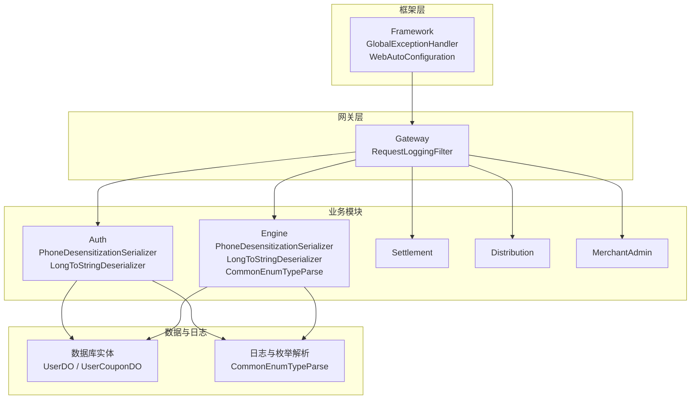
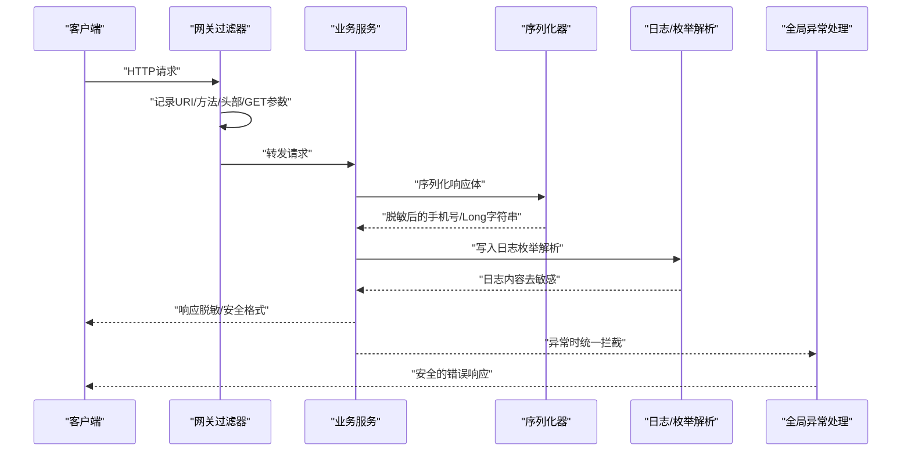
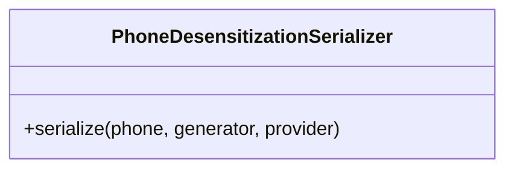
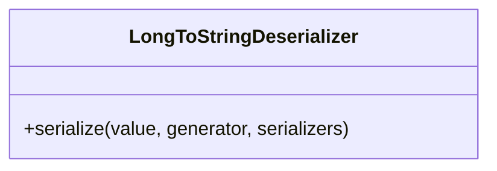
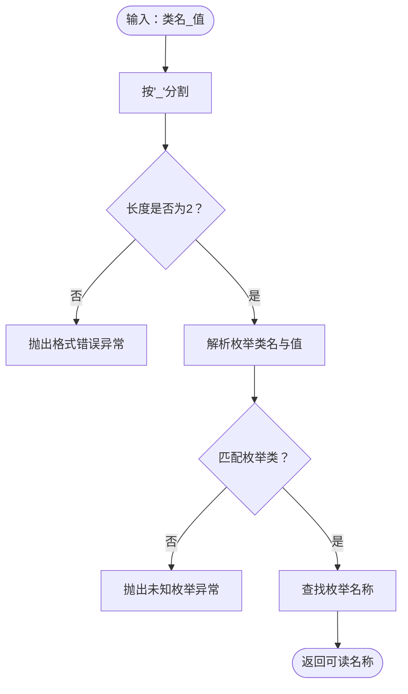
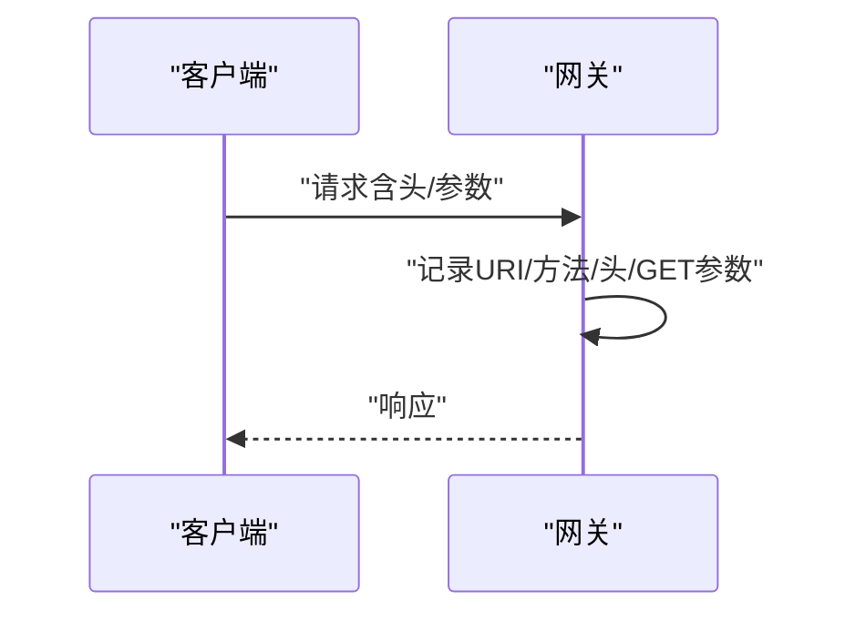
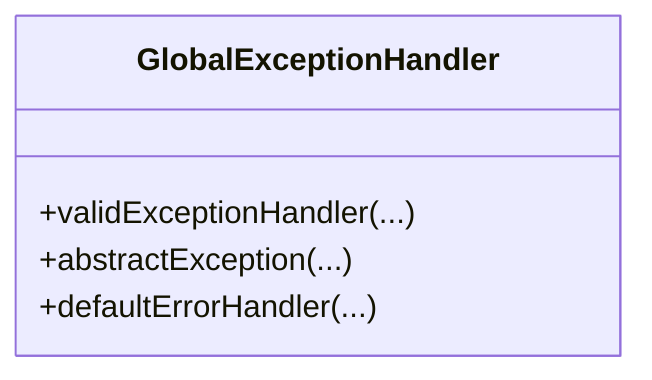
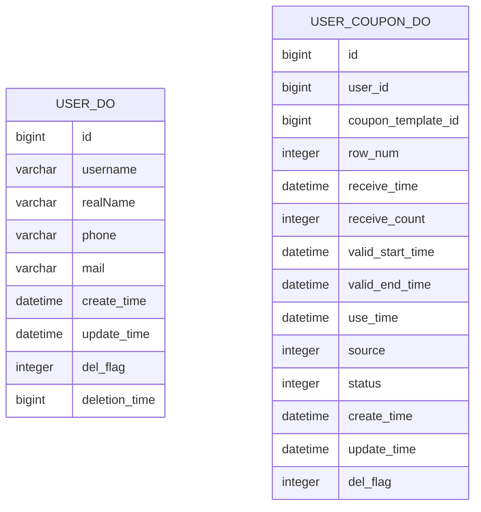
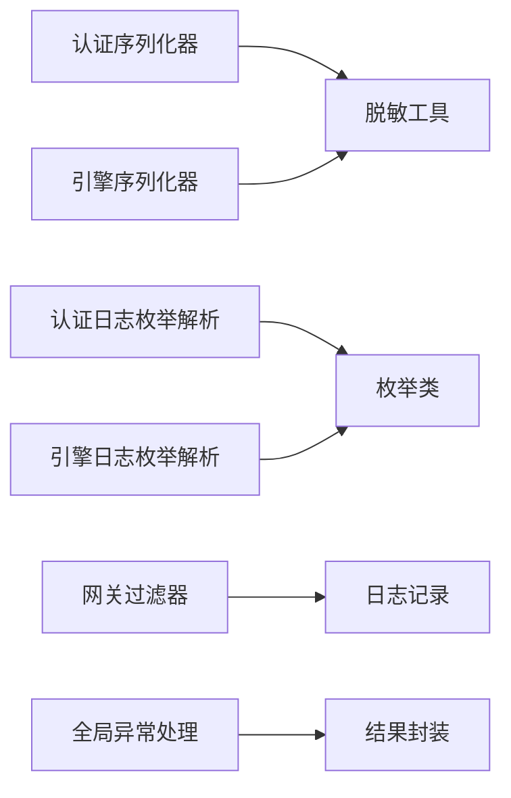

# 数据保护

<cite>
**本文引用的文件**
- [PhoneDesensitizationSerializer.java（认证模块）](file://auth/src/main/java/com/fengxin/maplecoupon/auth/common/serializer/PhoneDesensitizationSerializer.java)
- [PhoneDesensitizationSerializer.java（引擎模块）](file://engine/src/main/java/com/fengxin/maplecoupon/engine/common/serializer/PhoneDesensitizationSerializer.java)
- [LongToStringDeserializer.java（认证模块）](file://auth/src/main/java/com/fengxin/maplecoupon/auth/common/serializer/LongToStringDeserializer.java)
- [LongToStringDeserializer.java（引擎模块）](file://engine/src/main/java/com/fengxin/maplecoupon/engine/common/serializer/LongToStringDeserializer.java)
- [CommonEnumTypeParse.java（认证模块日志）](file://auth/src/main/java/com/fengxin/maplecoupon/auth/common/log/CommonEnumTypeParse.java)
- [CommonEnumTypeParse.java（引擎模块日志）](file://engine/src/main/java/com/fengxin/maplecoupon/engine/common/log/CommonEnumTypeParse.java)
- [RequestLoggingFilter.java（网关过滤器）](file://gateway/src/main/java/com/fengxin/maplecoupon/gateway/filter/RequestLoggingFilter.java)
- [GlobalExceptionHandler.java（全局异常处理）](file://framework/src/main/java/com/fengxin/web/GlobalExceptionHandler.java)
- [WebAutoConfiguration.java（Web自动装配）](file://framework/src/main/java/com/fengxin/config/WebAutoConfiguration.java)
- [UserDO.java（用户实体）](file://auth/src/main/java/com/fengxin/maplecoupon/auth/dao/entity/UserDO.java)
- [UserCouponDO.java（用户优惠券实体）](file://engine/src/main/java/com/fengxin/maplecoupon/engine/dao/entity/UserCouponDO.java)
- [application.yml（网关路由与CORS配置）](file://gateway/src/main/resources/application.yml)
</cite>

## 目录
1. 引言
2. 项目结构
3. 核心组件
4. 架构总览
5. 组件详解
6. 依赖关系分析
7. 性能考量
8. 故障排查指南
9. 结论
10. 附录

## 引言
本文件面向MapleCoupon系统的数据保护需求，围绕敏感数据脱敏、序列化与反序列化安全、枚举解析与完整性、传输加密与格式标准化、日志敏感信息过滤、存储层面的安全设计以及数据泄露防护与合规实现进行系统化说明。文档以代码为依据，结合架构图与流程图，帮助技术与非技术读者理解并落地各项安全措施。

## 项目结构
MapleCoupon采用多模块微服务架构，涉及认证、引擎、结算、分发、商户管理、网关与框架等模块。数据保护相关的关键位置分布在：
- 序列化器：在认证与引擎模块中分别提供手机号脱敏与Long转字符串的序列化器，用于输出层对敏感数据的脱敏与类型安全输出。
- 日志与枚举解析：通过统一的日志枚举解析函数，避免直接记录原始枚举值，降低日志中的敏感信息暴露风险。
- 网关与异常处理：网关层记录请求关键元数据；全局异常处理器统一拦截异常，避免内部栈信息外泄。
- 数据实体：用户与优惠券实体定义了字段与时间格式，便于统一序列化与脱敏策略的应用。

**图表来源**
- [RequestLoggingFilter.java](file://gateway/src/main/java/com/fengxin/maplecoupon/gateway/filter/RequestLoggingFilter.java)
- [PhoneDesensitizationSerializer.java（认证模块）](file://auth/src/main/java/com/fengxin/maplecoupon/auth/common/serializer/PhoneDesensitizationSerializer.java)
- [PhoneDesensitizationSerializer.java（引擎模块）](file://engine/src/main/java/com/fengxin/maplecoupon/engine/common/serializer/PhoneDesensitizationSerializer.java)
- [LongToStringDeserializer.java（认证模块）](file://auth/src/main/java/com/fengxin/maplecoupon/auth/common/serializer/LongToStringDeserializer.java)
- [LongToStringDeserializer.java（引擎模块）](file://engine/src/main/java/com/fengxin/maplecoupon/engine/common/serializer/LongToStringDeserializer.java)
- [CommonEnumTypeParse.java（认证模块日志）](file://auth/src/main/java/com/fengxin/maplecoupon/auth/common/log/CommonEnumTypeParse.java)
- [CommonEnumTypeParse.java（引擎模块日志）](file://engine/src/main/java/com/fengxin/maplecoupon/engine/common/log/CommonEnumTypeParse.java)
- [GlobalExceptionHandler.java](file://framework/src/main/java/com/fengxin/web/GlobalExceptionHandler.java)
- [WebAutoConfiguration.java](file://framework/src/main/java/com/fengxin/config/WebAutoConfiguration.java)
- [UserDO.java](file://auth/src/main/java/com/fengxin/maplecoupon/auth/dao/entity/UserDO.java)
- [UserCouponDO.java](file://engine/src/main/java/com/fengxin/maplecoupon/engine/dao/entity/UserCouponDO.java)

**章节来源**
- [application.yml（网关路由与CORS配置）](file://gateway/src/main/resources/application.yml)

## 核心组件
- 手机号脱敏序列化器：在JSON序列化阶段将手机号替换为脱敏形式，防止明文外泄。
- Long类型字符串化序列化器：将Long型数值安全地序列化为字符串，避免前端或下游系统因类型不一致导致的解析问题。
- 枚举解析与日志：通过统一的枚举解析函数，将“类名_值”的日志记录转换为可读名称，避免直接记录原始枚举值。
- 网关请求日志：记录URI、方法、请求头及GET参数，便于追踪与审计。
- 全局异常处理：统一拦截异常，记录必要上下文，避免内部栈信息泄露。
- 数据实体：统一时间格式与字段定义，配合序列化器实现一致的输出。

**章节来源**
- [PhoneDesensitizationSerializer.java（认证模块）](file://auth/src/main/java/com/fengxin/maplecoupon/auth/common/serializer/PhoneDesensitizationSerializer.java)
- [PhoneDesensitizationSerializer.java（引擎模块）](file://engine/src/main/java/com/fengxin/maplecoupon/engine/common/serializer/PhoneDesensitizationSerializer.java)
- [LongToStringDeserializer.java（认证模块）](file://auth/src/main/java/com/fengxin/maplecoupon/auth/common/serializer/LongToStringDeserializer.java)
- [LongToStringDeserializer.java（引擎模块）](file://engine/src/main/java/com/fengxin/maplecoupon/engine/common/serializer/LongToStringDeserializer.java)
- [CommonEnumTypeParse.java（认证模块日志）](file://auth/src/main/java/com/fengxin/maplecoupon/auth/common/log/CommonEnumTypeParse.java)
- [CommonEnumTypeParse.java（引擎模块日志）](file://engine/src/main/java/com/fengxin/maplecoupon/engine/common/log/CommonEnumTypeParse.java)
- [RequestLoggingFilter.java（网关过滤器）](file://gateway/src/main/java/com/fengxin/maplecoupon/gateway/filter/RequestLoggingFilter.java)
- [GlobalExceptionHandler.java（全局异常处理）](file://framework/src/main/java/com/fengxin/web/GlobalExceptionHandler.java)
- [UserDO.java（用户实体）](file://auth/src/main/java/com/fengxin/maplecoupon/auth/dao/entity/UserDO.java)
- [UserCouponDO.java（用户优惠券实体）](file://engine/src/main/java/com/fengxin/maplecoupon/engine/dao/entity/UserCouponDO.java)

## 架构总览
下图展示了从网关到各业务模块的数据流与安全控制点，重点体现日志记录、序列化脱敏与异常处理的控制路径。

**图表来源**
- [RequestLoggingFilter.java（网关过滤器）](file://gateway/src/main/java/com/fengxin/maplecoupon/gateway/filter/RequestLoggingFilter.java)
- [PhoneDesensitizationSerializer.java（认证模块）](file://auth/src/main/java/com/fengxin/maplecoupon/auth/common/serializer/PhoneDesensitizationSerializer.java)
- [PhoneDesensitizationSerializer.java（引擎模块）](file://engine/src/main/java/com/fengxin/maplecoupon/engine/common/serializer/PhoneDesensitizationSerializer.java)
- [LongToStringDeserializer.java（引擎模块）](file://engine/src/main/java/com/fengxin/maplecoupon/engine/common/serializer/LongToStringDeserializer.java)
- [CommonEnumTypeParse.java（引擎模块日志）](file://engine/src/main/java/com/fengxin/maplecoupon/engine/common/log/CommonEnumTypeParse.java)
- [GlobalExceptionHandler.java（全局异常处理）](file://framework/src/main/java/com/fengxin/web/GlobalExceptionHandler.java)

## 组件详解

### 手机号脱敏序列化器
- 实现原理：在JSON序列化阶段调用工具库对手机号进行脱敏处理，并写回脱敏后的字符串，避免明文外泄。
- 应用场景：用户信息输出、日志记录、对外API响应等。
- 安全要点：仅在序列化阶段生效，不影响数据库存储与内部处理逻辑。

**图表来源**
- [PhoneDesensitizationSerializer.java（认证模块）](file://auth/src/main/java/com/fengxin/maplecoupon/auth/common/serializer/PhoneDesensitizationSerializer.java)
- [PhoneDesensitizationSerializer.java（引擎模块）](file://engine/src/main/java/com/fengxin/maplecoupon/engine/common/serializer/PhoneDesensitizationSerializer.java)

**章节来源**
- [PhoneDesensitizationSerializer.java（认证模块）](file://auth/src/main/java/com/fengxin/maplecoupon/auth/common/serializer/PhoneDesensitizationSerializer.java)
- [PhoneDesensitizationSerializer.java（引擎模块）](file://engine/src/main/java/com/fengxin/maplecoupon/engine/common/serializer/PhoneDesensitizationSerializer.java)

### Long类型字符串化序列化器
- 实现原理：当Long值非空时将其显式转换为字符串写出，避免数字过大或前后端类型差异导致的精度或解析问题。
- 应用场景：对外API响应、日志记录、消息队列传输等。
- 安全要点：仅做类型转换，不改变业务语义；与脱敏序列化器配合使用，确保输出稳定且安全。

**图表来源**
- [LongToStringDeserializer.java（认证模块）](file://auth/src/main/java/com/fengxin/maplecoupon/auth/common/serializer/LongToStringDeserializer.java)
- [LongToStringDeserializer.java（引擎模块）](file://engine/src/main/java/com/fengxin/maplecoupon/engine/common/serializer/LongToStringDeserializer.java)

**章节来源**
- [LongToStringDeserializer.java（认证模块）](file://auth/src/main/java/com/fengxin/maplecoupon/auth/common/serializer/LongToStringDeserializer.java)
- [LongToStringDeserializer.java（引擎模块）](file://engine/src/main/java/com/fengxin/maplecoupon/engine/common/serializer/LongToStringDeserializer.java)

### 枚举解析与日志安全
- 实现原理：通过统一的解析函数接收“类名_值”的字符串，解析后返回可读名称，避免直接记录原始枚举值。
- 安全要点：日志中不出现原始枚举值，降低敏感信息泄露风险；对非法格式与未知枚举进行明确异常处理。

**图表来源**
- [CommonEnumTypeParse.java（认证模块日志）](file://auth/src/main/java/com/fengxin/maplecoupon/auth/common/log/CommonEnumTypeParse.java)
- [CommonEnumTypeParse.java（引擎模块日志）](file://engine/src/main/java/com/fengxin/maplecoupon/engine/common/log/CommonEnumTypeParse.java)

**章节来源**
- [CommonEnumTypeParse.java（认证模块日志）](file://auth/src/main/java/com/fengxin/maplecoupon/auth/common/log/CommonEnumTypeParse.java)
- [CommonEnumTypeParse.java（引擎模块日志）](file://engine/src/main/java/com/fengxin/maplecoupon/engine/common/log/CommonEnumTypeParse.java)

### 网关请求日志与传输安全
- 请求日志：记录URI、方法、请求头与GET参数，便于追踪与审计；建议在生产环境限制日志级别与敏感头字段。
- CORS与路由：网关配置允许跨域与路由转发，建议结合TLS与鉴权策略保障传输安全。

**图表来源**
- [RequestLoggingFilter.java（网关过滤器）](file://gateway/src/main/java/com/fengxin/maplecoupon/gateway/filter/RequestLoggingFilter.java)
- [application.yml（网关路由与CORS配置）](file://gateway/src/main/resources/application.yml)

**章节来源**
- [RequestLoggingFilter.java（网关过滤器）](file://gateway/src/main/java/com/fengxin/maplecoupon/gateway/filter/RequestLoggingFilter.java)
- [application.yml（网关路由与CORS配置）](file://gateway/src/main/resources/application.yml)

### 全局异常处理与错误码
- 统一拦截参数校验异常、业务异常与未捕获异常，记录必要上下文并返回标准化错误响应。
- 建议：错误码体系应覆盖客户端与服务端两类，避免内部堆栈信息泄露。

**图表来源**
- [GlobalExceptionHandler.java（全局异常处理）](file://framework/src/main/java/com/fengxin/web/GlobalExceptionHandler.java)
- [WebAutoConfiguration.java（Web自动装配）](file://framework/src/main/java/com/fengxin/config/WebAutoConfiguration.java)

**章节来源**
- [GlobalExceptionHandler.java（全局异常处理）](file://framework/src/main/java/com/fengxin/web/GlobalExceptionHandler.java)
- [WebAutoConfiguration.java（Web自动装配）](file://framework/src/main/java/com/fengxin/config/WebAutoConfiguration.java)

### 数据实体与序列化一致性
- 用户实体与优惠券实体定义了统一的时间格式与字段，配合序列化器可保证输出的一致性与安全性。
- 建议：在DTO层进一步声明脱敏与格式化规则，避免实体直接参与对外输出。

**图表来源**
- [UserDO.java（用户实体）](file://auth/src/main/java/com/fengxin/maplecoupon/auth/dao/entity/UserDO.java)
- [UserCouponDO.java（用户优惠券实体）](file://engine/src/main/java/com/fengxin/maplecoupon/engine/dao/entity/UserCouponDO.java)

**章节来源**
- [UserDO.java（用户实体）](file://auth/src/main/java/com/fengxin/maplecoupon/auth/dao/entity/UserDO.java)
- [UserCouponDO.java（用户优惠券实体）](file://engine/src/main/java/com/fengxin/maplecoupon/engine/dao/entity/UserCouponDO.java)

## 依赖关系分析
- 模块耦合：序列化器与日志解析作为横切关注点，在认证与引擎模块重复出现，建议抽取至公共模块以减少重复与维护成本。
- 外部依赖：序列化器依赖通用脱敏工具库；日志解析依赖枚举类；全局异常处理依赖结果封装与错误码。
- 安全边界：网关负责入口级日志与路由；业务模块负责序列化与日志脱敏；框架层负责异常收敛。

**图表来源**
- [PhoneDesensitizationSerializer.java（认证模块）](file://auth/src/main/java/com/fengxin/maplecoupon/auth/common/serializer/PhoneDesensitizationSerializer.java)
- [PhoneDesensitizationSerializer.java（引擎模块）](file://engine/src/main/java/com/fengxin/maplecoupon/engine/common/serializer/PhoneDesensitizationSerializer.java)
- [CommonEnumTypeParse.java（认证模块日志）](file://auth/src/main/java/com/fengxin/maplecoupon/auth/common/log/CommonEnumTypeParse.java)
- [CommonEnumTypeParse.java（引擎模块日志）](file://engine/src/main/java/com/fengxin/maplecoupon/engine/common/log/CommonEnumTypeParse.java)
- [RequestLoggingFilter.java（网关过滤器）](file://gateway/src/main/java/com/fengxin/maplecoupon/gateway/filter/RequestLoggingFilter.java)
- [GlobalExceptionHandler.java（全局异常处理）](file://framework/src/main/java/com/fengxin/web/GlobalExceptionHandler.java)

## 性能考量
- 序列化开销：脱敏与字符串化操作简单，通常对性能影响较小；建议在热点路径上避免重复序列化。
- 日志解析：枚举解析需进行字符串拆分与查找，建议缓存常见枚举映射以降低开销。
- 网关日志：仅记录必要字段，避免在高频请求场景中输出大体积请求头或参数。

## 故障排查指南
- 脱敏无效：检查序列化器是否正确注册到对应字段或全局配置。
- 枚举解析异常：确认日志中记录的格式为“类名_值”，并确保类名与枚举定义一致。
- 异常信息泄露：检查全局异常处理是否正确拦截异常并返回标准化错误码。
- 网关日志过多：调整日志级别与敏感头过滤策略，避免生产环境输出敏感信息。

**章节来源**
- [CommonEnumTypeParse.java（认证模块日志）](file://auth/src/main/java/com/fengxin/maplecoupon/auth/common/log/CommonEnumTypeParse.java)
- [CommonEnumTypeParse.java（引擎模块日志）](file://engine/src/main/java/com/fengxin/maplecoupon/engine/common/log/CommonEnumTypeParse.java)
- [GlobalExceptionHandler.java（全局异常处理）](file://framework/src/main/java/com/fengxin/web/GlobalExceptionHandler.java)
- [RequestLoggingFilter.java（网关过滤器）](file://gateway/src/main/java/com/fengxin/maplecoupon/gateway/filter/RequestLoggingFilter.java)

## 结论
MapleCoupon在数据保护方面通过序列化脱敏、统一枚举解析、网关日志与全局异常处理形成了较为完整的安全闭环。建议后续在公共模块中复用序列化器与日志解析能力，强化传输加密与字段级访问控制，并完善数据生命周期与合规审计机制。

## 附录

### 数据传输加密与格式标准化建议
- 传输加密：在网关层启用TLS，确保跨网络传输链路安全。
- 格式标准化：统一响应体结构与错误码规范，避免敏感信息随错误堆栈泄露。
- 路由与鉴权：结合白名单/黑名单与令牌校验，限制未授权访问。

**章节来源**
- [application.yml（网关路由与CORS配置）](file://gateway/src/main/resources/application.yml)

### 存储层面的安全设计建议
- 字段级访问控制：在DAO层与DTO层分离敏感字段，避免实体直接对外暴露。
- 数据加密存储：对密码、手机号等高敏感字段在入库前进行加密或哈希处理。
- 审计与合规：建立数据访问日志与变更审计，满足合规要求。

**章节来源**
- [UserDO.java（用户实体）](file://auth/src/main/java/com/fengxin/maplecoupon/auth/dao/entity/UserDO.java)
- [UserCouponDO.java（用户优惠券实体）](file://engine/src/main/java/com/fengxin/maplecoupon/engine/dao/entity/UserCouponDO.java)