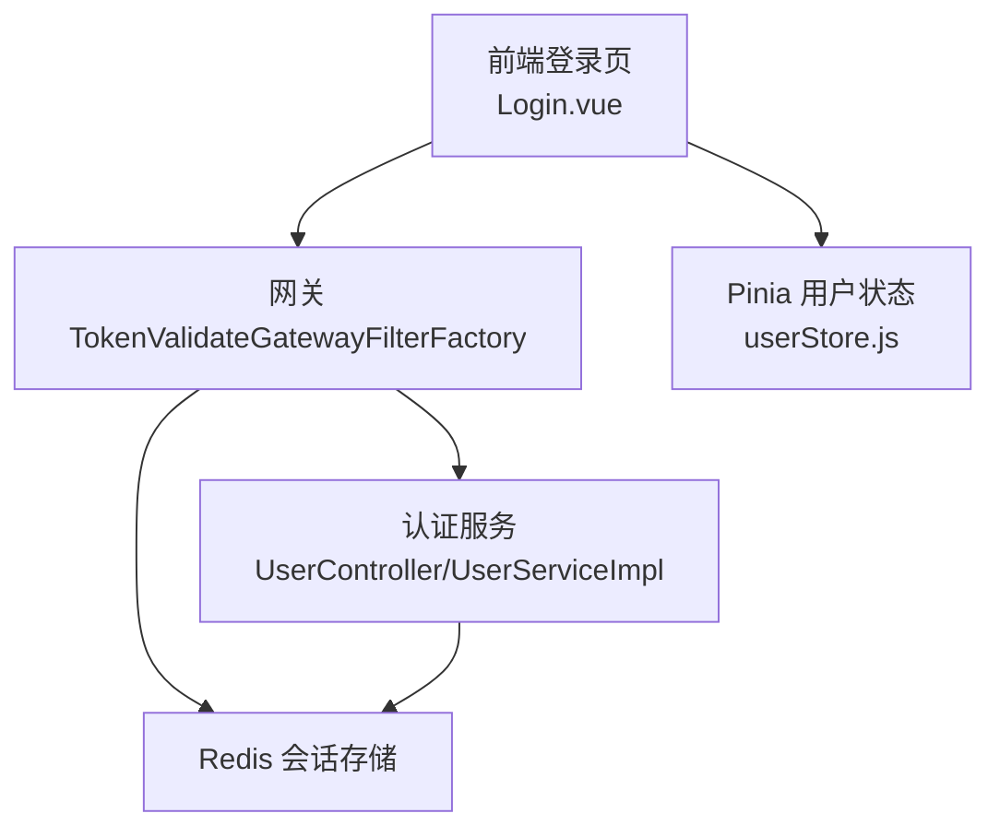
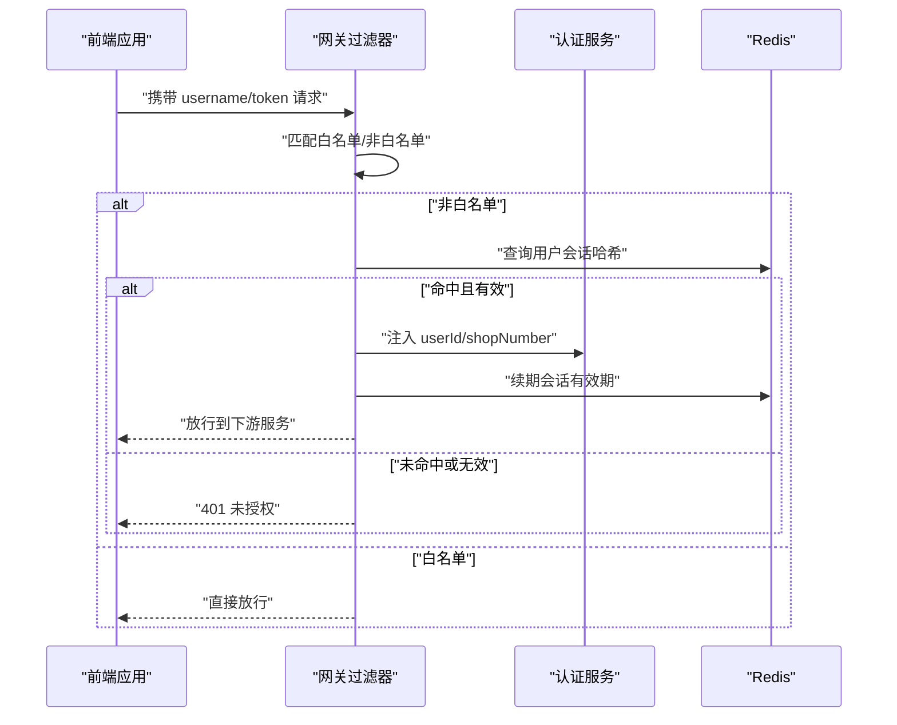
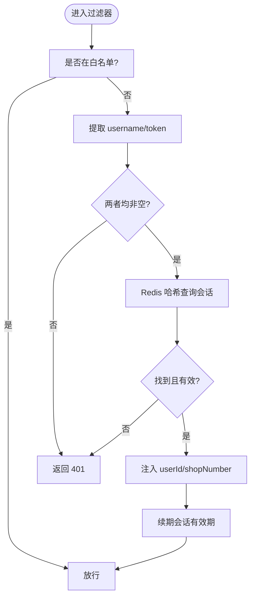
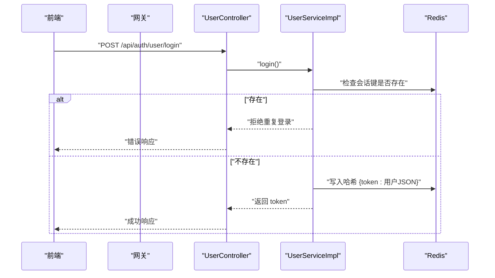
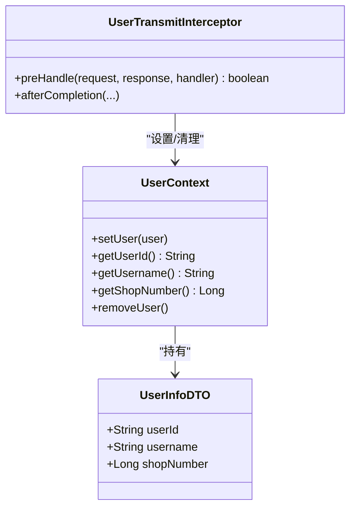
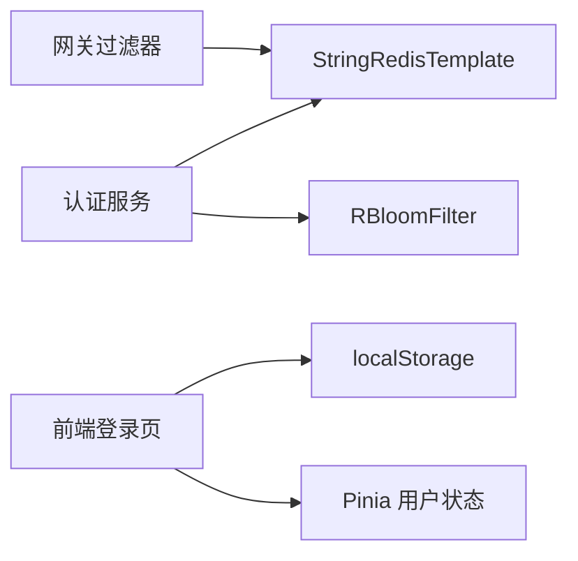

# 认证与授权

<cite>
**本文引用的文件**
- [TokenValidateGatewayFilterFactory.java](file://gateway/src/main/java/com/fengxin/maplecoupon/gateway/filter/TokenValidateGatewayFilterFactory.java)
- [Config.java](file://gateway/src/main/java/com/fengxin/maplecoupon/gateway/config/Config.java)
- [RedisConstantEnum.java](file://gateway/src/main/java/com/fengxin/maplecoupon/gateway/common/RedisConstantEnum.java)
- [application.yml](file://gateway/src/main/resources/application.yml)
- [UserContext.java](file://auth/src/main/java/com/fengxin/maplecoupon/auth/common/context/UserContext.java)
- [UserInfoDTO.java](file://auth/src/main/java/com/fengxin/maplecoupon/auth/common/context/UserInfoDTO.java)
- [UserTransmitInterceptor.java](file://auth/src/main/java/com/fengxin/maplecoupon/auth/common/context/UserTransmitInterceptor.java)
- [UserService.java](file://auth/src/main/java/com/fengxin/maplecoupon/auth/service/UserService.java)
- [UserServiceImpl.java](file://auth/src/main/java/com/fengxin/maplecoupon/auth/service/impl/UserServiceImpl.java)
- [UserController.java](file://auth/src/main/java/com/fengxin/maplecoupon/auth/controller/UserController.java)
- [UserLoginRespDTO.java](file://auth/src/main/java/com/fengxin/maplecoupon/auth/dto/resp/UserLoginRespDTO.java)
- [EngineRedisConstant.java](file://auth/src/main/java/com/fengxin/maplecoupon/auth/common/constant/EngineRedisConstant.java)
- [Login.vue](file://coupon/src/components/Login.vue)
- [userStore.js](file://coupon/src/store/userStore.js)
</cite>

## 目录
1. [简介](#简介)
2. [项目结构](#项目结构)
3. [核心组件](#核心组件)
4. [架构总览](#架构总览)
5. [组件详解](#组件详解)
6. [依赖关系分析](#依赖关系分析)
7. [性能考量](#性能考量)
8. [故障排查指南](#故障排查指南)
9. [结论](#结论)
10. [附录](#附录)

## 简介
本文件面向MapleCoupon系统的认证与授权模块，围绕以下目标展开：  
- 完整说明JWT风格令牌（基于UUID）的生成、验证与续期机制  
- 深入解析API网关的TokenValidateGatewayFilterFactory过滤器：请求拦截、头部参数提取、Redis会话验证与白名单策略  
- 解释用户上下文传递机制：userId与shopNumber的动态注入与跨服务传递  
- 说明白名单路径配置与权限控制策略  
- 提供令牌过期处理与会话续期的安全实现建议  
- 阐述Redis会话存储的设计模式与安全考虑  
- 说明用户信息在微服务间的传递机制与安全保障  

## 项目结构
认证与授权相关的关键位置如下：  
- 网关层：过滤器、配置与路由定义  
- 认证服务：用户登录、登出、会话校验与Redis存储  
- 用户上下文：线程本地存储与拦截器注入  
- 前端：登录页与用户状态存储  

图表来源
- [TokenValidateGatewayFilterFactory.java:43-88](file://gateway/src/main/java/com/fengxin/maplecoupon/gateway/filter/TokenValidateGatewayFilterFactory.java#L43-L88)
- [UserController.java:62-79](file://auth/src/main/java/com/fengxin/maplecoupon/auth/controller/UserController.java#L62-L79)
- [UserServiceImpl.java:121-143](file://auth/src/main/java/com/fengxin/maplecoupon/auth/service/impl/UserServiceImpl.java#L121-L143)
- [Login.vue:69-95](file://coupon/src/components/Login.vue#L69-L95)
- [userStore.js:1-19](file://coupon/src/store/userStore.js#L1-L19)

章节来源
- [application.yml:17-63](file://gateway/src/main/resources/application.yml#L17-L63)
- [TokenValidateGatewayFilterFactory.java:43-88](file://gateway/src/main/java/com/fengxin/maplecoupon/gateway/filter/TokenValidateGatewayFilterFactory.java#L43-L88)

## 核心组件
- 网关过滤器：负责拦截请求、提取头部参数、校验Redis中的会话、注入用户上下文并续期会话  
- 认证服务：提供登录、登出、会话校验与Redis哈希存储  
- 用户上下文：线程本地存储，承载userId与shopNumber  
- 前端登录页：负责获取token并持久化到本地存储

章节来源
- [TokenValidateGatewayFilterFactory.java:34-88](file://gateway/src/main/java/com/fengxin/maplecoupon/gateway/filter/TokenValidateGatewayFilterFactory.java#L34-L88)
- [UserServiceImpl.java:121-157](file://auth/src/main/java/com/fengxin/maplecoupon/auth/service/impl/UserServiceImpl.java#L121-L157)
- [UserContext.java:14-61](file://auth/src/main/java/com/fengxin/maplecoupon/auth/common/context/UserContext.java#L14-L61)
- [Login.vue:69-95](file://coupon/src/components/Login.vue#L69-L95)

## 架构总览
下图展示了从客户端到网关再到认证服务与Redis的整体交互流程。

图表来源
- [TokenValidateGatewayFilterFactory.java:43-88](file://gateway/src/main/java/com/fengxin/maplecoupon/gateway/filter/TokenValidateGatewayFilterFactory.java#L43-L88)
- [application.yml:58-63](file://gateway/src/main/resources/application.yml#L58-L63)

## 组件详解

### 网关过滤器：TokenValidateGatewayFilterFactory
- 请求拦截与白名单策略  
  - 对非白名单路径进行拦截；白名单由路由配置传入  
  - 白名单判断逻辑：路径前缀匹配  
- 头部参数提取与会话验证  
  - 从请求头读取username与token  
  - 使用Redis哈希结构按“用户名+token”定位用户信息  
  - 校验userId存在性；shopNumber为空时记录告警  
- 用户上下文注入与会话续期  
  - 将userId与shopNumber以请求头形式注入到后续链路  
  - 成功校验后刷新该用户的会话键有效期，防止用户操作期间被强制登出  
- 异常处理  
  - 未通过校验时返回UNAUTHORIZED，并写入统一错误体

图表来源
- [TokenValidateGatewayFilterFactory.java:43-88](file://gateway/src/main/java/com/fengxin/maplecoupon/gateway/filter/TokenValidateGatewayFilterFactory.java#L43-L88)

章节来源
- [TokenValidateGatewayFilterFactory.java:43-88](file://gateway/src/main/java/com/fengxin/maplecoupon/gateway/filter/TokenValidateGatewayFilterFactory.java#L43-L88)
- [Config.java:14-19](file://gateway/src/main/java/com/fengxin/maplecoupon/gateway/config/Config.java#L14-L19)
- [RedisConstantEnum.java:9-14](file://gateway/src/main/java/com/fengxin/maplecoupon/gateway/common/RedisConstantEnum.java#L9-L14)
- [application.yml:58-63](file://gateway/src/main/resources/application.yml#L58-L63)

### 认证服务：登录、登出与会话校验
- 登录流程  
  - 校验用户名与密码  
  - 防止同一用户重复登录（若已存在会话键则拒绝）  
  - 生成UUID作为token，将用户信息序列化后写入Redis哈希  
  - 设置会话键有效期  
- 更新用户信息  
  - 更新后删除旧token并写入新token，同时续期会话键  
- 登出流程  
  - 校验token有效性，存在则删除对应token项  
- 会话校验  
  - 通过Redis哈希键是否存在判断token有效性  

图表来源
- [UserController.java:62-66](file://auth/src/main/java/com/fengxin/maplecoupon/auth/controller/UserController.java#L62-L66)
- [UserServiceImpl.java:121-143](file://auth/src/main/java/com/fengxin/maplecoupon/auth/service/impl/UserServiceImpl.java#L121-L143)
- [UserLoginRespDTO.java:13-18](file://auth/src/main/java/com/fengxin/maplecoupon/auth/dto/resp/UserLoginRespDTO.java#L13-L18)

章节来源
- [UserService.java:58-78](file://auth/src/main/java/com/fengxin/maplecoupon/auth/service/UserService.java#L58-L78)
- [UserServiceImpl.java:121-157](file://auth/src/main/java/com/fengxin/maplecoupon/auth/service/impl/UserServiceImpl.java#L121-L157)
- [EngineRedisConstant.java:51-54](file://auth/src/main/java/com/fengxin/maplecoupon/auth/common/constant/EngineRedisConstant.java#L51-L54)

### 用户上下文传递机制
- 线程本地存储  
  - UserContext提供静态方法设置与获取userId、username、shopNumber  
  - 使用可在线程间传递的ThreadLocal容器，便于在同一线程内各组件共享  
- 请求拦截器注入  
  - UserTransmitInterceptor在请求到达时，从请求头读取username、userId、shopNumber  
  - 构造UserInfoDTO并写入UserContext  
  - 请求完成后清理上下文，避免内存泄漏  
- 网关注入  
  - TokenValidateGatewayFilterFactory在网关层将userId与shopNumber注入到下游请求头，确保微服务侧可读取  

图表来源
- [UserContext.java:14-61](file://auth/src/main/java/com/fengxin/maplecoupon/auth/common/context/UserContext.java#L14-L61)
- [UserInfoDTO.java:14-34](file://auth/src/main/java/com/fengxin/maplecoupon/auth/common/context/UserInfoDTO.java#L14-L34)
- [UserTransmitInterceptor.java:19-41](file://auth/src/main/java/com/fengxin/maplecoupon/auth/common/context/UserTransmitInterceptor.java#L19-L41)

章节来源
- [UserContext.java:14-61](file://auth/src/main/java/com/fengxin/maplecoupon/auth/common/context/UserContext.java#L14-L61)
- [UserTransmitInterceptor.java:19-41](file://auth/src/main/java/com/fengxin/maplecoupon/auth/common/context/UserTransmitInterceptor.java#L19-L41)
- [TokenValidateGatewayFilterFactory.java:65-69](file://gateway/src/main/java/com/fengxin/maplecoupon/gateway/filter/TokenValidateGatewayFilterFactory.java#L65-L69)

### 白名单路径配置与权限控制策略
- 路由与过滤器配置  
  - 网关对多个下游服务启用TokenValidate过滤器  
  - 在auth路由上配置白名单路径，允许匿名访问如登录、注册、用户名存在性检查等接口  
- 权限控制策略  
  - 非白名单路径必须携带有效的username与token  
  - 网关层仅做基础校验与上下文注入，业务权限在各微服务内部完成  

章节来源
- [application.yml:17-63](file://gateway/src/main/resources/application.yml#L17-L63)

### 令牌过期处理与会话续期
- 当前实现  
  - 网关在成功校验后刷新会话键的有效期，降低用户操作期间被强制登出的风险  
- 安全建议  
  - 引入refresh token机制：登录成功仅返回短期access token，配合短期refresh token轮换  
  - 后端对access token进行签名校验与失效时间控制，refresh token存储在更安全的介质中  
  - 增加IP/设备绑定与滑动过期策略，结合黑名单与审计日志  

章节来源
- [TokenValidateGatewayFilterFactory.java:70-73](file://gateway/src/main/java/com/fengxin/maplecoupon/gateway/filter/TokenValidateGatewayFilterFactory.java#L70-L73)
- [UserServiceImpl.java:132-142](file://auth/src/main/java/com/fengxin/maplecoupon/auth/service/impl/UserServiceImpl.java#L132-L142)

### Redis会话存储设计模式与安全考虑
- 设计模式  
  - 使用Redis Hash存储某用户的所有会话，键为“用户标识+token”，值为用户信息JSON  
  - 通过会话键的过期时间控制生命周期  
- 安全考虑  
  - 严格区分不同模块的Redis键空间，避免冲突与越权  
  - 登录与更新用户信息时，及时删除旧token并写入新token，保持会话一致性  
  - 对敏感字段进行脱敏展示，仅在必要接口返回原始信息  
  - 结合布隆过滤器减少缓存穿透风险（已在用户名存在性检查中体现）  

章节来源
- [EngineRedisConstant.java:51-54](file://auth/src/main/java/com/fengxin/maplecoupon/auth/common/constant/EngineRedisConstant.java#L51-L54)
- [UserServiceImpl.java:115-118](file://auth/src/main/java/com/fengxin/maplecoupon/auth/service/impl/UserServiceImpl.java#L115-L118)
- [RedisConstantEnum.java](file://gateway/src/main/java/com/fengxin/maplecoupon/gateway/common/RedisConstantEnum.java#L13)

### 用户信息在微服务间的传递机制与安全性
- 传递机制  
  - 网关层将userId与shopNumber注入到下游请求头，微服务侧通过拦截器读取并写入UserContext  
  - 微服务内部通过UserContext获取当前用户上下文，执行业务逻辑  
- 安全保障  
  - 网关仅做基础校验与上下文注入，不篡改业务数据  
  - 建议在服务间通信中增加签名与加密（如Spring Cloud Security或自定义签名），防止中间人攻击  
  - 对关键操作增加审计日志与权限校验，确保最小权限原则  

章节来源
- [TokenValidateGatewayFilterFactory.java:65-69](file://gateway/src/main/java/com/fengxin/maplecoupon/gateway/filter/TokenValidateGatewayFilterFactory.java#L65-L69)
- [UserTransmitInterceptor.java:22-34](file://auth/src/main/java/com/fengxin/maplecoupon/auth/common/context/UserTransmitInterceptor.java#L22-L34)

## 依赖关系分析
- 网关过滤器依赖RedisTemplate进行会话查询与续期  
- 认证服务依赖RedisTemplate与布隆过滤器进行会话存储与缓存穿透防护  
- 前端通过本地存储保存token与用户名，登录成功后写入localStorage并更新Pinia状态  

图表来源
- [TokenValidateGatewayFilterFactory.java:36-41](file://gateway/src/main/java/com/fengxin/maplecoupon/gateway/filter/TokenValidateGatewayFilterFactory.java#L36-L41)
- [UserServiceImpl.java:48-50](file://auth/src/main/java/com/fengxin/maplecoupon/auth/service/impl/UserServiceImpl.java#L48-L50)
- [Login.vue:79-82](file://coupon/src/components/Login.vue#L79-L82)
- [userStore.js:5-11](file://coupon/src/store/userStore.js#L5-L11)

章节来源
- [TokenValidateGatewayFilterFactory.java:36-41](file://gateway/src/main/java/com/fengxin/maplecoupon/gateway/filter/TokenValidateGatewayFilterFactory.java#L36-L41)
- [UserServiceImpl.java:48-50](file://auth/src/main/java/com/fengxin/maplecoupon/auth/service/impl/UserServiceImpl.java#L48-L50)
- [Login.vue:79-82](file://coupon/src/components/Login.vue#L79-L82)

## 性能考量
- Redis热点问题  
  - 同一用户频繁操作可能导致单Key热点，建议引入分片或本地缓存降压  
- 查询与续期开销  
  - 过滤器每次请求均需查询Redis并可能续期，建议在高并发场景评估异步续期策略  
- 前端本地存储  
  - localStorage读写成本低，注意避免在iframe或跨域场景下的兼容性问题  

## 故障排查指南
- 401未授权  
  - 检查请求头是否包含正确的username与token  
  - 确认Redis中是否存在对应的会话记录  
  - 核对白名单配置是否覆盖当前路径  
- userId为空  
  - 网关侧对userId进行非空校验，若为空将直接报错  
- shopNumber为空  
  - 网关侧记录告警，不影响放行，但业务侧应做好兜底处理  
- 登录异常  
  - 若同一用户已存在会话键，登录会被拒绝；请先登出或等待会话过期  
- 前端无法登录  
  - 检查localStorage中token与username是否正确写入，确认路由配置与网关过滤器生效  

章节来源
- [TokenValidateGatewayFilterFactory.java:59-64](file://gateway/src/main/java/com/fengxin/maplecoupon/gateway/filter/TokenValidateGatewayFilterFactory.java#L59-L64)
- [UserServiceImpl.java:132-135](file://auth/src/main/java/com/fengxin/maplecoupon/auth/service/impl/UserServiceImpl.java#L132-L135)
- [Login.vue:79-95](file://coupon/src/components/Login.vue#L79-L95)

## 结论
本方案采用“网关统一鉴权 + 微服务内权限校验”的组合策略，借助Redis哈希实现轻量级会话存储，并通过线程本地上下文在服务间传递用户信息。当前实现满足基本的认证与授权需求，建议后续引入refresh token与服务间签名机制，进一步提升安全性与可维护性。

## 附录
- 关键配置参考  
  - 网关路由与过滤器白名单：见[application.yml:17-63](file://gateway/src/main/resources/application.yml#L17-L63)  
  - 网关过滤器配置类：见[Config.java:14-19](file://gateway/src/main/java/com/fengxin/maplecoupon/gateway/config/Config.java#L14-L19)  
  - Redis键常量：见[RedisConstantEnum.java](file://gateway/src/main/java/com/fengxin/maplecoupon/gateway/common/RedisConstantEnum.java#L13)、[EngineRedisConstant.java](file://auth/src/main/java/com/fengxin/maplecoupon/auth/common/constant/EngineRedisConstant.java#L53)  
- 前端登录与状态  
  - 登录页：见[Login.vue:69-95](file://coupon/src/components/Login.vue#L69-L95)  
  - Pinia用户状态：见[userStore.js:1-19](file://coupon/src/store/userStore.js#L1-L19)