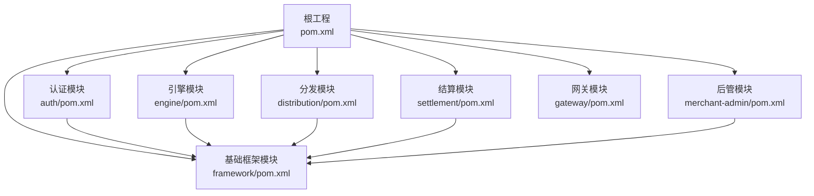
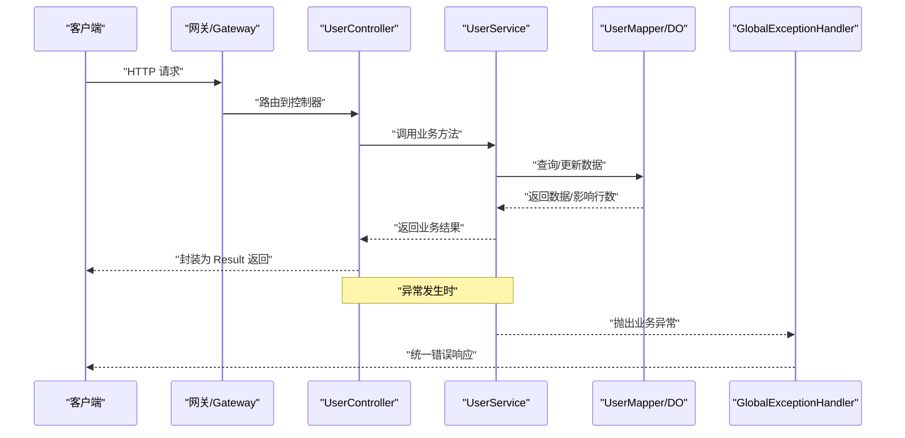
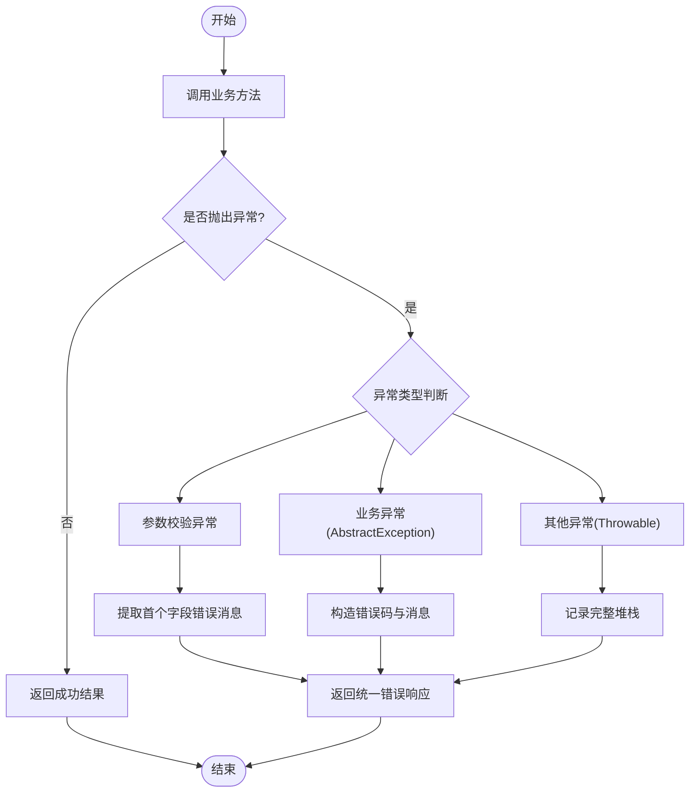
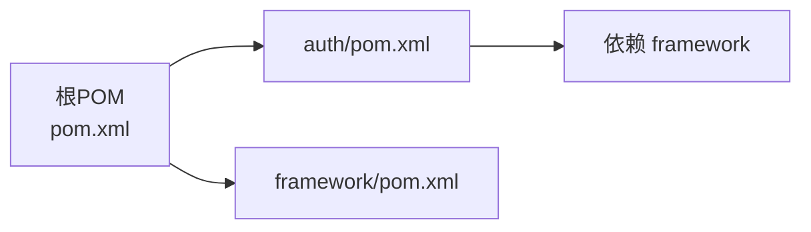

# 代码规范与风格

<cite>
**本文引用的文件**
- [pom.xml](file://pom.xml)
- [auth/pom.xml](file://auth/pom.xml)
- [framework/pom.xml](file://framework/pom.xml)
- [README.md](file://README.md)
- [application.yaml](file://auth/src/main/resources/application.yaml)
- [WebAutoConfiguration.java](file://framework/src/main/java/com/fengxin/config/WebAutoConfiguration.java)
- [GlobalExceptionHandler.java](file://framework/src/main/java/com/fengxin/web/GlobalExceptionHandler.java)
- [AbstractException.java](file://framework/src/main/java/com/fengxin/exception/AbstractException.java)
- [UserErrorCodeEnum.java](file://auth/src/main/java/com/fengxin/maplecoupon/auth/common/enums/UserErrorCodeEnum.java)
- [AuthApplication.java](file://auth/src/main/java/com/fengxin/maplecoupon/auth/AuthApplication.java)
- [UserController.java](file://auth/src/main/java/com/fengxin/maplecoupon/auth/controller/UserController.java)
- [UserService.java](file://auth/src/main/java/com/fengxin/maplecoupon/auth/service/UserService.java)
- [UserServiceImpl.java](file://auth/src/main/java/com/fengxin/maplecoupon/auth/service/impl/UserServiceImpl.java)
- [UserLoginReqDTO.java](file://auth/src/main/java/com/fengxin/maplecoupon/auth/dto/req/UserLoginReqDTO.java)
</cite>

## 目录
1. [引言](#引言)
2. [项目结构](#项目结构)
3. [核心组件](#核心组件)
4. [架构总览](#架构总览)
5. [详细组件分析](#详细组件分析)
6. [依赖分析](#依赖分析)
7. [性能考虑](#性能考虑)
8. [故障排查指南](#故障排查指南)
9. [结论](#结论)
10. [附录](#附录)

## 引言
本指南面向MapleCoupon项目，旨在统一Java代码的命名约定、格式化标准、注释规范、包结构与文件组织、复用与模块化实践、异常处理规范以及日志记录标准。内容基于仓库现有代码与配置进行提炼总结，确保团队协作一致性与可维护性。

## 项目结构
MapleCoupon采用多模块Maven聚合工程，核心模块包括认证(auth)、引擎(engine)、分发(distribution)、结算(settlement)、后管(merchant-admin)、网关(gateway)与基础框架(framework)。各模块职责清晰，遵循领域驱动的模块划分；公共能力集中在framework模块，供其他模块复用。

图表来源
- [pom.xml:17-34](file://pom.xml#L17-L34)
- [auth/pom.xml:14-111](file://auth/pom.xml#L14-L111)
- [framework/pom.xml:15-50](file://framework/pom.xml#L15-L50)

章节来源
- [pom.xml:17-34](file://pom.xml#L17-L34)
- [README.md:1-10](file://README.md#L1-L10)

## 核心组件
- 应用入口与扫描
  - 认证模块入口类启用Mapper扫描、服务发现与OpenFeign客户端扫描，便于跨模块调用与数据访问。
- 全局异常处理
  - 通过@RestControllerAdvice集中处理参数校验异常、业务异常与未捕获异常，统一返回结果包装。
- 异常体系
  - 抽象异常类承载错误码与错误信息，便于前后端一致的错误语义传递。
- DTO与控制器
  - 控制器使用Swagger注解标注接口元信息，DTO作为请求/响应载体，保持清晰的职责边界。

章节来源
- [AuthApplication.java:9-25](file://auth/src/main/java/com/fengxin/maplecoupon/auth/AuthApplication.java#L9-L25)
- [WebAutoConfiguration.java:12-21](file://framework/src/main/java/com/fengxin/config/WebAutoConfiguration.java#L12-L21)
- [GlobalExceptionHandler.java:24-77](file://framework/src/main/java/com/fengxin/web/GlobalExceptionHandler.java#L24-L77)
- [AbstractException.java:17-28](file://framework/src/main/java/com/fengxin/exception/AbstractException.java#L17-L28)
- [UserController.java:18-80](file://auth/src/main/java/com/fengxin/maplecoupon/auth/controller/UserController.java#L18-L80)
- [UserLoginReqDTO.java:11-22](file://auth/src/main/java/com/fengxin/maplecoupon/auth/dto/req/UserLoginReqDTO.java#L11-L22)

## 架构总览
下图展示了认证模块的典型请求链路：客户端请求经网关进入，控制器接收请求，服务层执行业务逻辑，DAO层访问数据库，异常统一由全局处理器处理并返回标准化结果。

图表来源
- [UserController.java:30-79](file://auth/src/main/java/com/fengxin/maplecoupon/auth/controller/UserController.java#L30-L79)
- [UserService.java:19-78](file://auth/src/main/java/com/fengxin/maplecoupon/auth/service/UserService.java#L19-L78)
- [UserServiceImpl.java:52-157](file://auth/src/main/java/com/fengxin/maplecoupon/auth/service/impl/UserServiceImpl.java#L52-L157)
- [GlobalExceptionHandler.java:30-68](file://framework/src/main/java/com/fengxin/web/GlobalExceptionHandler.java#L30-L68)

## 详细组件分析

### 命名约定
- 类名
  - 使用帕斯卡命名法，如AuthApplication、UserController、UserServiceImpl、GlobalExceptionHandler。
  - 建议以领域名称+职责后缀区分（如Controller、Service、Impl、DTO、DO）。
- 方法名
  - 使用动词短语或动宾短语，体现明确的业务动作，如login、logout、getUserByUserName。
- 变量名
  - 使用小驼峰命名法，避免无意义缩写，如username、password、token。
- 常量名
  - 使用全大写下划线分隔，如LOCK_COUPON_USER_REGISTER_KEY、COUPON_USER_LOGIN_KEY。
- 枚举
  - 使用名词短语，枚举值全大写，如UserErrorCodeEnum、CouponTemplateStatusEnum。

章节来源
- [AuthApplication.java:19](file://auth/src/main/java/com/fengxin/maplecoupon/auth/AuthApplication.java#L19)
- [UserController.java:26](file://auth/src/main/java/com/fengxin/maplecoupon/auth/controller/UserController.java#L26)
- [UserServiceImpl.java:47](file://auth/src/main/java/com/fengxin/maplecoupon/auth/service/impl/UserServiceImpl.java#L47)
- [GlobalExceptionHandler.java:26](file://framework/src/main/java/com/fengxin/web/GlobalExceptionHandler.java#L26)
- [UserErrorCodeEnum.java:9-35](file://auth/src/main/java/com/fengxin/maplecoupon/auth/common/enums/UserErrorCodeEnum.java#L9-L35)

### 代码格式化标准
- 缩进与空格
  - 统一使用4空格缩进；方法声明、控制块、Lambda表达式与注释对齐保持一致。
- 换行
  - 表达式过长时分行，运算符尽量置于行尾；链式调用逐级缩进。
- 括号
  - 左花括号不单独占行，右花括号与关键字同行；控制块与左花括号之间保留一个空格。
- 空行
  - 类内部成员间适当空行分隔；不同职责段落之间空一行；方法内部逻辑分组空一行。
- 导入
  - 按包层次分组导入，避免通配符；同一组内字母序排列。

章节来源
- [UserServiceImpl.java:52-157](file://auth/src/main/java/com/fengxin/maplecoupon/auth/service/impl/UserServiceImpl.java#L52-L157)
- [UserController.java:18-80](file://auth/src/main/java/com/fengxin/maplecoupon/auth/controller/UserController.java#L18-L80)

### 注释编写最佳实践
- 类注释
  - 使用标准JavaDoc头部注释，包含类用途、作者、日期与项目信息，示例见AuthApplication、UserController等。
- 方法注释
  - 对外暴露的方法应提供简要描述、参数说明与返回值说明；复杂流程建议补充流程说明。
- 行内注释
  - 关键分支、边界条件、并发控制与性能敏感点需添加简洁说明，避免显而易见的注释。

章节来源
- [AuthApplication.java:9-25](file://auth/src/main/java/com/fengxin/maplecoupon/auth/AuthApplication.java#L9-L25)
- [UserController.java:18-23](file://auth/src/main/java/com/fengxin/maplecoupon/auth/controller/UserController.java#L18-L23)
- [UserService.java:21-77](file://auth/src/main/java/com/fengxin/maplecoupon/auth/service/UserService.java#L21-L77)

### 包结构与文件组织原则
- 包层次
  - 模块内按领域分层：common、config、controller、service、dao、dto、remote、mq、util等。
  - common统一存放公共常量、枚举、序列化器、上下文与日志解析等。
- 文件组织
  - 接口与实现分离，接口位于service，实现位于service/impl。
  - DTO按req/resp细分，避免混杂。
  - 配置类集中于config，资源文件按模块独立。

章节来源
- [auth/pom.xml:14-111](file://auth/pom.xml#L14-L111)
- [application.yaml:1-19](file://auth/src/main/resources/application.yaml#L1-L19)

### 代码复用与模块化最佳实践
- 接口设计
  - 以职责单一的接口定义业务契约，如UserService，便于替换实现与测试。
- 继承关系
  - 通用业务基类可继承ServiceImpl，减少重复代码；注意避免过度继承导致耦合。
- 模块化
  - framework模块提供全局异常、结果封装、Redis、BloomFilter等通用能力，其他模块按需依赖。

章节来源
- [UserService.java:19](file://auth/src/main/java/com/fengxin/maplecoupon/auth/service/UserService.java#L19)
- [UserServiceImpl.java:47](file://auth/src/main/java/com/fengxin/maplecoupon/auth/service/impl/UserServiceImpl.java#L47)
- [framework/pom.xml:15-50](file://framework/pom.xml#L15-L50)

### 异常处理规范
- 异常类型选择
  - 参数校验失败使用MethodArgumentNotValidException，业务异常使用ClientException（抽象异常子类），未捕获异常兜底。
- 错误码与消息
  - 错误码采用统一枚举，错误消息优先从枚举获取，保证前后端一致。
- 异常信息格式化
  - 全局异常处理器记录请求方法、URL与异常栈摘要，返回统一Result结构。

图表来源
- [GlobalExceptionHandler.java:30-68](file://framework/src/main/java/com/fengxin/web/GlobalExceptionHandler.java#L30-L68)
- [AbstractException.java:17-28](file://framework/src/main/java/com/fengxin/exception/AbstractException.java#L17-L28)
- [UserErrorCodeEnum.java:9-35](file://auth/src/main/java/com/fengxin/maplecoupon/auth/common/enums/UserErrorCodeEnum.java#L9-L35)

章节来源
- [GlobalExceptionHandler.java:24-77](file://framework/src/main/java/com/fengxin/web/GlobalExceptionHandler.java#L24-L77)
- [AbstractException.java:17-28](file://framework/src/main/java/com/fengxin/exception/AbstractException.java#L17-L28)
- [UserErrorCodeEnum.java:9-35](file://auth/src/main/java/com/fengxin/maplecoupon/auth/common/enums/UserErrorCodeEnum.java#L9-L35)

### 日志记录标准
- 日志级别
  - 参数校验失败与业务异常使用error级别；必要时使用warn记录边界条件。
- 日志内容
  - 统一包含请求方法、URL（含查询参数）、异常消息与关键上下文；避免打印敏感信息。
- 自动装配
  - 通过WebAutoConfiguration注册全局异常处理器，确保所有异常被统一记录与返回。

章节来源
- [WebAutoConfiguration.java:12-21](file://framework/src/main/java/com/fengxin/config/WebAutoConfiguration.java#L12-L21)
- [GlobalExceptionHandler.java:38-67](file://framework/src/main/java/com/fengxin/web/GlobalExceptionHandler.java#L38-L67)

## 依赖分析
- 版本与依赖管理
  - 根POM集中管理Spring Boot、Spring Cloud、Spring Cloud Alibaba版本，子模块按需引入。
- 模块依赖
  - 各业务模块依赖framework模块提供的通用能力；认证模块引入OpenFeign用于远程调用。

图表来源
- [pom.xml:61-182](file://pom.xml#L61-L182)
- [auth/pom.xml:33-35](file://auth/pom.xml#L33-L35)

章节来源
- [pom.xml:37-60](file://pom.xml#L37-L60)
- [auth/pom.xml:14-111](file://auth/pom.xml#L14-L111)
- [framework/pom.xml:15-50](file://framework/pom.xml#L15-L50)

## 性能考虑
- 缓存与布隆过滤器
  - 使用RBloomFilter降低缓存穿透风险，配合Redis哈希存储登录态，提升查询效率。
- 并发控制
  - 注册场景使用分布式锁防重，避免重复提交导致的数据库异常。
- 数据访问
  - MyBatis-Plus与ShardingSphere配置合理，建议结合分页与索引优化热点查询。

章节来源
- [UserServiceImpl.java:67-98](file://auth/src/main/java/com/fengxin/maplecoupon/auth/service/impl/UserServiceImpl.java#L67-L98)
- [application.yaml:6-19](file://auth/src/main/resources/application.yaml#L6-L19)

## 故障排查指南
- 参数校验失败
  - 观察全局异常处理器对MethodArgumentNotValidException的处理，定位首个字段错误消息。
- 业务异常
  - 检查AbstractException携带的错误码与消息，确认是否来自UserErrorCodeEnum。
- 未捕获异常
  - 查看默认异常处理器记录的完整堆栈，定位异常源头。

章节来源
- [GlobalExceptionHandler.java:30-68](file://framework/src/main/java/com/fengxin/web/GlobalExceptionHandler.java#L30-L68)
- [AbstractException.java:17-28](file://framework/src/main/java/com/fengxin/exception/AbstractException.java#L17-L28)
- [UserErrorCodeEnum.java:9-35](file://auth/src/main/java/com/fengxin/maplecoupon/auth/common/enums/UserErrorCodeEnum.java#L9-L35)

## 结论
本指南总结了MapleCoupon项目的命名、格式、注释、包结构、模块化、异常与日志规范。建议在后续迭代中持续完善自动化检查（如Checkstyle/SpotBugs）与单元测试覆盖，确保规范落地与质量稳定。

## 附录
- 示例路径参考
  - 控制器与服务接口：[UserController.java:18-80](file://auth/src/main/java/com/fengxin/maplecoupon/auth/controller/UserController.java#L18-L80)、[UserService.java:19-78](file://auth/src/main/java/com/fengxin/maplecoupon/auth/service/UserService.java#L19-L78)
  - 服务实现与异常处理：[UserServiceImpl.java:52-157](file://auth/src/main/java/com/fengxin/maplecoupon/auth/service/impl/UserServiceImpl.java#L52-L157)、[GlobalExceptionHandler.java:24-77](file://framework/src/main/java/com/fengxin/web/GlobalExceptionHandler.java#L24-L77)
  - DTO与错误码：[UserLoginReqDTO.java:11-22](file://auth/src/main/java/com/fengxin/maplecoupon/auth/dto/req/UserLoginReqDTO.java#L11-L22)、[UserErrorCodeEnum.java:9-35](file://auth/src/main/java/com/fengxin/maplecoupon/auth/common/enums/UserErrorCodeEnum.java#L9-L35)