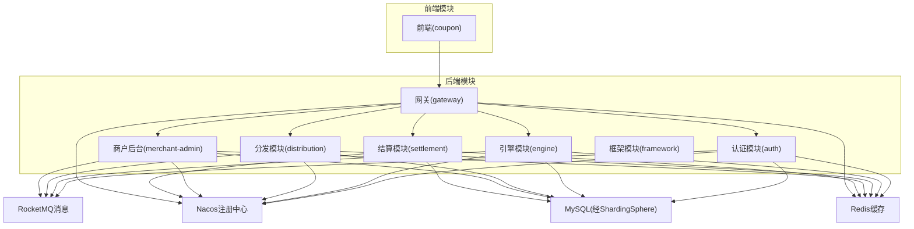
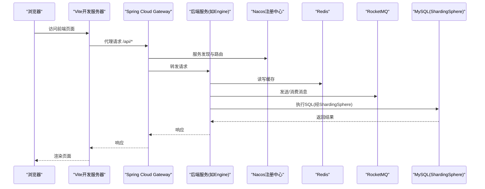
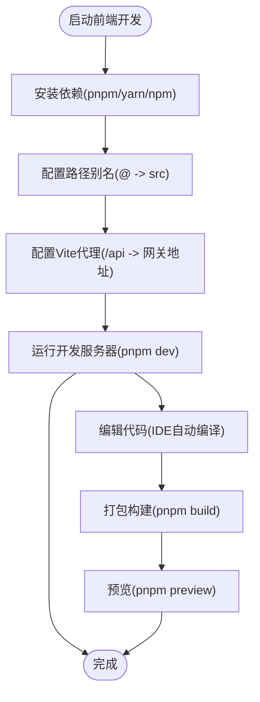
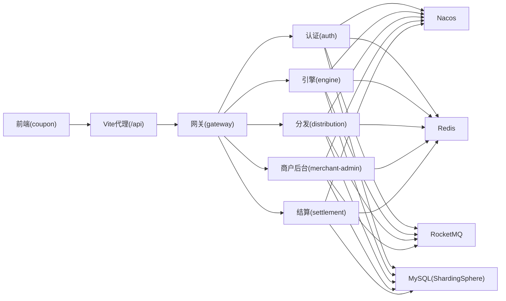

# 开发工具与配置

<cite>
**本文引用的文件**
- [根POM文件](file://pom.xml)
- [前端包配置](file://coupon/package.json)
- [Vite配置](file://coupon/vite.config.js)
- [前端路径别名配置](file://coupon/jsconfig.json)
- [前端Git忽略规则](file://coupon/.gitignore)
- [后端认证模块开发配置](file://auth/src/main/resources/application-dev.yaml)
- [后端认证模块基础配置](file://auth/src/main/resources/application.yaml)
- [后端引擎模块开发配置](file://engine/src/main/resources/application-dev.yaml)
- [后端分发模块开发配置](file://distribution/src/main/resources/application-dev.yaml)
- [后端商户后台模块开发配置](file://merchant-admin/src/main/resources/application-dev.yaml)
- [后端结算模块开发配置](file://settlement/src/main/resources/application-dev.yaml)
- [网关模块开发配置](file://gateway/src/main/resources/application-dev.yml)
- [前端入口HTML](file://coupon/index.html)
</cite>

## 目录
1. [简介](#简介)
2. [项目结构](#项目结构)
3. [核心组件](#核心组件)
4. [架构总览](#架构总览)
5. [详细组件分析](#详细组件分析)
6. [依赖关系分析](#依赖关系分析)
7. [性能考虑](#性能考虑)
8. [故障排查指南](#故障排查指南)
9. [结论](#结论)
10. [附录](#附录)

## 简介
本指南面向MapleCoupon项目的开发者，提供从JDK与IDE到数据库、前端、调试、代码质量、容器化与Kubernetes、版本控制等全链路的开发工具与配置建议。内容基于仓库中的实际配置文件整理，确保可落地、可复用。

## 项目结构
MapleCoupon采用多模块Maven聚合工程组织，包含后端各微服务模块（auth、engine、distribution、merchant-admin、settlement、gateway）与前端模块（coupon），并共享框架模块（framework）。整体技术栈以Spring Boot 3与Spring Cloud Alibaba为核心，配合Nacos注册中心、RocketMQ消息、Redis缓存、ShardingSphere分库分表、MyBatis-Plus、Knife4j/Swagger等。

**图表来源**
- [根POM文件](file://pom.xml)
- [后端认证模块基础配置](file://auth/src/main/resources/application.yaml)
- [后端引擎模块开发配置](file://engine/src/main/resources/application-dev.yaml)
- [后端分发模块开发配置](file://distribution/src/main/resources/application-dev.yaml)
- [后端商户后台模块开发配置](file://merchant-admin/src/main/resources/application-dev.yaml)
- [后端结算模块开发配置](file://settlement/src/main/resources/application-dev.yaml)
- [网关模块开发配置](file://gateway/src/main/resources/application-dev.yml)

**章节来源**
- [根POM文件](file://pom.xml)
- [前端包配置](file://coupon/package.json)

## 核心组件
- JDK与构建：Java 17，Spring Boot 3.0.7，Spring Cloud 2022.0.3，Spring Cloud Alibaba 2022.0.0.0-RC2，MyBatis-Plus 3.5.3.1，ShardingSphere 5.3.2，RocketMQ 2.3.0，Knife4j 4.5.0，Fastjson2 2.0.36，Hutool 5.8.20，Redisson 3.27.2，XXL-Job 2.4.1。
- 前端：Vue 3.5.13，Vite 6.0.5，Pinia 3.0.1，Element Plus 2.9.3，TailwindCSS 4.0，Vue Router 4.5.0。
- 数据库：ShardingSphere驱动+配置，开发环境指向本地Nacos与Redis。
- 消息：RocketMQ NameServer与生产者组配置。
- 文档：Knife4j/Swagger UI路径与语言设置。

**章节来源**
- [根POM文件](file://pom.xml)
- [前端包配置](file://coupon/package.json)

## 架构总览
下图展示开发环境下的典型交互：前端通过Vite代理访问网关，网关路由至各后端模块；后端模块连接Nacos进行服务发现，使用Redis缓存与RocketMQ消息，数据层通过ShardingSphere访问MySQL。

**图表来源**
- [Vite配置](file://coupon/vite.config.js)
- [后端引擎模块开发配置](file://engine/src/main/resources/application-dev.yaml)
- [后端认证模块开发配置](file://auth/src/main/resources/application-dev.yaml)
- [后端分发模块开发配置](file://distribution/src/main/resources/application-dev.yaml)
- [后端商户后台模块开发配置](file://merchant-admin/src/main/resources/application-dev.yaml)
- [后端结算模块开发配置](file://settlement/src/main/resources/application-dev.yaml)
- [网关模块开发配置](file://gateway/src/main/resources/application-dev.yml)

## 详细组件分析

### 后端开发环境配置（JDK、IDE、插件）
- JDK版本：Java 17（属性位于根POM的java.version）。
- IDE建议：
  - IntelliJ IDEA：启用Lombok、Spring Boot、MyBatis-Plus、YAML、Groovy等插件；开启注解处理；设置JDK 17。
  - 插件推荐：SonarLint、Checkstyle、SpotBugs、Lombok、MyBatis Log、Rainbow Brackets。
- Maven设置：使用Maven 3.8+，本地仓库指向个人目录；镜像可选阿里云或腾讯云加速。
- Spring Boot DevTools：可在application-dev.yaml中启用热部署（需IDE支持自动编译）。

**章节来源**
- [根POM文件](file://pom.xml)

### 数据库开发工具配置（MySQL Workbench、Navicat、DBeaver）
- 连接参数（以开发环境为例）：
  - 主机：192.168.187.101
  - 端口：3306
  - 用户：根据实际账号配置
  - 密码：根据实际密码配置
  - 数据库：由ShardingSphere配置决定（开发环境使用shardingsphere-config-dev.yaml）
- 工具设置建议：
  - MySQL Workbench：保存连接模板，设置查询历史与日志输出；使用ER图查看ShardingSphere分表策略。
  - Navicat：启用“自动补全”、“语法高亮”、“慢查询日志”；定期导出DDL备份。
  - DBeaver：安装MySQL驱动；配置“SQL查询模板”和“执行计划”；启用“对象管理器”查看逻辑表与物理表映射。
- 注意：ShardingSphere为逻辑分片，需结合其配置文件理解真实物理表分布。

**章节来源**
- [后端认证模块开发配置](file://auth/src/main/resources/application-dev.yaml)
- [后端引擎模块开发配置](file://engine/src/main/resources/application-dev.yaml)
- [后端分发模块开发配置](file://distribution/src/main/resources/application-dev.yaml)
- [后端商户后台模块开发配置](file://merchant-admin/src/main/resources/application-dev.yaml)
- [后端结算模块开发配置](file://settlement/src/main/resources/application-dev.yaml)

### 前端开发工具配置（Node.js、包管理器、构建工具）
- Node.js版本：建议使用LTS版本（如v18.x或v20.x），与Vite 6兼容良好。
- 包管理器：优先使用pnpm或yarn 2+，提升安装速度与依赖一致性；若使用npm，注意清理package-lock.json后重新安装。
- 构建工具：Vite 6，开发服务器端口默认由Vite配置决定；代理目标地址指向后端网关地址。
- 路径别名：@指向src目录，便于统一导入；IDE需同步jsconfig.json中的路径映射。
- Git忽略：前端模块包含.gitignore，屏蔽node_modules、dist、IDE相关文件与日志。

**图表来源**
- [Vite配置](file://coupon/vite.config.js)
- [前端路径别名配置](file://coupon/jsconfig.json)
- [前端Git忽略规则](file://coupon/.gitignore)
- [前端入口HTML](file://coupon/index.html)

**章节来源**
- [前端包配置](file://coupon/package.json)
- [Vite配置](file://coupon/vite.config.js)
- [前端路径别名配置](file://coupon/jsconfig.json)
- [前端Git忽略规则](file://coupon/.gitignore)
- [前端入口HTML](file://coupon/index.html)

### 调试工具使用方法（断点、日志、性能分析）
- 断点调试：
  - 后端：在IDE中为每个模块设置Debug配置，激活dev配置文件；通过Nacos确认服务注册状态；对Controller、Service、DAO逐层断点。
  - 前端：在Vite开发服务器中启用Vue DevTools；在浏览器Sources中设置断点；利用Vite的热更新观察变更。
- 日志调试：
  - Knife4j/Swagger UI：开发环境已启用，可通过配置的UI路径访问接口文档与测试。
  - MyBatis日志：StdOutImpl已开启，可在控制台查看SQL执行情况。
- 性能分析：
  - JVM层面：使用JProfiler或VisualVM连接Java进程，关注GC、线程、堆内存与热点方法。
  - 前端性能：Chrome DevTools Network与Performance面板分析网络请求与渲染瓶颈。
  - 消息链路：RocketMQ控制台监控消息积压与延迟；结合业务埋点定位耗时环节。

**章节来源**
- [后端认证模块基础配置](file://auth/src/main/resources/application.yaml)
- [后端引擎模块开发配置](file://engine/src/main/resources/application-dev.yaml)
- [后端结算模块开发配置](file://settlement/src/main/resources/application-dev.yaml)

### 代码质量工具集成（SonarQube、Checkmarx、SpotBugs）
- SonarQube：
  - 在CI中集成sonar-scanner，扫描覆盖率与质量门禁；建议在根POM中添加sonar项目元数据与源码路径。
  - 配置质量阈值：阻断式bug、漏洞、技术债与重复率。
- Checkmarx：
  - 在CI流水线中集成KICS或Checkmarx SAST，扫描敏感信息泄露与依赖漏洞；建议对前端静态资源与后端依赖进行扫描。
- SpotBugs：
  - 在Maven中集成spotbugs-maven-plugin，生成报告；结合FindBugs/SpotBugs过滤规则，排除误报。
- 统一规范：
  - 使用Google Java Style或阿里巴巴Java开发手册；在IDE中配置保存时自动格式化。
  - 前端使用ESLint + Prettier，结合husky与lint-staged在提交前检查。

**章节来源**
- [根POM文件](file://pom.xml)

### Docker与Kubernetes开发配置（容器化与本地集群）
- 容器化建议：
  - 为每个后端模块编写Dockerfile，基于OpenJDK 17 Slim镜像；暴露应用端口；挂载外部化配置（application-dev.yaml）。
  - 前端使用nginx:alpine作为静态资源镜像，构建产物dist目录。
  - 使用docker-compose编排：Nacos、Redis、MySQL、RocketMQ、各后端服务与网关。
- 本地K8s集群：
  - Kind/K3d用于本地开发；Helm或Kustomize管理配置；为每个服务创建Deployment、Service与Ingress。
  - 使用Secret管理敏感配置（Nacos、Redis、数据库连接信息）；使用ConfigMap管理非敏感配置。
- CI/CD：
  - 在流水线中集成构建、镜像推送、安全扫描与发布步骤；K8s部署使用滚动更新策略。

**章节来源**
- [根POM文件](file://pom.xml)

### 版本控制工具高级配置（Git Hooks、分支管理、格式化）
- 分支管理：
  - 采用Git Flow或GitHub Flow；主分支受保护，合并必须通过PR与CI通过。
  - 功能分支以feature/前缀，修复分支以fix/前缀，发布分支以release/前缀。
- Git Hooks：
  - 使用pre-commit钩子执行ESLint、SpotBugs、单元测试；拒绝不符合规范的提交。
  - 使用commit-msg钩子校验提交信息格式（如<type>(<scope>): <subject>）。
- 代码格式化：
  - Java：配置EditorConfig与IDE格式化规则；在CI中使用checkstyle或spotless校验。
  - JavaScript/TypeScript：ESLint + Prettier；结合husky与lint-staged在本地强制执行。
  - YAML/JSON：VS Code扩展或prettier统一格式。

**章节来源**
- [前端Git忽略规则](file://coupon/.gitignore)

## 依赖关系分析
后端模块均通过Nacos进行服务发现，使用Redis缓存与RocketMQ消息，数据层通过ShardingSphere访问MySQL。前端通过Vite代理访问网关，再由网关路由到具体服务。

**图表来源**
- [后端认证模块开发配置](file://auth/src/main/resources/application-dev.yaml)
- [后端引擎模块开发配置](file://engine/src/main/resources/application-dev.yaml)
- [后端分发模块开发配置](file://distribution/src/main/resources/application-dev.yaml)
- [后端商户后台模块开发配置](file://merchant-admin/src/main/resources/application-dev.yaml)
- [后端结算模块开发配置](file://settlement/src/main/resources/application-dev.yaml)
- [网关模块开发配置](file://gateway/src/main/resources/application-dev.yml)
- [Vite配置](file://coupon/vite.config.js)

**章节来源**
- [根POM文件](file://pom.xml)

## 性能考虑
- JVM调优：合理设置堆大小与GC策略；对高频接口开启异步处理与缓存预热。
- 数据库优化：结合ShardingSphere分片键设计，避免跨库事务；对热点表建立合适索引。
- 消息队列：合理设置生产者组与消费者并发度；监控消息积压与延迟。
- 前端性能：拆分路由与组件懒加载；压缩与缓存静态资源；减少不必要的重渲染。

## 故障排查指南
- 服务无法注册到Nacos：检查application-dev.yaml中的server-addr是否可达；确认防火墙与端口开放。
- RocketMQ发送失败：检查NameServer地址与生产者组配置；查看发送超时与重试次数设置。
- 前端代理无效：确认Vite代理配置与后端网关端口一致；浏览器Network面板查看代理转发状态。
- Knife4j/Swagger不可用：确认springdoc与knife4j配置路径；检查包扫描范围与Swagger注解。
- ShardingSphere连接异常：核对ShardingSphere配置文件路径与数据库凭证；确认分片规则与逻辑表映射。

**章节来源**
- [后端认证模块开发配置](file://auth/src/main/resources/application-dev.yaml)
- [后端引擎模块开发配置](file://engine/src/main/resources/application-dev.yaml)
- [后端分发模块开发配置](file://distribution/src/main/resources/application-dev.yaml)
- [后端商户后台模块开发配置](file://merchant-admin/src/main/resources/application-dev.yaml)
- [后端结算模块开发配置](file://settlement/src/main/resources/application-dev.yaml)
- [网关模块开发配置](file://gateway/src/main/resources/application-dev.yml)
- [Vite配置](file://coupon/vite.config.js)

## 结论
本指南基于MapleCoupon仓库的实际配置，提供了从JDK/IDE到数据库、前端、调试、代码质量、容器化与Kubernetes、版本控制的完整开发工具链建议。建议在本地与CI中统一这些工具与流程，以保障开发效率与代码质量。

## 附录
- 快速启动清单：
  - 安装JDK 17、Node LTS、IDE与必要插件。
  - 启动Nacos、Redis、MySQL、RocketMQ（或使用docker-compose）。
  - 后端：分别启动gateway与各业务模块（auth/engine/distribution/merchant-admin/settlement）。
  - 前端：安装依赖后运行dev脚本，访问本地前端页面。
  - 验证：通过Knife4j/Swagger与浏览器Network面板确认接口连通性与代理转发。