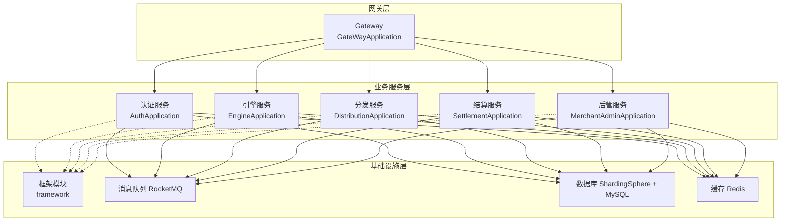
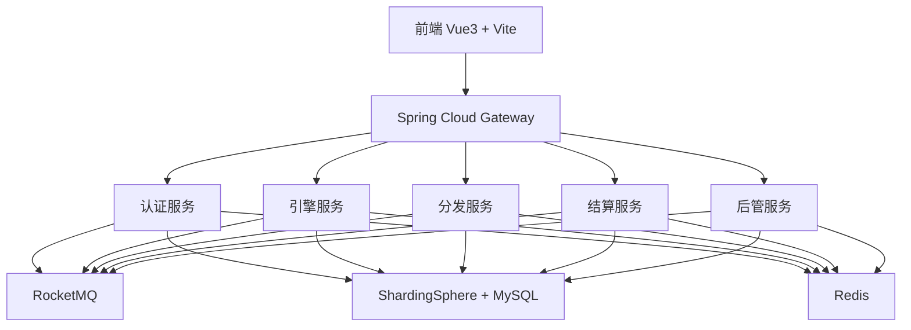
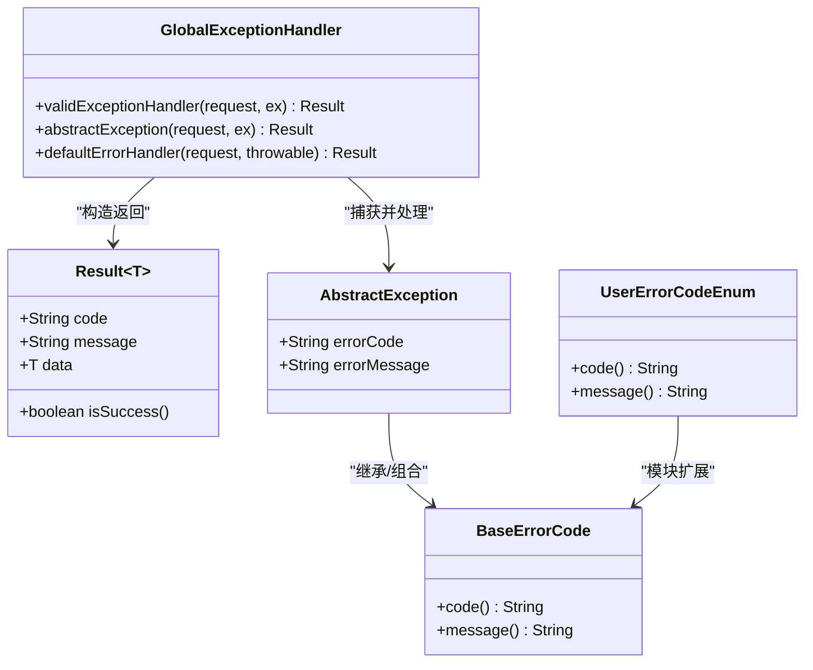
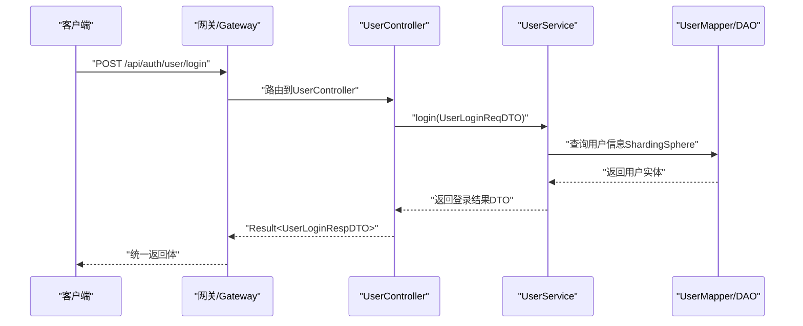
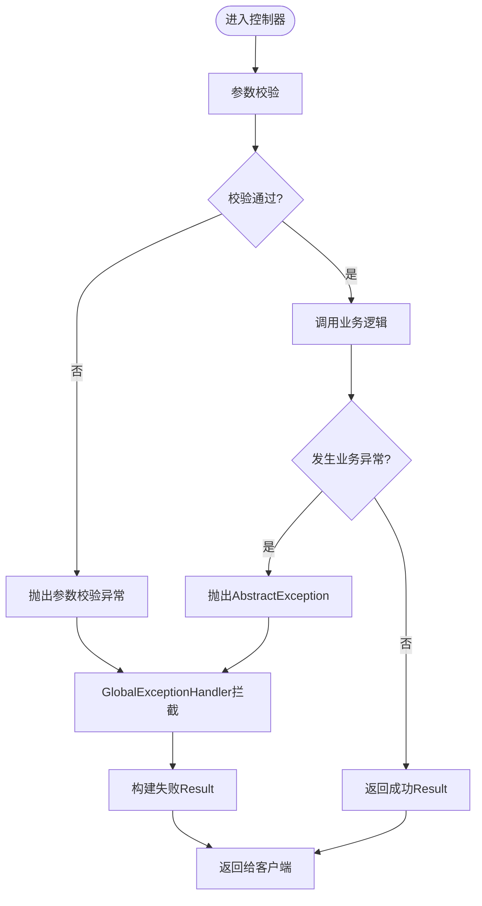

# 开发指南

<cite>
**本文引用的文件**   
- [README.md](file://README.md)
- [pom.xml](file://pom.xml)
- [AuthApplication.java](file://auth/src/main/java/com/fengxin/maplecoupon/auth/AuthApplication.java)
- [EngineApplication.java](file://engine/src/main/java/com/fengxin/maplecoupon/engine/EngineApplication.java)
- [DistributionApplication.java](file://distribution/src/main/java/com/fengxin/maplecoupon/distribution/DistributionApplication.java)
- [GateWayApplication.java](file://gateway/src/main/java/com/fengxin/maplecoupon/gateway/GateWayApplication.java)
- [GlobalExceptionHandler.java](file://framework/src/main/java/com/fengxin/web/GlobalExceptionHandler.java)
- [Result.java](file://framework/src/main/java/com/fengxin/web/Result.java)
- [AbstractException.java](file://framework/src/main/java/com/fengxin/exception/AbstractException.java)
- [BaseErrorCode.java](file://framework/src/main/java/com/fengxin/errorcode/BaseErrorCode.java)
- [UserErrorCodeEnum.java](file://auth/src/main/java/com/fengxin/maplecoupon/auth/common/enums/UserErrorCodeEnum.java)
- [UserService.java](file://auth/src/main/java/com/fengxin/maplecoupon/auth/service/UserService.java)
- [UserController.java](file://auth/src/main/java/com/fengxin/maplecoupon/auth/controller/UserController.java)
- [application.yaml](file://auth/src/main/resources/application.yaml)
</cite>

## 目录
1. [简介](#简介)
2. [项目结构](#项目结构)
3. [核心组件](#核心组件)
4. [架构总览](#架构总览)
5. [详细组件分析](#详细组件分析)
6. [依赖分析](#依赖分析)
7. [性能考虑](#性能考虑)
8. [故障排查指南](#故障排查指南)
9. [结论](#结论)
10. [附录](#附录)

## 简介
本指南面向MapleCoupon项目的开发者，提供统一的开发规范与最佳实践，覆盖代码风格、命名约定、注释规范、文档编写标准；阐述分层架构、设计模式与代码组织原则；给出新功能开发流程、代码审查清单与质量评估指标；总结异常处理与错误码设计方法；并提供开发工具与IDE配置建议、版本控制与分支管理规范，以及本地开发环境搭建与调试技巧。

## 项目结构
MapleCoupon采用多模块Maven聚合工程，包含网关、认证、引擎、分发、结算、后管、框架（公共能力）等模块。各模块职责清晰，通过Spring Cloud Alibaba生态进行服务治理与集成。

图表来源
- [GateWayApplication.java:1-18](file://gateway/src/main/java/com/fengxin/maplecoupon/gateway/GateWayApplication.java#L1-L18)
- [AuthApplication.java:1-26](file://auth/src/main/java/com/fengxin/maplecoupon/auth/AuthApplication.java#L1-L26)
- [EngineApplication.java:1-19](file://engine/src/main/java/com/fengxin/maplecoupon/engine/EngineApplication.java#L1-L19)
- [DistributionApplication.java:1-19](file://distribution/src/main/java/com/fengxin/maplecoupon/distribution/DistributionApplication.java#L1-L19)
- [pom.xml:17-34](file://pom.xml#L17-L34)

章节来源
- [README.md:1-10](file://README.md#L1-L10)
- [pom.xml:17-34](file://pom.xml#L17-L34)

## 核心组件
- 应用入口与扫描
  - 认证服务：启用服务发现与OpenFeign，Mapper扫描路径固定，便于跨模块远程调用。
  - 引擎/分发/结算/后管服务：统一使用MyBatis Mapper扫描，保证DAO层自动装配。
  - 网关服务：作为统一入口，负责路由、鉴权与限流。
- 公共框架
  - 统一返回体、全局异常处理、基础错误码与抽象异常类型，确保各服务一致的错误语义与返回格式。
- 配置与数据源
  - 认证服务示例展示了基于ShardingSphere驱动的多数据源配置与MyBatis日志输出配置。

章节来源
- [AuthApplication.java:15-18](file://auth/src/main/java/com/fengxin/maplecoupon/auth/AuthApplication.java#L15-L18)
- [EngineApplication.java:13-14](file://engine/src/main/java/com/fengxin/maplecoupon/engine/EngineApplication.java#L13-L14)
- [DistributionApplication.java:13-14](file://distribution/src/main/java/com/fengxin/maplecoupon/distribution/DistributionApplication.java#L13-L14)
- [GateWayApplication.java:12-16](file://gateway/src/main/java/com/fengxin/maplecoupon/gateway/GateWayApplication.java#L12-L16)
- [Result.java:15-45](file://framework/src/main/java/com/fengxin/web/Result.java#L15-L45)
- [GlobalExceptionHandler.java:24-78](file://framework/src/main/java/com/fengxin/web/GlobalExceptionHandler.java#L24-L78)
- [BaseErrorCode.java:8-53](file://framework/src/main/java/com/fengxin/errorcode/BaseErrorCode.java#L8-L53)
- [application.yaml:1-19](file://auth/src/main/resources/application.yaml#L1-L19)

## 架构总览
系统采用前后端分离与微服务架构：
- 前端：Vue3 + Vite（位于coupon模块）
- 网关：Spring Cloud Gateway（统一入口）
- 服务：认证、引擎、分发、结算、后管等独立服务
- 数据：ShardingSphere分库分表 + MySQL，Redis缓存，RocketMQ消息队列
- 工具链：Knife4j、EasyExcel、HuTool、XXL-Job、Docker等

图表来源
- [README.md:4](file://README.md#L4)
- [GateWayApplication.java:12-16](file://gateway/src/main/java/com/fengxin/maplecoupon/gateway/GateWayApplication.java#L12-L16)
- [AuthApplication.java:17-18](file://auth/src/main/java/com/fengxin/maplecoupon/auth/AuthApplication.java#L17-L18)

## 详细组件分析

### 统一返回与异常处理
- 统一返回体
  - Result<T>封装code/message/data，提供isSuccess判断，确保前后端交互一致性。
- 全局异常处理
  - 拦截参数校验异常、应用内抽象异常与未捕获异常，统一记录日志并返回Result。
- 错误码体系
  - BaseErrorCode定义基础错误码，模块内可扩展枚举型错误码（如UserErrorCodeEnum），保持错误码前缀与语义清晰。
- 抽象异常
  - AbstractException承载errorCode与errorMessage，便于上抛与下钻。

图表来源
- [Result.java:15-45](file://framework/src/main/java/com/fengxin/web/Result.java#L15-L45)
- [GlobalExceptionHandler.java:24-78](file://framework/src/main/java/com/fengxin/web/GlobalExceptionHandler.java#L24-L78)
- [AbstractException.java:18-28](file://framework/src/main/java/com/fengxin/exception/AbstractException.java#L18-L28)
- [BaseErrorCode.java:8-53](file://framework/src/main/java/com/fengxin/errorcode/BaseErrorCode.java#L8-L53)
- [UserErrorCodeEnum.java:9-35](file://auth/src/main/java/com/fengxin/maplecoupon/auth/common/enums/UserErrorCodeEnum.java#L9-L35)

章节来源
- [Result.java:15-45](file://framework/src/main/java/com/fengxin/web/Result.java#L15-L45)
- [GlobalExceptionHandler.java:24-78](file://framework/src/main/java/com/fengxin/web/GlobalExceptionHandler.java#L24-L78)
- [AbstractException.java:18-28](file://framework/src/main/java/com/fengxin/exception/AbstractException.java#L18-L28)
- [BaseErrorCode.java:8-53](file://framework/src/main/java/com/fengxin/errorcode/BaseErrorCode.java#L8-L53)
- [UserErrorCodeEnum.java:9-35](file://auth/src/main/java/com/fengxin/maplecoupon/auth/common/enums/UserErrorCodeEnum.java#L9-L35)

### 认证服务典型流程（登录）
以下序列图展示认证服务的典型调用链：控制器接收请求 -> 业务层处理 -> DAO访问数据库（ShardingSphere）-> 返回统一结果。

图表来源
- [UserController.java:62-66](file://auth/src/main/java/com/fengxin/maplecoupon/auth/controller/UserController.java#L62-L66)
- [UserService.java:58](file://auth/src/main/java/com/fengxin/maplecoupon/auth/service/UserService.java#L58)
- [application.yaml:6-8](file://auth/src/main/resources/application.yaml#L6-L8)

章节来源
- [UserController.java:24-80](file://auth/src/main/java/com/fengxin/maplecoupon/auth/controller/UserController.java#L24-L80)
- [UserService.java:19-79](file://auth/src/main/java/com/fengxin/maplecoupon/auth/service/UserService.java#L19-L79)
- [application.yaml:1-19](file://auth/src/main/resources/application.yaml#L1-L19)

### 参数校验与异常处理流程
参数校验失败时，全局异常处理器将首个字段错误信息标准化返回；业务异常通过AbstractException携带错误码与消息；未捕获异常统一兜底。

图表来源
- [GlobalExceptionHandler.java:30-40](file://framework/src/main/java/com/fengxin/web/GlobalExceptionHandler.java#L30-L40)
- [GlobalExceptionHandler.java:44-59](file://framework/src/main/java/com/fengxin/web/GlobalExceptionHandler.java#L44-L59)
- [GlobalExceptionHandler.java:64-68](file://framework/src/main/java/com/fengxin/web/GlobalExceptionHandler.java#L64-L68)

章节来源
- [GlobalExceptionHandler.java:24-78](file://framework/src/main/java/com/fengxin/web/GlobalExceptionHandler.java#L24-L78)

## 依赖分析
- 版本与依赖管理
  - 使用dependencyManagement集中声明Spring Boot、Spring Cloud、Spring Cloud Alibaba、MyBatis-Plus、ShardingSphere、RocketMQ、Redisson、HuTool、EasyExcel、XXL-Job等版本，确保子模块一致性。
- 模块间耦合
  - 认证服务通过OpenFeign远程调用引擎/结算/分发等服务；各服务均依赖framework提供的统一返回与异常处理。
- 外部依赖
  - ShardingSphere用于分库分表；Redis用于缓存与分布式能力；RocketMQ用于异步解耦；Knife4j用于接口文档；HuTool/EasyExcel用于工具与Excel处理；XXL-Job用于定时任务。

章节来源
- [pom.xml:61-182](file://pom.xml#L61-L182)
- [AuthApplication.java:17-18](file://auth/src/main/java/com/fengxin/maplecoupon/auth/AuthApplication.java#L17-L18)

## 性能考虑
- 缓存优先：热点数据放入Redis，结合布隆过滤器降低空命中查询压力。
- 分库分表：通过ShardingSphere对用户与优惠券相关表进行哈希分片，提升读写吞吐。
- 异步化：使用RocketMQ异步处理分发、提醒、延迟关闭等场景，削峰填谷。
- 日志与监控：开启MyBatis SQL日志与统一异常日志，结合业务日志SDK定位性能瓶颈。
- 幂等性：对重复提交与重复消费场景增加幂等控制，避免资源浪费。

## 故障排查指南
- 统一返回与异常
  - 使用Result统一返回，便于前端与网关侧统一处理；全局异常处理器记录请求URL与堆栈片段，快速定位问题。
- 错误码定位
  - 优先依据错误码前缀区分客户端/服务端/远程调用错误，结合模块内错误码枚举快速定位业务域。
- 参数校验
  - 参数校验异常会返回首个字段错误信息，优先修复首报字段。
- 数据源与分片
  - 若出现分片规则不匹配或SQL路由异常，检查ShardingSphere配置与分片键设置。

章节来源
- [GlobalExceptionHandler.java:24-78](file://framework/src/main/java/com/fengxin/web/GlobalExceptionHandler.java#L24-L78)
- [BaseErrorCode.java:8-53](file://framework/src/main/java/com/fengxin/errorcode/BaseErrorCode.java#L8-L53)
- [UserErrorCodeEnum.java:9-35](file://auth/src/main/java/com/fengxin/maplecoupon/auth/common/enums/UserErrorCodeEnum.java#L9-L35)
- [application.yaml:12-14](file://auth/src/main/resources/application.yaml#L12-L14)

## 结论
本指南提供了MapleCoupon项目的开发规范、架构原则与实践方法。遵循统一的返回体、异常处理与错误码体系，采用分层与模块化组织，配合参数校验、幂等控制与异步化策略，可显著提升系统的稳定性与可维护性。建议在新功能开发与代码审查中严格执行本文规范。

## 附录

### 开发规范与最佳实践
- 代码风格
  - 统一使用大括号风格与缩进；长方法拆分为多个职责单一的小方法；类与方法命名见名知意。
- 命名约定
  - 包名全小写；类名采用帕斯卡命名；常量全大写+下划线；变量采用驼峰；DTO/VO/BO区分清晰。
- 注释规范
  - 类与方法需有Javadoc说明用途、入参与返回；复杂逻辑添加行内注释；变更原因与风险点明确标注。
- 文档编写
  - 接口文档使用Swagger/Knife4j，参数与示例完整；README补充模块职责与运行说明。

### 新功能开发流程
- 需求分析
  - 明确业务目标、边界与影响面；识别数据模型与接口契约。
- 设计评审
  - 输出ER图/时序图/类图；评审分片策略、缓存策略、异常与回滚策略。
- 编码实现
  - 遵循分层架构；DTO/Service/DAO职责清晰；使用统一返回与异常处理。
- 测试验证
  - 单元测试覆盖关键分支；集成测试覆盖网关与远程调用；压测关注分片与缓存命中率。
- 上线与复盘
  - 灰度发布；监控告警；复盘优化。

### 代码审查清单
- 规范性
  - 命名、注释、日志是否规范；异常处理是否统一；错误码是否合理。
- 可靠性
  - 参数校验是否完整；幂等性是否覆盖；事务边界是否清晰。
- 性能
  - 是否存在N+1查询；缓存命中策略是否合理；是否使用异步解耦。
- 安全
  - 是否存在SQL注入/参数篡改风险；鉴权与脱敏是否到位。

### 异常处理与错误码设计
- 全局异常
  - 使用GlobalExceptionHandler统一拦截；区分参数校验、业务异常与未捕获异常。
- 错误码
  - 基础错误码前缀：客户端错误(A)、系统错误(B)、远程错误(C)；模块扩展错误码前缀与模块内枚举保持一致。
- 业务异常
  - 通过AbstractException传递错误码与消息；避免直接抛出原始异常。

章节来源
- [GlobalExceptionHandler.java:24-78](file://framework/src/main/java/com/fengxin/web/GlobalExceptionHandler.java#L24-L78)
- [BaseErrorCode.java:8-53](file://framework/src/main/java/com/fengxin/errorcode/BaseErrorCode.java#L8-L53)
- [AbstractException.java:18-28](file://framework/src/main/java/com/fengxin/exception/AbstractException.java#L18-L28)

### 开发工具与IDE配置
- 插件建议
  - Lombok、MyBatisX、Rainbow Brackets、String Manipulation、Statistic、Translation。
- 快捷键
  - 代码生成：Alt+Insert；导航：Ctrl+Shift+N；重构：Shift+F6；格式化：Ctrl+Alt+L。
- 代码模板
  - 自定义REST控制器模板，自动注入DTO与Result返回体；Service模板自动导入常用注解。

### 版本控制与分支管理
- Git工作流
  - 主干：main（发布稳定版本）；特性：feature/*；修复：fix/*；热修复：hotfix/*。
- 合并策略
  - feature/fix使用squash合并至develop/main；hotfix直接合并main并打标签。
- 提交规范
  - type(scope): subject；示例：feat(auth): 用户登录接口新增

### 本地开发环境搭建与调试
- 环境准备
  - JDK 17、MySQL、Redis、RocketMQ、ShardingSphere配置文件；Docker可选。
- 启动顺序
  - 先启动网关与注册中心（若使用），再启动各业务服务；认证服务示例配置了ShardingSphere驱动与MyBatis日志输出。
- 调试技巧
  - 使用IDE断点定位；开启SQL日志观察分片路由；结合全局异常日志快速定位业务异常。

章节来源
- [application.yaml:1-19](file://auth/src/main/resources/application.yaml#L1-L19)