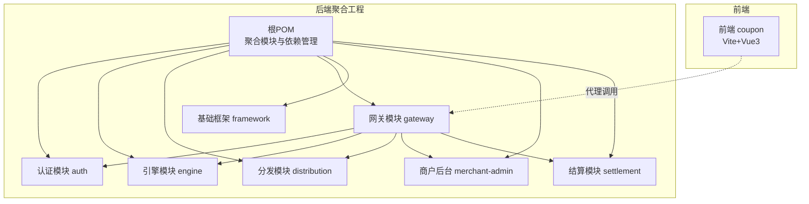
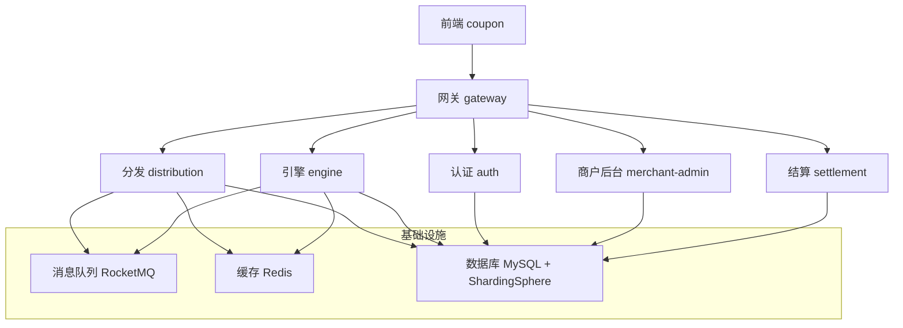
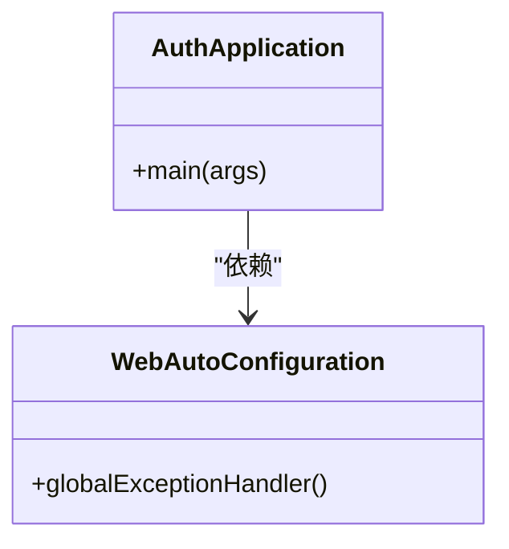
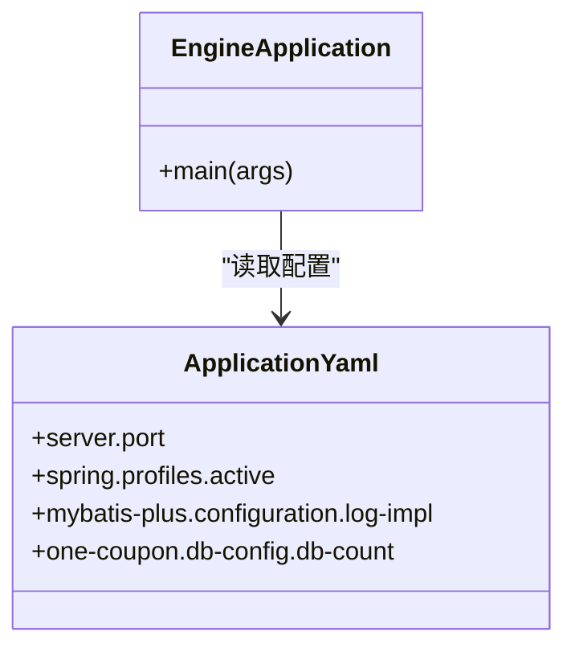
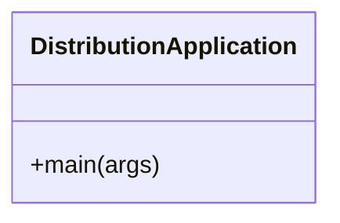
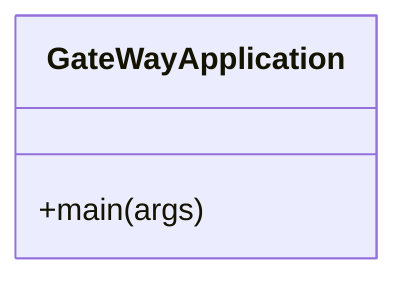
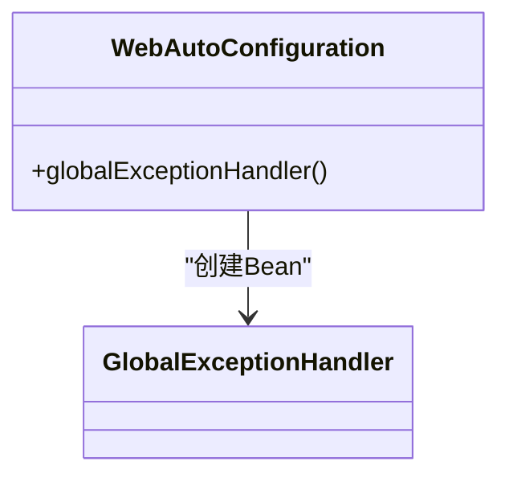
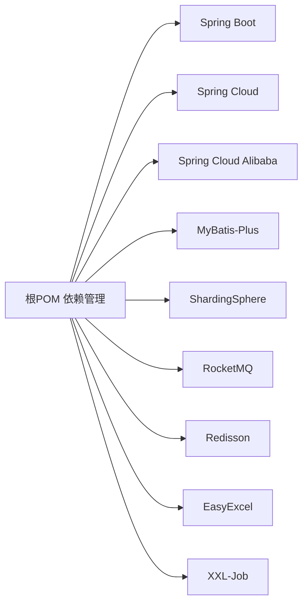

# 开发流程与协作

<cite>
**本文引用的文件**
- [README.md](file://README.md)
- [pom.xml](file://pom.xml)
- [coupon/package.json](file://coupon/package.json)
- [coupon/vite.config.js](file://coupon/vite.config.js)
- [coupon/.gitignore](file://coupon/.gitignore)
- [auth/src/main/resources/application.yaml](file://auth/src/main/resources/application.yaml)
- [engine/src/main/resources/application.yaml](file://engine/src/main/resources/application.yaml)
- [auth/src/main/java/com/fengxin/maplecoupon/auth/AuthApplication.java](file://auth/src/main/java/com/fengxin/maplecoupon/auth/AuthApplication.java)
- [engine/src/main/java/com/fengxin/maplecoupon/engine/EngineApplication.java](file://engine/src/main/java/com/fengxin/maplecoupon/engine/EngineApplication.java)
- [gateway/src/main/java/com/fengxin/maplecoupon/gateway/GateWayApplication.java](file://gateway/src/main/java/com/fengxin/maplecoupon/gateway/GateWayApplication.java)
- [distribution/src/main/java/com/fengxin/maplecoupon/distribution/DistributionApplication.java](file://distribution/src/main/java/com/fengxin/maplecoupon/distribution/DistributionApplication.java)
- [framework/src/main/java/com/fengxin/config/WebAutoConfiguration.java](file://framework/src/main/java/com/fengxin/config/WebAutoConfiguration.java)
</cite>

## 目录
1. [引言](#引言)
2. [项目结构](#项目结构)
3. [核心组件](#核心组件)
4. [架构总览](#架构总览)
5. [详细组件分析](#详细组件分析)
6. [依赖分析](#依赖分析)
7. [性能考虑](#性能考虑)
8. [故障排查指南](#故障排查指南)
9. [结论](#结论)
10. [附录](#附录)

## 引言
本指南面向MapleCoupon项目的开发与协作，覆盖从需求到上线的完整流程，包括需求分析、技术设计、编码实现、测试验证、代码审查、版本控制、CI/CD、团队协作与开发环境标准化，以及文档编写规范。目标是帮助新成员快速融入并高效交付高质量功能。

## 项目结构
MapleCoupon采用多模块Maven聚合工程组织，包含认证(auth)、引擎(engine)、分发(distribution)、网关(gateway)、基础框架(framework)、商户后台(merchant-admin)、结算(settlement)等子模块；前端位于coupon目录，使用Vite+Vue3构建。

图表来源
- [pom.xml:17-34](file://pom.xml#L17-L34)
- [coupon/vite.config.js:14-25](file://coupon/vite.config.js#L14-L25)

章节来源
- [pom.xml:17-34](file://pom.xml#L17-L34)
- [coupon/package.json:6-10](file://coupon/package.json#L6-L10)

## 核心组件
- 认证服务：负责用户登录、注册、上下文传递与远程调用。
- 引擎服务：负责优惠券模板查询、用户优惠券管理、提醒与延迟处理等。
- 分发服务：负责按批次分发优惠券、MQ事件驱动与Excel导入导出。
- 商户后台：负责优惠券模板创建、状态变更、日志记录与定时任务。
- 结算服务：负责订单维度的优惠券查询与结算。
- 网关：统一入口、路由、鉴权过滤、请求日志与限流。
- 基础框架：全局异常、幂等性、Web自动装配等通用能力。

章节来源
- [auth/src/main/java/com/fengxin/maplecoupon/auth/AuthApplication.java:15-25](file://auth/src/main/java/com/fengxin/maplecoupon/auth/AuthApplication.java#L15-L25)
- [engine/src/main/java/com/fengxin/maplecoupon/engine/EngineApplication.java:13-19](file://engine/src/main/java/com/fengxin/maplecoupon/engine/EngineApplication.java#L13-L19)
- [distribution/src/main/java/com/fengxin/maplecoupon/distribution/DistributionApplication.java:13-19](file://distribution/src/main/java/com/fengxin/maplecoupon/distribution/DistributionApplication.java#L13-L19)
- [gateway/src/main/java/com/fengxin/maplecoupon/gateway/GateWayApplication.java:12-17](file://gateway/src/main/java/com/fengxin/maplecoupon/gateway/GateWayApplication.java#L12-L17)
- [framework/src/main/java/com/fengxin/config/WebAutoConfiguration.java:12-21](file://framework/src/main/java/com/fengxin/config/WebAutoConfiguration.java#L12-L21)

## 架构总览
系统采用微服务架构，前端通过网关访问各后端模块；数据层通过ShardingSphere进行分库分表；消息队列RocketMQ用于异步解耦；Redis用于缓存与分布式锁；MyBatis-Plus提供ORM能力；OpenFeign用于服务间调用；Knife4j提供在线文档；XXL-Job用于定时任务。

图表来源
- [README.md:4](file://README.md#L4)
- [auth/src/main/resources/application.yaml:6-8](file://auth/src/main/resources/application.yaml#L6-L8)
- [engine/src/main/resources/application.yaml:6-8](file://engine/src/main/resources/application.yaml#L6-L8)

## 详细组件分析

### 组件A：认证服务（Auth）
- 职责：用户登录/注册、上下文传递、远程调用声明。
- 关键点：启用服务发现与OpenFeign客户端扫描，Mapper扫描路径明确。
- 配置：数据源使用ShardingSphere驱动，开发环境激活。

图表来源
- [auth/src/main/java/com/fengxin/maplecoupon/auth/AuthApplication.java:15-25](file://auth/src/main/java/com/fengxin/maplecoupon/auth/AuthApplication.java#L15-L25)
- [framework/src/main/java/com/fengxin/config/WebAutoConfiguration.java:12-21](file://framework/src/main/java/com/fengxin/config/WebAutoConfiguration.java#L12-L21)

章节来源
- [auth/src/main/java/com/fengxin/maplecoupon/auth/AuthApplication.java:15-25](file://auth/src/main/java/com/fengxin/maplecoupon/auth/AuthApplication.java#L15-L25)
- [auth/src/main/resources/application.yaml:1-19](file://auth/src/main/resources/application.yaml#L1-L19)

### 组件B：引擎服务（Engine）
- 职责：优惠券模板与用户优惠券相关接口、MQ消费与生产、提醒与延迟处理。
- 关键点：数据源配置、开发环境激活、ShardingSphere分片策略。
- 配置：MyBatis日志输出开启，db-count配置用于分库数量。

图表来源
- [engine/src/main/java/com/fengxin/maplecoupon/engine/EngineApplication.java:13-19](file://engine/src/main/java/com/fengxin/maplecoupon/engine/EngineApplication.java#L13-L19)
- [engine/src/main/resources/application.yaml:1-22](file://engine/src/main/resources/application.yaml#L1-L22)

章节来源
- [engine/src/main/java/com/fengxin/maplecoupon/engine/EngineApplication.java:13-19](file://engine/src/main/java/com/fengxin/maplecoupon/engine/EngineApplication.java#L13-L19)
- [engine/src/main/resources/application.yaml:1-22](file://engine/src/main/resources/application.yaml#L1-L22)

### 组件C：分发服务（Distribution）
- 职责：优惠券批次分发、MQ事件驱动、Excel导入导出、事务执行。
- 关键点：Lua脚本优化库存扣减与批量保存，ShardingSphere分片算法。

图表来源
- [distribution/src/main/java/com/fengxin/maplecoupon/distribution/DistributionApplication.java:13-19](file://distribution/src/main/java/com/fengxin/maplecoupon/distribution/DistributionApplication.java#L13-L19)

章节来源
- [distribution/src/main/java/com/fengxin/maplecoupon/distribution/DistributionApplication.java:13-19](file://distribution/src/main/java/com/fengxin/maplecoupon/distribution/DistributionApplication.java#L13-L19)

### 组件D：网关（Gateway）
- 职责：统一入口、路由、鉴权过滤、请求日志与限流。
- 关键点：启动类声明式装配，配置文件集中管理。

图表来源
- [gateway/src/main/java/com/fengxin/maplecoupon/gateway/GateWayApplication.java:12-17](file://gateway/src/main/java/com/fengxin/maplecoupon/gateway/GateWayApplication.java#L12-L17)

章节来源
- [gateway/src/main/java/com/fengxin/maplecoupon/gateway/GateWayApplication.java:12-17](file://gateway/src/main/java/com/fengxin/maplecoupon/gateway/GateWayApplication.java#L12-L17)

### 组件E：基础框架（Framework）
- 职责：全局异常处理、幂等性注解与切面、Web自动装配。
- 关键点：通过自动装配Bean注入全局异常处理器。

图表来源
- [framework/src/main/java/com/fengxin/config/WebAutoConfiguration.java:12-21](file://framework/src/main/java/com/fengxin/config/WebAutoConfiguration.java#L12-L21)

章节来源
- [framework/src/main/java/com/fengxin/config/WebAutoConfiguration.java:12-21](file://framework/src/main/java/com/fengxin/config/WebAutoConfiguration.java#L12-L21)

## 依赖分析
- 版本与依赖管理：根POM集中管理Spring Boot、Spring Cloud、Spring Cloud Alibaba、MyBatis-Plus、ShardingSphere、RocketMQ、Redisson、EasyExcel、XXL-Job等版本。
- 模块依赖：各模块独立运行，通过网关统一对外暴露；前端通过本地代理指向网关地址，便于联调。

图表来源
- [pom.xml:61-182](file://pom.xml#L61-L182)

章节来源
- [pom.xml:37-60](file://pom.xml#L37-L60)
- [pom.xml:61-182](file://pom.xml#L61-L182)

## 性能考虑
- 数据库层：通过ShardingSphere进行分库分表，合理设置db-count与分片算法，避免热点库表。
- 缓存层：利用Redis进行热点数据缓存与分布式锁，Lua脚本减少网络往返。
- MQ层：异步化处理库存扣减、分发与提醒，削峰填谷。
- ORM层：开启MyBatis日志便于定位慢SQL，结合索引与分页优化。
- 前端：Vite构建优化、按需加载与组件拆分，减少首屏体积。

## 故障排查指南
- 全局异常处理：通过基础框架的全局异常处理器统一捕获与返回，便于前后端一致化处理。
- 配置检查：确认各模块application.yaml中的数据源URL、开发环境激活与日志输出是否正确。
- 网关代理：确认前端vite.config.js中代理目标地址与路径重写规则，避免跨域与路由错误。
- 日志定位：开启MyBatis日志输出，结合RocketMQ消费状态与Redis键空间监控定位问题。

章节来源
- [framework/src/main/java/com/fengxin/config/WebAutoConfiguration.java:12-21](file://framework/src/main/java/com/fengxin/config/WebAutoConfiguration.java#L12-L21)
- [auth/src/main/resources/application.yaml:12-14](file://auth/src/main/resources/application.yaml#L12-L14)
- [engine/src/main/resources/application.yaml:12-14](file://engine/src/main/resources/application.yaml#L12-L14)
- [coupon/vite.config.js:14-25](file://coupon/vite.config.js#L14-L25)

## 结论
本指南提供了MapleCoupon从需求到上线的全流程规范与最佳实践，涵盖开发、测试、审查、版本控制、CI/CD与协作机制。建议团队在日常工作中严格遵循，确保交付质量与效率。

## 附录

### 新功能开发标准流程
- 需求分析：明确业务背景、用户场景、边界与约束，输出需求文档与原型。
- 技术设计：确定模块边界、接口设计、数据模型、分片策略、MQ事件与幂等方案。
- 编码实现：遵循模块化与分层架构，使用统一的异常与返回封装，保证单元测试覆盖率。
- 测试验证：本地联调、接口测试、集成测试与压测，关注数据库、缓存与MQ一致性。
- 提交与审查：按规范提交代码，发起PR，完成代码审查与回归测试。
- 上线发布：灰度发布、监控告警与回滚预案，确保平滑过渡。

### 代码审查标准流程
- PR创建：选择正确的基分支，清晰描述变更内容、影响范围与测试结果。
- 审查清单：接口设计合理性、异常处理完整性、日志与监控覆盖、安全与幂等性、性能与可扩展性。
- 合并条件：至少一名维护者批准，无未处理评论，所有自动化检查通过，必要时进行二次审查。

### 版本控制最佳实践
- 分支策略：主干保护，feature分支从develop拉取并命名规范（feature/xxx），hotfix与release分支按需创建。
- 提交信息：类型+模块+简要描述，如 feat(auth): 添加用户登录接口。
- 冲突解决：优先rebase保持线性历史，冲突部分清晰注释与评审后再合并。

### 持续集成与持续部署
- 构建自动化：根POM统一管理依赖与插件，确保多模块构建一致性。
- 测试自动化：单元测试与集成测试纳入CI流水线，失败即阻断。
- 部署策略：镜像构建、容器编排与滚动更新，配合健康检查与灰度发布。

### 团队协作沟通机制
- 任务分配：通过需求看板分配任务，明确负责人、截止时间与验收标准。
- 进度跟踪：每日站会同步进展，里程碑回顾与迭代总结。
- 问题反馈：问题单化管理，升级路径明确，及时同步修复与回退方案。

### 开发环境标准化配置
- IDE设置：推荐IntelliJ IDEA，启用Lombok、MyBatisX、Rainbow Brackets等插件。
- 快捷键：统一Ctrl+Alt+L格式化、Ctrl+Shift+Enter补全、Alt+Insert生成代码。
- 前端工具：Node版本与包管理器统一，Vite代理配置与依赖锁定。

### 文档编写规范
- 技术文档：模块职责、接口设计、数据模型、部署手册与运维指南。
- API文档：基于Knife4j生成OpenAPI，保持接口版本与示例更新。
- 用户文档：产品使用说明、FAQ与常见问题解答，图文并茂提升可读性。