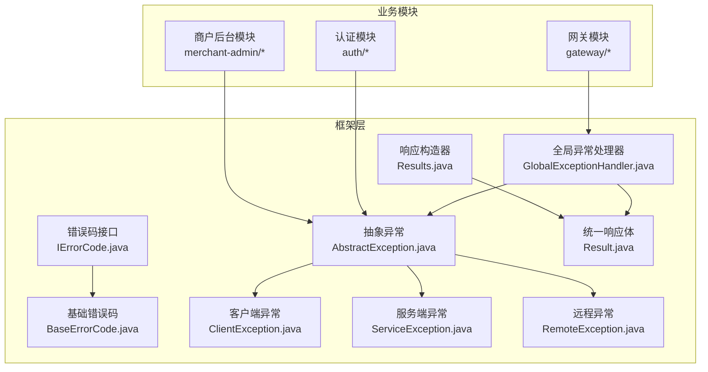
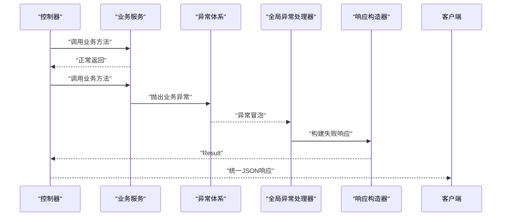
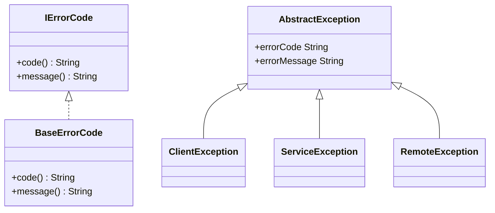
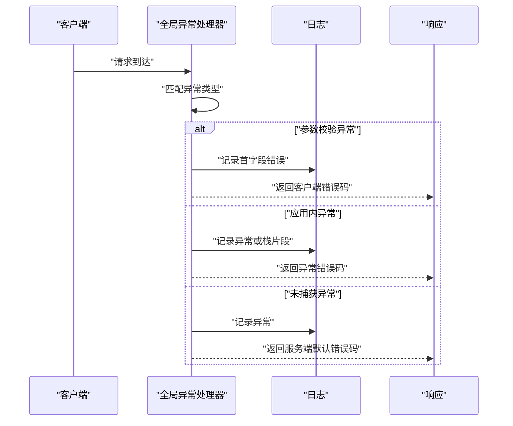
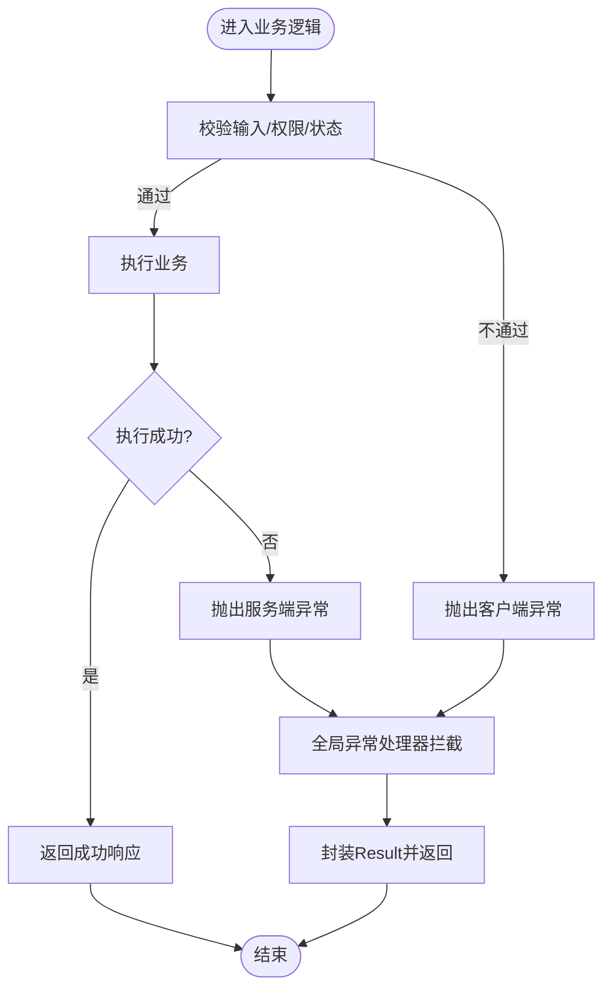
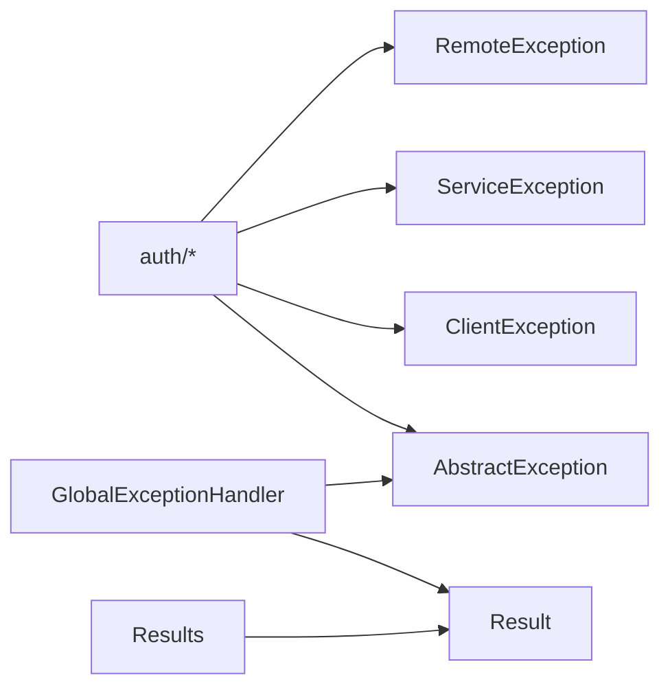

# 异常处理与错误码

<cite>
**本文引用的文件**
- [IErrorCode.java](file://framework/src/main/java/com/fengxin/errorcode/IErrorCode.java)
- [BaseErrorCode.java](file://framework/src/main/java/com/fengxin/errorcode/BaseErrorCode.java)
- [AbstractException.java](file://framework/src/main/java/com/fengxin/exception/AbstractException.java)
- [ClientException.java](file://framework/src/main/java/com/fengxin/exception/ClientException.java)
- [ServiceException.java](file://framework/src/main/java/com/fengxin/exception/ServiceException.java)
- [RemoteException.java](file://framework/src/main/java/com/fengxin/exception/RemoteException.java)
- [GlobalExceptionHandler.java](file://framework/src/main/java/com/fengxin/web/GlobalExceptionHandler.java)
- [Result.java](file://framework/src/main/java/com/fengxin/web/Result.java)
- [Results.java](file://framework/src/main/java/com/fengxin/web/Results.java)
- [UserErrorCodeEnum.java](file://auth/src/main/java/com/fengxin/maplecoupon/auth/common/enums/UserErrorCodeEnum.java)
- [UserServiceImpl.java](file://auth/src/main/java/com/fengxin/maplecoupon/auth/service/impl/UserServiceImpl.java)
- [logback-spring.xml（网关）](file://gateway/src/test/logback-spring.xml)
- [LogRecordStrategy.java](file://merchant-admin/src/main/java/com/fengxin/maplecoupon/merchantadmin/service/basic/log/LogRecordStrategy.java)
- [LogRecordStrategyFactory.java](file://merchant-admin/src/main/java/com/fengxin/maplecoupon/merchantadmin/service/basic/log/LogRecordStrategyFactory.java)
- [CouponTemplateLogSave.java](file://merchant-admin/src/main/java/com/fengxin/maplecoupon/merchantadmin/service/handler/log/CouponTemplateLogSave.java)
</cite>

## 目录
1. [引言](#引言)
2. [项目结构](#项目结构)
3. [核心组件](#核心组件)
4. [架构总览](#架构总览)
5. [详细组件分析](#详细组件分析)
6. [依赖分析](#依赖分析)
7. [性能考虑](#性能考虑)
8. [故障排查指南](#故障排查指南)
9. [结论](#结论)
10. [附录](#附录)

## 引言
本指南面向MapleCoupon项目的开发与运维团队，系统性阐述异常处理与错误码的设计与落地实践。内容覆盖异常体系设计原则、异常分类与继承关系、全局异常处理器机制、业务异常分类管理、错误码命名与范围分配、版本管理策略、国际化处理建议、异常日志最佳实践，以及常见异常场景（网络异常、数据库异常、业务规则异常）的处理示例。

## 项目结构
MapleCoupon采用“框架层-业务模块”的分层组织方式：
- 框架层（framework）：统一提供错误码接口与实现、异常基类与子类、全局异常处理器、统一响应体与构造器。
- 业务模块（auth、distribution、engine、merchant-admin、settlement、gateway等）：在各自领域内使用框架提供的异常与错误码，并在服务实现中抛出具体异常。

图表来源
- [IErrorCode.java:1-21](file://framework/src/main/java/com/fengxin/errorcode/IErrorCode.java#L1-L21)
- [BaseErrorCode.java:1-54](file://framework/src/main/java/com/fengxin/errorcode/BaseErrorCode.java#L1-L54)
- [AbstractException.java:1-29](file://framework/src/main/java/com/fengxin/exception/AbstractException.java#L1-L29)
- [ClientException.java:1-38](file://framework/src/main/java/com/fengxin/exception/ClientException.java#L1-L38)
- [ServiceException.java:1-38](file://framework/src/main/java/com/fengxin/exception/ServiceException.java#L1-L38)
- [RemoteException.java:1-38](file://framework/src/main/java/com/fengxin/exception/RemoteException.java#L1-L38)
- [GlobalExceptionHandler.java:1-78](file://framework/src/main/java/com/fengxin/web/GlobalExceptionHandler.java#L1-L78)
- [Result.java:1-47](file://framework/src/main/java/com/fengxin/web/Result.java#L1-L47)
- [Results.java:1-67](file://framework/src/main/java/com/fengxin/web/Results.java#L1-L67)

章节来源
- [IErrorCode.java:1-21](file://framework/src/main/java/com/fengxin/errorcode/IErrorCode.java#L1-L21)
- [BaseErrorCode.java:1-54](file://framework/src/main/java/com/fengxin/errorcode/BaseErrorCode.java#L1-L54)
- [AbstractException.java:1-29](file://framework/src/main/java/com/fengxin/exception/AbstractException.java#L1-L29)
- [ClientException.java:1-38](file://framework/src/main/java/com/fengxin/exception/ClientException.java#L1-L38)
- [ServiceException.java:1-38](file://framework/src/main/java/com/fengxin/exception/ServiceException.java#L1-L38)
- [RemoteException.java:1-38](file://framework/src/main/java/com/fengxin/exception/RemoteException.java#L1-L38)
- [GlobalExceptionHandler.java:1-78](file://framework/src/main/java/com/fengxin/web/GlobalExceptionHandler.java#L1-L78)
- [Result.java:1-47](file://framework/src/main/java/com/fengxin/web/Result.java#L1-L47)
- [Results.java:1-67](file://framework/src/main/java/com/fengxin/web/Results.java#L1-L67)

## 核心组件
- 错误码接口与基础错误码
  - IErrorCode：定义错误码与错误信息的统一接口。
  - BaseErrorCode：平台级基础错误码枚举，覆盖客户端错误、服务端错误、远程错误等一级与二级错误域。
- 异常体系
  - AbstractException：抽象异常基类，统一承载errorCode与errorMessage。
  - ClientException、ServiceException、RemoteException：分别对应客户端输入错误、服务端执行错误、远程调用错误。
- 全局异常处理器
  - GlobalExceptionHandler：拦截参数校验异常、应用内异常与未捕获异常，统一输出Result响应。
- 统一响应体
  - Result：统一的响应载体，包含code、message、data与success判定。
  - Results：响应构造器，提供success/failure的便捷方法。

章节来源
- [IErrorCode.java:1-21](file://framework/src/main/java/com/fengxin/errorcode/IErrorCode.java#L1-L21)
- [BaseErrorCode.java:1-54](file://framework/src/main/java/com/fengxin/errorcode/BaseErrorCode.java#L1-L54)
- [AbstractException.java:1-29](file://framework/src/main/java/com/fengxin/exception/AbstractException.java#L1-L29)
- [ClientException.java:1-38](file://framework/src/main/java/com/fengxin/exception/ClientException.java#L1-L38)
- [ServiceException.java:1-38](file://framework/src/main/java/com/fengxin/exception/ServiceException.java#L1-L38)
- [RemoteException.java:1-38](file://framework/src/main/java/com/fengxin/exception/RemoteException.java#L1-L38)
- [GlobalExceptionHandler.java:1-78](file://framework/src/main/java/com/fengxin/web/GlobalExceptionHandler.java#L1-L78)
- [Result.java:1-47](file://framework/src/main/java/com/fengxin/web/Result.java#L1-L47)
- [Results.java:1-67](file://framework/src/main/java/com/fengxin/web/Results.java#L1-L67)

## 架构总览
下图展示从控制器到异常处理与响应的完整链路，体现框架层对业务模块的统一支撑。

图表来源
- [GlobalExceptionHandler.java:1-78](file://framework/src/main/java/com/fengxin/web/GlobalExceptionHandler.java#L1-L78)
- [Results.java:1-67](file://framework/src/main/java/com/fengxin/web/Results.java#L1-L67)
- [Result.java:1-47](file://framework/src/main/java/com/fengxin/web/Result.java#L1-L47)

## 详细组件分析

### 异常体系与继承关系
- 设计原则
  - 分层清晰：客户端、服务端、远程三类异常分别对应不同责任边界。
  - 可扩展：通过IErrorCode与BaseErrorCode抽象，业务模块可自定义错误码并复用框架异常类型。
  - 语义明确：异常携带errorCode与errorMessage，便于前端识别与提示。
- 类关系图

图表来源
- [IErrorCode.java:1-21](file://framework/src/main/java/com/fengxin/errorcode/IErrorCode.java#L1-L21)
- [BaseErrorCode.java:1-54](file://framework/src/main/java/com/fengxin/errorcode/BaseErrorCode.java#L1-L54)
- [AbstractException.java:1-29](file://framework/src/main/java/com/fengxin/exception/AbstractException.java#L1-L29)
- [ClientException.java:1-38](file://framework/src/main/java/com/fengxin/exception/ClientException.java#L1-L38)
- [ServiceException.java:1-38](file://framework/src/main/java/com/fengxin/exception/ServiceException.java#L1-L38)
- [RemoteException.java:1-38](file://framework/src/main/java/com/fengxin/exception/RemoteException.java#L1-L38)

章节来源
- [IErrorCode.java:1-21](file://framework/src/main/java/com/fengxin/errorcode/IErrorCode.java#L1-L21)
- [BaseErrorCode.java:1-54](file://framework/src/main/java/com/fengxin/errorcode/BaseErrorCode.java#L1-L54)
- [AbstractException.java:1-29](file://framework/src/main/java/com/fengxin/exception/AbstractException.java#L1-L29)
- [ClientException.java:1-38](file://framework/src/main/java/com/fengxin/exception/ClientException.java#L1-L38)
- [ServiceException.java:1-38](file://framework/src/main/java/com/fengxin/exception/ServiceException.java#L1-L38)
- [RemoteException.java:1-38](file://framework/src/main/java/com/fengxin/exception/RemoteException.java#L1-L38)

### 全局异常处理器机制
- 捕获范围
  - 参数校验异常：MethodArgumentNotValidException，提取首个字段错误信息，记录日志并返回客户端错误码。
  - 应用内异常：AbstractException及其子类，优先使用异常自身携带的errorCode与errorMessage；若无cause则截取栈顶若干行用于定位。
  - 未捕获异常：Throwable，统一返回服务端默认错误码。
- 响应格式化
  - 使用Results.failure系列方法，将错误码与错误信息封装为Result对象，供前端统一消费。

图表来源
- [GlobalExceptionHandler.java:1-78](file://framework/src/main/java/com/fengxin/web/GlobalExceptionHandler.java#L1-L78)
- [Results.java:1-67](file://framework/src/main/java/com/fengxin/web/Results.java#L1-L67)

章节来源
- [GlobalExceptionHandler.java:1-78](file://framework/src/main/java/com/fengxin/web/GlobalExceptionHandler.java#L1-L78)
- [Results.java:1-67](file://framework/src/main/java/com/fengxin/web/Results.java#L1-L67)

### 业务异常分类管理
- 客户端异常（ClientException）
  - 场景：参数非法、鉴权失败、业务规则不满足等。
  - 处理：抛出ClientException，由全局异常处理器返回客户端错误码。
- 服务端异常（ServiceException）
  - 场景：服务内部执行失败、资源不可用、事务回滚等。
  - 处理：抛出ServiceException，返回服务端默认错误码。
- 远程异常（RemoteException）
  - 场景：下游服务不可达、超时、返回异常等。
  - 处理：抛出RemoteException，返回远程错误码。

图表来源
- [ClientException.java:1-38](file://framework/src/main/java/com/fengxin/exception/ClientException.java#L1-L38)
- [ServiceException.java:1-38](file://framework/src/main/java/com/fengxin/exception/ServiceException.java#L1-L38)
- [RemoteException.java:1-38](file://framework/src/main/java/com/fengxin/exception/RemoteException.java#L1-L38)
- [GlobalExceptionHandler.java:1-78](file://framework/src/main/java/com/fengxin/web/GlobalExceptionHandler.java#L1-L78)

章节来源
- [ClientException.java:1-38](file://framework/src/main/java/com/fengxin/exception/ClientException.java#L1-L38)
- [ServiceException.java:1-38](file://framework/src/main/java/com/fengxin/exception/ServiceException.java#L1-L38)
- [RemoteException.java:1-38](file://framework/src/main/java/com/fengxin/exception/RemoteException.java#L1-L38)
- [GlobalExceptionHandler.java:1-78](file://framework/src/main/java/com/fengxin/web/GlobalExceptionHandler.java#L1-L78)

### 错误码设计规范
- 命名规则
  - 采用“四位前缀+六位编号”的形式，前缀表示一级错误域，后六位表示二级错误域与具体错误。
  - 示例：客户端错误以A开头，服务端错误以B开头，远程错误以C开头。
- 范围分配
  - 客户端错误（A000001起）：覆盖输入校验、鉴权失败、业务规则不满足等。
  - 服务端错误（B000001起）：覆盖执行失败、超时、资源不可用等。
  - 远程错误（C000001起）：覆盖下游不可达、超时、返回异常等。
- 版本管理
  - 错误码变更遵循“向后兼容”原则，新增错误码不破坏既有code映射；废弃错误码需标注迁移路径并在文档中标注。
- 业务模块扩展
  - 业务模块可定义独立的错误码枚举，但需遵守统一前缀与编号段落，避免冲突。

章节来源
- [BaseErrorCode.java:1-54](file://framework/src/main/java/com/fengxin/errorcode/BaseErrorCode.java#L1-L54)
- [UserErrorCodeEnum.java:1-36](file://auth/src/main/java/com/fengxin/maplecoupon/auth/common/enums/UserErrorCodeEnum.java#L1-L36)

### 国际化处理（建议）
- 多语言支持
  - 在Result中保留message字段，由前端根据code映射到本地化文案。
  - 对于动态参数（如用户名、字段名），在message中预留占位符，服务端按固定顺序填充。
- 本地化配置
  - 建议在前端侧维护多语言字典，后端仅负责返回code与必要参数，避免在后端硬编码多语言文案。

[本节为通用实践建议，不直接分析具体文件]

### 异常日志记录最佳实践
- 日志格式
  - 统一包含请求方法、URL（含查询参数）、异常类型与关键信息；必要时输出栈片段（限制行数）。
- 敏感信息脱敏
  - 对用户名、手机号、Token等敏感字段进行脱敏处理后再写入日志。
- 性能影响控制
  - 控制栈片段输出长度，避免大对象序列化；对高频异常采用采样记录。
- 环境差异
  - 开发环境可输出更详细的栈信息；生产环境严格限制日志级别与字段。

章节来源
- [GlobalExceptionHandler.java:1-78](file://framework/src/main/java/com/fengxin/web/GlobalExceptionHandler.java#L1-L78)
- [logback-spring.xml（网关）:1-54](file://gateway/src/test/logback-spring.xml#L1-L54)

### 常见异常场景处理示例
- 网络异常
  - 表现：远程调用超时、连接失败。
  - 处理：抛出RemoteException，由全局异常处理器返回远程错误码；前端提示重试或稍后重试。
- 数据库异常
  - 表现：主键冲突、唯一索引冲突、连接池耗尽。
  - 处理：捕获重复键异常并抛出ClientException或ServiceException，视场景而定；记录异常并返回相应错误码。
- 业务规则异常
  - 表现：用户不存在、用户名已存在、登录状态异常。
  - 处理：在业务实现中显式判断并抛出ClientException，携带业务错误码与友好提示。

章节来源
- [UserServiceImpl.java:1-159](file://auth/src/main/java/com/fengxin/maplecoupon/auth/service/impl/UserServiceImpl.java#L1-L159)
- [ClientException.java:1-38](file://framework/src/main/java/com/fengxin/exception/ClientException.java#L1-L38)
- [ServiceException.java:1-38](file://framework/src/main/java/com/fengxin/exception/ServiceException.java#L1-L38)
- [RemoteException.java:1-38](file://framework/src/main/java/com/fengxin/exception/RemoteException.java#L1-L38)

## 依赖分析
- 组件耦合
  - 业务模块仅依赖框架层的异常与错误码接口，不直接依赖具体实现，降低耦合度。
  - 全局异常处理器集中处理异常并统一输出，提升一致性与可观测性。
- 外部依赖
  - Spring MVC异常处理机制与日志框架（如Logback）配合使用，确保异常拦截与日志输出稳定可靠。

图表来源
- [UserServiceImpl.java:1-159](file://auth/src/main/java/com/fengxin/maplecoupon/auth/service/impl/UserServiceImpl.java#L1-L159)
- [AbstractException.java:1-29](file://framework/src/main/java/com/fengxin/exception/AbstractException.java#L1-L29)
- [ClientException.java:1-38](file://framework/src/main/java/com/fengxin/exception/ClientException.java#L1-L38)
- [ServiceException.java:1-38](file://framework/src/main/java/com/fengxin/exception/ServiceException.java#L1-L38)
- [RemoteException.java:1-38](file://framework/src/main/java/com/fengxin/exception/RemoteException.java#L1-L38)
- [GlobalExceptionHandler.java:1-78](file://framework/src/main/java/com/fengxin/web/GlobalExceptionHandler.java#L1-L78)
- [Results.java:1-67](file://framework/src/main/java/com/fengxin/web/Results.java#L1-L67)
- [Result.java:1-47](file://framework/src/main/java/com/fengxin/web/Result.java#L1-L47)

章节来源
- [UserServiceImpl.java:1-159](file://auth/src/main/java/com/fengxin/maplecoupon/auth/service/impl/UserServiceImpl.java#L1-L159)
- [GlobalExceptionHandler.java:1-78](file://framework/src/main/java/com/fengxin/web/GlobalExceptionHandler.java#L1-L78)
- [Results.java:1-67](file://framework/src/main/java/com/fengxin/web/Results.java#L1-L67)
- [Result.java:1-47](file://framework/src/main/java/com/fengxin/web/Result.java#L1-L47)

## 性能考虑
- 异常开销控制
  - 避免在热路径频繁抛出异常；对可预期的边界条件使用返回值或状态码标识。
  - 对异常栈输出进行限制，仅在必要时记录完整栈。
- 日志性能
  - 使用异步日志或限流策略，避免异常风暴导致磁盘IO与GC压力。
- 响应体序列化
  - Result对象结构简单，序列化开销低；避免在data中传递大对象。

[本节提供通用指导，不直接分析具体文件]

## 故障排查指南
- 快速定位
  - 查看全局异常处理器的日志输出，确认异常类型与错误码来源。
  - 对于未捕获异常，检查堆栈片段与异常根因。
- 常见问题
  - 参数校验失败：检查请求体与校验注解是否匹配，确认首个字段错误信息。
  - 业务异常：核对业务逻辑分支与错误码映射，确认是否正确抛出ClientException/ServiceException/RemoteException。
  - 日志缺失：确认日志级别与Appender配置，确保ERROR级别日志被采集。

章节来源
- [GlobalExceptionHandler.java:1-78](file://framework/src/main/java/com/fengxin/web/GlobalExceptionHandler.java#L1-L78)
- [logback-spring.xml（网关）:1-54](file://gateway/src/test/logback-spring.xml#L1-L54)

## 结论
MapleCoupon的异常处理与错误码体系通过框架层统一抽象与集中治理，实现了跨模块的一致性与可维护性。建议在后续迭代中持续完善错误码命名与版本管理流程，强化国际化与日志脱敏策略，并在高并发场景下进一步优化异常与日志的性能表现。

## 附录
- 错误码使用示例（路径）
  - [UserErrorCodeEnum.java:1-36](file://auth/src/main/java/com/fengxin/maplecoupon/auth/common/enums/UserErrorCodeEnum.java#L1-L36)
- 业务异常抛出示例（路径）
  - [UserServiceImpl.java:1-159](file://auth/src/main/java/com/fengxin/maplecoupon/auth/service/impl/UserServiceImpl.java#L1-L159)
- 日志策略参考（路径）
  - [logback-spring.xml（网关）:1-54](file://gateway/src/test/logback-spring.xml#L1-L54)
- 日志记录策略（路径）
  - [LogRecordStrategy.java:1-13](file://merchant-admin/src/main/java/com/fengxin/maplecoupon/merchantadmin/service/basic/log/LogRecordStrategy.java#L1-L13)
  - [LogRecordStrategyFactory.java:1-29](file://merchant-admin/src/main/java/com/fengxin/maplecoupon/merchantadmin/service/basic/log/LogRecordStrategyFactory.java#L1-L29)
  - [CouponTemplateLogSave.java:1-48](file://merchant-admin/src/main/java/com/fengxin/maplecoupon/merchantadmin/service/handler/log/CouponTemplateLogSave.java#L1-L48)