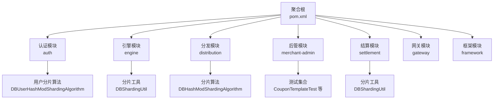
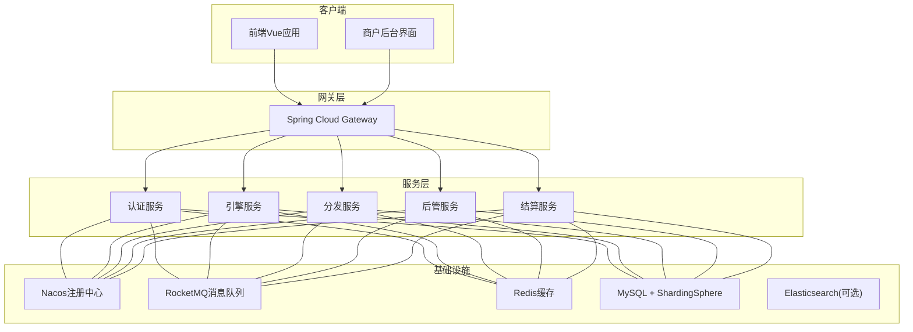
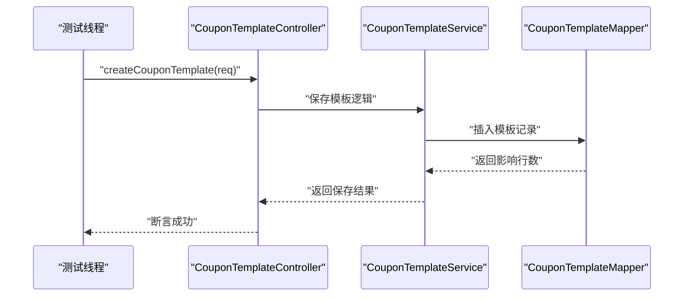
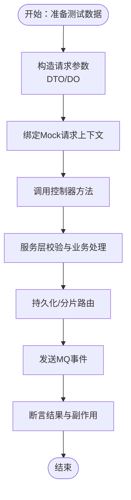
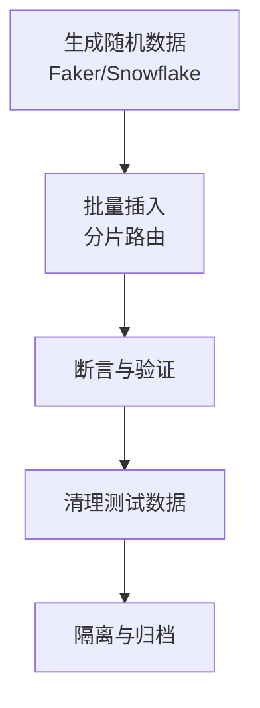
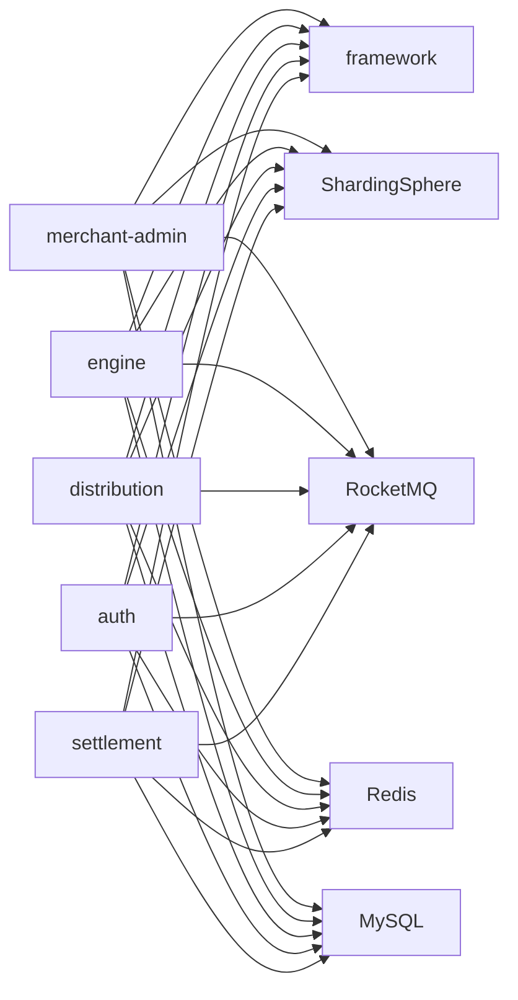

# 测试策略与实践

<cite>
**本文引用的文件**
- [README.md](file://README.md)
- [pom.xml](file://pom.xml)
- [merchant-admin/pom.xml](file://merchant-admin/pom.xml)
- [merchant-admin/src/test/java/com/fengxin/test/CouponTemplateTest.java](file://merchant-admin/src/test/java/com/fengxin/test/CouponTemplateTest.java)
- [merchant-admin/src/test/java/com/fengxin/test/MockCouponTemplateDataTests.java](file://merchant-admin/src/test/java/com/fengxin/test/MockCouponTemplateDataTests.java)
- [merchant-admin/src/test/java/com/fengxin/test/FakerTest.java](file://merchant-admin/src/test/java/com/fengxin/test/FakerTest.java)
- [merchant-admin/src/test/java/com/fengxin/test/ExcelGenerateTests.java](file://merchant-admin/src/test/java/com/fengxin/test/ExcelGenerateTests.java)
- [merchant-admin/src/test/java/com/fengxin/test/CouponTemplateCreateDuplicateSubmitTests.java](file://merchant-admin/src/test/java/com/fengxin/test/CouponTemplateCreateDuplicateSubmitTests.java)
- [engine/src/main/java/com/fengxin/maplecoupon/engine/dao/sharding/DBShardingUtil.java](file://engine/src/main/java/com/fengxin/maplecoupon/engine/dao/sharding/DBShardingUtil.java)
- [settlement/src/main/java/com/fengxin/maplecoupon/settlement/dao/sharding/DBShardingUtil.java](file://settlement/src/main/java/com/fengxin/maplecoupon/settlement/dao/sharding/DBShardingUtil.java)
- [auth/src/main/java/com/fengxin/maplecoupon/auth/dao/sharding/DBUserHashModShardingAlgorithm.java](file://auth/src/main/java/com/fengxin/maplecoupon/auth/dao/sharding/DBUserHashModShardingAlgorithm.java)
- [distribution/src/main/java/com/fengxin/maplecoupon/distribution/dao/sharding/DBHashModShardingAlgorithm.java](file://distribution/src/main/java/com/fengxin/maplecoupon/distribution/dao/sharding/DBHashModShardingAlgorithm.java)
- [gateway/src/test/logback-spring.xml](file://gateway/src/test/logback-spring.xml)
</cite>

## 目录
1. [引言](#引言)
2. [项目结构](#项目结构)
3. [核心组件](#核心组件)
4. [架构总览](#架构总览)
5. [详细组件分析](#详细组件分析)
6. [依赖分析](#依赖分析)
7. [性能考虑](#性能考虑)
8. [故障排查指南](#故障排查指南)
9. [结论](#结论)
10. [附录](#附录)

## 引言
本指南面向MapleCoupon项目，提供覆盖单元测试、集成测试、性能测试、测试数据管理、自动化测试与CI/CD集成、覆盖率监控以及测试环境搭建与维护的完整测试策略与实践。项目采用多模块架构（auth、engine、distribution、merchant-admin、settlement、gateway、framework），并广泛使用Spring Boot、Spring Cloud Alibaba、ShardingSphere、RocketMQ、Redis、MySQL、EasyExcel、HuTool、FastJson2、MyBatis-Plus、XXL-Job等技术栈，测试策略需兼顾模块边界、分布式特性与高并发场景。

## 项目结构
MapleCoupon为多模块Maven工程，顶层聚合根统一管理版本与插件；各子模块包含独立的业务逻辑、DAO层、服务层、控制器与测试代码。测试主要集中在merchant-admin模块，涵盖单元测试、并发与重复提交测试、Mock数据生成与Excel导出测试等。

图示来源
- [pom.xml:17-34](file://pom.xml#L17-L34)
- [merchant-admin/pom.xml:13-23](file://merchant-admin/pom.xml#L13-L23)

章节来源
- [pom.xml:17-34](file://pom.xml#L17-L34)
- [merchant-admin/pom.xml:13-23](file://merchant-admin/pom.xml#L13-L23)

## 核心组件
- 认证模块（auth）：用户上下文传递、拦截器、枚举与常量、远程服务接口、控制器、DAO与分片策略。
- 引擎模块（engine）：优惠券模板与用户券的查询、提醒、延迟关闭、MQ事件处理与服务实现。
- 分发模块（distribution）：优惠券任务分发、MQ事件设计与生产者、Excel读写监听器、事务执行。
- 商户后管模块（merchant-admin）：优惠券模板与任务的创建、校验链、日志记录策略、定时任务与MQ交互。
- 结算模块（settlement）：优惠券查询、模板与用户券映射、分片工具。
- 网关模块（gateway）：请求过滤、Token校验、全局错误响应。
- 框架模块（framework）：全局异常、结果封装、幂等性配置、缓存与Web自动装配。

章节来源
- [README.md:1-10](file://README.md#L1-L10)
- [pom.xml:37-60](file://pom.xml#L37-L60)

## 架构总览
系统采用微服务架构，通过Spring Cloud Alibaba进行服务注册与发现，ShardingSphere实现数据库分片，RocketMQ承担异步消息与事件驱动，Redis用于缓存与幂等控制，MySQL承载主数据，EasyExcel与HuTool支撑批量与工具能力。

图示来源
- [README.md:4](file://README.md#L4)
- [pom.xml:61-182](file://pom.xml#L61-L182)

## 详细组件分析

### 单元测试设计原则与实践
- 测试用例编写规范
  - 使用@SpringBootTest注解加载ApplicationContext，确保依赖注入与Bean生命周期正确。
  - 使用Assert断言库进行结果验证，避免直接依赖打印输出。
  - 参数构造与业务规则应通过工具方法集中构建，保证测试可读性与复用性。
- Mock对象与断言最佳实践
  - 对于需要外部依赖的场景，优先使用Spring Test提供的Mock对象（如MockHttpServletRequest）与RequestContextHolder进行线程级绑定。
  - 对于复杂业务流程，可通过内部工具类或静态方法构造DTO/DO，减少对真实数据库的依赖。
- 并发与重复提交测试
  - 使用固定线程池并发触发控制器方法，验证幂等性与异常处理路径。
  - 在finally块中重置RequestAttributes，防止线程污染。

图示来源
- [merchant-admin/src/test/java/com/fengxin/test/CouponTemplateCreateDuplicateSubmitTests.java:32-69](file://merchant-admin/src/test/java/com/fengxin/test/CouponTemplateCreateDuplicateSubmitTests.java#L32-L69)
- [merchant-admin/src/test/java/com/fengxin/test/CouponTemplateTest.java:55-59](file://merchant-admin/src/test/java/com/fengxin/test/CouponTemplateTest.java#L55-L59)

章节来源
- [merchant-admin/src/test/java/com/fengxin/test/CouponTemplateTest.java:22-59](file://merchant-admin/src/test/java/com/fengxin/test/CouponTemplateTest.java#L22-L59)
- [merchant-admin/src/test/java/com/fengxin/test/CouponTemplateCreateDuplicateSubmitTests.java:24-69](file://merchant-admin/src/test/java/com/fengxin/test/CouponTemplateCreateDuplicateSubmitTests.java#L24-L69)

### 集成测试策略
- 微服务间接口测试
  - 使用@SpringBootTest加载服务上下文，结合Mock对象模拟HTTP请求，验证控制器行为与远程调用契约。
  - 对于跨服务操作（如后管创建模板后引擎侧的库存扣减与MQ事件），可在测试中构造最小化事件流，验证关键分支。
- 数据库测试
  - 利用ShardingSphere分片算法与分片工具，确保测试数据命中正确的数据源与表，避免跨库查询异常。
  - 对于分片键（如shopNumber、username）的分布均匀性，可通过构造大量样本并统计命中分布进行验证。
- 外部依赖测试
  - RocketMQ：通过事件发送与消费端监听验证消息可靠性与顺序性（可使用嵌入式或本地Broker进行测试）。
  - Redis：使用Redisson或本地Redis容器，验证缓存读写、布隆过滤与幂等控制。
  - 文件处理：EasyExcel读写测试，验证Excel格式、字段映射与大数据量写入性能。

图示来源
- [merchant-admin/src/test/java/com/fengxin/test/CouponTemplateCreateDuplicateSubmitTests.java:32-69](file://merchant-admin/src/test/java/com/fengxin/test/CouponTemplateCreateDuplicateSubmitTests.java#L32-L69)
- [engine/src/main/java/com/fengxin/maplecoupon/engine/dao/sharding/DBShardingUtil.java:27-29](file://engine/src/main/java/com/fengxin/maplecoupon/engine/dao/sharding/DBShardingUtil.java#L27-L29)
- [settlement/src/main/java/com/fengxin/maplecoupon/settlement/dao/sharding/DBShardingUtil.java:27-29](file://settlement/src/main/java/com/fengxin/maplecoupon/settlement/dao/sharding/DBShardingUtil.java#L27-L29)

章节来源
- [engine/src/main/java/com/fengxin/maplecoupon/engine/dao/sharding/DBShardingUtil.java:14-37](file://engine/src/main/java/com/fengxin/maplecoupon/engine/dao/sharding/DBShardingUtil.java#L14-L37)
- [settlement/src/main/java/com/fengxin/maplecoupon/settlement/dao/sharding/DBShardingUtil.java:14-37](file://settlement/src/main/java/com/fengxin/maplecoupon/settlement/dao/sharding/DBShardingUtil.java#L14-L37)
- [auth/src/main/java/com/fengxin/maplecoupon/auth/dao/sharding/DBUserHashModShardingAlgorithm.java:21-34](file://auth/src/main/java/com/fengxin/maplecoupon/auth/dao/sharding/DBUserHashModShardingAlgorithm.java#L21-L34)
- [distribution/src/main/java/com/fengxin/maplecoupon/distribution/dao/sharding/DBHashModShardingAlgorithm.java:20-34](file://distribution/src/main/java/com/fengxin/maplecoupon/distribution/dao/sharding/DBHashModShardingAlgorithm.java#L20-L34)

### 性能测试方法论
- 压力测试
  - 使用并发线程池触发控制器或服务方法，逐步提升并发度与请求频率，观察响应时间、吞吐量与错误率。
  - 关注分片热点与数据库连接池瓶颈，定位跨库查询与写入延迟。
- 负载测试
  - 在稳定负载下长时间运行，监控GC、堆内存、线程池饱和与MQ积压情况。
- 并发测试
  - 针对重复提交与幂等性，构造高并发场景，验证幂等注解与布隆过滤器的有效性。
- 性能指标
  - RT（响应时间）、TPS（每秒事务数）、错误率、分片命中率、MQ延迟与堆积量。

章节来源
- [merchant-admin/src/test/java/com/fengxin/test/CouponTemplateCreateDuplicateSubmitTests.java:34-65](file://merchant-admin/src/test/java/com/fengxin/test/CouponTemplateCreateDuplicateSubmitTests.java#L34-L65)

### 测试数据管理
- 测试数据生成
  - 使用Java Faker生成随机中文姓名、手机号、邮箱等，保障测试数据多样性与合规性。
  - 使用Snowflake生成唯一ID，避免重复键冲突。
- 测试数据清理
  - 在测试类中增加清理步骤，删除临时数据或回滚事务（若使用事务型测试）。
- 测试数据隔离
  - 通过分片键（如shopNumber、username）与命名空间（库/表前缀）隔离不同测试会话。
  - 使用独立的测试数据库或Schema，避免与生产数据混淆。

图示来源
- [merchant-admin/src/test/java/com/fengxin/test/FakerTest.java:18-33](file://merchant-admin/src/test/java/com/fengxin/test/FakerTest.java#L18-L33)
- [merchant-admin/src/test/java/com/fengxin/test/MockCouponTemplateDataTests.java:50-63](file://merchant-admin/src/test/java/com/fengxin/test/MockCouponTemplateDataTests.java#L50-L63)

章节来源
- [merchant-admin/src/test/java/com/fengxin/test/FakerTest.java:16-33](file://merchant-admin/src/test/java/com/fengxin/test/FakerTest.java#L16-L33)
- [merchant-admin/src/test/java/com/fengxin/test/MockCouponTemplateDataTests.java:26-63](file://merchant-admin/src/test/java/com/fengxin/test/MockCouponTemplateDataTests.java#L26-L63)
- [merchant-admin/src/test/java/com/fengxin/test/ExcelGenerateTests.java:24-77](file://merchant-admin/src/test/java/com/fengxin/test/ExcelGenerateTests.java#L24-L77)

### 自动化测试与CI/CD集成
- 单元与集成测试
  - 在各模块的pom.xml中引入spring-boot-starter-test，确保测试依赖一致。
  - 使用JUnit 5注解组织测试，结合Assert断言库进行结果验证。
- CI/CD集成
  - 在流水线中执行mvn test，收集测试报告（如Surefire或Failsafe报告），并上传至制品库。
  - 配置测试日志输出（如logback-spring.xml），便于问题定位。
- 测试报告
  - 使用Maven Surefire/Failsafe插件生成XML报告，结合CI工具（如Jenkins/JUnit插件）生成趋势图与失败详情。

章节来源
- [merchant-admin/pom.xml:19-23](file://merchant-admin/pom.xml#L19-L23)
- [gateway/src/test/logback-spring.xml](file://gateway/src/test/logback-spring.xml)

### 测试覆盖率监控
- 覆盖率指标
  - 行覆盖率、分支覆盖率、指令覆盖率与类覆盖率，目标建议：主线逻辑≥80%，关键路径≥90%。
- 改进策略
  - 针对未覆盖分支补充边界条件与异常场景测试。
  - 对于高风险区域（幂等、分片、MQ事件）增加专项测试用例。
  - 使用JaCoCo或SonarQube集成覆盖率报告，持续跟踪趋势。

章节来源
- [pom.xml:185-193](file://pom.xml#L185-L193)

### 测试环境搭建与维护
- 测试数据库
  - 使用独立的MySQL实例或Docker容器，配置ShardingSphere分片规则，确保测试数据与生产隔离。
- 缓存与消息
  - 使用本地Redis容器与RocketMQ Broker，或嵌入式/本地模式，降低外部依赖复杂度。
- 日志与可观测性
  - 在测试环境中启用详细日志（如logback-spring.xml），便于快速定位问题。
- 资源管理
  - 通过Docker Compose或Helm Chart编排测试环境，统一版本与配置，便于复制与回收。

章节来源
- [gateway/src/test/logback-spring.xml](file://gateway/src/test/logback-spring.xml)

## 依赖分析
- 模块间依赖
  - merchant-admin依赖framework提供全局异常、结果封装与幂等配置。
  - 各模块均引入ShardingSphere与MyBatis-Plus，测试时需关注分片算法与SQL路由。
- 外部依赖
  - RocketMQ、Redis、MySQL、EasyExcel、HuTool等均为测试与生产共用组件，测试中应明确隔离策略。

图示来源
- [pom.xml:61-182](file://pom.xml#L61-L182)
- [merchant-admin/pom.xml:29-98](file://merchant-admin/pom.xml#L29-L98)

章节来源
- [pom.xml:61-182](file://pom.xml#L61-L182)
- [merchant-admin/pom.xml:29-98](file://merchant-admin/pom.xml#L29-L98)

## 性能考虑
- 分片热点规避
  - 通过合理的分片键选择与算法参数，避免热点库表；测试中模拟高并发写入，观察分片命中分布。
- 缓存与布隆过滤
  - 验证Redis缓存命中率与布隆过滤误判率，评估缓存预热与失效策略。
- MQ吞吐与堆积
  - 在高并发场景下监控MQ消息积压与消费延迟，优化消费者并发与批处理大小。
- 数据库连接池
  - 监控连接池使用率与超时，调整最大连接数与超时阈值以适配峰值流量。

章节来源
- [engine/src/main/java/com/fengxin/maplecoupon/engine/dao/sharding/DBShardingUtil.java:27-29](file://engine/src/main/java/com/fengxin/maplecoupon/engine/dao/sharding/DBShardingUtil.java#L27-L29)
- [settlement/src/main/java/com/fengxin/maplecoupon/settlement/dao/sharding/DBShardingUtil.java:27-29](file://settlement/src/main/java/com/fengxin/maplecoupon/settlement/dao/sharding/DBShardingUtil.java#L27-L29)
- [auth/src/main/java/com/fengxin/maplecoupon/auth/dao/sharding/DBUserHashModShardingAlgorithm.java:28-34](file://auth/src/main/java/com/fengxin/maplecoupon/auth/dao/sharding/DBUserHashModShardingAlgorithm.java#L28-L34)
- [distribution/src/main/java/com/fengxin/maplecoupon/distribution/dao/sharding/DBHashModShardingAlgorithm.java:28-34](file://distribution/src/main/java/com/fengxin/maplecoupon/distribution/dao/sharding/DBHashModShardingAlgorithm.java#L28-L34)

## 故障排查指南
- 控制器并发异常
  - 若出现线程上下文丢失导致的空指针，检查是否正确绑定与清理RequestAttributes。
- 分片路由异常
  - 当出现跨库查询失败或数据未命中，核对分片键与分片算法配置，确认测试数据的分片键范围。
- MQ消费异常
  - 检查消息序列化与反序列化一致性，确认消费者组与Topic配置，必要时开启本地Broker进行复现。
- 缓存与幂等
  - 验证布隆过滤器初始化与误判率，检查Redis键空间与过期策略。

章节来源
- [merchant-admin/src/test/java/com/fengxin/test/CouponTemplateCreateDuplicateSubmitTests.java:50-62](file://merchant-admin/src/test/java/com/fengxin/test/CouponTemplateCreateDuplicateSubmitTests.java#L50-L62)
- [engine/src/main/java/com/fengxin/maplecoupon/engine/dao/sharding/DBShardingUtil.java:19-29](file://engine/src/main/java/com/fengxin/maplecoupon/engine/dao/sharding/DBShardingUtil.java#L19-L29)
- [settlement/src/main/java/com/fengxin/maplecoupon/settlement/dao/sharding/DBShardingUtil.java:19-29](file://settlement/src/main/java/com/fengxin/maplecoupon/settlement/dao/sharding/DBShardingUtil.java#L19-L29)

## 结论
MapleCoupon的测试体系应围绕多模块架构与分布式特性展开，重点覆盖单元测试的严谨性、集成测试的端到端闭环、性能测试的稳定性与可扩展性、测试数据的生成与隔离、自动化测试与CI/CD的融合、覆盖率的持续改进，以及测试环境的标准化与可维护性。通过上述策略与实践，可显著提升系统的质量与交付效率。

## 附录
- 测试清单
  - 单元测试：控制器、服务、DAO、工具类
  - 集成测试：跨服务接口、分片路由、MQ事件、缓存与幂等
  - 性能测试：并发、压力、负载、分片热点
  - 数据管理：生成、清理、隔离、Excel导出
  - 自动化与报告：Maven测试、报告上传、覆盖率
  - 环境：数据库、缓存、消息、日志