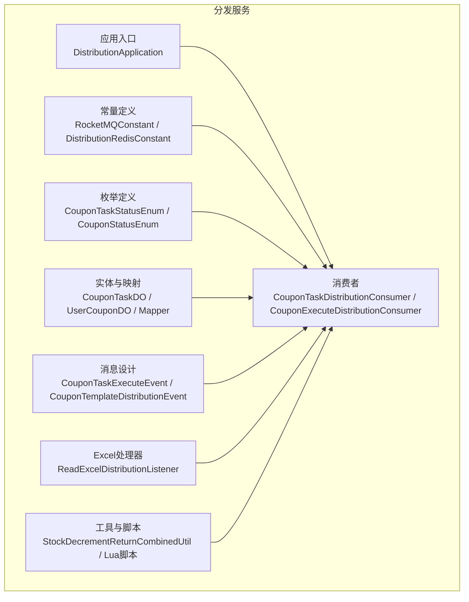
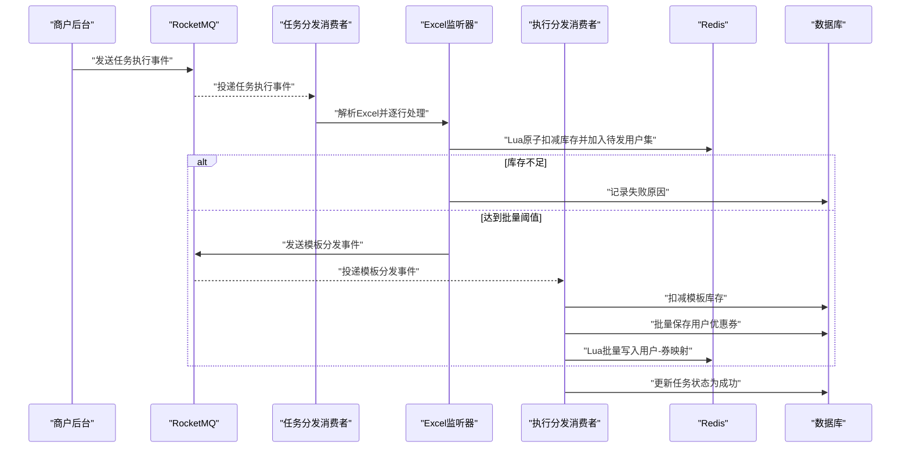
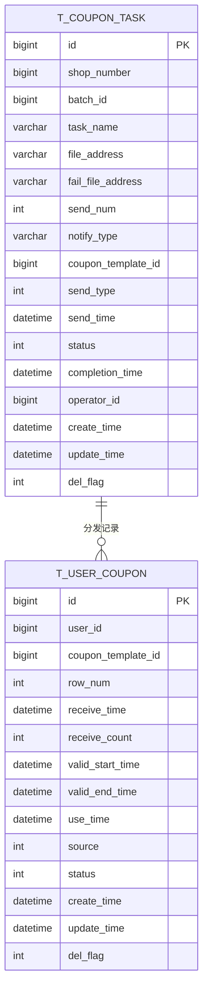
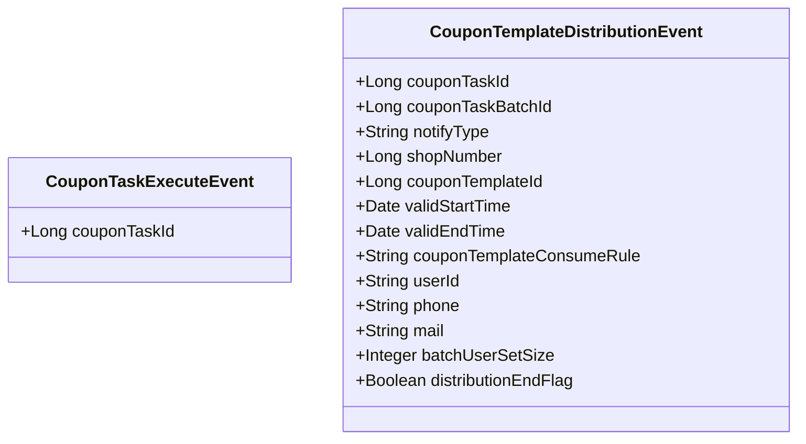
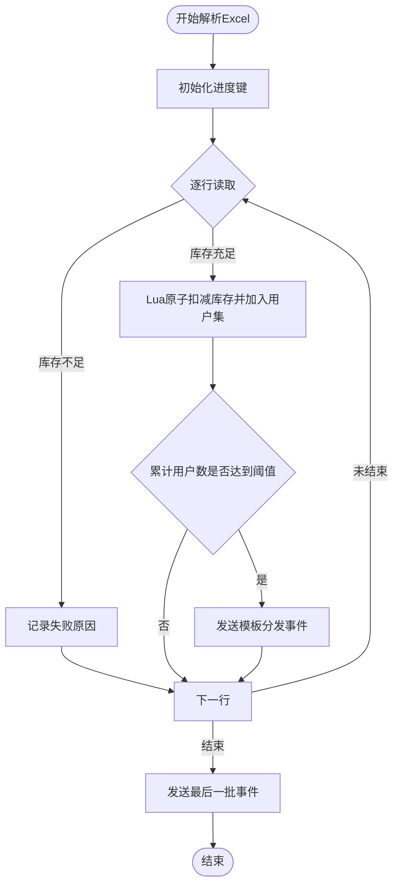
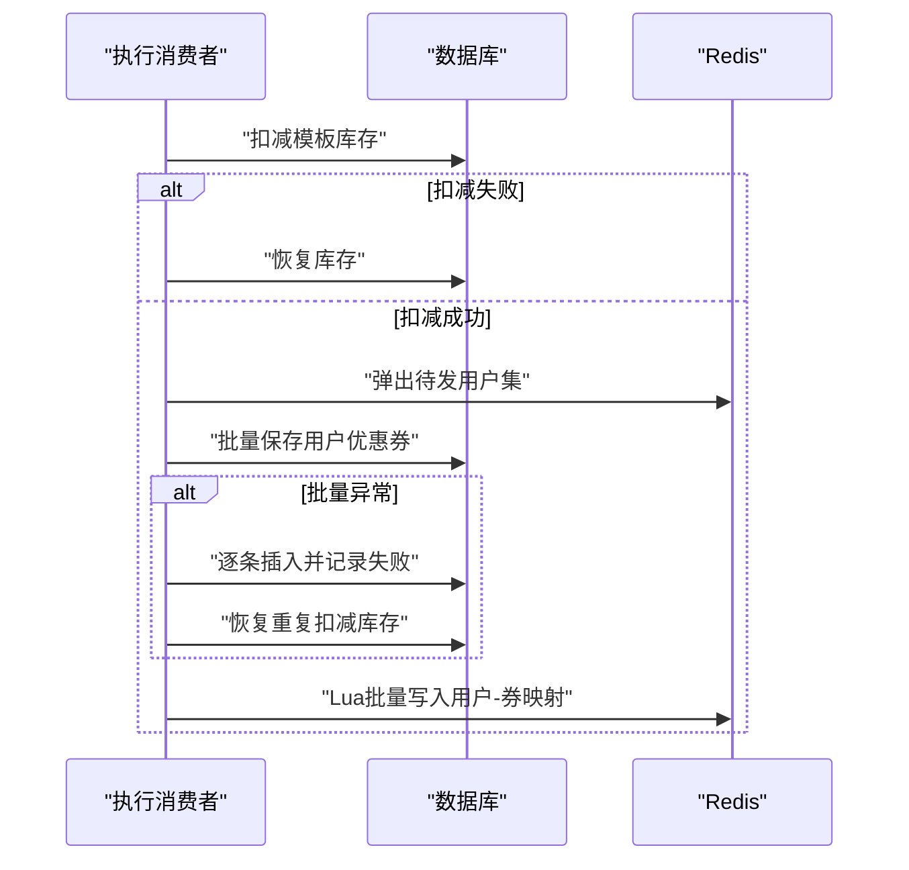
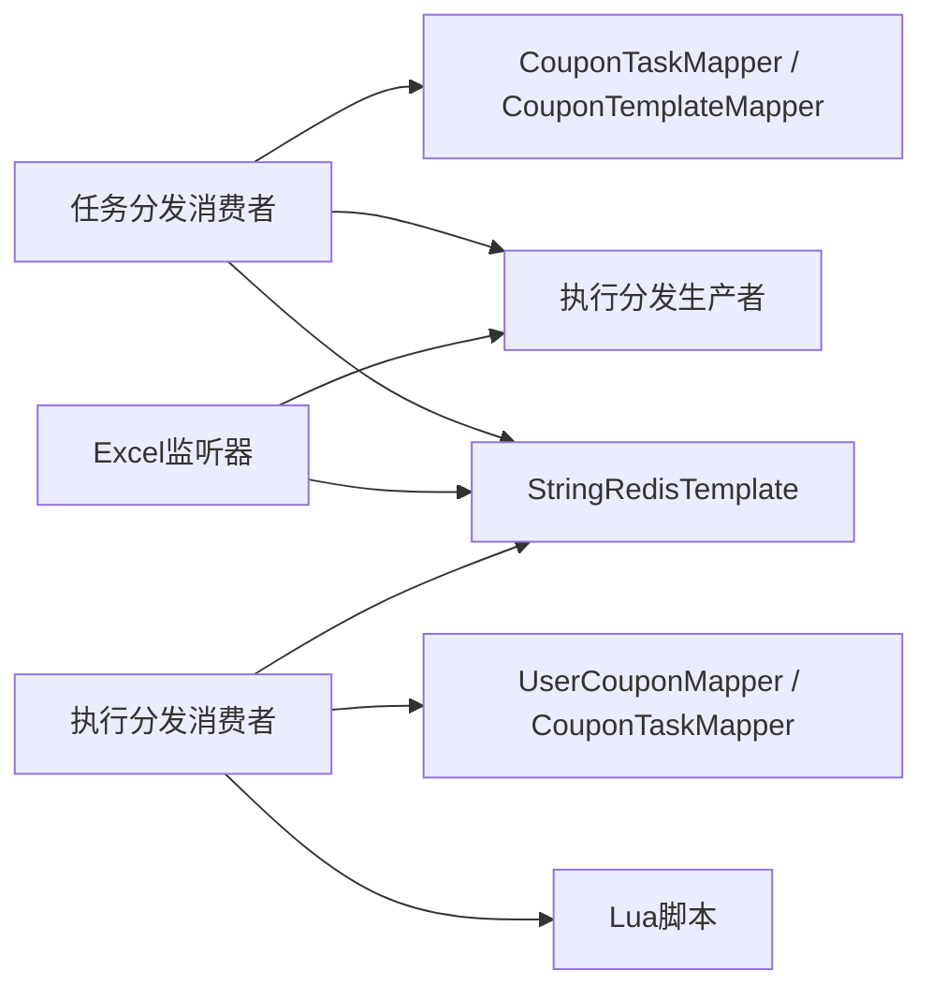
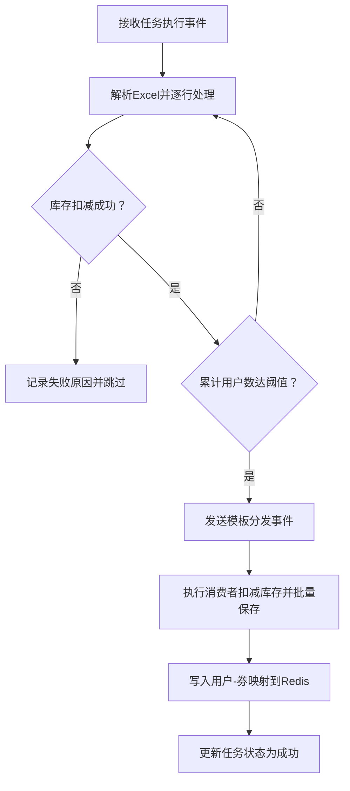

# 分发服务模块

<cite>
**本文引用的文件**
- [DistributionApplication.java](file://distribution/src/main/java/com/fengxin/maplecoupon/distribution/DistributionApplication.java)
- [DistributionRedisConstant.java](file://distribution/src/main/java/com/fengxin/maplecoupon/distribution/common/constant/DistributionRedisConstant.java)
- [RocketMQConstant.java](file://distribution/src/main/java/com/fengxin/maplecoupon/distribution/common/constant/RocketMQConstant.java)
- [CouponTaskStatusEnum.java](file://distribution/src/main/java/com/fengxin/maplecoupon/distribution/common/enums/CouponTaskStatusEnum.java)
- [CouponStatusEnum.java](file://distribution/src/main/java/com/fengxin/maplecoupon/distribution/common/enums/CouponStatusEnum.java)
- [CouponTaskDO.java](file://distribution/src/main/java/com/fengxin/maplecoupon/distribution/dao/entity/CouponTaskDO.java)
- [UserCouponDO.java](file://distribution/src/main/java/com/fengxin/maplecoupon/distribution/dao/entity/UserCouponDO.java)
- [CouponTaskMapper.java](file://distribution/src/main/java/com/fengxin/maplecoupon/distribution/dao/mapper/CouponTaskMapper.java)
- [UserCouponMapper.java](file://distribution/src/main/java/com/fengxin/maplecoupon/distribution/dao/mapper/UserCouponMapper.java)
- [CouponTaskDistributionConsumer.java](file://distribution/src/main/java/com/fengxin/maplecoupon/distribution/mq/consumer/CouponTaskDistributionConsumer.java)
- [CouponExecuteDistributionConsumer.java](file://distribution/src/main/java/com/fengxin/maplecoupon/distribution/mq/consumer/CouponExecuteDistributionConsumer.java)
- [CouponTaskExecuteEvent.java](file://distribution/src/main/java/com/fengxin/maplecoupon/distribution/mq/design/CouponTaskExecuteEvent.java)
- [CouponTemplateDistributionEvent.java](file://distribution/src/main/java/com/fengxin/maplecoupon/distribution/mq/design/CouponTemplateDistributionEvent.java)
- [ReadExcelDistributionListener.java](file://distribution/src/main/java/com/fengxin/maplecoupon/distribution/service/handler/excel/ReadExcelDistributionListener.java)
- [StockDecrementReturnCombinedUtil.java](file://distribution/src/main/java/com/fengxin/maplecoupon/distribution/util/StockDecrementReturnCombinedUtil.java)
- [batch_save_user_coupon.lua](file://distribution/src/main/resources/lua/batch_save_user_coupon.lua)
- [stock_decrement_and_batch_save_user_record.lua](file://distribution/src/main/resources/lua/stock_decrement_and_batch_save_user_record.lua)
</cite>

## 目录
1. [简介](#简介)
2. [项目结构](#项目结构)
3. [核心组件](#核心组件)
4. [架构总览](#架构总览)
5. [详细组件分析](#详细组件分析)
6. [依赖分析](#依赖分析)
7. [性能考虑](#性能考虑)
8. [故障排查指南](#故障排查指南)
9. [结论](#结论)
10. [附录](#附录)

## 简介
本技术文档面向“分发服务模块”，系统性阐述优惠券批量分发的完整实现，覆盖以下关键能力：
- 优惠券模板分发与批次任务执行
- 用户筛选与库存扣减策略
- 基于消息队列的异步处理与状态跟踪
- Redis 缓存优化、Lua 原子操作与数据库事务保障
- Excel 文件处理、用户数据导入与批量操作优化
- 通知发送机制（短信、邮件等）与失败重试策略
- 完整分发流程说明、性能优化建议与故障排查指南
- 扩展接口与集成方案

## 项目结构
分发服务模块采用 Spring Boot + MyBatis-Plus 架构，结合 RocketMQ 实现异步分发，Redis 提供高并发库存扣减与用户记录缓存，Lua 脚本保障原子性。

图表来源
- [DistributionApplication.java:1-19](file://distribution/src/main/java/com/fengxin/maplecoupon/distribution/DistributionApplication.java#L1-L19)
- [RocketMQConstant.java:1-31](file://distribution/src/main/java/com/fengxin/maplecoupon/distribution/common/constant/RocketMQConstant.java#L1-L31)
- [DistributionRedisConstant.java:1-21](file://distribution/src/main/java/com/fengxin/maplecoupon/distribution/common/constant/DistributionRedisConstant.java#L1-L21)
- [CouponTaskStatusEnum.java:1-43](file://distribution/src/main/java/com/fengxin/maplecoupon/distribution/common/enums/CouponTaskStatusEnum.java#L1-L43)
- [CouponStatusEnum.java:1-28](file://distribution/src/main/java/com/fengxin/maplecoupon/distribution/common/enums/CouponStatusEnum.java#L1-L28)
- [CouponTaskDO.java:1-115](file://distribution/src/main/java/com/fengxin/maplecoupon/distribution/dao/entity/CouponTaskDO.java#L1-L115)
- [UserCouponDO.java:1-100](file://distribution/src/main/java/com/fengxin/maplecoupon/distribution/dao/entity/UserCouponDO.java#L1-L100)
- [CouponTaskMapper.java:1-15](file://distribution/src/main/java/com/fengxin/maplecoupon/distribution/dao/mapper/CouponTaskMapper.java#L1-L15)
- [UserCouponMapper.java:1-24](file://distribution/src/main/java/com/fengxin/maplecoupon/distribution/dao/mapper/UserCouponMapper.java#L1-L24)
- [CouponTaskExecuteEvent.java:1-24](file://distribution/src/main/java/com/fengxin/maplecoupon/distribution/mq/design/CouponTaskExecuteEvent.java#L1-L24)
- [CouponTemplateDistributionEvent.java:1-90](file://distribution/src/main/java/com/fengxin/maplecoupon/distribution/mq/design/CouponTemplateDistributionEvent.java#L1-L90)
- [CouponTaskDistributionConsumer.java:1-89](file://distribution/src/main/java/com/fengxin/maplecoupon/distribution/mq/consumer/CouponTaskDistributionConsumer.java#L1-L89)
- [CouponExecuteDistributionConsumer.java:1-335](file://distribution/src/main/java/com/fengxin/maplecoupon/distribution/mq/consumer/CouponExecuteDistributionConsumer.java#L1-L335)
- [ReadExcelDistributionListener.java:1-168](file://distribution/src/main/java/com/fengxin/maplecoupon/distribution/service/handler/excel/ReadExcelDistributionListener.java#L1-L168)
- [StockDecrementReturnCombinedUtil.java:1-36](file://distribution/src/main/java/com/fengxin/maplecoupon/distribution/util/StockDecrementReturnCombinedUtil.java#L1-L36)

章节来源
- [DistributionApplication.java:1-19](file://distribution/src/main/java/com/fengxin/maplecoupon/distribution/DistributionApplication.java#L1-L19)
- [RocketMQConstant.java:1-31](file://distribution/src/main/java/com/fengxin/maplecoupon/distribution/common/constant/RocketMQConstant.java#L1-L31)
- [DistributionRedisConstant.java:1-21](file://distribution/src/main/java/com/fengxin/maplecoupon/distribution/common/constant/DistributionRedisConstant.java#L1-L21)

## 核心组件
- 应用入口与扫描配置：负责启动与 Mapper 扫描。
- 常量与枚举：统一 RocketMQ 主题/消费者组、Redis Key 命名规范及状态枚举。
- 数据模型：任务表、用户优惠券表及其 MyBatis 映射。
- 消息设计：任务执行事件与模板分发事件的数据契约。
- 消费者：负责解析 Excel、前置校验、库存扣减与最终落库。
- Excel 处理器：基于 EasyExcel 的监听器，支持断点续跑与批量分发。
- 工具与脚本：Redis 原子操作辅助工具与 Lua 脚本。

章节来源
- [CouponTaskDO.java:1-115](file://distribution/src/main/java/com/fengxin/maplecoupon/distribution/dao/entity/CouponTaskDO.java#L1-L115)
- [UserCouponDO.java:1-100](file://distribution/src/main/java/com/fengxin/maplecoupon/distribution/dao/entity/UserCouponDO.java#L1-L100)
- [CouponTaskMapper.java:1-15](file://distribution/src/main/java/com/fengxin/maplecoupon/distribution/dao/mapper/CouponTaskMapper.java#L1-L15)
- [UserCouponMapper.java:1-24](file://distribution/src/main/java/com/fengxin/maplecoupon/distribution/dao/mapper/UserCouponMapper.java#L1-L24)
- [CouponTaskExecuteEvent.java:1-24](file://distribution/src/main/java/com/fengxin/maplecoupon/distribution/mq/design/CouponTaskExecuteEvent.java#L1-L24)
- [CouponTemplateDistributionEvent.java:1-90](file://distribution/src/main/java/com/fengxin/maplecoupon/distribution/mq/design/CouponTemplateDistributionEvent.java#L1-L90)
- [CouponTaskDistributionConsumer.java:1-89](file://distribution/src/main/java/com/fengxin/maplecoupon/distribution/mq/consumer/CouponTaskDistributionConsumer.java#L1-L89)
- [CouponExecuteDistributionConsumer.java:1-335](file://distribution/src/main/java/com/fengxin/maplecoupon/distribution/mq/consumer/CouponExecuteDistributionConsumer.java#L1-L335)
- [ReadExcelDistributionListener.java:1-168](file://distribution/src/main/java/com/fengxin/maplecoupon/distribution/service/handler/excel/ReadExcelDistributionListener.java#L1-L168)
- [StockDecrementReturnCombinedUtil.java:1-36](file://distribution/src/main/java/com/fengxin/maplecoupon/distribution/util/StockDecrementReturnCombinedUtil.java#L1-L36)

## 架构总览
分发服务采用“消息驱动 + Redis 原子操作 + 批量落库”的异步流水线，确保高并发下的库存一致性与吞吐。

图表来源
- [CouponTaskDistributionConsumer.java:54-87](file://distribution/src/main/java/com/fengxin/maplecoupon/distribution/mq/consumer/CouponTaskDistributionConsumer.java#L54-L87)
- [ReadExcelDistributionListener.java:60-144](file://distribution/src/main/java/com/fengxin/maplecoupon/distribution/service/handler/excel/ReadExcelDistributionListener.java#L60-L144)
- [CouponExecuteDistributionConsumer.java:80-163](file://distribution/src/main/java/com/fengxin/maplecoupon/distribution/mq/consumer/CouponExecuteDistributionConsumer.java#L80-L163)

## 详细组件分析

### 1) 任务与模板数据模型
- 任务表：记录批次任务、通知方式、发送类型与状态等；支持断点续跑与失败导出。
- 用户优惠券表：记录用户领取详情、有效期、来源与状态；支持批量插入与幂等约束。

图表来源
- [CouponTaskDO.java:24-113](file://distribution/src/main/java/com/fengxin/maplecoupon/distribution/dao/entity/CouponTaskDO.java#L24-L113)
- [UserCouponDO.java:24-96](file://distribution/src/main/java/com/fengxin/maplecoupon/distribution/dao/entity/UserCouponDO.java#L24-L96)

章节来源
- [CouponTaskDO.java:1-115](file://distribution/src/main/java/com/fengxin/maplecoupon/distribution/dao/entity/CouponTaskDO.java#L1-L115)
- [UserCouponDO.java:1-100](file://distribution/src/main/java/com/fengxin/maplecoupon/distribution/dao/entity/UserCouponDO.java#L1-L100)
- [CouponTaskMapper.java:1-15](file://distribution/src/main/java/com/fengxin/maplecoupon/distribution/dao/mapper/CouponTaskMapper.java#L1-L15)
- [UserCouponMapper.java:1-24](file://distribution/src/main/java/com/fengxin/maplecoupon/distribution/dao/mapper/UserCouponMapper.java#L1-L24)

### 2) 消息队列与事件设计
- 任务执行事件：触发 Excel 解析与前置校验。
- 模板分发事件：承载批次、模板、有效期、用户信息与批量阈值，驱动库存扣减与落库。

图表来源
- [CouponTaskExecuteEvent.java:18-23](file://distribution/src/main/java/com/fengxin/maplecoupon/distribution/mq/design/CouponTaskExecuteEvent.java#L18-L23)
- [CouponTemplateDistributionEvent.java:21-89](file://distribution/src/main/java/com/fengxin/maplecoupon/distribution/mq/design/CouponTemplateDistributionEvent.java#L21-L89)

章节来源
- [CouponTaskExecuteEvent.java:1-24](file://distribution/src/main/java/com/fengxin/maplecoupon/distribution/mq/design/CouponTaskExecuteEvent.java#L1-L24)
- [CouponTemplateDistributionEvent.java:1-90](file://distribution/src/main/java/com/fengxin/maplecoupon/distribution/mq/design/CouponTemplateDistributionEvent.java#L1-L90)

### 3) Excel 处理与用户筛选
- 断点续跑：基于 Redis 进度键记录已处理行，避免重复处理。
- 原子扣减与用户集：通过 Lua 脚本在 Redis 中完成库存扣减与用户记录原子化，返回“是否扣减成功 + 当前累计用户数”。
- 批量阈值：当累计用户达到阈值（如 10 万）时，向执行消费者发送模板分发事件。

图表来源
- [ReadExcelDistributionListener.java:50-144](file://distribution/src/main/java/com/fengxin/maplecoupon/distribution/service/handler/excel/ReadExcelDistributionListener.java#L50-L144)
- [StockDecrementReturnCombinedUtil.java:18-34](file://distribution/src/main/java/com/fengxin/maplecoupon/distribution/util/StockDecrementReturnCombinedUtil.java#L18-L34)

章节来源
- [ReadExcelDistributionListener.java:1-168](file://distribution/src/main/java/com/fengxin/maplecoupon/distribution/service/handler/excel/ReadExcelDistributionListener.java#L1-L168)
- [StockDecrementReturnCombinedUtil.java:1-36](file://distribution/src/main/java/com/fengxin/maplecoupon/distribution/util/StockDecrementReturnCombinedUtil.java#L1-L36)

### 4) 库存扣减与批量落库
- 库存扣减：先尝试按目标数量扣减，若不足则查询剩余库存并递归扣减至可用数量。
- 批量保存：优先批量插入，遇到唯一索引冲突时逐条插入并记录失败原因，同时恢复被重复扣减的库存。
- Redis 原子写入：使用 Lua 将用户与优惠券映射写入 Redis，保证一致性。

图表来源
- [CouponExecuteDistributionConsumer.java:170-243](file://distribution/src/main/java/com/fengxin/maplecoupon/distribution/mq/consumer/CouponExecuteDistributionConsumer.java#L170-L243)
- [CouponExecuteDistributionConsumer.java:275-316](file://distribution/src/main/java/com/fengxin/maplecoupon/distribution/mq/consumer/CouponExecuteDistributionConsumer.java#L275-L316)

章节来源
- [CouponExecuteDistributionConsumer.java:1-335](file://distribution/src/main/java/com/fengxin/maplecoupon/distribution/mq/consumer/CouponExecuteDistributionConsumer.java#L1-L335)

### 5) 通知发送与失败重试
- 通知字段：任务表包含通知方式（站内信、弹框推送、邮箱、短信），事件中携带手机号与邮箱。
- 失败记录：库存不足或用户已领取等失败场景写入失败表，并生成 Excel 导出路径。
- 重试策略：当前实现未见显式重试机制，建议在消费者侧引入幂等与重试队列，结合 RocketMQ 的重试与死信队列完善。

章节来源
- [CouponTaskDO.java:62-64](file://distribution/src/main/java/com/fengxin/maplecoupon/distribution/dao/entity/CouponTaskDO.java#L62-L64)
- [CouponTemplateDistributionEvent.java:70-77](file://distribution/src/main/java/com/fengxin/maplecoupon/distribution/mq/design/CouponTemplateDistributionEvent.java#L70-L77)
- [CouponExecuteDistributionConsumer.java:127-127](file://distribution/src/main/java/com/fengxin/maplecoupon/distribution/mq/consumer/CouponExecuteDistributionConsumer.java#L127-L127)

### 6) Redis 缓存与 Lua 原子操作
- 进度键：用于断点续跑，避免重复处理。
- 用户集键：存放待分发用户，按批次弹出并批量落库。
- 原子脚本：
  - 原子扣减库存并加入用户集，返回“是否扣减成功 + 当前累计用户数”。
  - 批量写入用户-券映射，保证一致性。

章节来源
- [DistributionRedisConstant.java:10-18](file://distribution/src/main/java/com/fengxin/maplecoupon/distribution/common/constant/DistributionRedisConstant.java#L10-L18)
- [stock_decrement_and_batch_save_user_record.lua](file://distribution/src/main/resources/lua/stock_decrement_and_batch_save_user_record.lua)
- [batch_save_user_coupon.lua](file://distribution/src/main/resources/lua/batch_save_user_coupon.lua)

### 7) 数据库事务与幂等
- 批量插入异常捕获：通过 MyBatis 批处理异常识别唯一索引冲突，逐条插入并记录失败。
- 库存恢复：对重复扣减的库存进行恢复，保证最终一致。
- 幂等：消费者使用幂等注解防止重复消费。

章节来源
- [CouponExecuteDistributionConsumer.java:275-316](file://distribution/src/main/java/com/fengxin/maplecoupon/distribution/mq/consumer/CouponExecuteDistributionConsumer.java#L275-L316)
- [CouponTaskDistributionConsumer.java:49-53](file://distribution/src/main/java/com/fengxin/maplecoupon/distribution/mq/consumer/CouponTaskDistributionConsumer.java#L49-L53)

## 依赖分析
- 组件耦合：消费者依赖 Mapper、RedisTemplate、生产者与脚本资源；监听器依赖消费者与 Mapper。
- 外部依赖：RocketMQ、Redis、MyBatis-Plus、EasyExcel、Hutool。
- 潜在风险：批量落库与库存扣减的边界条件需严格测试；幂等与重试策略需完善。

图表来源
- [CouponTaskDistributionConsumer.java:43-47](file://distribution/src/main/java/com/fengxin/maplecoupon/distribution/mq/consumer/CouponTaskDistributionConsumer.java#L43-L47)
- [ReadExcelDistributionListener.java:38-42](file://distribution/src/main/java/com/fengxin/maplecoupon/distribution/service/handler/excel/ReadExcelDistributionListener.java#L38-L42)
- [CouponExecuteDistributionConsumer.java:69-74](file://distribution/src/main/java/com/fengxin/maplecoupon/distribution/mq/consumer/CouponExecuteDistributionConsumer.java#L69-L74)

章节来源
- [CouponTaskDistributionConsumer.java:1-89](file://distribution/src/main/java/com/fengxin/maplecoupon/distribution/mq/consumer/CouponTaskDistributionConsumer.java#L1-L89)
- [ReadExcelDistributionListener.java:1-168](file://distribution/src/main/java/com/fengxin/maplecoupon/distribution/service/handler/excel/ReadExcelDistributionListener.java#L1-L168)
- [CouponExecuteDistributionConsumer.java:1-335](file://distribution/src/main/java/com/fengxin/maplecoupon/distribution/mq/consumer/CouponExecuteDistributionConsumer.java#L1-L335)

## 性能考虑
- 批量化阈值：默认 10 万条用户记录批量落库，减少数据库往返与锁竞争。
- 原子操作：Redis Lua 脚本保证库存扣减与用户集加入的原子性，降低并发冲突。
- 断点续跑：Redis 进度键避免重复处理，提升容错与吞吐。
- 批量导出：失败记录分页导出，避免一次性写入过多导致内存压力。
- 建议优化：
  - 对用户集弹出与批量保存过程引入背压控制与速率限制。
  - 对 Lua 脚本参数进行序列化优化，减少网络传输。
  - 对数据库批量插入使用 JDBC 批处理参数调优。
  - 对 RocketMQ 消息队列进行分区与消费者扩容，提升并发。

[本节为通用性能建议，不直接分析具体文件]

## 故障排查指南
- Excel 解析中断：检查 Redis 进度键是否存在、是否被提前修改；确认监听器初始化逻辑是否正确读取进度。
- 库存不足：核对模板库存与实际扣减情况；检查 Lua 脚本返回值与业务分支。
- 批量落库失败：查看唯一索引冲突记录，确认逐条插入与库存恢复逻辑是否生效。
- 任务状态异常：核对任务状态枚举与更新逻辑，确保最终置为成功。
- 通知未发送：核对任务表通知字段与事件中的手机号/邮箱字段，确认后续通知生产者实现。

章节来源
- [ReadExcelDistributionListener.java:50-58](file://distribution/src/main/java/com/fengxin/maplecoupon/distribution/service/handler/excel/ReadExcelDistributionListener.java#L50-L58)
- [CouponExecuteDistributionConsumer.java:170-177](file://distribution/src/main/java/com/fengxin/maplecoupon/distribution/mq/consumer/CouponExecuteDistributionConsumer.java#L170-L177)
- [CouponExecuteDistributionConsumer.java:275-316](file://distribution/src/main/java/com/fengxin/maplecoupon/distribution/mq/consumer/CouponExecuteDistributionConsumer.java#L275-L316)
- [CouponTaskStatusEnum.java:14-42](file://distribution/src/main/java/com/fengxin/maplecoupon/distribution/common/enums/CouponTaskStatusEnum.java#L14-L42)

## 结论
分发服务模块通过“消息驱动 + Redis 原子操作 + 批量落库”的架构，在高并发场景下实现了优惠券模板分发与批次任务执行的稳定运行。其核心优势在于：
- 基于 Redis 的原子库存扣减与用户集管理，显著降低数据库压力；
- 基于 RocketMQ 的异步分发与断点续跑，提升吞吐与可靠性；
- 批量落库与幂等处理，确保最终一致性与可观测性。

建议后续完善通知发送与重试机制，进一步增强系统的健壮性与可运维性。

[本节为总结性内容，不直接分析具体文件]

## 附录

### A. 关键流程图：模板分发与批次执行

图表来源
- [CouponTaskDistributionConsumer.java:54-87](file://distribution/src/main/java/com/fengxin/maplecoupon/distribution/mq/consumer/CouponTaskDistributionConsumer.java#L54-L87)
- [ReadExcelDistributionListener.java:60-144](file://distribution/src/main/java/com/fengxin/maplecoupon/distribution/service/handler/excel/ReadExcelDistributionListener.java#L60-L144)
- [CouponExecuteDistributionConsumer.java:80-163](file://distribution/src/main/java/com/fengxin/maplecoupon/distribution/mq/consumer/CouponExecuteDistributionConsumer.java#L80-L163)

### B. 扩展接口与集成方案
- 扩展通知渠道：在事件中扩展通知类型字段，消费者侧接入短信/邮件服务 SDK，并支持失败重试与回调。
- 扩展用户筛选：在 Excel 监听器中增加用户维度过滤（如地域、等级、标签），并在 Redis 中维护筛选后的用户集。
- 扩展幂等与重试：引入 RocketMQ 的重试与死信队列，结合幂等键与去重表，实现可靠的消息处理。
- 扩展监控与告警：埋点统计各阶段耗时、失败率与重试次数，对接 Prometheus/Grafana。

[本节为概念性扩展建议，不直接分析具体文件]