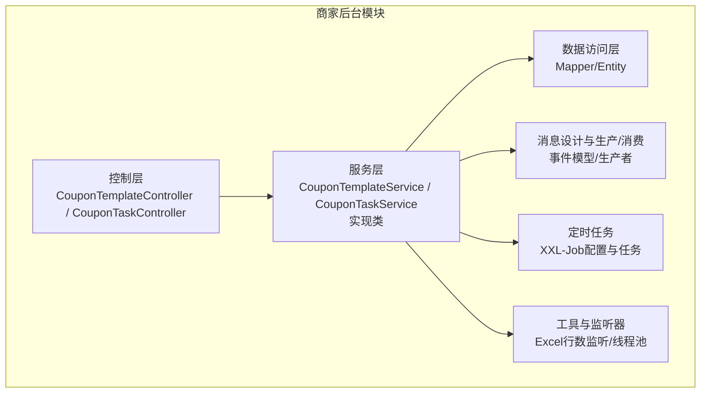
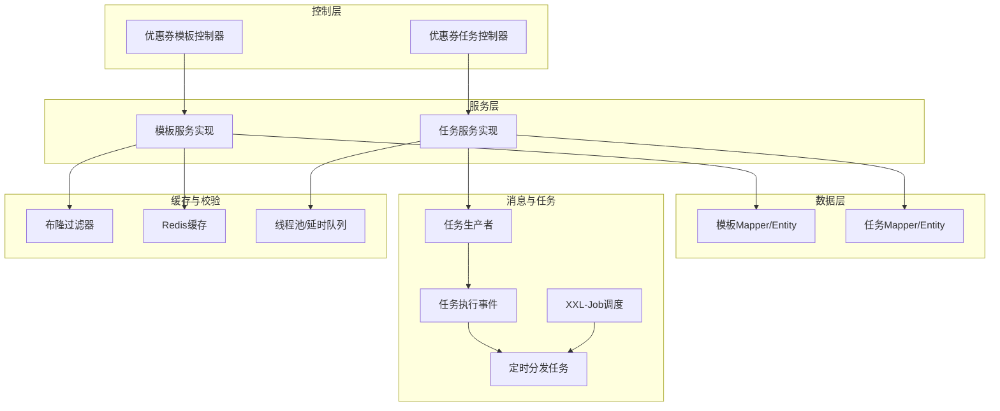
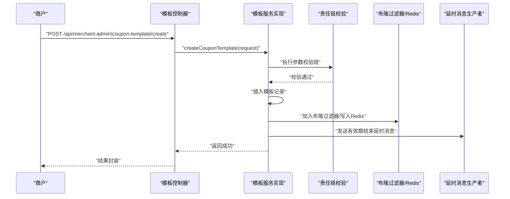
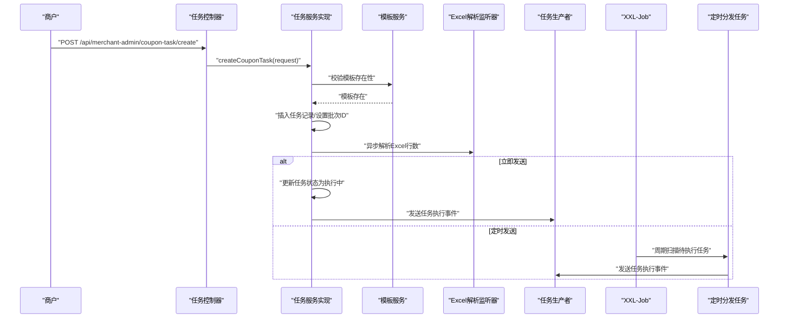
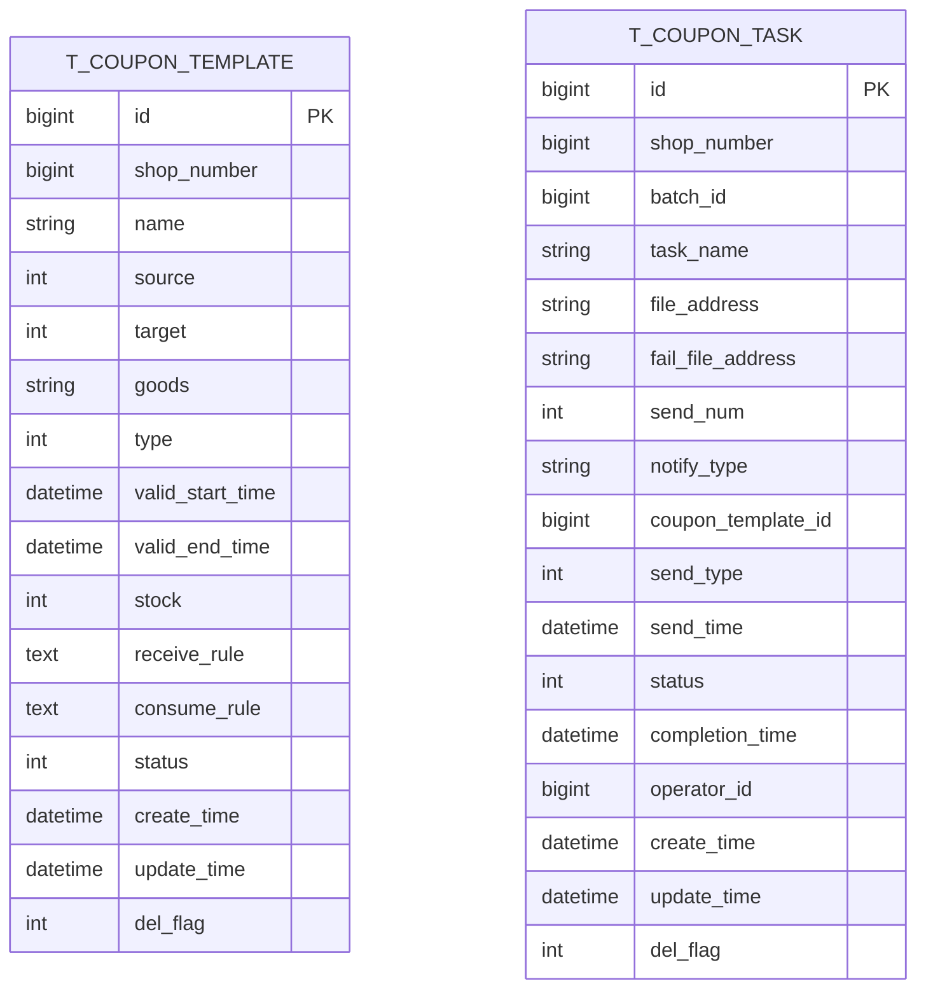
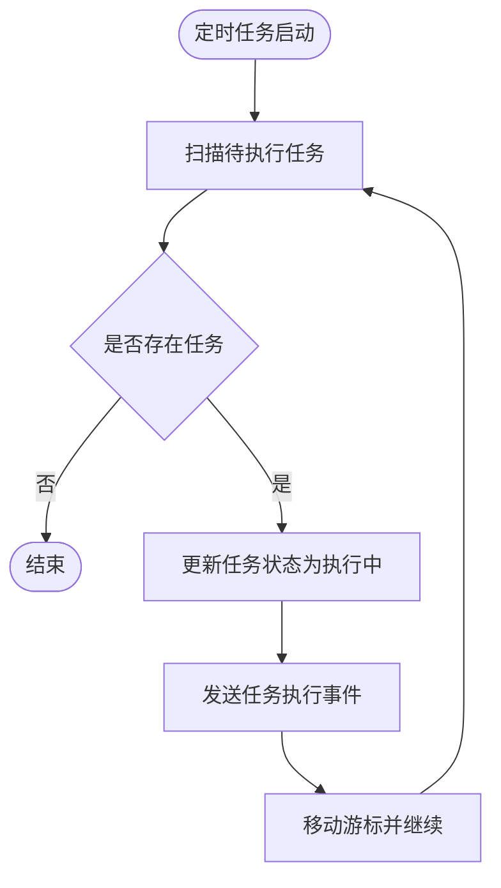
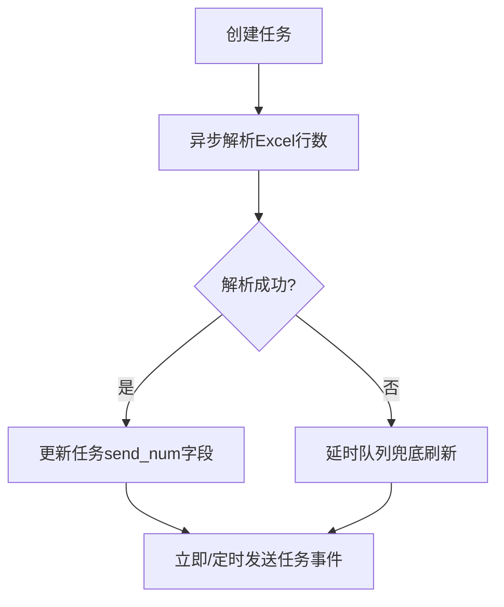
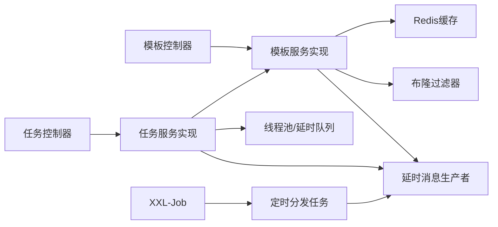

# 商家后台模块

<cite>
**本文引用的文件**
- [MerchantAdminApplication.java](file://merchant-admin/src/main/java/com/fengxin/maplecoupon/merchantadmin/MerchantAdminApplication.java)
- [CouponTemplateController.java](file://merchant-admin/src/main/java/com/fengxin/maplecoupon/merchantadmin/controller/CouponTemplateController.java)
- [CouponTaskController.java](file://merchant-admin/src/main/java/com/fengxin/maplecoupon/merchantadmin/controller/CouponTaskController.java)
- [CouponTemplateService.java](file://merchant-admin/src/main/java/com/fengxin/maplecoupon/merchantadmin/service/CouponTemplateService.java)
- [CouponTaskService.java](file://merchant-admin/src/main/java/com/fengxin/maplecoupon/merchantadmin/service/CouponTaskService.java)
- [CouponTemplateServiceImpl.java](file://merchant-admin/src/main/java/com/fengxin/maplecoupon/merchantadmin/service/impl/CouponTemplateServiceImpl.java)
- [CouponTaskServiceImpl.java](file://merchant-admin/src/main/java/com/fengxin/maplecoupon/merchantadmin/service/impl/CouponTaskServiceImpl.java)
- [CouponTemplateDO.java](file://merchant-admin/src/main/java/com/fengxin/maplecoupon/merchantadmin/dao/entity/CouponTemplateDO.java)
- [CouponTaskDO.java](file://merchant-admin/src/main/java/com/fengxin/maplecoupon/merchantadmin/dao/entity/CouponTaskDO.java)
- [XXLJobConfiguration.java](file://merchant-admin/src/main/java/com/fengxin/maplecoupon/merchantadmin/config/XXLJobConfiguration.java)
- [DistributeCouponTask.java](file://merchant-admin/src/main/java/com/fengxin/maplecoupon/merchantadmin/job/DistributeCouponTask.java)
- [CouponTaskExecuteEvent.java](file://merchant-admin/src/main/java/com/fengxin/maplecoupon/merchantadmin/mq/design/CouponTaskExecuteEvent.java)
- [RowCountListener.java](file://merchant-admin/src/main/java/com/fengxin/maplecoupon/merchantadmin/service/handler/excel/RowCountListener.java)
- [CouponTemplateStatusEnum.java](file://merchant-admin/src/main/java/com/fengxin/maplecoupon/merchantadmin/common/enums/CouponTemplateStatusEnum.java)
- [CouponTaskStatusEnum.java](file://merchant-admin/src/main/java/com/fengxin/maplecoupon/merchantadmin/common/enums/CouponTaskStatusEnum.java)
</cite>

## 目录
1. [简介](#简介)
2. [项目结构](#项目结构)
3. [核心组件](#核心组件)
4. [架构总览](#架构总览)
5. [详细组件分析](#详细组件分析)
6. [依赖分析](#依赖分析)
7. [性能考虑](#性能考虑)
8. [故障排查指南](#故障排查指南)
9. [结论](#结论)
10. [附录](#附录)

## 简介
本技术文档面向“商家后台模块”，系统性阐述优惠券模板管理与优惠券推送任务管理两大核心能力。内容覆盖：
- 优惠券模板的创建、编辑、审核、发布、终止与删除全流程，含模板规则配置、发行量设置、有效期管理与自动到期处理。
- 优惠券推送任务的创建、执行、监控与统计分析，含Excel导入、数据校验、批处理与消息队列分发。
- 日志记录、操作审计与数据安全保护策略。
- XXL-Job定时任务调度与消息队列集成方案。
- 完整的商家管理API接口定义与业务流程说明，并提供操作指南与系统集成建议。

## 项目结构
商家后台模块采用标准的分层架构：Web 控制层 → 业务服务层 → 数据访问层；配合消息队列与分布式任务调度，形成高可靠、可扩展的优惠券运营体系。

图表来源
- [CouponTemplateController.java:1-74](file://merchant-admin/src/main/java/com/fengxin/maplecoupon/merchantadmin/controller/CouponTemplateController.java#L1-L74)
- [CouponTaskController.java:1-40](file://merchant-admin/src/main/java/com/fengxin/maplecoupon/merchantadmin/controller/CouponTaskController.java#L1-L40)
- [CouponTemplateServiceImpl.java:1-243](file://merchant-admin/src/main/java/com/fengxin/maplecoupon/merchantadmin/service/impl/CouponTemplateServiceImpl.java#L1-L243)
- [CouponTaskServiceImpl.java:1-140](file://merchant-admin/src/main/java/com/fengxin/maplecoupon/merchantadmin/service/impl/CouponTaskServiceImpl.java#L1-L140)
- [XXLJobConfiguration.java:1-56](file://merchant-admin/src/main/java/com/fengxin/maplecoupon/merchantadmin/config/XXLJobConfiguration.java#L1-L56)
- [DistributeCouponTask.java:1-93](file://merchant-admin/src/main/java/com/fengxin/maplecoupon/merchantadmin/job/DistributeCouponTask.java#L1-L93)

章节来源
- [MerchantAdminApplication.java:1-22](file://merchant-admin/src/main/java/com/fengxin/maplecoupon/merchantadmin/MerchantAdminApplication.java#L1-L22)
- [CouponTemplateController.java:1-74](file://merchant-admin/src/main/java/com/fengxin/maplecoupon/merchantadmin/controller/CouponTemplateController.java#L1-L74)
- [CouponTaskController.java:1-40](file://merchant-admin/src/main/java/com/fengxin/maplecoupon/merchantadmin/controller/CouponTaskController.java#L1-L40)

## 核心组件
- 控制层：提供优惠券模板与任务的REST接口，统一返回封装。
- 服务层：负责业务编排、参数校验、幂等控制、事务与审计日志。
- 数据访问层：基于MyBatis-Plus，提供模板与任务的持久化能力。
- 消息中间件：RocketMQ事件驱动，支持延时消息、批量分发与消费者处理。
- 定时任务：XXL-Job集中调度，按计划拉取待执行任务并触发分发。
- 工具与监听：EasyExcel解析、Redisson阻塞队列与延时队列保障Excel行数刷新可靠性。

章节来源
- [CouponTemplateService.java:1-54](file://merchant-admin/src/main/java/com/fengxin/maplecoupon/merchantadmin/service/CouponTemplateService.java#L1-L54)
- [CouponTaskService.java:1-16](file://merchant-admin/src/main/java/com/fengxin/maplecoupon/merchantadmin/service/CouponTaskService.java#L1-L16)
- [CouponTemplateServiceImpl.java:1-243](file://merchant-admin/src/main/java/com/fengxin/maplecoupon/merchantadmin/service/impl/CouponTemplateServiceImpl.java#L1-L243)
- [CouponTaskServiceImpl.java:1-140](file://merchant-admin/src/main/java/com/fengxin/maplecoupon/merchantadmin/service/impl/CouponTaskServiceImpl.java#L1-L140)

## 架构总览
整体架构围绕“模板生命周期”和“任务执行链路”展开，结合Redis缓存、布隆过滤器、消息队列与定时任务，确保高并发下的稳定性与一致性。

图表来源
- [CouponTemplateController.java:1-74](file://merchant-admin/src/main/java/com/fengxin/maplecoupon/merchantadmin/controller/CouponTemplateController.java#L1-L74)
- [CouponTaskController.java:1-40](file://merchant-admin/src/main/java/com/fengxin/maplecoupon/merchantadmin/controller/CouponTaskController.java#L1-L40)
- [CouponTemplateServiceImpl.java:1-243](file://merchant-admin/src/main/java/com/fengxin/maplecoupon/merchantadmin/service/impl/CouponTemplateServiceImpl.java#L1-L243)
- [CouponTaskServiceImpl.java:1-140](file://merchant-admin/src/main/java/com/fengxin/maplecoupon/merchantadmin/service/impl/CouponTaskServiceImpl.java#L1-L140)
- [DistributeCouponTask.java:1-93](file://merchant-admin/src/main/java/com/fengxin/maplecoupon/merchantadmin/job/DistributeCouponTask.java#L1-L93)
- [CouponTaskExecuteEvent.java:1-24](file://merchant-admin/src/main/java/com/fengxin/maplecoupon/merchantadmin/mq/design/CouponTaskExecuteEvent.java#L1-L24)

## 详细组件分析

### 优惠券模板管理
- 功能范围：创建、分页查询、详情查询、增加发行量、终止模板、删除模板。
- 关键特性：
  - 参数校验通过责任链完成，确保模板规则、有效期、发行量等合规。
  - 创建完成后写入布隆过滤器与Redis缓存，提升查询性能与命中率。
  - 有效期结束后自动变更状态，通过RocketMQ延时消息实现。
  - 审计日志贯穿创建、增发、终止等关键操作，记录原始数据与业务标识。
  - 横向权限校验防止越权访问，保障数据安全。

图表来源
- [CouponTemplateController.java:31-37](file://merchant-admin/src/main/java/com/fengxin/maplecoupon/merchantadmin/controller/CouponTemplateController.java#L31-L37)
- [CouponTemplateServiceImpl.java:83-124](file://merchant-admin/src/main/java/com/fengxin/maplecoupon/merchantadmin/service/impl/CouponTemplateServiceImpl.java#L83-L124)

章节来源
- [CouponTemplateController.java:31-64](file://merchant-admin/src/main/java/com/fengxin/maplecoupon/merchantadmin/controller/CouponTemplateController.java#L31-L64)
- [CouponTemplateServiceImpl.java:83-124](file://merchant-admin/src/main/java/com/fengxin/maplecoupon/merchantadmin/service/impl/CouponTemplateServiceImpl.java#L83-L124)
- [CouponTemplateDO.java:1-112](file://merchant-admin/src/main/java/com/fengxin/maplecoupon/merchantadmin/dao/entity/CouponTemplateDO.java#L1-L112)
- [CouponTemplateStatusEnum.java:1-25](file://merchant-admin/src/main/java/com/fengxin/maplecoupon/merchantadmin/common/enums/CouponTemplateStatusEnum.java#L1-L25)

### 优惠券推送任务管理
- 功能范围：创建任务（立即/定时）、执行监控、Excel导入与行数统计、失败重试与告警。
- 关键特性：
  - 立即发送：更新任务状态为执行中，通过RocketMQ事件触发分发。
  - 定时发送：由XXL-Job周期扫描并分发，避免瞬时洪峰。
  - Excel行数统计：异步线程池解析，Redisson延时队列兜底，保证准确性。
  - 任务状态机：待执行、执行中、执行失败、执行成功、取消。
  - 幂等与防抖：接口级幂等注解，线程池拒绝策略记录日志并延迟重试。

图表来源
- [CouponTaskController.java:32-38](file://merchant-admin/src/main/java/com/fengxin/maplecoupon/merchantadmin/controller/CouponTaskController.java#L32-L38)
- [CouponTaskServiceImpl.java:83-138](file://merchant-admin/src/main/java/com/fengxin/maplecoupon/merchantadmin/service/impl/CouponTaskServiceImpl.java#L83-L138)
- [DistributeCouponTask.java:32-91](file://merchant-admin/src/main/java/com/fengxin/maplecoupon/merchantadmin/job/DistributeCouponTask.java#L32-L91)
- [CouponTaskExecuteEvent.java:1-24](file://merchant-admin/src/main/java/com/fengxin/maplecoupon/merchantadmin/mq/design/CouponTaskExecuteEvent.java#L1-L24)

章节来源
- [CouponTaskController.java:32-38](file://merchant-admin/src/main/java/com/fengxin/maplecoupon/merchantadmin/controller/CouponTaskController.java#L32-L38)
- [CouponTaskServiceImpl.java:83-138](file://merchant-admin/src/main/java/com/fengxin/maplecoupon/merchantadmin/service/impl/CouponTaskServiceImpl.java#L83-L138)
- [CouponTaskDO.java:1-115](file://merchant-admin/src/main/java/com/fengxin/maplecoupon/merchantadmin/dao/entity/CouponTaskDO.java#L1-L115)
- [CouponTaskStatusEnum.java:1-43](file://merchant-admin/src/main/java/com/fengxin/maplecoupon/merchantadmin/common/enums/CouponTaskStatusEnum.java#L1-L43)

### 数据模型

图表来源
- [CouponTemplateDO.java:24-111](file://merchant-admin/src/main/java/com/fengxin/maplecoupon/merchantadmin/dao/entity/CouponTemplateDO.java#L24-L111)
- [CouponTaskDO.java:23-114](file://merchant-admin/src/main/java/com/fengxin/maplecoupon/merchantadmin/dao/entity/CouponTaskDO.java#L23-L114)

章节来源
- [CouponTemplateDO.java:1-112](file://merchant-admin/src/main/java/com/fengxin/maplecoupon/merchantadmin/dao/entity/CouponTemplateDO.java#L1-L112)
- [CouponTaskDO.java:1-115](file://merchant-admin/src/main/java/com/fengxin/maplecoupon/merchantadmin/dao/entity/CouponTaskDO.java#L1-L115)

### XXL-Job定时任务调度
- 配置启用条件：通过配置开关控制是否启用XXL-Job执行器。
- 任务实现：按批次拉取到期且未执行的任务，更新状态并投递消息事件。
- 批处理策略：分页拉取，避免一次性处理过多任务造成压力。

图表来源
- [DistributeCouponTask.java:32-91](file://merchant-admin/src/main/java/com/fengxin/maplecoupon/merchantadmin/job/DistributeCouponTask.java#L32-L91)
- [XXLJobConfiguration.java:18-56](file://merchant-admin/src/main/java/com/fengxin/maplecoupon/merchantadmin/config/XXLJobConfiguration.java#L18-L56)

章节来源
- [DistributeCouponTask.java:1-93](file://merchant-admin/src/main/java/com/fengxin/maplecoupon/merchantadmin/job/DistributeCouponTask.java#L1-L93)
- [XXLJobConfiguration.java:1-56](file://merchant-admin/src/main/java/com/fengxin/maplecoupon/merchantadmin/config/XXLJobConfiguration.java#L1-L56)

### Excel导入与批处理机制
- 行数统计：异步线程池解析Excel，使用EasyExcel监听器统计行数。
- 兜底刷新：Redisson阻塞队列+延时队列，在应用异常或解析失败时兜底刷新发送数量。
- 失败处理：失败文件地址用于后续重试与人工干预。

图表来源
- [CouponTaskServiceImpl.java:66-138](file://merchant-admin/src/main/java/com/fengxin/maplecoupon/merchantadmin/service/impl/CouponTaskServiceImpl.java#L66-L138)
- [RowCountListener.java:1-27](file://merchant-admin/src/main/java/com/fengxin/maplecoupon/merchantadmin/service/handler/excel/RowCountListener.java#L1-L27)

章节来源
- [CouponTaskServiceImpl.java:66-138](file://merchant-admin/src/main/java/com/fengxin/maplecoupon/merchantadmin/service/impl/CouponTaskServiceImpl.java#L66-L138)
- [RowCountListener.java:1-27](file://merchant-admin/src/main/java/com/fengxin/maplecoupon/merchantadmin/service/handler/excel/RowCountListener.java#L1-L27)

### 日志记录、操作审计与数据安全
- 审计日志：通过注解式日志记录模板创建、增发、终止等关键动作，携带业务标识与原始数据。
- 数据安全：横向权限校验（按店铺号过滤），防止越权访问；删除标记位避免物理删除。
- 异常处理：客户端异常与服务端异常分类处理，保障接口健壮性。

章节来源
- [CouponTemplateServiceImpl.java:63-100](file://merchant-admin/src/main/java/com/fengxin/maplecoupon/merchantadmin/service/impl/CouponTemplateServiceImpl.java#L63-L100)
- [CouponTemplateServiceImpl.java:137-141](file://merchant-admin/src/main/java/com/fengxin/maplecoupon/merchantadmin/service/impl/CouponTemplateServiceImpl.java#L137-L141)
- [CouponTemplateServiceImpl.java:169-175](file://merchant-admin/src/main/java/com/fengxin/maplecoupon/merchantadmin/service/impl/CouponTemplateServiceImpl.java#L169-L175)

## 依赖分析
- 控制层依赖服务接口，服务实现依赖Mapper与外部组件（Redis、MQ、XXL-Job）。
- 任务服务依赖模板服务进行有效性校验，依赖消息生产者与Redisson进行任务分发与兜底。
- 模板服务依赖布隆过滤器与Redis缓存，依赖延时消息实现有效期自动终止。

图表来源
- [CouponTemplateController.java:1-74](file://merchant-admin/src/main/java/com/fengxin/maplecoupon/merchantadmin/controller/CouponTemplateController.java#L1-L74)
- [CouponTaskController.java:1-40](file://merchant-admin/src/main/java/com/fengxin/maplecoupon/merchantadmin/controller/CouponTaskController.java#L1-L40)
- [CouponTemplateServiceImpl.java:1-243](file://merchant-admin/src/main/java/com/fengxin/maplecoupon/merchantadmin/service/impl/CouponTemplateServiceImpl.java#L1-L243)
- [CouponTaskServiceImpl.java:1-140](file://merchant-admin/src/main/java/com/fengxin/maplecoupon/merchantadmin/service/impl/CouponTaskServiceImpl.java#L1-L140)
- [DistributeCouponTask.java:1-93](file://merchant-admin/src/main/java/com/fengxin/maplecoupon/merchantadmin/job/DistributeCouponTask.java#L1-L93)

章节来源
- [CouponTemplateController.java:1-74](file://merchant-admin/src/main/java/com/fengxin/maplecoupon/merchantadmin/controller/CouponTemplateController.java#L1-L74)
- [CouponTaskController.java:1-40](file://merchant-admin/src/main/java/com/fengxin/maplecoupon/merchantadmin/controller/CouponTaskController.java#L1-L40)
- [CouponTemplateServiceImpl.java:1-243](file://merchant-admin/src/main/java/com/fengxin/maplecoupon/merchantadmin/service/impl/CouponTemplateServiceImpl.java#L1-L243)
- [CouponTaskServiceImpl.java:1-140](file://merchant-admin/src/main/java/com/fengxin/maplecoupon/merchantadmin/service/impl/CouponTaskServiceImpl.java#L1-L140)

## 性能考虑
- 缓存预热与布隆过滤器：模板创建后写入Redis与布隆过滤器，降低查询成本与误判。
- 异步批处理：Excel解析与任务分发异步化，避免阻塞主线程。
- 分页与限流：定时任务分页拉取，限制单批处理数量，平滑流量峰值。
- 线程池与拒绝策略：合理配置核心线程、队列与拒绝策略，保障系统稳定性。
- 延迟队列兜底：Redisson延时队列确保极端情况下仍能刷新任务行数。

## 故障排查指南
- 任务未执行
  - 检查XXL-Job执行器是否启用与配置是否正确。
  - 核对任务状态是否为“待执行”，发送时间是否已到达。
- Excel行数不准确
  - 确认异步解析是否完成，查看Redisson延时队列是否触发。
  - 检查文件路径与权限，确保解析器可访问。
- 模板状态异常
  - 核对模板状态枚举与有效期结束延时消息是否正常。
  - 检查Redis缓存中的状态字段是否同步更新。
- 权限问题
  - 确认请求上下文中店铺号与模板所属店铺一致。
  - 检查删除标记位与状态字段是否被意外修改。

章节来源
- [XXLJobConfiguration.java:18-56](file://merchant-admin/src/main/java/com/fengxin/maplecoupon/merchantadmin/config/XXLJobConfiguration.java#L18-L56)
- [DistributeCouponTask.java:32-91](file://merchant-admin/src/main/java/com/fengxin/maplecoupon/merchantadmin/job/DistributeCouponTask.java#L32-L91)
- [CouponTaskServiceImpl.java:66-138](file://merchant-admin/src/main/java/com/fengxin/maplecoupon/merchantadmin/service/impl/CouponTaskServiceImpl.java#L66-L138)
- [CouponTemplateServiceImpl.java:169-207](file://merchant-admin/src/main/java/com/fengxin/maplecoupon/merchantadmin/service/impl/CouponTemplateServiceImpl.java#L169-L207)

## 结论
商家后台模块通过清晰的分层设计、完善的审计与安全机制、可靠的异步与定时处理能力，构建了从模板生命周期到任务分发的完整闭环。结合Redis缓存、布隆过滤器与消息队列，系统在高并发场景下具备良好的吞吐与稳定性。建议在生产环境中持续完善监控与告警体系，优化任务批处理参数与线程池配置，确保业务连续性与用户体验。

## 附录

### 商家管理API接口文档
- 优惠券模板管理
  - POST /api/merchant-admin/coupon-template/create
    - 描述：创建优惠券模板
    - 请求体：模板保存请求参数
    - 返回：成功标志
  - GET /api/merchant-admin/coupon-template/page
    - 描述：分页查询优惠券模板
    - 查询参数：分页与筛选条件
    - 返回：分页结果
  - GET /api/merchant-admin/coupon-template/find
    - 描述：按ID查询模板详情
    - 查询参数：模板ID
    - 返回：模板详情
  - POST /api/merchant-admin/coupon-template/increase-number
    - 描述：增加模板发行量
    - 请求体：模板ID与增量
    - 返回：成功标志
  - POST /api/merchant-admin/coupon-template/terminate
    - 描述：终止模板
    - 请求体：模板ID
    - 返回：成功标志
  - DELETE /api/merchant-admin/coupon-template/delete
    - 描述：删除模板
    - 查询参数：模板ID
    - 返回：成功标志

- 优惠券推送任务管理
  - POST /api/merchant-admin/coupon-task/create
    - 描述：创建优惠券推送任务（立即/定时）
    - 请求体：任务创建请求参数
    - 返回：成功标志

章节来源
- [CouponTemplateController.java:31-71](file://merchant-admin/src/main/java/com/fengxin/maplecoupon/merchantadmin/controller/CouponTemplateController.java#L31-L71)
- [CouponTaskController.java:32-38](file://merchant-admin/src/main/java/com/fengxin/maplecoupon/merchantadmin/controller/CouponTaskController.java#L32-L38)

### 业务流程说明
- 模板创建流程
  - 参数校验 → 写入数据库 → 布隆过滤器与Redis缓存预热 → 延时消息设置有效期结束
- 模板增发/终止/删除流程
  - 权限校验 → 状态校验 → 更新数据库与缓存 → 记录审计日志
- 任务创建与执行流程
  - 校验模板 → 写入任务记录 → 异步解析Excel行数 → 立即/定时发送事件 → 消费者分发

章节来源
- [CouponTemplateServiceImpl.java:83-240](file://merchant-admin/src/main/java/com/fengxin/maplecoupon/merchantadmin/service/impl/CouponTemplateServiceImpl.java#L83-L240)
- [CouponTaskServiceImpl.java:83-138](file://merchant-admin/src/main/java/com/fengxin/maplecoupon/merchantadmin/service/impl/CouponTaskServiceImpl.java#L83-L138)
- [DistributeCouponTask.java:32-91](file://merchant-admin/src/main/java/com/fengxin/maplecoupon/merchantadmin/job/DistributeCouponTask.java#L32-L91)

### 系统集成方案
- 接口集成：通过网关统一接入，控制台前端调用上述REST接口。
- 消息集成：RocketMQ事件模型解耦模板与任务，支持多消费者扩展。
- 任务集成：XXL-Job集中调度，支持集群部署与动态扩缩容。
- 缓存集成：Redis与布隆过滤器提升查询性能，注意缓存过期与一致性策略。
- 安全集成：接口鉴权、参数校验、审计日志与越权拦截相结合，保障数据安全。