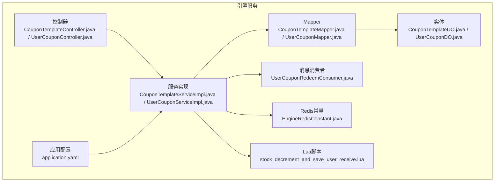
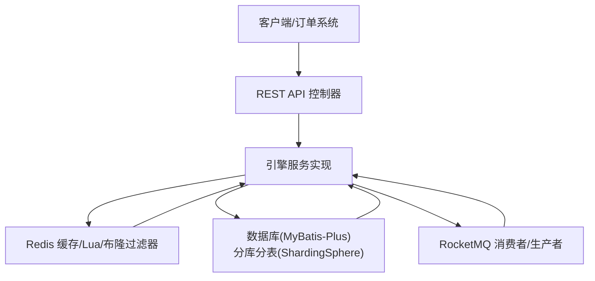
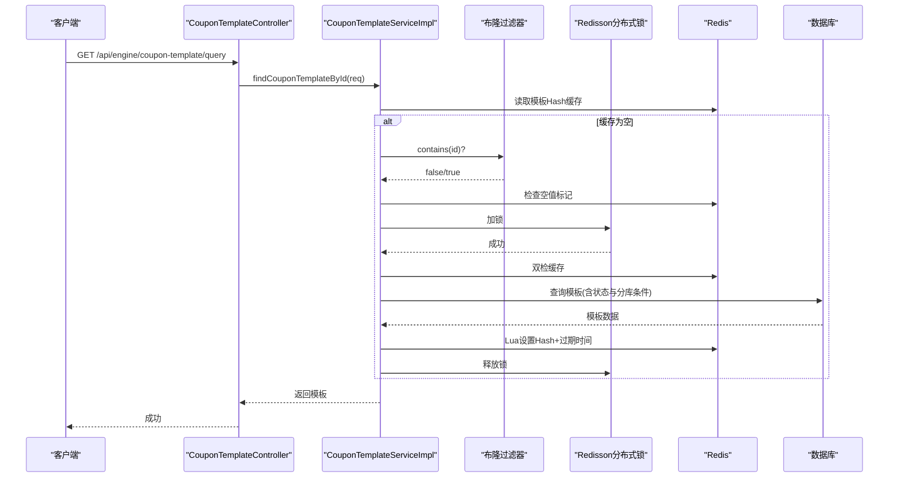
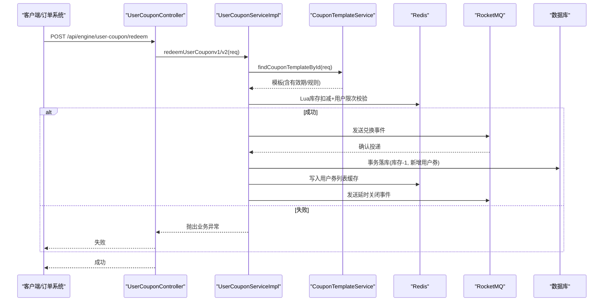
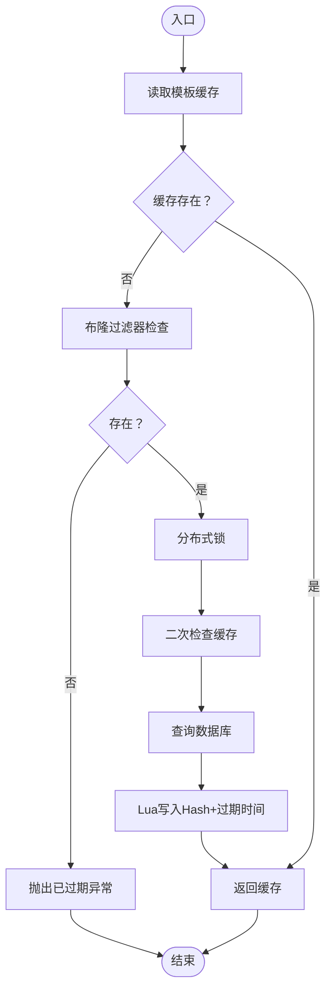
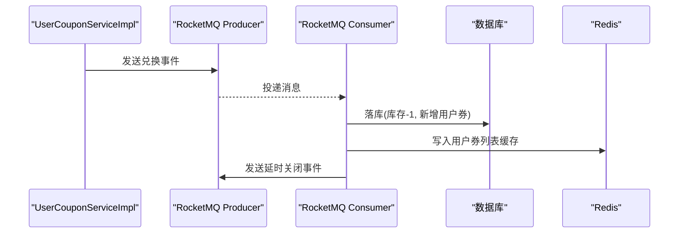
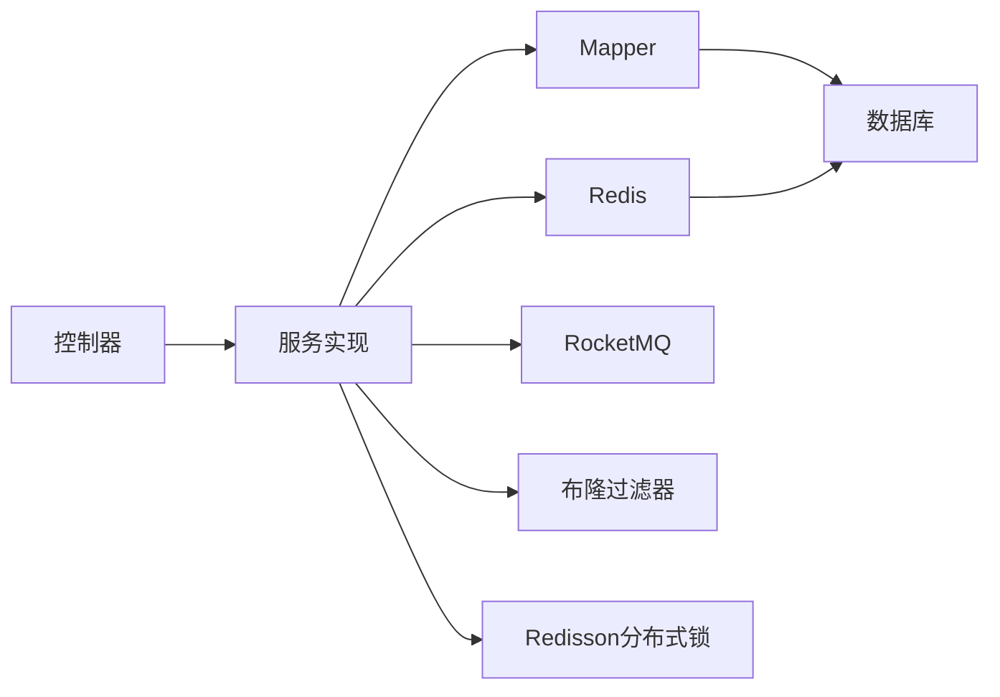

# 引擎服务模块

<cite>
**本文引用的文件**
- [EngineApplication.java](file://engine/src/main/java/com/fengxin/maplecoupon/engine/EngineApplication.java)
- [CouponTemplateController.java](file://engine/src/main/java/com/fengxin/maplecoupon/engine/controller/CouponTemplateController.java)
- [UserCouponController.java](file://engine/src/main/java/com/fengxin/maplecoupon/engine/controller/UserCouponController.java)
- [CouponTemplateServiceImpl.java](file://engine/src/main/java/com/fengxin/maplecoupon/engine/service/impl/CouponTemplateServiceImpl.java)
- [UserCouponServiceImpl.java](file://engine/src/main/java/com/fengxin/maplecoupon/engine/service/impl/UserCouponServiceImpl.java)
- [stock_decrement_and_save_user_receive.lua](file://engine/src/main/resources/lua/stock_decrement_and_save_user_receive.lua)
- [EngineRedisConstant.java](file://engine/src/main/java/com/fengxin/maplecoupon/engine/common/constant/EngineRedisConstant.java)
- [CouponTemplateStatusEnum.java](file://engine/src/main/java/com/fengxin/maplecoupon/engine/common/enums/CouponTemplateStatusEnum.java)
- [UserCouponStatusEnum.java](file://engine/src/main/java/com/fengxin/maplecoupon/engine/common/enums/UserCouponStatusEnum.java)
- [CouponTemplateDO.java](file://engine/src/main/java/com/fengxin/maplecoupon/engine/dao/entity/CouponTemplateDO.java)
- [UserCouponDO.java](file://engine/src/main/java/com/fengxin/maplecoupon/engine/dao/entity/UserCouponDO.java)
- [CouponTemplateMapper.java](file://engine/src/main/java/com/fengxin/maplecoupon/engine/dao/mapper/CouponTemplateMapper.java)
- [UserCouponMapper.java](file://engine/src/main/java/com/fengxin/maplecoupon/engine/dao/mapper/UserCouponMapper.java)
- [application.yaml](file://engine/src/main/resources/application.yaml)
- [UserCouponRedeemConsumer.java](file://engine/src/main/java/com/fengxin/maplecoupon/engine/mq/consumer/UserCouponRedeemConsumer.java)
</cite>

## 目录
1. [简介](#简介)
2. [项目结构](#项目结构)
3. [核心组件](#核心组件)
4. [架构总览](#架构总览)
5. [详细组件分析](#详细组件分析)
6. [依赖分析](#依赖分析)
7. [性能考虑](#性能考虑)
8. [故障排查指南](#故障排查指南)
9. [结论](#结论)
10. [附录](#附录)

## 简介
本技术文档聚焦于引擎服务模块，系统性阐述优惠券核心业务逻辑与实现细节，覆盖两大核心能力：
- 优惠券模板管理：模板查询、缓存策略、布隆过滤器防穿透、分布式锁与双检机制保障一致性。
- 用户优惠券管理：兑换、结算单创建与核销、退款、提醒与关闭等全链路异步处理。

同时，文档深入解释Redis缓存策略、Lua脚本优化、数据库分片与幂等设计，并给出消息队列集成、并发控制与事务保证机制，辅以业务规则、API接口说明与性能优化建议，帮助开发者快速理解与扩展。

## 项目结构
引擎服务模块位于 engine 子工程，采用分层架构：
- 控制层：对外暴露REST接口，负责参数接收与响应封装。
- 服务层：实现业务逻辑，包含模板与用户优惠券两大域的服务实现。
- 数据访问层：MyBatis-Plus Mapper与实体模型，配合ShardingSphere进行分库分表。
- 消息中间件：基于RocketMQ的生产者与消费者，支撑异步事件处理。
- 资源与配置：Lua脚本、Redis常量、应用配置与ShardingSphere配置。

**图表来源**
- [CouponTemplateController.java:1-34](file://engine/src/main/java/com/fengxin/maplecoupon/engine/controller/CouponTemplateController.java#L1-L34)
- [UserCouponController.java:1-83](file://engine/src/main/java/com/fengxin/maplecoupon/engine/controller/UserCouponController.java#L1-L83)
- [CouponTemplateServiceImpl.java:1-179](file://engine/src/main/java/com/fengxin/maplecoupon/engine/service/impl/CouponTemplateServiceImpl.java#L1-L179)
- [UserCouponServiceImpl.java:1-661](file://engine/src/main/java/com/fengxin/maplecoupon/engine/service/impl/UserCouponServiceImpl.java#L1-L661)
- [CouponTemplateMapper.java:1-25](file://engine/src/main/java/com/fengxin/maplecoupon/engine/dao/mapper/CouponTemplateMapper.java#L1-L25)
- [UserCouponMapper.java:1-14](file://engine/src/main/java/com/fengxin/maplecoupon/engine/dao/mapper/UserCouponMapper.java#L1-L14)
- [CouponTemplateDO.java:1-109](file://engine/src/main/java/com/fengxin/maplecoupon/engine/dao/entity/CouponTemplateDO.java#L1-L109)
- [UserCouponDO.java:1-100](file://engine/src/main/java/com/fengxin/maplecoupon/engine/dao/entity/UserCouponDO.java#L1-L100)
- [UserCouponRedeemConsumer.java:1-125](file://engine/src/main/java/com/fengxin/maplecoupon/engine/mq/consumer/UserCouponRedeemConsumer.java#L1-L125)
- [EngineRedisConstant.java:1-56](file://engine/src/main/java/com/fengxin/maplecoupon/engine/common/constant/EngineRedisConstant.java#L1-L56)
- [stock_decrement_and_save_user_receive.lua:1-58](file://engine/src/main/resources/lua/stock_decrement_and_save_user_receive.lua#L1-L58)
- [application.yaml:1-22](file://engine/src/main/resources/application.yaml#L1-L22)

**章节来源**
- [EngineApplication.java:1-19](file://engine/src/main/java/com/fengxin/maplecoupon/engine/EngineApplication.java#L1-L19)
- [application.yaml:1-22](file://engine/src/main/resources/application.yaml#L1-L22)

## 核心组件
- 控制器层
  - 优惠券模板查询控制器：提供按模板ID与店铺号查询模板详情的接口。
  - 用户优惠券控制器：提供兑换、提醒设置/取消/查询、创建支付记录、处理支付、处理退款等接口。
- 服务层
  - 模板服务：实现模板缓存、布隆过滤器防穿透、分布式锁与双检、分库分表聚合查询。
  - 用户优惠券服务：实现高并发兑换、库存扣减与用户领取次数控制、事务与幂等、结算单状态流转、提醒与关闭事件。
- 数据访问层
  - 模板Mapper：提供库存扣减方法。
  - 用户优惠券Mapper：标准CRUD。
  - 实体模型：模板与用户优惠券的数据结构。
- 缓存与脚本
  - Redis常量：统一管理模板、用户领取次数、用户优惠券列表、提醒等键空间。
  - Lua脚本：原子化库存扣减与用户领取次数统计，返回组合状态码。
- 消息队列
  - 兑换异步消费者：在MQ确认落库后再做缓存与延时关闭消息，确保最终一致性。

**章节来源**
- [CouponTemplateController.java:1-34](file://engine/src/main/java/com/fengxin/maplecoupon/engine/controller/CouponTemplateController.java#L1-L34)
- [UserCouponController.java:1-83](file://engine/src/main/java/com/fengxin/maplecoupon/engine/controller/UserCouponController.java#L1-L83)
- [CouponTemplateServiceImpl.java:1-179](file://engine/src/main/java/com/fengxin/maplecoupon/engine/service/impl/CouponTemplateServiceImpl.java#L1-L179)
- [UserCouponServiceImpl.java:1-661](file://engine/src/main/java/com/fengxin/maplecoupon/engine/service/impl/UserCouponServiceImpl.java#L1-L661)
- [CouponTemplateMapper.java:1-25](file://engine/src/main/java/com/fengxin/maplecoupon/engine/dao/mapper/CouponTemplateMapper.java#L1-L25)
- [UserCouponMapper.java:1-14](file://engine/src/main/java/com/fengxin/maplecoupon/engine/dao/mapper/UserCouponMapper.java#L1-L14)
- [CouponTemplateDO.java:1-109](file://engine/src/main/java/com/fengxin/maplecoupon/engine/dao/entity/CouponTemplateDO.java#L1-L109)
- [UserCouponDO.java:1-100](file://engine/src/main/java/com/fengxin/maplecoupon/engine/dao/entity/UserCouponDO.java#L1-L100)
- [EngineRedisConstant.java:1-56](file://engine/src/main/java/com/fengxin/maplecoupon/engine/common/constant/EngineRedisConstant.java#L1-L56)
- [stock_decrement_and_save_user_receive.lua:1-58](file://engine/src/main/resources/lua/stock_decrement_and_save_user_receive.lua#L1-L58)
- [UserCouponRedeemConsumer.java:1-125](file://engine/src/main/java/com/fengxin/maplecoupon/engine/mq/consumer/UserCouponRedeemConsumer.java#L1-L125)

## 架构总览
引擎服务模块围绕“模板查询+用户优惠券全生命周期”构建，结合Redis缓存、Lua脚本、分布式锁与消息队列，形成高可用、高性能的券业务闭环。

**图表来源**
- [UserCouponController.java:1-83](file://engine/src/main/java/com/fengxin/maplecoupon/engine/controller/UserCouponController.java#L1-L83)
- [CouponTemplateController.java:1-34](file://engine/src/main/java/com/fengxin/maplecoupon/engine/controller/CouponTemplateController.java#L1-L34)
- [UserCouponServiceImpl.java:1-661](file://engine/src/main/java/com/fengxin/maplecoupon/engine/service/impl/UserCouponServiceImpl.java#L1-L661)
- [CouponTemplateServiceImpl.java:1-179](file://engine/src/main/java/com/fengxin/maplecoupon/engine/service/impl/CouponTemplateServiceImpl.java#L1-L179)
- [UserCouponRedeemConsumer.java:1-125](file://engine/src/main/java/com/fengxin/maplecoupon/engine/mq/consumer/UserCouponRedeemConsumer.java#L1-L125)
- [application.yaml:1-22](file://engine/src/main/resources/application.yaml#L1-L22)

## 详细组件分析

### 优惠券模板管理
- 查询流程
  - 读取Redis哈希缓存；若为空，先通过布隆过滤器与空值缓存判断模板是否仍有效，再加分布式锁查询数据库，命中后通过Lua脚本原子设置哈希与过期时间，最后返回结果。
  - 支持批量按模板ID与店铺号列表聚合查询，内部按分库算法拆分后逐库查询并合并。
- 关键点
  - 缓存击穿防护：布隆过滤器+空值缓存+分布式锁+双重检查。
  - 原子写入：Lua脚本设置Hash与过期时间，避免多命令竞态。
  - 分库分表：根据店铺号计算库索引，聚合跨库查询结果。

**图表来源**
- [CouponTemplateController.java:1-34](file://engine/src/main/java/com/fengxin/maplecoupon/engine/controller/CouponTemplateController.java#L1-L34)
- [CouponTemplateServiceImpl.java:49-132](file://engine/src/main/java/com/fengxin/maplecoupon/engine/service/impl/CouponTemplateServiceImpl.java#L49-L132)
- [EngineRedisConstant.java:1-56](file://engine/src/main/java/com/fengxin/maplecoupon/engine/common/constant/EngineRedisConstant.java#L1-L56)

**章节来源**
- [CouponTemplateServiceImpl.java:49-179](file://engine/src/main/java/com/fengxin/maplecoupon/engine/service/impl/CouponTemplateServiceImpl.java#L49-L179)
- [CouponTemplateDO.java:1-109](file://engine/src/main/java/com/fengxin/maplecoupon/engine/dao/entity/CouponTemplateDO.java#L1-L109)
- [CouponTemplateStatusEnum.java:1-25](file://engine/src/main/java/com/fengxin/maplecoupon/engine/common/enums/CouponTemplateStatusEnum.java#L1-L25)

### 用户优惠券管理
- 兑换流程（高并发）
  - 校验模板有效性；通过Lua脚本原子检查库存与用户领取上限，返回组合状态码；成功后发送MQ事件，异步完成数据库落库、缓存写入与延时关闭消息。
  - v1版本：在接口内直接执行事务，同步落库；v2版本：仅做库存与限次校验，后续由MQ消费者完成落库与缓存。
- 结算单与核销
  - 创建支付记录：分布式锁保护，校验用户优惠券状态与有效期，创建结算单并锁定用户优惠券。
  - 处理支付：校验结算单状态为“锁定”，原子更新为“已支付”，并将用户优惠券置为“已使用”。
  - 处理退款：校验结算单状态为“已支付”，原子更新为“已退款”，并将用户优惠券置为“未使用”，同时将优惠券重新写入用户优惠券列表缓存。
- 提醒与关闭
  - 设置提醒：校验模板状态与提醒类型，写入提醒记录并发送MQ延时提醒事件。
  - 取消提醒：布隆过滤器去重+数据库校验，支持部分取消与全部取消。
  - 关闭：到期后延时关闭，将用户优惠券置为“已过期”。

**图表来源**
- [UserCouponController.java:1-83](file://engine/src/main/java/com/fengxin/maplecoupon/engine/controller/UserCouponController.java#L1-L83)
- [UserCouponServiceImpl.java:88-248](file://engine/src/main/java/com/fengxin/maplecoupon/engine/service/impl/UserCouponServiceImpl.java#L88-L248)
- [CouponTemplateServiceImpl.java:49-132](file://engine/src/main/java/com/fengxin/maplecoupon/engine/service/impl/CouponTemplateServiceImpl.java#L49-L132)
- [stock_decrement_and_save_user_receive.lua:1-58](file://engine/src/main/resources/lua/stock_decrement_and_save_user_receive.lua#L1-L58)
- [UserCouponRedeemConsumer.java:54-123](file://engine/src/main/java/com/fengxin/maplecoupon/engine/mq/consumer/UserCouponRedeemConsumer.java#L54-L123)

**章节来源**
- [UserCouponServiceImpl.java:88-661](file://engine/src/main/java/com/fengxin/maplecoupon/engine/service/impl/UserCouponServiceImpl.java#L88-L661)
- [UserCouponDO.java:1-100](file://engine/src/main/java/com/fengxin/maplecoupon/engine/dao/entity/UserCouponDO.java#L1-L100)
- [UserCouponStatusEnum.java:1-43](file://engine/src/main/java/com/fengxin/maplecoupon/engine/common/enums/UserCouponStatusEnum.java#L1-L43)

### Redis缓存策略与Lua优化
- 缓存键空间
  - 模板缓存：哈希存储模板字段，Lua设置过期时间。
  - 用户领取次数：按用户+模板维度计数，首次领取设置过期时间。
  - 用户券列表：ZSet按有效期排序，便于过期扫描与展示。
  - 提醒相关：提醒集合与检查键，布隆过滤器去重。
- Lua脚本
  - 原子化库存扣减与用户领取次数统计，返回组合状态码，减少网络往返与竞态风险。
- 布隆过滤器
  - 防止缓存穿透：查询前先判断模板是否存在，不存在直接报错。
  - 取消提醒：防止重复取消与误判。

**图表来源**
- [CouponTemplateServiceImpl.java:49-132](file://engine/src/main/java/com/fengxin/maplecoupon/engine/service/impl/CouponTemplateServiceImpl.java#L49-L132)
- [EngineRedisConstant.java:1-56](file://engine/src/main/java/com/fengxin/maplecoupon/engine/common/constant/EngineRedisConstant.java#L1-L56)
- [stock_decrement_and_save_user_receive.lua:1-58](file://engine/src/main/resources/lua/stock_decrement_and_save_user_receive.lua#L1-L58)

**章节来源**
- [EngineRedisConstant.java:1-56](file://engine/src/main/java/com/fengxin/maplecoupon/engine/common/constant/EngineRedisConstant.java#L1-L56)
- [stock_decrement_and_save_user_receive.lua:1-58](file://engine/src/main/resources/lua/stock_decrement_and_save_user_receive.lua#L1-L58)

### 数据库分片与事务保证
- 分片策略
  - 模板与用户券均按店铺号进行库/表分片，查询时按分库算法拆分后聚合。
- 事务与幂等
  - 兑换：v1版本在接口内执行事务；v2版本通过MQ异步落库，接口仅做库存与限次校验，保证最终一致。
  - 结算单：创建支付记录、处理支付、处理退款均使用编程式事务，严格校验前置状态，失败回滚。
  - 幂等：分布式锁保护关键路径，避免并发冲突；MQ消费端幂等处理（如重复投递）。

**章节来源**
- [CouponTemplateServiceImpl.java:134-179](file://engine/src/main/java/com/fengxin/maplecoupon/engine/service/impl/CouponTemplateServiceImpl.java#L134-L179)
- [UserCouponServiceImpl.java:414-661](file://engine/src/main/java/com/fengxin/maplecoupon/engine/service/impl/UserCouponServiceImpl.java#L414-L661)
- [CouponTemplateMapper.java:1-25](file://engine/src/main/java/com/fengxin/maplecoupon/engine/dao/mapper/CouponTemplateMapper.java#L1-L25)
- [application.yaml:1-22](file://engine/src/main/resources/application.yaml#L1-L22)

### 消息队列集成
- 兑换事件
  - 生产：接口成功后发送MQ事件，携带模板与用户上下文。
  - 消费：消费者落库、写缓存、发送延时关闭事件，保证最终一致。
- 提醒事件
  - 生产：设置提醒后发送MQ延时提醒事件。
  - 消费：按设定时间触发提醒。
- 关闭事件
  - 生产：兑换成功后发送延时关闭事件。
  - 消费：到期后将用户券置为“已过期”。

**图表来源**
- [UserCouponController.java:32-80](file://engine/src/main/java/com/fengxin/maplecoupon/engine/controller/UserCouponController.java#L32-L80)
- [UserCouponServiceImpl.java:128-136](file://engine/src/main/java/com/fengxin/maplecoupon/engine/service/impl/UserCouponServiceImpl.java#L128-L136)
- [UserCouponRedeemConsumer.java:54-123](file://engine/src/main/java/com/fengxin/maplecoupon/engine/mq/consumer/UserCouponRedeemConsumer.java#L54-L123)

**章节来源**
- [UserCouponRedeemConsumer.java:1-125](file://engine/src/main/java/com/fengxin/maplecoupon/engine/mq/consumer/UserCouponRedeemConsumer.java#L1-L125)
- [UserCouponServiceImpl.java:250-302](file://engine/src/main/java/com/fengxin/maplecoupon/engine/service/impl/UserCouponServiceImpl.java#L250-L302)

## 依赖分析
- 组件耦合
  - 控制器依赖服务接口；服务实现依赖Mapper、Redis、MQ、布隆过滤器与Redisson。
  - 模板服务与用户券服务相互协作：用户券服务依赖模板服务进行有效性校验。
- 外部依赖
  - ShardingSphere：驱动与配置文件决定分库分表行为。
  - RocketMQ：事件驱动的异步处理。
  - Redis：缓存、布隆过滤器、分布式锁、Lua脚本。

**图表来源**
- [UserCouponController.java:1-83](file://engine/src/main/java/com/fengxin/maplecoupon/engine/controller/UserCouponController.java#L1-L83)
- [CouponTemplateController.java:1-34](file://engine/src/main/java/com/fengxin/maplecoupon/engine/controller/CouponTemplateController.java#L1-L34)
- [CouponTemplateServiceImpl.java:1-179](file://engine/src/main/java/com/fengxin/maplecoupon/engine/service/impl/CouponTemplateServiceImpl.java#L1-L179)
- [UserCouponServiceImpl.java:1-661](file://engine/src/main/java/com/fengxin/maplecoupon/engine/service/impl/UserCouponServiceImpl.java#L1-L661)

**章节来源**
- [application.yaml:1-22](file://engine/src/main/resources/application.yaml#L1-L22)

## 性能考虑
- 缓存优先：模板查询走缓存，布隆过滤器与空值缓存降低数据库压力。
- 原子化操作：Lua脚本减少网络往返与竞态，提升吞吐。
- 分布式锁：在热点路径上避免脏写与超卖。
- 异步化：兑换与关闭等重操作异步化，降低接口延迟。
- 分库分表：按店铺号分片，避免单点瓶颈。
- 幂等与重试：MQ消费端幂等与失败告警，保证可靠性。

## 故障排查指南
- 兑换失败
  - 库存不足：Lua返回库存不足状态码。
  - 达到领取上限：用户限次校验失败。
  - 模板无效：模板不在有效期或已结束。
- 结算单异常
  - 状态不合法：创建支付记录前校验用户券状态与有效期。
  - 金额不一致：消费规则校验失败。
- MQ异常
  - 投递失败：记录日志并报警，后续通过日志采集重投。
- 缓存问题
  - 缓存击穿：检查布隆过滤器与空值缓存是否生效。
  - Redis宕机：ZSet写入失败时进行兜底重试与延时队列重构。

**章节来源**
- [UserCouponServiceImpl.java:121-126](file://engine/src/main/java/com/fengxin/maplecoupon/engine/service/impl/UserCouponServiceImpl.java#L121-L126)
- [UserCouponServiceImpl.java:414-542](file://engine/src/main/java/com/fengxin/maplecoupon/engine/service/impl/UserCouponServiceImpl.java#L414-L542)
- [UserCouponRedeemConsumer.java:118-122](file://engine/src/main/java/com/fengxin/maplecoupon/engine/mq/consumer/UserCouponRedeemConsumer.java#L118-L122)

## 结论
引擎服务模块通过“缓存+Lua+分布式锁+消息队列+分库分表”的组合拳，实现了高并发、低延迟、强一致的优惠券核心业务。模板管理与用户券管理两条主线清晰，异步化与幂等设计完善，具备良好的扩展性与稳定性。建议在生产环境持续完善MQ重试与监控告警体系，并对热点模板与用户券进行容量评估与预热。

## 附录

### API接口清单
- 优惠券模板
  - GET /api/engine/coupon-template/query：按模板ID与店铺号查询模板详情
- 用户优惠券
  - POST /api/engine/user-coupon/redeem：兑换优惠券模板（高并发）
  - POST /api/engine/coupon-template-remind/create：设置优惠券提醒时间
  - GET /api/engine/coupon-template-remind/list：查询优惠券预约提醒
  - POST /api/engine/coupon-template-remind/cancel：取消优惠券预约提醒
  - POST /api/engine/user-coupon/create-payment-record：创建用户优惠券结算单
  - POST /api/engine/user-coupon/process-payment：核销优惠券结算单
  - POST /api/engine/user-coupon/process-refund：退款优惠券结算单

**章节来源**
- [CouponTemplateController.java:27-31](file://engine/src/main/java/com/fengxin/maplecoupon/engine/controller/CouponTemplateController.java#L27-L31)
- [UserCouponController.java:32-80](file://engine/src/main/java/com/fengxin/maplecoupon/engine/controller/UserCouponController.java#L32-L80)

### 业务规则摘要
- 模板状态：ACTIVE/ENDED；查询需匹配状态与未删除标志。
- 用户券状态：UNUSED/LOCKING/USED/EXPIRED/REVOKED。
- 有效期：模板与用户券均受有效期约束。
- 领取规则：按模板的领取上限控制用户重复领取。
- 消费规则：立减/满减/折扣，结合最大折扣金额与使用门槛。

**章节来源**
- [CouponTemplateStatusEnum.java:1-25](file://engine/src/main/java/com/fengxin/maplecoupon/engine/common/enums/CouponTemplateStatusEnum.java#L1-L25)
- [UserCouponStatusEnum.java:1-43](file://engine/src/main/java/com/fengxin/maplecoupon/engine/common/enums/UserCouponStatusEnum.java#L1-L43)
- [CouponTemplateDO.java:76-83](file://engine/src/main/java/com/fengxin/maplecoupon/engine/dao/entity/CouponTemplateDO.java#L76-L83)
- [UserCouponDO.java:75-78](file://engine/src/main/java/com/fengxin/maplecoupon/engine/dao/entity/UserCouponDO.java#L75-L78)

### 扩展与集成建议
- 新增优惠类型：在模板与用户券状态枚举中扩展，并完善消费规则校验。
- 多租户隔离：按商户维度扩展分片键，确保数据隔离。
- 监控与告警：接入链路追踪与指标埋点，重点监控MQ投递失败与Redis写入异常。
- 容量治理：对热点模板建立预热与扩容预案，结合灰度发布逐步放量。