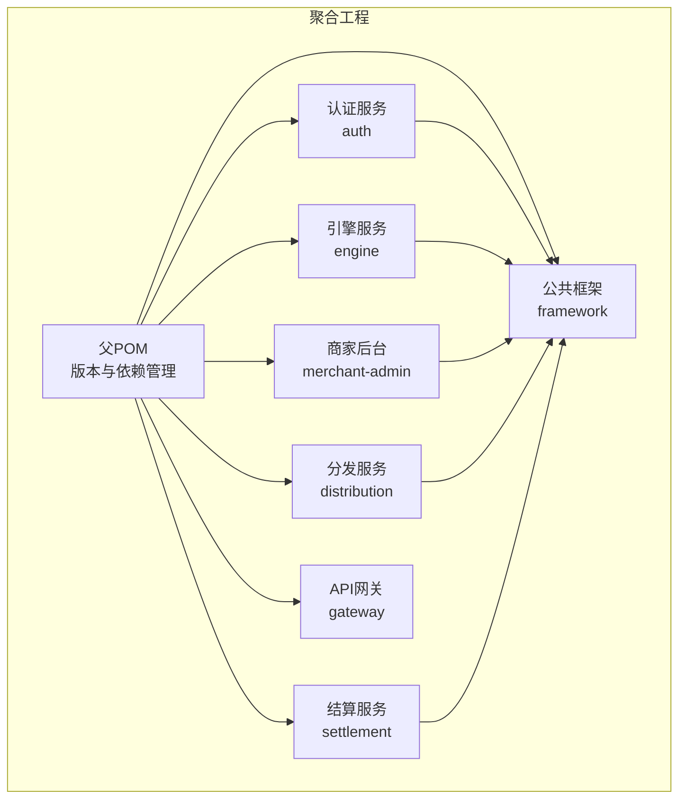
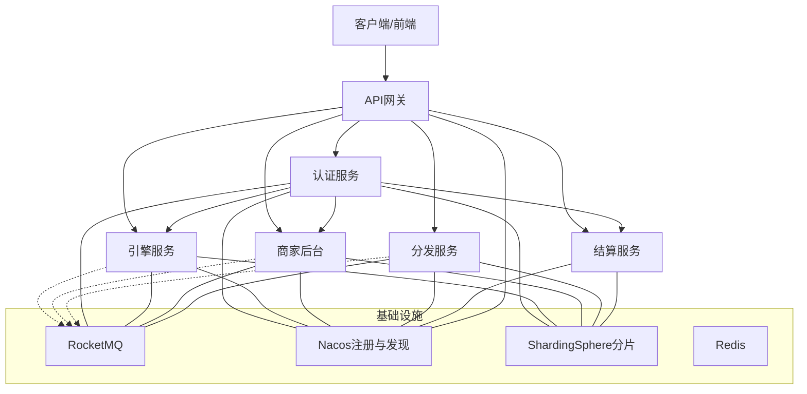
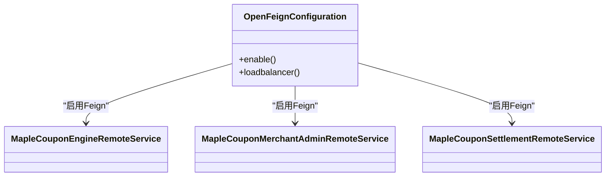
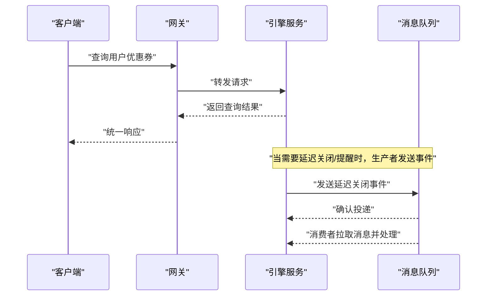
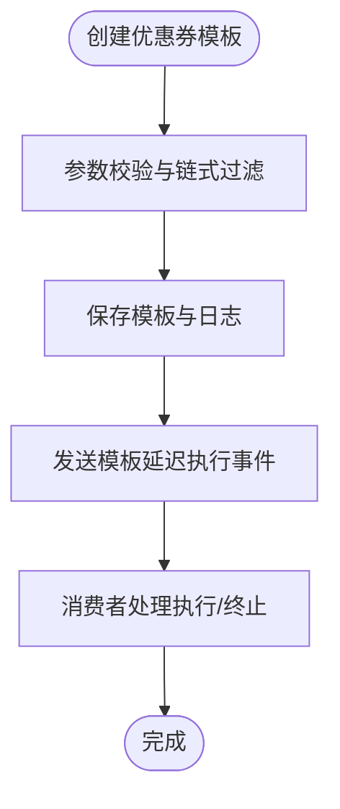
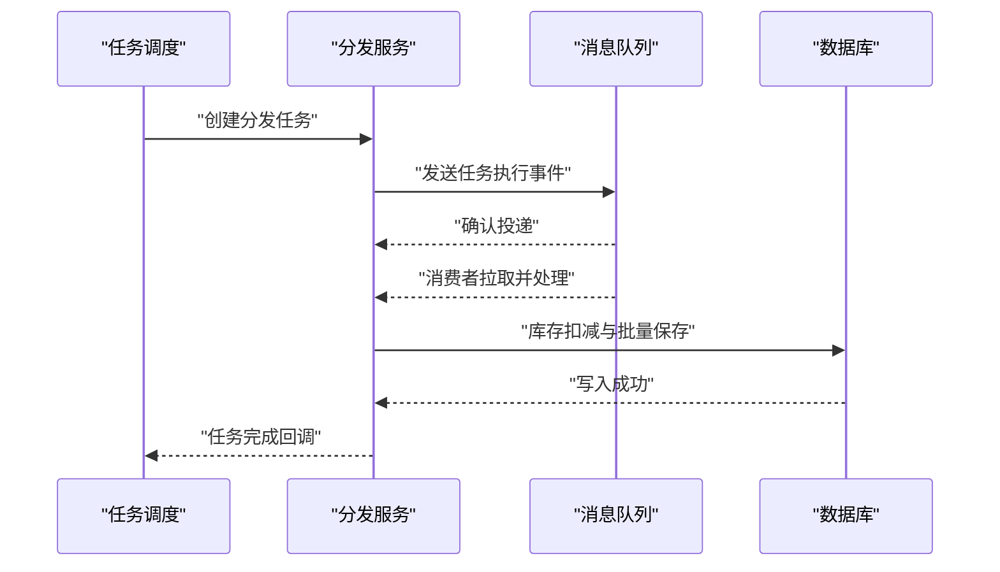
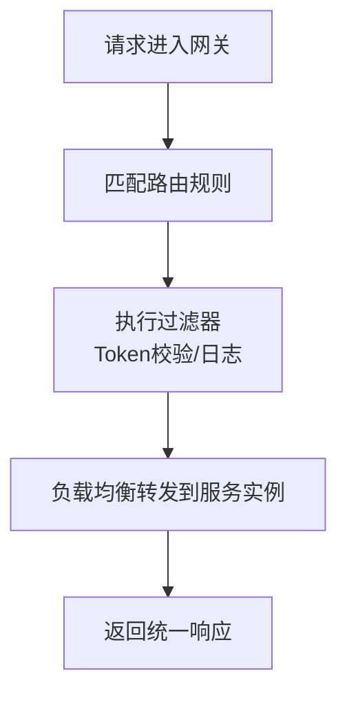
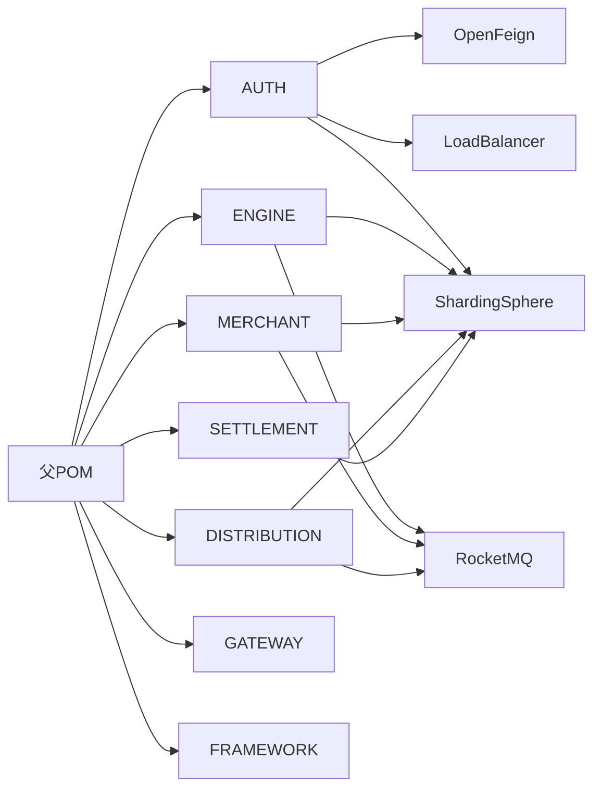

# 微服务架构

<cite>
**本文引用的文件**
- [README.md](file://README.md)
- [pom.xml](file://pom.xml)
- [auth/pom.xml](file://auth/pom.xml)
- [engine/pom.xml](file://engine/pom.xml)
- [distribution/pom.xml](file://distribution/pom.xml)
- [merchant-admin/pom.xml](file://merchant-admin/pom.xml)
- [settlement/pom.xml](file://settlement/pom.xml)
- [gateway/pom.xml](file://gateway/pom.xml)
- [auth/src/main/resources/application.yaml](file://auth/src/main/resources/application.yaml)
- [engine/src/main/resources/application.yaml](file://engine/src/main/resources/application.yaml)
- [distribution/src/main/resources/application.yaml](file://distribution/src/main/resources/application.yaml)
- [merchant-admin/src/main/resources/application.yaml](file://merchant-admin/src/main/resources/application.yaml)
- [settlement/src/main/resources/application.yaml](file://settlement/src/main/resources/application.yaml)
- [gateway/src/main/resources/application.yml](file://gateway/src/main/resources/application.yml)
- [framework/src/main/java/com/fengxin/web/GlobalExceptionHandler.java](file://framework/src/main/java/com/fengxin/web/GlobalExceptionHandler.java)
- [framework/src/main/java/com/fengxin/web/Result.java](file://framework/src/main/java/com/fengxin/web/Result.java)
- [auth/src/main/java/com/fengxin/maplecoupon/auth/common/constant/RocketMQConstant.java](file://auth/src/main/java/com/fengxin/maplecoupon/auth/common/constant/RocketMQConstant.java)
- [engine/src/main/java/com/fengxin/maplecoupon/engine/common/constant/RocketMQConstant.java](file://engine/src/main/java/com/fengxin/maplecoupon/engine/common/constant/RocketMQConstant.java)
- [distribution/src/main/java/com/fengxin/maplecoupon/distribution/common/constant/RocketMQConstant.java](file://distribution/src/main/java/com/fengxin/maplecoupon/distribution/common/constant/RocketMQConstant.java)
- [merchant-admin/src/main/java/com/fengxin/maplecoupon/merchantadmin/common/constant/RocketMQConstant.java](file://merchant-admin/src/main/java/com/fengxin/maplecoupon/merchantadmin/common/constant/RocketMQConstant.java)
- [settlement/src/main/java/com/fengxin/maplecoupon/settlement/common/constant/RocketMQConstant.java](file://settlement/src/main/java/com/fengxin/maplecoupon/settlement/common/constant/RocketMQConstant.java)
- [auth/src/main/java/com/fengxin/maplecoupon/auth/remote/MapleCouponEngineRemoteService.java](file://auth/src/main/java/com/fengxin/maplecoupon/auth/remote/MapleCouponEngineRemoteService.java)
- [auth/src/main/java/com/fengxin/maplecoupon/auth/remote/MapleCouponMerchantAdminRemoteService.java](file://auth/src/main/java/com/fengxin/maplecoupon/auth/remote/MapleCouponMerchantAdminRemoteService.java)
- [auth/src/main/java/com/fengxin/maplecoupon/auth/remote/MapleCouponSettlementRemoteService.java](file://auth/src/main/java/com/fengxin/maplecoupon/auth/remote/MapleCouponSettlementRemoteService.java)
- [auth/src/main/java/com/fengxin/maplecoupon/auth/config/OpenFeignConfiguration.java](file://auth/src/main/java/com/fengxin/maplecoupon/auth/config/OpenFeignConfiguration.java)
- [engine/src/main/java/com/fengxin/maplecoupon/engine/mq/consumer/CanalBinlogSyncUserCouponConsumer.java](file://engine/src/main/java/com/fengxin/maplecoupon/engine/mq/consumer/CanalBinlogSyncUserCouponConsumer.java)
- [engine/src/main/java/com/fengxin/maplecoupon/engine/mq/design/UserCouponDelayCloseEvent.java](file://engine/src/main/java/com/fengxin/maplecoupon/engine/mq/design/UserCouponDelayCloseEvent.java)
- [engine/src/main/java/com/fengxin/maplecoupon/engine/mq/producer/UserCouponDelayCloseProducer.java](file://engine/src/main/java/com/fengxin/maplecoupon/engine/mq/producer/UserCouponDelayCloseProducer.java)
- [distribution/src/main/java/com/fengxin/maplecoupon/distribution/mq/consumer/CouponExecuteDistributionConsumer.java](file://distribution/src/main/java/com/fengxin/maplecoupon/distribution/mq/consumer/CouponExecuteDistributionConsumer.java)
- [distribution/src/main/java/com/fengxin/maplecoupon/distribution/mq/consumer/CouponTaskDistributionConsumer.java](file://distribution/src/main/java/com/fengxin/maplecoupon/distribution/mq/consumer/CouponTaskDistributionConsumer.java)
- [distribution/src/main/java/com/fengxin/maplecoupon/distribution/mq/design/CouponTaskExecuteEvent.java](file://distribution/src/main/java/com/fengxin/maplecoupon/distribution/mq/design/CouponTaskExecuteEvent.java)
- [distribution/src/main/java/com/fengxin/maplecoupon/distribution/mq/producer/CouponExecuteDistributionProducer.java](file://distribution/src/main/java/com/fengxin/maplecoupon/distribution/mq/producer/CouponExecuteDistributionProducer.java)
- [merchant-admin/src/main/java/com/fengxin/maplecoupon/merchantadmin/mq/consumer/MerchantTerminalStatusConsumer.java](file://merchant-admin/src/main/java/com/fengxin/maplecoupon/merchantadmin/mq/consumer/MerchantTerminalStatusConsumer.java)
- [merchant-admin/src/main/java/com/fengxin/maplecoupon/merchantadmin/mq/design/CouponTemplateDelayExecuteEvent.java](file://merchant-admin/src/main/java/com/fengxin/maplecoupon/merchantadmin/mq/design/CouponTemplateDelayExecuteEvent.java)
- [merchant-admin/src/main/java/com/fengxin/maplecoupon/merchantadmin/mq/producer/CouponTemplateDelayTerminalStatusProducer.java](file://merchant-admin/src/main/java/com/fengxin/maplecoupon/merchantadmin/mq/producer/CouponTemplateDelayTerminalStatusProducer.java)
- [gateway/src/main/java/com/fengxin/maplecoupon/gateway/filter/TokenValidateGatewayFilterFactory.java](file://gateway/src/main/java/com/fengxin/maplecoupon/gateway/filter/TokenValidateGatewayFilterFactory.java)
- [gateway/src/main/java/com/fengxin/maplecoupon/gateway/filter/RequestLoggingFilter.java](file://gateway/src/main/java/com/fengxin/maplecoupon/gateway/filter/RequestLoggingFilter.java)
</cite>

## 目录
1. [引言](#引言)
2. [项目结构](#项目结构)
3. [核心组件](#核心组件)
4. [架构总览](#架构总览)
5. [详细组件分析](#详细组件分析)
6. [依赖分析](#依赖分析)
7. [性能考虑](#性能考虑)
8. [故障排查指南](#故障排查指南)
9. [结论](#结论)
10. [附录](#附录)

## 引言
本项目是一个基于Spring Boot 3与Spring Cloud Alibaba的优惠券系统，采用微服务架构，围绕“认证服务、引擎服务、商家后台、分发服务、结算服务、网关服务”六大核心模块构建，覆盖优惠券的创建、分发、核销、提醒、查询与结算等全链路能力。系统同时引入RocketMQ实现异步解耦，ShardingSphere进行数据库分片，Nacos用于服务注册与发现，XXL-Job支持定时任务，EasyExcel处理批量导入导出，配合全局异常与结果封装框架，形成一套高可用、可扩展、可观测的分布式系统。

## 项目结构
项目采用多模块Maven聚合工程组织，父POM集中管理版本与依赖，各微服务模块独立打包运行；公共能力集中在framework模块，提供全局响应体、异常处理、幂等与分布式缓存等基础设施。

图表来源
- [pom.xml:17-34](file://pom.xml#L17-L34)
- [auth/pom.xml:30-35](file://auth/pom.xml#L30-L35)
- [engine/pom.xml:30-35](file://engine/pom.xml#L30-L35)
- [merchant-admin/pom.xml:29-34](file://merchant-admin/pom.xml#L29-L34)
- [distribution/pom.xml:30-35](file://distribution/pom.xml#L30-L35)
- [settlement/pom.xml:30-35](file://settlement/pom.xml#L30-L35)
- [gateway/pom.xml:15-31](file://gateway/pom.xml#L15-L31)

章节来源
- [pom.xml:17-34](file://pom.xml#L17-L34)
- [README.md:1-10](file://README.md#L1-L10)

## 核心组件
- 公共框架（framework）：提供全局响应体、统一异常处理、幂等注解与切面、分布式缓存配置等，所有业务模块复用。
- 认证服务（auth）：负责用户登录、注册、上下文传递与远程调用其他模块的能力，使用OpenFeign进行服务间调用。
- 引擎服务（engine）：负责优惠券模板与用户优惠券的查询、提醒、延迟关闭、与数据库binlog同步等。
- 商家后台（merchant-admin）：负责优惠券模板的创建、编辑、分页查询、任务调度与Excel导入导出，集成XXL-Job。
- 分发服务（distribution）：负责优惠券批次执行、库存扣减、用户记录批量保存、消息生产与消费。
- 结算服务（settlement）：负责订单商品与优惠券的查询与结算辅助。
- API网关（gateway）：统一入口，路由到各后端服务，内置跨域与鉴权过滤器。

章节来源
- [framework/src/main/java/com/fengxin/web/Result.java:17-45](file://framework/src/main/java/com/fengxin/web/Result.java#L17-L45)
- [framework/src/main/java/com/fengxin/web/GlobalExceptionHandler.java:26-68](file://framework/src/main/java/com/fengxin/web/GlobalExceptionHandler.java#L26-L68)
- [gateway/src/main/resources/application.yml:17-64](file://gateway/src/main/resources/application.yml#L17-L64)

## 架构总览
系统采用“网关统一入口 + 多微服务并行 + 消息队列异步 + 数据库分片”的架构模式。服务通过Nacos注册与发现，网关根据路径规则将请求转发至对应服务实例，服务内部通过OpenFeign进行远程调用，通过RocketMQ实现事件驱动的异步解耦。

图表来源
- [gateway/src/main/resources/application.yml:17-64](file://gateway/src/main/resources/application.yml#L17-L64)
- [auth/pom.xml:25-29](file://auth/pom.xml#L25-L29)
- [engine/pom.xml:25-29](file://engine/pom.xml#L25-L29)
- [merchant-admin/pom.xml:24-28](file://merchant-admin/pom.xml#L24-L28)
- [distribution/pom.xml:25-29](file://distribution/pom.xml#L25-L29)
- [settlement/pom.xml:24-28](file://settlement/pom.xml#L24-L28)

## 详细组件分析

### 认证服务（auth）
- 功能定位：用户登录、注册、上下文传递、远程调用引擎、商家后台、结算服务。
- 关键特性：
  - 使用OpenFeign进行远程调用，配置类启用Feign与负载均衡。
  - 使用ShardingSphere进行分库分表，支持多数据库实例。
  - 使用RocketMQ常量定义消息主题与标签，便于后续扩展。
- 服务间通信：
  - 通过OpenFeign调用引擎、商家后台、结算服务的远程接口。
- 配置要点：
  - 应用名称、端口、数据源、MyBatis日志输出、分库数量等。

图表来源
- [auth/src/main/java/com/fengxin/maplecoupon/auth/config/OpenFeignConfiguration.java](file://auth/src/main/java/com/fengxin/maplecoupon/auth/config/OpenFeignConfiguration.java)
- [auth/src/main/java/com/fengxin/maplecoupon/auth/remote/MapleCouponEngineRemoteService.java](file://auth/src/main/java/com/fengxin/maplecoupon/auth/remote/MapleCouponEngineRemoteService.java)
- [auth/src/main/java/com/fengxin/maplecoupon/auth/remote/MapleCouponMerchantAdminRemoteService.java](file://auth/src/main/java/com/fengxin/maplecoupon/auth/remote/MapleCouponMerchantAdminRemoteService.java)
- [auth/src/main/java/com/fengxin/maplecoupon/auth/remote/MapleCouponSettlementRemoteService.java](file://auth/src/main/java/com/fengxin/maplecoupon/auth/remote/MapleCouponSettlementRemoteService.java)

章节来源
- [auth/pom.xml:104-109](file://auth/pom.xml#L104-L109)
- [auth/src/main/resources/application.yaml:1-19](file://auth/src/main/resources/application.yaml#L1-19)
- [auth/src/main/java/com/fengxin/maplecoupon/auth/common/constant/RocketMQConstant.java](file://auth/src/main/java/com/fengxin/maplecoupon/auth/common/constant/RocketMQConstant.java)

### 引擎服务（engine）
- 功能定位：优惠券模板与用户优惠券的查询、提醒、延迟关闭、与数据库binlog同步。
- 关键特性：
  - 使用ShardingSphere进行分库分表，支持多数据库实例。
  - 使用RocketMQ进行事件生产与消费，如延迟关闭、提醒、核销等。
  - 提供延迟关闭事件与消费者，保障状态一致性。
- 数据流：
  - 用户行为触发事件，生产者发送消息；消费者监听并处理，保证最终一致。

图表来源
- [gateway/src/main/resources/application.yml:29-40](file://gateway/src/main/resources/application.yml#L29-L40)
- [engine/src/main/java/com/fengxin/maplecoupon/engine/mq/producer/UserCouponDelayCloseProducer.java](file://engine/src/main/java/com/fengxin/maplecoupon/engine/mq/producer/UserCouponDelayCloseProducer.java)
- [engine/src/main/java/com/fengxin/maplecoupon/engine/mq/consumer/CanalBinlogSyncUserCouponConsumer.java](file://engine/src/main/java/com/fengxin/maplecoupon/engine/mq/consumer/CanalBinlogSyncUserCouponConsumer.java)
- [engine/src/main/java/com/fengxin/maplecoupon/engine/mq/design/UserCouponDelayCloseEvent.java](file://engine/src/main/java/com/fengxin/maplecoupon/engine/mq/design/UserCouponDelayCloseEvent.java)

章节来源
- [engine/pom.xml:25-29](file://engine/pom.xml#L25-L29)
- [engine/src/main/resources/application.yaml:1-22](file://engine/src/main/resources/application.yaml#L1-22)
- [engine/src/main/java/com/fengxin/maplecoupon/engine/common/constant/RocketMQConstant.java](file://engine/src/main/java/com/fengxin/maplecoupon/engine/common/constant/RocketMQConstant.java)

### 商家后台（merchant-admin）
- 功能定位：优惠券模板的创建、编辑、分页查询、任务调度与Excel导入导出。
- 关键特性：
  - 集成XXL-Job进行定时任务调度。
  - 使用ShardingSphere进行分库分表。
  - 使用RocketMQ进行事件生产与消费，如模板延迟执行、终端状态变更等。
- 业务流程：
  - 创建模板后，通过消息队列触发后续执行或终止逻辑。

图表来源
- [merchant-admin/src/main/java/com/fengxin/maplecoupon/merchantadmin/mq/design/CouponTemplateDelayExecuteEvent.java](file://merchant-admin/src/main/java/com/fengxin/maplecoupon/merchantadmin/mq/design/CouponTemplateDelayExecuteEvent.java)
- [merchant-admin/src/main/java/com/fengxin/maplecoupon/merchantadmin/mq/consumer/MerchantTerminalStatusConsumer.java](file://merchant-admin/src/main/java/com/fengxin/maplecoupon/merchantadmin/mq/consumer/MerchantTerminalStatusConsumer.java)
- [merchant-admin/src/main/java/com/fengxin/maplecoupon/merchantadmin/mq/producer/CouponTemplateDelayTerminalStatusProducer.java](file://merchant-admin/src/main/java/com/fengxin/maplecoupon/merchantadmin/mq/producer/CouponTemplateDelayTerminalStatusProducer.java)

章节来源
- [merchant-admin/pom.xml:120-125](file://merchant-admin/pom.xml#L120-L125)
- [merchant-admin/src/main/resources/application.yaml:16-27](file://merchant-admin/src/main/resources/application.yaml#L16-L27)
- [merchant-admin/src/main/java/com/fengxin/maplecoupon/merchantadmin/common/constant/RocketMQConstant.java](file://merchant-admin/src/main/java/com/fengxin/maplecoupon/merchantadmin/common/constant/RocketMQConstant.java)

### 分发服务（distribution）
- 功能定位：优惠券批次执行、库存扣减、用户记录批量保存、消息生产与消费。
- 关键特性：
  - 使用ShardingSphere进行分库分表。
  - 使用RocketMQ进行事件生产与消费，如任务执行、执行结果等。
  - 提供Lua脚本优化库存扣减与批量保存。
- 数据流：
  - 任务触发后，消费者消费事件并执行库存扣减与用户记录写入。

图表来源
- [distribution/src/main/java/com/fengxin/maplecoupon/distribution/mq/design/CouponTaskExecuteEvent.java](file://distribution/src/main/java/com/fengxin/maplecoupon/distribution/mq/design/CouponTaskExecuteEvent.java)
- [distribution/src/main/java/com/fengxin/maplecoupon/distribution/mq/consumer/CouponTaskDistributionConsumer.java](file://distribution/src/main/java/com/fengxin/maplecoupon/distribution/mq/consumer/CouponTaskDistributionConsumer.java)
- [distribution/src/main/java/com/fengxin/maplecoupon/distribution/mq/producer/CouponExecuteDistributionProducer.java](file://distribution/src/main/java/com/fengxin/maplecoupon/distribution/mq/producer/CouponExecuteDistributionProducer.java)

章节来源
- [distribution/pom.xml:93-103](file://distribution/pom.xml#L93-L103)
- [distribution/src/main/resources/application.yaml:1-15](file://distribution/src/main/resources/application.yaml#L1-15)
- [distribution/src/main/java/com/fengxin/maplecoupon/distribution/common/constant/RocketMQConstant.java](file://distribution/src/main/java/com/fengxin/maplecoupon/distribution/common/constant/RocketMQConstant.java)

### 结算服务（settlement）
- 功能定位：订单商品与优惠券的查询与结算辅助。
- 关键特性：
  - 使用ShardingSphere进行分库分表。
  - 提供统一查询接口，供其他服务调用。
- 服务间通信：
  - 通过网关路由到结算服务，供引擎/商家后台等模块调用。

章节来源
- [settlement/pom.xml:24-28](file://settlement/pom.xml#L24-L28)
- [settlement/src/main/resources/application.yaml:1-14](file://settlement/src/main/resources/application.yaml#L1-14)

### 网关服务（gateway）
- 功能定位：统一入口，路由到各后端服务，内置跨域与鉴权过滤器。
- 关键特性：
  - 路由规则：按/api/{service}前缀路由到对应服务。
  - 过滤器：Token校验与请求日志记录。
  - 跨域配置：允许任意来源、方法与头，支持凭证。
- 服务发现：通过lb://协议结合Nacos实现负载均衡。

图表来源
- [gateway/src/main/resources/application.yml:17-64](file://gateway/src/main/resources/application.yml#L17-L64)
- [gateway/src/main/java/com/fengxin/maplecoupon/gateway/filter/TokenValidateGatewayFilterFactory.java](file://gateway/src/main/java/com/fengxin/maplecoupon/gateway/filter/TokenValidateGatewayFilterFactory.java)
- [gateway/src/main/java/com/fengxin/maplecoupon/gateway/filter/RequestLoggingFilter.java](file://gateway/src/main/java/com/fengxin/maplecoupon/gateway/filter/RequestLoggingFilter.java)

章节来源
- [gateway/pom.xml:15-31](file://gateway/pom.xml#L15-L31)
- [gateway/src/main/resources/application.yml:17-64](file://gateway/src/main/resources/application.yml#L17-L64)

## 依赖分析
- 版本与依赖管理：父POM集中管理Spring Boot、Spring Cloud、Spring Cloud Alibaba、MyBatis Plus、ShardingSphere、RocketMQ、FastJSON2、Hutool、Redisson、Guava、XXL-Job、Elasticsearch等版本。
- 模块依赖：
  - 各业务模块依赖framework公共框架，统一异常与响应格式。
  - 认证服务启用OpenFeign与负载均衡，用于远程调用其他服务。
  - 所有服务均引入ShardingSphere以支持分库分表。
  - 引擎、商家后台、分发服务引入RocketMQ以实现异步解耦。

图表来源
- [pom.xml:61-182](file://pom.xml#L61-L182)
- [auth/pom.xml:104-109](file://auth/pom.xml#L104-L109)
- [engine/pom.xml:94-97](file://engine/pom.xml#L94-L97)
- [merchant-admin/pom.xml:101-104](file://merchant-admin/pom.xml#L101-L104)
- [distribution/pom.xml:94-97](file://distribution/pom.xml#L94-L97)

章节来源
- [pom.xml:61-182](file://pom.xml#L61-L182)

## 性能考虑
- 分库分表：通过ShardingSphere对用户、优惠券、模板等表进行分库分表，提升读写吞吐与水平扩展能力。
- 异步解耦：通过RocketMQ实现事件驱动，降低同步调用带来的延迟与耦合。
- 缓存与幂等：框架提供分布式缓存与幂等注解，减少重复操作与热点压力。
- 负载均衡：网关与Feign结合Nacos实现软负载均衡，提升可用性与弹性。
- 日志与监控：统一异常与响应格式，便于日志聚合与指标采集。

## 故障排查指南
- 统一异常处理：全局异常处理器捕获参数校验、业务异常与未捕获异常，统一返回标准响应。
- 响应格式：统一Result对象，包含code、message、data，便于前后端对接与问题定位。
- 网关过滤：Token校验与请求日志过滤器可快速定位鉴权失败与请求异常。

章节来源
- [framework/src/main/java/com/fengxin/web/GlobalExceptionHandler.java:26-68](file://framework/src/main/java/com/fengxin/web/GlobalExceptionHandler.java#L26-L68)
- [framework/src/main/java/com/fengxin/web/Result.java:17-45](file://framework/src/main/java/com/fengxin/web/Result.java#L17-L45)
- [gateway/src/main/java/com/fengxin/maplecoupon/gateway/filter/TokenValidateGatewayFilterFactory.java](file://gateway/src/main/java/com/fengxin/maplecoupon/gateway/filter/TokenValidateGatewayFilterFactory.java)
- [gateway/src/main/java/com/fengxin/maplecoupon/gateway/filter/RequestLoggingFilter.java](file://gateway/src/main/java/com/fengxin/maplecoupon/gateway/filter/RequestLoggingFilter.java)

## 结论
本项目通过清晰的微服务拆分与统一的基础设施，实现了从用户到商家再到结算的完整优惠券生命周期管理。借助网关统一入口、OpenFeign远程调用、RocketMQ异步解耦与ShardingSphere分片，系统具备良好的扩展性、稳定性与可维护性。建议在生产环境中进一步完善配置中心、链路追踪与熔断降级策略，以增强可观测性与高可用性。

## 附录
- 服务端口与路由映射（示例）
  - 网关：10000 → /api/*
  - 商家后台：10010 → /api/merchant-admin/**
  - 引擎服务：10020 → /api/engine/**
  - 结算服务：10030 → /api/settlement/**
  - 分发服务：10040 → /api/distribution/**
  - 认证服务：10070 → /api/auth/**

章节来源
- [gateway/src/main/resources/application.yml:17-64](file://gateway/src/main/resources/application.yml#L17-L64)
- [merchant-admin/src/main/resources/application.yaml:1-27](file://merchant-admin/src/main/resources/application.yaml#L1-L27)
- [engine/src/main/resources/application.yaml:1-22](file://engine/src/main/resources/application.yaml#L1-L22)
- [settlement/src/main/resources/application.yaml:1-14](file://settlement/src/main/resources/application.yaml#L1-L14)
- [distribution/src/main/resources/application.yaml:1-15](file://distribution/src/main/resources/application.yaml#L1-L15)
- [auth/src/main/resources/application.yaml:1-19](file://auth/src/main/resources/application.yaml#L1-L19)