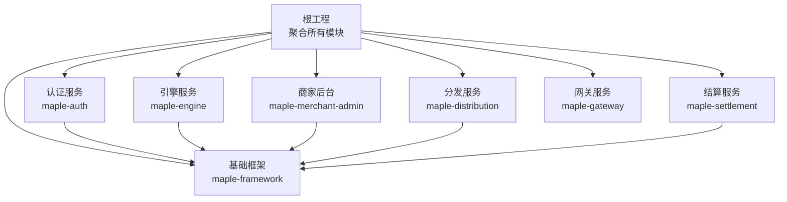
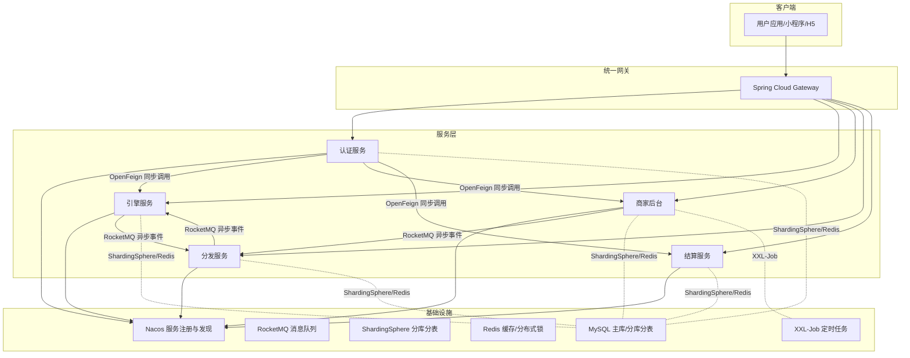
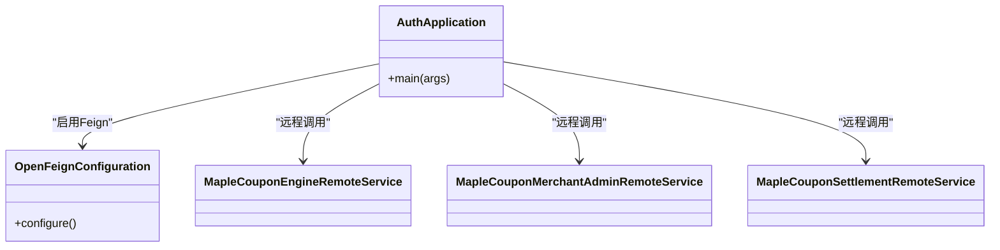
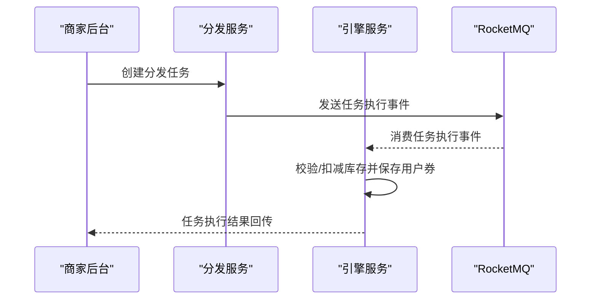
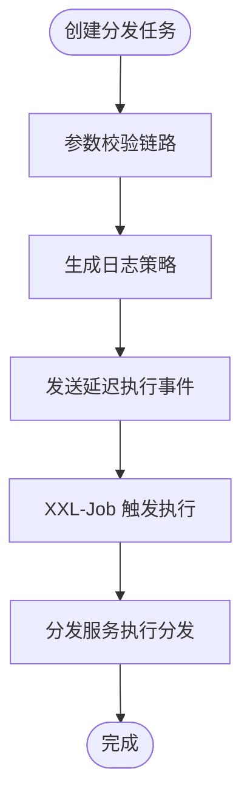
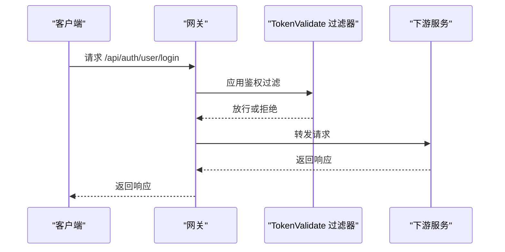
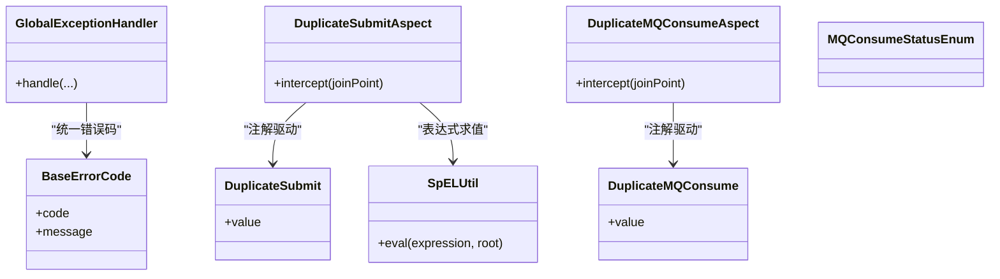
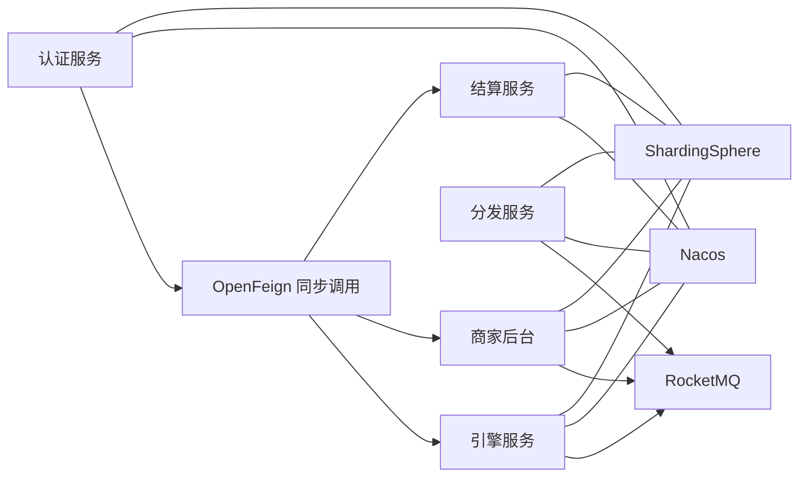

# 整体架构设计

<cite>
**本文引用的文件**
- [README.md](file://README.md)
- [pom.xml](file://pom.xml)
- [auth/pom.xml](file://auth/pom.xml)
- [engine/pom.xml](file://engine/pom.xml)
- [distribution/pom.xml](file://distribution/pom.xml)
- [merchant-admin/pom.xml](file://merchant-admin/pom.xml)
- [settlement/pom.xml](file://settlement/pom.xml)
- [gateway/pom.xml](file://gateway/pom.xml)
- [auth/src/main/resources/application.yaml](file://auth/src/main/resources/application.yaml)
- [engine/src/main/resources/application.yaml](file://engine/src/main/resources/application.yaml)
- [distribution/src/main/resources/application.yaml](file://distribution/src/main/resources/application.yaml)
- [merchant-admin/src/main/resources/application.yaml](file://merchant-admin/src/main/resources/application.yaml)
- [settlement/src/main/resources/application.yaml](file://settlement/src/main/resources/application.yaml)
- [gateway/src/main/resources/application.yml](file://gateway/src/main/resources/application.yml)
- [auth/src/main/java/com/fengxin/maplecoupon/auth/AuthApplication.java](file://auth/src/main/java/com/fengxin/maplecoupon/auth/AuthApplication.java)
- [engine/src/main/java/com/fengxin/maplecoupon/engine/EngineApplication.java](file://engine/src/main/java/com/fengxin/maplecoupon/engine/EngineApplication.java)
- [framework/src/main/java/com/fengxin/config/WebAutoConfiguration.java](file://framework/src/main/java/com/fengxin/config/WebAutoConfiguration.java)
- [framework/src/main/java/com/fengxin/web/GlobalExceptionHandler.java](file://framework/src/main/java/com/fengxin/web/GlobalExceptionHandler.java)
- [framework/src/main/java/com/fengxin/util/SpELUtil.java](file://framework/src/main/java/com/fengxin/util/SpELUtil.java)
- [framework/src/main/java/com/fengxin/enums/MQConsumeStatusEnum.java](file://framework/src/main/java/com/fengxin/enums/MQConsumeStatusEnum.java)
- [framework/src/main/java/com/fengxin/errorcode/BaseErrorCode.java](file://framework/src/main/java/com/fengxin/errorcode/BaseErrorCode.java)
- [framework/src/main/java/com/fengxin/exception/AbstractException.java](file://framework/src/main/java/com/fengxin/exception/AbstractException.java)
- [gateway/src/main/java/com/fengxin/maplecoupon/gateway/filter/TokenValidateGatewayFilterFactory.java](file://gateway/src/main/java/com/fengxin/maplecoupon/gateway/filter/TokenValidateGatewayFilterFactory.java)
- [gateway/src/main/java/com/fengxin/maplecoupon/gateway/common/GatewayErrorResult.java](file://gateway/src/main/java/com/fengxin/maplecoupon/gateway/common/GatewayErrorResult.java)
- [auth/src/main/java/com/fengxin/maplecoupon/auth/config/OpenFeignConfiguration.java](file://auth/src/main/java/com/fengxin/maplecoupon/auth/config/OpenFeignConfiguration.java)
- [auth/src/main/java/com/fengxin/maplecoupon/auth/remote/MapleCouponEngineRemoteService.java](file://auth/src/main/java/com/fengxin/maplecoupon/auth/remote/MapleCouponEngineRemoteService.java)
- [auth/src/main/java/com/fengxin/maplecoupon/auth/remote/MapleCouponMerchantAdminRemoteService.java](file://auth/src/main/java/com/fengxin/maplecoupon/auth/remote/MapleCouponMerchantAdminRemoteService.java)
- [auth/src/main/java/com/fengxin/maplecoupon/auth/remote/MapleCouponSettlementRemoteService.java](file://auth/src/main/java/com/fengxin/maplecoupon/auth/remote/MapleCouponSettlementRemoteService.java)
- [engine/src/main/java/com/fengxin/maplecoupon/engine/mq/consumer/UserCouponRedeemConsumer.java](file://engine/src/main/java/com/fengxin/maplecoupon/engine/mq/consumer/UserCouponRedeemConsumer.java)
- [engine/src/main/java/com/fengxin/maplecoupon/engine/mq/design/UserCouponRedeemEvent.java](file://engine/src/main/java/com/fengxin/maplecoupon/engine/mq/design/UserCouponRedeemEvent.java)
- [distribution/src/main/java/com/fengxin/maplecoupon/distribution/mq/consumer/CouponExecuteDistributionConsumer.java](file://distribution/src/main/java/com/fengxin/maplecoupon/distribution/mq/consumer/CouponExecuteDistributionConsumer.java)
- [distribution/src/main/java/com/fengxin/maplecoupon/distribution/mq/design/CouponTaskExecuteEvent.java](file://distribution/src/main/java/com/fengxin/maplecoupon/distribution/mq/design/CouponTaskExecuteEvent.java)
- [merchant-admin/src/main/java/com/fengxin/maplecoupon/merchantadmin/mq/consumer/CouponTaskSendNumDelayConsumer.java](file://merchant-admin/src/main/java/com/fengxin/maplecoupon/merchantadmin/mq/consumer/CouponTaskSendNumDelayConsumer.java)
- [merchant-admin/src/main/java/com/fengxin/maplecoupon/merchantadmin/mq/design/CouponTaskExecuteEvent.java](file://merchant-admin/src/main/java/com/fengxin/maplecoupon/merchantadmin/mq/design/CouponTaskExecuteEvent.java)
- [engine/src/main/java/com/fengxin/maplecoupon/engine/service/handler/remind/RemindUserCouponTemplate.java](file://engine/src/main/java/com/fengxin/maplecoupon/engine/service/handler/remind/RemindUserCouponTemplate.java)
- [engine/src/main/java/com/fengxin/maplecoupon/engine/service/handler/remind/RemindUserCouponTemplateImpl.java](file://engine/src/main/java/com/fengxin/maplecoupon/engine/service/handler/remind/RemindUserCouponTemplateImpl.java)
- [engine/src/main/java/com/fengxin/maplecoupon/engine/service/handler/remind/SendAppMessageRemindCouponTemplate.java](file://engine/src/main/java/com/fengxin/maplecoupon/engine/service/handler/remind/SendAppMessageRemindCouponTemplate.java)
- [engine/src/main/java/com/fengxin/maplecoupon/engine/service/handler/remind/SendSMSMessageRemindCouponTemplate.java](file://engine/src/main/java/com/fengxin/maplecoupon/engine/service/handler/remind/SendSMSMessageRemindCouponTemplate.java)
- [merchant-admin/src/main/java/com/fengxin/maplecoupon/merchantadmin/job/DistributeCouponTask.java](file://merchant-admin/src/main/java/com/fengxin/maplecoupon/merchantadmin/job/DistributeCouponTask.java)
- [engine/src/main/java/com/fengxin/maplecoupon/engine/util/SetUserCouponTemplateRemindTimeUtil.java](file://engine/src/main/java/com/fengxin/maplecoupon/engine/util/SetUserCouponTemplateRemindTimeUtil.java)
- [engine/src/main/java/com/fengxin/maplecoupon/engine/util/StockDecrementReturnCombinedUtil.java](file://engine/src/main/java/com/fengxin/maplecoupon/engine/util/StockDecrementReturnCombinedUtil.java)
- [distribution/src/main/java/com/fengxin/maplecoupon/distribution/util/StockDecrementReturnCombinedUtil.java](file://distribution/src/main/java/com/fengxin/maplecoupon/distribution/util/StockDecrementReturnCombinedUtil.java)
- [auth/src/main/java/com/fengxin/maplecoupon/auth/common/constant/RocketMQConstant.java](file://auth/src/main/java/com/fengxin/maplecoupon/auth/common/constant/RocketMQConstant.java)
- [engine/src/main/java/com/fengxin/maplecoupon/engine/common/constant/RocketMQConstant.java](file://engine/src/main/java/com/fengxin/maplecoupon/engine/common/constant/RocketMQConstant.java)
- [distribution/src/main/java/com/fengxin/maplecoupon/distribution/common/constant/RocketMQConstant.java](file://distribution/src/main/java/com/fengxin/maplecoupon/distribution/common/constant/RocketMQConstant.java)
- [merchant-admin/src/main/java/com/fengxin/maplecoupon/merchantadmin/common/constant/RocketMQConstant.java](file://merchant-admin/src/main/java/com/fengxin/maplecoupon/merchantadmin/common/constant/RocketMQConstant.java)
- [auth/src/main/java/com/fengxin/maplecoupon/auth/common/constant/EngineRedisConstant.java](file://auth/src/main/java/com/fengxin/maplecoupon/auth/common/constant/EngineRedisConstant.java)
- [engine/src/main/java/com/fengxin/maplecoupon/engine/common/constant/EngineRedisConstant.java](file://engine/src/main/java/com/fengxin/maplecoupon/engine/common/constant/EngineRedisConstant.java)
- [distribution/src/main/java/com/fengxin/maplecoupon/distribution/common/constant/DistributionRedisConstant.java](file://distribution/src/main/java/com/fengxin/maplecoupon/distribution/common/constant/DistributionRedisConstant.java)
- [gateway/src/main/java/com/fengxin/maplecoupon/gateway/common/RedisConstantEnum.java](file://gateway/src/main/java/com/fengxin/maplecoupon/gateway/common/RedisConstantEnum.java)
- [framework/src/main/java/com/fengxin/idempotent/DuplicateMQConsume.java](file://framework/src/main/java/com/fengxin/idempotent/DuplicateMQConsume.java)
- [framework/src/main/java/com/fengxin/idempotent/DuplicateMQConsumeAspect.java](file://framework/src/main/java/com/fengxin/idempotent/DuplicateMQConsumeAspect.java)
- [framework/src/main/java/com/fengxin/idempotent/DuplicateSubmit.java](file://framework/src/main/java/com/fengxin/idempotent/DuplicateSubmit.java)
- [framework/src/main/java/com/fengxin/idempotent/DuplicateSubmitAspect.java](file://framework/src/main/java/com/fengxin/idempotent/DuplicateSubmitAspect.java)
</cite>

## 目录
1. [引言](#引言)
2. [项目结构](#项目结构)
3. [核心组件](#核心组件)
4. [架构总览](#架构总览)
5. [详细组件分析](#详细组件分析)
6. [依赖关系分析](#依赖关系分析)
7. [性能考虑](#性能考虑)
8. [故障排查指南](#故障排查指南)
9. [结论](#结论)
10. [附录](#附录)

## 引言
本项目为第三方优惠券系统，提供优惠券领取、预约提醒、核销、分发与结算能力，并具备百万级用户规模下的高性能与高可用特性。技术栈采用 Spring Boot 3 + Spring Cloud Alibaba + Spring Cloud Gateway + ShardingSphere + RocketMQ + Redis + MySQL + EasyExcel + XXL-Job 等，形成以微服务为核心的分布式架构。

- 项目目标与范围：构建高并发、可扩展、可观测的优惠券平台，覆盖商家后台、用户引擎、分发执行、结算查询、认证鉴权与统一网关。
- 核心技术选型：Nacos 服务注册与发现、OpenFeign 同步调用、RocketMQ 异步消息、ShardingSphere 分库分表、Redis 缓存与分布式锁、全局异常与幂等框架、XXL-Job 定时任务。

**章节来源**
- [README.md:1-10](file://README.md#L1-L10)

## 项目结构
项目采用多模块聚合工程组织，根 POM 统一管理版本与依赖，各子模块独立打包运行，分别承担不同业务域。

**图表来源**
- [pom.xml:17-34](file://pom.xml#L17-L34)

**章节来源**
- [pom.xml:17-34](file://pom.xml#L17-L34)

## 核心组件
- 认证服务（Auth）：负责用户登录、注册、上下文传递与跨服务远程调用。
- 引擎服务（Engine）：负责优惠券模板与用户券的查询、锁定、核销、提醒等核心能力。
- 商家后台（Merchant Admin）：负责优惠券模板管理、任务调度、Excel 导入导出与定时任务。
- 分发服务（Distribution）：负责按批次向用户分发优惠券、执行提醒与失败重试。
- 结算服务（Settlement）：负责订单维度的优惠券查询与结算信息查询。
- 网关服务（Gateway）：统一入口、路由转发、鉴权过滤与跨域配置。
- 基础框架（Framework）：全局异常、结果封装、幂等、配置与通用枚举。

**章节来源**
- [pom.xml:17-34](file://pom.xml#L17-L34)

## 架构总览
系统采用“统一网关 + 多微服务 + 消息驱动”的架构模式，服务间通过 Nacos 注册发现、OpenFeign 同步调用与 RocketMQ 异步解耦协作；ShardingSphere 实现数据库水平扩展；Redis 提供缓存与分布式能力；XXL-Job 承担定时任务。

**图表来源**
- [gateway/src/main/resources/application.yml:17-64](file://gateway/src/main/resources/application.yml#L17-L64)
- [auth/src/main/java/com/fengxin/maplecoupon/auth/AuthApplication.java:15-18](file://auth/src/main/java/com/fengxin/maplecoupon/auth/AuthApplication.java#L15-L18)
- [engine/src/main/java/com/fengxin/maplecoupon/engine/EngineApplication.java:13-15](file://engine/src/main/java/com/fengxin/maplecoupon/engine/EngineApplication.java#L13-L15)
- [merchant-admin/src/main/java/com/fengxin/maplecoupon/merchantadmin/job/DistributeCouponTask.java](file://merchant-admin/src/main/java/com/fengxin/maplecoupon/merchantadmin/job/DistributeCouponTask.java)
- [engine/src/main/java/com/fengxin/maplecoupon/engine/mq/consumer/UserCouponRedeemConsumer.java](file://engine/src/main/java/com/fengxin/maplecoupon/engine/mq/consumer/UserCouponRedeemConsumer.java)
- [distribution/src/main/java/com/fengxin/maplecoupon/distribution/mq/consumer/CouponExecuteDistributionConsumer.java](file://distribution/src/main/java/com/fengxin/maplecoupon/distribution/mq/consumer/CouponExecuteDistributionConsumer.java)

## 详细组件分析

### 认证服务（Auth）
- 功能定位：用户身份认证与授权、上下文透传、跨服务远程调用。
- 关键点：
  - 开启服务注册与 Feign 客户端扫描，面向引擎、商家后台、结算服务提供远程接口。
  - 使用 ShardingSphere 驱动与 MyBatis-Plus 访问分库分表用户数据。
  - 提供用户登录、注册、更新等控制器接口。
- 通信机制：
  - 同步调用：通过 OpenFeign 调用引擎、商家后台、结算服务的远程接口。
  - 异步消息：基于 RocketMQ 常量与消费者/生产者模板进行事件编排。
  - 上下文传递：拦截器与线程本地变量实现用户信息透传。

**图表来源**
- [auth/src/main/java/com/fengxin/maplecoupon/auth/AuthApplication.java:15-18](file://auth/src/main/java/com/fengxin/maplecoupon/auth/AuthApplication.java#L15-L18)
- [auth/src/main/java/com/fengxin/maplecoupon/auth/config/OpenFeignConfiguration.java](file://auth/src/main/java/com/fengxin/maplecoupon/auth/config/OpenFeignConfiguration.java)
- [auth/src/main/java/com/fengxin/maplecoupon/auth/remote/MapleCouponEngineRemoteService.java](file://auth/src/main/java/com/fengxin/maplecoupon/auth/remote/MapleCouponEngineRemoteService.java)
- [auth/src/main/java/com/fengxin/maplecoupon/auth/remote/MapleCouponMerchantAdminRemoteService.java](file://auth/src/main/java/com/fengxin/maplecoupon/auth/remote/MapleCouponMerchantAdminRemoteService.java)
- [auth/src/main/java/com/fengxin/maplecoupon/auth/remote/MapleCouponSettlementRemoteService.java](file://auth/src/main/java/com/fengxin/maplecoupon/auth/remote/MapleCouponSettlementRemoteService.java)

**章节来源**
- [auth/pom.xml:14-111](file://auth/pom.xml#L14-L111)
- [auth/src/main/resources/application.yaml:1-19](file://auth/src/main/resources/application.yaml#L1-L19)
- [auth/src/main/java/com/fengxin/maplecoupon/auth/AuthApplication.java:15-18](file://auth/src/main/java/com/fengxin/maplecoupon/auth/AuthApplication.java#L15-L18)

### 引擎服务（Engine）
- 功能定位：优惠券模板与用户券的核心生命周期管理，包括查询、锁定、核销、提醒与延迟关闭。
- 关键点：
  - 通过 ShardingSphere 分库分表访问用户券与模板数据。
  - 基于 RocketMQ 消费核销、提醒、延迟关闭等事件，保证最终一致性。
  - 提供提醒策略接口与多种提醒方式实现（如站内信、短信）。
  - 提供库存扣减与批量保存的组合工具，保障高并发场景下的原子性。
- 通信机制：
  - 同步调用：被认证服务等上游通过 Feign 调用。
  - 异步消息：消费来自分发服务与自身产生的事件，驱动状态流转。

**图表来源**
- [merchant-admin/src/main/java/com/fengxin/maplecoupon/merchantadmin/mq/design/CouponTaskExecuteEvent.java](file://merchant-admin/src/main/java/com/fengxin/maplecoupon/merchantadmin/mq/design/CouponTaskExecuteEvent.java)
- [distribution/src/main/java/com/fengxin/maplecoupon/distribution/mq/consumer/CouponExecuteDistributionConsumer.java](file://distribution/src/main/java/com/fengxin/maplecoupon/distribution/mq/consumer/CouponExecuteDistributionConsumer.java)
- [engine/src/main/java/com/fengxin/maplecoupon/engine/mq/consumer/UserCouponRedeemConsumer.java](file://engine/src/main/java/com/fengxin/maplecoupon/engine/mq/consumer/UserCouponRedeemConsumer.java)

**章节来源**
- [engine/pom.xml:14-103](file://engine/pom.xml#L14-L103)
- [engine/src/main/resources/application.yaml:1-22](file://engine/src/main/resources/application.yaml#L1-L22)
- [engine/src/main/java/com/fengxin/maplecoupon/engine/EngineApplication.java:13-15](file://engine/src/main/java/com/fengxin/maplecoupon/engine/EngineApplication.java#L13-L15)

### 商家后台（Merchant Admin）
- 功能定位：优惠券模板管理、任务创建与调度、Excel 导入导出、日志记录与定时任务。
- 关键点：
  - 提供优惠券模板的创建、分页查询、终止等接口。
  - 通过 RocketMQ 延迟发送与执行事件，实现任务的定时分发。
  - 使用 XXL-Job 执行周期性任务（如分发任务）。
  - 参数校验链路与日志策略工厂，确保业务正确性与可追溯性。
- 通信机制：
  - 同步调用：对外提供 REST 接口，内部通过 RocketMQ 与分发服务交互。

**图表来源**
- [merchant-admin/src/main/java/com/fengxin/maplecoupon/merchantadmin/mq/design/CouponTaskExecuteEvent.java](file://merchant-admin/src/main/java/com/fengxin/maplecoupon/merchantadmin/mq/design/CouponTaskExecuteEvent.java)
- [merchant-admin/src/main/java/com/fengxin/maplecoupon/merchantadmin/job/DistributeCouponTask.java](file://merchant-admin/src/main/java/com/fengxin/maplecoupon/merchantadmin/job/DistributeCouponTask.java)

**章节来源**
- [merchant-admin/pom.xml:13-125](file://merchant-admin/pom.xml#L13-L125)
- [merchant-admin/src/main/resources/application.yaml:1-27](file://merchant-admin/src/main/resources/application.yaml#L1-L27)

### 分发服务（Distribution）
- 功能定位：按批次向用户分发优惠券，支持提醒与失败重试，保障大规模并发下的稳定性。
- 关键点：
  - 基于 RocketMQ 消费任务执行事件，触发分发流程。
  - 提供库存扣减与批量保存的 Lua 脚本与工具，提升写入性能与一致性。
  - Excel 导入监听器与失败记录表，支撑批量导入与重试。
- 通信机制：
  - 异步消息：消费来自商家后台的任务执行事件，产出分发执行事件给引擎服务。

**章节来源**
- [distribution/pom.xml:14-104](file://distribution/pom.xml#L14-L104)
- [distribution/src/main/resources/application.yaml:1-15](file://distribution/src/main/resources/application.yaml#L1-L15)

### 结算服务（Settlement）
- 功能定位：面向订单维度的优惠券查询与结算信息查询，为支付与财务对账提供数据支撑。
- 关键点：
  - 通过 ShardingSphere 访问用户券与模板数据，提供查询接口。
  - 与引擎服务协同，确保查询结果的准确性与时效性。
- 通信机制：
  - 同步调用：被认证服务等上游通过 Feign 调用。

**章节来源**
- [settlement/pom.xml:14-93](file://settlement/pom.xml#L14-L93)
- [settlement/src/main/resources/application.yaml:1-14](file://settlement/src/main/resources/application.yaml#L1-L14)

### 网关服务（Gateway）
- 功能定位：统一入口、路由转发、鉴权过滤与跨域配置。
- 关键点：
  - 配置多条路由规则，将 /api/{service}/** 请求转发至对应下游服务。
  - 内置 Token 验证过滤器，支持白名单路径与黑名单路径配置。
  - 全局 CORS 配置，便于前端跨域访问。
- 通信机制：
  - 路由转发：lb:// 服务名自动结合负载均衡与服务发现。

**图表来源**
- [gateway/src/main/resources/application.yml:17-64](file://gateway/src/main/resources/application.yml#L17-L64)
- [gateway/src/main/java/com/fengxin/maplecoupon/gateway/filter/TokenValidateGatewayFilterFactory.java](file://gateway/src/main/java/com/fengxin/maplecoupon/gateway/filter/TokenValidateGatewayFilterFactory.java)
- [gateway/src/main/java/com/fengxin/maplecoupon/gateway/common/GatewayErrorResult.java](file://gateway/src/main/java/com/fengxin/maplecoupon/gateway/common/GatewayErrorResult.java)

**章节来源**
- [gateway/pom.xml:14-54](file://gateway/pom.xml#L14-L54)
- [gateway/src/main/resources/application.yml:1-72](file://gateway/src/main/resources/application.yml#L1-L72)

### 基础框架（Framework）
- 功能定位：全局异常处理、统一返回结果、幂等控制、Web 自动装配与通用枚举。
- 关键点：
  - 全局异常处理器与错误码基类，规范异常与返回格式。
  - 幂等注解与切面，防止重复提交与重复消费 MQ。
  - SpEL 工具类，支持表达式解析与动态判断。
  - MQ 消费状态枚举，统一消费结果语义。
- 通信机制：
  - 作为通用依赖被各服务模块引入，统一治理。

**图表来源**
- [framework/src/main/java/com/fengxin/web/GlobalExceptionHandler.java](file://framework/src/main/java/com/fengxin/web/GlobalExceptionHandler.java)
- [framework/src/main/java/com/fengxin/errorcode/BaseErrorCode.java](file://framework/src/main/java/com/fengxin/errorcode/BaseErrorCode.java)
- [framework/src/main/java/com/fengxin/idempotent/DuplicateSubmit.java](file://framework/src/main/java/com/fengxin/idempotent/DuplicateSubmit.java)
- [framework/src/main/java/com/fengxin/idempotent/DuplicateSubmitAspect.java](file://framework/src/main/java/com/fengxin/idempotent/DuplicateSubmitAspect.java)
- [framework/src/main/java/com/fengxin/idempotent/DuplicateMQConsume.java](file://framework/src/main/java/com/fengxin/idempotent/DuplicateMQConsume.java)
- [framework/src/main/java/com/fengxin/idempotent/DuplicateMQConsumeAspect.java](file://framework/src/main/java/com/fengxin/idempotent/DuplicateMQConsumeAspect.java)
- [framework/src/main/java/com/fengxin/enums/MQConsumeStatusEnum.java](file://framework/src/main/java/com/fengxin/enums/MQConsumeStatusEnum.java)
- [framework/src/main/java/com/fengxin/util/SpELUtil.java](file://framework/src/main/java/com/fengxin/util/SpELUtil.java)

**章节来源**
- [framework/src/main/java/com/fengxin/config/WebAutoConfiguration.java](file://framework/src/main/java/com/fengxin/config/WebAutoConfiguration.java)
- [framework/src/main/java/com/fengxin/web/GlobalExceptionHandler.java](file://framework/src/main/java/com/fengxin/web/GlobalExceptionHandler.java)
- [framework/src/main/java/com/fengxin/errorcode/BaseErrorCode.java](file://framework/src/main/java/com/fengxin/errorcode/BaseErrorCode.java)
- [framework/src/main/java/com/fengxin/idempotent/DuplicateSubmit.java](file://framework/src/main/java/com/fengxin/idempotent/DuplicateSubmit.java)
- [framework/src/main/java/com/fengxin/idempotent/DuplicateSubmitAspect.java](file://framework/src/main/java/com/fengxin/idempotent/DuplicateSubmitAspect.java)
- [framework/src/main/java/com/fengxin/idempotent/DuplicateMQConsume.java](file://framework/src/main/java/com/fengxin/idempotent/DuplicateMQConsume.java)
- [framework/src/main/java/com/fengxin/idempotent/DuplicateMQConsumeAspect.java](file://framework/src/main/java/com/fengxin/idempotent/DuplicateMQConsumeAspect.java)
- [framework/src/main/java/com/fengxin/enums/MQConsumeStatusEnum.java](file://framework/src/main/java/com/fengxin/enums/MQConsumeStatusEnum.java)
- [framework/src/main/java/com/fengxin/util/SpELUtil.java](file://framework/src/main/java/com/fengxin/util/SpELUtil.java)

## 依赖关系分析
- 服务发现与负载均衡：各服务均开启 @EnableDiscoveryClient，网关使用 lb:// 协议结合负载均衡。
- 同步调用：认证服务通过 OpenFeign 调用引擎、商家后台、结算服务。
- 异步消息：服务间通过 RocketMQ 解耦，事件类型涵盖任务执行、核销、提醒、延迟关闭等。
- 分库分表：ShardingSphere 驱动与配置文件，按数据库与表规则进行分片。
- 幂等与安全：框架层提供幂等注解与切面，网关提供 Token 验证过滤器。

**图表来源**
- [auth/src/main/java/com/fengxin/maplecoupon/auth/AuthApplication.java:15-18](file://auth/src/main/java/com/fengxin/maplecoupon/auth/AuthApplication.java#L15-L18)
- [auth/src/main/java/com/fengxin/maplecoupon/auth/config/OpenFeignConfiguration.java](file://auth/src/main/java/com/fengxin/maplecoupon/auth/config/OpenFeignConfiguration.java)
- [gateway/src/main/resources/application.yml:17-64](file://gateway/src/main/resources/application.yml#L17-L64)

**章节来源**
- [auth/pom.xml:103-109](file://auth/pom.xml#L103-L109)
- [gateway/pom.xml:17-30](file://gateway/pom.xml#L17-L30)

## 性能考虑
- 分库分表与读写分离：通过 ShardingSphere 对用户券、模板等核心表进行分库分表，降低单表压力。
- 缓存与热点保护：Redis 用于缓存热点数据与分布式锁，避免数据库抖动。
- 异步解耦：大量写入与耗时操作通过 RocketMQ 异步化，提升吞吐与可用性。
- 幂等与重试：框架层提供幂等注解与 MQ 消费状态枚举，配合 RocketMQ 的重试机制，保证数据一致性与系统稳定性。
- 负载均衡与限流：网关层结合 Nacos 与负载均衡，可配合限流策略保障下游稳定。
- 批量操作：Lua 脚本与批量写入工具减少网络往返与事务冲突。

[本节为通用性能指导，无需具体文件引用]

## 故障排查指南
- 网关鉴权问题：检查网关路由与 Token 验证过滤器配置，确认白名单/黑名单路径是否正确。
- 服务不可见：确认 Nacos 注册状态，检查服务启动日志与端口占用。
- RocketMQ 消费异常：查看 MQ 消费状态枚举与消费者实现，定位重复消费或消费失败原因。
- 幂等冲突：排查重复提交与重复 MQ 消费注解是否正确使用，结合 SpEL 表达式进行条件判断。
- 全局异常：通过全局异常处理器与错误码基类定位异常类型与提示信息。

**章节来源**
- [gateway/src/main/resources/application.yml:17-64](file://gateway/src/main/resources/application.yml#L17-L64)
- [gateway/src/main/java/com/fengxin/maplecoupon/gateway/filter/TokenValidateGatewayFilterFactory.java](file://gateway/src/main/java/com/fengxin/maplecoupon/gateway/filter/TokenValidateGatewayFilterFactory.java)
- [framework/src/main/java/com/fengxin/web/GlobalExceptionHandler.java](file://framework/src/main/java/com/fengxin/web/GlobalExceptionHandler.java)
- [framework/src/main/java/com/fengxin/enums/MQConsumeStatusEnum.java](file://framework/src/main/java/com/fengxin/enums/MQConsumeStatusEnum.java)
- [framework/src/main/java/com/fengxin/idempotent/DuplicateSubmitAspect.java](file://framework/src/main/java/com/fengxin/idempotent/DuplicateSubmitAspect.java)
- [framework/src/main/java/com/fengxin/idempotent/DuplicateMQConsumeAspect.java](file://framework/src/main/java/com/fengxin/idempotent/DuplicateMQConsumeAspect.java)

## 结论
MapleCoupon 通过清晰的服务边界与统一的基础设施，实现了高并发、可扩展且可观测的优惠券系统。网关统一入口、服务间异步解耦、分库分表与缓存策略共同保障了系统的性能与稳定性；框架层的全局异常、幂等与通用工具提升了开发效率与质量。后续可在限流降级、监控告警与容量规划方面进一步完善。

[本节为总结性内容，无需具体文件引用]

## 附录
- 服务端口与命名约定：
  - 网关：10000
  - 商家后台：10010
  - 引擎服务：10020
  - 结算服务：10030
  - 分发服务：10040
  - 认证服务：10070
- 关键常量与枚举：
  - RocketMQ 常量：各模块 common/constant 下存在 RocketMQ 常量定义。
  - Redis 常量：认证与引擎模块存在 EngineRedisConstant，分发模块存在 DistributionRedisConstant，网关存在 RedisConstantEnum。
  - MQ 消费状态枚举：MQConsumeStatusEnum 用于统一消费结果语义。

**章节来源**
- [gateway/src/main/resources/application.yml:1-72](file://gateway/src/main/resources/application.yml#L1-L72)
- [auth/src/main/resources/application.yaml:1-19](file://auth/src/main/resources/application.yaml#L1-L19)
- [engine/src/main/resources/application.yaml:1-22](file://engine/src/main/resources/application.yaml#L1-L22)
- [distribution/src/main/resources/application.yaml:1-15](file://distribution/src/main/resources/application.yaml#L1-L15)
- [merchant-admin/src/main/resources/application.yaml:1-27](file://merchant-admin/src/main/resources/application.yaml#L1-L27)
- [settlement/src/main/resources/application.yaml:1-14](file://settlement/src/main/resources/application.yaml#L1-L14)
- [auth/src/main/java/com/fengxin/maplecoupon/auth/common/constant/RocketMQConstant.java](file://auth/src/main/java/com/fengxin/maplecoupon/auth/common/constant/RocketMQConstant.java)
- [engine/src/main/java/com/fengxin/maplecoupon/engine/common/constant/RocketMQConstant.java](file://engine/src/main/java/com/fengxin/maplecoupon/engine/common/constant/RocketMQConstant.java)
- [distribution/src/main/java/com/fengxin/maplecoupon/distribution/common/constant/RocketMQConstant.java](file://distribution/src/main/java/com/fengxin/maplecoupon/distribution/common/constant/RocketMQConstant.java)
- [merchant-admin/src/main/java/com/fengxin/maplecoupon/merchantadmin/common/constant/RocketMQConstant.java](file://merchant-admin/src/main/java/com/fengxin/maplecoupon/merchantadmin/common/constant/RocketMQConstant.java)
- [auth/src/main/java/com/fengxin/maplecoupon/auth/common/constant/EngineRedisConstant.java](file://auth/src/main/java/com/fengxin/maplecoupon/auth/common/constant/EngineRedisConstant.java)
- [engine/src/main/java/com/fengxin/maplecoupon/engine/common/constant/EngineRedisConstant.java](file://engine/src/main/java/com/fengxin/maplecoupon/engine/common/constant/EngineRedisConstant.java)
- [distribution/src/main/java/com/fengxin/maplecoupon/distribution/common/constant/DistributionRedisConstant.java](file://distribution/src/main/java/com/fengxin/maplecoupon/distribution/common/constant/DistributionRedisConstant.java)
- [gateway/src/main/java/com/fengxin/maplecoupon/gateway/common/RedisConstantEnum.java](file://gateway/src/main/java/com/fengxin/maplecoupon/gateway/common/RedisConstantEnum.java)