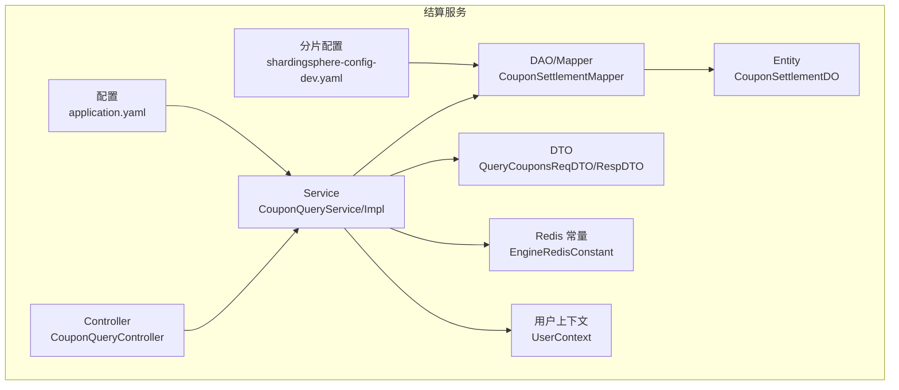
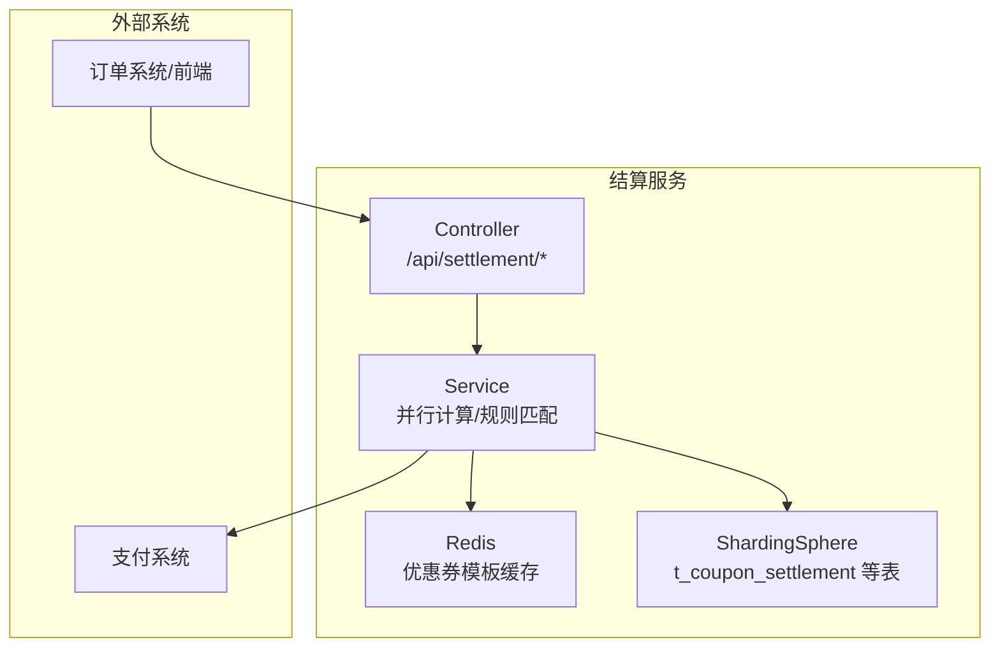
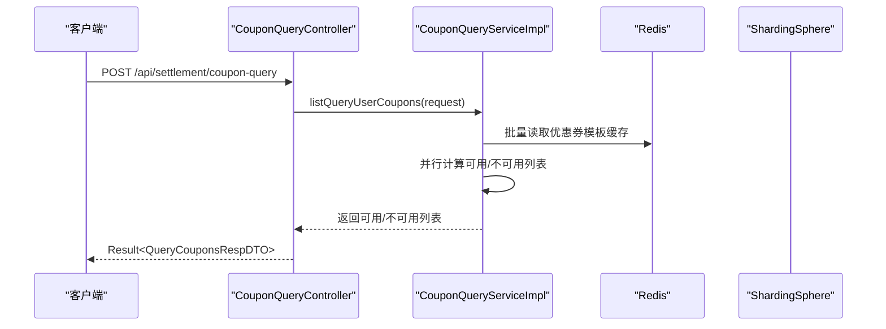
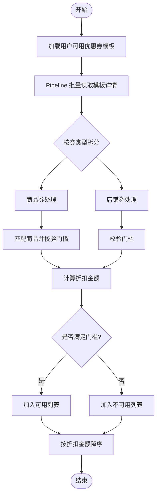
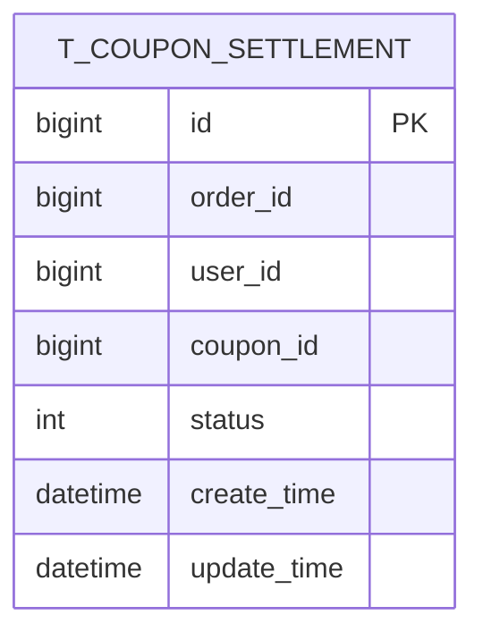
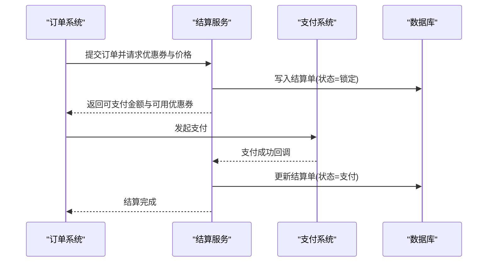
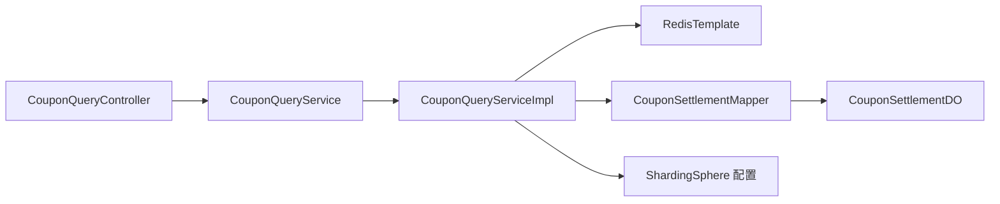

# 结算服务模块

<cite>
**本文引用的文件**
- [SettlementApplication.java](file://settlement/src/main/java/com/fengxin/maplecoupon/settlement/SettlementApplication.java)
- [CouponQueryController.java](file://settlement/src/main/java/com/fengxin/maplecoupon/settlement/controller/CouponQueryController.java)
- [CouponQueryService.java](file://settlement/src/main/java/com/fengxin/maplecoupon/settlement/service/CouponQueryService.java)
- [CouponQueryServiceImpl.java](file://settlement/src/main/java/com/fengxin/maplecoupon/settlement/service/impl/CouponQueryServiceImpl.java)
- [CouponSettlementMapper.java](file://settlement/src/main/java/com/fengxin/maplecoupon/settlement/dao/mapper/CouponSettlementMapper.java)
- [CouponSettlementDO.java](file://settlement/src/main/java/com/fengxin/maplecoupon/settlement/dao/entity/CouponSettlementDO.java)
- [QueryCouponsReqDTO.java](file://settlement/src/main/java/com/fengxin/maplecoupon/settlement/dto/req/QueryCouponsReqDTO.java)
- [QueryCouponsRespDTO.java](file://settlement/src/main/java/com/fengxin/maplecoupon/settlement/dto/resp/QueryCouponsRespDTO.java)
- [QueryCouponsDetailRespDTO.java](file://settlement/src/main/java/com/fengxin/maplecoupon/settlement/dto/resp/QueryCouponsDetailRespDTO.java)
- [EngineRedisConstant.java](file://settlement/src/main/java/com/fengxin/maplecoupon/settlement/common/constant/EngineRedisConstant.java)
- [application.yaml](file://settlement/src/main/resources/application.yaml)
- [shardingsphere-config-dev.yaml](file://settlement/src/main/resources/shardingsphere-config-dev.yaml)
- [UserContext.java](file://settlement/src/main/java/com/fengxin/maplecoupon/settlement/common/context/UserContext.java)
- [SettlementController.java](file://auth/src/main/java/com/fengxin/maplecoupon/auth/controller/SettlementController.java)
- [MapleCouponSettlementRemoteService.java](file://auth/src/main/java/com/fengxin/maplecoupon/auth/remote/MapleCouponSettlementRemoteService.java)
</cite>

## 目录
1. [简介](#简介)
2. [项目结构](#项目结构)
3. [核心组件](#核心组件)
4. [架构总览](#架构总览)
5. [详细组件分析](#详细组件分析)
6. [依赖分析](#依赖分析)
7. [性能考虑](#性能考虑)
8. [故障排查指南](#故障排查指南)
9. [结论](#结论)
10. [附录](#附录)

## 简介
本模块为“结算服务”，负责在用户下单时对订单金额进行计算，并结合优惠券系统返回可用/不可用的优惠券列表。其核心能力包括：
- 异步/同步查询用户可用优惠券列表
- 基于订单金额与商品维度的优惠规则匹配
- 优惠券类型（立减、满减、折扣）的金额计算
- 与支付系统的集成点与结算流程设计
- 数据库分片策略、查询优化与缓存机制
- 优惠券核销验证、状态更新与结算记录生成
- 异常处理、回滚机制与数据一致性保障
- 完整的结算API接口文档与扩展集成指南

## 项目结构
结算服务采用标准 Spring Boot 结构，核心目录与职责如下：
- controller：对外暴露查询接口，支持异步与同步两种模式
- service：定义查询服务接口与实现，包含高性能并发计算逻辑
- dao/mapper：基于 MyBatis-Plus 的 Mapper 接口
- dao/entity：持久化实体类，包含 t_coupon_settlement 结算单表映射
- dto：请求与响应参数模型
- common/constant：Redis 常量定义
- resources：应用配置与 ShardingSphere 分片配置
- common/context：用户上下文传递工具

**图表来源**
- [CouponQueryController.java:1-40](file://settlement/src/main/java/com/fengxin/maplecoupon/settlement/controller/CouponQueryController.java#L1-L40)
- [CouponQueryServiceImpl.java:1-318](file://settlement/src/main/java/com/fengxin/maplecoupon/settlement/service/impl/CouponQueryServiceImpl.java#L1-L318)
- [CouponSettlementMapper.java:1-14](file://settlement/src/main/java/com/fengxin/maplecoupon/settlement/dao/mapper/CouponSettlementMapper.java#L1-L14)
- [CouponSettlementDO.java:1-57](file://settlement/src/main/java/com/fengxin/maplecoupon/settlement/dao/entity/CouponSettlementDO.java#L1-L57)
- [QueryCouponsReqDTO.java:1-39](file://settlement/src/main/java/com/fengxin/maplecoupon/settlement/dto/req/QueryCouponsReqDTO.java#L1-L39)
- [EngineRedisConstant.java:1-51](file://settlement/src/main/java/com/fengxin/maplecoupon/settlement/common/constant/EngineRedisConstant.java#L1-L51)
- [application.yaml:1-14](file://settlement/src/main/resources/application.yaml#L1-L14)
- [shardingsphere-config-dev.yaml:1-100](file://settlement/src/main/resources/shardingsphere-config-dev.yaml#L1-L100)
- [UserContext.java:1-63](file://settlement/src/main/java/com/fengxin/maplecoupon/settlement/common/context/UserContext.java#L1-L63)

**章节来源**
- [SettlementApplication.java:1-17](file://settlement/src/main/java/com/fengxin/maplecoupon/settlement/SettlementApplication.java#L1-L17)
- [application.yaml:1-14](file://settlement/src/main/resources/application.yaml#L1-L14)

## 核心组件
- 控制器层
  - 提供异步与同步两类查询接口，分别调用服务层进行处理
- 服务层
  - 异步模式：使用线程池与并行流，按店铺券与商品券并行计算可用性与折扣金额
  - 同步模式：顺序遍历，逐条计算并返回结果
- DAO 层
  - 提供 t_coupon_settlement 结算单表的持久化接口
- DTO 层
  - 定义查询请求与响应的数据结构，包含订单金额、商品集合等关键字段
- 缓存与上下文
  - 使用 Redis 缓存优惠券模板，通过 Pipeline 批量读取提升性能
  - 通过 UserContext 传递用户与店铺上下文信息

**章节来源**
- [CouponQueryController.java:1-40](file://settlement/src/main/java/com/fengxin/maplecoupon/settlement/controller/CouponQueryController.java#L1-L40)
- [CouponQueryService.java:1-30](file://settlement/src/main/java/com/fengxin/maplecoupon/settlement/service/CouponQueryService.java#L1-L30)
- [CouponQueryServiceImpl.java:1-318](file://settlement/src/main/java/com/fengxin/maplecoupon/settlement/service/impl/CouponQueryServiceImpl.java#L1-L318)
- [CouponSettlementMapper.java:1-14](file://settlement/src/main/java/com/fengxin/maplecoupon/settlement/dao/mapper/CouponSettlementMapper.java#L1-L14)
- [QueryCouponsReqDTO.java:1-39](file://settlement/src/main/java/com/fengxin/maplecoupon/settlement/dto/req/QueryCouponsReqDTO.java#L1-L39)
- [QueryCouponsRespDTO.java:1-35](file://settlement/src/main/java/com/fengxin/maplecoupon/settlement/dto/resp/QueryCouponsRespDTO.java#L1-L35)
- [QueryCouponsDetailRespDTO.java:1-65](file://settlement/src/main/java/com/fengxin/maplecoupon/settlement/dto/resp/QueryCouponsDetailRespDTO.java#L1-L65)
- [EngineRedisConstant.java:1-51](file://settlement/src/main/java/com/fengxin/maplecoupon/settlement/common/constant/EngineRedisConstant.java#L1-L51)
- [UserContext.java:1-63](file://settlement/src/main/java/com/fengxin/maplecoupon/settlement/common/context/UserContext.java#L1-L63)

## 架构总览
结算服务通过 ShardingSphere 对数据库进行分片，围绕用户与订单维度进行路由；同时利用 Redis 缓存优惠券模板，减少数据库压力。服务对外提供查询接口，内部完成优惠券可用性与金额计算。

**图表来源**
- [CouponQueryController.java:1-40](file://settlement/src/main/java/com/fengxin/maplecoupon/settlement/controller/CouponQueryController.java#L1-L40)
- [CouponQueryServiceImpl.java:1-318](file://settlement/src/main/java/com/fengxin/maplecoupon/settlement/service/impl/CouponQueryServiceImpl.java#L1-L318)
- [application.yaml:1-14](file://settlement/src/main/resources/application.yaml#L1-L14)
- [shardingsphere-config-dev.yaml:1-100](file://settlement/src/main/resources/shardingsphere-config-dev.yaml#L1-L100)

## 详细组件分析

### 组件一：优惠券查询控制器
- 功能
  - 提供异步查询接口：/api/settlement/coupon-query
  - 提供同步查询接口：/api/settlement/coupon-query-sync
- 处理流程
  - 接收请求参数，调用服务层执行计算
  - 返回统一结果包装

**图表来源**
- [CouponQueryController.java:1-40](file://settlement/src/main/java/com/fengxin/maplecoupon/settlement/controller/CouponQueryController.java#L1-L40)
- [CouponQueryServiceImpl.java:1-318](file://settlement/src/main/java/com/fengxin/maplecoupon/settlement/service/impl/CouponQueryServiceImpl.java#L1-L318)

**章节来源**
- [CouponQueryController.java:1-40](file://settlement/src/main/java/com/fengxin/maplecoupon/settlement/controller/CouponQueryController.java#L1-L40)

### 组件二：优惠券查询服务实现
- 异步模式
  - 从 Redis 中读取用户可用优惠券模板集合
  - 使用 Pipeline 批量读取模板详情
  - 按商品券与店铺券拆分，使用并行流计算可用性与折扣金额
  - 最终按折扣金额降序排列
- 同步模式
  - 与异步类似，但顺序执行，便于调试与一致性验证
- 规则匹配与金额计算
  - 立减券：订单金额需达到最大立减门槛
  - 满减券：订单金额满足门槛即享最大减免
  - 折扣券：按订单金额乘以折扣率，不超过最大减免上限
- 异常处理
  - 非法优惠券类型抛出客户端异常
  - 消费规则缺失标记为不可用

**图表来源**
- [CouponQueryServiceImpl.java:1-318](file://settlement/src/main/java/com/fengxin/maplecoupon/settlement/service/impl/CouponQueryServiceImpl.java#L1-L318)

**章节来源**
- [CouponQueryServiceImpl.java:1-318](file://settlement/src/main/java/com/fengxin/maplecoupon/settlement/service/impl/CouponQueryServiceImpl.java#L1-L318)

### 组件三：数据模型与分片策略
- 实体模型
  - t_coupon_settlement 结算单表，包含订单ID、用户ID、优惠券ID、状态等字段
- 分片配置
  - t_coupon_settlement 按 user_id 进行分库与分表，库表数量可配置
  - 其他相关表如 t_user_coupon、t_coupon_template 也按各自维度进行分片
- 查询优化
  - 通过分片键精确路由，避免全表扫描
  - Redis 缓存模板，减少数据库访问

**图表来源**
- [CouponSettlementDO.java:1-57](file://settlement/src/main/java/com/fengxin/maplecoupon/settlement/dao/entity/CouponSettlementDO.java#L1-L57)
- [shardingsphere-config-dev.yaml:1-100](file://settlement/src/main/resources/shardingsphere-config-dev.yaml#L1-L100)

**章节来源**
- [CouponSettlementDO.java:1-57](file://settlement/src/main/java/com/fengxin/maplecoupon/settlement/dao/entity/CouponSettlementDO.java#L1-L57)
- [shardingsphere-config-dev.yaml:1-100](file://settlement/src/main/resources/shardingsphere-config-dev.yaml#L1-L100)

### 组件四：与支付系统的集成与结算流程
- 集成点
  - 结算完成后，服务侧生成结算单并更新状态
  - 支付系统在支付成功后回调或主动查询结算状态
- 流程设计
  - 订单提交 → 优惠券查询 → 价格计算 → 生成结算单 → 支付 → 支付回调 → 状态更新
- 关键约束
  - 结算单状态机：锁定 → 取消/支付/退款
  - 分布式锁用于防止并发冲突（Redis 锁）

**图表来源**
- [CouponSettlementDO.java:1-57](file://settlement/src/main/java/com/fengxin/maplecoupon/settlement/dao/entity/CouponSettlementDO.java#L1-L57)
- [EngineRedisConstant.java:1-51](file://settlement/src/main/java/com/fengxin/maplecoupon/settlement/common/constant/EngineRedisConstant.java#L1-L51)

**章节来源**
- [CouponSettlementDO.java:1-57](file://settlement/src/main/java/com/fengxin/maplecoupon/settlement/dao/entity/CouponSettlementDO.java#L1-L57)
- [EngineRedisConstant.java:1-51](file://settlement/src/main/java/com/fengxin/maplecoupon/settlement/common/constant/EngineRedisConstant.java#L1-L51)

### 组件五：优惠券核销验证、状态更新与结算记录生成
- 核销验证
  - 校验优惠券模板是否存在、未过期、未被使用
  - 校验用户与券的绑定关系
- 状态更新
  - 生成结算单并设置状态为“锁定”
  - 支付成功后更新为“已支付”，失败或超时更新为“已取消”
- 结算记录
  - 记录订单号、用户ID、优惠券ID、最终金额、状态与时间戳

**章节来源**
- [CouponSettlementMapper.java:1-14](file://settlement/src/main/java/com/fengxin/maplecoupon/settlement/dao/mapper/CouponSettlementMapper.java#L1-L14)
- [CouponSettlementDO.java:1-57](file://settlement/src/main/java/com/fengxin/maplecoupon/settlement/dao/entity/CouponSettlementDO.java#L1-L57)

## 依赖分析
- 组件耦合
  - 控制器仅依赖服务接口，低耦合高内聚
  - 服务实现依赖 Redis 与数据库，通过分片配置隔离热点
- 外部依赖
  - ShardingSphere：数据库分片与路由
  - Redis：模板缓存与分布式锁
  - MyBatis-Plus：ORM 映射与 SQL 生成
- 循环依赖
  - 未发现循环依赖，模块边界清晰

**图表来源**
- [CouponQueryController.java:1-40](file://settlement/src/main/java/com/fengxin/maplecoupon/settlement/controller/CouponQueryController.java#L1-L40)
- [CouponQueryServiceImpl.java:1-318](file://settlement/src/main/java/com/fengxin/maplecoupon/settlement/service/impl/CouponQueryServiceImpl.java#L1-L318)
- [CouponSettlementMapper.java:1-14](file://settlement/src/main/java/com/fengxin/maplecoupon/settlement/dao/mapper/CouponSettlementMapper.java#L1-L14)
- [CouponSettlementDO.java:1-57](file://settlement/src/main/java/com/fengxin/maplecoupon/settlement/dao/entity/CouponSettlementDO.java#L1-L57)
- [shardingsphere-config-dev.yaml:1-100](file://settlement/src/main/resources/shardingsphere-config-dev.yaml#L1-L100)

**章节来源**
- [CouponQueryController.java:1-40](file://settlement/src/main/java/com/fengxin/maplecoupon/settlement/controller/CouponQueryController.java#L1-L40)
- [CouponQueryServiceImpl.java:1-318](file://settlement/src/main/java/com/fengxin/maplecoupon/settlement/service/impl/CouponQueryServiceImpl.java#L1-L318)
- [shardingsphere-config-dev.yaml:1-100](file://settlement/src/main/resources/shardingsphere-config-dev.yaml#L1-L100)

## 性能考虑
- 缓存优化
  - 使用 Pipeline 批量读取模板详情，降低 RTT
  - Redis Key 前缀统一，便于运维与清理
- 并发优化
  - 异步模式下按 CPU 核心数配置线程池，使用并行流与 CompletableFuture 并行计算
  - 超时控制与拒绝策略，避免雪崩
- 分片优化
  - 按 user_id 与 shop_number 进行分片，避免跨库事务
  - 精准路由，减少不必要的扫描
- 数据库优化
  - MyBatis-Plus 日志输出便于定位慢 SQL
  - 合理索引与分片键选择

[本节为通用性能建议，不直接分析具体文件]

## 故障排查指南
- 常见问题
  - 优惠券不可用：检查消费规则、门槛金额、券类型与订单金额匹配
  - Redis 缓存为空：确认用户可用券列表是否正确写入 ZSet
  - 分片路由异常：检查分片键与实际值是否一致
- 异常处理
  - 非法优惠券类型：抛出客户端异常，提示参数错误
  - 计算超时：异步模式下设置超时时间，避免阻塞
- 回滚与一致性
  - 使用 Redis 分布式锁保护关键路径
  - 结算单状态机严格控制流转，失败及时回滚

**章节来源**
- [CouponQueryServiceImpl.java:1-318](file://settlement/src/main/java/com/fengxin/maplecoupon/settlement/service/impl/CouponQueryServiceImpl.java#L1-L318)
- [EngineRedisConstant.java:1-51](file://settlement/src/main/java/com/fengxin/maplecoupon/settlement/common/constant/EngineRedisConstant.java#L1-L51)

## 结论
结算服务模块通过“异步查询 + 并行计算 + 缓存 + 分片”的组合，实现了高吞吐、低延迟的优惠券查询与价格计算能力。配合明确的状态机与分布式锁，确保了核销与结算过程的一致性与可靠性。未来可在以下方面持续优化：
- 增加更细粒度的限流与熔断
- 引入本地缓存与预热策略
- 丰富规则引擎，支持更复杂的叠加与互斥规则

[本节为总结性内容，不直接分析具体文件]

## 附录

### API 接口文档
- 异步查询用户可用/不可用优惠券列表
  - 方法：POST
  - 路径：/api/settlement/coupon-query
  - 请求体：QueryCouponsReqDTO
  - 响应体：Result<QueryCouponsRespDTO>
- 同步查询用户可用/不可用优惠券列表
  - 方法：POST
  - 路径：/api/settlement/coupon-query-sync
  - 请求体：QueryCouponsReqDTO
  - 响应体：Result<QueryCouponsRespDTO>

请求参数说明（QueryCouponsReqDTO）
- orderAmount：订单金额（BigDecimal）
- shopNumber：店铺编号（String）
- goodsList：商品集合（List<QueryCouponGoodsReqDTO>）

响应参数说明（QueryCouponsRespDTO）
- availableCouponList：可用优惠券列表（List<QueryCouponsDetailRespDTO>）
- notAvailableCouponList：不可用优惠券列表（List<QueryCouponsDetailRespDTO>）

**章节来源**
- [CouponQueryController.java:1-40](file://settlement/src/main/java/com/fengxin/maplecoupon/settlement/controller/CouponQueryController.java#L1-L40)
- [QueryCouponsReqDTO.java:1-39](file://settlement/src/main/java/com/fengxin/maplecoupon/settlement/dto/req/QueryCouponsReqDTO.java#L1-L39)
- [QueryCouponsRespDTO.java:1-35](file://settlement/src/main/java/com/fengxin/maplecoupon/settlement/dto/resp/QueryCouponsRespDTO.java#L1-L35)

### 业务规则说明
- 优惠券类型与规则
  - 立减券：订单金额≥最大立减金额时可用，折扣金额为最大立减金额
  - 满减券：订单金额≥门槛金额时可用，折扣金额为最大减免
  - 折扣券：订单金额×折扣率，若超过最大减免则取最大减免
- 商品券与店铺券
  - 商品券需匹配指定商品金额门槛
  - 店铺券按订单总金额门槛判断
- 排序规则
  - 可用列表按折扣金额从高到低排序

**章节来源**
- [CouponQueryServiceImpl.java:1-318](file://settlement/src/main/java/com/fengxin/maplecoupon/settlement/service/impl/CouponQueryServiceImpl.java#L1-L318)

### 集成指南（面向订单/支付系统）
- 调用方对接
  - 通过 SettlementController 或远程服务 MapleCouponSettlementRemoteService 调用优惠券查询
  - 传入订单金额与商品集合，接收可用/不可用列表
- 结算流程
  - 生成结算单（状态=锁定），等待支付
  - 支付成功后回调或轮询，更新状态为“已支付”
  - 支付失败或超时，更新状态为“已取消”
- 扩展接口
  - 可在 CouponQueryService 中新增规则匹配方法，支持更复杂叠加与互斥逻辑
  - 可在 CouponSettlementMapper 中扩展结算单查询与更新方法

**章节来源**
- [SettlementController.java:1-36](file://auth/src/main/java/com/fengxin/maplecoupon/auth/controller/SettlementController.java#L1-L36)
- [MapleCouponSettlementRemoteService.java](file://auth/src/main/java/com/fengxin/maplecoupon/auth/remote/MapleCouponSettlementRemoteService.java)
- [CouponQueryService.java:1-30](file://settlement/src/main/java/com/fengxin/maplecoupon/settlement/service/CouponQueryService.java#L1-L30)
- [CouponSettlementMapper.java:1-14](file://settlement/src/main/java/com/fengxin/maplecoupon/settlement/dao/mapper/CouponSettlementMapper.java#L1-L14)