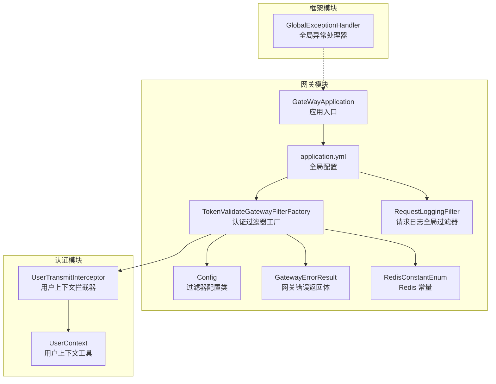
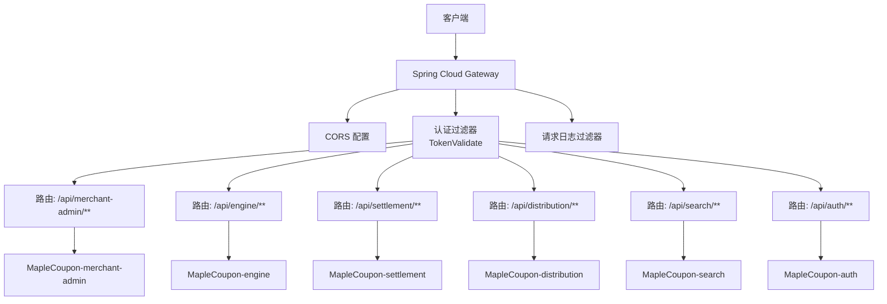
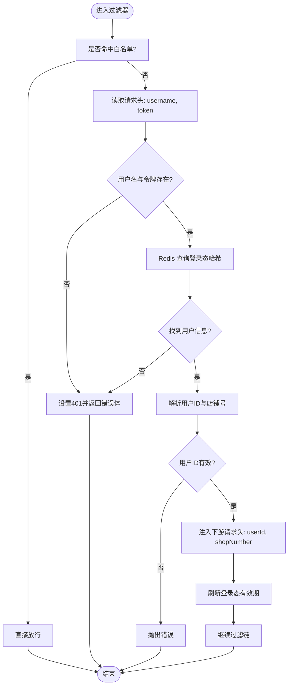
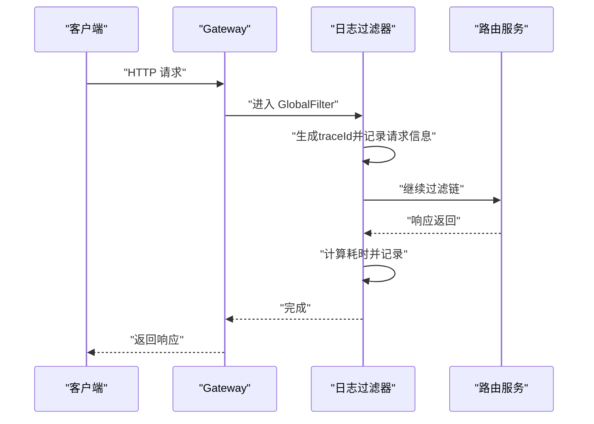
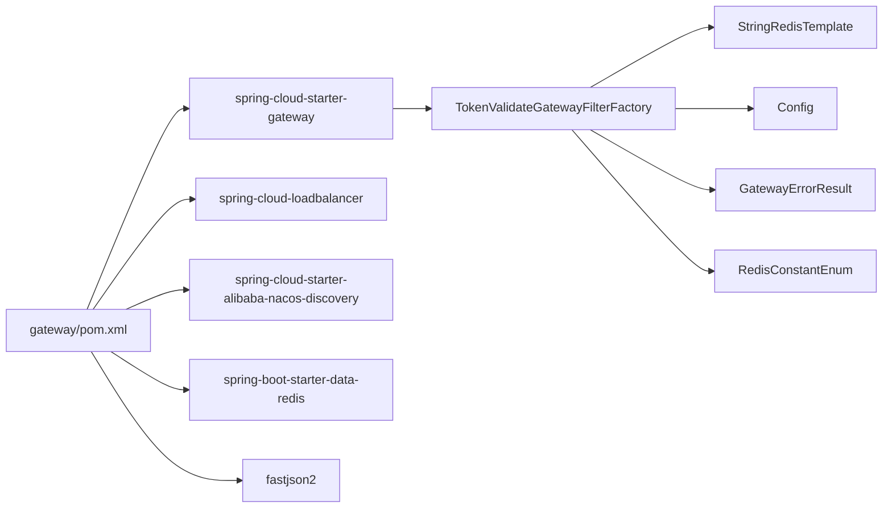

# 网关服务模块

<cite>
**本文引用的文件**
- [GateWayApplication.java](file://gateway/src/main/java/com/fengxin/maplecoupon/gateway/GateWayApplication.java)
- [application.yml](file://gateway/src/main/resources/application.yml)
- [application-dev.yml](file://gateway/src/main/resources/application-dev.yml)
- [application-prod.yml](file://gateway/src/main/resources/application-prod.yml)
- [TokenValidateGatewayFilterFactory.java](file://gateway/src/main/java/com/fengxin/maplecoupon/gateway/filter/TokenValidateGatewayFilterFactory.java)
- [RequestLoggingFilter.java](file://gateway/src/main/java/com/fengxin/maplecoupon/gateway/filter/RequestLoggingFilter.java)
- [Config.java](file://gateway/src/main/java/com/fengxin/maplecoupon/gateway/config/Config.java)
- [GatewayErrorResult.java](file://gateway/src/main/java/com/fengxin/maplecoupon/gateway/common/GatewayErrorResult.java)
- [RedisConstantEnum.java](file://gateway/src/main/java/com/fengxin/maplecoupon/gateway/common/RedisConstantEnum.java)
- [pom.xml](file://gateway/pom.xml)
- [UserTransmitInterceptor.java](file://auth/src/main/java/com/fengxin/maplecoupon/auth/common/context/UserTransmitInterceptor.java)
- [UserContext.java](file://auth/src/main/java/com/fengxin/maplecoupon/auth/common/context/UserContext.java)
- [GlobalExceptionHandler.java](file://framework/src/main/java/com/fengxin/web/GlobalExceptionHandler.java)
- [UserController.java](file://auth/src/main/java/com/fengxin/maplecoupon/auth/controller/UserController.java)
- [UserService.java](file://auth/src/main/java/com/fengxin/maplecoupon/auth/service/UserService.java)
</cite>

## 目录
1. [简介](#简介)
2. [项目结构](#项目结构)
3. [核心组件](#核心组件)
4. [架构总览](#架构总览)
5. [详细组件分析](#详细组件分析)
6. [依赖分析](#依赖分析)
7. [性能考虑](#性能考虑)
8. [故障排查指南](#故障排查指南)
9. [结论](#结论)
10. [附录](#附录)

## 简介
本技术文档面向“网关服务模块”，系统性阐述基于 Spring Cloud Gateway 的配置与定制实现，涵盖路由规则、过滤器链与请求转发机制；统一认证与权限验证（JWT 令牌校验与用户上下文传递）；请求日志记录、响应处理与错误统一管理；限流、熔断与降级策略现状与落地建议；跨域处理、请求头转发与安全防护；以及性能优化、监控指标与故障排查方法。同时提供完整配置说明、路由规则定义与扩展开发指南，帮助开发者快速完成网关的定制化方案与最佳实践。

## 项目结构
网关模块采用标准 Spring Boot 工程结构，核心入口为应用启动类，配置集中在 YAML 文件中，过滤器与通用工具位于独立包下。认证与用户上下文传递在 auth 模块中实现，便于跨服务共享。

图表来源
- [GateWayApplication.java:1-18](file://gateway/src/main/java/com/fengxin/maplecoupon/gateway/GateWayApplication.java#L1-L18)
- [application.yml:1-72](file://gateway/src/main/resources/application.yml#L1-L72)
- [TokenValidateGatewayFilterFactory.java:1-93](file://gateway/src/main/java/com/fengxin/maplecoupon/gateway/filter/TokenValidateGatewayFilterFactory.java#L1-L93)
- [RequestLoggingFilter.java:1-57](file://gateway/src/main/java/com/fengxin/maplecoupon/gateway/filter/RequestLoggingFilter.java#L1-L57)
- [Config.java:1-20](file://gateway/src/main/java/com/fengxin/maplecoupon/gateway/config/Config.java#L1-L20)
- [GatewayErrorResult.java:1-27](file://gateway/src/main/java/com/fengxin/maplecoupon/gateway/common/GatewayErrorResult.java#L1-L27)
- [RedisConstantEnum.java:1-15](file://gateway/src/main/java/com/fengxin/maplecoupon/gateway/common/RedisConstantEnum.java#L1-L15)
- [UserTransmitInterceptor.java:1-42](file://auth/src/main/java/com/fengxin/maplecoupon/auth/common/context/UserTransmitInterceptor.java#L1-L42)
- [UserContext.java:1-64](file://auth/src/main/java/com/fengxin/maplecoupon/auth/common/context/UserContext.java#L1-L64)
- [GlobalExceptionHandler.java:1-78](file://framework/src/main/java/com/fengxin/web/GlobalExceptionHandler.java#L1-L78)

章节来源
- [GateWayApplication.java:1-18](file://gateway/src/main/java/com/fengxin/maplecoupon/gateway/GateWayApplication.java#L1-L18)
- [application.yml:1-72](file://gateway/src/main/resources/application.yml#L1-L72)

## 核心组件
- 应用入口与启动
  - 应用入口类负责启动 Spring Boot 与 Spring Cloud Gateway 容器。
- 路由与全局 CORS
  - 通过 YAML 配置定义多条路由，目标服务均采用负载均衡地址；开启全局 CORS，允许任意来源、方法与头部，并支持凭证。
- 认证过滤器
  - 自定义 GatewayFilterFactory，按白名单策略放行，其余请求从请求头读取用户名与令牌，校验 Redis 中的登录态并注入用户上下文头（userId、shopNumber），同时刷新登录有效期。
- 请求日志过滤器
  - 实现 GlobalFilter，生成 traceId，记录请求 URI、类型、头信息与 GET 参数，并统计响应耗时。
- 错误返回体
  - 统一的网关错误返回结构，包含状态码与消息。
- Redis 常量
  - 定义用户登录态键前缀，供认证过滤器读写登录态。
- 配置类
  - 过滤器配置项，支持白名单路径列表。
- 异常处理
  - 框架层提供全局异常处理器，统一返回结果包装，便于下游服务一致化处理。

章节来源
- [GateWayApplication.java:1-18](file://gateway/src/main/java/com/fengxin/maplecoupon/gateway/GateWayApplication.java#L1-L18)
- [application.yml:1-72](file://gateway/src/main/resources/application.yml#L1-L72)
- [TokenValidateGatewayFilterFactory.java:1-93](file://gateway/src/main/java/com/fengxin/maplecoupon/gateway/filter/TokenValidateGatewayFilterFactory.java#L1-L93)
- [RequestLoggingFilter.java:1-57](file://gateway/src/main/java/com/fengxin/maplecoupon/gateway/filter/RequestLoggingFilter.java#L1-L57)
- [GatewayErrorResult.java:1-27](file://gateway/src/main/java/com/fengxin/maplecoupon/gateway/common/GatewayErrorResult.java#L1-L27)
- [RedisConstantEnum.java:1-15](file://gateway/src/main/java/com/fengxin/maplecoupon/gateway/common/RedisConstantEnum.java#L1-L15)
- [Config.java:1-20](file://gateway/src/main/java/com/fengxin/maplecoupon/gateway/config/Config.java#L1-L20)
- [GlobalExceptionHandler.java:1-78](file://framework/src/main/java/com/fengxin/web/GlobalExceptionHandler.java#L1-L78)

## 架构总览
网关作为统一入口，负责：
- 路由分发：将匹配路径的请求转发到对应微服务实例（LB 地址）。
- 安全控制：统一认证与权限校验，白名单放行。
- 可观测性：请求日志与耗时统计。
- 错误收敛：统一错误返回格式。
- 跨域支持：全局 CORS 配置。

图表来源
- [application.yml:17-63](file://gateway/src/main/resources/application.yml#L17-L63)
- [TokenValidateGatewayFilterFactory.java:44-88](file://gateway/src/main/java/com/fengxin/maplecoupon/gateway/filter/TokenValidateGatewayFilterFactory.java#L44-L88)
- [RequestLoggingFilter.java:24-56](file://gateway/src/main/java/com/fengxin/maplecoupon/gateway/filter/RequestLoggingFilter.java#L24-L56)

## 详细组件分析

### 认证与权限验证过滤器
- 功能概述
  - 白名单放行：若请求路径命中白名单前缀，则直接放行。
  - 登录态校验：从请求头读取用户名与令牌，查询 Redis 中的登录态哈希，解析用户信息。
  - 上下文透传：将 userId、shopNumber 注入到下游请求头，便于后端服务获取用户上下文。
  - 有效期刷新：校验通过后刷新登录态有效期，避免用户操作期间被强制下线。
  - 未授权处理：校验失败返回统一错误体与 401 状态。
- 关键流程图

图表来源
- [TokenValidateGatewayFilterFactory.java:44-88](file://gateway/src/main/java/com/fengxin/maplecoupon/gateway/filter/TokenValidateGatewayFilterFactory.java#L44-L88)
- [RedisConstantEnum.java:13-13](file://gateway/src/main/java/com/fengxin/maplecoupon/gateway/common/RedisConstantEnum.java#L13-L13)

章节来源
- [TokenValidateGatewayFilterFactory.java:1-93](file://gateway/src/main/java/com/fengxin/maplecoupon/gateway/filter/TokenValidateGatewayFilterFactory.java#L1-L93)
- [Config.java:1-20](file://gateway/src/main/java/com/fengxin/maplecoupon/gateway/config/Config.java#L1-L20)
- [RedisConstantEnum.java:1-15](file://gateway/src/main/java/com/fengxin/maplecoupon/gateway/common/RedisConstantEnum.java#L1-L15)
- [GatewayErrorResult.java:1-27](file://gateway/src/main/java/com/fengxin/maplecoupon/gateway/common/GatewayErrorResult.java#L1-L27)

### 请求日志记录与响应处理
- 功能概述
  - 生成 traceId 并写入 MDC，贯穿请求生命周期。
  - 记录请求 URI、方法、头信息；GET 请求记录查询参数。
  - 使用 then 回调统计响应耗时，输出到日志。
- 顺序图（请求生命周期）

图表来源
- [RequestLoggingFilter.java:24-56](file://gateway/src/main/java/com/fengxin/maplecoupon/gateway/filter/RequestLoggingFilter.java#L24-L56)

章节来源
- [RequestLoggingFilter.java:1-57](file://gateway/src/main/java/com/fengxin/maplecoupon/gateway/filter/RequestLoggingFilter.java#L1-L57)

### 路由规则与请求转发机制
- 路由定义
  - 多条路由分别映射到不同微服务的 API 前缀，均使用负载均衡地址。
  - 认证过滤器应用于除白名单外的所有路由。
- 转发机制
  - Gateway 将匹配的请求转发至对应服务实例，由服务自身处理业务逻辑与返回。

章节来源
- [application.yml:17-63](file://gateway/src/main/resources/application.yml#L17-L63)

### 错误统一管理机制
- 网关层
  - 未授权场景：设置 401 状态并返回统一错误体。
- 服务层
  - 全局异常处理器统一捕获异常，构造统一返回结构，便于前端消费。

章节来源
- [TokenValidateGatewayFilterFactory.java:75-84](file://gateway/src/main/java/com/fengxin/maplecoupon/gateway/filter/TokenValidateGatewayFilterFactory.java#L75-L84)
- [GatewayErrorResult.java:1-27](file://gateway/src/main/java/com/fengxin/maplecoupon/gateway/common/GatewayErrorResult.java#L1-L27)
- [GlobalExceptionHandler.java:1-78](file://framework/src/main/java/com/fengxin/web/GlobalExceptionHandler.java#L1-L78)

### 跨域处理与请求头转发
- 跨域
  - 全局 CORS 配置允许任意来源、方法与头部，并支持凭证。
- 请求头转发
  - 认证通过后，将 userId、shopNumber 注入下游请求头，确保后端可感知用户上下文。

章节来源
- [application.yml:10-16](file://gateway/src/main/resources/application.yml#L10-L16)
- [TokenValidateGatewayFilterFactory.java:65-69](file://gateway/src/main/java/com/fengxin/maplecoupon/gateway/filter/TokenValidateGatewayFilterFactory.java#L65-L69)

### 安全防护措施
- 认证与鉴权
  - 通过请求头携带用户名与令牌进行校验，Redis 存储登录态，校验通过后注入用户上下文。
- 白名单机制
  - 对无需认证的公开接口（如注册、登录、校验用户名等）配置白名单放行。
- 令牌有效性
  - 当前实现未对令牌内容进行二次校验，仅校验 Redis 中是否存在该键值；建议结合 JWT 解析与签名校验完善。

章节来源
- [application.yml:59-63](file://gateway/src/main/resources/application.yml#L59-L63)
- [TokenValidateGatewayFilterFactory.java:48-74](file://gateway/src/main/java/com/fengxin/maplecoupon/gateway/filter/TokenValidateGatewayFilterFactory.java#L48-L74)

### 限流、熔断与降级策略
- 现状
  - 网关模块未内置限流、熔断与降级配置。
- 建议
  - 限流：引入 Gateway Rate Limiter 或 Resilience4j 限流器，按路由或全局维度配置 QPS。
  - 熔断与降级：结合 Resilience4j 或 Sentinel，针对下游不稳定服务启用熔断与 fallback。
  - 配置位置：在 application.yml 的 spring.cloud.gateway.routes 下为特定路由添加自定义过滤器或断路器配置。

[本节为通用建议，不直接分析具体文件]

## 依赖分析
- 外部依赖
  - Spring Cloud Gateway、LoadBalancer、Nacos Discovery、Redis、Fastjson2。
- 内部依赖
  - 认证过滤器依赖 Redis 读取登录态，依赖配置类与错误返回体。
  - 用户上下文传递在 auth 模块实现，网关侧通过请求头注入，auth 侧再将上下文写入 ThreadLocal。

图表来源
- [pom.xml:14-54](file://gateway/pom.xml#L14-L54)
- [TokenValidateGatewayFilterFactory.java:36-41](file://gateway/src/main/java/com/fengxin/maplecoupon/gateway/filter/TokenValidateGatewayFilterFactory.java#L36-L41)
- [Config.java:14-18](file://gateway/src/main/java/com/fengxin/maplecoupon/gateway/config/Config.java#L14-L18)
- [GatewayErrorResult.java:16-26](file://gateway/src/main/java/com/fengxin/maplecoupon/gateway/common/GatewayErrorResult.java#L16-L26)
- [RedisConstantEnum.java:13-13](file://gateway/src/main/java/com/fengxin/maplecoupon/gateway/common/RedisConstantEnum.java#L13-L13)

章节来源
- [pom.xml:1-77](file://gateway/pom.xml#L1-L77)

## 性能考虑
- 过滤器顺序
  - 日志过滤器优先级较低，确保尽可能早地记录请求信息。
- Redis 访问
  - 认证过滤器每次请求都会访问 Redis，建议：
    - 合理设置 Redis 连接池与超时；
    - 对热点用户登录态设置较长 TTL；
    - 结合本地缓存（如 Caffeine）降低高频访问压力。
- 负载均衡
  - 使用 Nacos 服务发现与 LoadBalancer，确保实例健康与流量均匀分布。
- 监控与指标
  - 开启管理端点暴露，收集网关与下游服务指标，结合分布式追踪（如 Zipkin/SkyWalking）定位瓶颈。

[本节为通用建议，不直接分析具体文件]

## 故障排查指南
- 认证失败
  - 检查请求头是否包含正确的 username 与 token；
  - 确认 Redis 中是否存在对应的登录态键值；
  - 查看网关日志中的 traceId，定位请求链路。
- 跨域问题
  - 确认 CORS 配置是否生效，浏览器控制台查看预检请求响应头。
- 服务不可达
  - 检查 Nacos 是否注册成功，确认服务实例健康状态；
  - 查看负载均衡策略与路由配置。
- 异常统一返回
  - 若下游服务抛出异常，确认全局异常处理器是否正确返回统一结构。

章节来源
- [TokenValidateGatewayFilterFactory.java:75-84](file://gateway/src/main/java/com/fengxin/maplecoupon/gateway/filter/TokenValidateGatewayFilterFactory.java#L75-L84)
- [GlobalExceptionHandler.java:44-68](file://framework/src/main/java/com/fengxin/web/GlobalExceptionHandler.java#L44-L68)

## 结论
本网关模块以最小实现满足统一入口、认证与日志需求，具备良好的扩展性。建议后续补充限流、熔断与降级能力，完善 JWT 校验与令牌签名校验，强化安全与稳定性；同时结合监控与追踪体系，持续优化性能与可观测性。

[本节为总结，不直接分析具体文件]

## 附录

### 完整配置说明
- 网关端口与应用名
  - server.port、spring.application.name
- 环境与配置文件
  - spring.profiles.active
- 全局 CORS
  - spring.cloud.gateway.globalcors.cors-configurations.[/**].allowedOriginPatterns/methods/headers/allowCredentials
- 路由与过滤器
  - spring.cloud.gateway.routes[*].id/uri/predicates[*]/filters[*]
  - 认证过滤器名称为 TokenValidate，支持 whitePathList 白名单配置
- 管理端点与指标
  - management.endpoints.web.exposure.include 与 management.metrics.tags.application

章节来源
- [application.yml:1-72](file://gateway/src/main/resources/application.yml#L1-L72)

### 路由规则定义
- 示例路由
  - /api/merchant-admin/** → lb://MapleCoupon-merchant-admin/api/merchant-admin/**
  - /api/engine/** → lb://MapleCoupon-engine/api/engine/**
  - /api/settlement/** → lb://MapleCoupon-settlement/api/settlement/**
  - /api/distribution/** → lb://MapleCoupon-distribution/api/distribution/**
  - /api/search/** → lb://MapleCoupon-search/api/search/**
  - /api/auth/** → lb://MapleCoupon-auth/api/auth/**
- 白名单示例
  - /api/auth/user/register
  - /api/auth/user/has-username
  - /api/auth/user/login

章节来源
- [application.yml:17-63](file://gateway/src/main/resources/application.yml#L17-L63)

### 扩展开发指南
- 新增认证白名单
  - 在路由 filters.args.whitePathList 中追加路径前缀。
- 新增路由
  - 在 routes 列表新增一项，配置 id、uri、predicates 与 filters。
- 自定义过滤器
  - 继承 AbstractGatewayFilterFactory 或实现 GlobalFilter，注意设置合理 order。
- 用户上下文传递
  - 网关侧注入 userId、shopNumber；后端服务侧通过拦截器将上下文写入 UserContext。

章节来源
- [application.yml:59-63](file://gateway/src/main/resources/application.yml#L59-L63)
- [TokenValidateGatewayFilterFactory.java:65-69](file://gateway/src/main/java/com/fengxin/maplecoupon/gateway/filter/TokenValidateGatewayFilterFactory.java#L65-L69)
- [UserTransmitInterceptor.java:20-35](file://auth/src/main/java/com/fengxin/maplecoupon/auth/common/context/UserTransmitInterceptor.java#L20-L35)
- [UserContext.java:22-61](file://auth/src/main/java/com/fengxin/maplecoupon/auth/common/context/UserContext.java#L22-L61)

### 最佳实践
- 认证
  - 明确白名单范围，避免过度放行；对敏感接口严格校验。
- 日志
  - 使用 traceId 统一日志关联；避免记录敏感头与参数。
- 安全
  - 建议引入 JWT 解析与签名校验，增强令牌安全性。
- 性能
  - 缓存热点用户登录态；优化 Redis 连接与超时；评估并发与吞吐。
- 可观测性
  - 开启管理端点与指标标签；接入链路追踪与告警。

[本节为通用建议，不直接分析具体文件]