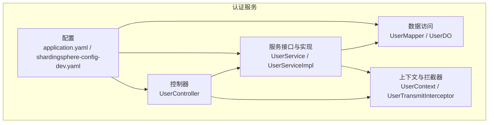
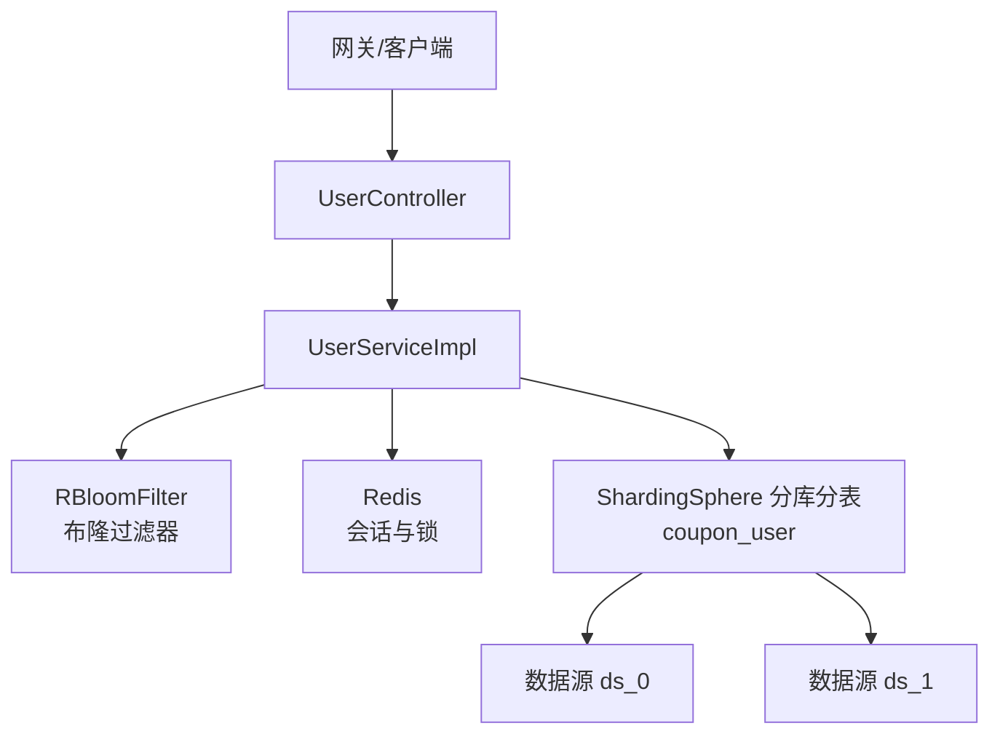
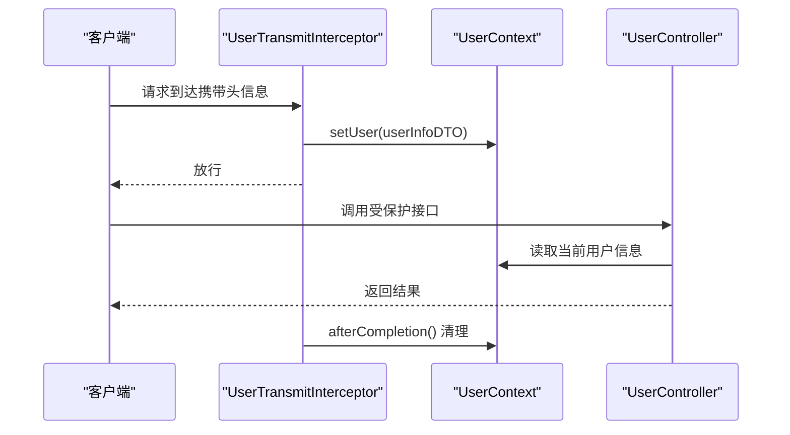
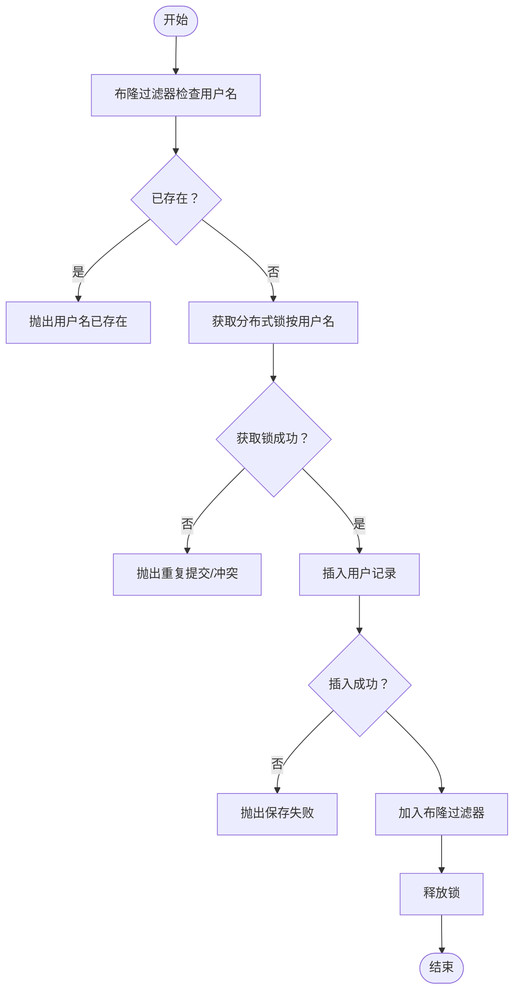
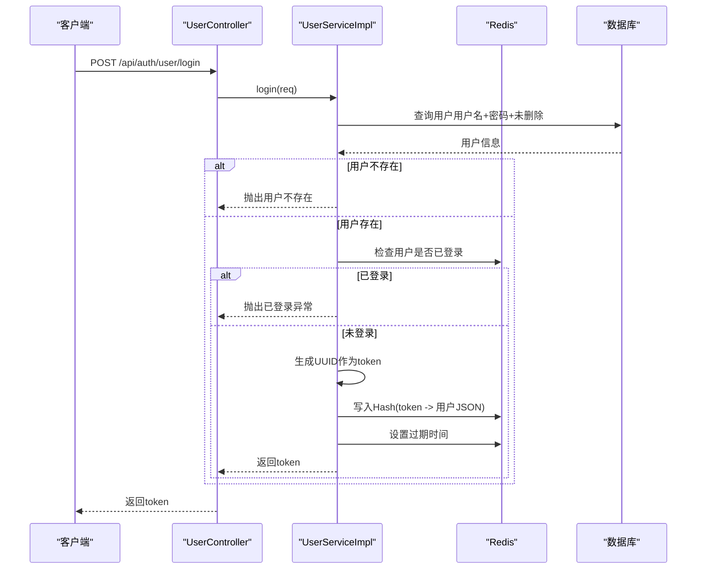
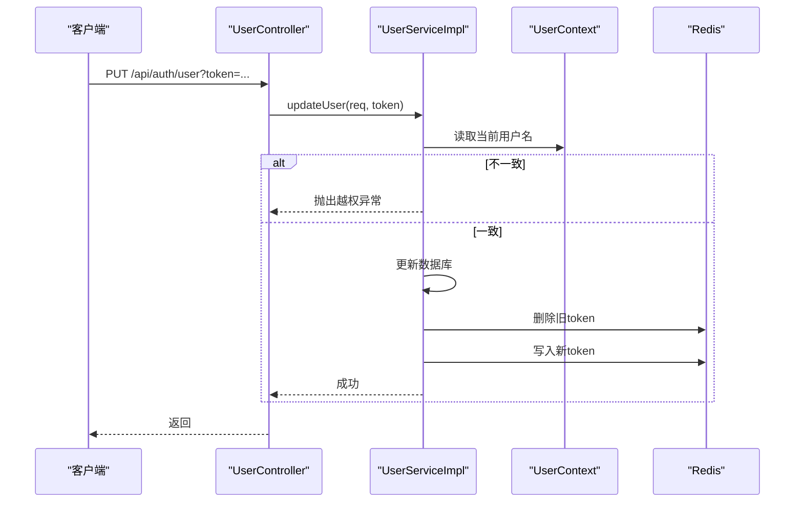
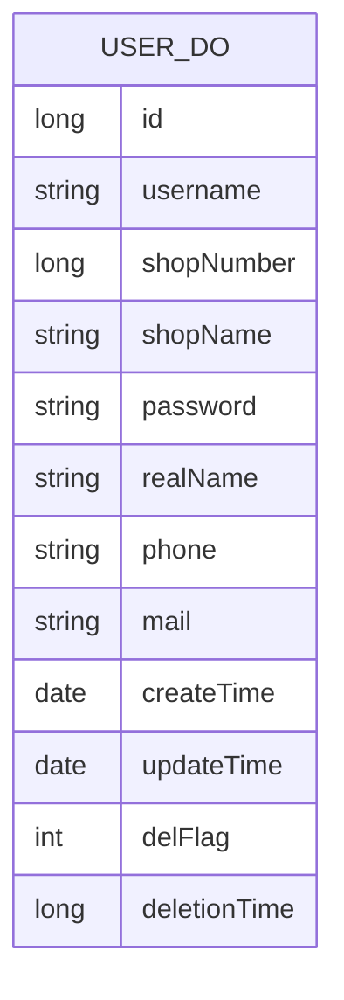
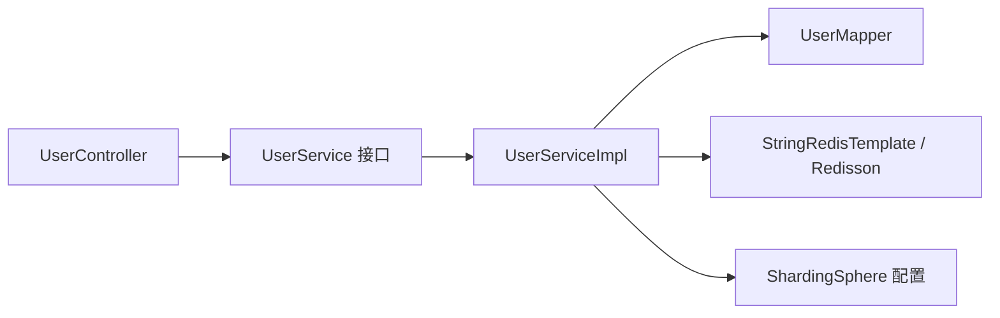

# 认证服务模块

<cite>
**本文引用的文件**
- [AuthApplication.java](file://auth/src/main/java/com/fengxin/maplecoupon/auth/AuthApplication.java)
- [UserController.java](file://auth/src/main/java/com/fengxin/maplecoupon/auth/controller/UserController.java)
- [UserService.java](file://auth/src/main/java/com/fengxin/maplecoupon/auth/service/UserService.java)
- [UserServiceImpl.java](file://auth/src/main/java/com/fengxin/maplecoupon/auth/service/impl/UserServiceImpl.java)
- [UserMapper.java](file://auth/src/main/java/com/fengxin/maplecoupon/auth/dao/mapper/UserMapper.java)
- [UserDO.java](file://auth/src/main/java/com/fengxin/maplecoupon/auth/dao/entity/UserDO.java)
- [UserContext.java](file://auth/src/main/java/com/fengxin/maplecoupon/auth/common/context/UserContext.java)
- [UserTransmitInterceptor.java](file://auth/src/main/java/com/fengxin/maplecoupon/auth/common/context/UserTransmitInterceptor.java)
- [UserRegisterReqDTO.java](file://auth/src/main/java/com/fengxin/maplecoupon/auth/dto/req/UserRegisterReqDTO.java)
- [UserLoginReqDTO.java](file://auth/src/main/java/com/fengxin/maplecoupon/auth/dto/req/UserLoginReqDTO.java)
- [UserUpdateReqDTO.java](file://auth/src/main/java/com/fengxin/maplecoupon/auth/dto/req/UserUpdateReqDTO.java)
- [UserErrorCodeEnum.java](file://auth/src/main/java/com/fengxin/maplecoupon/auth/common/enums/UserErrorCodeEnum.java)
- [EngineRedisConstant.java](file://auth/src/main/java/com/fengxin/maplecoupon/auth/common/constant/EngineRedisConstant.java)
- [application.yaml](file://auth/src/main/resources/application.yaml)
- [shardingsphere-config-dev.yaml](file://auth/src/main/resources/shardingsphere-config-dev.yaml)
</cite>

## 目录
1. [简介](#简介)
2. [项目结构](#项目结构)
3. [核心组件](#核心组件)
4. [架构总览](#架构总览)
5. [详细组件分析](#详细组件分析)
6. [依赖分析](#依赖分析)
7. [性能考虑](#性能考虑)
8. [故障排查指南](#故障排查指南)
9. [结论](#结论)
10. [附录：API 接口文档](#附录api-接口文档)

## 简介
本文件为认证服务模块的技术文档，覆盖用户认证、授权与权限管理的完整实现，包括用户注册、登录、信息修改等核心业务流程；阐述基于 Redis 的 JWT 令牌生成、校验与失效处理机制；解释用户上下文传递机制（UserContext）与拦截器实现；说明数据库设计、分片策略与性能优化；并提供完整的 API 接口文档与集成指南。

## 项目结构
认证服务采用 Spring Boot + MyBatis-Plus + ShardingSphere 分库分表 + Redis 缓存 + Redisson 分布式能力的架构。核心目录组织如下：
- controller：对外暴露 REST API
- service：业务逻辑层
- dao：数据访问层（MyBatis-Plus Mapper）
- common：通用工具、上下文、拦截器、枚举与常量
- dto：请求/响应数据传输对象
- resources：应用配置与 ShardingSphere 配置

图表来源
- [UserController.java:1-81](file://auth/src/main/java/com/fengxin/maplecoupon/auth/controller/UserController.java#L1-L81)
- [UserService.java:1-79](file://auth/src/main/java/com/fengxin/maplecoupon/auth/service/UserService.java#L1-L79)
- [UserServiceImpl.java:1-159](file://auth/src/main/java/com/fengxin/maplecoupon/auth/service/impl/UserServiceImpl.java#L1-L159)
- [UserMapper.java:1-16](file://auth/src/main/java/com/fengxin/maplecoupon/auth/dao/mapper/UserMapper.java#L1-L16)
- [UserDO.java:1-88](file://auth/src/main/java/com/fengxin/maplecoupon/auth/dao/entity/UserDO.java#L1-L88)
- [UserContext.java:1-64](file://auth/src/main/java/com/fengxin/maplecoupon/auth/common/context/UserContext.java#L1-L64)
- [UserTransmitInterceptor.java:1-42](file://auth/src/main/java/com/fengxin/maplecoupon/auth/common/context/UserTransmitInterceptor.java#L1-L42)
- [application.yaml:1-19](file://auth/src/main/resources/application.yaml#L1-L19)
- [shardingsphere-config-dev.yaml:1-45](file://auth/src/main/resources/shardingsphere-config-dev.yaml#L1-L45)

章节来源
- [AuthApplication.java:1-26](file://auth/src/main/java/com/fengxin/maplecoupon/auth/AuthApplication.java#L1-L26)
- [application.yaml:1-19](file://auth/src/main/resources/application.yaml#L1-L19)

## 核心组件
- 控制器层：提供用户查询、注册、登录、更新、登录状态检查、登出等接口
- 服务层：封装业务规则，负责幂等、分布式锁、布隆过滤器、Redis 会话管理
- 数据访问层：基于 MyBatis-Plus 的 Mapper 与实体类
- 上下文与拦截器：通过拦截器注入用户信息到线程本地，供后续链路使用
- 配置层：ShardingSphere 分库分表配置、应用端口与数据源配置

章节来源
- [UserController.java:1-81](file://auth/src/main/java/com/fengxin/maplecoupon/auth/controller/UserController.java#L1-L81)
- [UserService.java:1-79](file://auth/src/main/java/com/fengxin/maplecoupon/auth/service/UserService.java#L1-L79)
- [UserServiceImpl.java:1-159](file://auth/src/main/java/com/fengxin/maplecoupon/auth/service/impl/UserServiceImpl.java#L1-L159)
- [UserMapper.java:1-16](file://auth/src/main/java/com/fengxin/maplecoupon/auth/dao/mapper/UserMapper.java#L1-L16)
- [UserDO.java:1-88](file://auth/src/main/java/com/fengxin/maplecoupon/auth/dao/entity/UserDO.java#L1-L88)
- [UserContext.java:1-64](file://auth/src/main/java/com/fengxin/maplecoupon/auth/common/context/UserContext.java#L1-L64)
- [UserTransmitInterceptor.java:1-42](file://auth/src/main/java/com/fengxin/maplecoupon/auth/common/context/UserTransmitInterceptor.java#L1-L42)

## 架构总览
认证服务整体架构围绕“接口层 -> 业务层 -> 缓存/数据库”的分层设计，结合 ShardingSphere 实现用户表的水平分片，利用 Redis 存储用户会话，Redisson 提供分布式锁与布隆过滤器能力。

图表来源
- [UserServiceImpl.java:45-159](file://auth/src/main/java/com/fengxin/maplecoupon/auth/service/impl/UserServiceImpl.java#L45-L159)
- [EngineRedisConstant.java:51-54](file://auth/src/main/java/com/fengxin/maplecoupon/auth/common/constant/EngineRedisConstant.java#L51-L54)
- [shardingsphere-config-dev.yaml:17-45](file://auth/src/main/resources/shardingsphere-config-dev.yaml#L17-L45)

## 详细组件分析

### 用户上下文与拦截器
- UserTransmitInterceptor：从请求头读取用户信息（userId、username、shopNumber），写入 UserContext，请求结束后清理
- UserContext：提供静态方法获取当前线程中的用户信息，支持跨线程传播（TransmittableThreadLocal）

图表来源
- [UserTransmitInterceptor.java:21-40](file://auth/src/main/java/com/fengxin/maplecoupon/auth/common/context/UserTransmitInterceptor.java#L21-L40)
- [UserContext.java:14-64](file://auth/src/main/java/com/fengxin/maplecoupon/auth/common/context/UserContext.java#L14-L64)

章节来源
- [UserTransmitInterceptor.java:1-42](file://auth/src/main/java/com/fengxin/maplecoupon/auth/common/context/UserTransmitInterceptor.java#L1-L42)
- [UserContext.java:1-64](file://auth/src/main/java/com/fengxin/maplecoupon/auth/common/context/UserContext.java#L1-L64)

### 用户注册流程
- 幂等与防刷：使用 Redisson 分布式锁，按用户名加锁，避免重复提交
- 布隆过滤器：注册前先判断用户名是否存在，减少对数据库的无效查询
- 数据落库：生成随机店铺号，插入用户记录，并向布隆过滤器添加用户名
- 异常处理：重复用户名、保存失败、并发冲突等场景抛出客户端异常

图表来源
- [UserServiceImpl.java:71-100](file://auth/src/main/java/com/fengxin/maplecoupon/auth/service/impl/UserServiceImpl.java#L71-L100)
- [UserErrorCodeEnum.java:11-19](file://auth/src/main/java/com/fengxin/maplecoupon/auth/common/enums/UserErrorCodeEnum.java#L11-L19)

章节来源
- [UserServiceImpl.java:71-100](file://auth/src/main/java/com/fengxin/maplecoupon/auth/service/impl/UserServiceImpl.java#L71-L100)
- [UserRegisterReqDTO.java:1-44](file://auth/src/main/java/com/fengxin/maplecoupon/auth/dto/req/UserRegisterReqDTO.java#L1-L44)

### 用户登录与会话管理
- 登录校验：按用户名+密码+未删除条件查询用户
- 会话存储：若该用户尚未登录，则生成 UUID 作为 token，写入 Redis Hash（key 为用户前缀，field 为 token，value 为用户序列化数据）
- 登录保护：同一用户同时仅允许一个会话，避免并发重复登录导致 Redis 崩溃
- 登录状态检查与登出：通过 Redis Hash 判断 token 是否存在；登出删除对应 field

图表来源
- [UserController.java:62-66](file://auth/src/main/java/com/fengxin/maplecoupon/auth/controller/UserController.java#L62-L66)
- [UserServiceImpl.java:121-143](file://auth/src/main/java/com/fengxin/maplecoupon/auth/service/impl/UserServiceImpl.java#L121-L143)
- [EngineRedisConstant.java:53-54](file://auth/src/main/java/com/fengxin/maplecoupon/auth/common/constant/EngineRedisConstant.java#L53-L54)

章节来源
- [UserController.java:62-79](file://auth/src/main/java/com/fengxin/maplecoupon/auth/controller/UserController.java#L62-L79)
- [UserServiceImpl.java:121-143](file://auth/src/main/java/com/fengxin/maplecoupon/auth/service/impl/UserServiceImpl.java#L121-L143)
- [UserLoginReqDTO.java:1-23](file://auth/src/main/java/com/fengxin/maplecoupon/auth/dto/req/UserLoginReqDTO.java#L1-L23)

### 用户信息更新与上下文校验
- 更新前校验：要求请求中的用户名必须与当前线程上下文中的用户名一致，防止越权修改
- 更新后同步：更新数据库后，删除旧 token 对应的缓存，并写入新的 token 缓存，保持会话一致性

图表来源
- [UserController.java:55-60](file://auth/src/main/java/com/fengxin/maplecoupon/auth/controller/UserController.java#L55-L60)
- [UserServiceImpl.java:102-119](file://auth/src/main/java/com/fengxin/maplecoupon/auth/service/impl/UserServiceImpl.java#L102-L119)
- [UserContext.java:41-44](file://auth/src/main/java/com/fengxin/maplecoupon/auth/common/context/UserContext.java#L41-L44)

章节来源
- [UserServiceImpl.java:102-119](file://auth/src/main/java/com/fengxin/maplecoupon/auth/service/impl/UserServiceImpl.java#L102-L119)
- [UserUpdateReqDTO.java:1-43](file://auth/src/main/java/com/fengxin/maplecoupon/auth/dto/req/UserUpdateReqDTO.java#L1-L43)

### 数据模型与分片策略
- 数据模型：UserDO 映射 coupon_user 表，包含基础字段、时间字段与删除标记
- 分片策略：以 username 为分片键，库/表均采用哈希取模分片，实际物理表为 ds_{0..1}.coupon_user_{0..15}

图表来源
- [UserDO.java:17-88](file://auth/src/main/java/com/fengxin/maplecoupon/auth/dao/entity/UserDO.java#L17-L88)

章节来源
- [shardingsphere-config-dev.yaml:17-45](file://auth/src/main/resources/shardingsphere-config-dev.yaml#L17-L45)
- [UserDO.java:17-88](file://auth/src/main/java/com/fengxin/maplecoupon/auth/dao/entity/UserDO.java#L17-L88)

### 安全与合规要点
- 密码存储：当前实现直接比较明文密码，建议在生产环境引入强哈希（如 BCrypt）进行密码加密与校验
- 令牌传输：建议通过 HTTPS 与安全的 Cookie 或 Bearer Token 传输，避免明文泄露
- 敏感信息脱敏：响应 DTO 中可对手机号等敏感字段进行序列化脱敏（参考框架内序列化器模式）
- 防暴力破解：注册使用分布式锁，登录使用单点会话，避免高频尝试

章节来源
- [UserServiceImpl.java:121-143](file://auth/src/main/java/com/fengxin/maplecoupon/auth/service/impl/UserServiceImpl.java#L121-L143)
- [UserRegisterReqDTO.java:1-44](file://auth/src/main/java/com/fengxin/maplecoupon/auth/dto/req/UserRegisterReqDTO.java#L1-L44)

## 依赖分析
- 控制器依赖服务接口，服务实现依赖 Mapper、Redis 与 Redisson
- 配置层通过 ShardingSphere 驱动连接多数据源，实现水平扩展
- 上下文拦截器贯穿请求生命周期，确保用户信息在服务层可用

图表来源
- [UserController.java:1-81](file://auth/src/main/java/com/fengxin/maplecoupon/auth/controller/UserController.java#L1-L81)
- [UserService.java:1-79](file://auth/src/main/java/com/fengxin/maplecoupon/auth/service/UserService.java#L1-L79)
- [UserServiceImpl.java:1-159](file://auth/src/main/java/com/fengxin/maplecoupon/auth/service/impl/UserServiceImpl.java#L1-L159)
- [UserMapper.java:1-16](file://auth/src/main/java/com/fengxin/maplecoupon/auth/dao/mapper/UserMapper.java#L1-L16)
- [application.yaml:6-10](file://auth/src/main/resources/application.yaml#L6-L10)

章节来源
- [application.yaml:1-19](file://auth/src/main/resources/application.yaml#L1-L19)
- [shardingsphere-config-dev.yaml:1-45](file://auth/src/main/resources/shardingsphere-config-dev.yaml#L1-L45)

## 性能考虑
- 布隆过滤器：降低注册场景的数据库压力，减少误判率
- 分布式锁：避免重复注册与并发冲突
- Redis 缓存：会话以 Hash 结构存储，key 命名规范，设置合理过期时间
- 分库分表：按用户名取模，提升查询与写入吞吐
- 日志与监控：开启 SQL 输出便于定位问题，建议接入链路追踪与指标监控

章节来源
- [UserServiceImpl.java:48-98](file://auth/src/main/java/com/fengxin/maplecoupon/auth/service/impl/UserServiceImpl.java#L48-L98)
- [EngineRedisConstant.java:51-54](file://auth/src/main/java/com/fengxin/maplecoupon/auth/common/constant/EngineRedisConstant.java#L51-L54)
- [shardingsphere-config-dev.yaml:31-42](file://auth/src/main/resources/shardingsphere-config-dev.yaml#L31-L42)

## 故障排查指南
- 用户名已存在：注册阶段布隆过滤器命中或数据库唯一约束冲突
- 用户保存失败：数据库插入异常或事务回滚
- 用户已登录：同一用户重复登录被拦截
- 退出登录失败：传入的 token 与当前会话不匹配
- 登录状态检查失败：token 不存在或已过期

章节来源
- [UserErrorCodeEnum.java:11-19](file://auth/src/main/java/com/fengxin/maplecoupon/auth/common/enums/UserErrorCodeEnum.java#L11-L19)
- [UserServiceImpl.java:145-157](file://auth/src/main/java/com/fengxin/maplecoupon/auth/service/impl/UserServiceImpl.java#L145-L157)

## 结论
认证服务模块通过清晰的分层设计与完善的缓存/分片策略，实现了高可用的用户认证与会话管理。建议在生产环境中补充密码加密、令牌安全传输与更细粒度的权限控制，以满足企业级安全要求。

## 附录：API 接口文档

### 通用响应结构
- 成功：包含业务数据
- 失败：包含错误码与错误信息

章节来源
- [UserController.java:1-81](file://auth/src/main/java/com/fengxin/maplecoupon/auth/controller/UserController.java#L1-L81)

### 用户查询
- GET /api/auth/admin/user/{username}
  - 功能：按用户名查询用户信息（字段脱敏）
  - 参数：路径变量 username
  - 响应：UserRespDTO
- GET /api/auth/actual/user/{username}
  - 功能：按用户名查询用户信息（不脱敏）
  - 参数：路径变量 username
  - 响应：UserActualRespDTO
- GET /api/auth/user/has-username
  - 功能：检查用户名是否存在
  - 参数：username
  - 响应：Boolean

章节来源
- [UserController.java:30-46](file://auth/src/main/java/com/fengxin/maplecoupon/auth/controller/UserController.java#L30-L46)

### 用户注册
- POST /api/auth/user/register
  - 请求体：UserRegisterReqDTO
  - 响应：void
  - 说明：注册成功后用户名进入布隆过滤器，注册期间按用户名加分布式锁

章节来源
- [UserController.java:48-53](file://auth/src/main/java/com/fengxin/maplecoupon/auth/controller/UserController.java#L48-L53)
- [UserRegisterReqDTO.java:1-44](file://auth/src/main/java/com/fengxin/maplecoupon/auth/dto/req/UserRegisterReqDTO.java#L1-L44)

### 用户登录与登出
- POST /api/auth/user/login
  - 请求体：UserLoginReqDTO
  - 响应：UserLoginRespDTO（包含 token）
- GET /api/auth/user/check-login
  - 参数：username、token
  - 响应：Boolean
- DELETE /api/auth/user/logout
  - 参数：username、token
  - 响应：void

章节来源
- [UserController.java:62-79](file://auth/src/main/java/com/fengxin/maplecoupon/auth/controller/UserController.java#L62-L79)
- [UserLoginReqDTO.java:1-23](file://auth/src/main/java/com/fengxin/maplecoupon/auth/dto/req/UserLoginReqDTO.java#L1-L23)

### 用户信息更新
- PUT /api/auth/user
  - 请求体：UserUpdateReqDTO
  - 参数：token
  - 响应：void
  - 说明：更新前校验当前登录用户与请求用户名一致，更新后同步 Redis 会话

章节来源
- [UserController.java:55-60](file://auth/src/main/java/com/fengxin/maplecoupon/auth/controller/UserController.java#L55-L60)
- [UserUpdateReqDTO.java:1-43](file://auth/src/main/java/com/fengxin/maplecoupon/auth/dto/req/UserUpdateReqDTO.java#L1-L43)

### 错误码说明
- A000200：用户验证失败
- B000200：用户名不存在
- B000201：用户名已存在
- B000202：用户不存在
- B000203：用户已存在
- B000204：用户新增失败
- B000205：用户已登录
- B000206：用户退出登录失败

章节来源
- [UserErrorCodeEnum.java:9-36](file://auth/src/main/java/com/fengxin/maplecoupon/auth/common/enums/UserErrorCodeEnum.java#L9-L36)

### 集成指南与最佳实践
- 令牌安全
  - 使用 HTTPS 传输，建议通过 Cookie 或 Authorization Bearer 传递 token
  - 后端通过拦截器注入 UserContext，服务间调用需透传用户头信息
- 密码安全
  - 生产环境必须使用强哈希（如 BCrypt）存储与校验密码
- 性能优化
  - 注册阶段使用布隆过滤器与分布式锁，避免重复提交
  - 登录采用单点会话，避免并发重复登录
  - 分库分表按用户名取模，保证负载均衡
- 配置与部署
  - 根据环境切换 shardingsphere-config-{dev|prod}.yaml
  - 确保 Redis 与数据库连通性与高可用

章节来源
- [UserTransmitInterceptor.java:21-40](file://auth/src/main/java/com/fengxin/maplecoupon/auth/common/context/UserTransmitInterceptor.java#L21-L40)
- [application.yaml:1-19](file://auth/src/main/resources/application.yaml#L1-L19)
- [shardingsphere-config-dev.yaml:1-45](file://auth/src/main/resources/shardingsphere-config-dev.yaml#L1-L45)