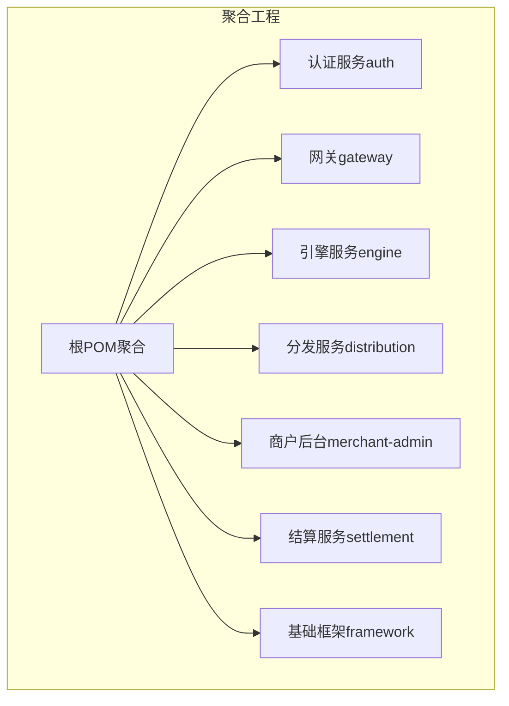
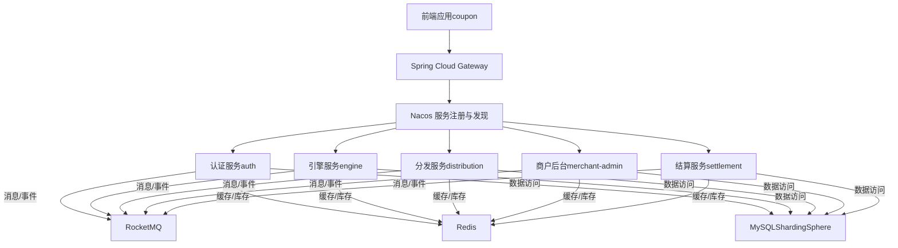
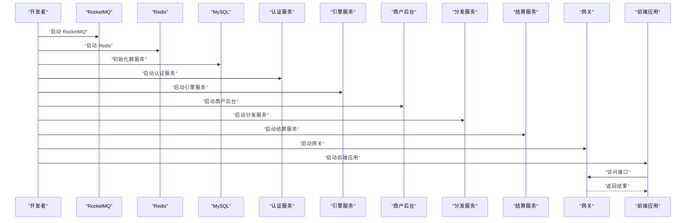

# 快速开始

<cite>
**本文引用的文件**
- [根POM（聚合）](file://pom.xml)
- [认证服务 POM](file://auth/pom.xml)
- [前端 package.json](file://coupon/package.json)
- [认证服务 开发配置](file://auth/src/main/resources/application-dev.yaml)
- [认证服务 生产配置](file://auth/src/main/resources/application-prod.yaml)
- [网关 开发配置](file://gateway/src/main/resources/application-dev.yml)
- [网关 生产配置](file://gateway/src/main/resources/application-prod.yml)
- [分发服务 开发配置](file://distribution/src/main/resources/application-dev.yaml)
- [引擎服务 开发配置](file://engine/src/main/resources/application-dev.yaml)
- [商户后台 开发配置](file://merchant-admin/src/main/resources/application-dev.yaml)
- [结算服务 开发配置](file://settlement/src/main/resources/application-dev.yaml)
</cite>

## 目录
1. [简介](#简介)
2. [项目结构](#项目结构)
3. [核心组件](#核心组件)
4. [架构总览](#架构总览)
5. [详细组件分析](#详细组件分析)
6. [依赖与构建](#依赖与构建)
7. [环境准备与安装](#环境准备与安装)
8. [数据库初始化与配置](#数据库初始化与配置)
9. [启动步骤](#启动步骤)
10. [基本使用示例](#基本使用示例)
11. [性能与优化](#性能与优化)
12. [故障排除](#故障排除)
13. [结语](#结语)

## 简介
MapleCoupon 是一个基于 Spring Boot 3 + Spring Cloud Alibaba 的分布式优惠券系统，提供优惠券模板管理、用户领取、核销、提醒、结算查询、批量分发与任务调度等能力。系统采用微服务拆分，包含认证、网关、引擎、分发、商户后台、结算等多个服务模块，并通过 Nacos 注册中心、RocketMQ 消息队列、Redis 缓存、ShardingSphere 分库分表、MyBatis-Plus 等技术栈支撑高并发场景。

## 项目结构
项目为多模块 Maven 聚合工程，顶层 POM 定义版本与依赖管理，各子模块独立打包运行。主要模块如下：
- 认证服务（auth）
- 网关（gateway）
- 引擎服务（engine）
- 分发服务（distribution）
- 商户后台（merchant-admin）
- 结算服务（settlement）
- 基础框架（framework）

图表来源
- [根POM（聚合）:17-34](file://pom.xml#L17-L34)

章节来源
- [根POM（聚合）:1-195](file://pom.xml#L1-L195)

## 核心组件
- 微服务通信：Nacos 服务注册与发现
- 消息中间件：RocketMQ（消息生产与消费）
- 缓存与限流：Redis（会话、布隆过滤器、库存扣减 Lua）
- 数据访问：MyBatis-Plus + ShardingSphere（分库分表）
- 接口文档：Knife4j + OpenAPI
- 前端：Vue 3 + Vite + Element Plus

章节来源
- [根POM（聚合）:37-60](file://pom.xml#L37-L60)
- [认证服务 POM:14-111](file://auth/pom.xml#L14-L111)

## 架构总览
系统采用“网关 + 多微服务 + 中间件”的分布式架构。前端通过网关访问后端服务；服务之间通过 Nacos 注册发现；异步事件通过 RocketMQ 解耦；缓存与库存扣减通过 Redis 与 Lua 实现高性能一致性；数据层通过 ShardingSphere 实现水平扩展。

图表来源
- [根POM（聚合）:37-60](file://pom.xml#L37-L60)
- [认证服务 开发配置:1-30](file://auth/src/main/resources/application-dev.yaml#L1-L30)
- [引擎服务 开发配置:1-37](file://engine/src/main/resources/application-dev.yaml#L1-L37)
- [分发服务 开发配置:1-20](file://distribution/src/main/resources/application-dev.yaml#L1-L20)
- [商户后台 开发配置:1-36](file://merchant-admin/src/main/resources/application-dev.yaml#L1-L36)
- [结算服务 开发配置:1-29](file://settlement/src/main/resources/application-dev.yaml#L1-L29)

## 详细组件分析
- 认证服务（auth）
  - 负责用户登录、注册、上下文传递、OpenFeign 远程调用等
  - 配置 Knife4j 文档、ShardingSphere 分片策略、Redis 布隆过滤器
  - 使用 RocketMQ 常量与拦截器传递用户信息
- 引擎服务（engine）
  - 提供优惠券模板与用户优惠券的查询、核销、提醒等核心能力
  - 包含 MQ 消费者与生产者，处理延迟关闭、提醒、 Canal binlog 同步
- 分发服务（distribution）
  - 负责按批次向用户分发优惠券，支持 Excel 导入与失败重试
  - 提供 Lua 脚本进行库存扣减与用户记录批量保存
- 商户后台（merchant-admin）
  - 支持优惠券模板创建、分页查询、日志记录、定时任务（XXL-Job）
  - 参数校验链路与日志策略解耦
- 结算服务（settlement）
  - 提供优惠券查询、商品维度查询等结算能力
- 网关（gateway）
  - 统一入口，集成请求日志与令牌校验过滤器，连接 Nacos

章节来源
- [认证服务 POM:14-111](file://auth/pom.xml#L14-L111)
- [引擎服务 开发配置:1-37](file://engine/src/main/resources/application-dev.yaml#L1-L37)
- [分发服务 开发配置:1-20](file://distribution/src/main/resources/application-dev.yaml#L1-L20)
- [商户后台 开发配置:1-36](file://merchant-admin/src/main/resources/application-dev.yaml#L1-L36)
- [结算服务 开发配置:1-29](file://settlement/src/main/resources/application-dev.yaml#L1-L29)
- [网关 开发配置:1-11](file://gateway/src/main/resources/application-dev.yml#L1-L11)

## 依赖与构建
- JDK 版本要求：17
- Spring Boot 3.0.7、Spring Cloud 2022.0.3、Spring Cloud Alibaba 2022.0.0.0-RC2
- 关键依赖：MyBatis-Plus、ShardingSphere、RocketMQ、Redisson、Knife4j、EasyExcel、XXL-Job 等
- Maven 构建：顶层 POM 管理版本与插件，各模块独立打包，设置主类与布局

章节来源
- [根POM（聚合）:37-60](file://pom.xml#L37-L60)
- [根POM（聚合）:185-193](file://pom.xml#L185-L193)
- [认证服务 POM:113-131](file://auth/pom.xml#L113-L131)

## 环境准备与安装
- JDK 17
  - 下载并安装 JDK 17，确保 JAVA_HOME 与 PATH 正确
- MySQL
  - 安装 MySQL，创建数据库与用户，准备分库分表初始化脚本（见下一节）
- Redis
  - 安装 Redis，配置密码与数据库索引，确保各模块连接正常
- RocketMQ
  - 安装 NameServer 与 Broker，确认端口可达
- Nacos（可选本地部署）
  - 用于服务注册与配置中心，若使用示例配置中的地址，请确保网络连通

章节来源
- [根POM（聚合）:38-40](file://pom.xml#L38-L40)

## 数据库初始化与配置
- 初始化脚本
  - 请在 MySQL 中执行数据库与表初始化脚本（建议先创建数据库与用户，再执行建表与基础数据导入）
- 开发环境配置差异
  - Nacos 地址、Redis 主机/端口/密码/库索引、RocketMQ NameServer 地址与生产者组名
  - 示例配置文件展示了开发与生产两套环境参数，需根据实际环境替换
- ShardingSphere 配置
  - 各模块提供分片配置文件（开发/生产），用于分库分表策略

章节来源
- [认证服务 开发配置:1-30](file://auth/src/main/resources/application-dev.yaml#L1-L30)
- [认证服务 生产配置:1-12](file://auth/src/main/resources/application-prod.yaml#L1-L12)
- [网关 开发配置:1-11](file://gateway/src/main/resources/application-dev.yml#L1-L11)
- [网关 生产配置:1-11](file://gateway/src/main/resources/application-prod.yml#L1-L11)
- [引擎服务 开发配置:1-37](file://engine/src/main/resources/application-dev.yaml#L1-L37)
- [分发服务 开发配置:1-20](file://distribution/src/main/resources/application-dev.yaml#L1-L20)
- [商户后台 开发配置:1-36](file://merchant-admin/src/main/resources/application-dev.yaml#L1-L36)
- [结算服务 开发配置:1-29](file://settlement/src/main/resources/application-dev.yaml#L1-L29)

## 启动步骤
- 后端微服务启动顺序建议
  1) 启动 RocketMQ（NameServer + Broker）
  2) 启动 Redis
  3) 启动 Nacos（如使用）
  4) 启动 MySQL 并完成初始化
  5) 启动各微服务模块（建议按以下顺序：认证 -> 引擎 -> 商户后台 -> 分发 -> 结算 -> 网关）
  6) 启动前端应用
- 启动命令参考
  - Maven 打包与启动：在根目录执行打包，进入各模块 target 目录运行 JAR 或通过 IDE 启动主类
  - 前端：在 coupon 目录执行安装依赖与启动命令
- 端口与访问
  - 各服务端口以实际配置为准；可通过 Knife4j/OpenAPI 在浏览器访问接口文档
  - 网关统一入口，前端通过网关路由访问后端服务

图表来源
- [认证服务 开发配置:1-30](file://auth/src/main/resources/application-dev.yaml#L1-L30)
- [引擎服务 开发配置:1-37](file://engine/src/main/resources/application-dev.yaml#L1-L37)
- [分发服务 开发配置:1-20](file://distribution/src/main/resources/application-dev.yaml#L1-L20)
- [商户后台 开发配置:1-36](file://merchant-admin/src/main/resources/application-dev.yaml#L1-L36)
- [结算服务 开发配置:1-29](file://settlement/src/main/resources/application-dev.yaml#L1-L29)
- [网关 开发配置:1-11](file://gateway/src/main/resources/application-dev.yml#L1-L11)

## 基本使用示例
- 用户登录与注册
  - 通过认证服务提供的登录/注册接口完成身份验证
- 创建优惠券模板
  - 在商户后台创建模板，设置面额、门槛、有效期、库存等
- 领取与核销
  - 引擎服务提供用户优惠券查询与核销能力
- 分发与提醒
  - 分发服务按批次向用户分发优惠券，支持短信/站内信/推送提醒
- 结算查询
  - 结算服务提供订单维度的优惠券使用情况查询

章节来源
- [认证服务 POM:14-111](file://auth/pom.xml#L14-L111)
- [商户后台 开发配置:1-36](file://merchant-admin/src/main/resources/application-dev.yaml#L1-L36)
- [引擎服务 开发配置:1-37](file://engine/src/main/resources/application-dev.yaml#L1-L37)
- [分发服务 开发配置:1-20](file://distribution/src/main/resources/application-dev.yaml#L1-L20)
- [结算服务 开发配置:1-29](file://settlement/src/main/resources/application-dev.yaml#L1-L29)

## 性能与优化
- Redis 布隆过滤器与 Lua 批量操作
  - 通过布隆过滤器降低无效查询，通过 Lua 原子化脚本减少往返
- ShardingSphere 分片
  - 按用户/模板哈希分片，提升读写吞吐
- RocketMQ 异步解耦
  - 将耗时操作异步化，提高接口响应速度
- XXL-Job 批处理
  - 对大批量任务进行分批处理与重试

章节来源
- [根POM（聚合）:49-57](file://pom.xml#L49-L57)
- [认证服务 POM:92-100](file://auth/pom.xml#L92-L100)
- [引擎服务 开发配置:1-37](file://engine/src/main/resources/application-dev.yaml#L1-L37)
- [分发服务 开发配置:1-20](file://distribution/src/main/resources/application-dev.yaml#L1-L20)
- [商户后台 开发配置:1-36](file://merchant-admin/src/main/resources/application-dev.yaml#L1-L36)

## 故障排除
- 无法连接 Nacos
  - 检查 server-addr 是否正确，网络是否连通
- Redis 连接失败
  - 校验 host/port/password/database，确认 Redis 已启动
- RocketMQ 发送/消费异常
  - 确认 NameServer 地址与端口，检查生产者组名与消费者配置
- 数据库连接失败
  - 校验用户名、密码、数据库名与驱动版本
- 前端无法访问后端接口
  - 检查网关路由规则与跨域配置，确认服务已注册到 Nacos

章节来源
- [认证服务 开发配置:1-30](file://auth/src/main/resources/application-dev.yaml#L1-L30)
- [网关 开发配置:1-11](file://gateway/src/main/resources/application-dev.yml#L1-L11)
- [引擎服务 开发配置:1-37](file://engine/src/main/resources/application-dev.yaml#L1-L37)
- [分发服务 开发配置:1-20](file://distribution/src/main/resources/application-dev.yaml#L1-L20)
- [商户后台 开发配置:1-36](file://merchant-admin/src/main/resources/application-dev.yaml#L1-L36)
- [结算服务 开发配置:1-29](file://settlement/src/main/resources/application-dev.yaml#L1-L29)

## 结语
按照上述步骤，您可以在本地快速搭建并运行 MapleCoupon 项目。建议先以开发环境配置启动，逐步接入 RocketMQ、Redis、MySQL 等中间件，完成后可切换至生产配置并进行压测与优化。