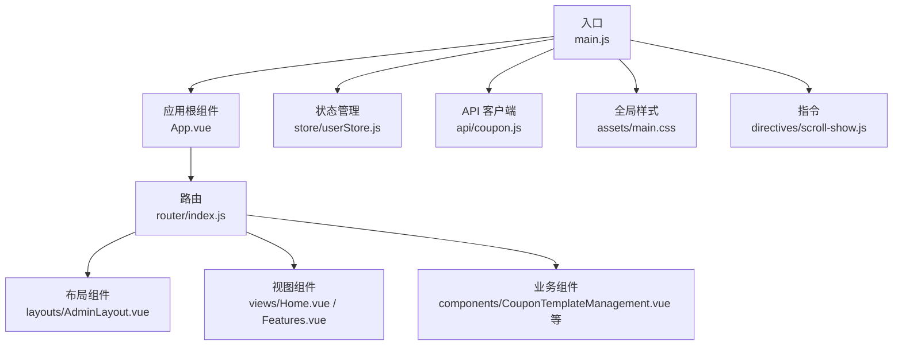
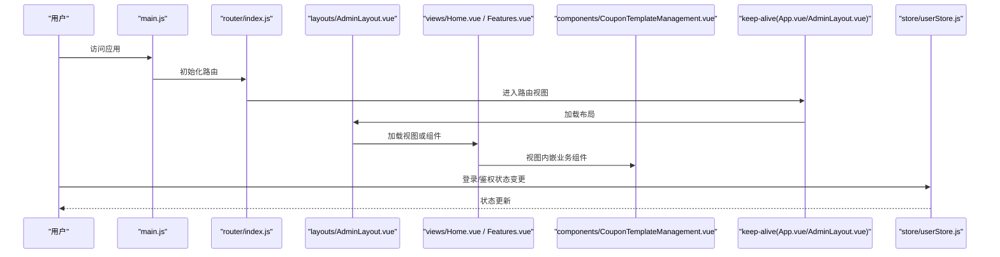
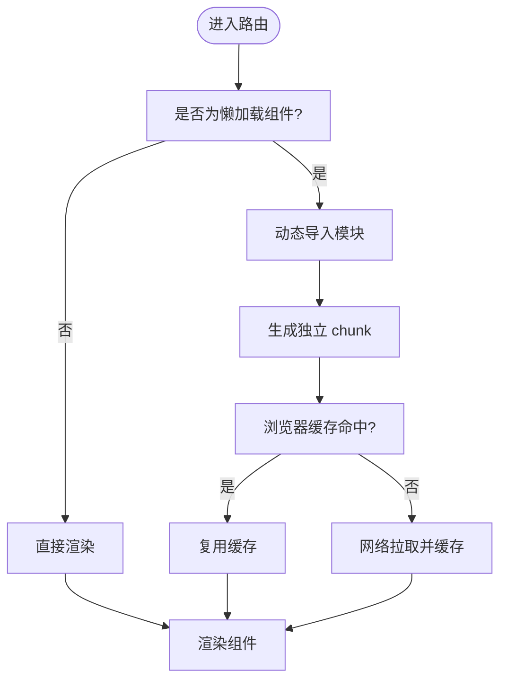
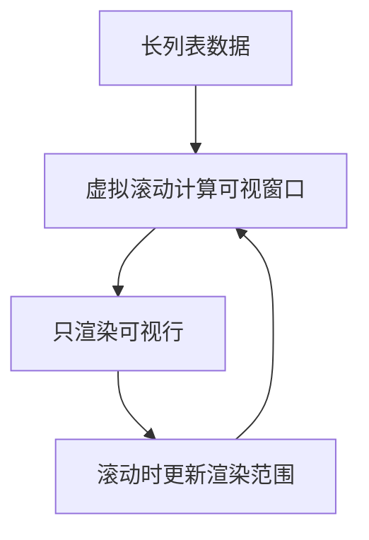
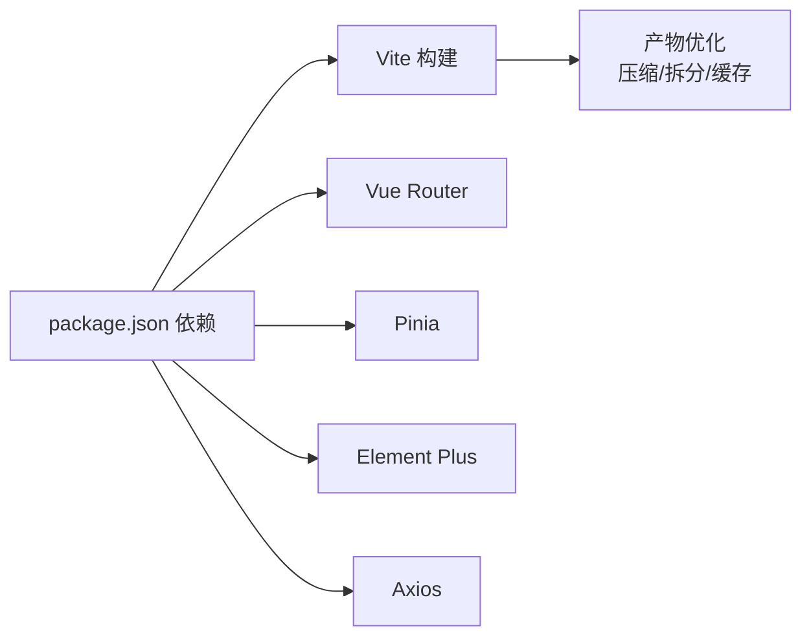

# 前端性能优化

<cite>
**本文引用的文件**
- [package.json](file://coupon/package.json)
- [vite.config.js](file://coupon/vite.config.js)
- [main.js](file://coupon/src/main.js)
- [index.js（路由）](file://coupon/src/router/index.js)
- [App.vue](file://coupon/src/App.vue)
- [AdminLayout.vue](file://coupon/src/layouts/AdminLayout.vue)
- [CouponTemplateManagement.vue](file://coupon/src/components/CouponTemplateManagement.vue)
- [Home.vue](file://coupon/src/views/Home.vue)
- [Features.vue](file://coupon/src/views/Features.vue)
- [Login.vue](file://coupon/src/components/Login.vue)
- [userStore.js](file://coupon/src/store/userStore.js)
- [coupon.js（API 客户端）](file://coupon/src/api/coupon.js)
- [plugins.js](file://coupon/src/utils/plugins.js)
- [main.css](file://coupon/src/assets/main.css)
- [scroll-show.js（指令）](file://coupon/src/directives/scroll-show.js)
</cite>

## 目录
1. [简介](#简介)
2. [项目结构](#项目结构)
3. [核心组件](#核心组件)
4. [架构总览](#架构总览)
5. [详细组件分析](#详细组件分析)
6. [依赖分析](#依赖分析)
7. [性能考量](#性能考量)
8. [故障排查指南](#故障排查指南)
9. [结论](#结论)
10. [附录](#附录)

## 简介
本指南面向 MapleCoupon 前端（Vue 3 + Vite）应用，围绕性能优化目标提供系统化实践建议，覆盖以下主题：
- 组件懒加载与代码分割
- 虚拟滚动与长列表优化
- 图片、字体与资源压缩合并
- 浏览器缓存策略（HTTP 缓存头、Service Worker、本地存储）
- 页面渲染性能（首屏、关键渲染路径、防抖节流）
- 前端监控与性能分析（Web Vitals、用户体验指标）
- 性能测试工具与优化前后对比方法

## 项目结构
MapleCoupon 前端采用 Vue 3 单页应用（SPA），使用 Vite 构建，路由基于 vue-router，状态管理使用 Pinia。项目目录中包含组件、视图、布局、API 客户端、状态仓库、工具函数与样式资源。

**图表来源**
- [main.js:1-34](file://coupon/src/main.js#L1-L34)
- [App.vue:1-89](file://coupon/src/App.vue#L1-L89)
- [index.js（路由）:1-127](file://coupon/src/router/index.js#L1-L127)
- [AdminLayout.vue:1-800](file://coupon/src/layouts/AdminLayout.vue#L1-L800)
- [CouponTemplateManagement.vue:1-913](file://coupon/src/components/CouponTemplateManagement.vue#L1-L913)
- [Home.vue:1-1362](file://coupon/src/views/Home.vue#L1-L1362)
- [Features.vue:1-821](file://coupon/src/views/Features.vue#L1-L821)
- [userStore.js:1-19](file://coupon/src/store/userStore.js#L1-L19)
- [coupon.js（API 客户端）:1-145](file://coupon/src/api/coupon.js#L1-L145)
- [main.css:1-147](file://coupon/src/assets/main.css#L1-L147)
- [scroll-show.js（指令）:1-16](file://coupon/src/directives/scroll-show.js#L1-L16)

**章节来源**
- [main.js:1-34](file://coupon/src/main.js#L1-L34)
- [index.js（路由）:1-127](file://coupon/src/router/index.js#L1-L127)

## 核心组件
- 应用入口与插件注册：在入口中注册 Pinia、Element Plus、路由、全局 API 客户端与指令，统一挂载全局属性，便于后续性能优化扩展。
- 路由与懒加载：路由中已对多个管理类页面采用动态导入实现懒加载，减少初始包体。
- 布局与 Keep-alive：根组件与布局均使用 keep-alive 包裹，结合路由 meta.keepAlive 实现页面级缓存，降低重复渲染成本。
- 组件与长列表：管理组件中存在大量表格与分页，适合引入虚拟滚动与分页优化。
- 指令与滚动：提供滚动显示指令，结合 IntersectionObserver 控制元素可见性，避免不必要的渲染。

**章节来源**
- [main.js:16-33](file://coupon/src/main.js#L16-L33)
- [index.js（路由）:43-83](file://coupon/src/router/index.js#L43-L83)
- [App.vue:8-14](file://coupon/src/App.vue#L8-L14)
- [AdminLayout.vue:68-74](file://coupon/src/layouts/AdminLayout.vue#L68-L74)
- [CouponTemplateManagement.vue:91-181](file://coupon/src/components/CouponTemplateManagement.vue#L91-L181)
- [scroll-show.js（指令）:1-16](file://coupon/src/directives/scroll-show.js#L1-L16)

## 架构总览
下图展示前端从入口到组件的关键调用链与缓存策略：

**图表来源**
- [main.js:16-33](file://coupon/src/main.js#L16-L33)
- [index.js（路由）:1-127](file://coupon/src/router/index.js#L1-L127)
- [App.vue:8-14](file://coupon/src/App.vue#L8-L14)
- [AdminLayout.vue:68-74](file://coupon/src/layouts/AdminLayout.vue#L68-L74)
- [Home.vue:1-1362](file://coupon/src/views/Home.vue#L1-L1362)
- [Features.vue:1-821](file://coupon/src/views/Features.vue#L1-L821)
- [CouponTemplateManagement.vue:1-913](file://coupon/src/components/CouponTemplateManagement.vue#L1-L913)
- [userStore.js:1-19](file://coupon/src/store/userStore.js#L1-L19)

## 详细组件分析

### 组件懒加载与代码分割
- 现状：路由中对管理类页面采用动态导入实现懒加载，减少初始包体积。
- 建议：对大型第三方库（如图表库）按需引入；对非首屏组件进一步拆分；利用 Vite 的动态 import 生成独立 chunk 并启用预取策略。

**图表来源**
- [index.js（路由）:43-83](file://coupon/src/router/index.js#L43-L83)

**章节来源**
- [index.js（路由）:43-83](file://coupon/src/router/index.js#L43-L83)

### 虚拟滚动与长列表优化
- 现状：管理组件使用表格组件并开启分页，但未见虚拟滚动实现。
- 建议：对大列表引入虚拟滚动（如基于组件库的虚拟化或专用虚拟滚动库），仅渲染可视区域内的行，显著降低 DOM 节点数与重排开销。

[此图为概念示意，无需图表来源]

**章节来源**
- [CouponTemplateManagement.vue:91-181](file://coupon/src/components/CouponTemplateManagement.vue#L91-L181)

### 图片、字体与资源优化
- 现状：项目中存在多处静态资源引用与背景图使用。
- 建议：
  - 图片：使用现代格式（WebP/AVIF）、按需加载、懒加载、响应式尺寸与密度切换。
  - 字体：使用可变字体、裁剪字形、按需加载、CDN 与缓存头优化。
  - CSS/JS：启用最小化与 Tree Shaking；对第三方库进行按需导入；合理拆分公共块。

**章节来源**
- [Home.vue:131-172](file://coupon/src/views/Home.vue#L131-L172)
- [Features.vue:168-172](file://coupon/src/views/Features.vue#L168-L172)

### 浏览器缓存策略
- HTTP 缓存头：对静态资源设置强缓存与协商缓存头，结合版本化文件名提升缓存命中率。
- Service Worker：可选实现离线缓存与渐进式应用体验，优先缓存关键静态资源与 HTML。
- 本地存储：合理使用 localStorage/sessionStorage 存储轻量状态，避免阻塞主线程。

**章节来源**
- [coupon.js（API 客户端）:1-145](file://coupon/src/api/coupon.js#L1-L145)
- [userStore.js:1-19](file://coupon/src/store/userStore.js#L1-L19)

### 页面渲染性能优化
- 首屏优化：将非关键 CSS 内联、延迟加载非首屏脚本、使用骨架屏与占位图。
- 关键渲染路径：避免阻塞渲染的 JS/CSS、减少主线程长任务、使用 requestAnimationFrame 与 Web Workers。
- 防抖节流：对滚动、输入、窗口大小变化等高频事件进行节流/防抖，降低重绘频率。

**章节来源**
- [Home.vue:153-171](file://coupon/src/views/Home.vue#L153-L171)
- [scroll-show.js（指令）:1-16](file://coupon/src/directives/scroll-show.js#L1-L16)

### 前端监控与性能分析
- Web Vitals：集成 Web Vitals 指标采集（LCP、FID、CLS、INP），在生产环境上报。
- 用户体验分析：记录交互时延、错误日志、用户路径与转化漏斗。
- 工具：Lighthouse、Chrome DevTools Performance/Network、WebPageTest、Sentry。

**章节来源**
- [coupon.js（API 客户端）:22-45](file://coupon/src/api/coupon.js#L22-L45)

### 性能测试与对比方法
- 工具：Lighthouse（自动化）、WebPageTest（多地测试）、Chrome DevTools Performance（手动分析）。
- 指标：首次内容绘制（FCP）、最大内容绘制（LCP）、累积布局偏移（CLS）、交互时间（TTI）。
- 方法：A/B 对比不同优化策略，记录关键指标变化并评估收益。

[本节为通用指导，无需章节来源]

## 依赖分析
- 构建与打包：Vite 提供快速冷启动与热更新；可通过插件扩展压缩、分析与产物拆分。
- 运行时依赖：Vue 3、Element Plus、Axios、Pinia、Vue Router 等。
- 开发依赖：Vite 插件、PostCSS、TailwindCSS、Sass 等。

**图表来源**
- [package.json:11-35](file://coupon/package.json#L11-L35)
- [vite.config.js:1-28](file://coupon/vite.config.js#L1-L28)

**章节来源**
- [package.json:11-35](file://coupon/package.json#L11-L35)
- [vite.config.js:1-28](file://coupon/vite.config.js#L1-L28)

## 性能考量
- 代码分割：按路由与组件维度拆分，结合预取策略提升首屏与交互性能。
- 资源压缩：启用最小化与 Tree Shaking，避免冗余代码。
- 渲染优化：使用 keep-alive 缓存、虚拟滚动、指令控制可见性、减少不必要的响应式依赖。
- 网络优化：合理设置缓存头、CDN 加速、预加载关键资源、延迟加载非关键资源。
- 监控与回滚：建立性能基线与告警，优化后持续观测指标变化。

[本节为通用指导，无需章节来源]

## 故障排查指南
- 路由守卫异常：检查路由守卫中的错误处理与异常分支，避免阻塞导航。
- API 请求失败：关注响应拦截器中的 401 处理与状态更新逻辑，确保登录态同步。
- 指令失效：确认 IntersectionObserver 的阈值与目标元素可见性，避免过度触发。
- 状态不一致：检查本地存储与 Pinia 状态同步，避免竞态条件。

**章节来源**
- [index.js（路由）:92-124](file://coupon/src/router/index.js#L92-L124)
- [coupon.js（API 客户端）:22-45](file://coupon/src/api/coupon.js#L22-L45)
- [scroll-show.js（指令）:1-16](file://coupon/src/directives/scroll-show.js#L1-L16)
- [userStore.js:1-19](file://coupon/src/store/userStore.js#L1-L19)

## 结论
通过组件懒加载与代码分割、虚拟滚动、资源优化、缓存策略与渲染优化，MapleCoupon 前端可在保证功能完整性的同时显著提升性能与用户体验。建议以 Web Vitals 为核心指标，持续监控与迭代优化策略，并结合性能测试工具形成闭环。

## 附录
- 优化清单
  - 启用路由级懒加载与预取
  - 对长列表引入虚拟滚动
  - 图片与字体按需加载与压缩
  - 设置合理的 HTTP 缓存头
  - 使用 Service Worker 实现离线缓存
  - 建立 Web Vitals 监控与报告
  - 使用 Lighthouse/DevTools 进行回归测试

[本节为通用指导，无需章节来源]