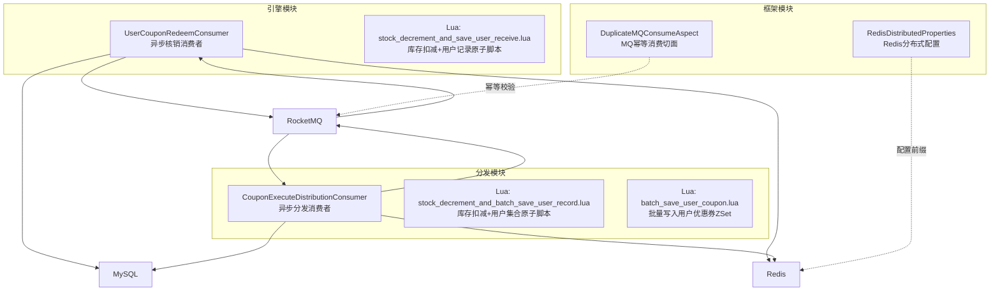
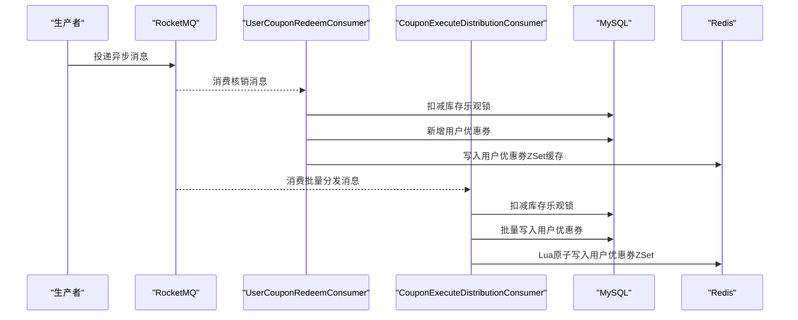
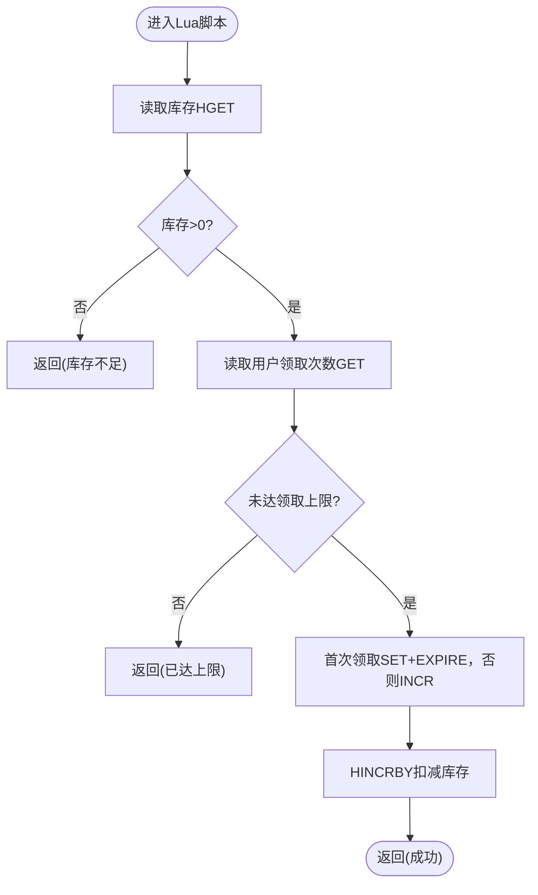
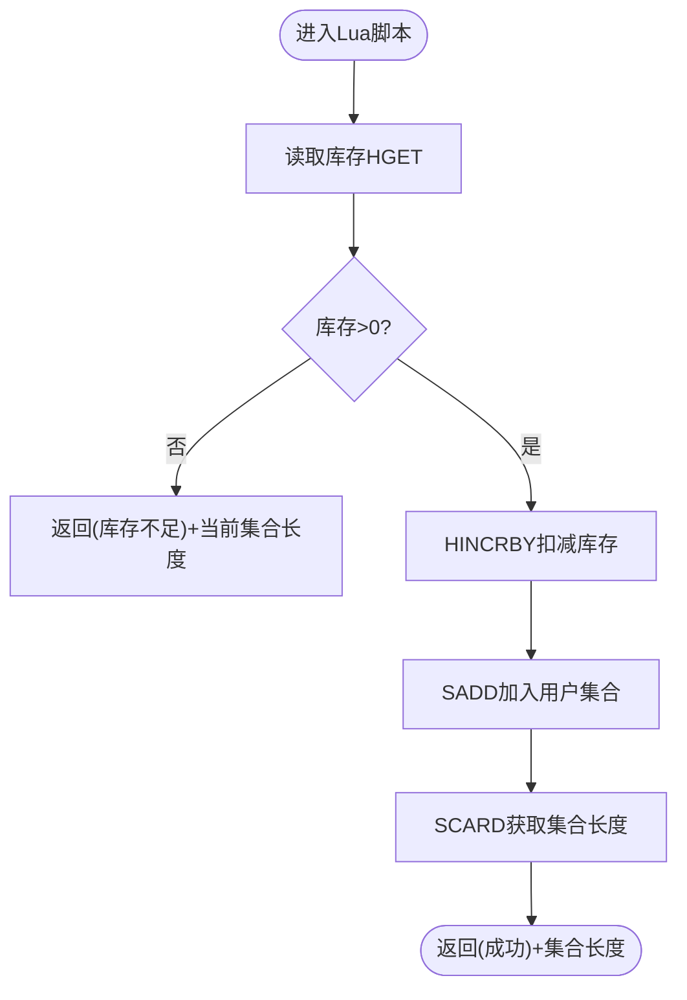
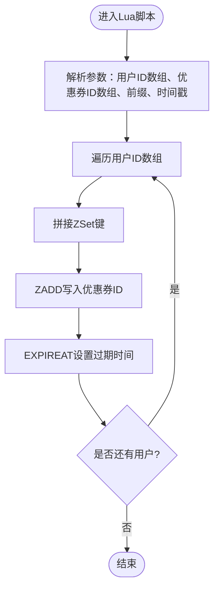
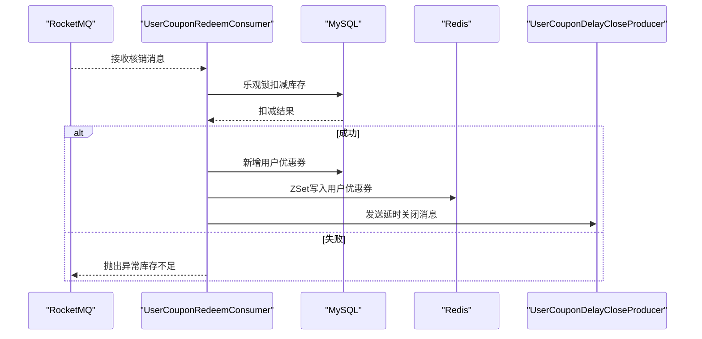
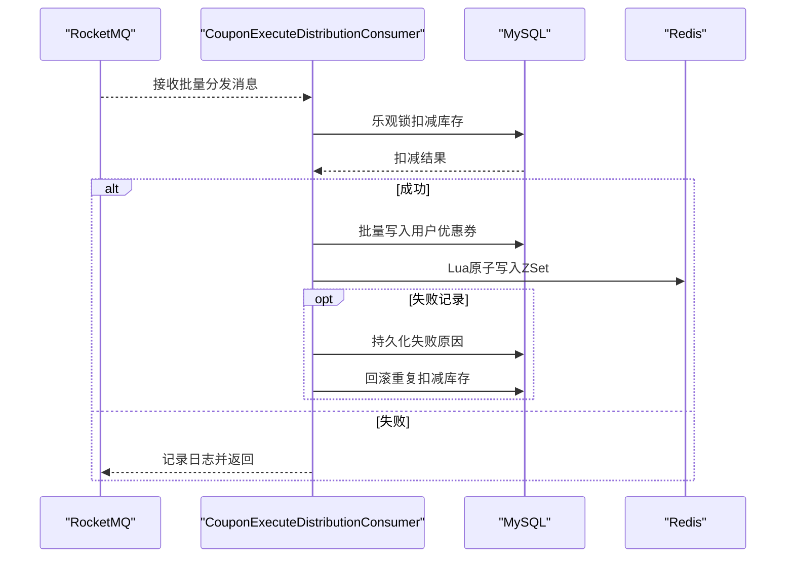
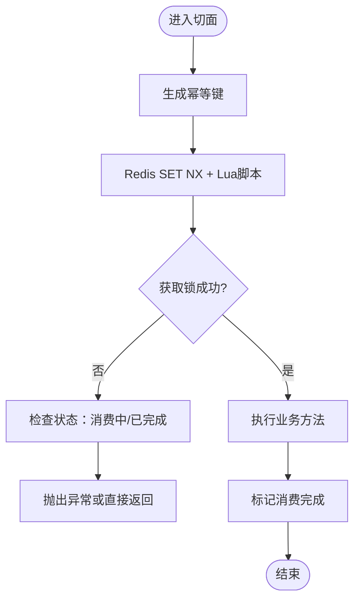
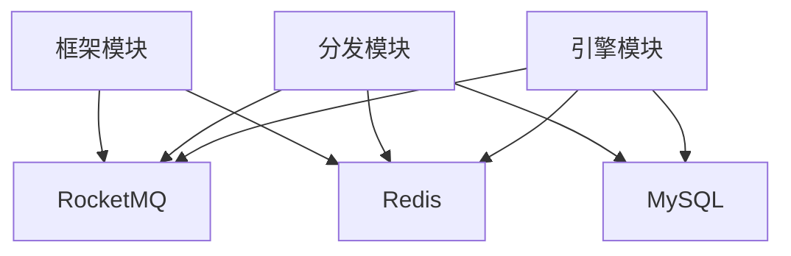

# 并发优化

<cite>
**本文引用的文件**
- [engine/src/main/resources/lua/stock_decrement_and_save_user_receive.lua](file://engine/src/main/resources/lua/stock_decrement_and_save_user_receive.lua)
- [distribution/src/main/resources/lua/stock_decrement_and_batch_save_user_record.lua](file://distribution/src/main/resources/lua/stock_decrement_and_batch_save_user_record.lua)
- [distribution/src/main/resources/lua/batch_save_user_coupon.lua](file://distribution/src/main/resources/lua/batch_save_user_coupon.lua)
- [distribution/src/main/java/com/fengxin/maplecoupon/distribution/mq/consumer/CouponExecuteDistributionConsumer.java](file://distribution/src/main/java/com/fengxin/maplecoupon/distribution/mq/consumer/CouponExecuteDistributionConsumer.java)
- [engine/src/main/java/com/fengxin/maplecoupon/engine/mq/consumer/UserCouponRedeemConsumer.java](file://engine/src/main/java/com/fengxin/maplecoupon/engine/mq/consumer/UserCouponRedeemConsumer.java)
- [framework/src/main/java/com/fengxin/idempotent/DuplicateMQConsumeAspect.java](file://framework/src/main/java/com/fengxin/idempotent/DuplicateMQConsumeAspect.java)
- [framework/src/main/java/com/fengxin/config/RedisDistributedProperties.java](file://framework/src/main/java/com/fengxin/config/RedisDistributedProperties.java)
</cite>

## 目录
1. [简介](#简介)
2. [项目结构](#项目结构)
3. [核心组件](#核心组件)
4. [架构总览](#架构总览)
5. [详细组件分析](#详细组件分析)
6. [依赖分析](#依赖分析)
7. [性能考量](#性能考量)
8. [故障排查指南](#故障排查指南)
9. [结论](#结论)
10. [附录](#附录)

## 简介
本文件面向MapleCoupon系统的高并发优化，系统通过“数据库+Redis”的双层并发控制与“消息队列异步解耦”实现削峰填谷与强一致性的保障。重点覆盖以下方面：
- 乐观锁、悲观锁与无锁编程的应用场景与实现要点
- Lua脚本在数据库操作中的原子性保证，包括库存扣减与批量保存
- 异步处理与消息队列（RocketMQ）在并发优化中的作用
- 线程池配置与任务调度的优化策略
- 分布式锁与并发控制机制（Redis分布式锁）
- 具体并发测试场景与性能基准建议

## 项目结构
MapleCoupon采用多模块微服务架构，围绕“引擎（engine）”、“分发（distribution）”、“网关（gateway）”、“商户后台（merchant-admin）”、“结算（settlement）”、“认证（auth）”、“框架（framework）”等模块协同工作。其中与并发优化直接相关的关键模块与文件如下：
- 引擎模块：负责优惠券核销与库存扣减的实时处理，使用Lua脚本保障原子性
- 分发模块：负责大批量优惠券的异步分发，结合Redis与RocketMQ实现削峰填谷
- 框架模块：提供幂等消费切面、Redis分布式配置等通用能力

图表来源
- [engine/src/main/java/com/fengxin/maplecoupon/engine/mq/consumer/UserCouponRedeemConsumer.java:49-124](file://engine/src/main/java/com/fengxin/maplecoupon/engine/mq/consumer/UserCouponRedeemConsumer.java#L49-L124)
- [distribution/src/main/java/com/fengxin/maplecoupon/distribution/mq/consumer/CouponExecuteDistributionConsumer.java:67-334](file://distribution/src/main/java/com/fengxin/maplecoupon/distribution/mq/consumer/CouponExecuteDistributionConsumer.java#L67-L334)
- [engine/src/main/resources/lua/stock_decrement_and_save_user_receive.lua:1-58](file://engine/src/main/resources/lua/stock_decrement_and_save_user_receive.lua#L1-L58)
- [distribution/src/main/resources/lua/stock_decrement_and_batch_save_user_record.lua:1-33](file://distribution/src/main/resources/lua/stock_decrement_and_batch_save_user_record.lua#L1-L33)
- [distribution/src/main/resources/lua/batch_save_user_coupon.lua:1-16](file://distribution/src/main/resources/lua/batch_save_user_coupon.lua#L1-L16)
- [framework/src/main/java/com/fengxin/idempotent/DuplicateMQConsumeAspect.java:30-86](file://framework/src/main/java/com/fengxin/idempotent/DuplicateMQConsumeAspect.java#L30-L86)
- [framework/src/main/java/com/fengxin/config/RedisDistributedProperties.java:11-24](file://framework/src/main/java/com/fengxin/config/RedisDistributedProperties.java#L11-L24)

章节来源
- [engine/src/main/java/com/fengxin/maplecoupon/engine/mq/consumer/UserCouponRedeemConsumer.java:49-124](file://engine/src/main/java/com/fengxin/maplecoupon/engine/mq/consumer/UserCouponRedeemConsumer.java#L49-L124)
- [distribution/src/main/java/com/fengxin/maplecoupon/distribution/mq/consumer/CouponExecuteDistributionConsumer.java:67-334](file://distribution/src/main/java/com/fengxin/maplecoupon/distribution/mq/consumer/CouponExecuteDistributionConsumer.java#L67-L334)
- [framework/src/main/java/com/fengxin/idempotent/DuplicateMQConsumeAspect.java:30-86](file://framework/src/main/java/com/fengxin/idempotent/DuplicateMQConsumeAspect.java#L30-L86)
- [framework/src/main/java/com/fengxin/config/RedisDistributedProperties.java:11-24](file://framework/src/main/java/com/fengxin/config/RedisDistributedProperties.java#L11-L24)

## 核心组件
- 引擎模块消费者：接收异步核销请求，执行库存扣减与用户优惠券落库，同时维护Redis缓存，确保最终一致性与高吞吐
- 分发模块消费者：接收批量分发任务，先扣减数据库库存，再批量写入用户优惠券，最后通过Lua脚本原子化写入用户优惠券ZSet，避免并发冲突
- 框架模块幂等切面：基于Redis SET NX + Lua脚本实现MQ幂等消费，防止重复处理
- Redis配置：提供统一的Key前缀与编码配置，便于分布式锁与幂等键的命名规范

章节来源
- [engine/src/main/java/com/fengxin/maplecoupon/engine/mq/consumer/UserCouponRedeemConsumer.java:49-124](file://engine/src/main/java/com/fengxin/maplecoupon/engine/mq/consumer/UserCouponRedeemConsumer.java#L49-L124)
- [distribution/src/main/java/com/fengxin/maplecoupon/distribution/mq/consumer/CouponExecuteDistributionConsumer.java:67-334](file://distribution/src/main/java/com/fengxin/maplecoupon/distribution/mq/consumer/CouponExecuteDistributionConsumer.java#L67-L334)
- [framework/src/main/java/com/fengxin/idempotent/DuplicateMQConsumeAspect.java:30-86](file://framework/src/main/java/com/fengxin/idempotent/DuplicateMQConsumeAspect.java#L30-L86)
- [framework/src/main/java/com/fengxin/config/RedisDistributedProperties.java:11-24](file://framework/src/main/java/com/fengxin/config/RedisDistributedProperties.java#L11-L24)

## 架构总览
系统通过RocketMQ实现“生产者-消费者”的异步解耦，消费者在本地缓冲一定批次后再批量写入数据库，配合Redis实现高并发下的原子操作与缓存一致性。

图表来源
- [engine/src/main/java/com/fengxin/maplecoupon/engine/mq/consumer/UserCouponRedeemConsumer.java:54-123](file://engine/src/main/java/com/fengxin/maplecoupon/engine/mq/consumer/UserCouponRedeemConsumer.java#L54-L123)
- [distribution/src/main/java/com/fengxin/maplecoupon/distribution/mq/consumer/CouponExecuteDistributionConsumer.java:170-243](file://distribution/src/main/java/com/fengxin/maplecoupon/distribution/mq/consumer/CouponExecuteDistributionConsumer.java#L170-L243)

## 详细组件分析

### 组件A：库存扣减与用户记录原子脚本（引擎）
该脚本在Redis中以原子方式完成库存检查、用户领取次数判断、库存扣减与用户领取计数更新，返回组合字段用于上层判断。

图表来源
- [engine/src/main/resources/lua/stock_decrement_and_save_user_receive.lua:9-58](file://engine/src/main/resources/lua/stock_decrement_and_save_user_receive.lua#L9-L58)

章节来源
- [engine/src/main/resources/lua/stock_decrement_and_save_user_receive.lua:1-58](file://engine/src/main/resources/lua/stock_decrement_and_save_user_receive.lua#L1-L58)

### 组件B：批量分发与用户集合原子脚本（分发）
该脚本在Redis中以原子方式完成库存检查、用户集合写入与集合长度统计，返回组合字段用于上层判断；随后通过Lua脚本原子化写入用户优惠券ZSet。

图表来源
- [distribution/src/main/resources/lua/stock_decrement_and_batch_save_user_record.lua:15-33](file://distribution/src/main/resources/lua/stock_decrement_and_batch_save_user_record.lua#L15-L33)

章节来源
- [distribution/src/main/resources/lua/stock_decrement_and_batch_save_user_record.lua:1-33](file://distribution/src/main/resources/lua/stock_decrement_and_batch_save_user_record.lua#L1-L33)

### 组件C：批量写入用户优惠券ZSet（分发）
该脚本在Redis中对用户优惠券列表进行原子化批量写入，并设置过期时间，保证高并发下的一致性与性能。

图表来源
- [distribution/src/main/resources/lua/batch_save_user_coupon.lua:1-16](file://distribution/src/main/resources/lua/batch_save_user_coupon.lua#L1-L16)

章节来源
- [distribution/src/main/resources/lua/batch_save_user_coupon.lua:1-16](file://distribution/src/main/resources/lua/batch_save_user_coupon.lua#L1-L16)

### 组件D：异步核销消费者（引擎）
该消费者负责接收异步核销请求，执行数据库乐观锁扣减与用户优惠券落库，同时维护Redis缓存与延时关闭消息。

图表来源
- [engine/src/main/java/com/fengxin/maplecoupon/engine/mq/consumer/UserCouponRedeemConsumer.java:54-123](file://engine/src/main/java/com/fengxin/maplecoupon/engine/mq/consumer/UserCouponRedeemConsumer.java#L54-L123)

章节来源
- [engine/src/main/java/com/fengxin/maplecoupon/engine/mq/consumer/UserCouponRedeemConsumer.java:49-124](file://engine/src/main/java/com/fengxin/maplecoupon/engine/mq/consumer/UserCouponRedeemConsumer.java#L49-L124)

### 组件E：批量分发消费者（分发）
该消费者负责接收批量分发任务，先扣减数据库库存，再批量写入用户优惠券，最后通过Lua脚本原子化写入用户优惠券ZSet，并处理失败记录与库存回滚。

图表来源
- [distribution/src/main/java/com/fengxin/maplecoupon/distribution/mq/consumer/CouponExecuteDistributionConsumer.java:170-243](file://distribution/src/main/java/com/fengxin/maplecoupon/distribution/mq/consumer/CouponExecuteDistributionConsumer.java#L170-L243)

章节来源
- [distribution/src/main/java/com/fengxin/maplecoupon/distribution/mq/consumer/CouponExecuteDistributionConsumer.java:67-334](file://distribution/src/main/java/com/fengxin/maplecoupon/distribution/mq/consumer/CouponExecuteDistributionConsumer.java#L67-L334)

### 组件F：MQ幂等消费切面（框架）
该切面通过Redis SET NX + Lua脚本实现幂等消费，防止重复处理同一消息，提升系统在异常情况下的稳定性。

图表来源
- [framework/src/main/java/com/fengxin/idempotent/DuplicateMQConsumeAspect.java:39-72](file://framework/src/main/java/com/fengxin/idempotent/DuplicateMQConsumeAspect.java#L39-L72)

章节来源
- [framework/src/main/java/com/fengxin/idempotent/DuplicateMQConsumeAspect.java:30-86](file://framework/src/main/java/com/fengxin/idempotent/DuplicateMQConsumeAspect.java#L30-L86)

## 依赖分析
- 组件耦合与内聚
  - 引擎与分发模块均依赖RocketMQ进行异步解耦，消费者与生产者之间通过消息契约解耦
  - Redis作为缓存与幂等控制的核心，贯穿多个模块
  - MySQL通过乐观锁实现库存扣减的并发安全
- 外部依赖与集成点
  - RocketMQ：异步消息传输与削峰填谷
  - Redis：原子脚本、幂等控制、缓存
  - MyBatis Plus：批量写入与乐观锁实现

图表来源
- [engine/src/main/java/com/fengxin/maplecoupon/engine/mq/consumer/UserCouponRedeemConsumer.java:49-124](file://engine/src/main/java/com/fengxin/maplecoupon/engine/mq/consumer/UserCouponRedeemConsumer.java#L49-L124)
- [distribution/src/main/java/com/fengxin/maplecoupon/distribution/mq/consumer/CouponExecuteDistributionConsumer.java:67-334](file://distribution/src/main/java/com/fengxin/maplecoupon/distribution/mq/consumer/CouponExecuteDistributionConsumer.java#L67-L334)
- [framework/src/main/java/com/fengxin/idempotent/DuplicateMQConsumeAspect.java:30-86](file://framework/src/main/java/com/fengxin/idempotent/DuplicateMQConsumeAspect.java#L30-L86)

## 性能考量
- 乐观锁与无锁编程
  - 数据库层：通过MyBatis Plus的乐观锁实现库存扣减的并发安全，减少锁竞争
  - Redis层：通过Lua脚本实现原子操作，避免网络往返与竞态条件
- 异步处理与消息队列
  - RocketMQ实现削峰填谷，消费者批量处理降低数据库压力
  - 幂等切面避免重复消费导致的资源浪费
- 线程池与任务调度
  - 建议：固定大小线程池用于CPU密集型任务；可变线程池用于I/O密集型任务；有界队列防止内存溢出
  - 对于消费者线程池，建议根据消息积压情况动态调整并发度，并开启拒绝策略
- 缓存与批量写入
  - 使用Redis ZSet与Lua脚本进行批量写入，减少网络开销与锁粒度
  - 分批写入数据库，避免单次事务过大

## 故障排查指南
- 库存不足
  - 现象：消费者抛出“慢了一点点，被抢光啦”
  - 处理：检查库存扣减逻辑与并发峰值，必要时扩容或限流
- 批量写入失败
  - 现象：唯一索引冲突导致部分用户优惠券写入失败
  - 处理：记录失败原因并回滚库存，确保幂等与一致性
- Redis写入失败
  - 现象：Redis宕机或主从复制延迟导致ZSet写入失败
  - 处理：增加重试与延时消息，确保最终一致性
- MQ重复消费
  - 现象：幂等键已存在导致重复处理
  - 处理：启用幂等切面，避免重复消费

章节来源
- [engine/src/main/java/com/fengxin/maplecoupon/engine/mq/consumer/UserCouponRedeemConsumer.java:69-123](file://engine/src/main/java/com/fengxin/maplecoupon/engine/mq/consumer/UserCouponRedeemConsumer.java#L69-L123)
- [distribution/src/main/java/com/fengxin/maplecoupon/distribution/mq/consumer/CouponExecuteDistributionConsumer.java:275-316](file://distribution/src/main/java/com/fengxin/maplecoupon/distribution/mq/consumer/CouponExecuteDistributionConsumer.java#L275-L316)
- [framework/src/main/java/com/fengxin/idempotent/DuplicateMQConsumeAspect.java:50-71](file://framework/src/main/java/com/fengxin/idempotent/DuplicateMQConsumeAspect.java#L50-L71)

## 结论
MapleCoupon通过“数据库乐观锁 + Redis Lua原子脚本 + RocketMQ异步解耦”的组合拳，在高并发场景下实现了高性能与高可靠。建议在生产环境中进一步完善线程池配置、监控告警与容量规划，并持续优化热点库存与缓存命中策略。

## 附录
- 并发测试场景建议
  - 场景A：秒杀式核销峰值（10万/秒），验证Redis原子脚本与数据库乐观锁的极限
  - 场景B：批量分发（百万级用户），验证消费者批量写入与Lua脚本的吞吐
  - 场景C：MQ幂等性（重复投递与网络抖动），验证幂等切面与延时消息
- 性能基准建议
  - 基准指标：TPS、P99延迟、Redis命中率、数据库锁等待时间
  - 建议工具：JMeter、Gatling、Prometheus+Grafana
  - 建议阈值：P99延迟<100ms，Redis命中率>99%，数据库锁等待时间<1ms