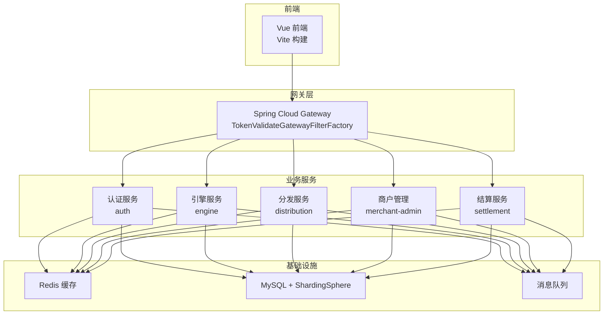
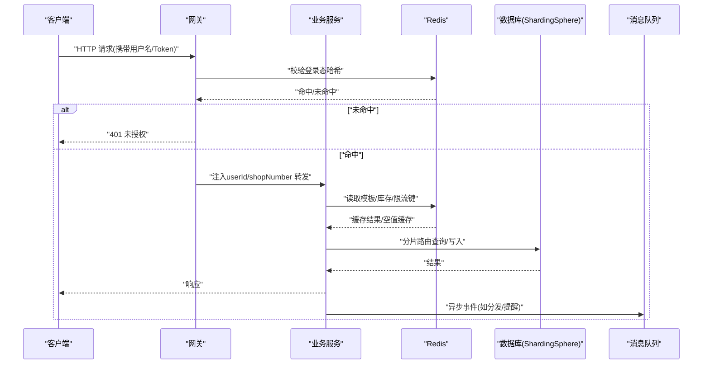
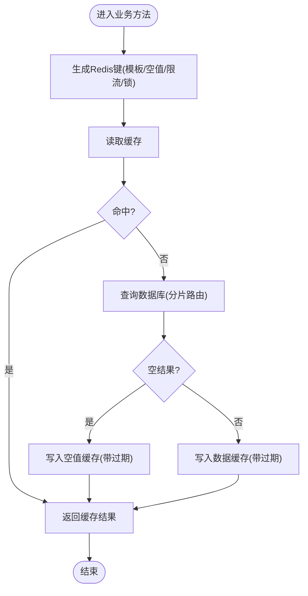
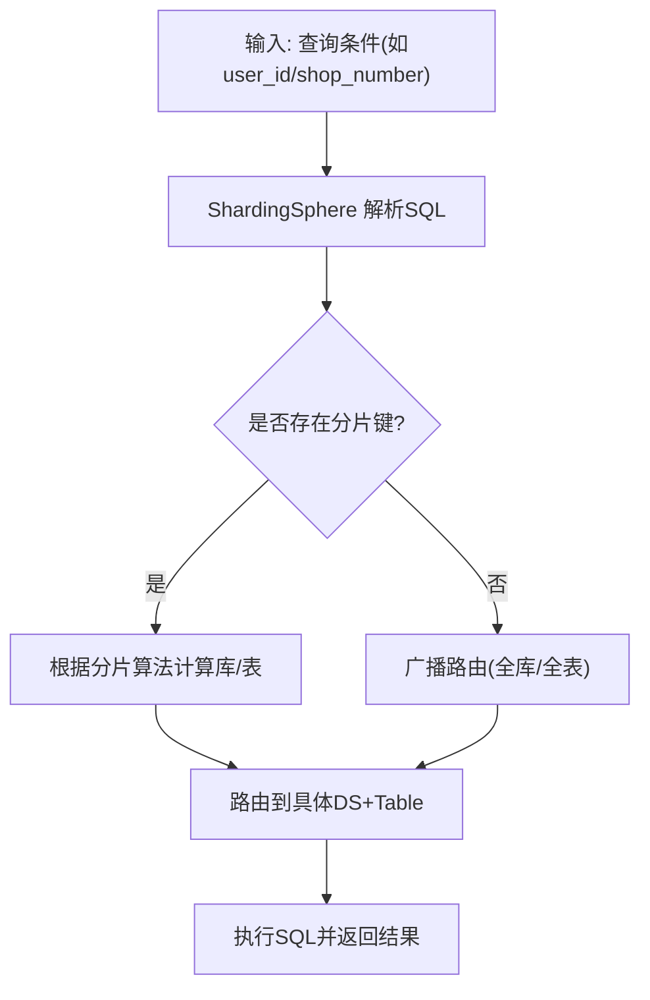
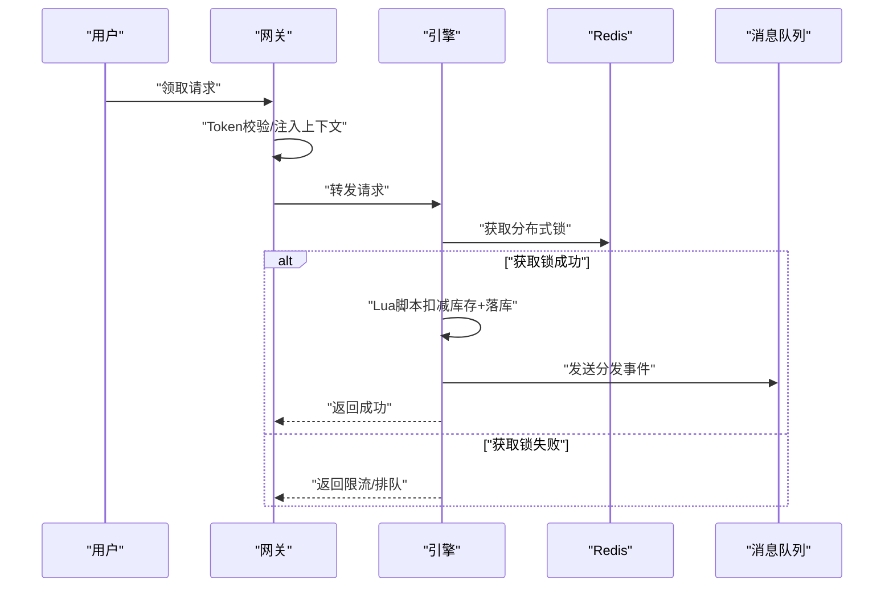
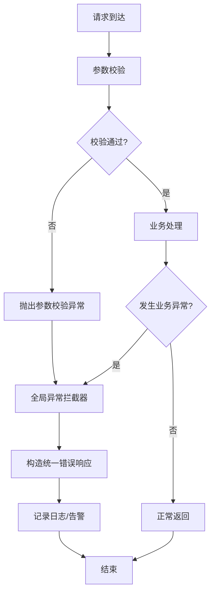
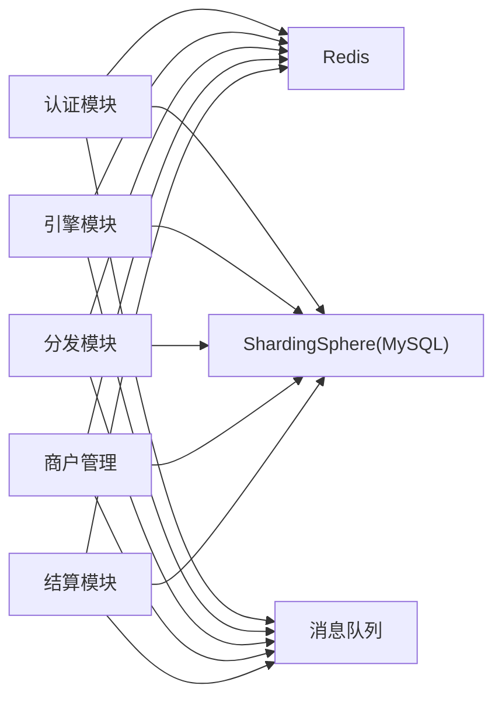

# 性能优化

<cite>
**本文引用的文件**
- [application.yaml（认证模块）](file://auth/src/main/resources/application.yaml)
- [application.yaml（引擎模块）](file://engine/src/main/resources/application.yaml)
- [application.yaml（分发模块）](file://distribution/src/main/resources/application.yaml)
- [CacheConfiguration.java](file://framework/src/main/java/com/fengxin/config/CacheConfiguration.java)
- [RedisDistributedProperties.java](file://framework/src/main/java/com/fengxin/config/RedisDistributedProperties.java)
- [EngineRedisConstant（认证）.java](file://auth/src/main/java/com/fengxin/maplecoupon/auth/common/constant/EngineRedisConstant.java)
- [EngineRedisConstant（引擎）.java](file://engine/src/main/java/com/fengxin/maplecoupon/engine/common/constant/EngineRedisConstant.java)
- [DistributionRedisConstant.java](file://distribution/src/main/java/com/fengxin/maplecoupon/distribution/common/constant/DistributionRedisConstant.java)
- [GlobalExceptionHandler.java](file://framework/src/main/java/com/fengxin/web/GlobalExceptionHandler.java)
- [TokenValidateGatewayFilterFactory.java](file://gateway/src/main/java/com/fengxin/maplecoupon/gateway/filter/TokenValidateGatewayFilterFactory.java)
- [shardingsphere-config-dev.yaml（认证）](file://auth/src/main/resources/shardingsphere-config-dev.yaml)
- [shardingsphere-config-dev.yaml（引擎）](file://engine/src/main/resources/shardingsphere-config-dev.yaml)
- [shardingsphere-config-dev.yaml（分发）](file://distribution/src/main/resources/shardingsphere-config-dev.yaml)
- [DataBaseConfiguration.java（认证）](file://auth/src/main/java/com/fengxin/maplecoupon/auth/config/DataBaseConfiguration.java)
- [vite.config.js（前端）](file://coupon/vite.config.js)
- [index.html（前端）](file://coupon/index.html)
- [package.json（前端）](file://coupon/package.json)
</cite>

## 目录
1. [简介](#简介)
2. [项目结构](#项目结构)
3. [核心组件](#核心组件)
4. [架构总览](#架构总览)
5. [详细组件分析](#详细组件分析)
6. [依赖分析](#依赖分析)
7. [性能考虑](#性能考虑)
8. [故障排查指南](#故障排查指南)
9. [结论](#结论)
10. [附录](#附录)

## 简介
本指南面向MapleCoupon系统的性能优化，覆盖缓存优化、数据库优化、网络优化与代码优化的全栈策略，并结合当前代码库中已实现的关键组件（如Redis键空间设计、ShardingSphere分库分表、全局异常处理、网关鉴权过滤等），给出可落地的实施方案与最佳实践。同时提供监控、瓶颈分析、性能测试与扩容策略建议，帮助在高并发场景下稳定提升系统吞吐与响应质量。

## 项目结构
MapleCoupon采用多模块微服务架构，包含认证、引擎、分发、商户管理、结算、网关与框架公共层。各业务模块均通过ShardingSphere进行分库分表，配合Redis实现热点数据与分布式锁控制；网关负责统一鉴权与请求转发；框架层提供全局异常处理与通用配置。

图示来源
- [TokenValidateGatewayFilterFactory.java](file://gateway/src/main/java/com/fengxin/maplecoupon/gateway/filter/TokenValidateGatewayFilterFactory.java)
- [EngineRedisConstant（引擎）.java](file://engine/src/main/java/com/fengxin/maplecoupon/engine/common/constant/EngineRedisConstant.java)
- [shardingsphere-config-dev.yaml（引擎）](file://engine/src/main/resources/shardingsphere-config-dev.yaml)

章节来源
- [application.yaml（认证模块）:1-19](file://auth/src/main/resources/application.yaml#L1-L19)
- [application.yaml（引擎模块）:1-22](file://engine/src/main/resources/application.yaml#L1-L22)
- [application.yaml（分发模块）:1-15](file://distribution/src/main/resources/application.yaml#L1-L15)
- [shardingsphere-config-dev.yaml（认证）:1-45](file://auth/src/main/resources/shardingsphere-config-dev.yaml#L1-L45)
- [shardingsphere-config-dev.yaml（引擎）:1-100](file://engine/src/main/resources/shardingsphere-config-dev.yaml#L1-L100)
- [shardingsphere-config-dev.yaml（分发）:1-69](file://distribution/src/main/resources/shardingsphere-config-dev.yaml#L1-L69)

## 核心组件
- Redis键空间与序列化：通过框架层的Redis配置与键前缀策略，统一管理键命名与序列化，降低键冲突与序列化开销。
- 分布式锁与热点缓存：业务模块广泛使用Redis键常量定义，结合空值缓存与用户维度限流键，缓解热点模板与用户领取压力。
- 分库分表策略：基于ShardingSphere的CLASS_BASED算法，按用户或店铺维度进行库表分片，提升写入扩展性与查询路由效率。
- 全局异常处理：集中处理参数校验与业务异常，避免异常穿透影响性能与可观测性。
- 网关鉴权过滤：在网关层完成Token校验与用户上下文注入，减少下游重复校验成本。

章节来源
- [CacheConfiguration.java:1-35](file://framework/src/main/java/com/fengxin/config/CacheConfiguration.java#L1-L35)
- [RedisDistributedProperties.java:1-25](file://framework/src/main/java/com/fengxin/config/RedisDistributedProperties.java#L1-L25)
- [EngineRedisConstant（引擎）.java:1-56](file://engine/src/main/java/com/fengxin/maplecoupon/engine/common/constant/EngineRedisConstant.java#L1-L56)
- [EngineRedisConstant（认证）.java:1-55](file://auth/src/main/java/com/fengxin/maplecoupon/auth/common/constant/EngineRedisConstant.java#L1-L55)
- [DistributionRedisConstant.java:1-21](file://distribution/src/main/java/com/fengxin/maplecoupon/distribution/common/constant/DistributionRedisConstant.java#L1-L21)
- [shardingsphere-config-dev.yaml（引擎）:1-100](file://engine/src/main/resources/shardingsphere-config-dev.yaml#L1-L100)
- [GlobalExceptionHandler.java:1-78](file://framework/src/main/java/com/fengxin/web/GlobalExceptionHandler.java#L1-L78)
- [TokenValidateGatewayFilterFactory.java:1-93](file://gateway/src/main/java/com/fengxin/maplecoupon/gateway/filter/TokenValidateGatewayFilterFactory.java#L1-L93)

## 架构总览
下图展示从客户端到后端服务的典型链路，强调鉴权前置、缓存优先与分库分表路由：

图示来源
- [TokenValidateGatewayFilterFactory.java:44-87](file://gateway/src/main/java/com/fengxin/maplecoupon/gateway/filter/TokenValidateGatewayFilterFactory.java#L44-L87)
- [EngineRedisConstant（引擎）.java:14-34](file://engine/src/main/java/com/fengxin/maplecoupon/engine/common/constant/EngineRedisConstant.java#L14-L34)
- [shardingsphere-config-dev.yaml（引擎）:18-61](file://engine/src/main/resources/shardingsphere-config-dev.yaml#L18-L61)

## 详细组件分析

### Redis缓存优化
- 键空间设计
  - 使用统一前缀与命名规范，区分模板缓存、空值缓存、用户领取限制、用户券列表、提醒检查与分布式锁等键域，便于运维与容量规划。
  - 认证与引擎模块分别定义了独立的键常量，避免跨模块键冲突。
- 键序列化与前缀
  - 通过框架层配置设置Key序列化器与前缀，确保键空间清晰且可维护。
- 空值缓存与限流
  - 使用“空值缓存”键避免缓存穿透；对用户领取模板次数与用户券列表使用用户维度键，降低热点竞争。
- 分布式锁
  - 使用“lock:...”前缀的分布式锁键，保障高并发下的库存扣减一致性。
- 热点数据处理
  - 对模板详情与热门活动采用预热与短时强缓存；对用户侧列表采用分页与本地缓存结合策略。

图示来源
- [EngineRedisConstant（引擎）.java:14-44](file://engine/src/main/java/com/fengxin/maplecoupon/engine/common/constant/EngineRedisConstant.java#L14-L44)
- [CacheConfiguration.java:24-34](file://framework/src/main/java/com/fengxin/config/CacheConfiguration.java#L24-L34)

章节来源
- [EngineRedisConstant（引擎）.java:1-56](file://engine/src/main/java/com/fengxin/maplecoupon/engine/common/constant/EngineRedisConstant.java#L1-L56)
- [EngineRedisConstant（认证）.java:1-55](file://auth/src/main/java/com/fengxin/maplecoupon/auth/common/constant/EngineRedisConstant.java#L1-L55)
- [DistributionRedisConstant.java:1-21](file://distribution/src/main/java/com/fengxin/maplecoupon/distribution/common/constant/DistributionRedisConstant.java#L1-L21)
- [CacheConfiguration.java:1-35](file://framework/src/main/java/com/fengxin/config/CacheConfiguration.java#L1-L35)
- [RedisDistributedProperties.java:1-25](file://framework/src/main/java/com/fengxin/config/RedisDistributedProperties.java#L1-L25)

### 数据库优化（分库分表与SQL）
- 分片策略
  - 引擎模块对模板、用户券、结算表按shop_number或user_id进行库表分片，分片数量分别为模板16×16、用户券32×32等，显著降低单表写入压力。
  - 认证模块对用户表按username进行库表分片，便于按用户维度快速定位。
- SQL与路由
  - 通过ShardingSphere的CLASS_BASED算法与actualDataNodes配置，实现精确路由；开启sql-show便于开发调试。
- MyBatis-Plus插件
  - 分页插件与元对象自动填充，减少重复SQL与冗余字段更新。

图示来源
- [shardingsphere-config-dev.yaml（引擎）:18-61](file://engine/src/main/resources/shardingsphere-config-dev.yaml#L18-L61)
- [shardingsphere-config-dev.yaml（认证）:18-42](file://auth/src/main/resources/shardingsphere-config-dev.yaml#L18-L42)
- [DataBaseConfiguration.java（认证）:25-30](file://auth/src/main/java/com/fengxin/maplecoupon/auth/config/DataBaseConfiguration.java#L25-L30)

章节来源
- [shardingsphere-config-dev.yaml（引擎）:1-100](file://engine/src/main/resources/shardingsphere-config-dev.yaml#L1-L100)
- [shardingsphere-config-dev.yaml（认证）:1-45](file://auth/src/main/resources/shardingsphere-config-dev.yaml#L1-L45)
- [shardingsphere-config-dev.yaml（分发）:1-69](file://distribution/src/main/resources/shardingsphere-config-dev.yaml#L1-L69)
- [DataBaseConfiguration.java（认证）:1-57](file://auth/src/main/java/com/fengxin/maplecoupon/auth/config/DataBaseConfiguration.java#L1-L57)

### 并发与异步处理
- 网关层鉴权前置
  - 在网关层完成Token校验与用户上下文注入，减少下游重复校验与线程占用。
- 分布式锁与幂等
  - 使用Redis分布式锁键保障库存扣减与任务执行的原子性；结合幂等注解与消息去重，避免重复消费。
- 异步事件
  - 通过消息队列异步处理分发、提醒、延迟关闭等事件，削峰填谷。

图示来源
- [TokenValidateGatewayFilterFactory.java:44-87](file://gateway/src/main/java/com/fengxin/maplecoupon/gateway/filter/TokenValidateGatewayFilterFactory.java#L44-L87)
- [EngineRedisConstant（引擎）.java:18-19](file://engine/src/main/java/com/fengxin/maplecoupon/engine/common/constant/EngineRedisConstant.java#L18-L19)
- [shardingsphere-config-dev.yaml（引擎）:18-61](file://engine/src/main/resources/shardingsphere-config-dev.yaml#L18-L61)

章节来源
- [TokenValidateGatewayFilterFactory.java:1-93](file://gateway/src/main/java/com/fengxin/maplecoupon/gateway/filter/TokenValidateGatewayFilterFactory.java#L1-L93)
- [EngineRedisConstant（引擎）.java:1-56](file://engine/src/main/java/com/fengxin/maplecoupon/engine/common/constant/EngineRedisConstant.java#L1-L56)

### 前端性能优化
- 构建与打包
  - 使用Vite进行快速构建与按需加载，结合Tree-shaking与代码分割，减少首屏体积。
- 资源压缩与缓存
  - 生产环境启用静态资源压缩与浏览器缓存策略；合理设置Cache-Control与ETag。
- 懒加载与虚拟滚动
  - 列表组件采用懒加载与虚拟滚动，降低DOM节点与渲染压力。
- 路由与组件
  - 将非关键页面与组件按需引入，避免一次性加载全部资源。

章节来源
- [vite.config.js（前端）](file://coupon/vite.config.js)
- [index.html（前端）](file://coupon/index.html)
- [package.json（前端）](file://coupon/package.json)

### 全局异常处理与错误降级
- 参数校验异常：统一收集首个字段错误并记录日志，避免异常栈泄露。
- 业务异常：封装错误码与消息，输出到客户端；记录精简堆栈用于定位。
- 未捕获异常：兜底返回统一错误响应，防止异常穿透。

图示来源
- [GlobalExceptionHandler.java:26-68](file://framework/src/main/java/com/fengxin/web/GlobalExceptionHandler.java#L26-L68)

章节来源
- [GlobalExceptionHandler.java:1-78](file://framework/src/main/java/com/fengxin/web/GlobalExceptionHandler.java#L1-L78)

## 依赖分析
- 组件耦合
  - 业务模块对Redis键常量与ShardingSphere配置存在直接依赖；网关对Redis进行鉴权查询，形成跨模块依赖。
- 外部依赖
  - MySQL（经ShardingSphere驱动）、Redis、消息队列（RocketMQ常量存在于各模块包路径中）。
- 循环依赖
  - 当前模块间以接口/DTO与配置为主，未见明显循环依赖迹象。

图示来源
- [EngineRedisConstant（引擎）.java:1-56](file://engine/src/main/java/com/fengxin/maplecoupon/engine/common/constant/EngineRedisConstant.java#L1-L56)
- [shardingsphere-config-dev.yaml（引擎）:1-100](file://engine/src/main/resources/shardingsphere-config-dev.yaml#L1-L100)

章节来源
- [EngineRedisConstant（引擎）.java:1-56](file://engine/src/main/java/com/fengxin/maplecoupon/engine/common/constant/EngineRedisConstant.java#L1-L56)
- [shardingsphere-config-dev.yaml（引擎）:1-100](file://engine/src/main/resources/shardingsphere-config-dev.yaml#L1-L100)

## 性能考虑
- 缓存优化
  - 合理设置TTL与空值缓存；对热点键增加本地缓存与批量读取；使用Lua脚本保证扣减与落库原子性。
- 数据库优化
  - 为高频查询字段建立复合索引；避免全表扫描；利用分片键进行精准路由；定期分析慢查询。
- 网络优化
  - 网关层统一鉴权与限流；启用HTTP/2与连接复用；对长尾请求进行超时与重试策略。
- 代码优化
  - 减少反射与字符串拼接；使用StringBuilder或模板；避免阻塞式IO；合理使用线程池与异步任务。
- 并发与限流
  - 结合Redis计数器与漏斗限流；对热点接口增加本地缓存与队列缓冲；对下游服务设置熔断与隔离。
- 前端优化
  - 图片懒加载与CDN加速；CSS/JS压缩与按需加载；骨架屏与占位符提升感知速度。

## 故障排查指南
- 鉴权失败
  - 检查网关过滤器是否正确读取Header与Redis哈希键；确认USER_LOGIN_KEY前缀与过期时间。
- 缓存穿透/击穿
  - 核对空值缓存键与TTL；检查热点模板是否预热；确认Lua脚本执行路径。
- 分片路由异常
  - 校验ShardingSphere配置中的actualDataNodes与分片算法类名；确认SQL中包含分片键。
- 全局异常
  - 查看全局异常处理器日志输出与错误码映射，定位具体异常来源。

章节来源
- [TokenValidateGatewayFilterFactory.java:44-87](file://gateway/src/main/java/com/fengxin/maplecoupon/gateway/filter/TokenValidateGatewayFilterFactory.java#L44-L87)
- [EngineRedisConstant（引擎）.java:23-24](file://engine/src/main/java/com/fengxin/maplecoupon/engine/common/constant/EngineRedisConstant.java#L23-L24)
- [shardingsphere-config-dev.yaml（引擎）:18-61](file://engine/src/main/resources/shardingsphere-config-dev.yaml#L18-L61)
- [GlobalExceptionHandler.java:26-68](file://framework/src/main/java/com/fengxin/web/GlobalExceptionHandler.java#L26-L68)

## 结论
通过在Redis键空间设计、分库分表路由、网关鉴权前置与全局异常处理等方面的系统化优化，MapleCoupon可在高并发场景下保持稳定与高性能。建议持续完善监控与压测体系，结合业务增长动态调整分片策略与缓存策略，确保系统在容量与一致性之间取得平衡。

## 附录
- 性能监控与指标
  - APM：接入APM工具采集链路追踪、错误率、P99时延与资源使用率。
  - 指标：QPS、错误率、缓存命中率、数据库RT、Redis命令耗时、GC与线程池饱和度。
- 性能测试与基准测试
  - 使用JMeter/Locust进行并发与场景测试；对关键路径（领取、查询、分发）做压力与稳定性测试。
- 扩容与负载均衡
  - 服务横向扩容：按流量与CPU使用率动态扩缩容；数据库按分片维度扩容；Redis使用集群模式与分片。
  - 负载均衡：网关层统一LB；后端服务注册中心自动发现；数据库读写分离与只读副本扩展。