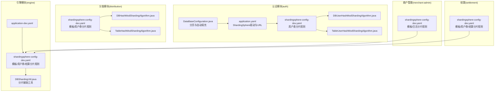
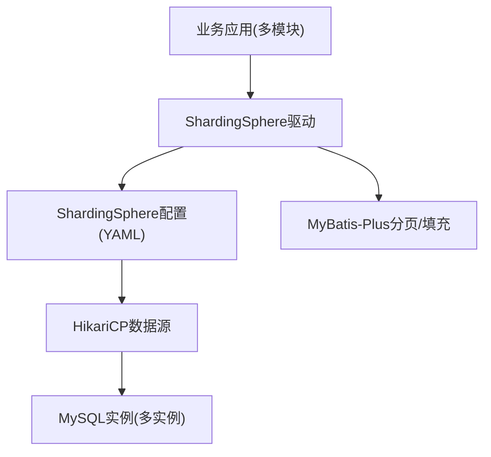
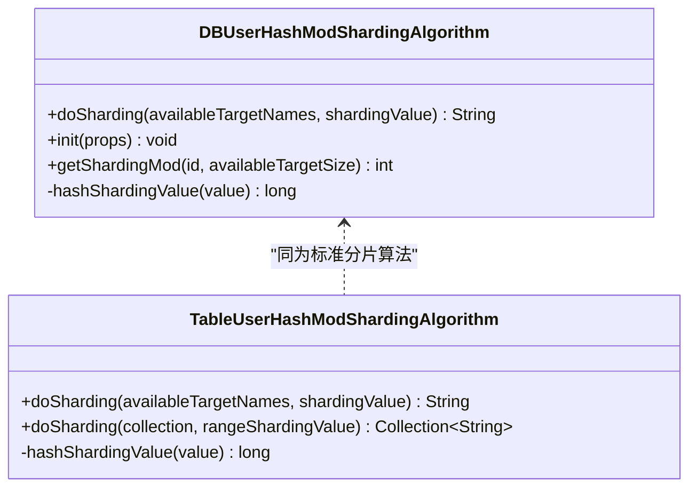
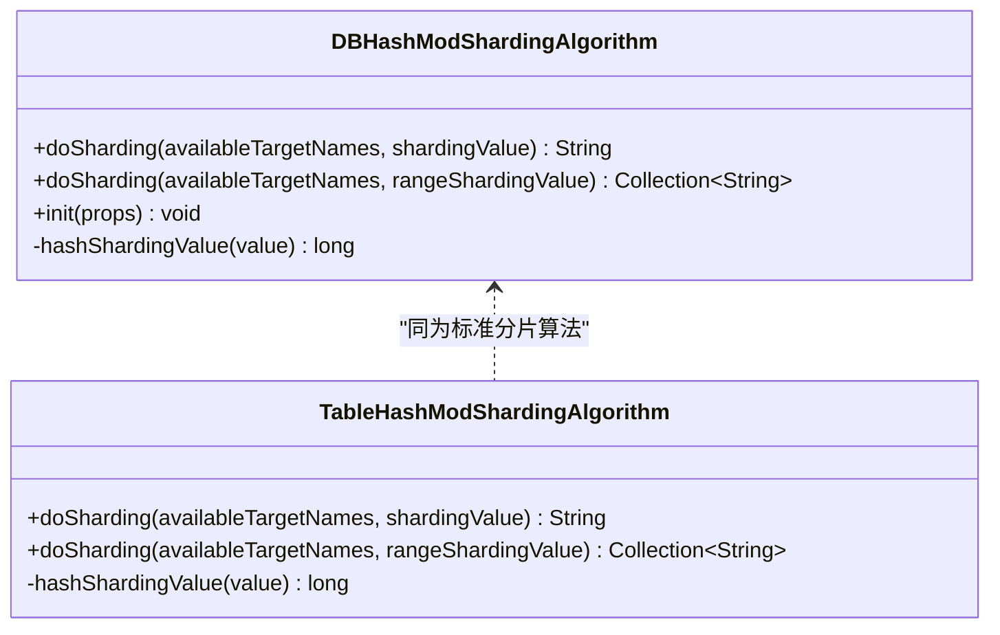
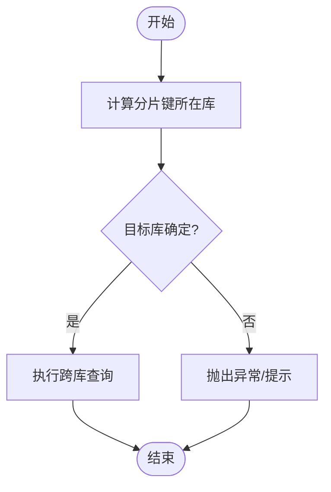
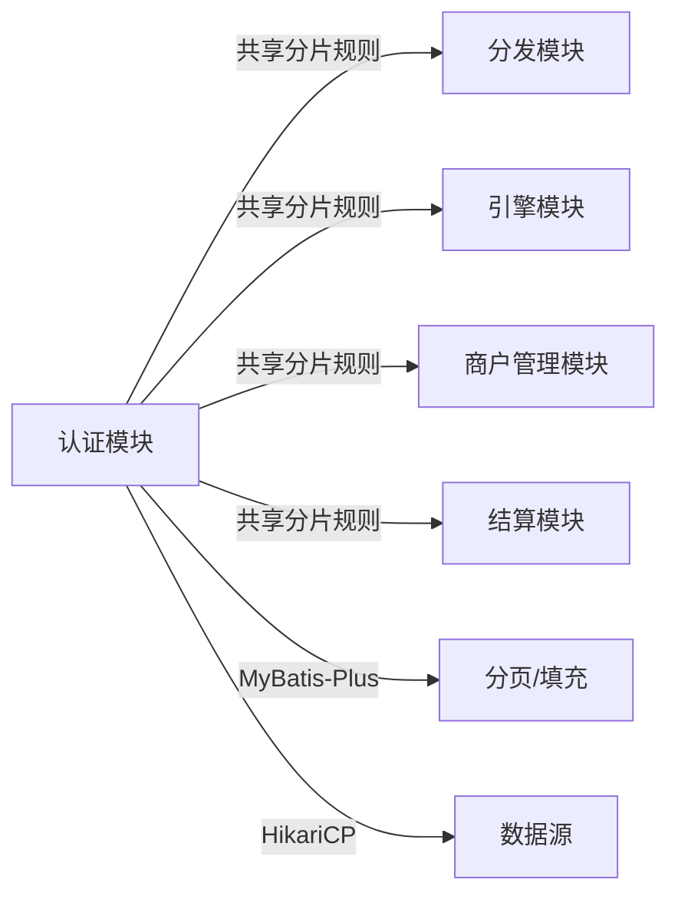

# 数据库优化

<cite>
**本文引用的文件**
- [application.yaml](file://auth/src/main/resources/application.yaml)
- [shardingsphere-config-dev.yaml](file://auth/src/main/resources/shardingsphere-config-dev.yaml)
- [DBUserHashModShardingAlgorithm.java](file://auth/src/main/java/com/fengxin/maplecoupon/auth/dao/sharding/DBUserHashModShardingAlgorithm.java)
- [TableUserHashModShardingAlgorithm.java](file://auth/src/main/java/com/fengxin/maplecoupon/auth/dao/sharding/TableUserHashModShardingAlgorithm.java)
- [DataBaseConfiguration.java](file://auth/src/main/java/com/fengxin/maplecoupon/auth/config/DataBaseConfiguration.java)
- [shardingsphere-config-dev.yaml](file://distribution/src/main/resources/shardingsphere-config-dev.yaml)
- [DBHashModShardingAlgorithm.java](file://distribution/src/main/java/com/fengxin/maplecoupon/distribution/dao/sharding/DBHashModShardingAlgorithm.java)
- [TableHashModShardingAlgorithm.java](file://distribution/src/main/java/com/fengxin/maplecoupon/distribution/dao/sharding/TableHashModShardingAlgorithm.java)
- [application-dev.yaml](file://engine/src/main/resources/application-dev.yaml)
- [shardingsphere-config-dev.yaml](file://engine/src/main/resources/shardingsphere-config-dev.yaml)
- [DBShardingUtil.java](file://engine/src/main/java/com/fengxin/maplecoupon/engine/dao/sharding/DBShardingUtil.java)
- [shardingsphere-config-dev.yaml](file://merchant-admin/src/main/resources/shardingsphere-config-dev.yaml)
- [shardingsphere-config-dev.yaml](file://settlement/src/main/resources/shardingsphere-config-dev.yaml)
</cite>

## 目录
1. [简介](#简介)
2. [项目结构](#项目结构)
3. [核心组件](#核心组件)
4. [架构总览](#架构总览)
5. [详细组件分析](#详细组件分析)
6. [依赖关系分析](#依赖关系分析)
7. [性能考量](#性能考量)
8. [故障排查指南](#故障排查指南)
9. [结论](#结论)
10. [附录](#附录)

## 简介
本指南围绕MapleCoupon系统的数据库优化实践展开，重点覆盖以下方面：
- 基于ShardingSphere的分库分表策略与自定义分片算法设计原理及性能优化建议
- 数据库查询优化技术：SQL语句优化、索引设计策略与查询计划分析方法
- 连接池配置与连接复用机制：以HikariCP为核心，结合ShardingSphere与MyBatis-Plus的配置要点
- 性能监控与瓶颈分析：慢查询日志、执行计划优化与存储过程调优思路
- 读写分离、事务管理与数据一致性保障策略
- 提供SQL优化案例与性能对比思路（基于现有配置与算法）

## 项目结构
MapleCoupon采用多模块微服务架构，数据库访问通过ShardingSphere统一接入，并在各业务模块中使用HikariCP作为连接池，MyBatis-Plus提供分页与元对象自动填充等能力。

**图表来源**
- [application.yaml:1-19](file://auth/src/main/resources/application.yaml#L1-L19)
- [shardingsphere-config-dev.yaml:1-45](file://auth/src/main/resources/shardingsphere-config-dev.yaml#L1-L45)
- [DBUserHashModShardingAlgorithm.java:1-68](file://auth/src/main/java/com/fengxin/maplecoupon/auth/dao/sharding/DBUserHashModShardingAlgorithm.java#L1-L68)
- [TableUserHashModShardingAlgorithm.java:1-44](file://auth/src/main/java/com/fengxin/maplecoupon/auth/dao/sharding/TableUserHashModShardingAlgorithm.java#L1-L44)
- [DataBaseConfiguration.java:1-57](file://auth/src/main/java/com/fengxin/maplecoupon/auth/config/DataBaseConfiguration.java#L1-L57)
- [shardingsphere-config-dev.yaml:1-69](file://distribution/src/main/resources/shardingsphere-config-dev.yaml#L1-L69)
- [DBHashModShardingAlgorithm.java:1-67](file://distribution/src/main/java/com/fengxin/maplecoupon/distribution/dao/sharding/DBHashModShardingAlgorithm.java#L1-L67)
- [TableHashModShardingAlgorithm.java:1-45](file://distribution/src/main/java/com/fengxin/maplecoupon/distribution/dao/sharding/TableHashModShardingAlgorithm.java#L1-L45)
- [application-dev.yaml:1-37](file://engine/src/main/resources/application-dev.yaml#L1-L37)
- [shardingsphere-config-dev.yaml:1-100](file://engine/src/main/resources/shardingsphere-config-dev.yaml#L1-L100)
- [DBShardingUtil.java:1-37](file://engine/src/main/java/com/fengxin/maplecoupon/engine/dao/sharding/DBShardingUtil.java#L1-L37)
- [shardingsphere-config-dev.yaml:1-59](file://merchant-admin/src/main/resources/shardingsphere-config-dev.yaml#L1-L59)
- [shardingsphere-config-dev.yaml:1-100](file://settlement/src/main/resources/shardingsphere-config-dev.yaml#L1-L100)

**章节来源**
- [application.yaml:1-19](file://auth/src/main/resources/application.yaml#L1-L19)
- [shardingsphere-config-dev.yaml:1-45](file://auth/src/main/resources/shardingsphere-config-dev.yaml#L1-L45)
- [shardingsphere-config-dev.yaml:1-69](file://distribution/src/main/resources/shardingsphere-config-dev.yaml#L1-L69)
- [shardingsphere-config-dev.yaml:1-100](file://engine/src/main/resources/shardingsphere-config-dev.yaml#L1-L100)
- [shardingsphere-config-dev.yaml:1-59](file://merchant-admin/src/main/resources/shardingsphere-config-dev.yaml#L1-L59)
- [shardingsphere-config-dev.yaml:1-100](file://settlement/src/main/resources/shardingsphere-config-dev.yaml#L1-L100)

## 核心组件
- ShardingSphere驱动与URL配置：认证模块通过ShardingSphere驱动与YAML配置加载分片规则，启用SQL打印便于调试。
- HikariCP连接池：在各模块的ShardingSphere YAML中直接声明HikariCP数据源，具备批量重写与多查询支持等参数。
- 自定义分片算法：针对不同业务表（如用户表、优惠券模板、用户券、结算）分别实现库分片与表分片算法，采用哈希取模策略保证数据均匀分布。
- MyBatis-Plus：提供分页插件与实体字段自动填充，简化开发与提升可维护性。

**章节来源**
- [application.yaml:6-8](file://auth/src/main/resources/application.yaml#L6-L8)
- [shardingsphere-config-dev.yaml:4-15](file://auth/src/main/resources/shardingsphere-config-dev.yaml#L4-L15)
- [DataBaseConfiguration.java:25-30](file://auth/src/main/java/com/fengxin/maplecoupon/auth/config/DataBaseConfiguration.java#L25-L30)
- [DataBaseConfiguration.java:41-54](file://auth/src/main/java/com/fengxin/maplecoupon/auth/config/DataBaseConfiguration.java#L41-L54)

## 架构总览
下图展示ShardingSphere在MapleCoupon中的整体作用：应用通过ShardingSphere驱动访问逻辑表，ShardingSphere根据配置的分片规则路由到具体的数据节点；连接池由HikariCP提供，SQL打印便于定位问题。

**图表来源**
- [application.yaml:6-8](file://auth/src/main/resources/application.yaml#L6-L8)
- [shardingsphere-config-dev.yaml:1-45](file://auth/src/main/resources/shardingsphere-config-dev.yaml#L1-L45)
- [DataBaseConfiguration.java:25-30](file://auth/src/main/java/com/fengxin/maplecoupon/auth/config/DataBaseConfiguration.java#L25-L30)

## 详细组件分析

### 认证模块：用户表分片策略
- 分片规则：用户表按用户名进行库分片与表分片，库分片使用CLASS_BASED算法，表分片同样使用CLASS_BASED算法。
- 自定义算法：
  - 库分片算法：对用户名取绝对值哈希后按分片总数取模，再映射到当前可用数据源数量，确保跨库查询时目标明确。
  - 表分片算法：对用户名取绝对值哈希后按表数量取模，实现均匀分布。
- 配置要点：分片总数与实际数据节点数需匹配，避免热点与空洞。

**图表来源**
- [DBUserHashModShardingAlgorithm.java:21-68](file://auth/src/main/java/com/fengxin/maplecoupon/auth/dao/sharding/DBUserHashModShardingAlgorithm.java#L21-L68)
- [TableUserHashModShardingAlgorithm.java:17-44](file://auth/src/main/java/com/fengxin/maplecoupon/auth/dao/sharding/TableUserHashModShardingAlgorithm.java#L17-L44)

**章节来源**
- [shardingsphere-config-dev.yaml:18-42](file://auth/src/main/resources/shardingsphere-config-dev.yaml#L18-L42)
- [DBUserHashModShardingAlgorithm.java:28-66](file://auth/src/main/java/com/fengxin/maplecoupon/auth/dao/sharding/DBUserHashModShardingAlgorithm.java#L28-L66)
- [TableUserHashModShardingAlgorithm.java:18-42](file://auth/src/main/java/com/fengxin/maplecoupon/auth/dao/sharding/TableUserHashModShardingAlgorithm.java#L18-L42)

### 分发模块：模板与用户券分片策略
- 分片规则：模板表与用户券表均按分片键进行库分片与表分片，库分片算法与表分片算法分别独立实现。
- 算法特点：采用Long类型的分片键，哈希取模后映射到具体数据节点，库分片算法支持按分片总数与可用节点数的比例映射。
- 配置要点：模板表库分片总数为16，表分片总数为16；用户券库分片总数为32，表分片总数为32，满足高并发场景下的负载分散需求。

**图表来源**
- [DBHashModShardingAlgorithm.java:20-67](file://distribution/src/main/java/com/fengxin/maplecoupon/distribution/dao/sharding/DBHashModShardingAlgorithm.java#L20-L67)
- [TableHashModShardingAlgorithm.java:16-45](file://distribution/src/main/java/com/fengxin/maplecoupon/distribution/dao/sharding/TableHashModShardingAlgorithm.java#L16-L45)

**章节来源**
- [shardingsphere-config-dev.yaml:17-65](file://distribution/src/main/resources/shardingsphere-config-dev.yaml#L17-L65)
- [DBHashModShardingAlgorithm.java:28-64](file://distribution/src/main/java/com/fengxin/maplecoupon/distribution/dao/sharding/DBHashModShardingAlgorithm.java#L28-L64)
- [TableHashModShardingAlgorithm.java:18-43](file://distribution/src/main/java/com/fengxin/maplecoupon/distribution/dao/sharding/TableHashModShardingAlgorithm.java#L18-L43)

### 引擎模块：跨表查询与分片辅助工具
- 跨库查询场景：当需要对模板或用户券进行IN查询时，可能涉及多个库与表，需通过分片工具计算目标库以规避“跨库表不存在”的问题。
- 工具类：提供基于分片键计算所在库的静态方法，结合ShardingSphere的库分片算法实例，确保查询路由正确。

**图表来源**
- [DBShardingUtil.java:15-37](file://engine/src/main/java/com/fengxin/maplecoupon/engine/dao/sharding/DBShardingUtil.java#L15-L37)

**章节来源**
- [DBShardingUtil.java:19-29](file://engine/src/main/java/com/fengxin/maplecoupon/engine/dao/sharding/DBShardingUtil.java#L19-L29)

### 商户管理与结算模块：分片规则一致性
- 商户管理模块与结算模块均采用与引擎模块一致的分片规则，确保跨模块查询与数据一致性。
- 关键点：模板表、模板日志表、用户券表、结算表的库分片与表分片策略保持一致，减少跨模块联表查询的复杂度。

**章节来源**
- [shardingsphere-config-dev.yaml:17-56](file://merchant-admin/src/main/resources/shardingsphere-config-dev.yaml#L17-L56)
- [shardingsphere-config-dev.yaml:17-97](file://settlement/src/main/resources/shardingsphere-config-dev.yaml#L17-L97)

### 查询优化与索引设计策略
- 索引设计原则
  - 选择性高：优先为分片键与高频过滤条件建立索引，降低扫描范围。
  - 复合索引：对组合查询条件建立联合索引，避免回表与全表扫描。
  - 唯一索引：对唯一约束列建立唯一索引，加速去重与唯一性校验。
- SQL优化建议
  - 使用精确过滤条件：尽量使用等值条件匹配分片键，避免广播查询。
  - 避免跨库聚合：跨库聚合会放大网络与内存压力，优先在库内聚合后汇总。
  - 控制返回列：仅查询必要字段，减少网络传输与序列化开销。
  - 分页优化：结合MyBatis-Plus分页插件，合理设置每页大小，避免深度分页导致的性能问题。
- 查询计划分析
  - 开启SQL打印：利用ShardingSphere的sql-show功能输出真实执行SQL，结合EXPLAIN分析执行计划。
  - 关注全表扫描与临时表：定位热点表与低效SQL，针对性优化索引与SQL结构。

**章节来源**
- [DataBaseConfiguration.java:25-30](file://auth/src/main/java/com/fengxin/maplecoupon/auth/config/DataBaseConfiguration.java#L25-L30)
- [shardingsphere-config-dev.yaml:43-45](file://auth/src/main/resources/shardingsphere-config-dev.yaml#L43-L45)

### 连接池配置与连接复用机制
- HikariCP参数调优
  - 连接池大小：根据QPS与事务持续时间估算最大并发连接数，避免连接不足或过度占用。
  - 连接超时：合理设置连接超时与空闲超时，防止连接泄露与资源浪费。
  - 批量参数：开启rewriteBatchedStatements与allowMultiQueries，提升批量写入效率。
- 连接泄漏防护
  - 严格关闭资源：确保每个数据库操作在finally块或try-with-resources中关闭Statement与ResultSet。
  - 定期巡检：通过连接池监控指标识别异常增长，及时定位泄漏点。
- 与ShardingSphere集成
  - 通过CLASS_BASED数据源声明HikariCP，由ShardingSphere统一管理路由与连接复用。

**章节来源**
- [shardingsphere-config-dev.yaml:4-15](file://auth/src/main/resources/shardingsphere-config-dev.yaml#L4-L15)
- [shardingsphere-config-dev.yaml:4-15](file://distribution/src/main/resources/shardingsphere-config-dev.yaml#L4-L15)
- [shardingsphere-config-dev.yaml:4-15](file://engine/src/main/resources/shardingsphere-config-dev.yaml#L4-L15)

### 读写分离、事务管理与数据一致性
- 读写分离
  - 写入：所有写操作经由主库执行，确保强一致。
  - 读取：读操作可路由至从库，缓解主库压力；对于强一致读，仍需走主库。
- 事务管理
  - 分布式事务：跨库事务需谨慎使用，优先通过最终一致性与补偿机制实现。
  - 本地事务：单库事务保持短事务，减少锁竞争与等待时间。
- 数据一致性
  - 分片键一致性：确保业务主键与分片键一致，避免跨库更新引发的不一致。
  - 幂等设计：对外部接口与消息处理实现幂等，防止重复消费导致的数据不一致。

### 性能监控与瓶颈分析
- 慢查询日志
  - 启用慢查询阈值：结合业务峰值QPS设定合理阈值，定期分析慢SQL。
  - 结合SQL打印：通过ShardingSphere的sql-show输出真实SQL，定位慢查询根因。
- 执行计划优化
  - EXPLAIN分析：关注索引使用、排序与临时表，针对性调整索引与SQL结构。
- 存储过程调优
  - 将热点批处理逻辑迁移至存储过程或Lua脚本（如模块内已使用），减少网络往返与JDBC开销。

**章节来源**
- [shardingsphere-config-dev.yaml:43-45](file://auth/src/main/resources/shardingsphere-config-dev.yaml#L43-L45)
- [shardingsphere-config-dev.yaml:98-100](file://engine/src/main/resources/shardingsphere-config-dev.yaml#L98-L100)

## 依赖关系分析
- 组件耦合
  - ShardingSphere配置集中于各模块的YAML文件，算法类通过CLASS_BASED方式注入，耦合度低、扩展性强。
  - MyBatis-Plus分页与自动填充在各模块独立配置，保持通用性与一致性。
- 外部依赖
  - MySQL：作为底层存储，需配合索引与SQL优化提升性能。
  - HikariCP：提供高性能连接池，需结合业务QPS与延迟目标调参。

**图表来源**
- [shardingsphere-config-dev.yaml:18-42](file://auth/src/main/resources/shardingsphere-config-dev.yaml#L18-L42)
- [shardingsphere-config-dev.yaml:17-65](file://distribution/src/main/resources/shardingsphere-config-dev.yaml#L17-L65)
- [shardingsphere-config-dev.yaml:17-97](file://engine/src/main/resources/shardingsphere-config-dev.yaml#L17-L97)
- [shardingsphere-config-dev.yaml:17-56](file://merchant-admin/src/main/resources/shardingsphere-config-dev.yaml#L17-L56)
- [shardingsphere-config-dev.yaml:17-97](file://settlement/src/main/resources/shardingsphere-config-dev.yaml#L17-L97)
- [DataBaseConfiguration.java:25-30](file://auth/src/main/java/com/fengxin/maplecoupon/auth/config/DataBaseConfiguration.java#L25-L30)

**章节来源**
- [shardingsphere-config-dev.yaml:18-42](file://auth/src/main/resources/shardingsphere-config-dev.yaml#L18-L42)
- [shardingsphere-config-dev.yaml:17-65](file://distribution/src/main/resources/shardingsphere-config-dev.yaml#L17-L65)
- [shardingsphere-config-dev.yaml:17-97](file://engine/src/main/resources/shardingsphere-config-dev.yaml#L17-L97)
- [shardingsphere-config-dev.yaml:17-56](file://merchant-admin/src/main/resources/shardingsphere-config-dev.yaml#L17-L56)
- [shardingsphere-config-dev.yaml:17-97](file://settlement/src/main/resources/shardingsphere-config-dev.yaml#L17-L97)
- [DataBaseConfiguration.java:25-30](file://auth/src/main/java/com/fengxin/maplecoupon/auth/config/DataBaseConfiguration.java#L25-L30)

## 性能考量
- 分片键选择
  - 优先使用高基数、低冲突的字段作为分片键，避免热点与倾斜。
- 分片数量规划
  - 库分片与表分片数量应与业务规模与硬件资源相匹配，避免过度分片导致管理复杂度上升。
- 批量写入优化
  - 利用HikariCP的批量参数与ShardingSphere的路由特性，合并写入请求，减少网络往返。
- 缓存与异步
  - 对读多写少的数据引入缓存，对非实时性操作采用消息队列异步处理，降低数据库压力。

## 故障排查指南
- SQL打印定位
  - 通过ShardingSphere的sql-show输出真实SQL，结合业务日志快速定位问题。
- 分片算法验证
  - 使用分片工具或单元测试验证分片键到库/表的映射是否符合预期。
- 连接池监控
  - 关注连接池活跃连接数、等待时间与拒绝次数，及时发现连接泄漏与配置不当。

**章节来源**
- [shardingsphere-config-dev.yaml:43-45](file://auth/src/main/resources/shardingsphere-config-dev.yaml#L43-L45)
- [DBShardingUtil.java:19-29](file://engine/src/main/java/com/fengxin/maplecoupon/engine/dao/sharding/DBShardingUtil.java#L19-L29)

## 结论
MapleCoupon通过ShardingSphere实现了面向业务的分库分表，结合HikariCP与MyBatis-Plus提供了高效的数据库访问能力。自定义分片算法以哈希取模为核心，兼顾均匀性与可扩展性。配合索引设计、SQL优化与连接池调优，可在高并发场景下获得稳定性能。建议持续通过慢查询日志与执行计划分析迭代优化，并完善读写分离与事务治理策略以保障数据一致性。

## 附录
- SQL优化案例与性能对比思路
  - 案例1：将IN查询拆分为按分片键分组的多次查询，减少跨库聚合与临时表使用。
  - 案例2：为高频过滤字段建立复合索引，结合EXPLAIN对比优化前后的扫描行数与执行时间。
  - 案例3：通过MyBatis-Plus分页插件控制每页大小，避免深度分页带来的延迟。
- 性能对比维度
  - QPS、P95/P99延迟、连接池命中率、慢查询数量与平均耗时、索引使用率。