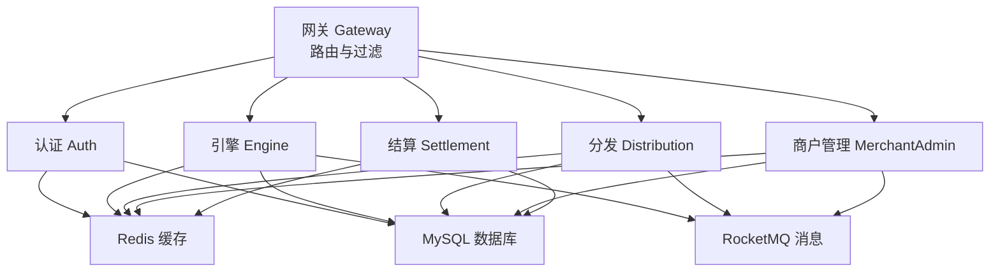
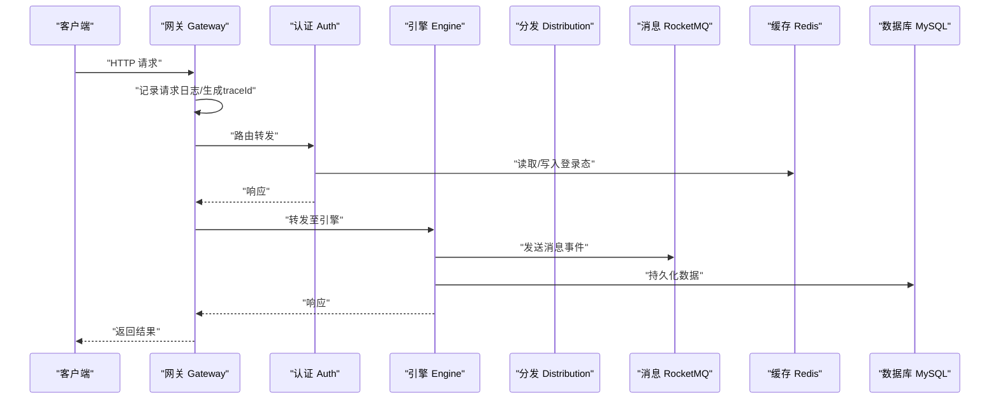
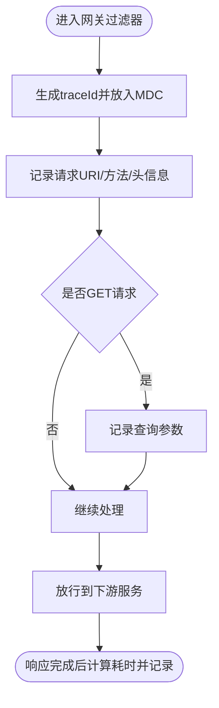
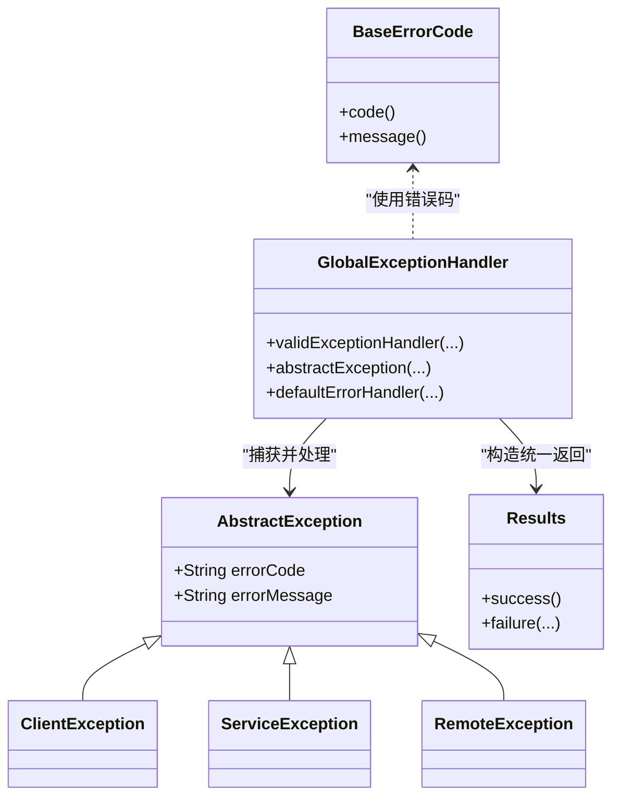
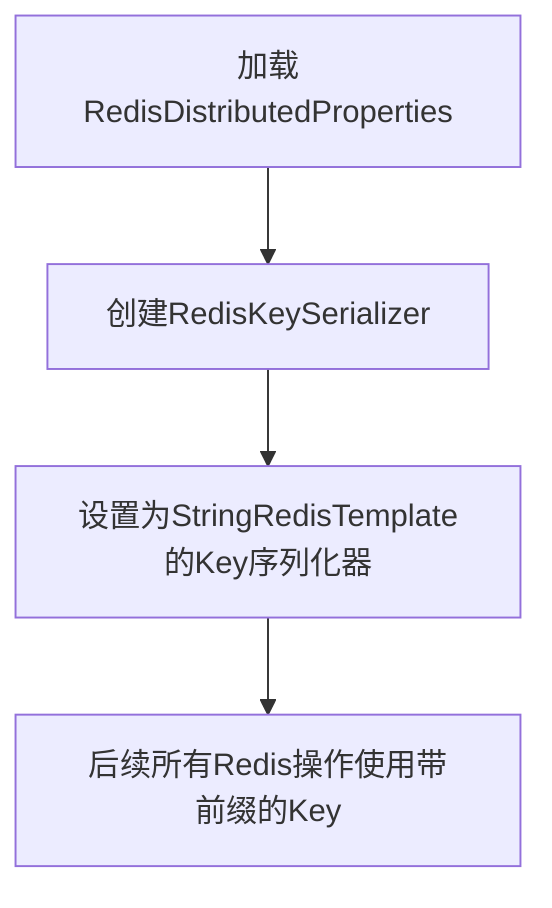
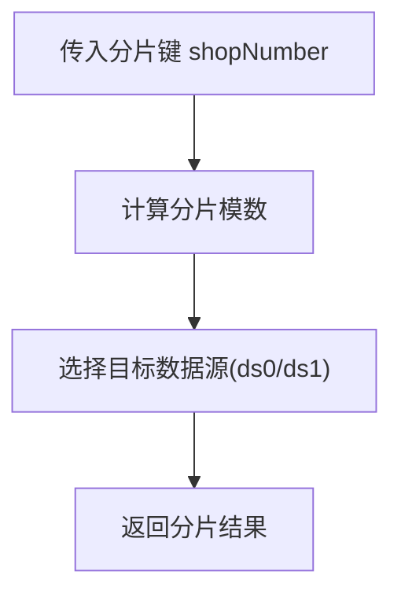
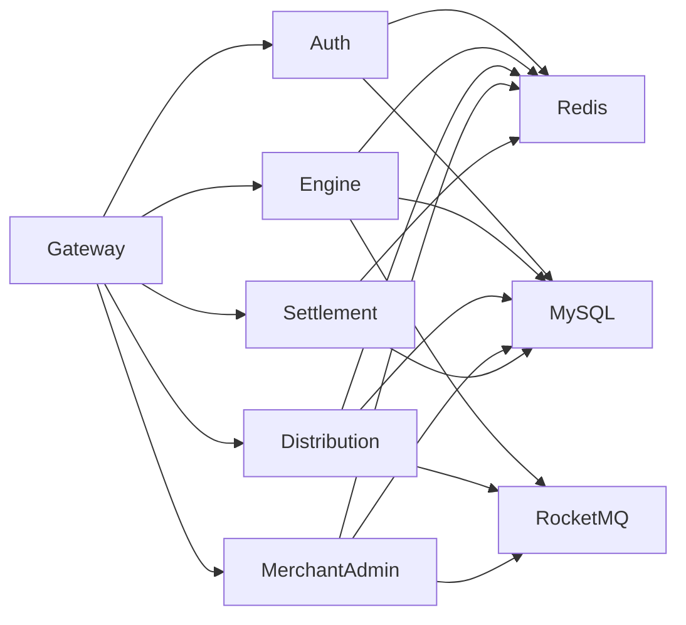

# 监控与瓶颈分析

<cite>
**本文引用的文件**
- [README.md](file://README.md)
- [gateway/src/main/resources/application.yml](file://gateway/src/main/resources/application.yml)
- [gateway/src/main/java/com/fengxin/maplecoupon/gateway/filter/RequestLoggingFilter.java](file://gateway/src/main/java/com/fengxin/maplecoupon/gateway/filter/RequestLoggingFilter.java)
- [gateway/src/test/logback-spring.xml](file://gateway/src/test/logback-spring.xml)
- [gateway/src/main/java/com/fengxin/maplecoupon/gateway/common/RedisConstantEnum.java](file://gateway/src/main/java/com/fengxin/maplecoupon/gateway/common/RedisConstantEnum.java)
- [gateway/src/main/resources/application-prod.yml](file://gateway/src/main/resources/application-prod.yml)
- [auth/src/main/resources/application-dev.yaml](file://auth/src/main/resources/application-dev.yaml)
- [auth/src/main/resources/application-prod.yaml](file://auth/src/main/resources/application-prod.yaml)
- [distribution/src/main/resources/application-dev.yaml](file://distribution/src/main/resources/application-dev.yaml)
- [engine/src/main/resources/application-dev.yaml](file://engine/src/main/resources/application-dev.yaml)
- [merchant-admin/src/main/resources/application-dev.yaml](file://merchant-admin/src/main/resources/application-dev.yaml)
- [settlement/src/main/resources/application-dev.yaml](file://settlement/src/main/resources/application-dev.yaml)
- [framework/src/main/java/com/fengxin/web/GlobalExceptionHandler.java](file://framework/src/main/java/com/fengxin/web/GlobalExceptionHandler.java)
- [framework/src/main/java/com/fengxin/web/Results.java](file://framework/src/main/java/com/fengxin/web/Results.java)
- [framework/src/main/java/com/fengxin/exception/AbstractException.java](file://framework/src/main/java/com/fengxin/exception/AbstractException.java)
- [framework/src/main/java/com/fengxin/exception/ServiceException.java](file://framework/src/main/java/com/fengxin/exception/ServiceException.java)
- [framework/src/main/java/com/fengxin/exception/ClientException.java](file://framework/src/main/java/com/fengxin/exception/ClientException.java)
- [framework/src/main/java/com/fengxin/exception/RemoteException.java](file://framework/src/main/java/com/fengxin/exception/RemoteException.java)
- [framework/src/main/java/com/fengxin/errorcode/BaseErrorCode.java](file://framework/src/main/java/com/fengxin/errorcode/BaseErrorCode.java)
- [framework/src/main/java/com/fengxin/config/CacheConfiguration.java](file://framework/src/main/java/com/fengxin/config/CacheConfiguration.java)
- [framework/src/main/java/com/fengxin/config/RedisDistributedProperties.java](file://framework/src/main/java/com/fengxin/config/RedisDistributedProperties.java)
- [engine/src/main/java/com/fengxin/maplecoupon/engine/dao/sharding/DBShardingUtil.java](file://engine/src/main/java/com/fengxin/maplecoupon/engine/dao/sharding/DBShardingUtil.java)
- [settlement/src/main/java/com/fengxin/maplecoupon/settlement/dao/sharding/DBShardingUtil.java](file://settlement/src/main/java/com/fengxin/maplecoupon/settlement/dao/sharding/DBShardingUtil.java)
</cite>

## 目录
1. [引言](#引言)
2. [项目结构](#项目结构)
3. [核心组件](#核心组件)
4. [架构总览](#架构总览)
5. [详细组件分析](#详细组件分析)
6. [依赖关系分析](#依赖关系分析)
7. [性能考量](#性能考量)
8. [故障排查指南](#故障排查指南)
9. [结论](#结论)
10. [附录](#附录)

## 引言
本指南面向MapleCoupon分布式优惠券系统，围绕“监控与瓶颈分析”目标，系统性给出监控体系构建、关键指标采集、瓶颈识别方法、日志策略、性能与压力测试、扩容与负载均衡监控，以及仪表板与告警配置示例。项目采用Spring Boot + Spring Cloud Alibaba + Spring Cloud Gateway + ShardingSphere + RocketMQ + Redis + MySQL + XXL-Job + Docker等技术栈，具备良好的可观测性基础。

章节来源
- [README.md:1-10](file://README.md#L1-L10)

## 项目结构
MapleCoupon采用多模块微服务架构，包含网关层、认证授权、引擎、分发、商户管理、结算、框架公共模块等。各模块均通过Nacos注册发现、Redis缓存、RocketMQ消息队列进行交互，具备天然的日志链路与外部集成点，便于统一监控与告警。

图表来源
- [gateway/src/main/resources/application.yml:17-63](file://gateway/src/main/resources/application.yml#L17-L63)
- [auth/src/main/resources/application-dev.yaml:1-11](file://auth/src/main/resources/application-dev.yaml#L1-L11)
- [engine/src/main/resources/application-dev.yaml:13-19](file://engine/src/main/resources/application-dev.yaml#L13-L19)
- [distribution/src/main/resources/application-dev.yaml:13-19](file://distribution/src/main/resources/application-dev.yaml#L13-L19)
- [merchant-admin/src/main/resources/application-dev.yaml:13-19](file://merchant-admin/src/main/resources/application-dev.yaml#L13-L19)
- [settlement/src/main/resources/application-dev.yaml:1-11](file://settlement/src/main/resources/application-dev.yaml#L1-L11)

章节来源
- [gateway/src/main/resources/application.yml:1-72](file://gateway/src/main/resources/application.yml#L1-L72)
- [auth/src/main/resources/application-dev.yaml:1-30](file://auth/src/main/resources/application-dev.yaml#L1-L30)
- [engine/src/main/resources/application-dev.yaml:1-37](file://engine/src/main/resources/application-dev.yaml#L1-L37)
- [distribution/src/main/resources/application-dev.yaml:1-20](file://distribution/src/main/resources/application-dev.yaml#L1-L20)
- [merchant-admin/src/main/resources/application-dev.yaml:1-36](file://merchant-admin/src/main/resources/application-dev.yaml#L1-L36)
- [settlement/src/main/resources/application-dev.yaml:1-29](file://settlement/src/main/resources/application-dev.yaml#L1-L29)

## 核心组件
- 网关层（Gateway）
  - 提供统一路由、鉴权过滤、请求日志与耗时统计能力；暴露Actuator端点用于指标采集。
- 认证授权（Auth）
  - 使用Redis存储登录态，提供Swagger文档与Knife4j增强。
- 引擎（Engine）/分发（Distribution）/商户管理（MerchantAdmin）
  - 均集成Redis与RocketMQ，具备消息生产与消费能力；部分模块提供Swagger文档。
- 结算（Settlement）
  - 提供优惠券查询与结算相关接口，使用Redis与数据库。
- 框架公共（Framework）
  - 统一异常处理、全局返回体、Redis键前缀配置、分布式缓存配置等。

章节来源
- [gateway/src/main/resources/application.yml:65-72](file://gateway/src/main/resources/application.yml#L65-L72)
- [gateway/src/main/java/com/fengxin/maplecoupon/gateway/filter/RequestLoggingFilter.java:24-56](file://gateway/src/main/java/com/fengxin/maplecoupon/gateway/filter/RequestLoggingFilter.java#L24-L56)
- [auth/src/main/resources/application-dev.yaml:13-30](file://auth/src/main/resources/application-dev.yaml#L13-L30)
- [engine/src/main/resources/application-dev.yaml:21-37](file://engine/src/main/resources/application-dev.yaml#L21-L37)
- [merchant-admin/src/main/resources/application-dev.yaml:21-36](file://merchant-admin/src/main/resources/application-dev.yaml#L21-L36)
- [framework/src/main/java/com/fengxin/web/GlobalExceptionHandler.java:24-77](file://framework/src/main/java/com/fengxin/web/GlobalExceptionHandler.java#L24-L77)
- [framework/src/main/java/com/fengxin/config/CacheConfiguration.java:16-35](file://framework/src/main/java/com/fengxin/config/CacheConfiguration.java#L16-L35)

## 架构总览
下图展示从网关到后端服务的典型调用链路，以及关键监控点（日志、指标、链路追踪）的落点。

图表来源
- [gateway/src/main/resources/application.yml:17-63](file://gateway/src/main/resources/application.yml#L17-L63)
- [gateway/src/main/java/com/fengxin/maplecoupon/gateway/filter/RequestLoggingFilter.java:28-49](file://gateway/src/main/java/com/fengxin/maplecoupon/gateway/filter/RequestLoggingFilter.java#L28-L49)
- [auth/src/main/resources/application-dev.yaml:7-11](file://auth/src/main/resources/application-dev.yaml#L7-L11)
- [engine/src/main/resources/application-dev.yaml:13-19](file://engine/src/main/resources/application-dev.yaml#L13-L19)

## 详细组件分析

### 网关层监控与日志
- 请求过滤与日志
  - 在全局过滤器中生成traceId并记录请求URI、方法、头信息与响应耗时，便于端到端链路追踪与性能分析。
- 配置暴露
  - Actuator端点全部开放，便于Prometheus/Grafana抓取JVM与业务指标。
- 生产环境配置
  - Redis与Nacos地址分离，便于独立监控与排障。

图表来源
- [gateway/src/main/java/com/fengxin/maplecoupon/gateway/filter/RequestLoggingFilter.java:28-49](file://gateway/src/main/java/com/fengxin/maplecoupon/gateway/filter/RequestLoggingFilter.java#L28-L49)

章节来源
- [gateway/src/main/resources/application.yml:65-72](file://gateway/src/main/resources/application.yml#L65-L72)
- [gateway/src/main/java/com/fengxin/maplecoupon/gateway/filter/RequestLoggingFilter.java:24-56](file://gateway/src/main/java/com/fengxin/maplecoupon/gateway/filter/RequestLoggingFilter.java#L24-L56)
- [gateway/src/main/resources/application-prod.yml:1-11](file://gateway/src/main/resources/application-prod.yml#L1-L11)

### 异常与返回体统一处理
- 全局异常处理器
  - 拦截参数校验异常、应用内异常与未捕获异常，统一输出标准返回体，便于前端与监控系统识别错误。
- 错误码体系
  - 定义基础错误码，区分客户端错误、服务端错误与第三方调用错误，支撑告警分级。

图表来源
- [framework/src/main/java/com/fengxin/exception/AbstractException.java:18-28](file://framework/src/main/java/com/fengxin/exception/AbstractException.java#L18-L28)
- [framework/src/main/java/com/fengxin/exception/ClientException.java:12-37](file://framework/src/main/java/com/fengxin/exception/ClientException.java#L12-L37)
- [framework/src/main/java/com/fengxin/exception/ServiceException.java:12-37](file://framework/src/main/java/com/fengxin/exception/ServiceException.java#L12-L37)
- [framework/src/main/java/com/fengxin/exception/RemoteException.java:12-37](file://framework/src/main/java/com/fengxin/exception/RemoteException.java#L12-L37)
- [framework/src/main/java/com/fengxin/web/GlobalExceptionHandler.java:24-77](file://framework/src/main/java/com/fengxin/web/GlobalExceptionHandler.java#L24-L77)
- [framework/src/main/java/com/fengxin/web/Results.java:14-66](file://framework/src/main/java/com/fengxin/web/Results.java#L14-L66)
- [framework/src/main/java/com/fengxin/errorcode/BaseErrorCode.java:28-53](file://framework/src/main/java/com/fengxin/errorcode/BaseErrorCode.java#L28-L53)

章节来源
- [framework/src/main/java/com/fengxin/web/GlobalExceptionHandler.java:24-77](file://framework/src/main/java/com/fengxin/web/GlobalExceptionHandler.java#L24-L77)
- [framework/src/main/java/com/fengxin/web/Results.java:14-66](file://framework/src/main/java/com/fengxin/web/Results.java#L14-L66)
- [framework/src/main/java/com/fengxin/errorcode/BaseErrorCode.java:28-53](file://framework/src/main/java/com/fengxin/errorcode/BaseErrorCode.java#L28-L53)

### 缓存与键空间治理
- Redis键前缀配置
  - 通过集中式配置为Redis Key添加前缀与字符集，便于运维定位与容量规划。
- 网关侧常量
  - 定义登录态缓存Key前缀，配合全局过滤器中的traceId，形成统一的链路标识。

图表来源
- [framework/src/main/java/com/fengxin/config/CacheConfiguration.java:24-34](file://framework/src/main/java/com/fengxin/config/CacheConfiguration.java#L24-L34)
- [framework/src/main/java/com/fengxin/config/RedisDistributedProperties.java:10-24](file://framework/src/main/java/com/fengxin/config/RedisDistributedProperties.java#L10-L24)
- [gateway/src/main/java/com/fengxin/maplecoupon/gateway/common/RedisConstantEnum.java:9-14](file://gateway/src/main/java/com/fengxin/maplecoupon/gateway/common/RedisConstantEnum.java#L9-L14)

章节来源
- [framework/src/main/java/com/fengxin/config/CacheConfiguration.java:16-35](file://framework/src/main/java/com/fengxin/config/CacheConfiguration.java#L16-L35)
- [framework/src/main/java/com/fengxin/config/RedisDistributedProperties.java:10-24](file://framework/src/main/java/com/fengxin/config/RedisDistributedProperties.java#L10-L24)
- [gateway/src/main/java/com/fengxin/maplecoupon/gateway/common/RedisConstantEnum.java:9-14](file://gateway/src/main/java/com/fengxin/maplecoupon/gateway/common/RedisConstantEnum.java#L9-L14)

### 分库分表与数据访问监控
- 分片工具
  - 提供基于哈希的分片算法选择器，用于解决跨库表查询问题，便于评估分片命中与热点分布。
- 数据库连接
  - 各模块通过ShardingSphere与数据库交互，建议结合慢查询日志与SQL执行计划进行性能分析。

图表来源
- [engine/src/main/java/com/fengxin/maplecoupon/engine/dao/sharding/DBShardingUtil.java:27-29](file://engine/src/main/java/com/fengxin/maplecoupon/engine/dao/sharding/DBShardingUtil.java#L27-L29)
- [settlement/src/main/java/com/fengxin/maplecoupon/settlement/dao/sharding/DBShardingUtil.java:27-29](file://settlement/src/main/java/com/fengxin/maplecoupon/settlement/dao/sharding/DBShardingUtil.java#L27-L29)

章节来源
- [engine/src/main/java/com/fengxin/maplecoupon/engine/dao/sharding/DBShardingUtil.java:15-37](file://engine/src/main/java/com/fengxin/maplecoupon/engine/dao/sharding/DBShardingUtil.java#L15-L37)
- [settlement/src/main/java/com/fengxin/maplecoupon/settlement/dao/sharding/DBShardingUtil.java:14-37](file://settlement/src/main/java/com/fengxin/maplecoupon/settlement/dao/sharding/DBShardingUtil.java#L14-L37)

### 日志收集与分析策略
- 日志格式
  - 控制台与文件统一输出模式，包含时间戳、级别、线程、traceId等字段，便于关联分析。
- 文件滚动与过滤
  - TRACE与ERROR分别落盘，ERROR级别单独过滤，降低噪声。
- 建议
  - 将日志输出到标准输出并接入日志收集系统（如Fluent Bit/Fluentd+ES/Elasticsearch），实现结构化检索与异常告警。

章节来源
- [gateway/src/test/logback-spring.xml:6-54](file://gateway/src/test/logback-spring.xml#L6-L54)

## 依赖关系分析
- 外部依赖
  - Nacos：服务注册与发现
  - Redis：缓存与会话存储
  - RocketMQ：异步解耦与削峰填谷
  - MySQL：持久化存储
- 内部依赖
  - 网关对各后端服务的路由依赖
  - 后端服务对Redis与RocketMQ的依赖
  - 框架模块对异常与返回体的统一依赖

图表来源
- [gateway/src/main/resources/application.yml:17-63](file://gateway/src/main/resources/application.yml#L17-L63)
- [auth/src/main/resources/application-dev.yaml:1-11](file://auth/src/main/resources/application-dev.yaml#L1-L11)
- [engine/src/main/resources/application-dev.yaml:13-19](file://engine/src/main/resources/application-dev.yaml#L13-L19)
- [distribution/src/main/resources/application-dev.yaml:13-19](file://distribution/src/main/resources/application-dev.yaml#L13-L19)
- [merchant-admin/src/main/resources/application-dev.yaml:13-19](file://merchant-admin/src/main/resources/application-dev.yaml#L13-L19)
- [settlement/src/main/resources/application-dev.yaml:1-11](file://settlement/src/main/resources/application-dev.yaml#L1-L11)

章节来源
- [gateway/src/main/resources/application.yml:17-63](file://gateway/src/main/resources/application.yml#L17-L63)
- [auth/src/main/resources/application-dev.yaml:1-11](file://auth/src/main/resources/application-dev.yaml#L1-L11)
- [engine/src/main/resources/application-dev.yaml:13-19](file://engine/src/main/resources/application-dev.yaml#L13-L19)
- [distribution/src/main/resources/application-dev.yaml:13-19](file://distribution/src/main/resources/application-dev.yaml#L13-L19)
- [merchant-admin/src/main/resources/application-dev.yaml:13-19](file://merchant-admin/src/main/resources/application-dev.yaml#L13-L19)
- [settlement/src/main/resources/application-dev.yaml:1-11](file://settlement/src/main/resources/application-dev.yaml#L1-L11)

## 性能考量
- CPU使用率分析
  - 关注高并发下的线程池饱和度、GC停顿时间与热点方法；结合网关过滤器耗时与后端服务接口耗时定位瓶颈。
- 内存泄漏检测
  - 通过堆转储与对象存活分析，重点排查静态集合、线程本地变量与长生命周期缓存。
- 网络延迟监控
  - 监控网关到下游服务的RT、RocketMQ发送/消费延迟、Redis命令耗时，识别跨服务与跨组件瓶颈。
- 数据库与缓存
  - 关注慢查询、连接池利用率、缓存命中率与Key过期策略，避免热点Key与雪崩。

## 故障排查指南
- 快速定位
  - 以traceId串联网关、服务间调用与日志，优先查看ERROR级别日志与全局异常处理器输出。
- 常见问题
  - 参数校验失败：查看全局异常处理器对MethodArgumentNotValidException的处理。
  - 服务端错误：统一返回体包含错误码，结合错误码定义快速定位。
  - 第三方调用异常：RemoteException用于标识远端错误，需关注RocketMQ与Redis的可用性。

章节来源
- [gateway/src/main/java/com/fengxin/maplecoupon/gateway/filter/RequestLoggingFilter.java:28-49](file://gateway/src/main/java/com/fengxin/maplecoupon/gateway/filter/RequestLoggingFilter.java#L28-L49)
- [framework/src/main/java/com/fengxin/web/GlobalExceptionHandler.java:30-68](file://framework/src/main/java/com/fengxin/web/GlobalExceptionHandler.java#L30-L68)
- [framework/src/main/java/com/fengxin/exception/RemoteException.java:12-37](file://framework/src/main/java/com/fengxin/exception/RemoteException.java#L12-L37)

## 结论
MapleCoupon具备完善的微服务与中间件基础，结合统一异常与返回体、全局日志与链路追踪、以及Actuator指标暴露，可快速搭建覆盖“APM、日志、指标、告警”的监控体系。建议在此基础上引入Prometheus+Grafana或云监控平台，建立端到端的性能基线与告警阈值，持续优化分片策略、缓存命中与消息吞吐，保障系统在高并发场景下的稳定性与可扩展性。

## 附录

### APM工具选型与配置要点
- 推荐方案
  - SkyWalking/Zipkin：链路追踪
  - Prometheus+Grafana：指标采集与可视化
  - ELK/EFK：日志采集与检索
- 配置要点
  - 开启Actuator端点，暴露JVM与业务指标
  - 在网关与各服务注入traceId，确保全链路可见
  - 对关键接口埋点（QPS、RT、错误率、线程池、Redis/MQ延迟）

章节来源
- [gateway/src/main/resources/application.yml:65-72](file://gateway/src/main/resources/application.yml#L65-L72)

### 关键性能指标（KPI）清单
- 接口级
  - QPS、成功率、平均/95/99分位RT、错误码分布
- 系统级
  - CPU使用率、内存占用、GC频率与停顿、线程数
- 中间件
  - Redis命中率、命令耗时、连接池使用率；RocketMQ发送/消费延迟与堆积

### 日志收集与分析策略
- 结构化日志
  - 输出JSON或统一Pattern，包含traceId、服务名、模块、方法、参数、耗时、状态码
- 日志聚合
  - 标准输出对接日志收集器，按服务与traceId聚合
- 异常告警
  - ERROR级别与异常返回体联动，设置阈值告警与收敛策略

章节来源
- [gateway/src/test/logback-spring.xml:6-54](file://gateway/src/test/logback-spring.xml#L6-L54)
- [framework/src/main/java/com/fengxin/web/Results.java:14-66](file://framework/src/main/java/com/fengxin/web/Results.java#L14-L66)

### 性能测试与压力测试指南
- 工具选择
  - JMeter：接口级压测，模拟用户行为与事务
  - LoadRunner：企业级压测，支持复杂脚本与报告
- 测试场景
  - 登录/领取/兑换/查询/结算等核心路径
  - 热点场景（秒杀/大促）与极限场景（峰值×2）
- 结果分析
  - 关注RT分布、错误率、资源使用趋势与瓶颈环节

### 系统扩容与负载均衡监控
- 自动扩缩容
  - 基于CPU、内存、QPS、RT、队列长度等指标设置阈值
  - 结合服务实例健康检查（/actuator/health）与就绪探针
- 负载均衡
  - 网关层路由与权重配置，后端服务实例数量与资源配额动态调整

### 监控仪表板与告警规则示例
- 仪表板
  - 网关：入口流量、路由耗时、鉴权失败率
  - 服务：接口RT/错误率/线程池/Redis/MQ指标
  - 数据库：慢查询、连接池、锁等待
- 告警规则
  - RT>XX(ms) 持续N分钟
  - 错误率>XX%
  - QPS低于XX%或高于XX%
  - Redis/MQ异常/堆积/延迟超阈
  - CPU/内存/磁盘使用率>XX%