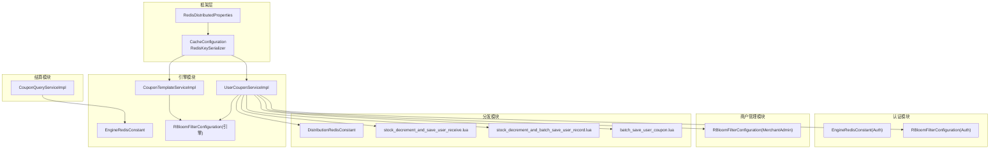
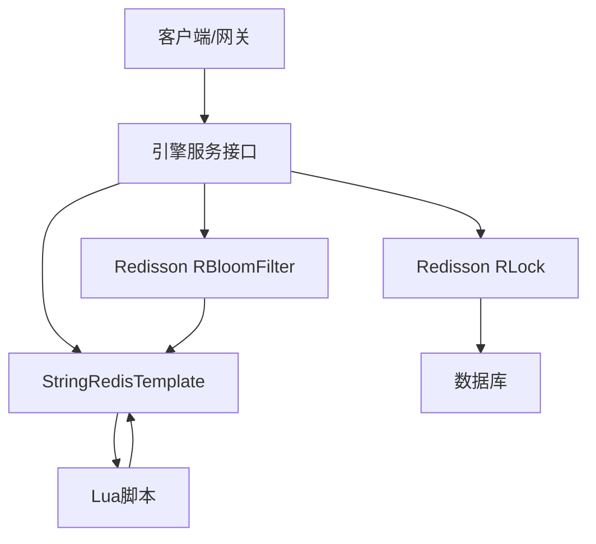
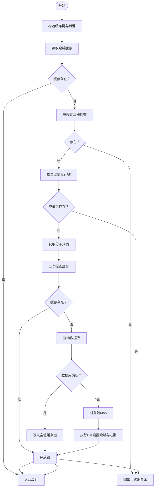
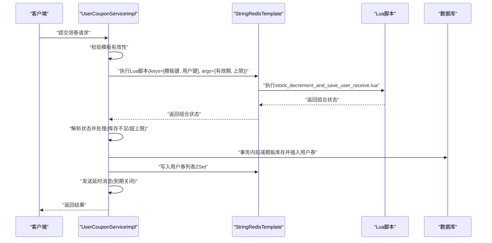
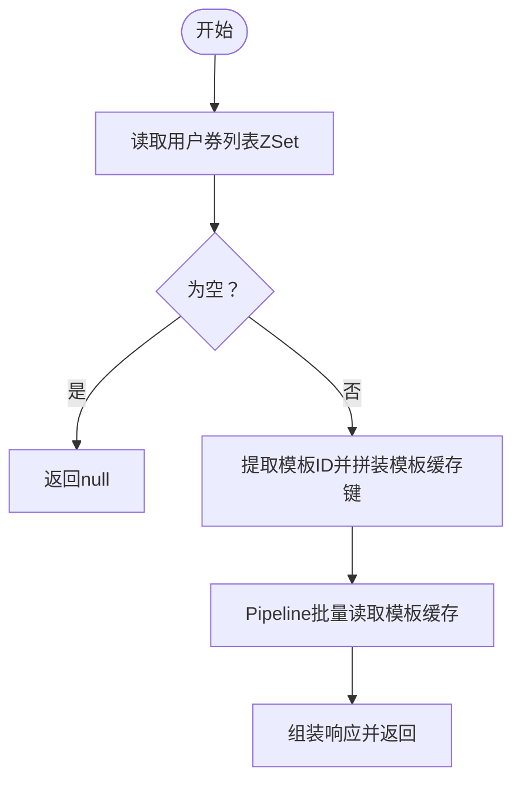
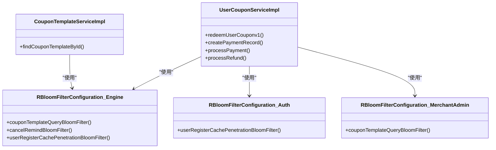
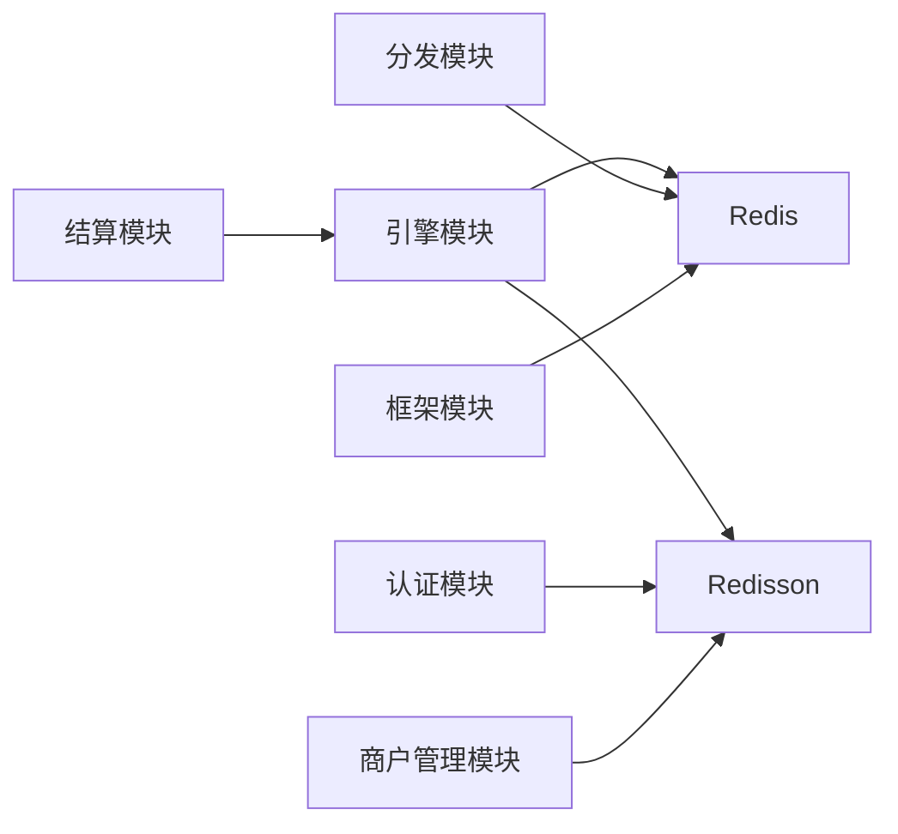

# 缓存优化

<cite>
**本文引用的文件**
- [CacheConfiguration.java](file://framework/src/main/java/com/fengxin/config/CacheConfiguration.java)
- [RedisDistributedProperties.java](file://framework/src/main/java/com/fengxin/config/RedisDistributedProperties.java)
- [EngineRedisConstant.java（引擎模块）](file://engine/src/main/java/com/fengxin/maplecoupon/engine/common/constant/EngineRedisConstant.java)
- [EngineRedisConstant.java（认证模块）](file://auth/src/main/java/com/fengxin/maplecoupon/auth/common/constant/EngineRedisConstant.java)
- [DistributionRedisConstant.java](file://distribution/src/main/java/com/fengxin/maplecoupon/distribution/common/constant/DistributionRedisConstant.java)
- [RBloomFilterConfiguration.java（引擎模块）](file://engine/src/main/java/com/fengxin/maplecoupon/engine/config/RBloomFilterConfiguration.java)
- [RBloomFilterConfiguration.java（认证模块）](file://auth/src/main/java/com/fengxin/maplecoupon/auth/config/RBloomFilterConfiguration.java)
- [RBloomFilterConfiguration.java（商户管理模块）](file://merchant-admin/src/main/java/com/fengxin/maplecoupon/merchantadmin/config/RBloomFilterConfiguration.java)
- [CouponTemplateServiceImpl.java](file://engine/src/main/java/com/fengxin/maplecoupon/engine/service/impl/CouponTemplateServiceImpl.java)
- [UserCouponServiceImpl.java](file://engine/src/main/java/com/fengxin/maplecoupon/engine/service/impl/UserCouponServiceImpl.java)
- [CouponQueryServiceImpl.java](file://settlement/src/main/java/com/fengxin/maplecoupon/settlement/service/impl/CouponQueryServiceImpl.java)
- [stock_decrement_and_save_user_receive.lua](file://engine/src/main/resources/lua/stock_decrement_and_save_user_receive.lua)
- [stock_decrement_and_batch_save_user_record.lua](file://distribution/src/main/resources/lua/stock_decrement_and_batch_save_user_record.lua)
- [batch_save_user_coupon.lua](file://distribution/src/main/resources/lua/batch_save_user_coupon.lua)
- [application.yaml（框架）](file://framework/src/main/resources/application.yaml)
- [application-dev.yaml（引擎）](file://engine/src/main/resources/application-dev.yaml)
- [application-prod.yaml（引擎）](file://engine/src/main/resources/application-prod.yaml)
</cite>

## 目录
1. [简介](#简介)
2. [项目结构](#项目结构)
3. [核心组件](#核心组件)
4. [架构总览](#架构总览)
5. [详细组件分析](#详细组件分析)
6. [依赖分析](#依赖分析)
7. [性能考量](#性能考量)
8. [故障排查指南](#故障排查指南)
9. [结论](#结论)
10. [附录](#附录)

## 简介
本文件聚焦于MapleCoupon系统的Redis缓存优化实践，围绕优惠券系统的关键缓存设计与实现展开，包括：
- 缓存键设计策略与层次结构
- 缓存失效与一致性保障
- Redisson分布式缓存配置与使用（分布式锁、布隆过滤器）
- 性能调优（内存、连接池、预热、热点处理）
- 缓存命中率优化（穿透、击穿、雪崩防护）
- 实战配置示例与性能测试建议

## 项目结构
MapleCoupon采用多模块架构，缓存相关能力主要分布在以下模块：
- 引擎模块（engine）：优惠券模板查询、用户领券、核销等核心流程均使用Redis与Redisson
- 认证模块（auth）：用户登录、注册等场景引入布隆过滤器防止缓存穿透
- 商户管理模块（merchant-admin）：模板查询布隆过滤器
- 结算模块（settlement）：用户优惠券列表缓存读取与批量查询
- 分发模块（distribution）：批量发放场景的Lua脚本与ZSet缓存
- 框架模块（framework）：统一Redis Key前缀与序列化配置

**图表来源**
- [CacheConfiguration.java:16-35](file://framework/src/main/java/com/fengxin/config/CacheConfiguration.java#L16-L35)
- [RedisDistributedProperties.java:11-24](file://framework/src/main/java/com/fengxin/config/RedisDistributedProperties.java#L11-L24)
- [EngineRedisConstant.java（引擎模块）:9-56](file://engine/src/main/java/com/fengxin/maplecoupon/engine/common/constant/EngineRedisConstant.java#L9-L56)
- [EngineRedisConstant.java（认证模块）:9-55](file://auth/src/main/java/com/fengxin/maplecoupon/auth/common/constant/EngineRedisConstant.java#L9-L55)
- [DistributionRedisConstant.java:9-21](file://distribution/src/main/java/com/fengxin/maplecoupon/distribution/common/constant/DistributionRedisConstant.java#L9-L21)
- [RBloomFilterConfiguration.java（引擎模块）:15-47](file://engine/src/main/java/com/fengxin/maplecoupon/engine/config/RBloomFilterConfiguration.java#L15-L47)
- [RBloomFilterConfiguration.java（认证模块）:15-28](file://auth/src/main/java/com/fengxin/maplecoupon/auth/config/RBloomFilterConfiguration.java#L15-L28)
- [RBloomFilterConfiguration.java（商户管理模块）:15-27](file://merchant-admin/src/main/java/com/fengxin/maplecoupon/merchantadmin/config/RBloomFilterConfiguration.java#L15-L27)
- [CouponTemplateServiceImpl.java:42-132](file://engine/src/main/java/com/fengxin/maplecoupon/engine/service/impl/CouponTemplateServiceImpl.java#L42-L132)
- [UserCouponServiceImpl.java:73-661](file://engine/src/main/java/com/fengxin/maplecoupon/engine/service/impl/UserCouponServiceImpl.java#L73-L661)
- [CouponQueryServiceImpl.java:177-190](file://settlement/src/main/java/com/fengxin/maplecoupon/settlement/service/impl/CouponQueryServiceImpl.java#L177-L190)
- [stock_decrement_and_save_user_receive.lua:1-58](file://engine/src/main/resources/lua/stock_decrement_and_save_user_receive.lua#L1-L58)
- [stock_decrement_and_batch_save_user_record.lua:1-33](file://distribution/src/main/resources/lua/stock_decrement_and_batch_save_user_record.lua#L1-L33)
- [batch_save_user_coupon.lua:1-15](file://distribution/src/main/resources/lua/batch_save_user_coupon.lua#L1-L15)

**章节来源**
- [CacheConfiguration.java:16-35](file://framework/src/main/java/com/fengxin/config/CacheConfiguration.java#L16-L35)
- [RedisDistributedProperties.java:11-24](file://framework/src/main/java/com/fengxin/config/RedisDistributedProperties.java#L11-L24)

## 核心组件
- 缓存键设计与前缀
  - 通过框架层统一Key前缀与序列化，确保各模块键空间隔离与可维护性
  - 引擎模块定义了模板、锁、空值、用户领取限制、用户券列表、提醒等键规范
  - 认证模块定义了登录、注册锁等键
  - 分发模块定义了任务进度与批次用户键
- Redisson布隆过滤器
  - 引擎模块：模板查询、取消提醒、用户注册穿透防护
  - 认证模块：用户注册穿透防护
  - 商户管理模块：模板查询穿透防护
- Redis缓存与Lua脚本
  - 引擎模块：模板查询（哈希+过期）、用户领券（库存扣减+用户领取计数+上限校验）
  - 分发模块：批量发放（库存扣减+用户集合+计数）
- 分布式锁
  - 引擎模块：模板查询、结算流程（创建/支付/退款）的并发控制
- 用户券列表缓存
  - 结算模块：ZSet存储用户券模板与券ID，支持批量查询与过期控制

**章节来源**
- [EngineRedisConstant.java（引擎模块）:9-56](file://engine/src/main/java/com/fengxin/maplecoupon/engine/common/constant/EngineRedisConstant.java#L9-L56)
- [EngineRedisConstant.java（认证模块）:9-55](file://auth/src/main/java/com/fengxin/maplecoupon/auth/common/constant/EngineRedisConstant.java#L9-L55)
- [DistributionRedisConstant.java:9-21](file://distribution/src/main/java/com/fengxin/maplecoupon/distribution/common/constant/DistributionRedisConstant.java#L9-L21)
- [RBloomFilterConfiguration.java（引擎模块）:15-47](file://engine/src/main/java/com/fengxin/maplecoupon/engine/config/RBloomFilterConfiguration.java#L15-L47)
- [RBloomFilterConfiguration.java（认证模块）:15-28](file://auth/src/main/java/com/fengxin/maplecoupon/auth/config/RBloomFilterConfiguration.java#L15-L28)
- [RBloomFilterConfiguration.java（商户管理模块）:15-27](file://merchant-admin/src/main/java/com/fengxin/maplecoupon/merchantadmin/config/RBloomFilterConfiguration.java#L15-L27)
- [CouponTemplateServiceImpl.java:49-132](file://engine/src/main/java/com/fengxin/maplecoupon/engine/service/impl/CouponTemplateServiceImpl.java#L49-L132)
- [UserCouponServiceImpl.java:88-136](file://engine/src/main/java/com/fengxin/maplecoupon/engine/service/impl/UserCouponServiceImpl.java#L88-L136)
- [CouponQueryServiceImpl.java:177-190](file://settlement/src/main/java/com/fengxin/maplecoupon/settlement/service/impl/CouponQueryServiceImpl.java#L177-L190)

## 架构总览
下图展示优惠券系统中Redis缓存与Redisson的交互关系，涵盖键设计、布隆过滤器、Lua脚本与分布式锁。

**图表来源**
- [CouponTemplateServiceImpl.java:49-132](file://engine/src/main/java/com/fengxin/maplecoupon/engine/service/impl/CouponTemplateServiceImpl.java#L49-L132)
- [UserCouponServiceImpl.java:88-136](file://engine/src/main/java/com/fengxin/maplecoupon/engine/service/impl/UserCouponServiceImpl.java#L88-L136)
- [RBloomFilterConfiguration.java（引擎模块）:15-47](file://engine/src/main/java/com/fengxin/maplecoupon/engine/config/RBloomFilterConfiguration.java#L15-L47)

## 详细组件分析

### 组件A：模板查询缓存与分布式锁（缓存击穿防护）
- 设计要点
  - 使用布隆过滤器快速判断模板是否存在，避免无效查询进入数据库
  - 缓存空值键用于标记“已过期”模板，防止缓存穿透
  - 双重检查+Redisson分布式锁，确保高并发下的一致性
  - 使用Lua原子性地设置模板哈希与过期时间
- 流程图

**图表来源**
- [CouponTemplateServiceImpl.java:49-132](file://engine/src/main/java/com/fengxin/maplecoupon/engine/service/impl/CouponTemplateServiceImpl.java#L49-L132)
- [EngineRedisConstant.java（引擎模块）:9-56](file://engine/src/main/java/com/fengxin/maplecoupon/engine/common/constant/EngineRedisConstant.java#L9-L56)
- [RBloomFilterConfiguration.java（引擎模块）:15-47](file://engine/src/main/java/com/fengxin/maplecoupon/engine/config/RBloomFilterConfiguration.java#L15-L47)

**章节来源**
- [CouponTemplateServiceImpl.java:49-132](file://engine/src/main/java/com/fengxin/maplecoupon/engine/service/impl/CouponTemplateServiceImpl.java#L49-L132)
- [EngineRedisConstant.java（引擎模块）:9-56](file://engine/src/main/java/com/fengxin/maplecoupon/engine/common/constant/EngineRedisConstant.java#L9-L56)
- [RBloomFilterConfiguration.java（引擎模块）:15-47](file://engine/src/main/java/com/fengxin/maplecoupon/engine/config/RBloomFilterConfiguration.java#L15-L47)

### 组件B：用户领券流程（库存扣减与领取上限）
- 设计要点
  - 使用Lua脚本原子性完成库存扣减、用户领取计数与上限校验
  - 通过组合返回值区分成功/库存不足/超过上限三种状态
  - 成功后异步落库并写入用户券列表ZSet，同时发送延时消息
- 序列图

**图表来源**
- [UserCouponServiceImpl.java:88-136](file://engine/src/main/java/com/fengxin/maplecoupon/engine/service/impl/UserCouponServiceImpl.java#L88-L136)
- [stock_decrement_and_save_user_receive.lua:1-58](file://engine/src/main/resources/lua/stock_decrement_and_save_user_receive.lua#L1-L58)

**章节来源**
- [UserCouponServiceImpl.java:88-136](file://engine/src/main/java/com/fengxin/maplecoupon/engine/service/impl/UserCouponServiceImpl.java#L88-L136)
- [stock_decrement_and_save_user_receive.lua:1-58](file://engine/src/main/resources/lua/stock_decrement_and_save_user_receive.lua#L1-L58)

### 组件C：用户券列表缓存与批量查询
- 设计要点
  - 使用ZSet存储用户券模板ID与券ID的组合及有效结束时间作为分数
  - 批量查询时先读取ZSet，再拼装模板缓存键进行Pipeline批量读取
  - 通过Redis过期与Lua脚本保证时效性与原子性
- 流程图

**图表来源**
- [CouponQueryServiceImpl.java:177-190](file://settlement/src/main/java/com/fengxin/maplecoupon/settlement/service/impl/CouponQueryServiceImpl.java#L177-L190)
- [EngineRedisConstant.java（引擎模块）:9-56](file://engine/src/main/java/com/fengxin/maplecoupon/engine/common/constant/EngineRedisConstant.java#L9-L56)

**章节来源**
- [CouponQueryServiceImpl.java:177-190](file://settlement/src/main/java/com/fengxin/maplecoupon/settlement/service/impl/CouponQueryServiceImpl.java#L177-L190)
- [EngineRedisConstant.java（引擎模块）:9-56](file://engine/src/main/java/com/fengxin/maplecoupon/engine/common/constant/EngineRedisConstant.java#L9-L56)

### 组件D：Redisson布隆过滤器与分布式锁配置
- 布隆过滤器
  - 引擎模块：模板查询、取消提醒、用户注册穿透防护
  - 认证模块：用户注册穿透防护
  - 商户管理模块：模板查询穿透防护
- 分布式锁
  - 模板查询锁、结算流程锁（创建/支付/退款）
- 类图

**图表来源**
- [RBloomFilterConfiguration.java（引擎模块）:15-47](file://engine/src/main/java/com/fengxin/maplecoupon/engine/config/RBloomFilterConfiguration.java#L15-L47)
- [RBloomFilterConfiguration.java（认证模块）:15-28](file://auth/src/main/java/com/fengxin/maplecoupon/auth/config/RBloomFilterConfiguration.java#L15-L28)
- [RBloomFilterConfiguration.java（商户管理模块）:15-27](file://merchant-admin/src/main/java/com/fengxin/maplecoupon/merchantadmin/config/RBloomFilterConfiguration.java#L15-L27)
- [CouponTemplateServiceImpl.java:49-132](file://engine/src/main/java/com/fengxin/maplecoupon/engine/service/impl/CouponTemplateServiceImpl.java#L49-L132)
- [UserCouponServiceImpl.java:88-136](file://engine/src/main/java/com/fengxin/maplecoupon/engine/service/impl/UserCouponServiceImpl.java#L88-L136)

**章节来源**
- [RBloomFilterConfiguration.java（引擎模块）:15-47](file://engine/src/main/java/com/fengxin/maplecoupon/engine/config/RBloomFilterConfiguration.java#L15-L47)
- [RBloomFilterConfiguration.java（认证模块）:15-28](file://auth/src/main/java/com/fengxin/maplecoupon/auth/config/RBloomFilterConfiguration.java#L15-L28)
- [RBloomFilterConfiguration.java（商户管理模块）:15-27](file://merchant-admin/src/main/java/com/fengxin/maplecoupon/merchantadmin/config/RBloomFilterConfiguration.java#L15-L27)
- [CouponTemplateServiceImpl.java:49-132](file://engine/src/main/java/com/fengxin/maplecoupon/engine/service/impl/CouponTemplateServiceImpl.java#L49-L132)
- [UserCouponServiceImpl.java:88-136](file://engine/src/main/java/com/fengxin/maplecoupon/engine/service/impl/UserCouponServiceImpl.java#L88-L136)

## 依赖分析
- 模块耦合
  - 引擎模块对Redis与Redisson依赖最深，承担核心缓存与一致性职责
  - 认证与商户管理模块通过布隆过滤器降低数据库压力
  - 结算模块依赖引擎模块的模板缓存键规范
  - 分发模块通过Lua脚本与ZSet实现高效批量发放
- 外部依赖
  - Redis（String、Hash、ZSet、Lua）
  - Redisson（RBloomFilter、RLock）

**图表来源**
- [CouponTemplateServiceImpl.java:42-47](file://engine/src/main/java/com/fengxin/maplecoupon/engine/service/impl/CouponTemplateServiceImpl.java#L42-L47)
- [UserCouponServiceImpl.java:73-86](file://engine/src/main/java/com/fengxin/maplecoupon/engine/service/impl/UserCouponServiceImpl.java#L73-L86)
- [RBloomFilterConfiguration.java（引擎模块）:15-47](file://engine/src/main/java/com/fengxin/maplecoupon/engine/config/RBloomFilterConfiguration.java#L15-L47)
- [RBloomFilterConfiguration.java（认证模块）:15-28](file://auth/src/main/java/com/fengxin/maplecoupon/auth/config/RBloomFilterConfiguration.java#L15-L28)
- [RBloomFilterConfiguration.java（商户管理模块）:15-27](file://merchant-admin/src/main/java/com/fengxin/maplecoupon/merchantadmin/config/RBloomFilterConfiguration.java#L15-L27)
- [CouponQueryServiceImpl.java:177-190](file://settlement/src/main/java/com/fengxin/maplecoupon/settlement/service/impl/CouponQueryServiceImpl.java#L177-L190)
- [stock_decrement_and_save_user_receive.lua:1-58](file://engine/src/main/resources/lua/stock_decrement_and_save_user_receive.lua#L1-L58)

**章节来源**
- [CouponTemplateServiceImpl.java:42-47](file://engine/src/main/java/com/fengxin/maplecoupon/engine/service/impl/CouponTemplateServiceImpl.java#L42-L47)
- [UserCouponServiceImpl.java:73-86](file://engine/src/main/java/com/fengxin/maplecoupon/engine/service/impl/UserCouponServiceImpl.java#L73-L86)
- [CouponQueryServiceImpl.java:177-190](file://settlement/src/main/java/com/fengxin/maplecoupon/settlement/service/impl/CouponQueryServiceImpl.java#L177-L190)

## 性能考量
- 内存使用优化
  - 使用ZSet存储用户券列表，按有效结束时间排序，便于过期与清理
  - 哈希缓存模板字段，减少键数量与内存碎片
  - 布隆过滤器容量与误判率根据业务规模配置，避免过大占用
- 连接池配置
  - 建议在应用配置中设置合适的连接池大小与超时参数，结合压测调整
- 缓存预热
  - 在系统启动或低峰期预热热点模板缓存，降低首次访问延迟
- 热点数据处理
  - 对高并发模板采用更短的过期时间与合理的随机偏移，避免同时过期
  - 对用户券列表ZSet设置合理TTL，避免无限增长
- Lua脚本
  - 原子性执行库存扣减与计数，减少网络往返与竞争条件

[本节为通用性能指导，无需具体文件分析]

## 故障排查指南
- 缓存穿透
  - 确认布隆过滤器初始化与使用是否正确
  - 检查空值缓存键是否在模板过期时写入
- 缓存击穿
  - 检查分布式锁是否在模板查询路径上正确使用
  - 确保双重检查逻辑与Lua原子写入
- 缓存雪崩
  - 检查模板与用户券列表的过期策略，避免同一时间大面积过期
  - 对热点模板设置独立过期时间或随机偏移
- Redis异常
  - 观察ZSet写入失败时的降级重试与日志告警
  - 核对Lua脚本执行结果与组合返回值解析

**章节来源**
- [CouponTemplateServiceImpl.java:49-132](file://engine/src/main/java/com/fengxin/maplecoupon/engine/service/impl/CouponTemplateServiceImpl.java#L49-L132)
- [UserCouponServiceImpl.java:209-222](file://engine/src/main/java/com/fengxin/maplecoupon/engine/service/impl/UserCouponServiceImpl.java#L209-L222)

## 结论
MapleCoupon通过Redis与Redisson实现了高性能、高可靠的优惠券缓存体系：
- 布隆过滤器有效防止缓存穿透
- 分布式锁与Lua脚本保障缓存击穿与并发一致性
- ZSet与哈希缓存提升读取效率
- 明确的键命名与前缀策略便于运维与扩展

建议在生产环境中结合压测持续优化布隆过滤器容量、连接池参数与过期策略，并完善监控与告警体系。

[本节为总结性内容，无需具体文件分析]

## 附录
- 配置示例（基于现有配置类与文件）
  - Redis Key前缀与序列化
    - 在框架层通过属性类与配置类统一设置Key前缀与字符集
    - 参考：[RedisDistributedProperties.java:11-24](file://framework/src/main/java/com/fengxin/config/RedisDistributedProperties.java#L11-L24)，[CacheConfiguration.java:16-35](file://framework/src/main/java/com/fengxin/config/CacheConfiguration.java#L16-L35)
  - 布隆过滤器初始化
    - 引擎模块：模板查询、取消提醒、用户注册
      - 参考：[RBloomFilterConfiguration.java（引擎模块）:15-47](file://engine/src/main/java/com/fengxin/maplecoupon/engine/config/RBloomFilterConfiguration.java#L15-L47)
    - 认证模块：用户注册
      - 参考：[RBloomFilterConfiguration.java（认证模块）:15-28](file://auth/src/main/java/com/fengxin/maplecoupon/auth/config/RBloomFilterConfiguration.java#L15-L28)
    - 商户管理模块：模板查询
      - 参考：[RBloomFilterConfiguration.java（商户管理模块）:15-27](file://merchant-admin/src/main/java/com/fengxin/maplecoupon/merchantadmin/config/RBloomFilterConfiguration.java#L15-L27)
  - 缓存键规范
    - 引擎模块：模板、锁、空值、用户领取限制、用户券列表、提醒
      - 参考：[EngineRedisConstant.java（引擎模块）:9-56](file://engine/src/main/java/com/fengxin/maplecoupon/engine/common/constant/EngineRedisConstant.java#L9-L56)
    - 认证模块：登录、注册锁
      - 参考：[EngineRedisConstant.java（认证模块）:9-55](file://auth/src/main/java/com/fengxin/maplecoupon/auth/common/constant/EngineRedisConstant.java#L9-L55)
    - 分发模块：任务进度、批次用户
      - 参考：[DistributionRedisConstant.java:9-21](file://distribution/src/main/java/com/fengxin/maplecoupon/distribution/common/constant/DistributionRedisConstant.java#L9-L21)
  - Lua脚本
    - 领券：库存扣减+用户计数+上限校验
      - 参考：[stock_decrement_and_save_user_receive.lua:1-58](file://engine/src/main/resources/lua/stock_decrement_and_save_user_receive.lua#L1-L58)
    - 批量发放：库存扣减+用户集合+计数
      - 参考：[stock_decrement_and_batch_save_user_record.lua:1-33](file://distribution/src/main/resources/lua/stock_decrement_and_batch_save_user_record.lua#L1-L33)
    - 批量保存用户券：ZSet写入与过期
      - 参考：[batch_save_user_coupon.lua:1-15](file://distribution/src/main/resources/lua/batch_save_user_coupon.lua#L1-L15)

**章节来源**
- [RedisDistributedProperties.java:11-24](file://framework/src/main/java/com/fengxin/config/RedisDistributedProperties.java#L11-L24)
- [CacheConfiguration.java:16-35](file://framework/src/main/java/com/fengxin/config/CacheConfiguration.java#L16-L35)
- [RBloomFilterConfiguration.java（引擎模块）:15-47](file://engine/src/main/java/com/fengxin/maplecoupon/engine/config/RBloomFilterConfiguration.java#L15-L47)
- [RBloomFilterConfiguration.java（认证模块）:15-28](file://auth/src/main/java/com/fengxin/maplecoupon/auth/config/RBloomFilterConfiguration.java#L15-L28)
- [RBloomFilterConfiguration.java（商户管理模块）:15-27](file://merchant-admin/src/main/java/com/fengxin/maplecoupon/merchantadmin/config/RBloomFilterConfiguration.java#L15-L27)
- [EngineRedisConstant.java（引擎模块）:9-56](file://engine/src/main/java/com/fengxin/maplecoupon/engine/common/constant/EngineRedisConstant.java#L9-L56)
- [EngineRedisConstant.java（认证模块）:9-55](file://auth/src/main/java/com/fengxin/maplecoupon/auth/common/constant/EngineRedisConstant.java#L9-L55)
- [DistributionRedisConstant.java:9-21](file://distribution/src/main/java/com/fengxin/maplecoupon/distribution/common/constant/DistributionRedisConstant.java#L9-L21)
- [stock_decrement_and_save_user_receive.lua:1-58](file://engine/src/main/resources/lua/stock_decrement_and_save_user_receive.lua#L1-L58)
- [stock_decrement_and_batch_save_user_record.lua:1-33](file://distribution/src/main/resources/lua/stock_decrement_and_batch_save_user_record.lua#L1-L33)
- [batch_save_user_coupon.lua:1-15](file://distribution/src/main/resources/lua/batch_save_user_coupon.lua#L1-L15)