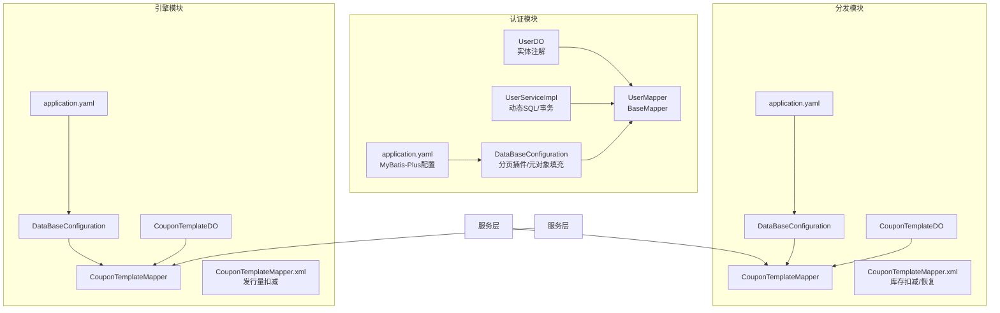
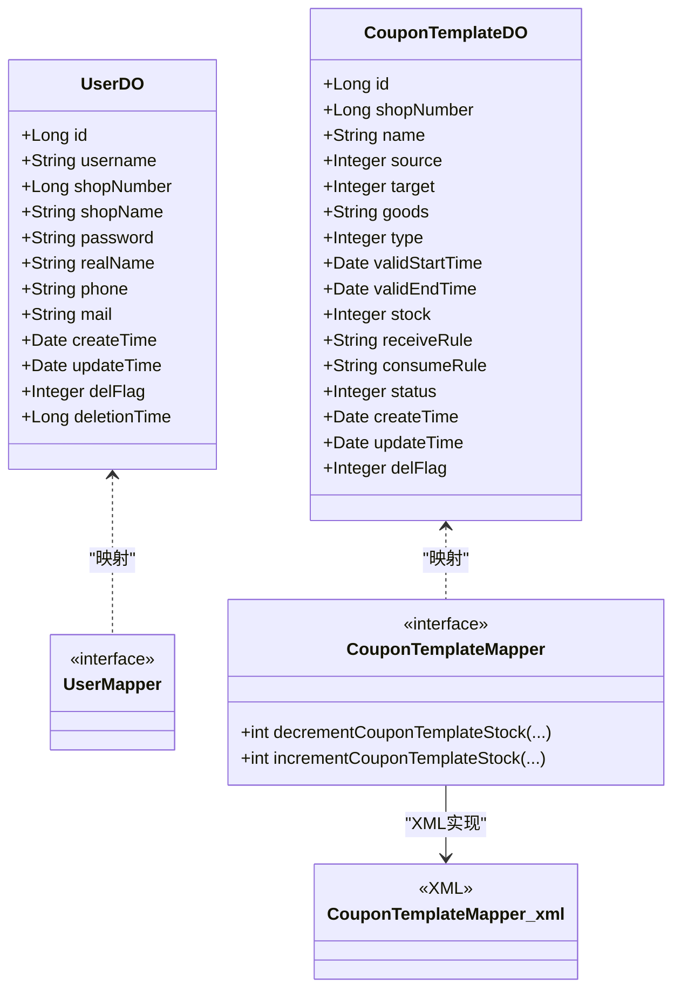
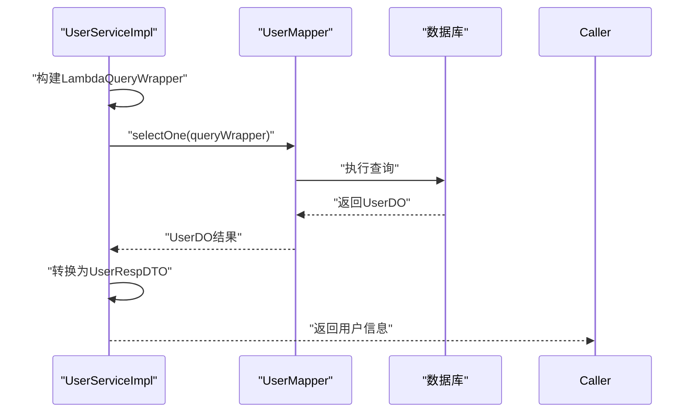
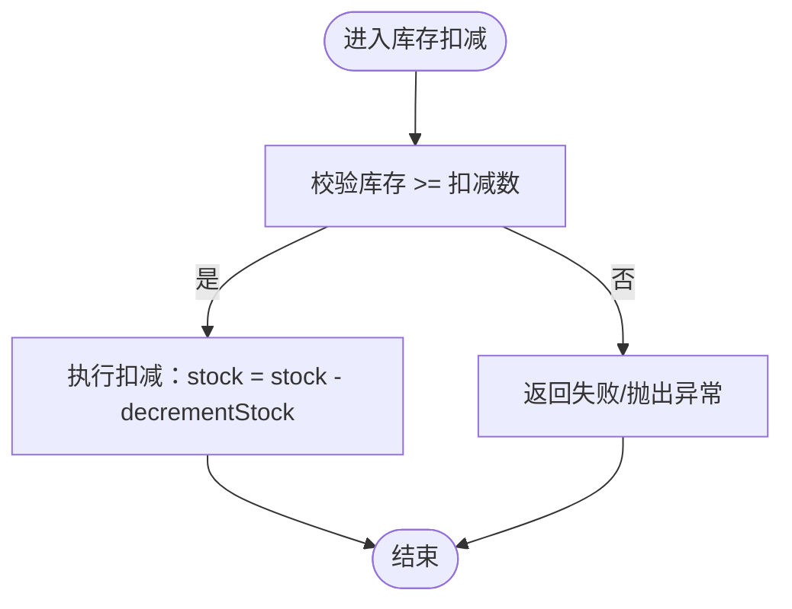
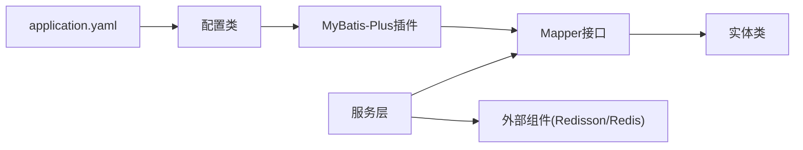

# ORM框架集成

<cite>
**本文引用的文件**
- [application.yaml（认证模块）](file://auth/src/main/resources/application.yaml)
- [application.yaml（分发模块）](file://distribution/src/main/resources/application.yaml)
- [application.yaml（引擎模块）](file://engine/src/main/resources/application.yaml)
- [application.yaml（商户管理模块）](file://merchant-admin/src/main/resources/application.yaml)
- [application.yaml（结算模块）](file://settlement/src/main/resources/application.yaml)
- [DataBaseConfiguration（认证模块）](file://auth/src/main/java/com/fengxin/maplecoupon/auth/config/DataBaseConfiguration.java)
- [DataBaseConfiguration（分发模块）](file://distribution/src/main/java/com/fengxin/maplecoupon/distribution/config/DataBaseConfiguration.java)
- [DataBaseConfiguration（引擎模块）](file://engine/src/main/java/com/fengxin/maplecoupon/engine/config/DataBaseConfiguration.java)
- [UserDO（认证模块实体）](file://auth/src/main/java/com/fengxin/maplecoupon/auth/dao/entity/UserDO.java)
- [UserMapper（认证模块Mapper）](file://auth/src/main/java/com/fengxin/maplecoupon/auth/dao/mapper/UserMapper.java)
- [CouponTemplateDO（分发模块实体）](file://distribution/src/main/java/com/fengxin/maplecoupon/distribution/dao/entity/CouponTemplateDO.java)
- [CouponTemplateMapper（分发模块Mapper）](file://distribution/src/main/java/com/fengxin/maplecoupon/distribution/dao/mapper/CouponTemplateMapper.java)
- [CouponTemplateMapper.xml（分发模块XML）](file://distribution/src/main/resources/mapper/CouponTemplateMapper.xml)
- [CouponTemplateDO（引擎模块实体）](file://engine/src/main/java/com/fengxin/maplecoupon/engine/dao/entity/CouponTemplateDO.java)
- [CouponTemplateMapper（引擎模块Mapper）](file://engine/src/main/java/com/fengxin/maplecoupon/engine/dao/mapper/CouponTemplateMapper.java)
- [CouponTemplateMapper.xml（引擎模块XML）](file://engine/src/main/resources/mapper/CouponTemplateMapper.xml)
- [UserService（认证模块服务接口）](file://auth/src/main/java/com/fengxin/maplecoupon/auth/service/UserService.java)
- [UserServiceImpl（认证模块服务实现）](file://auth/src/main/java/com/fengxin/maplecoupon/auth/service/impl/UserServiceImpl.java)
</cite>

## 目录
1. [简介](#简介)
2. [项目结构](#项目结构)
3. [核心组件](#核心组件)
4. [架构总览](#架构总览)
5. [详细组件分析](#详细组件分析)
6. [依赖关系分析](#依赖关系分析)
7. [性能考虑](#性能考虑)
8. [故障排查指南](#故障排查指南)
9. [结论](#结论)
10. [附录](#附录)

## 简介
本文件面向MapleCoupon项目中基于MyBatis-Plus的ORM集成实践，系统梳理实体类注解、Mapper接口与XML映射文件的编写规范，总结动态SQL技巧（条件查询、批量操作、复杂关联）、分页查询配置与使用、数据库连接池配置与优化（HikariCP参数调优与连接泄漏预防）、完整CRUD示例（单表、批量、事务管理）、MyBatis-Plus插件机制（分页、性能分析、乐观锁），以及SQL性能优化与慢查询分析方法。文档以认证、分发、引擎等模块为载体，结合实际代码路径进行说明，帮助读者快速掌握在本项目中的ORM最佳实践。

## 项目结构
- 模块化组织：项目按业务域拆分为多个子模块（如auth、distribution、engine、merchant-admin、settlement、gateway、framework等），每个模块均包含独立的配置、实体、Mapper、XML映射与服务层。
- ORM集成点：各模块在各自资源目录下提供MyBatis-Plus配置（application.yaml），并在config包中定义数据库配置（如分页插件、元对象自动填充），实体类采用MyBatis-Plus注解标注表与字段，Mapper继承BaseMapper，复杂SQL通过XML映射文件实现。
- 连接与分片：所有模块统一使用ShardingSphere驱动作为数据源驱动，并通过application.yaml中的mybatis-plus.configuration.log-impl开启SQL日志输出，便于开发调试。

**图表来源**
- [application.yaml（认证模块）:12-14](file://auth/src/main/resources/application.yaml#L12-L14)
- [application.yaml（分发模块）:12-14](file://distribution/src/main/resources/application.yaml#L12-L14)
- [application.yaml（引擎模块）:12-14](file://engine/src/main/resources/application.yaml#L12-L14)
- [DataBaseConfiguration（认证模块）:25-30](file://auth/src/main/java/com/fengxin/maplecoupon/auth/config/DataBaseConfiguration.java#L25-L30)
- [DataBaseConfiguration（分发模块）:25-30](file://distribution/src/main/java/com/fengxin/maplecoupon/distribution/config/DataBaseConfiguration.java#L25-L30)
- [DataBaseConfiguration（引擎模块）:25-30](file://engine/src/main/java/com/fengxin/maplecoupon/engine/config/DataBaseConfiguration.java#L25-L30)
- [UserDO（认证模块实体）:18-87](file://auth/src/main/java/com/fengxin/maplecoupon/auth/dao/entity/UserDO.java#L18-L87)
- [UserMapper（认证模块Mapper）:13-15](file://auth/src/main/java/com/fengxin/maplecoupon/auth/dao/mapper/UserMapper.java#L13-L15)
- [CouponTemplateDO（分发模块实体）:23-108](file://distribution/src/main/java/com/fengxin/maplecoupon/distribution/dao/entity/CouponTemplateDO.java#L23-L108)
- [CouponTemplateMapper（分发模块Mapper）:14-38](file://distribution/src/main/java/com/fengxin/maplecoupon/distribution/dao/mapper/CouponTemplateMapper.java#L14-L38)
- [CouponTemplateMapper.xml（分发模块XML）:5-23](file://distribution/src/main/resources/mapper/CouponTemplateMapper.xml#L5-L23)
- [CouponTemplateDO（引擎模块实体）:23-108](file://engine/src/main/java/com/fengxin/maplecoupon/engine/dao/entity/CouponTemplateDO.java#L23-L108)
- [CouponTemplateMapper（引擎模块Mapper）:13-24](file://engine/src/main/java/com/fengxin/maplecoupon/engine/dao/mapper/CouponTemplateMapper.java#L13-L24)
- [CouponTemplateMapper.xml（引擎模块XML）:5-15](file://engine/src/main/resources/mapper/CouponTemplateMapper.xml#L5-L15)

**章节来源**
- [application.yaml（认证模块）:1-19](file://auth/src/main/resources/application.yaml#L1-L19)
- [application.yaml（分发模块）:1-15](file://distribution/src/main/resources/application.yaml#L1-L15)
- [application.yaml（引擎模块）:1-22](file://engine/src/main/resources/application.yaml#L1-L22)
- [application.yaml（商户管理模块）:1-27](file://merchant-admin/src/main/resources/application.yaml#L1-L27)
- [application.yaml（结算模块）:1-14](file://settlement/src/main/resources/application.yaml#L1-L14)

## 核心组件
- 实体类注解
  - @TableName：声明实体对应数据库表名，如UserDO使用coupon_user，CouponTemplateDO使用t_coupon_template。
  - @TableField：声明字段填充策略（插入/更新/插入更新），并可配合JSON序列化格式化时间字段。
- Mapper接口
  - 统一继承BaseMapper<T>，即可获得标准CRUD能力；对于复杂SQL，通过@Param声明参数并在XML中实现。
- XML映射文件
  - 使用namespace绑定Mapper接口，定义复杂更新语句（如库存扣减/恢复）及条件判断逻辑。
- 配置类
  - 注册MyBatis-Plus拦截器（分页插件），注入元对象处理器（自动填充createTime、updateTime、delFlag）。
- 动态SQL与事务
  - 通过LambdaQueryWrapper/LambdaUpdateWrapper构建条件，结合@Transactional实现事务控制。

**章节来源**
- [UserDO（认证模块实体）:18-87](file://auth/src/main/java/com/fengxin/maplecoupon/auth/dao/entity/UserDO.java#L18-L87)
- [CouponTemplateDO（分发模块实体）:23-108](file://distribution/src/main/java/com/fengxin/maplecoupon/distribution/dao/entity/CouponTemplateDO.java#L23-L108)
- [CouponTemplateDO（引擎模块实体）:23-108](file://engine/src/main/java/com/fengxin/maplecoupon/engine/dao/entity/CouponTemplateDO.java#L23-L108)
- [UserMapper（认证模块Mapper）:13-15](file://auth/src/main/java/com/fengxin/maplecoupon/auth/dao/mapper/UserMapper.java#L13-L15)
- [CouponTemplateMapper（分发模块Mapper）:14-38](file://distribution/src/main/java/com/fengxin/maplecoupon/distribution/dao/mapper/CouponTemplateMapper.java#L14-L38)
- [CouponTemplateMapper（引擎模块Mapper）:13-24](file://engine/src/main/java/com/fengxin/maplecoupon/engine/dao/mapper/CouponTemplateMapper.java#L13-L24)
- [CouponTemplateMapper.xml（分发模块XML）:5-23](file://distribution/src/main/resources/mapper/CouponTemplateMapper.xml#L5-L23)
- [CouponTemplateMapper.xml（引擎模块XML）:5-15](file://engine/src/main/resources/mapper/CouponTemplateMapper.xml#L5-L15)
- [DataBaseConfiguration（认证模块）:25-54](file://auth/src/main/java/com/fengxin/maplecoupon/auth/config/DataBaseConfiguration.java#L25-L54)
- [DataBaseConfiguration（分发模块）:25-54](file://distribution/src/main/java/com/fengxin/maplecoupon/distribution/config/DataBaseConfiguration.java#L25-L54)
- [DataBaseConfiguration（引擎模块）:25-54](file://engine/src/main/java/com/fengxin/maplecoupon/engine/config/DataBaseConfiguration.java#L25-L54)

## 架构总览
- 数据访问层（DAO）
  - 实体类：@TableName/@TableField注解标注表与字段。
  - Mapper：继承BaseMapper，扩展复杂SQL通过XML映射。
  - XML：namespace绑定Mapper，定义update/delete/select语句。
- 服务层（Service）
  - 使用IService/ServiceImpl扩展CRUD能力，结合动态SQL与事务注解实现业务逻辑。
- 配置层（Config）
  - 注册MyBatis-Plus拦截器（分页插件）与元对象处理器（自动填充）。
- 数据源层
  - 使用ShardingSphere驱动，application.yaml中启用MyBatis-Plus日志输出，便于开发调试。

**图表来源**
- [UserDO（认证模块实体）:18-87](file://auth/src/main/java/com/fengxin/maplecoupon/auth/dao/entity/UserDO.java#L18-L87)
- [UserMapper（认证模块Mapper）:13-15](file://auth/src/main/java/com/fengxin/maplecoupon/auth/dao/mapper/UserMapper.java#L13-L15)
- [CouponTemplateDO（分发模块实体）:23-108](file://distribution/src/main/java/com/fengxin/maplecoupon/distribution/dao/entity/CouponTemplateDO.java#L23-L108)
- [CouponTemplateMapper（分发模块Mapper）:14-38](file://distribution/src/main/java/com/fengxin/maplecoupon/distribution/dao/mapper/CouponTemplateMapper.java#L14-L38)
- [CouponTemplateMapper.xml（分发模块XML）:5-23](file://distribution/src/main/resources/mapper/CouponTemplateMapper.xml#L5-L23)

## 详细组件分析

### 认证模块：用户实体与服务
- 实体注解
  - @TableName("coupon_user")：实体映射到coupon_user表。
  - @TableField(fill=...)：自动填充创建/更新时间与删除标记。
- Mapper与Service
  - UserMapper继承BaseMapper<UserDO>，提供基础CRUD。
  - UserServiceImpl基于ServiceImpl<UserMapper, UserDO>，实现动态SQL与事务：
    - 条件查询：LambdaQueryWrapper.eq(UserDO::getUsername, username)。
    - 更新：LambdaUpdateWrapper结合BaseMapper.update(...)。
    - 事务：@Transactional(rollbackFor = Exception.class)包裹注册与更新流程。
- 关键路径
  - [UserServiceImpl.getUserByUserName:52-64](file://auth/src/main/java/com/fengxin/maplecoupon/auth/service/impl/UserServiceImpl.java#L52-L64)
  - [UserServiceImpl.registerUser:72-100](file://auth/src/main/java/com/fengxin/maplecoupon/auth/service/impl/UserServiceImpl.java#L72-L100)
  - [UserServiceImpl.updateUser:102-119](file://auth/src/main/java/com/fengxin/maplecoupon/auth/service/impl/UserServiceImpl.java#L102-L119)

**图表来源**
- [UserServiceImpl（认证模块服务实现）:52-64](file://auth/src/main/java/com/fengxin/maplecoupon/auth/service/impl/UserServiceImpl.java#L52-L64)
- [UserMapper（认证模块Mapper）:13-15](file://auth/src/main/java/com/fengxin/maplecoupon/auth/dao/mapper/UserMapper.java#L13-L15)

**章节来源**
- [UserDO（认证模块实体）:18-87](file://auth/src/main/java/com/fengxin/maplecoupon/auth/dao/entity/UserDO.java#L18-L87)
- [UserMapper（认证模块Mapper）:13-15](file://auth/src/main/java/com/fengxin/maplecoupon/auth/dao/mapper/UserMapper.java#L13-L15)
- [UserService（认证模块服务接口）:19-78](file://auth/src/main/java/com/fengxin/maplecoupon/auth/service/UserService.java#L19-L78)
- [UserServiceImpl（认证模块服务实现）:47-158](file://auth/src/main/java/com/fengxin/maplecoupon/auth/service/impl/UserServiceImpl.java#L47-L158)

### 分发模块：优惠券模板库存操作
- 实体与Mapper
  - CouponTemplateDO：@TableName("t_coupon_template")，包含stock字段。
  - CouponTemplateMapper：扩展库存扣减与恢复方法，参数通过@Param声明。
- XML映射
  - decrementCouponTemplateStock：在满足stock>=decrementStock前提下扣减库存。
  - incrementCouponTemplateStock：无条件恢复库存。
- 关键路径
  - [CouponTemplateMapper.decrementCouponTemplateStock:22-24](file://distribution/src/main/java/com/fengxin/maplecoupon/distribution/dao/mapper/CouponTemplateMapper.java#L22-L24)
  - [CouponTemplateMapper.incrementCouponTemplateStock:34-36](file://distribution/src/main/java/com/fengxin/maplecoupon/distribution/dao/mapper/CouponTemplateMapper.java#L34-L36)
  - [CouponTemplateMapper.xml（库存操作）:7-21](file://distribution/src/main/resources/mapper/CouponTemplateMapper.xml#L7-L21)

**图表来源**
- [CouponTemplateMapper.xml（分发模块XML）:7-13](file://distribution/src/main/resources/mapper/CouponTemplateMapper.xml#L7-L13)

**章节来源**
- [CouponTemplateDO（分发模块实体）:23-108](file://distribution/src/main/java/com/fengxin/maplecoupon/distribution/dao/entity/CouponTemplateDO.java#L23-L108)
- [CouponTemplateMapper（分发模块Mapper）:14-38](file://distribution/src/main/java/com/fengxin/maplecoupon/distribution/dao/mapper/CouponTemplateMapper.java#L14-L38)
- [CouponTemplateMapper.xml（分发模块XML）:5-23](file://distribution/src/main/resources/mapper/CouponTemplateMapper.xml#L5-L23)

### 引擎模块：优惠券模板发行量扣减
- 与分发模块类似，但仅提供发行量扣减逻辑，不涉及库存恢复。
- 关键路径
  - [CouponTemplateMapper.decrementCouponTemplateStock:21-23](file://engine/src/main/java/com/fengxin/maplecoupon/engine/dao/mapper/CouponTemplateMapper.java#L21-L23)
  - [CouponTemplateMapper.xml（发行量扣减）:7-13](file://engine/src/main/resources/mapper/CouponTemplateMapper.xml#L7-L13)

**章节来源**
- [CouponTemplateDO（引擎模块实体）:23-108](file://engine/src/main/java/com/fengxin/maplecoupon/engine/dao/entity/CouponTemplateDO.java#L23-L108)
- [CouponTemplateMapper（引擎模块Mapper）:13-24](file://engine/src/main/java/com/fengxin/maplecoupon/engine/dao/mapper/CouponTemplateMapper.java#L13-L24)
- [CouponTemplateMapper.xml（引擎模块XML）:5-15](file://engine/src/main/resources/mapper/CouponTemplateMapper.xml#L5-L15)

### 分页查询配置与使用
- 配置
  - 在各模块的DataBaseConfiguration中注册PaginationInnerInterceptor，适配MySQL。
  - application.yaml中开启MyBatis-Plus日志输出，便于观察分页SQL。
- 使用
  - 服务层传入Page对象，调用IService/Page等分页查询方法，底层由分页插件拦截并改写SQL。
- 关键路径
  - [DataBaseConfiguration（认证模块）:25-30](file://auth/src/main/java/com/fengxin/maplecoupon/auth/config/DataBaseConfiguration.java#L25-L30)
  - [application.yaml（认证模块）:12-14](file://auth/src/main/resources/application.yaml#L12-L14)

**章节来源**
- [DataBaseConfiguration（认证模块）:25-30](file://auth/src/main/java/com/fengxin/maplecoupon/auth/config/DataBaseConfiguration.java#L25-L30)
- [DataBaseConfiguration（分发模块）:25-30](file://distribution/src/main/java/com/fengxin/maplecoupon/distribution/config/DataBaseConfiguration.java#L25-L30)
- [DataBaseConfiguration（引擎模块）:25-30](file://engine/src/main/java/com/fengxin/maplecoupon/engine/config/DataBaseConfiguration.java#L25-L30)
- [application.yaml（认证模块）:12-14](file://auth/src/main/resources/application.yaml#L12-L14)
- [application.yaml（分发模块）:12-14](file://distribution/src/main/resources/application.yaml#L12-L14)
- [application.yaml（引擎模块）:12-14](file://engine/src/main/resources/application.yaml#L12-L14)

### 动态SQL与复杂查询
- 条件查询
  - 使用LambdaQueryWrapper.eq/like/between等方法组合条件，避免手写冗长SQL。
- 批量操作
  - 可通过XML批量更新/删除，或在服务层循环调用单条更新；注意事务边界与性能权衡。
- 复杂关联
  - 对于多表关联，建议在XML中使用<where>/<trim>/<choose>等标签组织SQL，必要时引入联合查询。
- 关键路径
  - [UserServiceImpl动态条件查询:52-64](file://auth/src/main/java/com/fengxin/maplecoupon/auth/service/impl/UserServiceImpl.java#L52-L64)
  - [UserServiceImpl动态更新:102-119](file://auth/src/main/java/com/fengxin/maplecoupon/auth/service/impl/UserServiceImpl.java#L102-L119)

**章节来源**
- [UserServiceImpl（认证模块服务实现）:52-119](file://auth/src/main/java/com/fengxin/maplecoupon/auth/service/impl/UserServiceImpl.java#L52-L119)

### 事务管理与并发控制
- 事务
  - 使用@Transactional(rollbackFor = Exception.class)确保注册/更新等关键流程原子性。
- 并发控制
  - 使用Redisson分布式锁防止重复注册等竞态问题。
- 关键路径
  - [UserServiceImpl.registerUser事务与锁:72-100](file://auth/src/main/java/com/fengxin/maplecoupon/auth/service/impl/UserServiceImpl.java#L72-L100)

**章节来源**
- [UserServiceImpl（认证模块服务实现）:72-100](file://auth/src/main/java/com/fengxin/maplecoupon/auth/service/impl/UserServiceImpl.java#L72-L100)

### 插件机制与自动填充
- 分页插件
  - PaginationInnerInterceptor，适配MySQL，自动改写分页SQL。
- 自动填充
  - MetaObjectHandler：插入时填充createTime/updateTime/delFlag，更新时填充updateTime。
- 关键路径
  - [DataBaseConfiguration（认证模块）:35-54](file://auth/src/main/java/com/fengxin/maplecoupon/auth/config/DataBaseConfiguration.java#L35-L54)
  - [UserDO（自动填充字段）:64-80](file://auth/src/main/java/com/fengxin/maplecoupon/auth/dao/entity/UserDO.java#L64-L80)

**章节来源**
- [DataBaseConfiguration（认证模块）:25-54](file://auth/src/main/java/com/fengxin/maplecoupon/auth/config/DataBaseConfiguration.java#L25-L54)
- [UserDO（认证模块实体）:64-80](file://auth/src/main/java/com/fengxin/maplecoupon/auth/dao/entity/UserDO.java#L64-L80)

## 依赖关系分析
- 模块间耦合
  - DAO层仅依赖实体类与Mapper接口，通过Spring容器注入Mapper，降低耦合。
  - 服务层依赖Mapper与外部组件（Redisson、Redis），通过接口隔离。
- 外部依赖
  - ShardingSphere驱动作为统一数据源入口，application.yaml集中配置。
  - MyBatis-Plus插件在配置类中注册，全局生效。

**图表来源**
- [application.yaml（认证模块）:12-14](file://auth/src/main/resources/application.yaml#L12-L14)
- [DataBaseConfiguration（认证模块）:25-30](file://auth/src/main/java/com/fengxin/maplecoupon/auth/config/DataBaseConfiguration.java#L25-L30)
- [UserServiceImpl（认证模块服务实现）:47-158](file://auth/src/main/java/com/fengxin/maplecoupon/auth/service/impl/UserServiceImpl.java#L47-L158)

**章节来源**
- [application.yaml（认证模块）:1-19](file://auth/src/main/resources/application.yaml#L1-L19)
- [DataBaseConfiguration（认证模块）:19-57](file://auth/src/main/java/com/fengxin/maplecoupon/auth/config/DataBaseConfiguration.java#L19-L57)
- [UserServiceImpl（认证模块服务实现）:47-158](file://auth/src/main/java/com/fengxin/maplecoupon/auth/service/impl/UserServiceImpl.java#L47-L158)

## 性能考虑
- SQL日志与慢查询
  - application.yaml中启用MyBatis-Plus日志输出，便于定位慢SQL与异常。
- 分页优化
  - 合理设置每页大小，避免超大offset；对高频分页字段建立索引。
- 动态SQL优化
  - 使用<where>与<trim>减少冗余AND/OR；避免SELECT *，只取必要字段。
- 连接池与连接泄漏
  - 本项目使用ShardingSphere驱动，未显式配置HikariCP参数；建议在生产环境明确设置连接池参数并监控连接泄漏。
- 缓存与布隆过滤器
  - 使用RBloomFilter降低缓存穿透风险，结合Redis热点数据缓存提升读性能。

**章节来源**
- [application.yaml（认证模块）:12-14](file://auth/src/main/resources/application.yaml#L12-L14)
- [application.yaml（分发模块）:12-14](file://distribution/src/main/resources/application.yaml#L12-L14)
- [application.yaml（引擎模块）:12-14](file://engine/src/main/resources/application.yaml#L12-L14)
- [UserServiceImpl（认证模块服务实现）:48-69](file://auth/src/main/java/com/fengxin/maplecoupon/auth/service/impl/UserServiceImpl.java#L48-L69)

## 故障排查指南
- SQL日志
  - 检查application.yaml中mybatis-plus.configuration.log-impl是否启用，确认SQL输出。
- 分页异常
  - 确认分页插件已注册且数据库类型匹配；检查Page对象参数。
- 自动填充失效
  - 检查MetaObjectHandler是否注册，实体字段是否正确标注@TableField(fill=...)。
- 事务回滚
  - 确认@Transaction注解范围覆盖完整业务链路，捕获并抛出受检异常触发回滚。
- 连接泄漏
  - 生产环境建议增加连接池监控与超时配置，排查长时间未关闭的Statement/Connection。

**章节来源**
- [application.yaml（认证模块）:12-14](file://auth/src/main/resources/application.yaml#L12-L14)
- [DataBaseConfiguration（认证模块）:25-54](file://auth/src/main/java/com/fengxin/maplecoupon/auth/config/DataBaseConfiguration.java#L25-L54)
- [UserServiceImpl（认证模块服务实现）:72-100](file://auth/src/main/java/com/fengxin/maplecoupon/auth/service/impl/UserServiceImpl.java#L72-L100)

## 结论
本项目在多模块中统一采用MyBatis-Plus进行ORM集成，通过实体注解、Mapper接口与XML映射文件形成清晰的分层结构；在配置层注册分页插件与自动填充处理器，结合动态SQL与事务注解实现高效稳定的业务逻辑。建议在生产环境中进一步完善连接池参数、慢查询分析与索引策略，持续优化SQL性能与系统稳定性。

## 附录
- 快速参考
  - 实体注解：@TableName、@TableField(fill=...)
  - Mapper：继承BaseMapper<T>，复杂SQL通过XML实现
  - 配置：注册PaginationInnerInterceptor与MetaObjectHandler
  - 动态SQL：LambdaQueryWrapper/LambdaUpdateWrapper
  - 事务：@Transactional(rollbackFor = Exception.class)
  - 日志：mybatis-plus.configuration.log-impl