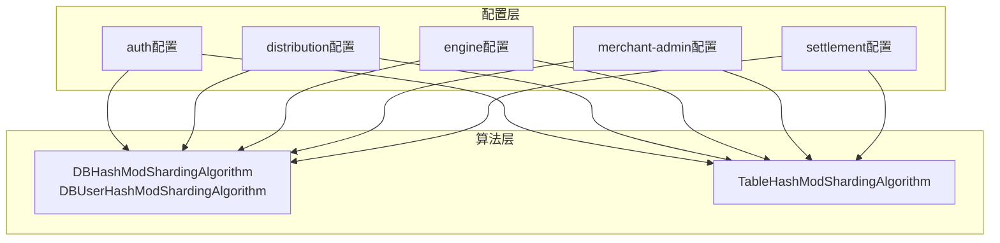
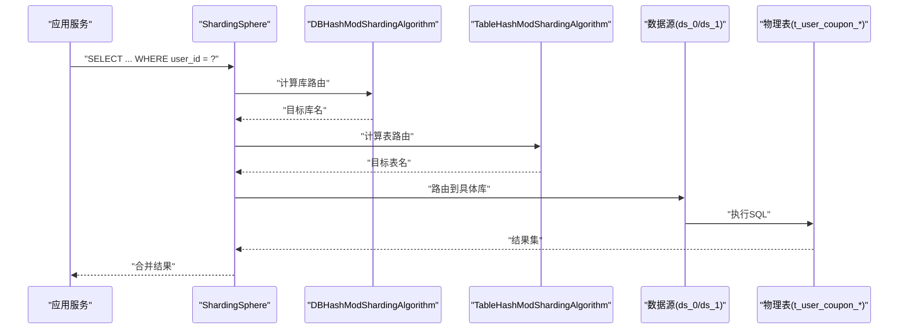
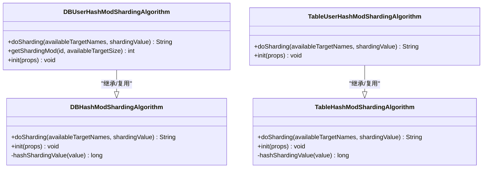

# 数据库分片策略

<cite>
**本文引用的文件**
- [auth\src\main\resources\shardingsphere-config-dev.yaml](file://auth\src\main\resources\shardingsphere-config-dev.yaml)
- [distribution\src\main\resources\shardingsphere-config-dev.yaml](file://distribution\src\main\resources\shardingsphere-config-dev.yaml)
- [engine\src\main\resources\shardingsphere-config-dev.yaml](file://engine\src\main\resources\shardingsphere-config-dev.yaml)
- [merchant-admin\src\main\resources\shardingsphere-config-dev.yaml](file://merchant-admin\src\main\resources\shardingsphere-config-dev.yaml)
- [settlement\src\main\resources\shardingsphere-config-dev.yaml](file://settlement\src\main\resources\shardingsphere-config-dev.yaml)
- [auth\src\main\java\com\fengxin\maplecoupon\auth\dao\sharding\DBUserHashModShardingAlgorithm.java](file://auth\src\main\java\com\fengxin\maplecoupon\auth\dao\sharding\DBUserHashModShardingAlgorithm.java)
- [auth\src\main\java\com\fengxin\maplecoupon\auth\dao\sharding\TableUserHashModShardingAlgorithm.java](file://auth\src\main\java\com\fengxin\maplecoupon\auth\dao\sharding\TableUserHashModShardingAlgorithm.java)
- [distribution\src\main\java\com\fengxin\maplecoupon\distribution\dao\sharding\DBHashModShardingAlgorithm.java](file://distribution\src\main\java\com\fengxin\maplecoupon\distribution\dao\sharding\DBHashModShardingAlgorithm.java)
- [distribution\src\main\java\com\fengxin\maplecoupon\distribution\dao\sharding\TableHashModShardingAlgorithm.java](file://distribution\src\main\java\com\fengxin\maplecoupon\distribution\dao\sharding\TableHashModShardingAlgorithm.java)
- [engine\src\main\java\com\fengxin\maplecoupon\engine\dao\sharding\DBHashModShardingAlgorithm.java](file://engine\src\main\java\com\fengxin\maplecoupon\engine\dao\sharding\DBHashModShardingAlgorithm.java)
- [engine\src\main\java\com\fengxin\maplecoupon\engine\dao\sharding\TableHashModShardingAlgorithm.java](file://engine\src\main\java\com\fengxin\maplecoupon\engine\dao\sharding\TableHashModShardingAlgorithm.java)
- [merchant-admin\src\main\java\com\fengxin\maplecoupon\merchantadmin\dao\sharding\DBHashModShardingAlgorithm.java](file://merchant-admin\src\main\java\com\fengxin\maplecoupon\merchantadmin\dao\sharding\DBHashModShardingAlgorithm.java)
- [merchant-admin\src\main\java\com\fengxin\maplecoupon\merchantadmin\dao\sharding\TableHashModShardingAlgorithm.java](file://merchant-admin\src\main\java\com\fengxin\maplecoupon\merchantadmin\dao\sharding\TableHashModShardingAlgorithm.java)
- [settlement\src\main\java\com\fengxin\maplecoupon\settlement\dao\sharding\DBHashModShardingAlgorithm.java](file://settlement\src\main\java\com\fengxin\maplecoupon\settlement\dao\sharding\DBHashModShardingAlgorithm.java)
- [settlement\src\main\java\com\fengxin\maplecoupon\settlement\dao\sharding\TableHashModShardingAlgorithm.java](file://settlement\src\main\java\com\fengxin\maplecoupon\settlement\dao\sharding\TableHashModShardingAlgorithm.java)
</cite>

## 目录
1. [简介](#简介)
2. [项目结构](#项目结构)
3. [核心组件](#核心组件)
4. [架构总览](#架构总览)
5. [详细组件分析](#详细组件分析)
6. [依赖关系分析](#依赖关系分析)
7. [性能考量](#性能考量)
8. [故障排查指南](#故障排查指南)
9. [结论](#结论)
10. [附录](#附录)

## 简介
本文件系统性梳理MapleCoupon在多模块中采用的数据库分片策略，围绕ShardingSphere配置与使用展开，重点覆盖以下方面：
- 分片规则与分片算法：库分片与表分片的配置方式、CLASS_BASED自定义算法的实现与差异
- 数据路由机制：如何根据分片键定位到具体的数据节点
- 自定义分片算法设计：DBHashModShardingAlgorithm与TableHashModShardingAlgorithm的实现原理与性能考量
- 分片键选择策略：用户ID、优惠券ID、用户名、店铺号等字段的取舍与影响
- 读写分离、负载均衡与故障转移：当前仓库未直接实现，建议的落地方案
- 扩容、迁移与一致性：容量规划、平滑扩容与数据迁移策略
- 性能提升与潜在问题：吞吐、延迟与跨库事务的权衡

## 项目结构
MapleCoupon按业务域拆分为多个子模块（auth、distribution、engine、merchant-admin、settlement），每个模块均独立配置了ShardingSphere分片规则，核心差异在于分片表、分片键与分片数量。

```mermaid
graph TB
subgraph "认证模块(auth)"
AUTH_CFG["auth/shardingsphere-config-dev.yaml"]
AUTH_DB["DBUserHashModShardingAlgorithm.java"]
AUTH_TBL["TableUserHashModShardingAlgorithm.java"]
end
subgraph "分发模块(distribution)"
DIST_CFG["distribution/shardingsphere-config-dev.yaml"]
DIST_DB["DBHashModShardingAlgorithm.java"]
DIST_TBL["TableHashModShardingAlgorithm.java"]
end
subgraph "引擎模块(engine)"
ENG_CFG["engine/shardingsphere-config-dev.yaml"]
ENG_DB["DBHashModShardingAlgorithm.java"]
ENG_TBL["TableHashModShardingAlgorithm.java"]
end
subgraph "商户管理(merchant-admin)"
MADM_CFG["merchant-admin/shardingsphere-config-dev.yaml"]
MADM_DB["DBHashModShardingAlgorithm.java"]
MADM_TBL["TableHashModShardingAlgorithm.java"]
end
subgraph "结算模块(settlement)"
SETT_CFG["settlement/shardingsphere-config-dev.yaml"]
SETT_DB["DBHashModShardingAlgorithm.java"]
SETT_TBL["TableHashModShardingAlgorithm.java"]
end
AUTH_CFG --> AUTH_DB
AUTH_CFG --> AUTH_TBL
DIST_CFG --> DIST_DB
DIST_CFG --> DIST_TBL
ENG_CFG --> ENG_DB
ENG_CFG --> ENG_TBL
MADM_CFG --> MADM_DB
MADM_CFG --> MADM_TBL
SETT_CFG --> SETT_DB
SETT_CFG --> SETT_TBL
```

图表来源
- [auth\src\main\resources\shardingsphere-config-dev.yaml:1-45](file://auth\src\main\resources\shardingsphere-config-dev.yaml#L1-L45)
- [distribution\src\main\resources\shardingsphere-config-dev.yaml:1-69](file://distribution\src\main\resources\shardingsphere-config-dev.yaml#L1-L69)
- [engine\src\main\resources\shardingsphere-config-dev.yaml:1-100](file://engine\src\main\resources\shardingsphere-config-dev.yaml#L1-L100)
- [merchant-admin\src\main\resources\shardingsphere-config-dev.yaml:1-59](file://merchant-admin\src\main\resources\shardingsphere-config-dev.yaml#L1-L59)
- [settlement\src\main\resources\shardingsphere-config-dev.yaml:1-100](file://settlement\src\main\resources\shardingsphere-config-dev.yaml#L1-L100)

章节来源
- [auth\src\main\resources\shardingsphere-config-dev.yaml:1-45](file://auth\src\main\resources\shardingsphere-config-dev.yaml#L1-L45)
- [distribution\src\main\resources\shardingsphere-config-dev.yaml:1-69](file://distribution\src\main\resources\shardingsphere-config-dev.yaml#L1-L69)
- [engine\src\main\resources\shardingsphere-config-dev.yaml:1-100](file://engine\src\main\resources\shardingsphere-config-dev.yaml#L1-L100)
- [merchant-admin\src\main\resources\shardingsphere-config-dev.yaml:1-59](file://merchant-admin\src\main\resources\shardingsphere-config-dev.yaml#L1-L59)
- [settlement\src\main\resources\shardingsphere-config-dev.yaml:1-100](file://settlement\src\main\resources\shardingsphere-config-dev.yaml#L1-L100)

## 核心组件
- ShardingSphere配置文件：定义数据源、分片表、actualDataNodes、分库/分表策略与分片算法映射
- 自定义分片算法：
  - DBHashModShardingAlgorithm：基于库分片，支持可配置分片总数与可用目标库数量的动态映射
  - TableHashModShardingAlgorithm：基于表分片，直接对可用表数量取模
  - DBUserHashModShardingAlgorithm：针对用户名字符串的库分片算法，用于auth模块

章节来源
- [auth\src\main\resources\shardingsphere-config-dev.yaml:17-45](file://auth\src\main\resources\shardingsphere-config-dev.yaml#L17-L45)
- [distribution\src\main\resources\shardingsphere-config-dev.yaml:17-69](file://distribution\src\main\resources\shardingsphere-config-dev.yaml#L17-L69)
- [engine\src\main\resources\shardingsphere-config-dev.yaml:17-100](file://engine\src\main\resources\shardingsphere-config-dev.yaml#L17-L100)
- [merchant-admin\src\main\resources\shardingsphere-config-dev.yaml:17-59](file://merchant-admin\src\main\resources\shardingsphere-config-dev.yaml#L17-L59)
- [settlement\src\main\resources\shardingsphere-config-dev.yaml:17-100](file://settlement\src\main\resources\shardingsphere-config-dev.yaml#L17-L100)

## 架构总览
下图展示ShardingSphere在各模块中的配置与算法映射关系，体现“库分片+表分片”的双层分片策略。

图表来源
- [auth\src\main\resources\shardingsphere-config-dev.yaml:18-42](file://auth\src\main\resources\shardingsphere-config-dev.yaml#L18-L42)
- [distribution\src\main\resources\shardingsphere-config-dev.yaml:18-65](file://distribution\src\main\resources\shardingsphere-config-dev.yaml#L18-L65)
- [engine\src\main\resources\shardingsphere-config-dev.yaml:18-97](file://engine\src\main\resources\shardingsphere-config-dev.yaml#L18-L97)
- [merchant-admin\src\main\resources\shardingsphere-config-dev.yaml:18-55](file://merchant-admin\src\main\resources\shardingsphere-config-dev.yaml#L18-L55)
- [settlement\src\main\resources\shardingsphere-config-dev.yaml:18-97](file://settlement\src\main\resources\shardingsphere-config-dev.yaml#L18-L97)

## 详细组件分析

### 分片规则与数据路由
- 数据源与实际节点
  - 各模块均配置两个逻辑数据源ds_0、ds_1，分别指向两套物理库one_coupon_0、one_coupon_1
  - actualDataNodes通过占位符生成物理表集合，如ds_${0..1}.t_user_coupon_${0..31}表示在两个库上按0..31生成32张表
- 分片策略
  - databaseStrategy：以shardingColumn为分片键，应用shardingAlgorithmName指定的库分片算法
  - tableStrategy：以shardingColumn为分片键，应用shardingAlgorithmName指定的表分片算法
- 路由流程
  - ShardingSphere根据SQL中的分片键计算值，调用对应算法得到目标库/表集合，再拼接为实际执行节点

章节来源
- [auth\src\main\resources\shardingsphere-config-dev.yaml:18-30](file://auth\src\main\resources\shardingsphere-config-dev.yaml#L18-L30)
- [distribution\src\main\resources\shardingsphere-config-dev.yaml:18-40](file://distribution\src\main\resources\shardingsphere-config-dev.yaml#L18-L40)
- [engine\src\main\resources\shardingsphere-config-dev.yaml:18-61](file://engine\src\main\resources\shardingsphere-config-dev.yaml#L18-L61)
- [merchant-admin\src\main\resources\shardingsphere-config-dev.yaml:18-41](file://merchant-admin\src\main\resources\shardingsphere-config-dev.yaml#L18-L41)
- [settlement\src\main\resources\shardingsphere-config-dev.yaml:18-61](file://settlement\src\main\resources\shardingsphere-config-dev.yaml#L18-L61)

### 自定义分片算法实现原理

#### DBHashModShardingAlgorithm（库分片）
- 设计要点
  - 接口：StandardShardingAlgorithm<T>，支持精确匹配与范围匹配
  - 初始化：从props读取sharding-count，校验非空
  - 计算：对分片键取绝对值哈希后对sharding-count取模；若当前可用目标库数小于sharding-count，则进一步除以比例，确保落在当前可用库集合内
- 复杂度与性能
  - 时间复杂度O(n)遍历目标库集合，n为可用库数量；空间复杂度O(1)
  - 哈希函数具备良好的分散性，有利于避免热点
- 适用场景
  - 需要与实际库数量解耦的库分片，便于后续扩容或缩容时保持路由稳定

章节来源
- [distribution\src\main\java\com\fengxin\maplecoupon\distribution\dao\sharding\DBHashModShardingAlgorithm.java:20-64](file://distribution\src\main\java\com\fengxin\maplecoupon\distribution\dao\sharding\DBHashModShardingAlgorithm.java#L20-L64)
- [engine\src\main\java\com\fengxin\maplecoupon\engine\dao\sharding\DBHashModShardingAlgorithm.java:21-70](file://engine\src\main\java\com\fengxin\maplecoupon\engine\dao\sharding\DBHashModShardingAlgorithm.java#L21-L70)
- [merchant-admin\src\main\java\com\fengxin\maplecoupon\merchantadmin\dao\sharding\DBHashModShardingAlgorithm.java:20-64](file://merchant-admin\src\main\java\com\fengxin\maplecoupon\merchantadmin\dao\sharding\DBHashModShardingAlgorithm.java#L20-L64)
- [settlement\src\main\java\com\fengxin\maplecoupon\settlement\dao\sharding\DBHashModShardingAlgorithm.java:21-70](file://settlement\src\main\java\com\fengxin\maplecoupon\settlement\dao\sharding\DBHashModShardingAlgorithm.java#L21-L70)

#### TableHashModShardingAlgorithm（表分片）
- 设计要点
  - 对分片键取绝对值哈希后直接对可用表数量取模
  - 适用于表数量固定且与业务规模匹配的场景
- 复杂度与性能
  - 时间复杂度O(n)遍历目标表集合，n为可用表数量；空间复杂度O(1)
- 适用场景
  - 表数量较多但无需额外比例映射的场景

章节来源
- [distribution\src\main\java\com\fengxin\maplecoupon\distribution\dao\sharding\TableHashModShardingAlgorithm.java:16-43](file://distribution\src\main\java\com\fengxin\maplecoupon\distribution\dao\sharding\TableHashModShardingAlgorithm.java#L16-L43)
- [engine\src\main\java\com\fengxin\maplecoupon\engine\dao\sharding\TableHashModShardingAlgorithm.java:16-43](file://engine\src\main\java\com\fengxin\maplecoupon\engine\dao\sharding\TableHashModShardingAlgorithm.java#L16-L43)
- [merchant-admin\src\main\java\com\fengxin\maplecoupon\merchantadmin\dao\sharding\TableHashModShardingAlgorithm.java:16-43](file://merchant-admin\src\main\java\com\fengxin\maplecoupon\merchantadmin\dao\sharding\TableHashModShardingAlgorithm.java#L16-L43)
- [settlement\src\main\java\com\fengxin\maplecoupon\settlement\dao\sharding\TableHashModShardingAlgorithm.java:16-43](file://settlement\src\main\java\com\fengxin\maplecoupon\settlement\dao\sharding\TableHashModShardingAlgorithm.java#L16-L43)

#### DBUserHashModShardingAlgorithm（用户名库分片，仅auth模块）
- 设计要点
  - 针对用户名字符串的库分片，与通用Long型算法一致，但用于用户表
  - 支持getShardingMod方法供内部工具类复用
- 适用场景
  - 用户表按用户名分库，结合表分片形成二维分片

章节来源
- [auth\src\main\java\com\fengxin\maplecoupon\auth\dao\sharding\DBUserHashModShardingAlgorithm.java:21-66](file://auth\src\main\java\com\fengxin\maplecoupon\auth\dao\sharding\DBUserHashModShardingAlgorithm.java#L21-L66)

#### TableUserHashModShardingAlgorithm（用户名表分片，仅auth模块）
- 设计要点
  - 针对用户名字符串的表分片，直接对可用表数量取模
- 适用场景
  - 用户表按用户名分表，与库分片共同实现二维路由

章节来源
- [auth\src\main\java\com\fengxin\maplecoupon\auth\dao\sharding\TableUserHashModShardingAlgorithm.java:17-42](file://auth\src\main\java\com\fengxin\maplecoupon\auth\dao\sharding\TableUserHashModShardingAlgorithm.java#L17-L42)

### 分片键选择策略
- 用户ID（user_id）
  - 场景：t_user_coupon、t_coupon_settlement等用户相关表
  - 优点：天然唯一、访问集中于个人维度
  - 注意：需关注用户活跃度是否导致热点
- 优惠券ID/模板ID
  - 场景：t_coupon_template、t_coupon_template_log等
  - 优点：面向业务实体，便于按模板维度聚合
  - 注意：模板生命周期长，可能产生冷热不均
- 店铺号（shop_number）
  - 场景：t_coupon_template、t_coupon_template_log等
  - 优点：与商户维度强关联，适合按商家隔离
  - 注意：需评估商家规模差异带来的数据倾斜
- 用户名（username）
  - 场景：auth模块用户表
  - 优点：全局唯一，便于按用户维度路由
  - 注意：用户名可能包含特殊字符，需统一清洗策略

章节来源
- [auth\src\main\resources\shardingsphere-config-dev.yaml:20-30](file://auth\src\main\resources\shardingsphere-config-dev.yaml#L20-L30)
- [distribution\src\main\resources\shardingsphere-config-dev.yaml:20-40](file://distribution\src\main\resources\shardingsphere-config-dev.yaml#L20-L40)
- [engine\src\main\resources\shardingsphere-config-dev.yaml:20-61](file://engine\src\main\resources\shardingsphere-config-dev.yaml#L20-L61)
- [merchant-admin\src\main\resources\shardingsphere-config-dev.yaml:20-41](file://merchant-admin\src\main\resources\shardingsphere-config-dev.yaml#L20-L41)
- [settlement\src\main\resources\shardingsphere-config-dev.yaml:20-61](file://settlement\src\main\resources\shardingsphere-config-dev.yaml#L20-L61)

### 查询路由示例（序列图）
以下序列图展示一次按用户ID的查询路由过程（以engine模块为例）：

图表来源
- [engine\src\main\resources\shardingsphere-config-dev.yaml:42-51](file://engine\src\main\resources\shardingsphere-config-dev.yaml#L42-L51)
- [engine\src\main\java\com\fengxin\maplecoupon\engine\dao\sharding\DBHashModShardingAlgorithm.java:29-42](file://engine\src\main\java\com\fengxin\maplecoupon\engine\dao\sharding\DBHashModShardingAlgorithm.java#L29-L42)
- [engine\src\main\java\com\fengxin\maplecoupon\engine\dao\sharding\TableHashModShardingAlgorithm.java:18-33](file://engine\src\main\java\com\fengxin\maplecoupon\engine\dao\sharding\TableHashModShardingAlgorithm.java#L18-L33)

## 依赖关系分析
- 组件耦合
  - 配置文件与算法类通过algorithmClassName绑定，耦合点明确
  - 不同模块共享相同算法类名，但各自模块内实现独立，降低跨模块耦合
- 可能的循环依赖
  - 当前结构为配置-算法单向依赖，未见循环
- 外部依赖
  - ShardingSphere标准接口与异常处理
  - Hutool Singleton（部分模块）

图表来源
- [auth\src\main\java\com\fengxin\maplecoupon\auth\dao\sharding\DBUserHashModShardingAlgorithm.java:21-66](file://auth\src\main\java\com\fengxin\maplecoupon\auth\dao\sharding\DBUserHashModShardingAlgorithm.java#L21-L66)
- [auth\src\main\java\com\fengxin\maplecoupon\auth\dao\sharding\TableUserHashModShardingAlgorithm.java:17-42](file://auth\src\main\java\com\fengxin\maplecoupon\auth\dao\sharding\TableUserHashModShardingAlgorithm.java#L17-L42)
- [distribution\src\main\java\com\fengxin\maplecoupon\distribution\dao\sharding\DBHashModShardingAlgorithm.java:20-64](file://distribution\src\main\java\com\fengxin\maplecoupon\distribution\dao\sharding\DBHashModShardingAlgorithm.java#L20-L64)
- [distribution\src\main\java\com\fengxin\maplecoupon\distribution\dao\sharding\TableHashModShardingAlgorithm.java:16-43](file://distribution\src\main\java\com\fengxin\maplecoupon\distribution\dao\sharding\TableHashModShardingAlgorithm.java#L16-L43)

章节来源
- [auth\src\main\java\com\fengxin\maplecoupon\auth\dao\sharding\DBUserHashModShardingAlgorithm.java:21-66](file://auth\src\main\java\com\fengxin\maplecoupon\auth\dao\sharding\DBUserHashModShardingAlgorithm.java#L21-L66)
- [auth\src\main\java\com\fengxin\maplecoupon\auth\dao\sharding\TableUserHashModShardingAlgorithm.java:17-42](file://auth\src\main\java\com\fengxin\maplecoupon\auth\dao\sharding\TableUserHashModShardingAlgorithm.java#L17-L42)
- [distribution\src\main\java\com\fengxin\maplecoupon\distribution\dao\sharding\DBHashModShardingAlgorithm.java:20-64](file://distribution\src\main\java\com\fengxin\maplecoupon\distribution\dao\sharding\DBHashModShardingAlgorithm.java#L20-L64)
- [distribution\src\main\java\com\fengxin\maplecoupon\distribution\dao\sharding\TableHashModShardingAlgorithm.java:16-43](file://distribution\src\main\java\com\fengxin\maplecoupon\distribution\dao\sharding\TableHashModShardingAlgorithm.java#L16-L43)

## 性能考量
- 哈希分片的优势
  - 均匀分布：哈希函数减少热点，提升并发能力
  - O(1)计算：路由决策快速，降低网关延迟
- 潜在问题
  - 冷热不均：用户ID或模板ID分布不均可能导致某些库/表压力大
  - 跨库事务：ShardingSphere默认不支持分布式事务，需业务补偿或最终一致性
- 优化策略
  - 分片键选择：优先选择高基数、低倾斜的字段
  - 分片数量：按预期QPS与单表容量反推，预留扩容余量
  - 读写分离：通过逻辑库/只读副本实现（见下一节）
  - 缓存与异步：热点数据缓存、批量写入与消息队列削峰

## 故障排查指南
- 常见错误
  - 分片算法初始化失败：检查sharding-count是否配置且可解析
  - 无目标库/表：确认availableTargetNames与分片键哈希映射是否正确
  - SQL未命中分片键：ShardingSphere会广播执行，需检查SQL条件
- 定位手段
  - 开启sql-show查看真实执行SQL
  - 在算法中增加日志输出，记录分片键与计算过程
  - 使用DBHashModShardingAlgorithm提供的getShardingMod辅助验证

章节来源
- [auth\src\main\resources\shardingsphere-config-dev.yaml:43-45](file://auth\src\main\resources\shardingsphere-config-dev.yaml#L43-L45)
- [distribution\src\main\resources\shardingsphere-config-dev.yaml:67-69](file://distribution\src\main\resources\shardingsphere-config-dev.yaml#L67-L69)
- [engine\src\main\resources\shardingsphere-config-dev.yaml:99-100](file://engine\src\main\resources\shardingsphere-config-dev.yaml#L99-L100)
- [merchant-admin\src\main\resources\shardingsphere-config-dev.yaml:57-59](file://merchant-admin\src\main\resources\shardingsphere-config-dev.yaml#L57-L59)
- [settlement\src\main\resources\shardingsphere-config-dev.yaml:99-100](file://settlement\src\main\resources\shardingsphere-config-dev.yaml#L99-L100)

## 结论
MapleCoupon在多模块中统一采用了“库分片+表分片”的CLASS_BASED自定义算法方案，通过哈希与比例映射实现了稳定的路由与较好的扩展性。结合合理的分片键选择与容量规划，可在高并发场景下获得显著的吞吐提升。对于读写分离、负载均衡与故障转移，当前仓库未直接实现，建议在网关层或数据库代理层引入相应机制，并配合监控与告警体系保障稳定性。

## 附录

### 分片键与表映射概览
- auth模块
  - 表：coupon_user
  - 分片键：username
  - 库分片：ds_${0..1}
  - 表分片：coupon_user_${0..15}

- distribution模块
  - 表：t_coupon_template、t_user_coupon
  - 分片键：shop_number、user_id
  - 库分片：ds_${0..1}
  - 表分片：t_coupon_template_${0..15}、t_user_coupon_${0..31}

- engine模块
  - 表：t_coupon_template、t_coupon_template_log、t_user_coupon、t_coupon_settlement
  - 分片键：shop_number、user_id
  - 库分片：ds_${0..1}
  - 表分片：t_coupon_template_${0..15}、t_user_coupon_${0..31}、t_coupon_settlement_${0..15}

- merchant-admin模块
  - 表：t_coupon_template、t_coupon_template_log
  - 分片键：shop_number
  - 库分片：ds_${0..1}
  - 表分片：t_coupon_template_${0..15}

- settlement模块
  - 表：t_coupon_template、t_user_coupon、t_coupon_settlement
  - 分片键：shop_number、user_id
  - 库分片：ds_${0..1}
  - 表分片：t_coupon_template_${0..15}、t_user_coupon_${0..31}、t_coupon_settlement_${0..15}

章节来源
- [auth\src\main\resources\shardingsphere-config-dev.yaml:18-30](file://auth\src\main\resources\shardingsphere-config-dev.yaml#L18-L30)
- [distribution\src\main\resources\shardingsphere-config-dev.yaml:18-40](file://distribution\src\main\resources\shardingsphere-config-dev.yaml#L18-L40)
- [engine\src\main\resources\shardingsphere-config-dev.yaml:18-61](file://engine\src\main\resources\shardingsphere-config-dev.yaml#L18-L61)
- [merchant-admin\src\main\resources\shardingsphere-config-dev.yaml:18-41](file://merchant-admin\src\main\resources\shardingsphere-config-dev.yaml#L18-L41)
- [settlement\src\main\resources\shardingsphere-config-dev.yaml:18-61](file://settlement\src\main\resources\shardingsphere-config-dev.yaml#L18-L61)

### 读写分离、负载均衡与故障转移（建议方案）
- 读写分离
  - 主库写入、从库读取；通过逻辑库名区分主从
  - 仅对查询语句路由至只读副本，写操作路由至主库
- 负载均衡
  - 在ShardingSphere之上部署数据库代理（如Proxy），实现连接池与负载均衡
  - 或在应用侧使用连接池的多数据源轮询
- 故障转移
  - 健康检查与自动摘除失败实例
  - 读写分离场景下，故障切换应保证主库可用性优先

[本节为概念性建议，不直接分析具体代码文件]

### 扩容、迁移与一致性（建议方案）
- 扩容
  - 增加分片数量：调整sharding-count与actualDataNodes，保持比例映射不变
  - 平滑迁移：先扩容物理库/表，再调整配置，最后重路由
- 迁移
  - 使用ETL或双写+对账工具，逐步迁移历史数据
  - 迁移期间保留旧表，新旧并行一段时间
- 一致性
  - 无分布式事务：采用幂等设计、补偿机制与最终一致性
  - 读写分离：写主库后等待复制延迟满足需求，或在查询端强制走主库

[本节为概念性建议，不直接分析具体代码文件]