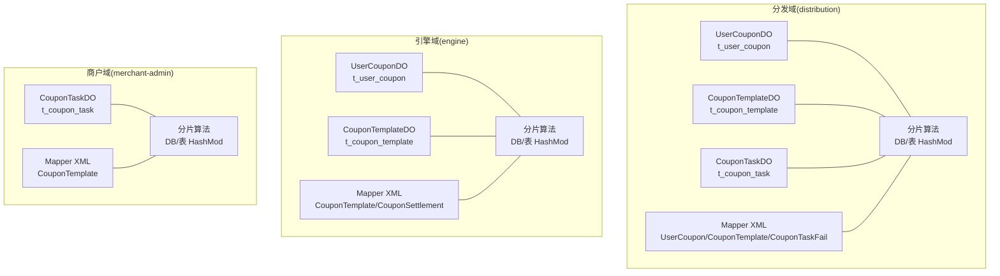
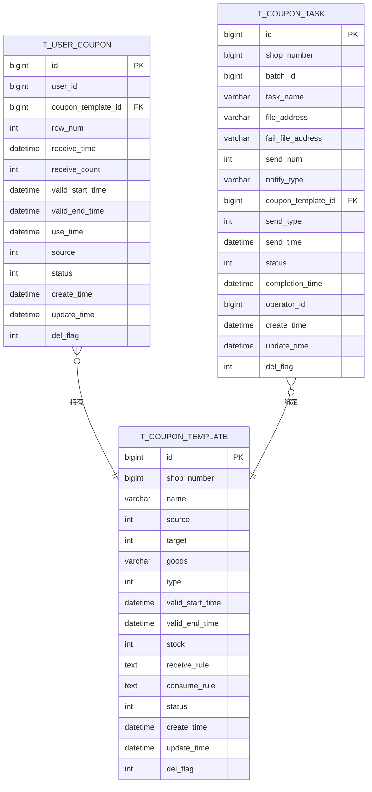
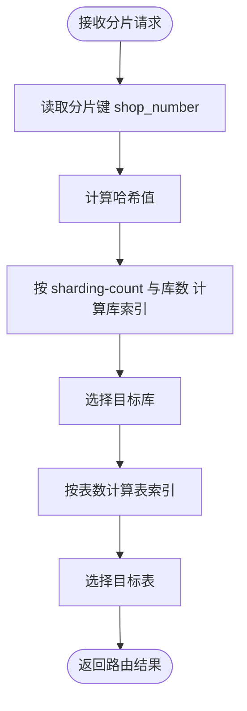
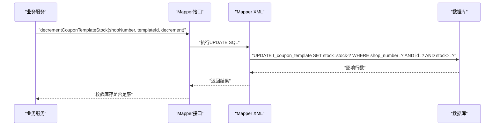
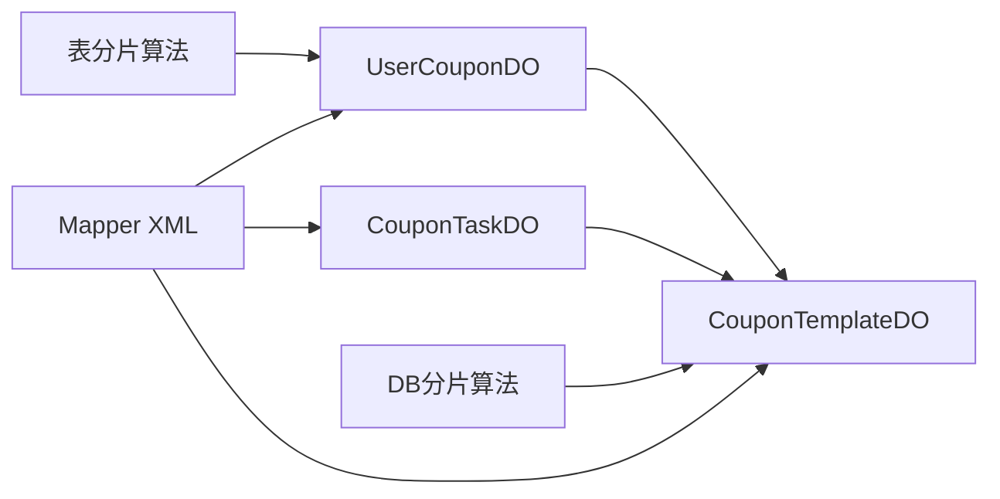

# 数据库设计

<cite>
**本文引用的文件**   
- [UserCouponDO.java](file://distribution/src/main/java/com/fengxin/maplecoupon/distribution/dao/entity/UserCouponDO.java)
- [CouponTemplateDO.java](file://distribution/src/main/java/com/fengxin/maplecoupon/distribution/dao/entity/CouponTemplateDO.java)
- [CouponTaskDO.java](file://distribution/src/main/java/com/fengxin/maplecoupon/distribution/dao/entity/CouponTaskDO.java)
- [UserCouponDO.java](file://engine/src/main/java/com/fengxin/maplecoupon/engine/dao/entity/UserCouponDO.java)
- [CouponTemplateDO.java](file://engine/src/main/java/com/fengxin/maplecoupon/engine/dao/entity/CouponTemplateDO.java)
- [CouponTaskDO.java](file://merchant-admin/src/main/java/com/fengxin/maplecoupon/merchantadmin/dao/entity/CouponTaskDO.java)
- [DBHashModShardingAlgorithm.java（distribution）](file://distribution/src/main/java/com/fengxin/maplecoupon/distribution/dao/sharding/DBHashModShardingAlgorithm.java)
- [TableHashModShardingAlgorithm.java（distribution）](file://distribution/src/main/java/com/fengxin/maplecoupon/distribution/dao/sharding/TableHashModShardingAlgorithm.java)
- [DBHashModShardingAlgorithm.java（engine）](file://engine/src/main/java/com/fengxin/maplecoupon/engine/dao/sharding/DBHashModShardingAlgorithm.java)
- [TableHashModShardingAlgorithm.java（engine）](file://engine/src/main/java/com/fengxin/maplecoupon/engine/dao/sharding/TableHashModShardingAlgorithm.java)
- [DBHashModShardingAlgorithm.java（merchant-admin）](file://merchant-admin/src/main/java/com/fengxin/maplecoupon/merchantadmin/dao/sharding/DBHashModShardingAlgorithm.java)
- [TableHashModShardingAlgorithm.java（merchant-admin）](file://merchant-admin/src/main/java/com/fengxin/maplecoupon/merchantadmin/dao/sharding/TableHashModShardingAlgorithm.java)
- [UserCouponMapper.xml](file://distribution/src/main/resources/mapper/UserCouponMapper.xml)
- [CouponTemplateMapper.xml（distribution）](file://distribution/src/main/resources/mapper/CouponTemplateMapper.xml)
- [CouponTaskFailMapper.xml](file://distribution/src/main/resources/mapper/CouponTaskFailMapper.xml)
- [CouponTemplateMapper.xml（engine）](file://engine/src/main/resources/mapper/CouponTemplateMapper.xml)
- [CouponSettlementMapper.xml](file://engine/src/main/resources/mapper/CouponSettlementMapper.xml)
- [CouponTemplateMapper.xml（merchant-admin）](file://merchant-admin/src/main/resources/mapper/CouponTemplateMapper.xml)
- [application.yaml（auth）](file://auth/src/main/resources/application.yaml)
- [application.yaml（distribution）](file://distribution/src/main/resources/application.yaml)
- [application.yaml（engine）](file://engine/src/main/resources/application.yaml)
- [application.yaml（merchant-admin）](file://merchant-admin/src/main/resources/application.yaml)
- [shardingsphere-config-dev.yaml（auth）](file://auth/src/main/resources/shardingsphere-config-dev.yaml)
- [shardingsphere-config-dev.yaml（distribution）](file://distribution/src/main/resources/shardingsphere-config-dev.yaml)
- [shardingsphere-config-dev.yaml（engine）](file://engine/src/main/resources/shardingsphere-config-dev.yaml)
- [shardingsphere-config-dev.yaml（merchant-admin）](file://merchant-admin/src/main/resources/shardingsphere-config-dev.yaml)
</cite>

## 目录
1. [简介](#简介)
2. [项目结构](#项目结构)
3. [核心组件](#核心组件)
4. [架构总览](#架构总览)
5. [详细组件分析](#详细组件分析)
6. [依赖分析](#依赖分析)
7. [性能考量](#性能考量)
8. [故障排查指南](#故障排查指南)
9. [结论](#结论)
10. [附录](#附录)

## 简介
本文件面向MapleCoupon系统的数据库设计与实现，聚焦于核心数据模型（用户优惠券、优惠券模板、优惠券任务）的字段定义与关系设计；系统采用ShardingSphere进行数据库与表的水平分片，结合自定义分片算法实现更均衡的数据分布；在MyBatis-Plus层面，通过实体类注解与XML映射实现ORM与动态SQL；同时给出索引设计策略、ER图、分页与批量写入实践、Lua脚本优化、连接池与事务管理建议，以及迁移与监控要点。

## 项目结构
MapleCoupon按功能域拆分为多个子模块，数据库访问层集中在各模块的dao与resources/mapper目录中，分片配置位于各模块的shardingsphere-config-*.yaml中，应用配置位于application-*.yaml中。核心数据模型在各模块中保持一致的实体定义，确保跨服务的一致性。

**图表来源**
- [UserCouponDO.java:23-96](file://distribution/src/main/java/com/fengxin/maplecoupon/distribution/dao/entity/UserCouponDO.java#L23-L96)
- [CouponTemplateDO.java:23-106](file://distribution/src/main/java/com/fengxin/maplecoupon/distribution/dao/entity/CouponTemplateDO.java#L23-L106)
- [CouponTaskDO.java:23-112](file://distribution/src/main/java/com/fengxin/maplecoupon/distribution/dao/entity/CouponTaskDO.java#L23-L112)
- [DBHashModShardingAlgorithm.java（distribution）:20-43](file://distribution/src/main/java/com/fengxin/maplecoupon/distribution/dao/sharding/DBHashModShardingAlgorithm.java#L20-L43)
- [TableHashModShardingAlgorithm.java（distribution）:16-33](file://distribution/src/main/java/com/fengxin/maplecoupon/distribution/dao/sharding/TableHashModShardingAlgorithm.java#L16-L33)
- [UserCouponMapper.xml:5-39](file://distribution/src/main/resources/mapper/UserCouponMapper.xml#L5-L39)
- [CouponTemplateMapper.xml（distribution）:5-23](file://distribution/src/main/resources/mapper/CouponTemplateMapper.xml#L5-L23)
- [CouponTaskFailMapper.xml:5-17](file://distribution/src/main/resources/mapper/CouponTaskFailMapper.xml#L5-L17)

**章节来源**
- [application.yaml（distribution）](file://distribution/src/main/resources/application.yaml)
- [application.yaml（engine）](file://engine/src/main/resources/application.yaml)
- [application.yaml（merchant-admin）](file://merchant-admin/src/main/resources/application.yaml)
- [application.yaml（auth）](file://auth/src/main/resources/application.yaml)

## 核心组件
本节梳理三类核心实体及其字段语义、约束与业务规则，并总结分片键选择与一致性要求。

- 用户优惠券（t_user_coupon）
  - 关键字段：用户ID、模板ID、有效期、来源、状态、行号、领取/使用时间、软删标志
  - 主键：自增ID
  - 分片键：shop_number（模板维度）或用户维度（视具体业务路由）
  - 约束与规则：状态枚举化；有效期与使用时间用于核销校验；del_flag支持逻辑删除
  - 业务规则：状态流转（未用/锁定/已用/过期/撤回）；同一用户对同模板的领取次数限制（如需）

- 优惠券模板（t_coupon_template）
  - 关键字段：店铺编号、名称、来源（平台/店铺）、目标（商品专属/全店通用）、优惠类型、有效期、库存、领取/消耗规则、状态、软删标志
  - 主键：自增ID
  - 分片键：shop_number（模板维度）
  - 约束与规则：库存扣减需满足“>=扣减数”；状态为生效中时才可被核销
  - 业务规则：库存与发行量管理；规则JSON字段用于前端/引擎侧解析

- 优惠券任务（t_coupon_task）
  - 关键字段：批次ID、任务名、文件地址、失败文件地址、发放数量、通知方式、模板ID、发送类型（立即/定时）、发送时间、状态、完成时间、操作人、软删标志
  - 主键：自增ID
  - 分片键：shop_number（任务维度）
  - 约束与规则：状态机（待执行/执行中/失败/成功/取消）；定时任务基于send_time调度
  - 业务规则：批量导入与回执；失败用户导出；通知方式可多选组合

**章节来源**
- [UserCouponDO.java:24-96](file://distribution/src/main/java/com/fengxin/maplecoupon/distribution/dao/entity/UserCouponDO.java#L24-L96)
- [CouponTemplateDO.java:24-106](file://distribution/src/main/java/com/fengxin/maplecoupon/distribution/dao/entity/CouponTemplateDO.java#L24-L106)
- [CouponTaskDO.java:24-112](file://distribution/src/main/java/com/fengxin/maplecoupon/distribution/dao/entity/CouponTaskDO.java#L24-L112)

## 架构总览
下图展示数据库层与各业务域的交互关系，包括实体、分片算法与Mapper/XML映射。

```mermaid
graph TB
subgraph "数据库层"
T1["t_user_coupon"]
T2["t_coupon_template"]
T3["t_coupon_task"]
T4["t_coupon_settlement_*引擎"]
end
subgraph "分发域(distribution)"
UC1["UserCouponDO"]
CT1["CouponTemplateDO"]
CTASK1["CouponTaskDO"]
SA_DB1["DBHashModShardingAlgorithm"]
SA_TBL1["TableHashModShardingAlgorithm"]
MAP1["UserCouponMapper.xml / CouponTemplateMapper.xml / CouponTaskFailMapper.xml"]
end
subgraph "引擎域(engine)"
UC2["UserCouponDO"]
CT2["CouponTemplateDO"]
MAP2["CouponTemplateMapper.xml / CouponSettlementMapper.xml"]
SA_DB2["DBHashModShardingAlgorithm"]
SA_TBL2["TableHashModShardingAlgorithm"]
end
subgraph "商户域(merchant-admin)"
CTASK3["CouponTaskDO"]
MAP3["CouponTemplateMapper.xml"]
SA_DB3["DBHashModShardingAlgorithm"]
SA_TBL3["TableHashModShardingAlgorithm"]
end
UC1 --> T1
CT1 --> T2
CTASK1 --> T3
MAP1 --> T1
MAP1 --> T2
MAP1 --> T3
MAP2 --> T2
MAP2 --> T4
MAP3 --> T2
SA_DB1 --> T2
SA_TBL1 --> T1
SA_DB2 --> T2
SA_TBL2 --> T1
SA_DB3 --> T3
SA_TBL3 --> T3
```

**图表来源**
- [UserCouponDO.java:23-96](file://distribution/src/main/java/com/fengxin/maplecoupon/distribution/dao/entity/UserCouponDO.java#L23-L96)
- [CouponTemplateDO.java:23-106](file://distribution/src/main/java/com/fengxin/maplecoupon/distribution/dao/entity/CouponTemplateDO.java#L23-L106)
- [CouponTaskDO.java:23-112](file://distribution/src/main/java/com/fengxin/maplecoupon/distribution/dao/entity/CouponTaskDO.java#L23-L112)
- [DBHashModShardingAlgorithm.java（distribution）:20-43](file://distribution/src/main/java/com/fengxin/maplecoupon/distribution/dao/sharding/DBHashModShardingAlgorithm.java#L20-L43)
- [TableHashModShardingAlgorithm.java（distribution）:16-33](file://distribution/src/main/java/com/fengxin/maplecoupon/distribution/dao/sharding/TableHashModShardingAlgorithm.java#L16-L33)
- [UserCouponMapper.xml:5-39](file://distribution/src/main/resources/mapper/UserCouponMapper.xml#L5-L39)
- [CouponTemplateMapper.xml（distribution）:5-23](file://distribution/src/main/resources/mapper/CouponTemplateMapper.xml#L5-L23)
- [CouponTaskFailMapper.xml:5-17](file://distribution/src/main/resources/mapper/CouponTaskFailMapper.xml#L5-L17)
- [CouponTemplateMapper.xml（engine）:5-15](file://engine/src/main/resources/mapper/CouponTemplateMapper.xml#L5-L15)
- [CouponSettlementMapper.xml:3-19](file://engine/src/main/resources/mapper/CouponSettlementMapper.xml#L3-L19)
- [CouponTemplateMapper.xml（merchant-admin）:5-14](file://merchant-admin/src/main/resources/mapper/CouponTemplateMapper.xml#L5-L14)

## 详细组件分析

### 实体与ER关系
- 实体映射
  - UserCouponDO：对应t_user_coupon，承载用户持有优惠券的生命周期与状态
  - CouponTemplateDO：对应t_coupon_template，承载模板级规则与库存
  - CouponTaskDO：对应t_coupon_task，承载任务派发与回执
- ER关系
  - t_user_coupon.coupon_template_id → t_coupon_template.id
  - t_coupon_task.shop_number 与 t_coupon_template.shop_number 用于分片路由一致性
  - t_coupon_settlement_* 由引擎域维护，记录结算关联信息

**图表来源**
- [UserCouponDO.java:24-96](file://distribution/src/main/java/com/fengxin/maplecoupon/distribution/dao/entity/UserCouponDO.java#L24-L96)
- [CouponTemplateDO.java:24-106](file://distribution/src/main/java/com/fengxin/maplecoupon/distribution/dao/entity/CouponTemplateDO.java#L24-L106)
- [CouponTaskDO.java:24-112](file://distribution/src/main/java/com/fengxin/maplecoupon/distribution/dao/entity/CouponTaskDO.java#L24-L112)

**章节来源**
- [UserCouponDO.java:24-96](file://distribution/src/main/java/com/fengxin/maplecoupon/distribution/dao/entity/UserCouponDO.java#L24-L96)
- [CouponTemplateDO.java:24-106](file://distribution/src/main/java/com/fengxin/maplecoupon/distribution/dao/entity/CouponTemplateDO.java#L24-L106)
- [CouponTaskDO.java:24-112](file://distribution/src/main/java/com/fengxin/maplecoupon/distribution/dao/entity/CouponTaskDO.java#L24-L112)

### 分片策略与路由
- 自定义分片算法
  - 数据库分片（DBHashModShardingAlgorithm）：以shop_number为分片键，先做哈希，再按配置的sharding-count与可用库数计算最终库索引，缓解不均匀分布
  - 表分片（TableHashModShardingAlgorithm）：以shop_number为分片键，直接按表数量取模，保证同shop_number落到同表
- 路由规则
  - 模板维度：优先按shop_number路由至对应库与表，确保模板与任务、用户券的强一致性
  - 任务维度：同模板维度，确保任务与模板在同一库表
  - 引擎域：用户券与模板均按相同规则路由，保证核销链路一致性
- 性能优化
  - 通过sharding-count与库/表数量的整除关系，降低热点与倾斜
  - 精确路由（PreciseShardingValue）覆盖高频查询，避免范围扫描

**图表来源**
- [DBHashModShardingAlgorithm.java（distribution）:28-43](file://distribution/src/main/java/com/fengxin/maplecoupon/distribution/dao/sharding/DBHashModShardingAlgorithm.java#L28-L43)
- [TableHashModShardingAlgorithm.java（distribution）:18-33](file://distribution/src/main/java/com/fengxin/maplecoupon/distribution/dao/sharding/TableHashModShardingAlgorithm.java#L18-L33)
- [DBHashModShardingAlgorithm.java（engine）:29-42](file://engine/src/main/java/com/fengxin/maplecoupon/engine/dao/sharding/DBHashModShardingAlgorithm.java#L29-L42)
- [TableHashModShardingAlgorithm.java（engine）:18-33](file://engine/src/main/java/com/fengxin/maplecoupon/engine/dao/sharding/TableHashModShardingAlgorithm.java#L18-L33)
- [DBHashModShardingAlgorithm.java（merchant-admin）:28-42](file://merchant-admin/src/main/java/com/fengxin/maplecoupon/merchantadmin/dao/sharding/DBHashModShardingAlgorithm.java#L28-L42)
- [TableHashModShardingAlgorithm.java（merchant-admin）:18-33](file://merchant-admin/src/main/java/com/fengxin/maplecoupon/merchantadmin/dao/sharding/TableHashModShardingAlgorithm.java#L18-L33)

**章节来源**
- [DBHashModShardingAlgorithm.java（distribution）:20-64](file://distribution/src/main/java/com/fengxin/maplecoupon/distribution/dao/sharding/DBHashModShardingAlgorithm.java#L20-L64)
- [TableHashModShardingAlgorithm.java（distribution）:16-44](file://distribution/src/main/java/com/fengxin/maplecoupon/distribution/dao/sharding/TableHashModShardingAlgorithm.java#L16-L44)
- [DBHashModShardingAlgorithm.java（engine）:21-70](file://engine/src/main/java/com/fengxin/maplecoupon/engine/dao/sharding/DBHashModShardingAlgorithm.java#L21-L70)
- [TableHashModShardingAlgorithm.java（engine）:16-44](file://engine/src/main/java/com/fengxin/maplecoupon/engine/dao/sharding/TableHashModShardingAlgorithm.java#L16-L44)
- [DBHashModShardingAlgorithm.java（merchant-admin）:20-64](file://merchant-admin/src/main/java/com/fengxin/maplecoupon/merchantadmin/dao/sharding/DBHashModShardingAlgorithm.java#L20-L64)
- [TableHashModShardingAlgorithm.java（merchant-admin）:16-44](file://merchant-admin/src/main/java/com/fengxin/maplecoupon/merchantadmin/dao/sharding/TableHashModShardingAlgorithm.java#L16-L44)

### 索引设计策略
- 主键索引
  - t_user_coupon.id、t_coupon_template.id、t_coupon_task.id：唯一标识，支撑精确查询与外键关联
- 复合索引
  - t_user_coupon(coupon_template_id, status, del_flag)：核销/查询常用组合
  - t_user_coupon(user_id, coupon_template_id)：用户券去重与快速定位
  - t_coupon_template(shop_number, status, del_flag)：模板维度查询与库存校验
  - t_coupon_task(shop_number, status, send_time)：任务调度与状态查询
- 查询优化索引
  - t_user_coupon(valid_start_time, valid_end_time, status)：有效期与状态过滤
  - t_user_coupon(use_time)：核销统计与报表
  - t_coupon_template(stock)：库存校验前置
- 选择原则
  - 优先覆盖高频WHERE/JOIN/GROUP BY列
  - 避免冗余索引，定期评估索引使用率
  - 对热点字段建立前缀索引，减少回表

### MyBatis-Plus使用方式
- 实体映射
  - 通过@TableName与@TableField注解映射表与字段，统一填充create_time/update_time/del_flag
- 动态SQL
  - 批量插入：UserCouponMapper.xml的batchSaveUserCouponList，一次性写入多条用户券
  - 库存变更：CouponTemplateMapper.xml的decrement/incrementCouponTemplateStock，带shop_number与库存校验
  - 失败记录：CouponTaskFailMapper.xml的insertBatch，批量落盘失败用户
- 分页查询
  - 使用IPage/Page参数，结合分片键进行路由，避免全局排序
- Lua脚本优化
  - 在引擎域与分发域存在Lua脚本文件，用于原子化扣减库存与批量保存用户券记录，降低锁竞争与网络往返

**图表来源**
- [CouponTemplateMapper.xml（distribution）:7-13](file://distribution/src/main/resources/mapper/CouponTemplateMapper.xml#L7-L13)
- [CouponTemplateMapper.xml（engine）:6-14](file://engine/src/main/resources/mapper/CouponTemplateMapper.xml#L6-L14)

**章节来源**
- [UserCouponMapper.xml:6-39](file://distribution/src/main/resources/mapper/UserCouponMapper.xml#L6-L39)
- [CouponTemplateMapper.xml（distribution）:6-23](file://distribution/src/main/resources/mapper/CouponTemplateMapper.xml#L6-L23)
- [CouponTaskFailMapper.xml:6-17](file://distribution/src/main/resources/mapper/CouponTaskFailMapper.xml#L6-L17)
- [CouponTemplateMapper.xml（engine）:6-14](file://engine/src/main/resources/mapper/CouponTemplateMapper.xml#L6-L14)
- [CouponSettlementMapper.xml:4-18](file://engine/src/main/resources/mapper/CouponSettlementMapper.xml#L4-L18)

### 数据迁移策略
- 结构迁移
  - 使用逻辑删除字段（del_flag）与版本号字段（如需）进行平滑演进
  - 先添加新列并补全默认值，再更新业务逻辑，最后回收旧列
- 数据迁移
  - 分批迁移：按shop_number分桶，逐桶迁移并校验一致性
  - 双写校验：迁移期间双写新旧表，比对统计口径
- 回滚策略
  - 基于时间点快照与binlog回放，结合逻辑删除回滚

### 备份与恢复
- 备份
  - 全量+增量备份：每日全备+归档binlog
  - 跨机房同步：主从复制或Galera集群
- 恢复
  - RPO/RTO目标明确：基于binlog的点式恢复
  - 验证恢复：抽样校验关键表与业务流程

### 性能监控指标
- 查询类
  - QPS/TPS、P99延迟、慢查询数、未命中索引率
- 写入类
  - 写入延迟、批量大小、冲突重试率、死锁次数
- 存储类
  - 磁盘IO、表膨胀率、索引碎片率、缓存命中率
- 分片类
  - 各库/表负载均衡度、热点分片识别、路由命中率

## 依赖分析
- 组件耦合
  - UserCouponDO与CouponTemplateDO强关联，必须在同一库/表路由下
  - CouponTaskDO与CouponTemplateDO绑定，确保任务与模板一致性
- 外部依赖
  - ShardingSphere分片框架与自定义算法
  - MyBatis-Plus ORM与XML映射
  - 连接池（HikariCP/Druid）与事务管理（Spring声明式事务）
- 循环依赖
  - 当前结构无循环依赖，实体仅单向引用

**图表来源**
- [UserCouponDO.java:24-96](file://distribution/src/main/java/com/fengxin/maplecoupon/distribution/dao/entity/UserCouponDO.java#L24-L96)
- [CouponTemplateDO.java:24-106](file://distribution/src/main/java/com/fengxin/maplecoupon/distribution/dao/entity/CouponTemplateDO.java#L24-L106)
- [CouponTaskDO.java:24-112](file://distribution/src/main/java/com/fengxin/maplecoupon/distribution/dao/entity/CouponTaskDO.java#L24-L112)
- [DBHashModShardingAlgorithm.java（distribution）:20-43](file://distribution/src/main/java/com/fengxin/maplecoupon/distribution/dao/sharding/DBHashModShardingAlgorithm.java#L20-L43)
- [TableHashModShardingAlgorithm.java（distribution）:16-33](file://distribution/src/main/java/com/fengxin/maplecoupon/distribution/dao/sharding/TableHashModShardingAlgorithm.java#L16-L33)
- [UserCouponMapper.xml:5-39](file://distribution/src/main/resources/mapper/UserCouponMapper.xml#L5-L39)
- [CouponTemplateMapper.xml（distribution）:5-23](file://distribution/src/main/resources/mapper/CouponTemplateMapper.xml#L5-L23)
- [CouponTaskFailMapper.xml:5-17](file://distribution/src/main/resources/mapper/CouponTaskFailMapper.xml#L5-L17)

**章节来源**
- [DBHashModShardingAlgorithm.java（distribution）:20-64](file://distribution/src/main/java/com/fengxin/maplecoupon/distribution/dao/sharding/DBHashModShardingAlgorithm.java#L20-L64)
- [TableHashModShardingAlgorithm.java（distribution）:16-44](file://distribution/src/main/java/com/fengxin/maplecoupon/distribution/dao/sharding/TableHashModShardingAlgorithm.java#L16-L44)
- [UserCouponMapper.xml:5-39](file://distribution/src/main/resources/mapper/UserCouponMapper.xml#L5-L39)
- [CouponTemplateMapper.xml（distribution）:5-23](file://distribution/src/main/resources/mapper/CouponTemplateMapper.xml#L5-L23)
- [CouponTaskFailMapper.xml:5-17](file://distribution/src/main/resources/mapper/CouponTaskFailMapper.xml#L5-L17)

## 性能考量
- 分片键选择
  - 以shop_number为核心分片键，兼顾模板与任务维度，避免跨库JOIN
- 路由命中
  - 精确路由优先，避免范围扫描；对高频查询建立复合索引
- 写入优化
  - 批量写入（用户券、失败任务）降低网络开销
  - Lua脚本原子化扣减库存与落盘，减少锁竞争
- 读放大控制
  - 通过合理索引与分页，避免SELECT *与全表扫描
- 连接池与事务
  - 合理设置最大连接数、空闲超时与连接生命周期
  - 事务只读隔离级别与超时控制，避免长事务

## 故障排查指南
- 分片异常
  - 检查sharding-count与库/表数量配置是否匹配
  - 核对分片键是否正确传入与路由命中
- 库存不一致
  - 核对decrement/increment SQL与shop_number条件
  - 检查Lua脚本执行日志与回滚机制
- 批量写入失败
  - 检查Mapper XML参数类型与字段映射
  - 核对数据库字符集与时区配置
- 索引失效
  - 使用EXPLAIN分析SQL执行计划，确认索引使用情况
  - 清理长期未使用的索引，重建热点索引

**章节来源**
- [CouponTemplateMapper.xml（distribution）:7-23](file://distribution/src/main/resources/mapper/CouponTemplateMapper.xml#L7-L23)
- [CouponTemplateMapper.xml（engine）:6-14](file://engine/src/main/resources/mapper/CouponTemplateMapper.xml#L6-L14)
- [UserCouponMapper.xml:6-39](file://distribution/src/main/resources/mapper/UserCouponMapper.xml#L6-L39)
- [CouponTaskFailMapper.xml:6-17](file://distribution/src/main/resources/mapper/CouponTaskFailMapper.xml#L6-L17)

## 结论
本设计以shop_number为核心分片键，结合自定义哈希分片算法，实现模板、任务与用户券在库与表层面的均衡分布；通过MyBatis-Plus的实体映射与XML动态SQL，支撑高并发下的库存扣减与批量写入；配合合理的索引策略与监控指标，保障系统在高吞吐场景下的稳定性与可扩展性。

## 附录
- 配置参考
  - 应用配置：各模块application-*.yaml中包含数据库与ShardingSphere配置入口
  - 分片配置：各模块shardingsphere-config-*.yaml中定义分片规则与算法参数
- 最佳实践
  - 严格控制分片键一致性，避免跨库JOIN
  - 批量写入与Lua脚本优先，减少锁竞争
  - 定期评估索引使用率与热点分片，动态调整

**章节来源**
- [application.yaml（distribution）](file://distribution/src/main/resources/application.yaml)
- [application.yaml（engine）](file://engine/src/main/resources/application.yaml)
- [application.yaml（merchant-admin）](file://merchant-admin/src/main/resources/application.yaml)
- [application.yaml（auth）](file://auth/src/main/resources/application.yaml)
- [shardingsphere-config-dev.yaml（distribution）](file://distribution/src/main/resources/shardingsphere-config-dev.yaml)
- [shardingsphere-config-dev.yaml（engine）](file://engine/src/main/resources/shardingsphere-config-dev.yaml)
- [shardingsphere-config-dev.yaml（merchant-admin）](file://merchant-admin/src/main/resources/shardingsphere-config-dev.yaml)
- [shardingsphere-config-dev.yaml（auth）](file://auth/src/main/resources/shardingsphere-config-dev.yaml)