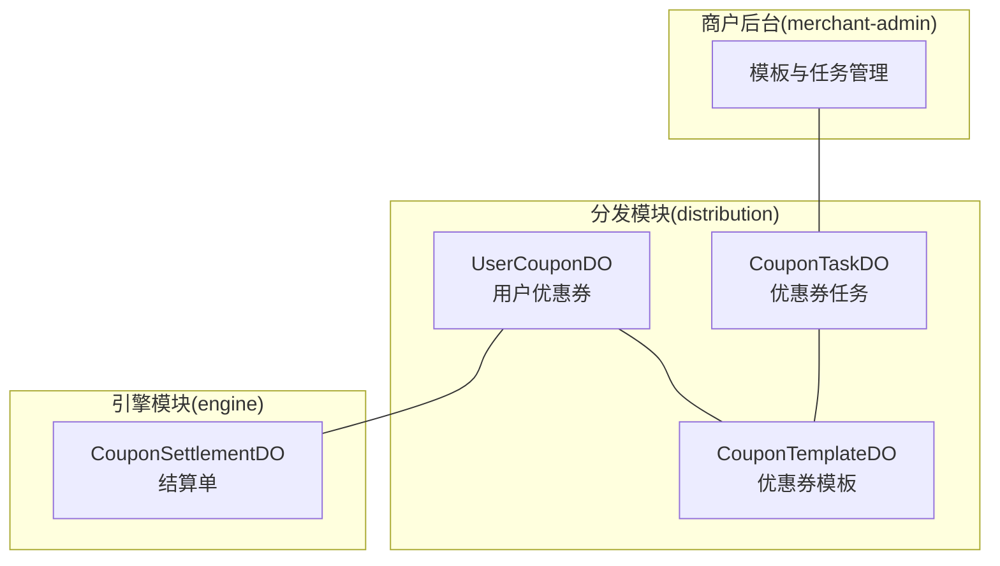
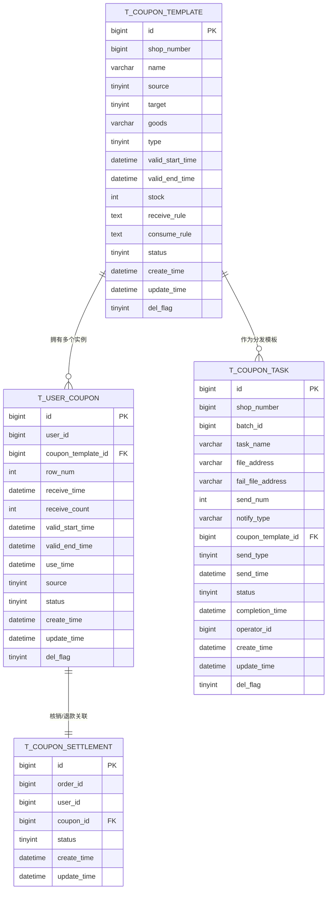
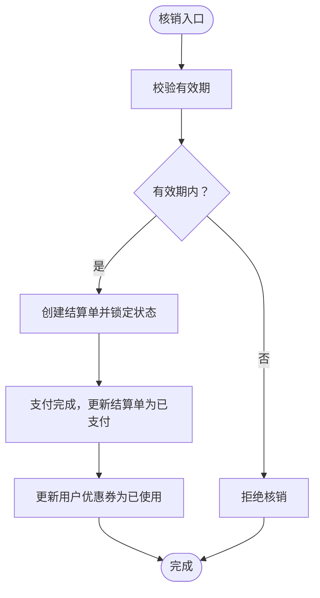
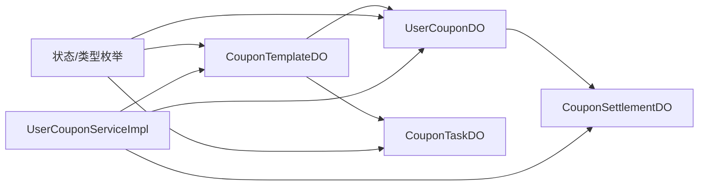

# 数据模型设计

<cite>
**本文引用的文件**
- [UserCouponDO.java](file://distribution/src/main/java/com/fengxin/maplecoupon/distribution/dao/entity/UserCouponDO.java)
- [CouponTemplateDO.java](file://distribution/src/main/java/com/fengxin/maplecoupon/distribution/dao/entity/CouponTemplateDO.java)
- [CouponTaskDO.java](file://distribution/src/main/java/com/fengxin/maplecoupon/distribution/dao/entity/CouponTaskDO.java)
- [CouponSettlementDO.java](file://engine/src/main/java/com/fengxin/maplecoupon/engine/dao/entity/CouponSettlementDO.java)
- [CouponTemplateStatusEnum.java](file://distribution/src/main/java/com/fengxin/maplecoupon/distribution/common/enums/CouponTemplateStatusEnum.java)
- [CouponStatusEnum.java](file://distribution/src/main/java/com/fengxin/maplecoupon/distribution/common/enums/CouponStatusEnum.java)
- [CouponTaskStatusEnum.java](file://distribution/src/main/java/com/fengxin/maplecoupon/distribution/common/enums/CouponTaskStatusEnum.java)
- [DiscountTypeEnum.java](file://distribution/src/main/java/com/fengxin/maplecoupon/distribution/common/enums/DiscountTypeEnum.java)
- [DiscountTargetEnum.java](file://distribution/src/main/java/com/fengxin/maplecoupon/distribution/common/enums/DiscountTargetEnum.java)
- [UserCouponStatusEnum.java](file://engine/src/main/java/com/fengxin/maplecoupon/engine/common/enums/UserCouponStatusEnum.java)
- [UserCouponMapper.java](file://distribution/src/main/java/com/fengxin/maplecoupon/distribution/dao/mapper/UserCouponMapper.java)
- [UserCouponMapper.xml](file://distribution/src/main/resources/mapper/UserCouponMapper.xml)
- [CouponSettlementMapper.xml](file://engine/src/main/resources/mapper/CouponSettlementMapper.xml)
- [UserCouponServiceImpl.java](file://engine/src/main/java/com/fengxin/maplecoupon/engine/service/impl/UserCouponServiceImpl.java)
</cite>

## 目录
1. [简介](#简介)
2. [项目结构](#项目结构)
3. [核心组件](#核心组件)
4. [架构总览](#架构总览)
5. [详细组件分析](#详细组件分析)
6. [依赖分析](#依赖分析)
7. [性能考虑](#性能考虑)
8. [故障排查指南](#故障排查指南)
9. [结论](#结论)
10. [附录](#附录)

## 简介
本文件系统化梳理MapleCoupon核心数据模型设计，围绕用户优惠券(UserCouponDO)、优惠券模板(CouponTemplateDO)、优惠券任务(CouponTaskDO)、结算记录(CouponSettlementDO)四大实体展开，覆盖字段语义、约束与规则、实体关系、索引与分片策略、以及对优惠券生命周期、用户管理、商家管理等核心业务场景的支持方式。文档同时给出ER图与表结构说明，并总结数据完整性、默认值与校验策略。

## 项目结构
- 实体与枚举分布于各模块的dao.entity与common.enums包中，分别承担持久层与领域语义定义。
- 分发模块(distribution)负责用户优惠券与模板、任务等核心实体的持久化与分发链路。
- 引擎模块(engine)负责核销、结算、提醒等高并发业务逻辑，涉及用户优惠券与结算单的强一致性控制。
- 商户后台(merchant-admin)负责模板与任务的创建、分发计划与终止等管理能力。

图表来源
- [UserCouponDO.java:1-100](file://distribution/src/main/java/com/fengxin/maplecoupon/distribution/dao/entity/UserCouponDO.java#L1-L100)
- [CouponTemplateDO.java:1-109](file://distribution/src/main/java/com/fengxin/maplecoupon/distribution/dao/entity/CouponTemplateDO.java#L1-L109)
- [CouponTaskDO.java:1-115](file://distribution/src/main/java/com/fengxin/maplecoupon/distribution/dao/entity/CouponTaskDO.java#L1-L115)
- [CouponSettlementDO.java:1-57](file://engine/src/main/java/com/fengxin/maplecoupon/engine/dao/entity/CouponSettlementDO.java#L1-L57)

章节来源
- [UserCouponDO.java:1-100](file://distribution/src/main/java/com/fengxin/maplecoupon/distribution/dao/entity/UserCouponDO.java#L1-L100)
- [CouponTemplateDO.java:1-109](file://distribution/src/main/java/com/fengxin/maplecoupon/distribution/dao/entity/CouponTemplateDO.java#L1-L109)
- [CouponTaskDO.java:1-115](file://distribution/src/main/java/com/fengxin/maplecoupon/distribution/dao/entity/CouponTaskDO.java#L1-L115)
- [CouponSettlementDO.java:1-57](file://engine/src/main/java/com/fengxin/maplecoupon/engine/dao/entity/CouponSettlementDO.java#L1-L57)

## 核心组件
本节聚焦四大核心实体的业务含义、字段类型、约束与规则，以及它们之间的关系设计。

- 用户优惠券(UserCouponDO)
  - 业务含义：记录“用户-模板”维度的优惠券实例，承载有效期、来源、状态、领取次数等关键属性。
  - 关键字段与约束
    - 主键：id
    - 外键：userId、couponTemplateId
    - 时间字段：receiveTime、useTime、validStartTime、validEndTime
    - 状态：status（未使用、锁定、已使用、已过期、已撤回）
    - 来源：source（领券中心、平台发放、店铺领取）
    - 领取次数：receiveCount
    - 逻辑删除：delFlag
  - 业务规则
    - 有效期校验：仅在有效期内可用
    - 状态流转：未使用→锁定→已使用；过期或撤回影响可用性
    - 领取上限：结合Redis与模板规则限制每人领取次数

- 优惠券模板(CouponTemplateDO)
  - 业务含义：描述优惠券的“模板”，定义适用范围、优惠类型、有效期、库存、领取/消耗规则等。
  - 关键字段与约束
    - 主键：id
    - 店铺标识：shopNumber
    - 名称：name
    - 来源：source（店铺券/平台券）
    - 适用对象：target（商品专属/全店通用）
    - 优惠对象：goods（商品编码）
    - 优惠类型：type（立减/满减/折扣）
    - 有效期：validStartTime、validEndTime
    - 库存：stock
    - 规则：receiveRule（领取规则）、consumeRule（消耗规则）
    - 状态：status（生效中/已结束）
    - 逻辑删除：delFlag
  - 业务规则
    - 库存扣减需与Redis+Lua原子操作配合，避免超卖
    - 领取规则与消耗规则用于前端与引擎侧校验
    - 模板状态决定是否允许继续分发或核销

- 优惠券任务(CouponTaskDO)
  - 业务含义：描述一次优惠券分发任务，支持批量导入、定时/立即发送、通知方式、任务状态等。
  - 关键字段与约束
    - 主键：id
    - 店铺标识：shopNumber
    - 批次：batchId
    - 任务名：taskName
    - 文件地址：fileAddress、failFileAddress
    - 发放数量：sendNum
    - 通知方式：notifyType（站内信/弹框/邮箱/短信）
    - 模板关联：couponTemplateId
    - 发送类型：sendType（立即/定时）
    - 发送时间：sendTime
    - 状态：status（待执行/执行中/执行失败/执行成功/取消）
    - 完成时间：completionTime
    - 操作人：operatorId
    - 逻辑删除：delFlag
  - 业务规则
    - 任务状态机驱动分发流程
    - 定时任务与MQ解耦执行
    - 失败用户导出便于重试与审计

- 结算记录(CouponSettlementDO)
  - 业务含义：记录一次核销/支付/退款的结算单，与用户优惠券形成强一致关联。
  - 关键字段与约束
    - 主键：id
    - 订单：orderId
    - 用户：userId
    - 优惠券：couponId（指向UserCouponDO.id）
    - 状态：status（锁定/已取消/已支付/已退款）
    - 时间：createTime、updateTime
  - 业务规则
    - 锁定态防止并发重复核销
    - 支付/退款状态变更需严格事务控制
    - 与UserCouponDO状态联动（锁定→已使用/未使用）

章节来源
- [UserCouponDO.java:1-100](file://distribution/src/main/java/com/fengxin/maplecoupon/distribution/dao/entity/UserCouponDO.java#L1-L100)
- [CouponTemplateDO.java:1-109](file://distribution/src/main/java/com/fengxin/maplecoupon/distribution/dao/entity/CouponTemplateDO.java#L1-L109)
- [CouponTaskDO.java:1-115](file://distribution/src/main/java/com/fengxin/maplecoupon/distribution/dao/entity/CouponTaskDO.java#L1-L115)
- [CouponSettlementDO.java:1-57](file://engine/src/main/java/com/fengxin/maplecoupon/engine/dao/entity/CouponSettlementDO.java#L1-L57)

## 架构总览
下图展示四实体在业务流程中的交互关系与职责边界：

图表来源
- [CouponTemplateDO.java:1-109](file://distribution/src/main/java/com/fengxin/maplecoupon/distribution/dao/entity/CouponTemplateDO.java#L1-L109)
- [UserCouponDO.java:1-100](file://distribution/src/main/java/com/fengxin/maplecoupon/distribution/dao/entity/UserCouponDO.java#L1-L100)
- [CouponTaskDO.java:1-115](file://distribution/src/main/java/com/fengxin/maplecoupon/distribution/dao/entity/CouponTaskDO.java#L1-L115)
- [CouponSettlementDO.java:1-57](file://engine/src/main/java/com/fengxin/maplecoupon/engine/dao/entity/CouponSettlementDO.java#L1-L57)

## 详细组件分析

### 用户优惠券(UserCouponDO)
- 设计要点
  - 以“用户-模板”为维度生成唯一实例，支持按模板批量派发与独立核销。
  - 状态机与有效期共同决定可用性，结合Redis缓存提升查询效率。
  - 接收次数与来源字段便于运营统计与风控。
- 字段与约束
  - 主键：id
  - 外键：couponTemplateId → T_COUPON_TEMPLATE(id)
  - 时间字段：receiveTime、validStartTime、validEndTime、useTime
  - 状态：status ∈ {未使用, 锁定, 已使用, 已过期, 已撤回}
  - 来源：source ∈ {领券中心, 平台发放, 店铺领取}
  - 领取次数：receiveCount
  - 逻辑删除：delFlag
- 业务规则
  - 仅在有效期内可核销
  - 状态由“锁定→已使用/未使用”驱动，退款后回到未使用并恢复缓存
  - 领取上限受模板规则与Redis限流控制

图表来源
- [UserCouponServiceImpl.java:414-542](file://engine/src/main/java/com/fengxin/maplecoupon/engine/service/impl/UserCouponServiceImpl.java#L414-L542)
- [UserCouponDO.java:1-100](file://distribution/src/main/java/com/fengxin/maplecoupon/distribution/dao/entity/UserCouponDO.java#L1-L100)
- [CouponSettlementDO.java:1-57](file://engine/src/main/java/com/fengxin/maplecoupon/engine/dao/entity/CouponSettlementDO.java#L1-L57)

章节来源
- [UserCouponDO.java:1-100](file://distribution/src/main/java/com/fengxin/maplecoupon/distribution/dao/entity/UserCouponDO.java#L1-L100)
- [UserCouponMapper.java:1-24](file://distribution/src/main/java/com/fengxin/maplecoupon/distribution/dao/mapper/UserCouponMapper.java#L1-L24)
- [UserCouponMapper.xml:1-40](file://distribution/src/main/resources/mapper/UserCouponMapper.xml#L1-L40)
- [UserCouponServiceImpl.java:414-542](file://engine/src/main/java/com/fengxin/maplecoupon/engine/service/impl/UserCouponServiceImpl.java#L414-L542)

### 优惠券模板(CouponTemplateDO)
- 设计要点
  - 以模板为中心统一描述优惠规则，支持商品专属与全店通用两种适用对象。
  - 优惠类型涵盖立减、满减、折扣，结合消耗规则计算折扣金额。
  - 库存与领取规则通过Redis+Lua原子扣减，保障高并发安全。
- 字段与约束
  - 主键：id
  - 店铺标识：shopNumber
  - 适用对象：target ∈ {商品专属, 全店通用}
  - 优惠类型：type ∈ {立减, 满减, 折扣}
  - 有效期：validStartTime、validEndTime
  - 库存：stock
  - 规则：receiveRule、consumeRule（JSON格式）
  - 状态：status ∈ {生效中, 已结束}
  - 逻辑删除：delFlag
- 业务规则
  - 模板状态决定是否允许继续分发
  - 领取规则限制每人上限，消耗规则决定可用性与折扣上限

章节来源
- [CouponTemplateDO.java:1-109](file://distribution/src/main/java/com/fengxin/maplecoupon/distribution/dao/entity/CouponTemplateDO.java#L1-L109)
- [DiscountTypeEnum.java:1-50](file://distribution/src/main/java/com/fengxin/maplecoupon/distribution/common/enums/DiscountTypeEnum.java#L1-L50)
- [DiscountTargetEnum.java:1-45](file://distribution/src/main/java/com/fengxin/maplecoupon/distribution/common/enums/DiscountTargetEnum.java#L1-L45)
- [CouponTemplateStatusEnum.java:1-25](file://distribution/src/main/java/com/fengxin/maplecoupon/distribution/common/enums/CouponTemplateStatusEnum.java#L1-L25)
- [CouponStatusEnum.java:1-28](file://distribution/src/main/java/com/fengxin/maplecoupon/distribution/common/enums/CouponStatusEnum.java#L1-L28)

### 优惠券任务(CouponTaskDO)
- 设计要点
  - 任务驱动模板的批量分发，支持Excel导入、失败导出、通知方式组合。
  - 发送类型区分立即/定时，结合MQ异步执行，降低主流程阻塞。
- 字段与约束
  - 主键：id
  - 外键：couponTemplateId → T_COUPON_TEMPLATE(id)
  - 任务状态：status ∈ {待执行, 执行中, 执行失败, 执行成功, 取消}
  - 发送类型：sendType ∈ {立即, 定时}
  - 通知方式：notifyType（位掩码组合）
  - 逻辑删除：delFlag
- 业务规则
  - 任务状态机确保幂等与可追踪
  - 失败用户导出便于后续重试与审计

章节来源
- [CouponTaskDO.java:1-115](file://distribution/src/main/java/com/fengxin/maplecoupon/distribution/dao/entity/CouponTaskDO.java#L1-L115)
- [CouponTaskStatusEnum.java:1-43](file://distribution/src/main/java/com/fengxin/maplecoupon/distribution/common/enums/CouponTaskStatusEnum.java#L1-L43)

### 结算记录(CouponSettlementDO)
- 设计要点
  - 与用户优惠券形成一一对应关系，保证核销过程的强一致。
  - 状态机覆盖锁定、取消、支付、退款四个阶段，配合分布式锁防并发。
- 字段与约束
  - 主键：id
  - 外键：couponId → T_USER_COUPON(id)
  - 状态：status ∈ {锁定, 已取消, 已支付, 已退款}
  - 时间：createTime、updateTime
- 业务规则
  - 锁定态仅允许一次支付或取消
  - 支付后用户优惠券状态变更为“已使用”
  - 退款后用户优惠券回到“未使用”，并恢复缓存

章节来源
- [CouponSettlementDO.java:1-57](file://engine/src/main/java/com/fengxin/maplecoupon/engine/dao/entity/CouponSettlementDO.java#L1-L57)
- [CouponSettlementMapper.xml:1-19](file://engine/src/main/resources/mapper/CouponSettlementMapper.xml#L1-L19)
- [UserCouponStatusEnum.java:1-43](file://engine/src/main/java/com/fengxin/maplecoupon/engine/common/enums/UserCouponStatusEnum.java#L1-L43)

## 依赖分析
- 实体间依赖
  - T_USER_COUPON ← T_COUPON_TEMPLATE：用户优惠券实例绑定模板
  - T_COUPON_TASK ← T_COUPON_TEMPLATE：任务基于模板进行批量分发
  - T_COUPON_SETTLEMENT ← T_USER_COUPON：结算单与用户优惠券强关联
- 枚举与规则
  - 状态枚举统一了模板、任务、用户优惠券的状态表达，减少歧义
  - 优惠类型与适用对象枚举规范了模板规则的语义
- 服务层依赖
  - UserCouponServiceImpl协调模板查询、库存扣减、用户优惠券创建、结算单创建与状态更新

图表来源
- [UserCouponServiceImpl.java:74-86](file://engine/src/main/java/com/fengxin/maplecoupon/engine/service/impl/UserCouponServiceImpl.java#L74-L86)
- [CouponTemplateDO.java:1-109](file://distribution/src/main/java/com/fengxin/maplecoupon/distribution/dao/entity/CouponTemplateDO.java#L1-L109)
- [UserCouponDO.java:1-100](file://distribution/src/main/java/com/fengxin/maplecoupon/distribution/dao/entity/UserCouponDO.java#L1-L100)
- [CouponTaskDO.java:1-115](file://distribution/src/main/java/com/fengxin/maplecoupon/distribution/dao/entity/CouponTaskDO.java#L1-L115)
- [CouponSettlementDO.java:1-57](file://engine/src/main/java/com/fengxin/maplecoupon/engine/dao/entity/CouponSettlementDO.java#L1-L57)

## 性能考虑
- Redis+Lua原子扣减库存：在引擎侧通过Lua脚本实现模板库存与用户领取次数的原子性扣减，避免超卖与竞争条件。
- 缓存与延迟任务
  - 用户优惠券列表缓存：通过有序集合按失效时间排序，提升查询与过期处理效率。
  - 延迟消息：到期自动关闭用户优惠券，降低轮询成本。
- 分片与索引
  - 模板与任务按shopNumber与模板ID进行分库分表，结合业务查询模式建立必要索引（如模板ID、用户ID、状态、时间区间）。
- 并发控制
  - 分布式锁：针对同一优惠券的结算操作加锁，避免并发重复核销/退款。
  - 布隆过滤器：用于提醒取消的快速判定，降低数据库压力。

## 故障排查指南
- 领取失败
  - 现象：提示“优惠券被抢光/达到领取上限/不在有效期”
  - 排查：检查模板库存与Redis库存键、领取规则中的limitPerPerson、模板有效期
- 核销失败
  - 现象：提示“当前优惠券正在核销/使用状态异常/金额不一致”
  - 排查：确认结算单状态是否为锁定；校验订单金额与折扣金额计算逻辑；检查用户优惠券状态与有效期
- 退款异常
  - 现象：退款后用户优惠券未回到可用状态
  - 排查：确认结算单状态已更新为“已退款”，用户优惠券状态更新为“未使用”，并重新写入缓存
- 任务执行异常
  - 现象：任务状态卡在“执行中/失败”
  - 排查：检查任务状态机、MQ消费情况、失败用户导出文件与重试机制

章节来源
- [UserCouponServiceImpl.java:88-136](file://engine/src/main/java/com/fengxin/maplecoupon/engine/service/impl/UserCouponServiceImpl.java#L88-L136)
- [UserCouponServiceImpl.java:414-542](file://engine/src/main/java/com/fengxin/maplecoupon/engine/service/impl/UserCouponServiceImpl.java#L414-L542)
- [UserCouponServiceImpl.java:596-658](file://engine/src/main/java/com/fengxin/maplecoupon/engine/service/impl/UserCouponServiceImpl.java#L596-L658)

## 结论
本数据模型以“模板—实例—任务—结算”为主线，通过Redis+Lua保障高并发下的库存与领取安全，借助分布式锁与延迟任务实现状态机与生命周期管理。枚举与规则统一了业务语义，分库分表与缓存策略兼顾扩展性与性能。整体设计能够有效支撑优惠券生命周期、用户管理与商家管理的核心业务场景。

## 附录

### 表结构与索引设计原则
- 主键
  - 各表均采用自增或业务组合主键，确保唯一性与定位效率
- 外键
  - 用户优惠券绑定模板；任务绑定模板；结算单绑定用户优惠券
- 索引
  - 模板：模板ID、状态、有效期区间
  - 用户优惠券：用户ID、模板ID、状态、有效期区间
  - 任务：模板ID、状态、发送时间
  - 结算单：用户ID、优惠券ID、状态、订单ID
- 默认值与约束
  - 逻辑删除：delFlag默认0（未删除），软删除
  - 时间字段：创建/更新时间由ORM自动填充
  - 状态字段：使用枚举值，避免脏数据

### 字段验证与业务规则清单
- 有效期校验：仅在有效期内可核销
- 领取上限：受模板规则与Redis限流控制
- 库存扣减：Redis+Lua原子操作，失败回滚
- 状态机：锁定→已使用/未使用/已取消，退款后回到未使用
- 金额校验：折扣金额与订单金额一致性校验