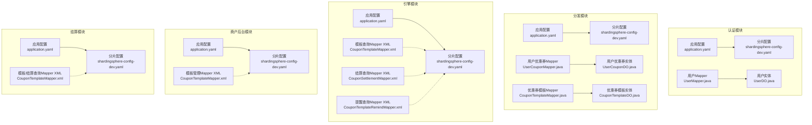
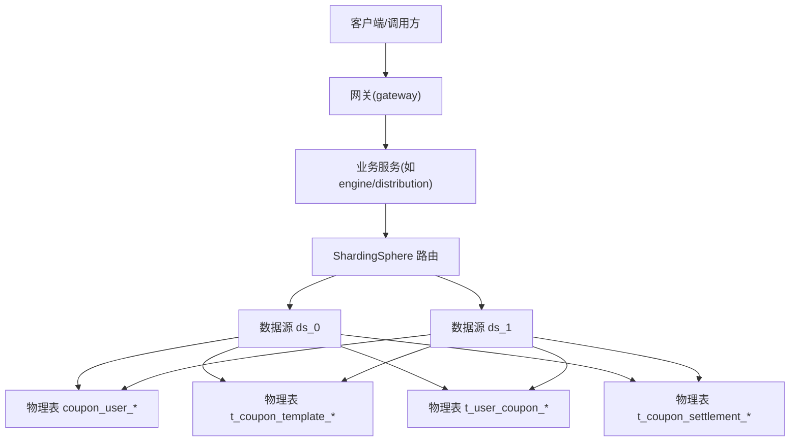
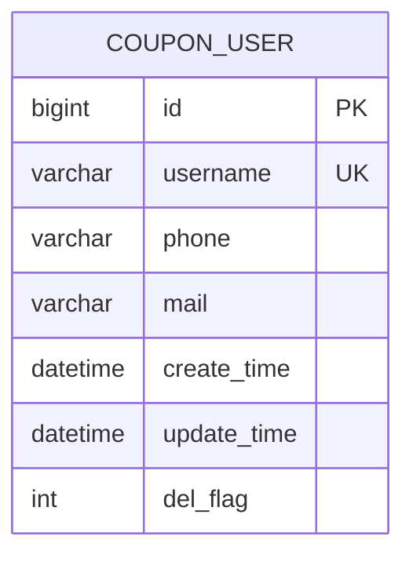
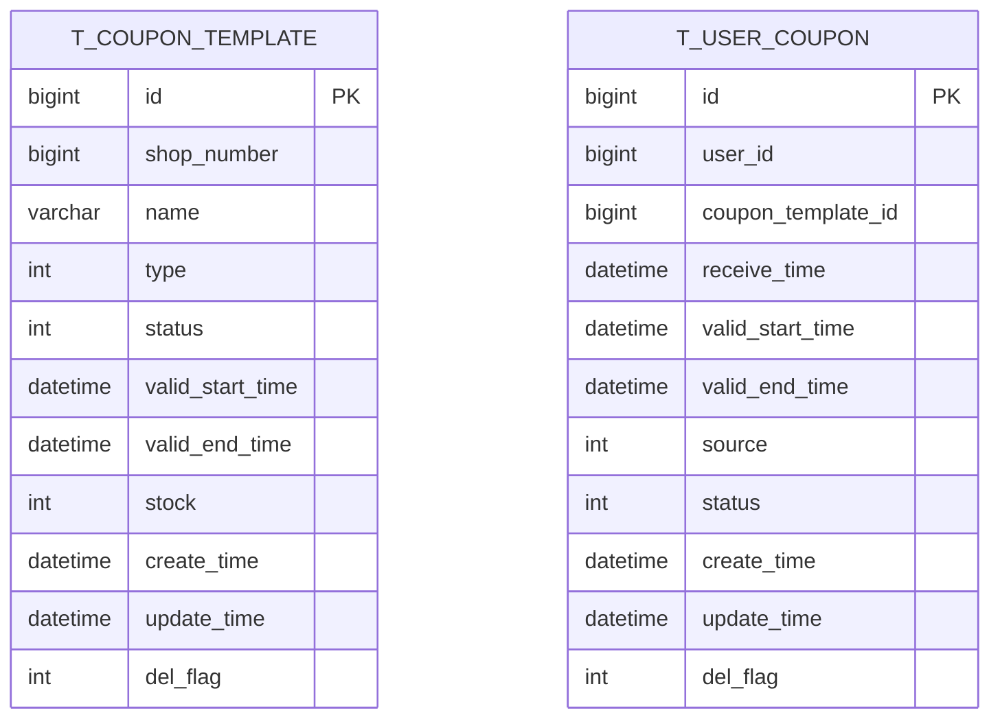
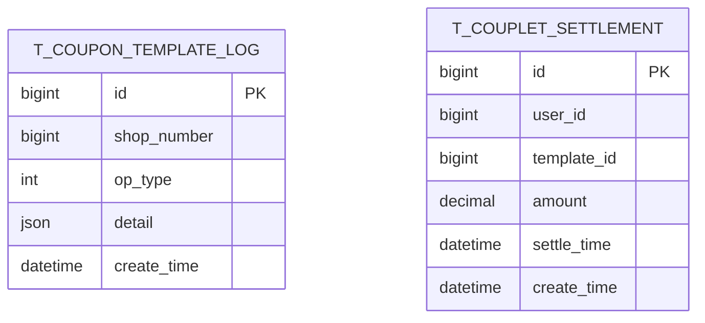
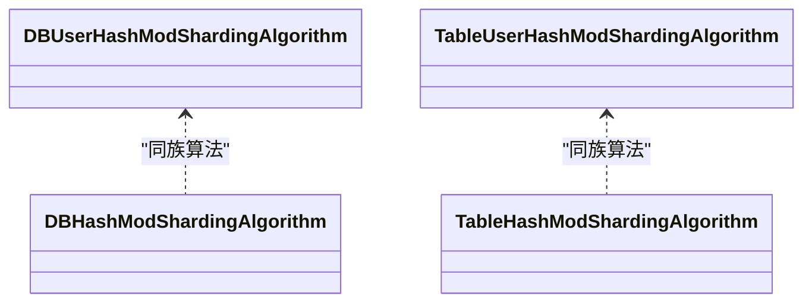

# 索引优化策略

<cite>
**本文引用的文件**
- [application.yaml](file://auth/src/main/resources/application.yaml)
- [application.yaml](file://distribution/src/main/resources/application.yaml)
- [application.yaml](file://engine/src/main/resources/application.yaml)
- [application.yaml](file://merchant-admin/src/main/resources/application.yaml)
- [application.yaml](file://settlement/src/main/resources/application.yaml)
- [shardingsphere-config-dev.yaml](file://auth/src/main/resources/shardingsphere-config-dev.yaml)
- [shardingsphere-config-dev.yaml](file://distribution/src/main/resources/shardingsphere-config-dev.yaml)
- [shardingsphere-config-dev.yaml](file://engine/src/main/resources/shardingsphere-config-dev.yaml)
- [shardingsphere-config-dev.yaml](file://merchant-admin/src/main/resources/shardingsphere-config-dev.yaml)
- [shardingsphere-config-dev.yaml](file://settlement/src/main/resources/shardingsphere-config-dev.yaml)
- [UserDO.java](file://auth/src/main/java/com/fengxin/maplecoupon/auth/dao/entity/UserDO.java)
- [UserCouponDO.java](file://distribution/src/main/java/com/fengxin/maplecoupon/distribution/dao/entity/UserCouponDO.java)
- [CouponTemplateDO.java](file://distribution/src/main/java/com/fengxin/maplecoupon/distribution/dao/entity/CouponTemplateDO.java)
- [UserMapper.java](file://auth/src/main/java/com/fengxin/maplecoupon/auth/dao/mapper/UserMapper.java)
- [UserCouponMapper.java](file://distribution/src/main/java/com/fengxin/maplecoupon/distribution/dao/mapper/UserCouponMapper.java)
- [CouponTemplateMapper.java](file://distribution/src/main/java/com/fengxin/maplecoupon/distribution/dao/mapper/CouponTemplateMapper.java)
- [CouponTemplateMapper.xml](file://distribution/src/main/resources/mapper/CouponTemplateMapper.xml)
- [UserCouponMapper.xml](file://distribution/src/main/resources/mapper/UserCouponMapper.xml)
- [CouponSettlementMapper.xml](file://engine/src/main/resources/mapper/CouponSettlementMapper.xml)
- [CouponTemplateMapper.xml](file://engine/src/main/resources/mapper/CouponTemplateMapper.xml)
- [CouponTemplateRemindMapper.xml](file://engine/src/main/resources/mapper/CouponTemplateRemindMapper.xml)
- [CouponTemplateMapper.xml](file://merchant-admin/src/main/resources/mapper/CouponTemplateMapper.xml)
- [DBUserHashModShardingAlgorithm.java](file://auth/src/main/java/com/fengxin/maplecoupon/auth/dao/sharding/DBUserHashModShardingAlgorithm.java)
- [TableUserHashModShardingAlgorithm.java](file://auth/src/main/java/com/fengxin/maplecoupon/auth/dao/sharding/TableUserHashModShardingAlgorithm.java)
- [DBHashModShardingAlgorithm.java](file://distribution/src/main/java/com/fengxin/maplecoupon/distribution/dao/sharding/DBHashModShardingAlgorithm.java)
- [TableHashModShardingAlgorithm.java](file://distribution/src/main/java/com/fengxin/maplecoupon/distribution/dao/sharding/TableHashModShardingAlgorithm.java)
- [DBHashModShardingAlgorithm.java](file://engine/src/main/java/com/fengxin/maplecoupon/engine/dao/sharding/DBHashModShardingAlgorithm.java)
- [TableHashModShardingAlgorithm.java](file://engine/src/main/java/com/fengxin/maplecoupon/engine/dao/sharding/TableHashModShardingAlgorithm.java)
- [DBHashModShardingAlgorithm.java](file://merchant-admin/src/main/java/com/fengxin/maplecoupon/merchantadmin/dao/sharding/DBHashModShardingAlgorithm.java)
- [TableHashModShardingAlgorithm.java](file://merchant-admin/src/main/java/com/fengxin/maplecoupon/merchantadmin/dao/sharding/TableHashModShardingAlgorithm.java)
- [DBHashModShardingAlgorithm.java](file://settlement/src/main/java/com/fengxin/maplecoupon/settlement/dao/sharding/DBHashModShardingAlgorithm.java)
- [TableHashModShardingAlgorithm.java](file://settlement/src/main/java/com/fengxin/maplecoupon/settlement/dao/sharding/TableHashModShardingAlgorithm.java)
</cite>

## 目录
1. [简介](#简介)
2. [项目结构](#项目结构)
3. [核心组件](#核心组件)
4. [架构总览](#架构总览)
5. [详细组件分析](#详细组件分析)
6. [依赖关系分析](#依赖关系分析)
7. [性能考量](#性能考量)
8. [故障排查指南](#故障排查指南)
9. [结论](#结论)
10. [附录](#附录)

## 简介
本文件面向MapleCoupon系统的数据库索引优化，结合代码库中的实体模型、分片配置与Mapper映射，系统性分析查询模式与访问路径，提出主键索引、唯一索引、复合索引与全文索引的选择原则与适用场景；阐述覆盖索引在减少回表方面的价值；并给出优惠券查询、用户管理、模板管理等核心业务场景的索引优化建议。同时，涵盖索引维护策略（重建、统计信息更新、碎片整理）、写入性能影响与查询写入权衡、索引监控与诊断方法，以及分片场景下的索引设计与跨分片查询优化策略。

## 项目结构
MapleCoupon采用多模块微服务架构，围绕“认证(auth)”、“分发(distribution)”、“引擎(engine)”、“商户后台(merchant-admin)”、“结算(settlement)”、“网关(gateway)”、“框架(framework)”组织。数据库访问通过MyBatis-Plus与ShardingSphere实现，分片规则在各模块的ShardingSphere配置文件中集中定义。

图表来源
- [application.yaml:1-19](file://auth/src/main/resources/application.yaml#L1-L19)
- [application.yaml:1-15](file://distribution/src/main/resources/application.yaml#L1-L15)
- [application.yaml:1-22](file://engine/src/main/resources/application.yaml#L1-L22)
- [application.yaml:1-27](file://merchant-admin/src/main/resources/application.yaml#L1-L27)
- [application.yaml:1-14](file://settlement/src/main/resources/application.yaml#L1-L14)
- [shardingsphere-config-dev.yaml:1-45](file://auth/src/main/resources/shardingsphere-config-dev.yaml#L1-L45)
- [shardingsphere-config-dev.yaml:1-69](file://distribution/src/main/resources/shardingsphere-config-dev.yaml#L1-L69)
- [shardingsphere-config-dev.yaml:1-100](file://engine/src/main/resources/shardingsphere-config-dev.yaml#L1-L100)
- [shardingsphere-config-dev.yaml:1-59](file://merchant-admin/src/main/resources/shardingsphere-config-dev.yaml#L1-L59)
- [shardingsphere-config-dev.yaml:1-100](file://settlement/src/main/resources/shardingsphere-config-dev.yaml#L1-L100)

章节来源
- [application.yaml:1-19](file://auth/src/main/resources/application.yaml#L1-L19)
- [application.yaml:1-15](file://distribution/src/main/resources/application.yaml#L1-L15)
- [application.yaml:1-22](file://engine/src/main/resources/application.yaml#L1-L22)
- [application.yaml:1-27](file://merchant-admin/src/main/resources/application.yaml#L1-L27)
- [application.yaml:1-14](file://settlement/src/main/resources/application.yaml#L1-L14)

## 核心组件
- 用户实体与表：coupon_user（用户名username用于分库分表）
- 优惠券模板实体与表：t_coupon_template（按shop_number分库分表）
- 用户优惠券实体与表：t_user_coupon（按user_id分库分表）
- 结算相关表：t_coupon_settlement（按user_id分库分表）

这些实体与分片键共同决定了查询访问路径与索引选择策略。

章节来源
- [UserDO.java:18-88](file://auth/src/main/java/com/fengxin/maplecoupon/auth/dao/entity/UserDO.java#L18-L88)
- [CouponTemplateDO.java:23-109](file://distribution/src/main/java/com/fengxin/maplecoupon/distribution/dao/entity/CouponTemplateDO.java#L23-L109)
- [UserCouponDO.java:23-100](file://distribution/src/main/java/com/fengxin/maplecoupon/distribution/dao/entity/UserCouponDO.java#L23-L100)

## 架构总览
下图展示基于分片键的查询路由与索引访问路径关系。由于分片键即为查询条件的一部分，可实现精确路由到单个或少量物理分片，从而提升查询效率。

图表来源
- [shardingsphere-config-dev.yaml:18-42](file://auth/src/main/resources/shardingsphere-config-dev.yaml#L18-L42)
- [shardingsphere-config-dev.yaml:18-65](file://distribution/src/main/resources/shardingsphere-config-dev.yaml#L18-L65)
- [shardingsphere-config-dev.yaml:18-97](file://engine/src/main/resources/shardingsphere-config-dev.yaml#L18-L97)
- [shardingsphere-config-dev.yaml:18-55](file://merchant-admin/src/main/resources/shardingsphere-config-dev.yaml#L18-L55)
- [shardingsphere-config-dev.yaml:18-97](file://settlement/src/main/resources/shardingsphere-config-dev.yaml#L18-L97)

## 详细组件分析

### 认证模块：用户表索引策略
- 实体与表：coupon_user
- 分片键：username（分库分表键）
- 查询模式：登录/注册通常基于username；若存在手机号/邮箱查询，需评估是否纳入复合索引
- 建议索引：
  - 主键索引：id（默认）
  - 唯一索引：username（唯一性约束）
  - 复合索引：username + phone/mail（若存在多字段查询）
  - 全文索引：不适用（文本搜索需求不明显）

图表来源
- [UserDO.java:18-88](file://auth/src/main/java/com/fengxin/maplecoupon/auth/dao/entity/UserDO.java#L18-L88)

章节来源
- [UserDO.java:18-88](file://auth/src/main/java/com/fengxin/maplecoupon/auth/dao/entity/UserDO.java#L18-L88)
- [shardingsphere-config-dev.yaml:18-42](file://auth/src/main/resources/shardingsphere-config-dev.yaml#L18-L42)

### 分发模块：模板与用户优惠券索引策略
- 实体与表：t_coupon_template、t_user_coupon
- 分片键：shop_number（模板）、user_id（用户优惠券）
- 查询模式：
  - 模板查询：按shop_number过滤，可能涉及状态、有效期、类型等条件
  - 用户优惠券查询：按user_id过滤，可能涉及状态、有效期、模板ID等
- 建议索引：
  - 主键索引：id（默认）
  - 唯一索引：模板维度（shop_number, name）或（shop_number, goods, type）等组合唯一性
  - 复合索引：
    - t_user_coupon(user_id, status, valid_start_time, valid_end_time)
    - t_coupon_template(shop_number, status, valid_start_time, valid_end_time)
  - 覆盖索引：针对高频查询字段（如name、type、status、valid_start_time、valid_end_time）建立覆盖索引，避免回表
  - 全文索引：不适用（无大规模文本检索）

图表来源
- [CouponTemplateDO.java:23-109](file://distribution/src/main/java/com/fengxin/maplecoupon/distribution/dao/entity/CouponTemplateDO.java#L23-L109)
- [UserCouponDO.java:23-100](file://distribution/src/main/java/com/fengxin/maplecoupon/distribution/dao/entity/UserCouponDO.java#L23-L100)

章节来源
- [CouponTemplateDO.java:23-109](file://distribution/src/main/java/com/fengxin/maplecoupon/distribution/dao/entity/CouponTemplateDO.java#L23-L109)
- [UserCouponDO.java:23-100](file://distribution/src/main/java/com/fengxin/maplecoupon/distribution/dao/entity/UserCouponDO.java#L23-L100)
- [shardingsphere-config-dev.yaml:18-65](file://distribution/src/main/resources/shardingsphere-config-dev.yaml#L18-L65)

### 引擎模块：模板/提醒/结算查询索引策略
- 实体与表：t_coupon_template、t_coupon_template_log、t_user_coupon、t_coupon_settlement
- 分片键：shop_number（模板/日志），user_id（用户优惠券/结算）
- 查询模式：模板状态/有效期查询、提醒事件查询、结算明细查询
- 建议索引：
  - 主键索引：id（默认）
  - 复合索引：
    - t_coupon_template(shop_number, status, valid_start_time, valid_end_time)
    - t_user_coupon(user_id, status, valid_start_time, valid_end_time)
    - t_coupon_settlement(user_id, create_time)
  - 覆盖索引：针对常用投影字段建立覆盖索引，减少回表
  - 全文索引：不适用

图表来源
- [CouponTemplateDO.java:23-109](file://distribution/src/main/java/com/fengxin/maplecoupon/distribution/dao/entity/CouponTemplateDO.java#L23-L109)
- [UserCouponDO.java:23-100](file://distribution/src/main/java/com/fengxin/maplecoupon/distribution/dao/entity/UserCouponDO.java#L23-L100)
- [CouponSettlementMapper.xml](file://engine/src/main/resources/mapper/CouponSettlementMapper.xml)

章节来源
- [CouponTemplateMapper.xml](file://engine/src/main/resources/mapper/CouponTemplateMapper.xml)
- [CouponTemplateRemindMapper.xml](file://engine/src/main/resources/mapper/CouponTemplateRemindMapper.xml)
- [CouponSettlementMapper.xml](file://engine/src/main/resources/mapper/CouponSettlementMapper.xml)
- [shardingsphere-config-dev.yaml:18-97](file://engine/src/main/resources/shardingsphere-config-dev.yaml#L18-L97)

### 商户后台模块：模板管理查询索引策略
- 实体与表：t_coupon_template、t_coupon_template_log
- 分片键：shop_number
- 查询模式：分页查询、状态筛选、名称模糊匹配（如存在）
- 建议索引：
  - 主键索引：id（默认）
  - 复合索引：t_coupon_template(shop_number, status, create_time)
  - 覆盖索引：针对分页与筛选字段建立覆盖索引
  - 全文索引：如需模糊搜索name，可考虑全文索引（需评估成本与收益）

章节来源
- [CouponTemplateMapper.xml](file://merchant-admin/src/main/resources/mapper/CouponTemplateMapper.xml)
- [shardingsphere-config-dev.yaml:18-55](file://merchant-admin/src/main/resources/shardingsphere-config-dev.yaml#L18-L55)

### 结算模块：用户优惠券与结算查询索引策略
- 实体与表：t_user_coupon、t_coupon_settlement
- 分片键：user_id
- 查询模式：按用户查询优惠券与结算记录
- 建议索引：
  - 主键索引：id（默认）
  - 复合索引：t_user_coupon(user_id, status, valid_start_time, valid_end_time)
  - 覆盖索引：常用投影字段建立覆盖索引
  - 全文索引：不适用

章节来源
- [CouponTemplateMapper.xml](file://settlement/src/main/resources/mapper/CouponTemplateMapper.xml)
- [shardingsphere-config-dev.yaml:18-97](file://settlement/src/main/resources/shardingsphere-config-dev.yaml#L18-L97)

## 依赖关系分析
- 分片算法类：
  - 认证模块：DBUserHashModShardingAlgorithm、TableUserHashModShardingAlgorithm
  - 分发/引擎/商户后台/结算模块：DBHashModShardingAlgorithm、TableHashModShardingAlgorithm
- 依赖关系：各模块的ShardingSphere配置文件定义了分片键、实际数据节点与分片算法，直接影响查询路由与索引选择。

图表来源
- [DBUserHashModShardingAlgorithm.java](file://auth/src/main/java/com/fengxin/maplecoupon/auth/dao/sharding/DBUserHashModShardingAlgorithm.java)
- [TableUserHashModShardingAlgorithm.java](file://auth/src/main/java/com/fengxin/maplecoupon/auth/dao/sharding/TableUserHashModShardingAlgorithm.java)
- [DBHashModShardingAlgorithm.java](file://distribution/src/main/java/com/fengxin/maplecoupon/distribution/dao/sharding/DBHashModShardingAlgorithm.java)
- [TableHashModShardingAlgorithm.java](file://distribution/src/main/java/com/fengxin/maplecoupon/distribution/dao/sharding/TableHashModShardingAlgorithm.java)
- [DBHashModShardingAlgorithm.java](file://engine/src/main/java/com/fengxin/maplecoupon/engine/dao/sharding/DBHashModShardingAlgorithm.java)
- [TableHashModShardingAlgorithm.java](file://engine/src/main/java/com/fengxin/maplecoupon/engine/dao/sharding/TableHashModShardingAlgorithm.java)
- [DBHashModShardingAlgorithm.java](file://merchant-admin/src/main/java/com/fengxin/maplecoupon/merchantadmin/dao/sharding/DBHashModShardingAlgorithm.java)
- [TableHashModShardingAlgorithm.java](file://merchant-admin/src/main/java/com/fengxin/maplecoupon/merchantadmin/dao/sharding/TableHashModShardingAlgorithm.java)
- [DBHashModShardingAlgorithm.java](file://settlement/src/main/java/com/fengxin/maplecoupon/settlement/dao/sharding/DBHashModShardingAlgorithm.java)
- [TableHashModShardingAlgorithm.java](file://settlement/src/main/java/com/fengxin/maplecoupon/settlement/dao/sharding/TableHashModShardingAlgorithm.java)

章节来源
- [shardingsphere-config-dev.yaml:32-42](file://auth/src/main/resources/shardingsphere-config-dev.yaml#L32-L42)
- [shardingsphere-config-dev.yaml:42-65](file://distribution/src/main/resources/shardingsphere-config-dev.yaml#L42-L65)
- [shardingsphere-config-dev.yaml:63-97](file://engine/src/main/resources/shardingsphere-config-dev.yaml#L63-L97)
- [shardingsphere-config-dev.yaml:43-55](file://merchant-admin/src/main/resources/shardingsphere-config-dev.yaml#L43-L55)
- [shardingsphere-config-dev.yaml:63-97](file://settlement/src/main/resources/shardingsphere-config-dev.yaml#L63-L97)

## 性能考量
- 查询与写入权衡：
  - 增加索引可显著提升查询性能，但会降低写入吞吐（插入/更新/删除时需维护索引）
  - 对于高并发写入场景（如用户领券、扣减库存），应优先保证主键与必要唯一索引，其余非关键查询索引按需添加
- 覆盖索引：
  - 将查询所需字段全部纳入索引，可避免回表，显著降低IO与CPU开销
  - 适用于高频SELECT投影查询（如模板列表、用户优惠券列表）
- 统计信息与碎片：
  - 定期更新统计信息有助于优化器生成更优执行计划
  - 索引碎片化会导致查询性能下降，需定期重建或重组
- 分片场景：
  - 分片键命中率高时，查询可精确路由至少数物理分片，减少扫描范围
  - 跨分片查询需谨慎，尽量通过分片键或广播表优化

## 故障排查指南
- SQL执行计划分析：
  - 启用SQL日志（各模块application.yaml中已开启sql-show），观察实际路由与执行计划
- 索引使用诊断：
  - 使用EXPLAIN分析查询是否命中预期索引
  - 关注回表次数与扫描行数
- 写入性能问题：
  - 观察批量写入时的锁竞争与死锁日志
  - 调整批量大小与事务粒度
- 分片热点与倾斜：
  - 检查分片键分布是否均匀，避免热点数据集中在少数分片
  - 必要时调整分片算法或引入复合分片键

章节来源
- [application.yaml:12-14](file://auth/src/main/resources/application.yaml#L12-L14)
- [application.yaml:12-14](file://distribution/src/main/resources/application.yaml#L12-L14)
- [application.yaml:12-14](file://engine/src/main/resources/application.yaml#L12-L14)
- [application.yaml:12-14](file://merchant-admin/src/main/resources/application.yaml#L12-L14)
- [application.yaml:12-14](file://settlement/src/main/resources/application.yaml#L12-L14)
- [shardingsphere-config-dev.yaml:44-45](file://auth/src/main/resources/shardingsphere-config-dev.yaml#L44-L45)
- [shardingsphere-config-dev.yaml:68-69](file://distribution/src/main/resources/shardingsphere-config-dev.yaml#L68-L69)
- [shardingsphere-config-dev.yaml:99-100](file://engine/src/main/resources/shardingsphere-config-dev.yaml#L99-L100)
- [shardingsphere-config-dev.yaml:58-59](file://merchant-admin/src/main/resources/shardingsphere-config-dev.yaml#L58-L59)
- [shardingsphere-config-dev.yaml:99-100](file://settlement/src/main/resources/shardingsphere-config-dev.yaml#L99-L100)

## 结论
- 以分片键为核心的查询可获得最佳路由效果，应优先保障分片键上的索引完整性
- 针对高频查询场景，优先构建覆盖索引，减少回表
- 在写入密集型场景，控制索引数量与复杂度，平衡查询与写入性能
- 定期维护统计信息、重建索引、监控执行计划，持续优化索引策略

## 附录
- 核心业务场景索引建议清单（示例）
  - 用户表：username唯一索引；username+phone/mail复合索引（视查询而定）
  - 模板表：(shop_number, status, valid_start_time, valid_end_time)复合索引；覆盖索引包含常用投影字段
  - 用户优惠券表：(user_id, status, valid_start_time, valid_end_time)复合索引；覆盖索引包含常用投影字段
  - 结算表：(user_id, create_time)复合索引；覆盖索引包含金额与结算时间字段