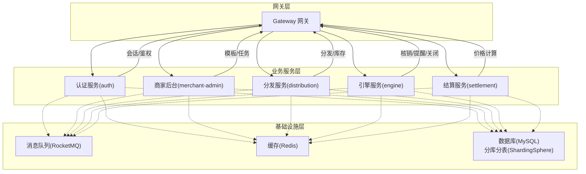
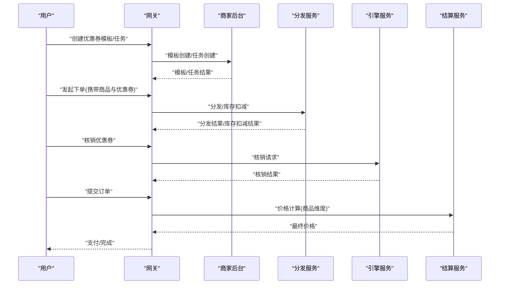
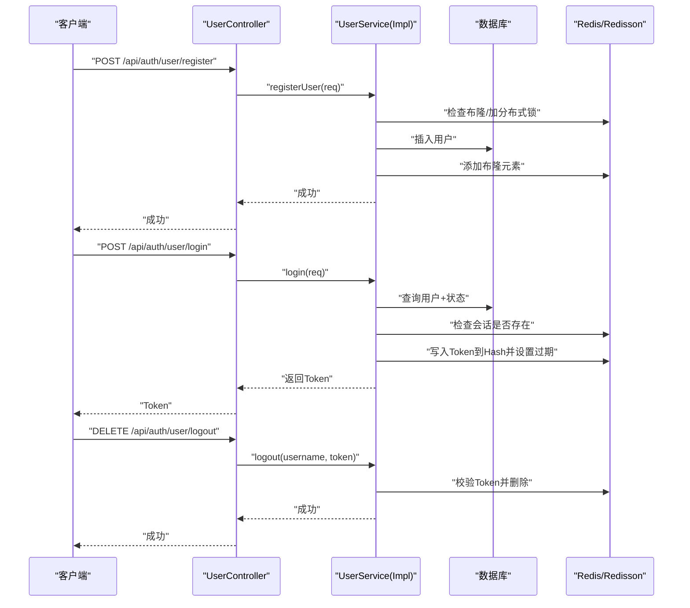
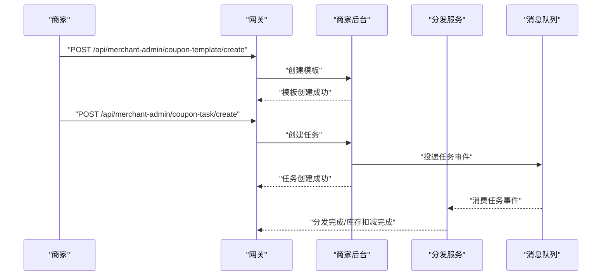
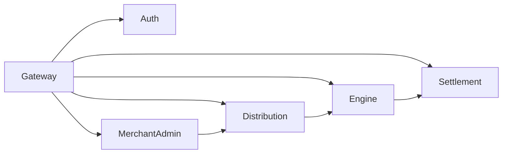

# 核心业务模块

<cite>
**本文引用的文件**
- [AuthApplication.java](file://auth/src/main/java/com/fengxin/maplecoupon/auth/AuthApplication.java)
- [UserController.java](file://auth/src/main/java/com/fengxin/maplecoupon/auth/controller/UserController.java)
- [UserService.java](file://auth/src/main/java/com/fengxin/maplecoupon/auth/service/UserService.java)
- [UserServiceImpl.java](file://auth/src/main/java/com/fengxin/maplecoupon/auth/service/impl/UserServiceImpl.java)
- [EngineApplication.java](file://engine/src/main/java/com/fengxin/maplecoupon/engine/EngineApplication.java)
- [CouponTemplateController.java](file://merchant-admin/src/main/java/com/fengxin/maplecoupon/merchantadmin/controller/CouponTemplateController.java)
- [CouponTaskController.java](file://merchant-admin/src/main/java/com/fengxin/maplecoupon/merchantadmin/controller/CouponTaskController.java)
- [MerchantAdminApplication.java](file://merchant-admin/src/main/java/com/fengxin/maplecoupon/merchantadmin/MerchantAdminApplication.java)
- [SettlementApplication.java](file://settlement/src/main/java/com/fengxin/maplecoupon/settlement/SettlementApplication.java)
- [DistributionApplication.java](file://distribution/src/main/java/com/fengxin/maplecoupon/distribution/DistributionApplication.java)
- [README.md](file://README.md)
</cite>

## 目录
1. [简介](#简介)
2. [项目结构](#项目结构)
3. [核心组件](#核心组件)
4. [架构总览](#架构总览)
5. [详细组件分析](#详细组件分析)
6. [依赖分析](#依赖分析)
7. [性能考虑](#性能考虑)
8. [故障排查指南](#故障排查指南)
9. [结论](#结论)
10. [附录](#附录)

## 简介
本文件聚焦MapleCoupon核心业务模块，围绕以下目标展开：
- 优惠券生命周期管理：模板创建、发行、分发、核销与到期关闭的完整流程
- 用户管理：注册、登录认证、权限校验、个人信息维护与登出
- 商家管理：优惠券模板管理、批次任务创建、终止与分页查询
- 价格计算与结算：面向订单的商品维度优惠券参与与最终价格确定
- 业务流程与时序图：帮助理解复杂交互
- 规则实现、数据校验与异常处理：确保一致性与可靠性
- 代码示例路径：为每个核心功能提供可定位的实现参考

## 项目结构
MapleCoupon采用多模块微服务架构，核心业务模块包括：
- 认证与用户中心（auth）：负责用户注册、登录、会话与权限校验
- 商家后台（merchant-admin）：负责优惠券模板与任务管理
- 发放与分发（distribution）：负责批次分发、库存扣减与异步通知
- 引擎（engine）：负责券状态流转、核销、提醒与延迟关闭
- 结算（settlement）：负责订单商品维度的优惠券计算与最终价格确定
- 网关（gateway）：统一入口与鉴权拦截
- 框架（framework）：通用异常、幂等、序列化与全局结果封装

图表来源
- [AuthApplication.java:15-18](file://auth/src/main/java/com/fengxin/maplecoupon/auth/AuthApplication.java#L15-L18)
- [MerchantAdminApplication.java:14-17](file://merchant-admin/src/main/java/com/fengxin/maplecoupon/merchantadmin/MerchantAdminApplication.java#L14-L17)
- [DistributionApplication.java:13-14](file://distribution/src/main/java/com/fengxin/maplecoupon/distribution/DistributionApplication.java#L13-L14)
- [EngineApplication.java:13-14](file://engine/src/main/java/com/fengxin/maplecoupon/engine/EngineApplication.java#L13-L14)
- [SettlementApplication.java:12-13](file://settlement/src/main/java/com/fengxin/maplecoupon/settlement/SettlementApplication.java#L12-L13)

章节来源
- [README.md:1-10](file://README.md#L1-L10)

## 核心组件
- 认证与用户中心（auth）
  - 控制器：用户注册、登录、登出、信息查询与更新
  - 服务：用户信息检索、布隆过滤器防穿透、分布式锁防重、Redis会话存储与过期策略
- 商家后台（merchant-admin）
  - 控制器：优惠券模板创建、分页查询、详情查询、增发、终止、删除
  - 控制器：优惠券任务创建（批次分发）
- 发放与分发（distribution）
  - 负责批次分发、库存扣减、用户记录批量保存、异步通知
- 引擎（engine）
  - 负责券状态管理、核销、提醒、延迟关闭
- 结算（settlement）
  - 负责订单商品维度的优惠券参与与最终价格计算

章节来源
- [UserController.java:24-80](file://auth/src/main/java/com/fengxin/maplecoupon/auth/controller/UserController.java#L24-L80)
- [UserService.java:19-78](file://auth/src/main/java/com/fengxin/maplecoupon/auth/service/UserService.java#L19-L78)
- [UserServiceImpl.java:47-158](file://auth/src/main/java/com/fengxin/maplecoupon/auth/service/impl/UserServiceImpl.java#L47-L158)
- [CouponTemplateController.java:25-73](file://merchant-admin/src/main/java/com/fengxin/maplecoupon/merchantadmin/controller/CouponTemplateController.java#L25-L73)
- [CouponTaskController.java:25-39](file://merchant-admin/src/main/java/com/fengxin/maplecoupon/merchantadmin/controller/CouponTaskController.java#L25-L39)

## 架构总览
下图展示了从用户下单到优惠券核销与结算的整体流程，涵盖模板管理、任务创建、分发、核销与价格计算。

图表来源
- [CouponTemplateController.java:31-37](file://merchant-admin/src/main/java/com/fengxin/maplecoupon/merchantadmin/controller/CouponTemplateController.java#L31-L37)
- [CouponTaskController.java:32-38](file://merchant-admin/src/main/java/com/fengxin/maplecoupon/merchantadmin/controller/CouponTaskController.java#L32-L38)
- [EngineApplication.java:13-14](file://engine/src/main/java/com/fengxin/maplecoupon/engine/EngineApplication.java#L13-L14)
- [SettlementApplication.java:12-13](file://settlement/src/main/java/com/fengxin/maplecoupon/settlement/SettlementApplication.java#L12-L13)

## 详细组件分析

### 用户管理模块（认证与用户中心）
- 功能要点
  - 注册：布隆过滤器防穿透 + 分布式锁防重 + 数据落库 + 增加布隆元素
  - 登录：查询用户+状态校验 → 判断会话是否已存在 → 生成Token → 写入Redis Hash并设置过期
  - 登出：校验Token有效性后删除对应会话键
  - 信息维护：更新后刷新Redis中的用户会话缓存
  - 权限校验：基于Token在Redis中的存在性判断登录态
- 关键实现路径
  - 控制器接口定义：[UserController.java:24-80](file://auth/src/main/java/com/fengxin/maplecoupon/auth/controller/UserController.java#L24-L80)
  - 服务接口定义：[UserService.java:19-78](file://auth/src/main/java/com/fengxin/maplecoupon/auth/service/UserService.java#L19-L78)
  - 服务实现与Redis/分布式锁：[UserServiceImpl.java:47-158](file://auth/src/main/java/com/fengxin/maplecoupon/auth/service/impl/UserServiceImpl.java#L47-L158)

图表来源
- [UserController.java:48-79](file://auth/src/main/java/com/fengxin/maplecoupon/auth/controller/UserController.java#L48-L79)
- [UserServiceImpl.java:71-157](file://auth/src/main/java/com/fengxin/maplecoupon/auth/service/impl/UserServiceImpl.java#L71-L157)

章节来源
- [UserController.java:24-80](file://auth/src/main/java/com/fengxin/maplecoupon/auth/controller/UserController.java#L24-L80)
- [UserService.java:19-78](file://auth/src/main/java/com/fengxin/maplecoupon/auth/service/UserService.java#L19-L78)
- [UserServiceImpl.java:47-158](file://auth/src/main/java/com/fengxin/maplecoupon/auth/service/impl/UserServiceImpl.java#L47-L158)

### 商家管理模块（模板与任务）
- 功能要点
  - 模板管理：创建、分页查询、详情查询、增发、终止、删除
  - 任务管理：创建批次任务（如定时/延迟执行），配合分发服务进行批量分发
- 关键实现路径
  - 模板控制器：[CouponTemplateController.java:25-73](file://merchant-admin/src/main/java/com/fengxin/maplecoupon/merchantadmin/controller/CouponTemplateController.java#L25-L73)
  - 任务控制器：[CouponTaskController.java:25-39](file://merchant-admin/src/main/java/com/fengxin/maplecoupon/merchantadmin/controller/CouponTaskController.java#L25-L39)

图表来源
- [CouponTemplateController.java:31-37](file://merchant-admin/src/main/java/com/fengxin/maplecoupon/merchantadmin/controller/CouponTemplateController.java#L31-L37)
- [CouponTaskController.java:32-38](file://merchant-admin/src/main/java/com/fengxin/maplecoupon/merchantadmin/controller/CouponTaskController.java#L32-L38)

章节来源
- [CouponTemplateController.java:25-73](file://merchant-admin/src/main/java/com/fengxin/maplecoupon/merchantadmin/controller/CouponTemplateController.java#L25-L73)
- [CouponTaskController.java:25-39](file://merchant-admin/src/main/java/com/fengxin/maplecoupon/merchantadmin/controller/CouponTaskController.java#L25-L39)

### 发放与分发模块（distribution）
- 功能要点
  - 批次分发：按任务将优惠券下发至用户
  - 库存扣减：原子Lua脚本保证库存与用户记录一致性
  - 失败回滚：失败记录入库，支持后续重试与导出
- 关键点
  - Lua脚本：批量保存用户券与库存扣减组合逻辑
  - MQ消费者：接收分发事件并执行
  - 分布式事务：执行器封装保证一致性

章节来源
- [DistributionApplication.java:13-14](file://distribution/src/main/java/com/fengxin/maplecoupon/distribution/DistributionApplication.java#L13-L14)

### 引擎模块（engine）
- 功能要点
  - 券状态管理：锁定、可用、已核销、已关闭
  - 核销处理：MQ消费核销事件，更新券状态
  - 提醒与延迟关闭：定时任务/延迟消息触发提醒与自动关闭
- 关键点
  - MQ消费者：核销、提醒、延迟关闭
  - 服务接口与实现：模板与用户券服务

章节来源
- [EngineApplication.java:13-14](file://engine/src/main/java/com/fengxin/maplecoupon/engine/EngineApplication.java#L13-L14)

### 结算模块（settlement）
- 功能要点
  - 商品维度优惠券参与：按商品聚合，匹配可用券
  - 最终价格计算：满减、折扣、门槛校验与优先级
  - 与订单强关联：高并发场景下的性能与一致性保障
- 关键点
  - 控制器：查询券与订单商品维度计算
  - 服务：券查询与价格计算

章节来源
- [SettlementApplication.java:12-13](file://settlement/src/main/java/com/fengxin/maplecoupon/settlement/SettlementApplication.java#L12-L13)

## 依赖分析
- 模块耦合
  - 网关作为统一入口，路由到各业务服务
  - 各服务通过RocketMQ解耦异步事件（分发、核销、提醒、延迟关闭）
  - Redis用于会话、布隆过滤器与库存扣减原子化
  - ShardingSphere实现分库分表，提升扩展性
- 关键依赖链
  - 商家后台 → 分发服务 → 引擎服务 → 结算服务
  - 用户侧通过网关访问认证服务进行登录态校验

图表来源
- [AuthApplication.java:15-18](file://auth/src/main/java/com/fengxin/maplecoupon/auth/AuthApplication.java#L15-L18)
- [MerchantAdminApplication.java:14-17](file://merchant-admin/src/main/java/com/fengxin/maplecoupon/merchantadmin/MerchantAdminApplication.java#L14-L17)
- [DistributionApplication.java:13-14](file://distribution/src/main/java/com/fengxin/maplecoupon/distribution/DistributionApplication.java#L13-L14)
- [EngineApplication.java:13-14](file://engine/src/main/java/com/fengxin/maplecoupon/engine/EngineApplication.java#L13-L14)
- [SettlementApplication.java:12-13](file://settlement/src/main/java/com/fengxin/maplecoupon/settlement/SettlementApplication.java#L12-L13)

## 性能考虑
- 缓存与布隆过滤器
  - 用户名存在性快速判定，降低数据库压力
  - 会话缓存避免频繁查询用户信息
- 分布式锁
  - 防止同一用户名并发注册导致的重复
- 原子Lua脚本
  - 库存扣减与用户券记录写入在同一事务内，保证一致性
- 分库分表
  - ShardingSphere按用户/模板/任务维度分片，提升吞吐
- 消息驱动
  - 异步分发与核销，削峰填谷，提升整体吞吐

## 故障排查指南
- 用户登录异常
  - 现象：登录后会话未写入或重复登录
  - 排查：确认Redis中会话Hash是否存在；检查是否已存在会话键；核对过期时间
  - 参考实现：[UserServiceImpl.java:121-142](file://auth/src/main/java/com/fengxin/maplecoupon/auth/service/impl/UserServiceImpl.java#L121-L142)
- 用户登出异常
  - 现象：Token未被删除或报错
  - 排查：确认Token是否在Redis中存在；核对用户名与Token一致性
  - 参考实现：[UserServiceImpl.java:150-157](file://auth/src/main/java/com/fengxin/maplecoupon/auth/service/impl/UserServiceImpl.java#L150-L157)
- 注册失败或重复
  - 现象：布隆命中或数据库唯一约束冲突
  - 排查：检查布隆过滤器是否正确添加；分布式锁是否释放；数据库唯一索引
  - 参考实现：[UserServiceImpl.java:71-98](file://auth/src/main/java/com/fengxin/maplecoupon/auth/service/impl/UserServiceImpl.java#L71-L98)
- 分发/库存问题
  - 现象：库存不足或用户券重复
  - 排查：确认Lua脚本执行路径；核对库存初始值与增发；检查失败记录
  - 参考实现：[DistributionApplication.java:13-14](file://distribution/src/main/java/com/fengxin/maplecoupon/distribution/DistributionApplication.java#L13-L14)
- 结算异常
  - 现象：商品维度优惠券不生效或价格异常
  - 排查：核对券可用性、门槛与类型；检查订单商品聚合与匹配逻辑
  - 参考实现：[SettlementApplication.java:12-13](file://settlement/src/main/java/com/fengxin/maplecoupon/settlement/SettlementApplication.java#L12-L13)

章节来源
- [UserServiceImpl.java:71-157](file://auth/src/main/java/com/fengxin/maplecoupon/auth/service/impl/UserServiceImpl.java#L71-L157)
- [DistributionApplication.java:13-14](file://distribution/src/main/java/com/fengxin/maplecoupon/distribution/DistributionApplication.java#L13-L14)
- [SettlementApplication.java:12-13](file://settlement/src/main/java/com/fengxin/maplecoupon/settlement/SettlementApplication.java#L12-L13)

## 结论
MapleCoupon以多模块微服务为核心，围绕“模板—任务—分发—核销—结算”的完整链路构建了高可用、高性能的优惠券系统。通过Redis、布隆过滤器、分布式锁与Lua脚本等手段，保障了注册、登录、库存扣减与价格计算的一致性与可靠性。建议在生产环境中持续优化消息幂等、监控告警与容量规划，以应对更大规模的业务增长。

## 附录
- 快速定位实现
  - 用户注册：[UserServiceImpl.java:71-98](file://auth/src/main/java/com/fengxin/maplecoupon/auth/service/impl/UserServiceImpl.java#L71-L98)
  - 用户登录：[UserServiceImpl.java:121-142](file://auth/src/main/java/com/fengxin/maplecoupon/auth/service/impl/UserServiceImpl.java#L121-L142)
  - 用户登出：[UserServiceImpl.java:150-157](file://auth/src/main/java/com/fengxin/maplecoupon/auth/service/impl/UserServiceImpl.java#L150-L157)
  - 模板创建：[CouponTemplateController.java:31-37](file://merchant-admin/src/main/java/com/fengxin/maplecoupon/merchantadmin/controller/CouponTemplateController.java#L31-L37)
  - 任务创建：[CouponTaskController.java:32-38](file://merchant-admin/src/main/java/com/fengxin/maplecoupon/merchantadmin/controller/CouponTaskController.java#L32-L38)
  - 分发与库存：[DistributionApplication.java:13-14](file://distribution/src/main/java/com/fengxin/maplecoupon/distribution/DistributionApplication.java#L13-L14)
  - 引擎核销/提醒/关闭：[EngineApplication.java:13-14](file://engine/src/main/java/com/fengxin/maplecoupon/engine/EngineApplication.java#L13-L14)
  - 结算价格计算：[SettlementApplication.java:12-13](file://settlement/src/main/java/com/fengxin/maplecoupon/settlement/SettlementApplication.java#L12-L13)