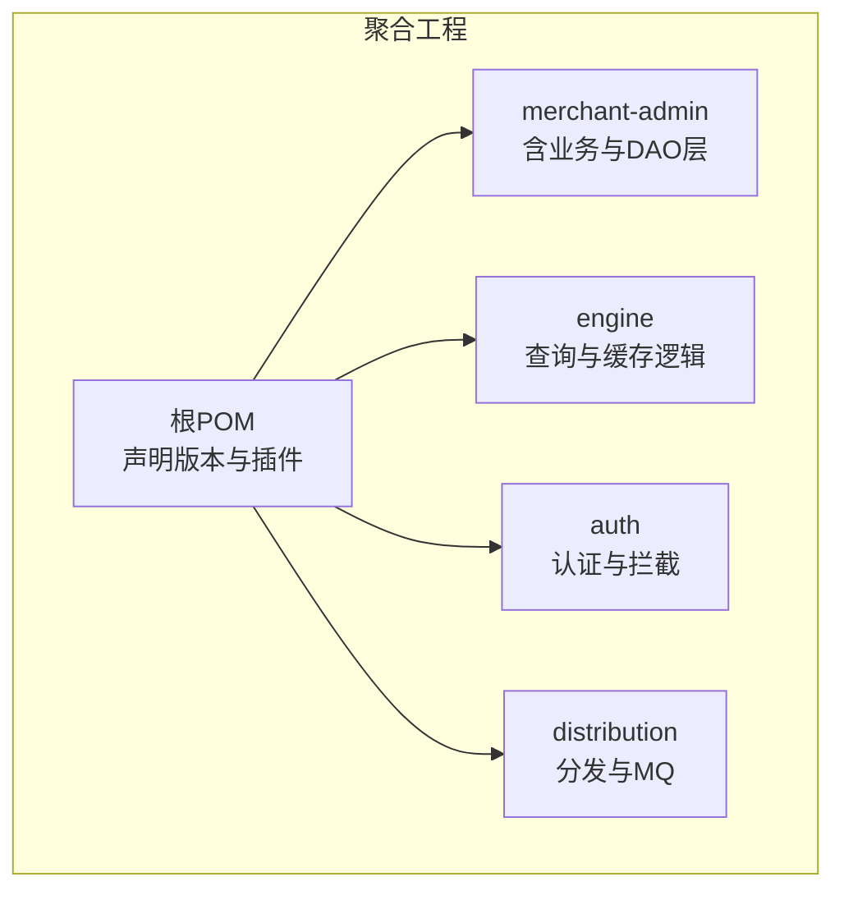
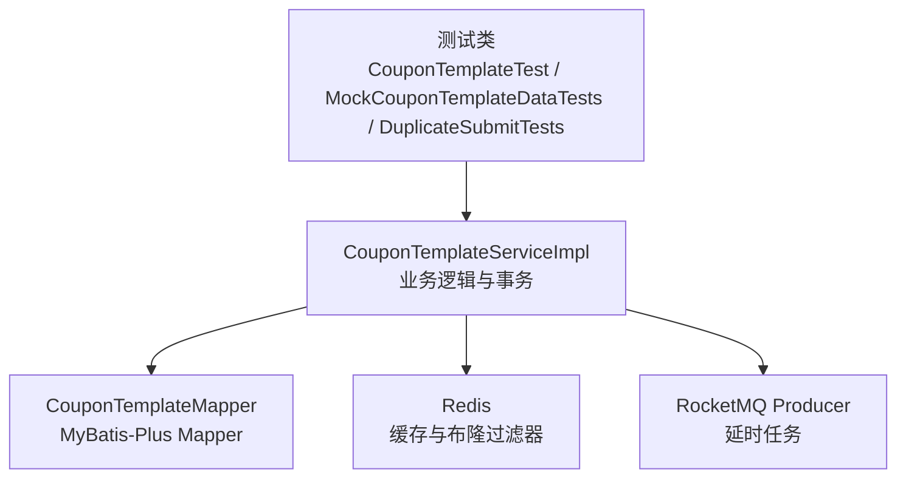
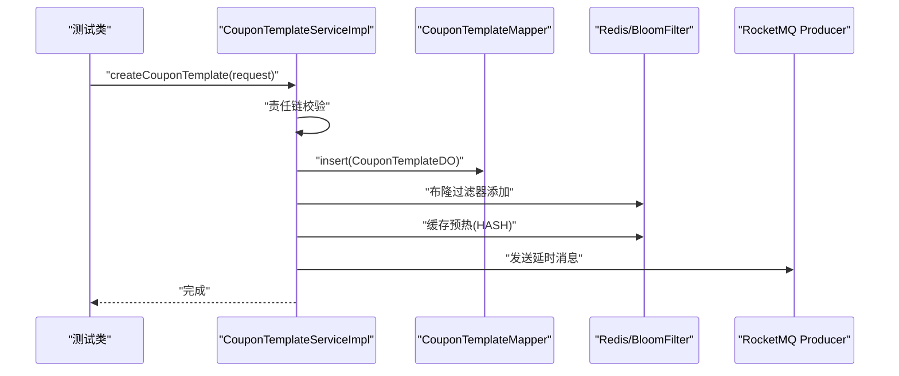
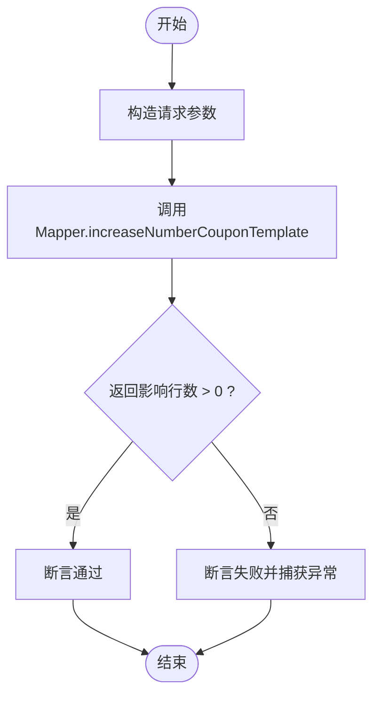
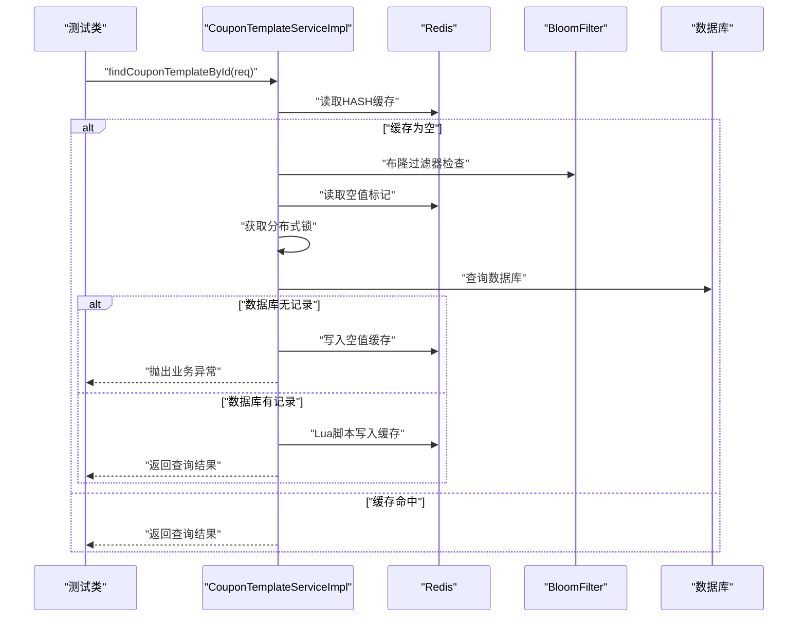
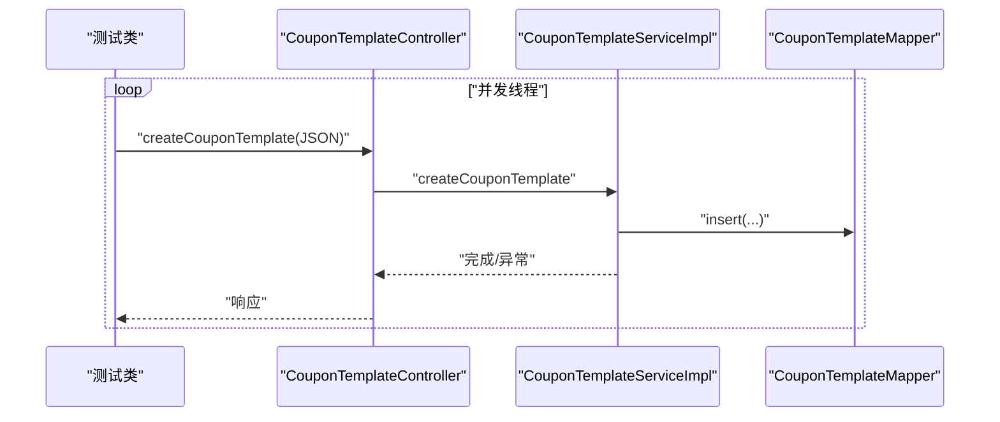
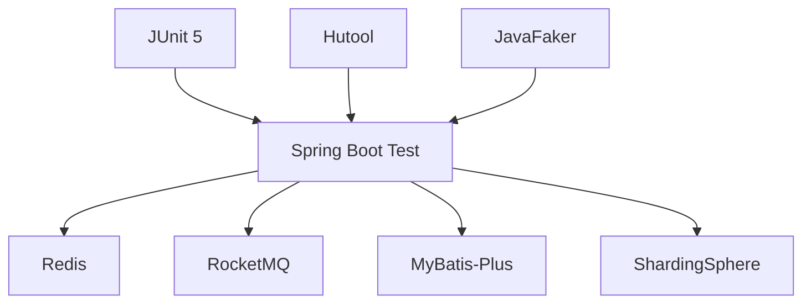

# 单元测试

<cite>
**本文引用的文件**
- [pom.xml](file://pom.xml)
- [merchant-admin/pom.xml](file://merchant-admin/pom.xml)
- [engine/pom.xml](file://engine/pom.xml)
- [auth/pom.xml](file://auth/pom.xml)
- [distribution/pom.xml](file://distribution/pom.xml)
- [merchant-admin/src/test/java/com/fengxin/test/CouponTemplateTest.java](file://merchant-admin/src/test/java/com/fengxin/test/CouponTemplateTest.java)
- [merchant-admin/src/test/java/com/fengxin/test/FakerTest.java](file://merchant-admin/src/test/java/com/fengxin/test/FakerTest.java)
- [merchant-admin/src/test/java/com/fengxin/test/MockCouponTemplateDataTests.java](file://merchant-admin/src/test/java/com/fengxin/test/MockCouponTemplateDataTests.java)
- [merchant-admin/src/test/java/com/fengxin/test/CouponTemplateCreateDuplicateSubmitTests.java](file://merchant-admin/src/test/java/com/fengxin/test/CouponTemplateCreateDuplicateSubmitTests.java)
- [merchant-admin/src/main/java/com/fengxin/maplecoupon/merchantadmin/service/CouponTemplateService.java](file://merchant-admin/src/main/java/com/fengxin/maplecoupon/merchantadmin/service/CouponTemplateService.java)
- [merchant-admin/src/main/java/com/fengxin/maplecoupon/merchantadmin/service/impl/CouponTemplateServiceImpl.java](file://merchant-admin/src/main/java/com/fengxin/maplecoupon/merchantadmin/service/impl/CouponTemplateServiceImpl.java)
- [merchant-admin/src/main/java/com/fengxin/maplecoupon/merchantadmin/dao/mapper/CouponTemplateMapper.java](file://merchant-admin/src/main/java/com/fengxin/maplecoupon/merchantadmin/dao/mapper/CouponTemplateMapper.java)
- [engine/src/main/java/com/fengxin/maplecoupon/engine/service/CouponTemplateService.java](file://engine/src/main/java/com/fengxin/maplecoupon/engine/service/CouponTemplateService.java)
- [engine/src/main/java/com/fengxin/maplecoupon/engine/service/impl/CouponTemplateServiceImpl.java](file://engine/src/main/java/com/fengxin/maplecoupon/engine/service/impl/CouponTemplateServiceImpl.java)
</cite>

## 目录
1. [简介](#简介)
2. [项目结构](#项目结构)
3. [核心组件](#核心组件)
4. [架构总览](#架构总览)
5. [详细组件分析](#详细组件分析)
6. [依赖分析](#依赖分析)
7. [性能考虑](#性能考虑)
8. [故障排查指南](#故障排查指南)
9. [结论](#结论)
10. [附录](#附录)

## 简介
本文件面向MapleCoupon项目的单元测试设计与实施，系统性阐述测试原则、最佳实践与落地方案，覆盖业务逻辑（优惠券模板创建、保存、查询）与数据访问层（DAO层方法与数据库交互）的测试策略；同时给出基于JUnit 5与Mockito的测试示例路径、测试覆盖率要求与度量方法、测试环境配置与测试数据管理策略，帮助开发者高效构建高质量的单元测试体系。

## 项目结构
MapleCoupon采用多模块聚合工程，单元测试主要集中在后管模块merchant-admin及其相关模块。测试依赖统一由各模块的pom.xml声明，Spring Boot Test用于集成测试场景，部分测试使用Hutool与JavaFaker生成随机测试数据。

图表来源
- [pom.xml:1-195](file://pom.xml#L1-L195)
- [merchant-admin/pom.xml:33-111](file://merchant-admin/pom.xml#L33-L111)
- [engine/pom.xml:34-128](file://engine/pom.xml#L34-L128)
- [auth/pom.xml:34-72](file://auth/pom.xml#L34-L72)
- [distribution/pom.xml:34-72](file://distribution/pom.xml#L34-L72)

章节来源
- [pom.xml:1-195](file://pom.xml#L1-L195)
- [merchant-admin/pom.xml:33-111](file://merchant-admin/pom.xml#L33-L111)
- [engine/pom.xml:34-128](file://engine/pom.xml#L34-L128)
- [auth/pom.xml:34-72](file://auth/pom.xml#L34-L72)
- [distribution/pom.xml:34-72](file://distribution/pom.xml#L34-L72)

## 核心组件
- 优惠券模板业务接口与实现：位于merchant-admin模块，提供创建、查询、分页、终止、增发、删除等能力，并集成布隆过滤器、Redis缓存与RocketMQ延时任务。
- 引擎模块查询服务：提供按ID与店铺号查询模板、分布式锁与Lua脚本缓存写入等高并发保障机制。
- DAO层与Mapper：MyBatis-Plus基础能力，支持分页、条件查询与自定义SQL。

章节来源
- [merchant-admin/src/main/java/com/fengxin/maplecoupon/merchantadmin/service/CouponTemplateService.java:1-54](file://merchant-admin/src/main/java/com/fengxin/maplecoupon/merchantadmin/service/CouponTemplateService.java#L1-L54)
- [merchant-admin/src/main/java/com/fengxin/maplecoupon/merchantadmin/service/impl/CouponTemplateServiceImpl.java:1-243](file://merchant-admin/src/main/java/com/fengxin/maplecoupon/merchantadmin/service/impl/CouponTemplateServiceImpl.java#L1-L243)
- [merchant-admin/src/main/java/com/fengxin/maplecoupon/merchantadmin/dao/mapper/CouponTemplateMapper.java:1-27](file://merchant-admin/src/main/java/com/fengxin/maplecoupon/merchantadmin/dao/mapper/CouponTemplateMapper.java#L1-L27)
- [engine/src/main/java/com/fengxin/maplecoupon/engine/service/CouponTemplateService.java:1-38](file://engine/src/main/java/com/fengxin/maplecoupon/engine/service/CouponTemplateService.java#L1-L38)
- [engine/src/main/java/com/fengxin/maplecoupon/engine/service/impl/CouponTemplateServiceImpl.java:1-179](file://engine/src/main/java/com/fengxin/maplecoupon/engine/service/impl/CouponTemplateServiceImpl.java#L1-L179)

## 架构总览
下图展示测试关注点：业务层（Service）与DAO层（Mapper）之间的调用关系，以及与外部组件（Redis、布隆过滤器、RocketMQ）的交互。

图表来源
- [merchant-admin/src/test/java/com/fengxin/test/CouponTemplateTest.java:1-62](file://merchant-admin/src/test/java/com/fengxin/test/CouponTemplateTest.java#L1-L62)
- [merchant-admin/src/test/java/com/fengxin/test/MockCouponTemplateDataTests.java:1-65](file://merchant-admin/src/test/java/com/fengxin/test/MockCouponTemplateDataTests.java#L1-L65)
- [merchant-admin/src/test/java/com/fengxin/test/CouponTemplateCreateDuplicateSubmitTests.java:1-71](file://merchant-admin/src/test/java/com/fengxin/test/CouponTemplateCreateDuplicateSubmitTests.java#L1-L71)
- [merchant-admin/src/main/java/com/fengxin/maplecoupon/merchantadmin/service/impl/CouponTemplateServiceImpl.java:1-243](file://merchant-admin/src/main/java/com/fengxin/maplecoupon/merchantadmin/service/impl/CouponTemplateServiceImpl.java#L1-L243)
- [merchant-admin/src/main/java/com/fengxin/maplecoupon/merchantadmin/dao/mapper/CouponTemplateMapper.java:1-27](file://merchant-admin/src/main/java/com/fengxin/maplecoupon/merchantadmin/dao/mapper/CouponTemplateMapper.java#L1-L27)

## 详细组件分析

### 业务逻辑测试：优惠券模板创建、保存与查询
- 设计原则
  - 使用Spring Boot Test加载上下文，确保注入的Service具备真实事务、缓存与MQ能力。
  - 使用Hutool断言与FastJSON构造复杂规则字段，保证测试数据结构与生产一致。
  - 通过构建器模式组装DO对象，避免遗漏关键字段。
- 测试策略
  - 创建流程：校验责任链校验、状态设置、布隆过滤器添加、Redis缓存预热、延时消息发送。
  - 保存流程：直接调用Service.save（继承自IService），验证返回成功。
  - 查询流程：引擎侧提供按ID+店铺号查询，带分布式锁与Lua脚本写入缓存。
- 断言方法
  - 使用Hutool断言验证保存结果。
  - 使用异常断言验证越权、状态异常等边界条件（结合业务实现抛出的ClientException/ServiceException）。
- 测试数据准备
  - 使用构建器快速生成标准测试数据。
  - 使用JavaFaker生成随机字符串作为测试占位数据（见FakerTest）。

图表来源
- [merchant-admin/src/main/java/com/fengxin/maplecoupon/merchantadmin/service/impl/CouponTemplateServiceImpl.java:84-124](file://merchant-admin/src/main/java/com/fengxin/maplecoupon/merchantadmin/service/impl/CouponTemplateServiceImpl.java#L84-L124)
- [merchant-admin/src/main/java/com/fengxin/maplecoupon/merchantadmin/dao/mapper/CouponTemplateMapper.java:14-26](file://merchant-admin/src/main/java/com/fengxin/maplecoupon/merchantadmin/dao/mapper/CouponTemplateMapper.java#L14-L26)

章节来源
- [merchant-admin/src/test/java/com/fengxin/test/CouponTemplateTest.java:1-62](file://merchant-admin/src/test/java/com/fengxin/test/CouponTemplateTest.java#L1-L62)
- [merchant-admin/src/main/java/com/fengxin/maplecoupon/merchantadmin/service/impl/CouponTemplateServiceImpl.java:84-124](file://merchant-admin/src/main/java/com/fengxin/maplecoupon/merchantadmin/service/impl/CouponTemplateServiceImpl.java#L84-L124)
- [merchant-admin/src/main/java/com/fengxin/maplecoupon/merchantadmin/dao/mapper/CouponTemplateMapper.java:14-26](file://merchant-admin/src/main/java/com/fengxin/maplecoupon/merchantadmin/dao/mapper/CouponTemplateMapper.java#L14-L26)

### 数据访问层测试：DAO层方法与数据库交互
- 设计原则
  - 使用Spring Boot Test加载数据源与MyBatis-Plus配置，确保Mapper可被注入。
  - 针对自定义SQL（如增发库存）编写独立测试，验证SQL执行与返回影响行数。
- 测试策略
  - 增发库存：构造请求参数，调用Mapper.increaseNumberCouponTemplate，断言返回值。
  - 并发压力：使用线程池批量插入不同分片键，验证分片与并发稳定性。
- 断言方法
  - 使用断言验证影响行数与异常处理。
- 测试数据准备
  - 使用Snowflake生成不同分片键，模拟多店铺并发写入。

图表来源
- [merchant-admin/src/main/java/com/fengxin/maplecoupon/merchantadmin/dao/mapper/CouponTemplateMapper.java:22-24](file://merchant-admin/src/main/java/com/fengxin/maplecoupon/merchantadmin/dao/mapper/CouponTemplateMapper.java#L22-L24)
- [merchant-admin/src/main/java/com/fengxin/maplecoupon/merchantadmin/service/impl/CouponTemplateServiceImpl.java:160-167](file://merchant-admin/src/main/java/com/fengxin/maplecoupon/merchantadmin/service/impl/CouponTemplateServiceImpl.java#L160-L167)

章节来源
- [merchant-admin/src/test/java/com/fengxin/test/MockCouponTemplateDataTests.java:1-65](file://merchant-admin/src/test/java/com/fengxin/test/MockCouponTemplateDataTests.java#L1-L65)
- [merchant-admin/src/main/java/com/fengxin/maplecoupon/merchantadmin/dao/mapper/CouponTemplateMapper.java:22-24](file://merchant-admin/src/main/java/com/fengxin/maplecoupon/merchantadmin/dao/mapper/CouponTemplateMapper.java#L22-L24)
- [merchant-admin/src/main/java/com/fengxin/maplecoupon/merchantadmin/service/impl/CouponTemplateServiceImpl.java:160-167](file://merchant-admin/src/main/java/com/fengxin/maplecoupon/merchantadmin/service/impl/CouponTemplateServiceImpl.java#L160-L167)

### 引擎模块查询测试：缓存穿透与分布式锁
- 设计原则
  - 模拟缓存未命中、布隆过滤器命中、空值缓存与分布式锁竞争场景。
  - 使用Lua脚本原子写入缓存，验证过期时间设置。
- 测试策略
  - 缓存击穿防护：验证双重检查锁与Lua脚本写入。
  - 空值缓存：当数据库无记录时写入空值缓存并抛出业务异常。
  - 分片查询：按店铺号分库分表查询模板列表。
- 断言方法
  - 断言返回对象字段一致性、异常类型与消息。
- 测试数据准备
  - 使用随机ID与有效状态组合构造查询参数。

图表来源
- [engine/src/main/java/com/fengxin/maplecoupon/engine/service/impl/CouponTemplateServiceImpl.java:50-132](file://engine/src/main/java/com/fengxin/maplecoupon/engine/service/impl/CouponTemplateServiceImpl.java#L50-L132)

章节来源
- [engine/src/main/java/com/fengxin/maplecoupon/engine/service/impl/CouponTemplateServiceImpl.java:50-132](file://engine/src/main/java/com/fengxin/maplecoupon/engine/service/impl/CouponTemplateServiceImpl.java#L50-L132)

### 并发与幂等测试：重复提交
- 设计原则
  - 使用线程池并发触发控制器创建接口，模拟高并发重复提交。
  - 使用MockHttpServletRequest与RequestContextHolder绑定请求上下文。
- 测试策略
  - 多线程并发调用控制器，验证幂等控制与异常处理。
- 断言方法
  - 捕获异常并记录错误日志，确保主线程等待所有子线程完成。

图表来源
- [merchant-admin/src/test/java/com/fengxin/test/CouponTemplateCreateDuplicateSubmitTests.java:32-69](file://merchant-admin/src/test/java/com/fengxin/test/CouponTemplateCreateDuplicateSubmitTests.java#L32-L69)

章节来源
- [merchant-admin/src/test/java/com/fengxin/test/CouponTemplateCreateDuplicateSubmitTests.java:1-71](file://merchant-admin/src/test/java/com/fengxin/test/CouponTemplateCreateDuplicateSubmitTests.java#L1-L71)

## 依赖分析
- 测试框架与工具
  - JUnit 5：测试生命周期与并发执行。
  - Spring Boot Test：加载ApplicationContext，注入Bean。
  - Hutool：断言与工具方法。
  - JavaFaker：生成随机测试数据。
- 外部组件
  - Redis：缓存与布隆过滤器。
  - RocketMQ：延时消息。
  - MyBatis-Plus：ORM与Mapper。
  - ShardingSphere：分库分表（测试中体现为分片键与分片算法）。

图表来源
- [pom.xml:61-182](file://pom.xml#L61-L182)
- [merchant-admin/pom.xml:107-111](file://merchant-admin/pom.xml#L107-L111)

章节来源
- [pom.xml:61-182](file://pom.xml#L61-L182)
- [merchant-admin/pom.xml:107-111](file://merchant-admin/pom.xml#L107-L111)

## 性能考虑
- 并发测试
  - 使用线程池并发插入与创建，评估数据库与分片策略在高并发下的表现。
- 缓存与布隆过滤器
  - 验证缓存预热、空值缓存与Lua脚本写入的性能收益。
- 延时消息
  - 验证延时消息的可靠性与消费端处理能力。

## 故障排查指南
- 常见问题
  - 越权访问：业务层对店铺号与模板ID进行校验，若不匹配抛出客户端异常。
  - 状态异常：模板已结束或删除状态下禁止继续操作。
  - 缓存未命中：需检查布隆过滤器与空值缓存逻辑。
- 定位手段
  - 通过日志记录与异常栈定位具体环节。
  - 使用断言区分正常路径与异常路径。

章节来源
- [merchant-admin/src/main/java/com/fengxin/maplecoupon/merchantadmin/service/impl/CouponTemplateServiceImpl.java:144-167](file://merchant-admin/src/main/java/com/fengxin/maplecoupon/merchantadmin/service/impl/CouponTemplateServiceImpl.java#L144-L167)
- [merchant-admin/src/main/java/com/fengxin/maplecoupon/merchantadmin/service/impl/CouponTemplateServiceImpl.java:177-207](file://merchant-admin/src/main/java/com/fengxin/maplecoupon/merchantadmin/service/impl/CouponTemplateServiceImpl.java#L177-L207)
- [engine/src/main/java/com/fengxin/maplecoupon/engine/service/impl/CouponTemplateServiceImpl.java:50-132](file://engine/src/main/java/com/fengxin/maplecoupon/engine/service/impl/CouponTemplateServiceImpl.java#L50-L132)

## 结论
通过将业务逻辑、DAO层、缓存与消息队列纳入单元测试范围，结合并发与幂等测试，能够有效提升MapleCoupon系统的稳定性与可维护性。建议持续完善测试覆盖，强化边界与异常场景，并引入自动化覆盖率统计以指导后续优化。

## 附录

### 单元测试编写规范与最佳实践
- 测试命名
  - 使用语义化命名，如“testCreateCouponTemplate_Success”、“testIncreaseNumber_InvalidStatus_ThrowException”。
- 测试组织
  - 每个业务方法至少覆盖正常路径与典型异常路径。
- 断言策略
  - 使用精确断言（布尔、数值、异常类型与消息）。
- 测试隔离
  - 使用事务回滚或测试专用数据库实例，避免污染生产数据。
- 数据准备
  - 使用构建器与工厂方法生成最小可验证数据集；必要时使用随机数据生成器。

### 测试覆盖率要求与度量
- 覆盖率目标
  - 业务层（Service）行覆盖率≥80%，分支覆盖率≥60%。
  - DAO层（Mapper）行覆盖率≥70%，分支覆盖率≥50%。
- 度量方法
  - 使用JaCoCo或IDE内置覆盖率工具统计；在CI中设置阈值门禁。
- 报告输出
  - 在构建阶段生成覆盖率报告并上传至制品库或覆盖率平台。

### 测试环境配置与测试数据管理
- 测试环境
  - 使用独立的application-test.yaml或通过JVM参数切换profile。
  - 配置独立的数据源与Redis实例，避免与生产冲突。
- 测试数据管理
  - 使用雪花ID作为分片键，模拟多租户与多店铺并发。
  - 使用JavaFaker生成随机字符串与数字，提高测试多样性。
  - 对于幂等与并发测试，使用线程池与请求上下文绑定工具。

章节来源
- [merchant-admin/src/test/java/com/fengxin/test/FakerTest.java:1-34](file://merchant-admin/src/test/java/com/fengxin/test/FakerTest.java#L1-L34)
- [merchant-admin/src/test/java/com/fengxin/test/MockCouponTemplateDataTests.java:34-62](file://merchant-admin/src/test/java/com/fengxin/test/MockCouponTemplateDataTests.java#L34-L62)
- [merchant-admin/src/test/java/com/fengxin/test/CouponTemplateCreateDuplicateSubmitTests.java:50-69](file://merchant-admin/src/test/java/com/fengxin/test/CouponTemplateCreateDuplicateSubmitTests.java#L50-L69)