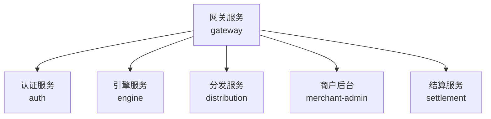
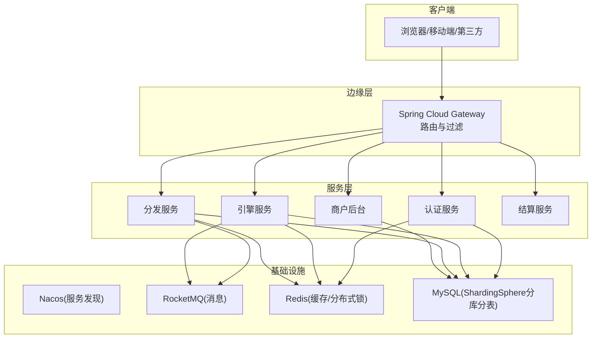
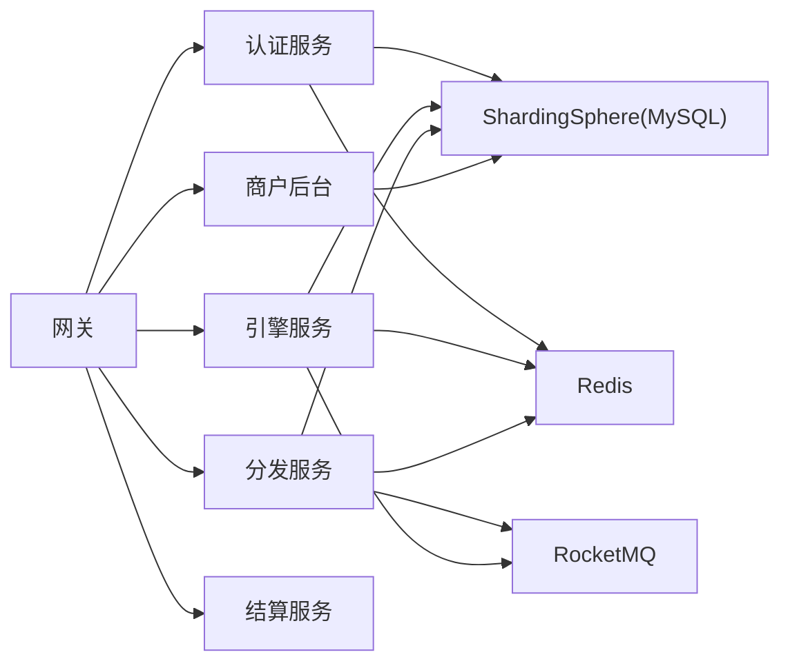

# 性能测试

<cite>
**本文引用的文件**
- [README.md](file://README.md)
- [application.yml（网关）](file://gateway/src/main/resources/application.yml)
- [GateWayApplication.java](file://gateway/src/main/java/com/fengxin/maplecoupon/gateway/GateWayApplication.java)
- [application.yaml（认证）](file://auth/src/main/resources/application.yaml)
- [AuthApplication.java](file://auth/src/main/java/com/fengxin/maplecoupon/auth/AuthApplication.java)
- [application.yaml（引擎）](file://engine/src/main/resources/application.yaml)
- [EngineApplication.java](file://engine/src/main/java/com/fengxin/maplecoupon/engine/EngineApplication.java)
- [application.yaml（分发）](file://distribution/src/main/resources/application.yaml)
- [DistributionApplication.java](file://distribution/src/main/java/com/fengxin/maplecoupon/distribution/DistributionApplication.java)
- [application.yaml（商户后台）](file://merchant-admin/src/main/resources/application.yaml)
- [MerchantAdminApplication.java](file://merchant-admin/src/main/java/com/fengxin/maplecoupon/merchantadmin/MerchantAdminApplication.java)
- [UserController.java（认证）](file://auth/src/main/java/com/fengxin/maplecoupon/auth/controller/UserController.java)
- [CouponTemplateController（引擎）](file://engine/src/main/java/com/fengxin/maplecoupon/engine/controller/CouponTemplateController.java)
- [CouponTemplateController（商户后台）](file://merchant-admin/src/main/java/com/fengxin/maplecoupon/merchantadmin/controller/CouponTemplateController.java)
</cite>

## 目录
1. [引言](#引言)
2. [项目结构](#项目结构)
3. [核心组件](#核心组件)
4. [架构总览](#架构总览)
5. [详细组件分析](#详细组件分析)
6. [依赖分析](#依赖分析)
7. [性能考虑](#性能考虑)
8. [故障排查指南](#故障排查指南)
9. [结论](#结论)
10. [附录](#附录)

## 引言
本性能测试文档面向MapleCoupon项目，目标是建立系统化的性能测试体系，覆盖负载测试、压力测试与稳定性测试，明确并发测试的配置与执行方法，评估高并发场景下的系统表现并识别瓶颈；同时定义性能指标（响应时间、吞吐量、资源利用率、错误率）的采集与分析方法，给出性能测试工具（如JMeter、LoadRunner）的使用指南与脚本编写要点，规划测试环境搭建（测试数据准备、测试场景设计、结果分析），并提出性能优化与系统调优策略及性能回归测试实施方案。

## 项目结构
MapleCoupon采用微服务架构，包含以下核心服务：
- 网关服务（gateway）：统一入口与路由转发，负责跨域、鉴权过滤等。
- 认证服务（auth）：用户注册、登录、信息查询等。
- 引擎服务（engine）：优惠券模板查询、用户优惠券相关核心能力。
- 分发服务（distribution）：优惠券批量分发、任务分发与消息处理。
- 商户后台（merchant-admin）：优惠券模板创建、分页查询、增发、终止与删除等管理能力。
- settlement：结算查询等（在本仓库中为独立模块，参与查询类场景）。

图表来源
- [application.yml（网关）:17-58](file://gateway/src/main/resources/application.yml#L17-L58)

章节来源
- [README.md:1-10](file://README.md#L1-L10)
- [application.yml（网关）:1-72](file://gateway/src/main/resources/application.yml#L1-L72)

## 核心组件
- 网关（Gateway）
  - 路由规则：将/api/auth、/api/engine、/api/distribution、/api/merchant-admin、/api/settlement等路径转发至对应服务。
  - 过滤器：TokenValidate用于鉴权白名单/黑名单控制。
  - 指标暴露：management.endpoints.web.exposure.include开启全部端点，便于性能监控与健康检查。
- 认证服务（Auth）
  - 提供用户注册、登录、信息查询等REST接口，端口10070。
- 引擎服务（Engine）
  - 提供优惠券模板查询等接口，端口10020。
- 分发服务（Distribution）
  - 提供任务分发、库存扣减等能力，端口10040。
- 商户后台（Merchant Admin）
  - 提供优惠券模板的创建、分页查询、增发、终止、删除等接口，端口10010。

章节来源
- [application.yml（网关）:17-72](file://gateway/src/main/resources/application.yml#L17-L72)
- [application.yaml（认证）:1-19](file://auth/src/main/resources/application.yaml#L1-L19)
- [application.yaml（引擎）:1-22](file://engine/src/main/resources/application.yaml#L1-L22)
- [application.yaml（分发）:1-15](file://distribution/src/main/resources/application.yaml#L1-L15)
- [application.yaml（商户后台）:1-27](file://merchant-admin/src/main/resources/application.yaml#L1-L27)

## 架构总览
下图展示了请求从网关进入，经路由到各微服务的典型链路，以及与外部组件（数据库、消息队列、缓存）的关系。

图表来源
- [application.yml（网关）:17-58](file://gateway/src/main/resources/application.yml#L17-L58)
- [README.md:4-4](file://README.md#L4-L4)

## 详细组件分析

### 组件A：认证服务（Auth）性能测试要点
- 接口示例
  - 注册：POST /api/auth/user/register
  - 登录：POST /api/auth/user/login
  - 查询用户：GET /api/auth/admin/user/{username}
- 并发关注点
  - 高并发注册/登录场景下的数据库写入压力与幂等性校验。
  - 用户名存在性检查接口的热点查询与缓存命中率。
- 测试建议
  - 使用JMeter构建注册/登录事务，设置Ramp-Up与并发用户数，观察数据库连接池与ShardingSphere分片行为。
  - 关注认证服务线程池、连接池、Redis缓存命中率与RocketMQ消费延迟。

章节来源
- [UserController.java（认证）:48-79](file://auth/src/main/java/com/fengxin/maplecoupon/auth/controller/UserController.java#L48-L79)
- [application.yaml（认证）:1-19](file://auth/src/main/resources/application.yaml#L1-L19)

### 组件B：引擎服务（Engine）性能测试要点
- 接口示例
  - 查询优惠券模板：GET /api/engine/coupon-template/query
- 并发关注点
  - 模板查询的热点读取与数据库分片查询性能。
  - 库存扣减Lua脚本与缓存一致性在高并发下的表现。
- 测试建议
  - 设计“查询模板+库存扣减”复合场景，评估Lua脚本与缓存协同的吞吐与延迟。
  - 关注数据库连接池、分片算法与慢查询日志。

章节来源
- [CouponTemplateController（引擎）:27-31](file://engine/src/main/java/com/fengxin/maplecoupon/engine/controller/CouponTemplateController.java#L27-L31)
- [application.yaml（引擎）:16-22](file://engine/src/main/resources/application.yaml#L16-L22)

### 组件C：分发服务（Distribution）性能测试要点
- 关注点
  - 批量分发任务的生产与消费吞吐，消息积压与重试。
  - Lua库存扣减与用户记录批量保存的原子性与性能。
- 测试建议
  - 基于消息驱动的场景，构造高并发分发任务，观察消息队列堆积与消费者处理速率。
  - 对比“直写缓存”与“Binlog解析”两种策略在高并发下的差异。

章节来源
- [application.yaml（分发）:1-15](file://distribution/src/main/resources/application.yaml#L1-L15)

### 组件D：商户后台（Merchant Admin）性能测试要点
- 接口示例
  - 创建模板：POST /api/merchant-admin/coupon-template/create
  - 分页查询：GET /api/merchant-admin/coupon-template/page
  - 增发模板：POST /api/merchant-admin/coupon-template/increase-number
  - 终止模板：POST /api/merchant-admin/coupon-template/terminate
- 并发关注点
  - 模板创建与增发的幂等性与数据库写入压力。
  - 分页查询在大数据量下的分片查询与排序性能。
- 测试建议
  - 使用JMeter模拟模板创建与增发的峰值场景，结合数据库慢查询与分片日志分析瓶颈。

章节来源
- [CouponTemplateController（商户后台）:31-64](file://merchant-admin/src/main/java/com/fengxin/maplecoupon/merchantadmin/controller/CouponTemplateController.java#L31-L64)
- [application.yaml（商户后台）:16-27](file://merchant-admin/src/main/resources/application.yaml#L16-L27)

### 组件E：网关（Gateway）性能测试要点
- 关注点
  - 路由转发与过滤器链路的延迟与吞吐。
  - 跨域与鉴权过滤对整体性能的影响。
- 测试建议
  - 对不同路由与过滤器组合进行对比测试，评估网关在高并发下的CPU与内存占用。

章节来源
- [application.yml（网关）:17-64](file://gateway/src/main/resources/application.yml#L17-L64)
- [GateWayApplication.java:14-16](file://gateway/src/main/java/com/fengxin/maplecoupon/gateway/GateWayApplication.java#L14-L16)

## 依赖分析
- 服务间通信
  - 网关作为统一入口，将请求路由到各微服务。
  - 认证服务与引擎服务均使用ShardingSphere进行分库分表，需关注分片键与SQL分布。
- 外部依赖
  - RocketMQ用于异步解耦与削峰填谷。
  - Redis用于缓存与分布式锁，高并发下需关注热点键与过期策略。
- 指标暴露
  - 网关开启management.endpoints.web.exposure.include，便于Prometheus/Grafana采集。

图表来源
- [application.yml（网关）:17-58](file://gateway/src/main/resources/application.yml#L17-L58)
- [README.md:4-4](file://README.md#L4-L4)

章节来源
- [application.yml（网关）:65-72](file://gateway/src/main/resources/application.yml#L65-L72)
- [application.yaml（认证）:6-8](file://auth/src/main/resources/application.yaml#L6-L8)
- [application.yaml（引擎）:6-8](file://engine/src/main/resources/application.yaml#L6-L8)
- [application.yaml（分发）:6-8](file://distribution/src/main/resources/application.yaml#L6-L8)
- [application.yaml（商户后台）:8-10](file://merchant-admin/src/main/resources/application.yaml#L8-L10)

## 性能考虑
- 响应时间
  - 定义P50/P90/P99响应时间阈值，区分网关、服务内部与数据库三层延迟。
- 吞吐量
  - QPS（每秒事务数）与TPS（每秒查询数），关注热点接口与分片热点。
- 资源利用率
  - CPU、内存、线程池、数据库连接池、Redis连接池、消息队列堆积。
- 错误率
  - 业务错误与系统错误（超时、限流、熔断）的分类统计。

章节来源
- [application.yml（网关）:65-72](file://gateway/src/main/resources/application.yml#L65-L72)

## 故障排查指南
- 常见问题定位
  - 热点接口延迟升高：优先检查缓存命中率、数据库慢查询、分片热点。
  - 并发下库存超卖：核查Lua脚本与事务边界、Redis扣减与数据库一致性。
  - 消息积压：检查消费者并发、消息分区、重试策略与死信队列。
- 工具与指标
  - 使用Prometheus/Grafana采集JVM、数据库、Redis与消息队列指标。
  - 结合链路追踪（如SkyWalking）定位慢调用链路。

章节来源
- [application.yml（网关）:65-72](file://gateway/src/main/resources/application.yml#L65-L72)

## 结论
通过分层的性能测试设计与持续的监控告警，MapleCoupon可在高并发场景下保持稳定的服务质量。建议优先围绕热点接口（注册/登录、模板查询、库存扣减、模板增发）构建基准测试与回归测试，结合消息驱动与缓存策略进行容量规划与调优。

## 附录

### A. 性能测试设计原则与实施策略
- 负载测试
  - 以稳定基线逐步加压，观察系统在预期峰值下的表现，识别容量瓶颈。
- 压力测试
  - 超出系统设计上限，观察系统极限与恢复能力，定位软硬件阈值。
- 稳定性测试
  - 长时间高负载运行，监测内存泄漏、连接泄露与资源抖动。

### B. 并发测试配置与执行
- 并发模型
  - 采用阶梯式并发（如10→50→100→200），观察QPS与延迟拐点。
  - 区分读多写少与读写混合场景，针对热点接口单独压测。
- 高并发评估
  - 关注数据库连接池饱和度、ShardingSphere分片路由效率、Redis热点键与过期策略、消息队列堆积与消费速率。

### C. 性能指标定义与测量
- 响应时间：P50/P90/P99；网关、服务、数据库三层拆分。
- 吞吐量：QPS/TPS；区分成功与失败。
- 资源利用率：CPU、内存、线程池、数据库/Redis连接池、消息队列。
- 错误率：业务错误与系统错误分类统计。

### D. 性能测试工具使用指南
- JMeter
  - 场景设计：按业务流程构建事务，设置并发用户、循环次数与Ramp-Up。
  - 脚本编写：使用HTTP请求配置接口路径、参数与断言；使用聚合报告收集指标。
  - 采样器：针对注册/登录、模板查询、增发等接口分别建模。
- LoadRunner
  - 场景录制与回放：基于Swagger接口文档生成脚本，设置虚拟用户与思考时间。
  - 监控：结合系统监控采集CPU、内存、数据库连接数等。

### E. 性能测试环境搭建
- 测试数据准备
  - 构造真实业务数据集（用户、模板、库存、任务），避免冷启动偏差。
- 测试场景设计
  - 峰值场景：注册/登录、模板查询、库存扣减、模板增发。
  - 极端场景：消息积压、数据库连接池耗尽、缓存穿透。
- 测试结果分析
  - 使用聚合报告与趋势图分析延迟与错误率变化，定位瓶颈。

### F. 性能优化与系统调优策略
- 缓存优化
  - 热点数据预热、合理过期策略、热点键拆分与多级缓存。
- 数据库优化
  - 分片键选择、索引优化、慢查询分析、连接池参数调优。
- 消息优化
  - 分区扩展、消费者并发、重试与死信队列策略。
- 网关优化
  - 过滤器链路简化、路由规则优化、跨域与鉴权策略调整。

### G. 性能回归测试实施
- 回归策略
  - 将关键接口纳入CI流水线，每次发布执行基准测试，对比历史指标。
- 告警与报告
  - 延迟与错误率超过阈值触发告警，输出测试报告与根因分析。