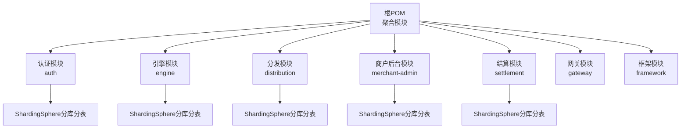
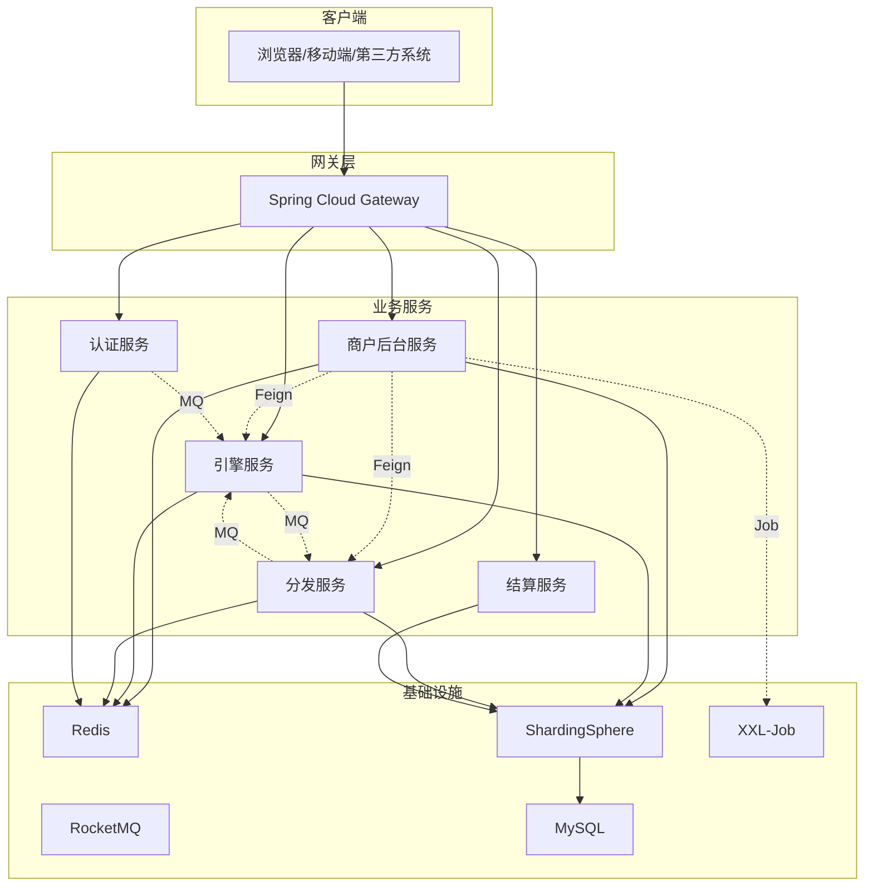
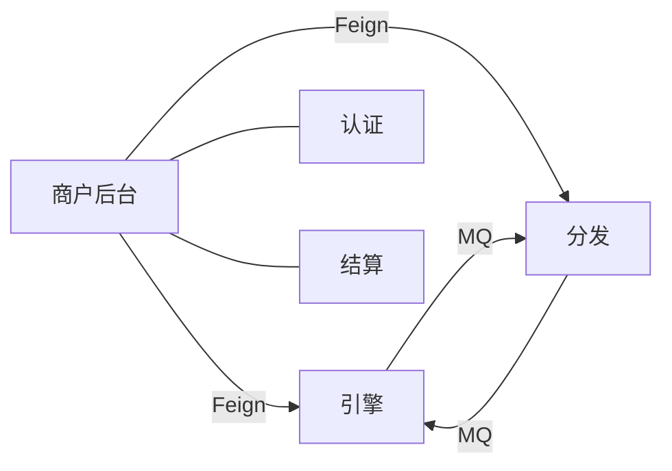

# 测试策略

<cite>
**本文引用的文件**
- [pom.xml](file://pom.xml)
- [README.md](file://README.md)
- [application.yaml（认证）](file://auth/src/main/resources/application.yaml)
- [application.yaml（引擎）](file://engine/src/main/resources/application.yaml)
- [application.yaml（分发）](file://distribution/src/main/resources/application.yaml)
- [application.yaml（商户后台）](file://merchant-admin/src/main/resources/application.yaml)
- [application.yaml（结算）](file://settlement/src/main/resources/application.yaml)
- [CouponTemplateTest.java](file://merchant-admin/src/test/java/com/fengxin/test/CouponTemplateTest.java)
- [CouponTemplateCreateDuplicateSubmitTests.java](file://merchant-admin/src/test/java/com/fengxin/test/CouponTemplateCreateDuplicateSubmitTests.java)
- [ExcelGenerateTests.java](file://merchant-admin/src/test/java/com/fengxin/test/ExcelGenerateTests.java)
- [MockCouponTemplateDataTests.java](file://merchant-admin/src/test/java/com/fengxin/test/MockCouponTemplateDataTests.java)
- [FakerTest.java](file://merchant-admin/src/test/java/com/fengxin/test/FakerTest.java)
</cite>

## 目录
1. [引言](#引言)
2. [项目结构](#项目结构)
3. [核心组件](#核心组件)
4. [架构总览](#架构总览)
5. [详细组件分析](#详细组件分析)
6. [依赖分析](#依赖分析)
7. [性能考虑](#性能考虑)
8. [故障排查指南](#故障排查指南)
9. [结论](#结论)
10. [附录](#附录)

## 引言
本测试策略文档面向MapleCoupon项目，旨在建立覆盖单元测试、集成测试、接口测试、性能与压力测试、测试数据管理、Mock最佳实践、覆盖率要求、持续集成与自动化测试以及测试报告生成与分析的完整体系。项目采用多模块架构（认证、引擎、分发、商户后台、结算、网关、框架），并广泛使用ShardingSphere分库分表、RocketMQ消息队列、Redis缓存、MyBatis-Plus、XXL-Job等技术栈，测试策略需兼顾业务复杂性与高并发场景。

## 项目结构
- 多模块Maven工程，包含认证(auth)、引擎(engine)、分发(distribution)、商户后台(merchant-admin)、结算(settlement)、网关(gateway)、框架(framework)等模块。
- 各模块均通过Spring Boot启动类暴露REST接口，部分模块包含定时任务与消息消费处理。
- 数据源统一由ShardingSphere驱动，配置文件按环境加载，便于测试隔离。

图表来源
- [pom.xml:17-34](file://pom.xml#L17-L34)
- [application.yaml（认证）:1-19](file://auth/src/main/resources/application.yaml#L1-L19)
- [application.yaml（引擎）:1-22](file://engine/src/main/resources/application.yaml#L1-L22)
- [application.yaml（分发）:1-15](file://distribution/src/main/resources/application.yaml#L1-L15)
- [application.yaml（商户后台）:1-27](file://merchant-admin/src/main/resources/application.yaml#L1-L27)
- [application.yaml（结算）:1-14](file://settlement/src/main/resources/application.yaml#L1-L14)

章节来源
- [pom.xml:17-34](file://pom.xml#L17-L34)
- [README.md:1-10](file://README.md#L1-L10)

## 核心组件
- 认证模块：用户登录、注册、上下文传递、远程服务调用等。
- 引擎模块：优惠券模板查询、用户优惠券管理、提醒与延迟关闭等。
- 分发模块：优惠券任务分发、MQ事件生产与消费、Excel导入导出等。
- 商户后台模块：优惠券模板创建、分页查询、幂等与重复提交防护、定时任务等。
- 结算模块：优惠券查询与结算相关接口。
- 网关模块：请求路由、鉴权过滤、日志记录等。
- 框架模块：全局异常、结果封装、幂等、分布式缓存配置等。

章节来源
- [application.yaml（认证）:1-19](file://auth/src/main/resources/application.yaml#L1-L19)
- [application.yaml（引擎）:1-22](file://engine/src/main/resources/application.yaml#L1-L22)
- [application.yaml（分发）:1-15](file://distribution/src/main/resources/application.yaml#L1-L15)
- [application.yaml（商户后台）:1-27](file://merchant-admin/src/main/resources/application.yaml#L1-L27)
- [application.yaml（结算）:1-14](file://settlement/src/main/resources/application.yaml#L1-L14)

## 架构总览
- 微服务间通过OpenFeign进行声明式远程调用；消息通过RocketMQ解耦；ShardingSphere实现分库分表；Redis用于缓存与分布式锁；XXL-Job负责定时任务调度。
- 测试应覆盖服务端到端链路，包括接口层、业务层、数据访问层与消息队列。

图表来源
- [pom.xml:37-58](file://pom.xml#L37-L58)
- [application.yaml（商户后台）:16-26](file://merchant-admin/src/main/resources/application.yaml#L16-L26)

## 详细组件分析

### 单元测试设计与实现
- 设计原则
  - 隔离性：使用Mock或内存数据库，避免真实依赖。
  - 可重复性：固定随机种子或使用假数据生成器。
  - 可维护性：测试命名清晰、断言明确、前置条件简单。
  - 覆盖率：重点覆盖分支与边界条件。
- 实施要点
  - 使用JUnit 5与Spring Boot Test，结合Mockito进行依赖替换。
  - 对Service层进行纯函数测试，DAO层使用嵌入式数据库或内存数据库。
  - 对枚举、工具类、序列化/反序列化进行独立单元测试。
- 示例参考
  - 商户后台优惠券模板插入与查询：[CouponTemplateTest.java:55-59](file://merchant-admin/src/test/java/com/fengxin/test/CouponTemplateTest.java#L55-L59)
  - 幂等与重复提交防护：[CouponTemplateCreateDuplicateSubmitTests.java:32-69](file://merchant-admin/src/test/java/com/fengxin/test/CouponTemplateCreateDuplicateSubmitTests.java#L32-L69)
  - 随机数据生成：[FakerTest.java:18-33](file://merchant-admin/src/test/java/com/fengxin/test/FakerTest.java#L18-L33)

章节来源
- [CouponTemplateTest.java:55-59](file://merchant-admin/src/test/java/com/fengxin/test/CouponTemplateTest.java#L55-L59)
- [CouponTemplateCreateDuplicateSubmitTests.java:32-69](file://merchant-admin/src/test/java/com/fengxin/test/CouponTemplateCreateDuplicateSubmitTests.java#L32-L69)
- [FakerTest.java:18-33](file://merchant-admin/src/test/java/com/fengxin/test/FakerTest.java#L18-L33)

### 数据访问层测试
- 设计原则
  - 使用事务回滚，确保测试之间无副作用。
  - 使用分库分表算法验证数据路由正确性。
  - 验证SQL映射、参数绑定与返回值一致性。
- 实施要点
  - 基于ShardingSphere配置，编写针对不同分片键的插入/查询测试。
  - 使用H2或内存数据库进行快速回归。
  - 对批量写入、Lua脚本、存储过程等进行专项测试。
- 示例参考
  - 模拟分片与批量写入：[MockCouponTemplateDataTests.java:50-63](file://merchant-admin/src/test/java/com/fengxin/test/MockCouponTemplateDataTests.java#L50-L63)

章节来源
- [MockCouponTemplateDataTests.java:50-63](file://merchant-admin/src/test/java/com/fengxin/test/MockCouponTemplateDataTests.java#L50-L63)

### 接口测试
- 设计原则
  - 覆盖正常路径、异常路径与边界输入。
  - 使用契约测试（如OpenAPI/Swagger）与端到端测试相结合。
  - 对鉴权、限流、幂等字段进行重点校验。
- 实施要点
  - 使用RestAssured或WebTestClient发起HTTP请求。
  - 对认证服务的登录/注册接口、引擎服务的模板查询与核销接口、分发服务的任务分发接口进行测试。
  - 对商户后台的模板创建接口进行并发与重复提交测试。
- 示例参考
  - 并发重复提交测试：[CouponTemplateCreateDuplicateSubmitTests.java:32-69](file://merchant-admin/src/test/java/com/fengxin/test/CouponTemplateCreateDuplicateSubmitTests.java#L32-L69)

章节来源
- [CouponTemplateCreateDuplicateSubmitTests.java:32-69](file://merchant-admin/src/test/java/com/fengxin/test/CouponTemplateCreateDuplicateSubmitTests.java#L32-L69)

### 集成测试策略
- 微服务间集成
  - 使用Contract测试或基于OpenAPI的契约测试，确保Feign接口一致。
  - 通过容器化（Docker）或本地编排（Testcontainers）启动依赖服务，进行端到端链路验证。
- 数据库集成
  - 基于ShardingSphere配置，验证分库分表路由与数据一致性。
  - 使用Flyway/Liquibase进行数据库迁移版本管理，配合测试环境初始化脚本。
- 外部系统集成
  - 对RocketMQ消息发送/消费进行集成测试，模拟消息延迟、重复消费与失败重试。
  - 对Redis缓存写入/读取进行一致性测试，验证过期与淘汰策略。
- 示例参考
  - Excel生成与读取：[ExcelGenerateTests.java:33-53](file://merchant-admin/src/test/java/com/fengxin/test/ExcelGenerateTests.java#L33-L53)

章节来源
- [ExcelGenerateTests.java:33-53](file://merchant-admin/src/test/java/com/fengxin/test/ExcelGenerateTests.java#L33-L53)

### 测试数据准备与管理
- 生成策略
  - 使用JavaFaker生成中文姓名、手机号、邮箱等，保证测试数据的真实性与多样性。
  - 使用Snowflake生成唯一ID，确保分片键分布均匀。
- 清理策略
  - 每个测试类/套件结束后执行清理脚本，删除临时数据。
  - 使用事务回滚或数据库快照恢复机制。
- 隔离策略
  - 为每个测试环境（dev/test/prod）配置独立的数据库实例与Redis命名空间。
  - 使用租户/业务域前缀隔离测试数据。
- 示例参考
  - 随机数据生成：[FakerTest.java:18-33](file://merchant-admin/src/test/java/com/fengxin/test/FakerTest.java#L18-L33)
  - 批量数据写入与清理：[MockCouponTemplateDataTests.java:50-63](file://merchant-admin/src/test/java/com/fengxin/test/MockCouponTemplateDataTests.java#L50-L63)

章节来源
- [FakerTest.java:18-33](file://merchant-admin/src/test/java/com/fengxin/test/FakerTest.java#L18-L33)
- [MockCouponTemplateDataTests.java:50-63](file://merchant-admin/src/test/java/com/fengxin/test/MockCouponTemplateDataTests.java#L50-L63)

### Mock测试最佳实践
- 外部依赖Mock
  - 对Feign远程服务、RocketMQ生产者、Redis客户端进行Mock，避免真实网络交互。
  - 使用MockBean注入，替换默认实现，返回预设响应。
- 测试替身
  - 使用Fake对象（如FakeUserRepository）替代真实DAO，提升测试速度。
  - 使用Stub对异常场景进行模拟，覆盖错误处理分支。
- 注意事项
  - 避免过度Mock导致测试失去价值。
  - 对Mock行为进行断言，确保调用顺序与参数正确。

### 性能测试与压力测试
- 负载测试
  - 使用JMeter或Gatling对关键接口（模板创建、优惠券领取、核销）进行并发压测。
  - 关注TP99、吞吐量与资源占用（CPU、内存、连接池）。
- 并发测试
  - 对重复提交防护、库存扣减、消息消费等高并发场景进行压力验证。
  - 使用线程池模拟高并发请求，观察系统稳定性与数据一致性。
- 场景建议
  - 模板创建：100并发，持续5分钟。
  - 优惠券领取：1000并发，关注库存扣减与Lua脚本性能。
  - MQ消费：模拟百万级消息堆积，验证消费速率与堆积处理。
- 示例参考
  - 并发重复提交测试：[CouponTemplateCreateDuplicateSubmitTests.java:32-69](file://merchant-admin/src/test/java/com/fengxin/test/CouponTemplateCreateDuplicateSubmitTests.java#L32-L69)

章节来源
- [CouponTemplateCreateDuplicateSubmitTests.java:32-69](file://merchant-admin/src/test/java/com/fengxin/test/CouponTemplateCreateDuplicateSubmitTests.java#L32-L69)

### 测试覆盖率要求与度量
- 覆盖率目标
  - 行覆盖率：≥80%
  - 分支覆盖率：≥70%
  - 指令覆盖率：≥85%
- 工具与配置
  - 使用JaCoCo插件生成覆盖率报告，结合SonarQube进行趋势跟踪。
  - 对关键业务路径（库存扣减、消息消费、远程调用）进行强制覆盖率检查。
- 报告输出
  - 在CI流水线中生成HTML与XML报告，作为质量门禁依据。

### 持续集成与自动化测试
- CI流水线建议
  - 触发条件：PR合并请求、主干推送、定时构建。
  - 步骤：安装依赖、编译打包、单元测试与覆盖率、集成测试、静态分析、安全扫描、制品归档。
- 容器化测试
  - 使用Docker Compose启动MySQL、Redis、RocketMQ、ShardingSphere，减少环境差异。
- 测试报告
  - 生成JUnit XML与Coverage报告，上传至CI系统并生成可视化报表。

### 测试报告生成与分析
- 报告内容
  - 测试执行概览、失败用例详情、覆盖率统计、性能指标（TP99、RPS）、资源监控。
- 分析方法
  - 对失败用例进行根因分析，区分偶发与必然失败。
  - 对性能瓶颈定位到具体接口与依赖组件，形成优化闭环。

## 依赖分析
- 模块间依赖
  - 商户后台依赖引擎与分发服务，通过Feign进行远程调用。
  - 引擎与分发通过RocketMQ异步通信，降低耦合。
- 外部依赖
  - ShardingSphere、RocketMQ、Redis、MySQL、XXL-Job等基础设施对测试环境有强依赖。
- 依赖关系图

图表来源
- [pom.xml:37-58](file://pom.xml#L37-L58)

章节来源
- [pom.xml:37-58](file://pom.xml#L37-L58)

## 性能考虑
- 数据库层面
  - 分库分表键选择与热点控制，避免单点压力。
  - 使用连接池与慢查询日志，定位性能瓶颈。
- 缓存与消息
  - Redis热点键与过期策略验证，MQ队列长度与消费速率平衡。
- 接口与线程
  - 对高并发接口进行限流与熔断，避免雪崩效应。

## 故障排查指南
- 常见问题
  - 分片键不一致导致的数据路由错误。
  - MQ重复消费引发的幂等问题。
  - Redis缓存穿透与击穿。
- 排查步骤
  - 查看日志与追踪ID，定位请求链路。
  - 回放测试用例，复现问题。
  - 检查ShardingSphere配置与分片算法。
  - 验证幂等与去重逻辑。

## 结论
通过建立完善的测试策略，MapleCoupon项目可在保证功能正确性的前提下，持续提升系统的稳定性与性能。建议优先补齐单元测试与接口测试，逐步引入集成测试与性能测试，并将测试纳入CI流水线，形成闭环的质量保障体系。

## 附录
- 快速参考
  - 单元测试入口：[CouponTemplateTest.java:55-59](file://merchant-admin/src/test/java/com/fengxin/test/CouponTemplateTest.java#L55-L59)
  - 并发与重复提交：[CouponTemplateCreateDuplicateSubmitTests.java:32-69](file://merchant-admin/src/test/java/com/fengxin/test/CouponTemplateCreateDuplicateSubmitTests.java#L32-L69)
  - 随机数据生成：[FakerTest.java:18-33](file://merchant-admin/src/test/java/com/fengxin/test/FakerTest.java#L18-L33)
  - Excel生成：[ExcelGenerateTests.java:33-53](file://merchant-admin/src/test/java/com/fengxin/test/ExcelGenerateTests.java#L33-L53)
  - 批量数据写入：[MockCouponTemplateDataTests.java:50-63](file://merchant-admin/src/test/java/com/fengxin/test/MockCouponTemplateDataTests.java#L50-L63)