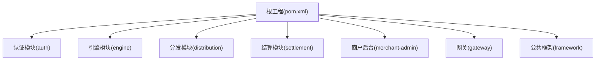
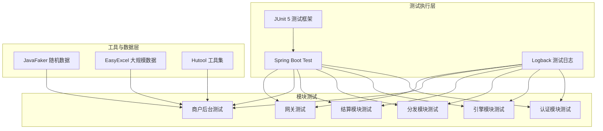
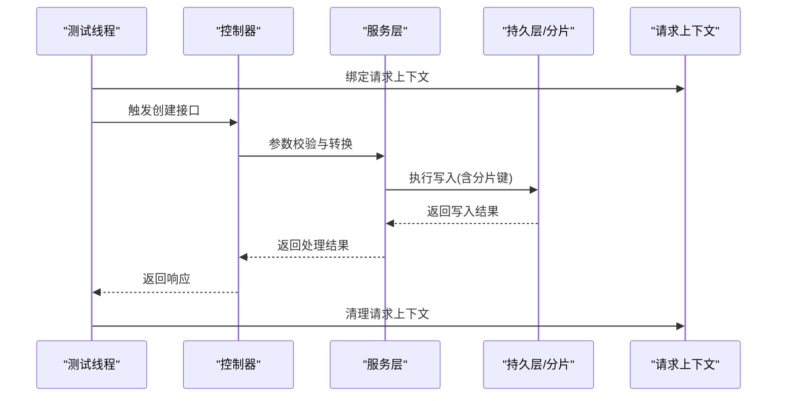
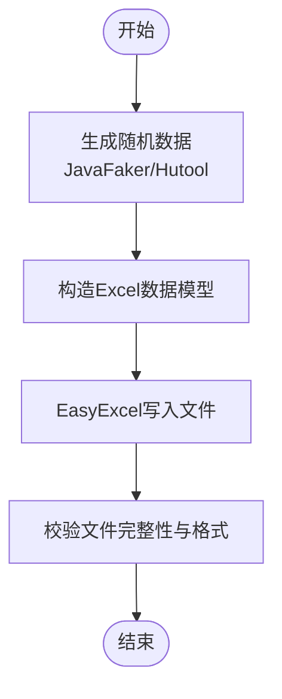
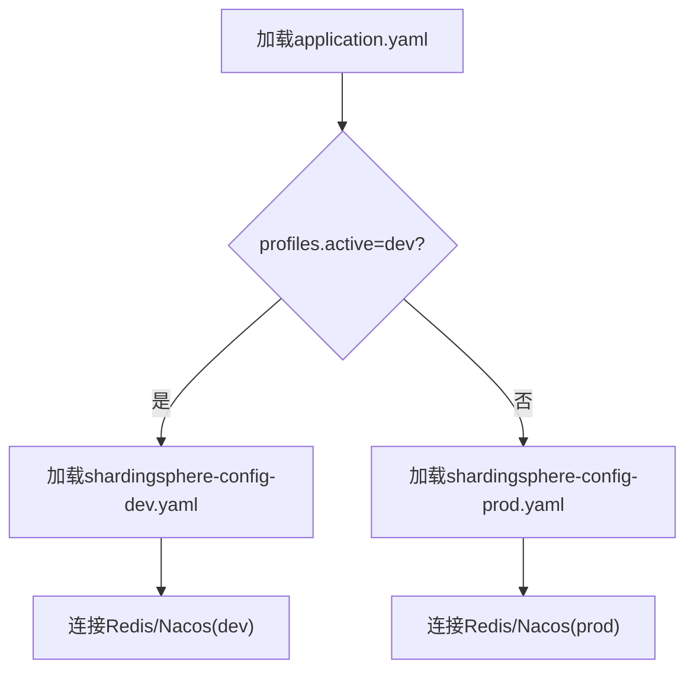
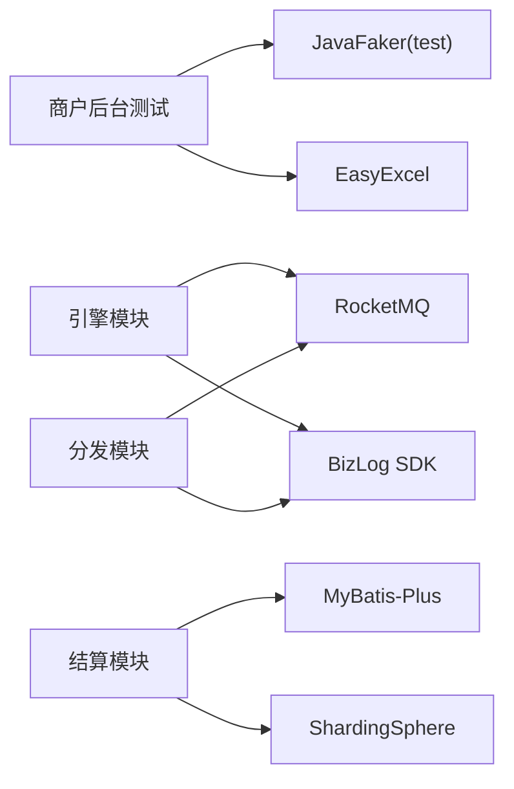

# 测试管理

<cite>
**本文引用的文件**
- [README.md](file://README.md)
- [pom.xml](file://pom.xml)
- [merchant-admin/pom.xml](file://merchant-admin/pom.xml)
- [auth/pom.xml](file://auth/pom.xml)
- [engine/pom.xml](file://engine/pom.xml)
- [distribution/pom.xml](file://distribution/pom.xml)
- [settlement/pom.xml](file://settlement/pom.xml)
- [auth/src/main/resources/application.yaml](file://auth/src/main/resources/application.yaml)
- [auth/src/main/resources/application-dev.yaml](file://auth/src/main/resources/application-dev.yaml)
- [auth/src/main/resources/application-prod.yaml](file://auth/src/main/resources/application-prod.yaml)
- [gateway/src/test/logback-spring.xml](file://gateway/src/test/logback-spring.xml)
- [merchant-admin/src/test/java/com/fengxin/test/CouponTemplateCreateDuplicateSubmitTests.java](file://merchant-admin/src/test/java/com/fengxin/test/CouponTemplateCreateDuplicateSubmitTests.java)
- [merchant-admin/src/test/java/com/fengxin/test/CouponTemplateTest.java](file://merchant-admin/src/test/java/com/fengxin/test/CouponTemplateTest.java)
- [merchant-admin/src/test/java/com/fengxin/test/ExcelGenerateTests.java](file://merchant-admin/src/test/java/com/fengxin/test/ExcelGenerateTests.java)
- [merchant-admin/src/test/java/com/fengxin/test/FakerTest.java](file://merchant-admin/src/test/java/com/fengxin/test/FakerTest.java)
- [merchant-admin/src/test/java/com/fengxin/test/MockCouponTemplateDataTests.java](file://merchant-admin/src/test/java/com/fengxin/test/MockCouponTemplateDataTests.java)
</cite>

## 目录
1. [引言](#引言)
2. [项目结构](#项目结构)
3. [核心组件](#核心组件)
4. [架构总览](#架构总览)
5. [详细组件分析](#详细组件分析)
6. [依赖分析](#依赖分析)
7. [性能考虑](#性能考虑)
8. [故障排查指南](#故障排查指南)
9. [结论](#结论)
10. [附录](#附录)

## 引言
本测试管理文档面向MapleCoupon项目的测试流程与质量保障体系，覆盖测试计划制定、测试用例设计与执行规范、测试数据管理策略（生成、存储、清理与隔离）、测试环境配置与差异、测试报告统计与缺陷跟踪、持续集成中的测试自动化（Jenkins/GitLab CI）以及测试团队协作与知识传承机制。文档基于仓库现有测试代码与配置进行归纳总结，旨在帮助测试团队建立标准化、可复用、可扩展的测试管理体系。

## 项目结构
MapleCoupon采用多模块Maven工程组织，包含认证(auth)、引擎(engine)、分发(distribution)、结算(settlement)、商户后台(merchant-admin)、网关(gateway)与公共框架(framework)等模块。各模块均具备独立的依赖与配置，便于按需启用测试与隔离环境。

图表来源
- [pom.xml](file://pom.xml)
- [auth/pom.xml](file://auth/pom.xml)
- [engine/pom.xml](file://engine/pom.xml)
- [distribution/pom.xml](file://distribution/pom.xml)
- [settlement/pom.xml](file://settlement/pom.xml)
- [merchant-admin/pom.xml](file://merchant-admin/pom.xml)

章节来源
- [README.md:1-10](file://README.md#L1-L10)
- [pom.xml](file://pom.xml)

## 核心组件
- 测试框架与运行环境
  - 各模块均使用Spring Boot Test进行集成测试与端到端验证，测试类通过@SpringBootTest注解加载应用上下文，确保与生产一致的配置与依赖注入。
  - 示例：商户后台模块的重复提交测试、Excel生成测试、随机数据生成测试等均基于JUnit 5与Spring Boot Test。
- 测试数据与工具
  - 使用JavaFaker生成中文随机数据，用于构造测试场景；使用EasyExcel生成大规模Excel数据，支撑批量推送与导入测试。
  - 使用Hutool的Snowflake与Random工具生成分布式唯一ID与随机参数，保证并发场景下的数据隔离与稳定性。
- 并发与幂等性测试
  - 通过线程池并发调用控制器接口，验证幂等性与数据库一致性；结合雪花ID与随机数，模拟高并发写入场景。
- 日志与输出
  - 测试日志通过logback-spring.xml配置，确保测试期间的日志输出与级别可控。

章节来源
- [merchant-admin/src/test/java/com/fengxin/test/CouponTemplateCreateDuplicateSubmitTests.java:1-71](file://merchant-admin/src/test/java/com/fengxin/test/CouponTemplateCreateDuplicateSubmitTests.java#L1-L71)
- [merchant-admin/src/test/java/com/fengxin/test/ExcelGenerateTests.java:1-77](file://merchant-admin/src/test/java/com/fengxin/test/ExcelGenerateTests.java#L1-L77)
- [merchant-admin/src/test/java/com/fengxin/test/FakerTest.java:1-35](file://merchant-admin/src/test/java/com/fengxin/test/FakerTest.java#L1-L35)
- [merchant-admin/src/test/java/com/fengxin/test/MockCouponTemplateDataTests.java:1-65](file://merchant-admin/src/test/java/com/fengxin/test/MockCouponTemplateDataTests.java#L1-L65)
- [gateway/src/test/logback-spring.xml](file://gateway/src/test/logback-spring.xml)

## 架构总览
测试架构围绕“模块化测试+共享工具+隔离环境”展开，各模块独立运行测试，通过公共依赖与工具类统一测试体验；环境通过Spring Profile与外部配置中心实现差异化管理。

图表来源
- [merchant-admin/pom.xml:106-118](file://merchant-admin/pom.xml#L106-L118)
- [auth/pom.xml:100-111](file://auth/pom.xml#L100-L111)
- [engine/pom.xml:94-101](file://engine/pom.xml#L94-L101)
- [distribution/pom.xml:99-103](file://distribution/pom.xml#L99-L103)
- [settlement/pom.xml:94-101](file://settlement/pom.xml#L94-L101)

## 详细组件分析

### 商户后台测试组件
- 重复提交与并发测试
  - 通过固定大小线程池并发触发控制器接口，结合RequestContextHolder绑定请求上下文，验证接口在高并发下的幂等性与数据库一致性。
  - 关键点：线程安全、请求上下文清理、异常捕获与日志记录。
- Excel生成与大数据量测试
  - 使用EasyExcel生成包含大量行的数据文件，验证读写性能与内存占用；结合JavaFaker生成真实感数据。
- 随机数据与模拟数据
  - JavaFaker生成中文姓名、手机号、邮箱等字段；Hutool生成分布式ID与随机参数，支撑高并发写入与分片场景。
- 模拟分片与批量插入
  - 通过雪花ID与线程池并发插入不同分片键，验证分片算法与数据库写入稳定性。

图表来源
- [merchant-admin/src/test/java/com/fengxin/test/CouponTemplateCreateDuplicateSubmitTests.java:32-69](file://merchant-admin/src/test/java/com/fengxin/test/CouponTemplateCreateDuplicateSubmitTests.java#L32-L69)

图表来源
- [merchant-admin/src/test/java/com/fengxin/test/ExcelGenerateTests.java:33-53](file://merchant-admin/src/test/java/com/fengxin/test/ExcelGenerateTests.java#L33-L53)

章节来源
- [merchant-admin/src/test/java/com/fengxin/test/CouponTemplateCreateDuplicateSubmitTests.java:1-71](file://merchant-admin/src/test/java/com/fengxin/test/CouponTemplateCreateDuplicateSubmitTests.java#L1-L71)
- [merchant-admin/src/test/java/com/fengxin/test/CouponTemplateTest.java:1-62](file://merchant-admin/src/test/java/com/fengxin/test/CouponTemplateTest.java#L1-L62)
- [merchant-admin/src/test/java/com/fengxin/test/ExcelGenerateTests.java:1-77](file://merchant-admin/src/test/java/com/fengxin/test/ExcelGenerateTests.java#L1-L77)
- [merchant-admin/src/test/java/com/fengxin/test/FakerTest.java:1-35](file://merchant-admin/src/test/java/com/fengxin/test/FakerTest.java#L1-L35)
- [merchant-admin/src/test/java/com/fengxin/test/MockCouponTemplateDataTests.java:1-65](file://merchant-admin/src/test/java/com/fengxin/test/MockCouponTemplateDataTests.java#L1-L65)

### 认证模块测试组件
- 配置与环境
  - 通过application.yaml激活dev环境，加载ShardingSphere驱动与分片配置；application-dev.yaml与application-prod.yaml分别定义开发与生产环境的Nacos与Redis连接信息。
- 测试要点
  - 基于Spring Boot Test启动认证服务，验证登录、注册、用户信息等接口；结合Redis与Nacos进行集成验证。
- 日志与输出
  - 通过logback-spring.xml配置测试阶段的日志输出，便于问题定位。

图表来源
- [auth/src/main/resources/application.yaml:1-19](file://auth/src/main/resources/application.yaml#L1-L19)
- [auth/src/main/resources/application-dev.yaml:1-30](file://auth/src/main/resources/application-dev.yaml#L1-L30)
- [auth/src/main/resources/application-prod.yaml:1-12](file://auth/src/main/resources/application-prod.yaml#L1-L12)

章节来源
- [auth/src/main/resources/application.yaml:1-19](file://auth/src/main/resources/application.yaml#L1-L19)
- [auth/src/main/resources/application-dev.yaml:1-30](file://auth/src/main/resources/application-dev.yaml#L1-L30)
- [auth/src/main/resources/application-prod.yaml:1-12](file://auth/src/main/resources/application-prod.yaml#L1-L12)
- [gateway/src/test/logback-spring.xml](file://gateway/src/test/logback-spring.xml)

### 引擎、分发、结算模块测试组件
- 依赖与工具
  - 引擎与分发模块引入RocketMQ Spring Boot Starter与BizLog SDK，用于消息驱动与链路追踪；结算模块同样具备MyBatis-Plus与ShardingSphere配置。
- 测试关注点
  - 基于Spring Boot Test验证控制器与服务层逻辑；结合消息队列与数据库分片配置，验证复杂业务流程。
- 日志与输出
  - 通过logback-spring.xml统一测试日志输出。

章节来源
- [engine/pom.xml:94-101](file://engine/pom.xml#L94-L101)
- [distribution/pom.xml:99-103](file://distribution/pom.xml#L99-L103)
- [settlement/pom.xml:94-101](file://settlement/pom.xml#L94-L101)

## 依赖分析
- 测试相关依赖分布
  - 商户后台模块引入JavaFaker与EasyExcel，用于随机数据与Excel生成；引擎与分发模块引入RocketMQ与BizLog，用于消息与链路追踪；公共框架提供全局异常与结果封装。
- 模块间耦合
  - 各模块测试相互独立，通过共享工具类与公共依赖实现一致性；跨模块测试可通过远程服务接口或消息通道进行集成验证。

图表来源
- [merchant-admin/pom.xml:106-118](file://merchant-admin/pom.xml#L106-L118)
- [engine/pom.xml:94-101](file://engine/pom.xml#L94-L101)
- [distribution/pom.xml:99-103](file://distribution/pom.xml#L99-L103)
- [settlement/pom.xml:94-101](file://settlement/pom.xml#L94-L101)

章节来源
- [merchant-admin/pom.xml:106-118](file://merchant-admin/pom.xml#L106-L118)
- [engine/pom.xml:94-101](file://engine/pom.xml#L94-L101)
- [distribution/pom.xml:99-103](file://distribution/pom.xml#L99-L103)
- [settlement/pom.xml:94-101](file://settlement/pom.xml#L94-L101)

## 性能考虑
- 并发测试策略
  - 使用线程池并发触发接口，结合雪花ID与随机参数，模拟高并发写入与分片场景；通过原子计数与线程休眠控制压力强度。
- 数据生成效率
  - 使用EasyExcel批量写入，避免逐条IO；JavaFaker生成中文数据，减少外部依赖。
- 环境隔离
  - 通过Spring Profile与不同配置文件隔离开发与生产环境，避免测试对线上资源的影响。

章节来源
- [merchant-admin/src/test/java/com/fengxin/test/CouponTemplateCreateDuplicateSubmitTests.java:32-69](file://merchant-admin/src/test/java/com/fengxin/test/CouponTemplateCreateDuplicateSubmitTests.java#L32-L69)
- [merchant-admin/src/test/java/com/fengxin/test/ExcelGenerateTests.java:33-53](file://merchant-admin/src/test/java/com/fengxin/test/ExcelGenerateTests.java#L33-L53)
- [merchant-admin/src/test/java/com/fengxin/test/MockCouponTemplateDataTests.java:50-63](file://merchant-admin/src/test/java/com/fengxin/test/MockCouponTemplateDataTests.java#L50-L63)

## 故障排查指南
- 并发测试异常
  - 确认请求上下文绑定与清理是否正确；检查线程池关闭与任务完成状态；查看日志定位异常堆栈。
- 数据生成失败
  - 校验Excel写入路径与权限；确认数据模型字段与注解配置；检查生成数量与内存占用。
- 环境配置错误
  - 核对profiles.active与配置文件命名；检查ShardingSphere配置与数据库连接；核对Nacos与Redis地址及密码。
- 日志输出问题
  - 检查logback-spring.xml配置；确认测试日志级别与输出位置。

章节来源
- [merchant-admin/src/test/java/com/fengxin/test/CouponTemplateCreateDuplicateSubmitTests.java:54-62](file://merchant-admin/src/test/java/com/fengxin/test/CouponTemplateCreateDuplicateSubmitTests.java#L54-L62)
- [merchant-admin/src/test/java/com/fengxin/test/ExcelGenerateTests.java:35-40](file://merchant-admin/src/test/java/com/fengxin/test/ExcelGenerateTests.java#L35-L40)
- [auth/src/main/resources/application.yaml:1-19](file://auth/src/main/resources/application.yaml#L1-L19)
- [gateway/src/test/logback-spring.xml](file://gateway/src/test/logback-spring.xml)

## 结论
MapleCoupon项目的测试体系以模块化测试为核心，结合JavaFaker、EasyExcel与Hutool等工具，实现了从单测到集成测试的完整覆盖。通过Spring Profile与外部配置中心实现环境隔离，配合日志与异常处理机制，保障了测试的稳定性与可追溯性。建议后续在持续集成中引入自动化测试流水线与测试报告聚合，进一步提升测试效率与质量度量能力。

## 附录

### 测试流程标准化管理
- 测试计划制定
  - 明确模块边界与测试范围；识别关键业务路径与风险点；制定测试策略（单元、集成、性能、安全）。
- 测试用例设计
  - 基于业务场景设计正反向用例；覆盖边界值、异常与并发场景；优先使用工具生成随机数据与大规模数据。
- 测试执行规范
  - 统一使用@SpringBootTest加载上下文；严格管理请求上下文与线程池；记录异常与日志输出。

章节来源
- [merchant-admin/src/test/java/com/fengxin/test/CouponTemplateTest.java:28-59](file://merchant-admin/src/test/java/com/fengxin/test/CouponTemplateTest.java#L28-L59)
- [merchant-admin/src/test/java/com/fengxin/test/FakerTest.java:18-33](file://merchant-admin/src/test/java/com/fengxin/test/FakerTest.java#L18-L33)

### 测试数据管理策略
- 生成
  - 使用JavaFaker生成中文姓名、手机号、邮箱；使用Hutool生成分布式ID与随机参数。
- 存储
  - 使用EasyExcel生成Excel文件，支持大批量数据写入与读取。
- 清理
  - 在测试结束后清理临时目录与生成文件；在数据库层面通过事务或测试专用表进行隔离。
- 隔离
  - 通过不同配置文件与数据库实例隔离开发、测试与生产数据。

章节来源
- [merchant-admin/src/test/java/com/fengxin/test/ExcelGenerateTests.java:33-53](file://merchant-admin/src/test/java/com/fengxin/test/ExcelGenerateTests.java#L33-L53)
- [merchant-admin/src/test/java/com/fengxin/test/MockCouponTemplateDataTests.java:44-63](file://merchant-admin/src/test/java/com/fengxin/test/MockCouponTemplateDataTests.java#L44-L63)

### 测试环境配置与管理
- 开发环境
  - application.yaml激活dev；连接开发数据库与Redis；开启Knife4j接口文档。
- 生产环境
  - application-prod.yaml配置生产Redis与Nacos；数据库连接指向生产实例。
- 网关测试
  - 通过logback-spring.xml配置测试日志输出。

章节来源
- [auth/src/main/resources/application.yaml:1-19](file://auth/src/main/resources/application.yaml#L1-L19)
- [auth/src/main/resources/application-dev.yaml:1-30](file://auth/src/main/resources/application-dev.yaml#L1-L30)
- [auth/src/main/resources/application-prod.yaml:1-12](file://auth/src/main/resources/application-prod.yaml#L1-L12)
- [gateway/src/test/logback-spring.xml](file://gateway/src/test/logback-spring.xml)

### 测试报告与质量度量
- 统计与分析
  - 基于JUnit报告与日志输出统计通过率、失败率与耗时；结合EasyExcel与随机数据生成报告样例。
- 缺陷跟踪
  - 在测试异常处记录上下文与参数；通过日志定位问题；结合雪花ID与随机参数复现问题。
- 质量度量
  - 关键指标：接口成功率、并发吞吐、数据库写入延迟、Excel生成耗时。

章节来源
- [merchant-admin/src/test/java/com/fengxin/test/ExcelGenerateTests.java:33-53](file://merchant-admin/src/test/java/com/fengxin/test/ExcelGenerateTests.java#L33-L53)
- [merchant-admin/src/test/java/com/fengxin/test/CouponTemplateCreateDuplicateSubmitTests.java:54-62](file://merchant-admin/src/test/java/com/fengxin/test/CouponTemplateCreateDuplicateSubmitTests.java#L54-L62)

### 持续集成中的测试自动化
- Jenkins/GitLab CI集成建议
  - 在CI中执行maven test命令；为每个模块配置独立的测试阶段；收集JUnit报告与日志；对Excel生成与并发测试设置超时与重试。
- 测试流水线
  - 触发条件：PR合并请求或定时任务；步骤：编译、单元测试、集成测试、报告生成与归档。

章节来源
- [pom.xml](file://pom.xml)
- [merchant-admin/pom.xml:128-148](file://merchant-admin/pom.xml#L128-L148)

### 测试团队协作与知识传承
- 协作流程
  - 统一测试命名与目录结构；在测试类中添加注释与场景说明；定期评审测试用例与覆盖率。
- 文档维护
  - 将测试策略、用例设计与环境配置纳入项目Wiki；随版本更新测试文档。
- 知识传承
  - 通过测试脚手架与工具类降低上手成本；建立常见问题与排障清单。

章节来源
- [merchant-admin/src/test/java/com/fengxin/test/CouponTemplateTest.java:16-21](file://merchant-admin/src/test/java/com/fengxin/test/CouponTemplateTest.java#L16-L21)
- [merchant-admin/src/test/java/com/fengxin/test/ExcelGenerateTests.java:20-24](file://merchant-admin/src/test/java/com/fengxin/test/ExcelGenerateTests.java#L20-L24)