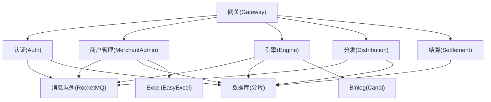
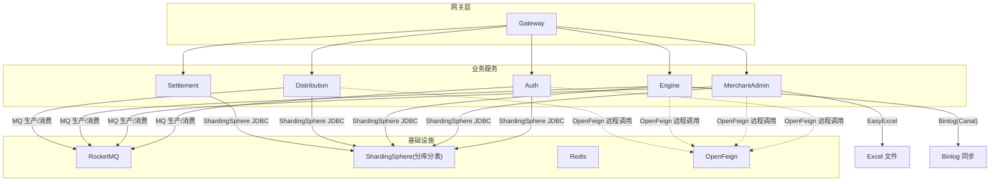
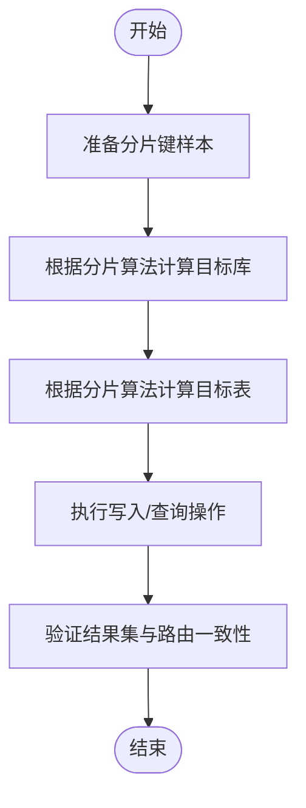
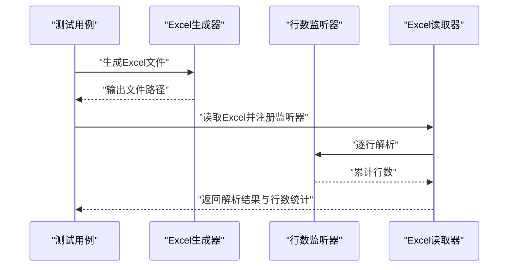
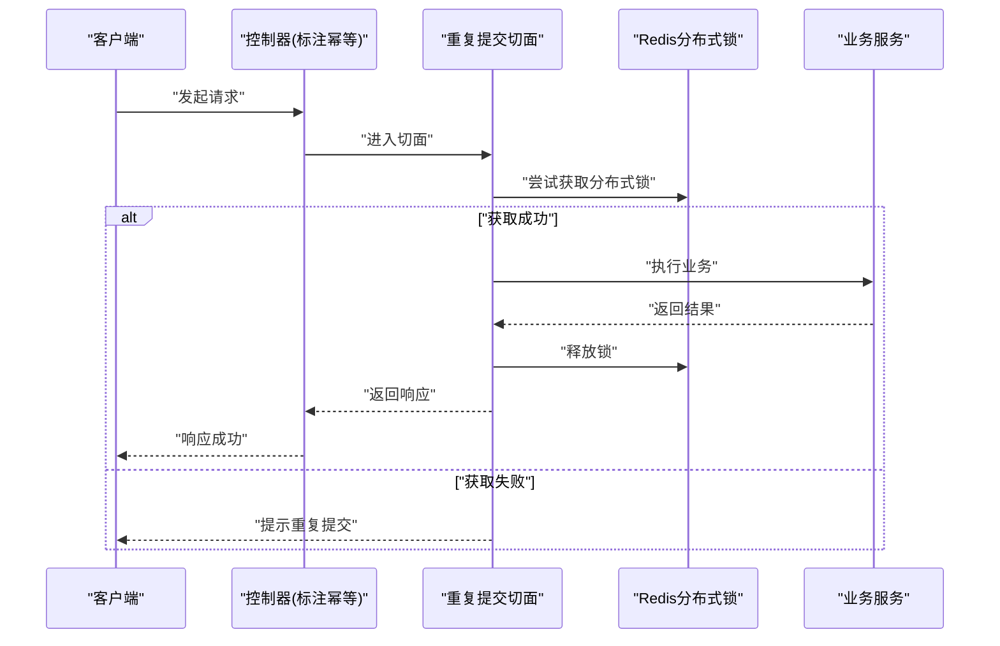
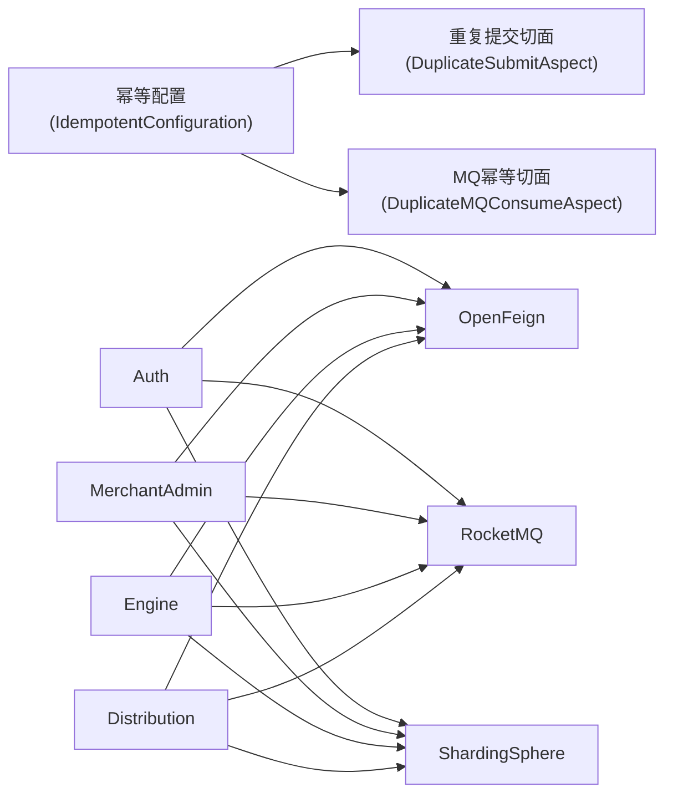

# 集成测试

<cite>
**本文引用的文件**
- [README.md](file://README.md)
- [pom.xml](file://pom.xml)
- [application.yaml（认证服务）](file://auth/src/main/resources/application.yaml)
- [application.yaml（引擎服务）](file://engine/src/main/resources/application.yaml)
- [application.yaml（商户管理）](file://merchant-admin/src/main/resources/application.yaml)
- [application.yaml（分发服务）](file://distribution/src/main/resources/application.yaml)
- [application.yaml（结算服务）](file://settlement/src/main/resources/application.yaml)
- [IdempotentConfiguration.java](file://framework/src/main/java/com/fengxin/config/IdempotentConfiguration.java)
- [DuplicateSubmitAspect.java](file://framework/src/main/java/com/fengxin/idempotent/DuplicateSubmitAspect.java)
- [DuplicateMQConsumeAspect.java](file://framework/src/main/java/com/fengxin/idempotent/DuplicateMQConsumeAspect.java)
- [DuplicateSubmit.java](file://framework/src/main/java/com/fengxin/idempotent/DuplicateSubmit.java)
- [DBHashModShardingAlgorithm（引擎）](file://engine/src/main/java/com/fengxin/maplecoupon/engine/dao/sharding/DBHashModShardingAlgorithm.java)
- [DBShardingUtil（引擎）](file://engine/src/main/java/com/fengxin/maplecoupon/engine/dao/sharding/DBShardingUtil.java)
- [DBHashModShardingAlgorithm（分发）](file://distribution/src/main/java/com/fengxin/maplecoupon/distribution/dao/sharding/DBHashModShardingAlgorithm.java)
- [TableHashModShardingAlgorithm（分发）](file://distribution/src/main/java/com/fengxin/maplecoupon/distribution/dao/sharding/TableHashModShardingAlgorithm.java)
- [DBHashModShardingAlgorithm（结算）](file://settlement/src/main/java/com/fengxin/maplecoupon/settlement/dao/sharding/DBHashModShardingAlgorithm.java)
- [DBShardingUtil（结算）](file://settlement/src/main/java/com/fengxin/maplecoupon/settlement/dao/sharding/DBShardingUtil.java)
- [RocketMQConstant（引擎）](file://engine/src/main/java/com/fengxin/maplecoupon/engine/common/constant/RocketMQConstant.java)
- [RocketMQConstant（认证）](file://auth/src/main/java/com/fengxin/maplecoupon/auth/common/constant/RocketMQConstant.java)
- [AbstractCommonSendProduceTemplate.java](file://merchant-admin/src/main/java/com/fengxin/maplecoupon/merchantadmin/mq/design/AbstractCommonSendProduceTemplate.java)
- [CouponExecuteDistributionConsumer.java](file://distribution/src/main/java/com/fengxin/maplecoupon/distribution/mq/consumer/CouponExecuteDistributionConsumer.java)
- [UserCouponDelayCloseConsumer.java](file://engine/src/main/java/com/fengxin/maplecoupon/engine/mq/consumer/UserCouponDelayCloseConsumer.java)
- [UserCouponRedeemConsumer.java](file://engine/src/main/java/com/fengxin/maplecoupon/engine/mq/consumer/UserCouponRedeemConsumer.java)
- [UserCouponRemindDelayConsumer.java](file://engine/src/main/java/com/fengxin/maplecoupon/engine/mq/consumer/UserCouponRemindDelayConsumer.java)
- [CanalBinlogSyncUserCouponConsumer.java](file://engine/src/main/java/com/fengxin/maplecoupon/engine/mq/consumer/CanalBinlogSyncUserCouponConsumer.java)
- [CouponExecuteDistributionProducer.java](file://distribution/src/main/java/com/fengxin/maplecoupon/distribution/mq/producer/CouponExecuteDistributionProducer.java)
- [UserCouponDelayCloseProducer.java](file://engine/src/main/java/com/fengxin/maplecoupon/engine/mq/producer/UserCouponDelayCloseProducer.java)
- [UserCouponRedeemProducer.java](file://engine/src/main/java/com/fengxin/maplecoupon/engine/mq/producer/UserCouponRedeemProducer.java)
- [UserCouponRemindProducer.java](file://engine/src/main/java/com/fengxin/maplecoupon/engine/mq/producer/UserCouponRemindProducer.java)
- [CouponQueryController.java](file://settlement/src/main/java/com/fengxin/maplecoupon/settlement/controller/CouponQueryController.java)
- [CouponTemplateController（引擎）](file://engine/src/main/java/com/fengxin/maplecoupon/engine/controller/CouponTemplateController.java)
- [CouponTemplateController（商户管理）](file://merchant-admin/src/main/java/com/fengxin/maplecoupon/merchantadmin/controller/CouponTemplateController.java)
- [CouponTemplateController（认证）](file://auth/src/main/java/com/fengxin/maplecoupon/auth/controller/UserController.java)
- [CouponQueryService.java](file://settlement/src/main/java/com/fengxin/maplecoupon/settlement/service/CouponQueryService.java)
- [CouponTemplateService（引擎）](file://engine/src/main/java/com/fengxin/maplecoupon/engine/service/CouponTemplateService.java)
- [CouponTemplateService（商户管理）](file://merchant-admin/src/main/java/com/fengxin/maplecoupon/merchantadmin/service/CouponTemplateService.java)
- [CouponTemplateService（认证）](file://auth/src/main/java/com/fengxin/maplecoupon/auth/service/UserService.java)
- [CouponTemplateTest.java](file://merchant-admin/src/test/java/com/fengxin/test/CouponTemplateTest.java)
- [CouponTemplateCreateDuplicateSubmitTests.java](file://merchant-admin/src/test/java/com/fengxin/test/CouponTemplateCreateDuplicateSubmitTests.java)
- [ExcelGenerateTests.java](file://merchant-admin/src/test/java/com/fengxin/test/ExcelGenerateTests.java)
- [RowCountListener.java](file://merchant-admin/src/main/java/com/fengxin/maplecoupon/merchantadmin/service/handler/excel/RowCountListener.java)
- [CouponTaskFailMapper.java](file://distribution/src/main/java/com/fengxin/maplecoupon/distribution/dao/mapper/CouponTaskFailMapper.java)
- [CouponTaskMapper.java](file://distribution/src/main/java/com/fengxin/maplecoupon/distribution/dao/mapper/CouponTaskMapper.java)
- [UserCouponMapper.java](file://distribution/src/main/java/com/fengxin/maplecoupon/distribution/dao/mapper/UserCouponMapper.java)
- [CouponSettlementMapper.java](file://engine/src/main/java/com/fengxin/maplecoupon/engine/dao/mapper/CouponSettlementMapper.java)
- [CouponTemplateMapper.java](file://engine/src/main/java/com/fengxin/maplecoupon/engine/dao/mapper/CouponTemplateMapper.java)
- [CouponTemplateMapper（商户管理）](file://merchant-admin/src/main/java/com/fengxin/maplecoupon/merchantadmin/dao/mapper/CouponTemplateMapper.java)
- [CouponTemplateMapper（结算）](file://settlement/src/main/java/com/fengxin/maplecoupon/settlement/dao/mapper/CouponTemplateMapper.java)
- [CouponTemplateMapper（认证）](file://auth/src/main/java/com/fengxin/maplecoupon/auth/dao/mapper/UserMapper.java)
- [CouponTaskFailMapper.xml](file://distribution/src/main/resources/mapper/CouponTaskFailMapper.xml)
- [UserCouponMapper.xml](file://distribution/src/main/resources/mapper/UserCouponMapper.xml)
- [CouponSettlementMapper.xml](file://engine/src/main/resources/mapper/CouponSettlementMapper.xml)
- [CouponTemplateMapper.xml](file://engine/src/main/resources/mapper/CouponTemplateMapper.xml)
- [CouponTemplateMapper.xml（商户管理）](file://merchant-admin/src/main/resources/mapper/CouponTemplateMapper.xml)
- [CouponTemplateMapper.xml（认证）](file://auth/src/main/java/com/fengxin/maplecoupon/auth/dao/mapper/UserMapper.java)
- [SettlementApplication.java](file://settlement/src/main/java/com/fengxin/maplecoupon/settlement/SettlementApplication.java)
- [EngineApplication.java](file://engine/src/main/java/com/fengxin/maplecoupon/engine/EngineApplication.java)
- [AuthApplication.java](file://auth/src/main/java/com/fengxin/maplecoupon/auth/AuthApplication.java)
- [DistributionApplication.java](file://distribution/src/main/java/com/fengxin/maplecoupon/distribution/DistributionApplication.java)
- [MerchantAdminApplication.java](file://merchant-admin/src/main/java/com/fengxin/maplecoupon/merchantadmin/MerchantAdminApplication.java)
- [GatewayApplication.java](file://gateway/src/main/java/com/fengxin/maplecoupon/gateway/GateWayApplication.java)
- [org.springframework.boot.autoconfigure.AutoConfiguration.imports](file://framework/src/main/resources/META-INF/spring/org.springframework.boot.autoconfigure.AutoConfiguration.imports)
</cite>

## 目录
1. [引言](#引言)
2. [项目结构](#项目结构)
3. [核心组件](#核心组件)
4. [架构总览](#架构总览)
5. [详细组件分析](#详细组件分析)
6. [依赖关系分析](#依赖关系分析)
7. [性能考量](#性能考量)
8. [故障排查指南](#故障排查指南)
9. [结论](#结论)
10. [附录](#附录)

## 引言
本集成测试文档面向MapleCoupon项目，围绕微服务间通信、分布式事务与数据一致性、分片数据库集成测试、外部系统（支付、消息队列、第三方）集成、Excel导入导出、防重复提交（幂等与并发控制）以及测试环境搭建与自动化执行，提供系统化、可落地的测试策略与实施步骤。项目采用Spring Boot + Spring Cloud Alibaba + Spring Cloud Gateway + ShardingSphere + RocketMQ + Redis + MySQL + EasyExcel + XXL-Job等技术栈，具备高并发、分库分表与消息驱动的典型特征。

## 项目结构
MapleCoupon采用多模块微服务架构，包含认证(auth)、引擎(engine)、分发(distribution)、商户管理(merchant-admin)、结算(settlement)、网关(gateway)、框架(framework)等模块。各服务通过ShardingSphere进行分库分表，通过RocketMQ实现异步解耦，通过Redis实现幂等与缓存，通过XXL-Job进行定时任务调度。

图示来源
- [GatewayApplication.java](file://gateway/src/main/java/com/fengxin/maplecoupon/gateway/GateWayApplication.java)
- [AuthApplication.java](file://auth/src/main/java/com/fengxin/maplecoupon/auth/AuthApplication.java)
- [MerchantAdminApplication.java](file://merchant-admin/src/main/java/com/fengxin/maplecoupon/merchantadmin/MerchantAdminApplication.java)
- [EngineApplication.java](file://engine/src/main/java/com/fengxin/maplecoupon/engine/EngineApplication.java)
- [DistributionApplication.java](file://distribution/src/main/java/com/fengxin/maplecoupon/distribution/DistributionApplication.java)
- [SettlementApplication.java](file://settlement/src/main/java/com/fengxin/maplecoupon/settlement/SettlementApplication.java)

章节来源
- [README.md:1-10](file://README.md#L1-L10)
- [pom.xml:177-194](file://pom.xml#L177-L194)

## 核心组件
- 分布式事务与幂等
  - 基于Redis的重复提交防护与MQ幂等消费，确保接口与消息消费的幂等性。
- 分片数据库
  - 基于ShardingSphere的自定义哈希分片算法，覆盖数据库与表两级分片。
- 消息队列
  - RocketMQ主题与消费者实现，涵盖延迟关闭、异步兑换、提醒、Binlog同步等场景。
- 外部系统
  - 通过OpenFeign远程调用与RocketMQ交互，支撑支付、结算与通知链路。
- Excel导入导出
  - EasyExcel读写与监听器，支持批量生成与行数统计。
- 测试与自动化
  - 单元/集成测试与并发压力测试，结合线程池模拟高并发场景。

章节来源
- [IdempotentConfiguration.java:1-40](file://framework/src/main/java/com/fengxin/config/IdempotentConfiguration.java#L1-L40)
- [DuplicateSubmitAspect.java:1-68](file://framework/src/main/java/com/fengxin/idempotent/DuplicateSubmitAspect.java#L1-L68)
- [DuplicateMQConsumeAspect.java:1-87](file://framework/src/main/java/com/fengxin/idempotent/DuplicateMQConsumeAspect.java#L1-L87)
- [DBHashModShardingAlgorithm（引擎）:1-34](file://engine/src/main/java/com/fengxin/maplecoupon/engine/dao/sharding/DBHashModShardingAlgorithm.java#L1-L34)
- [DBHashModShardingAlgorithm（分发）:1-34](file://distribution/src/main/java/com/fengxin/maplecoupon/distribution/dao/sharding/DBHashModShardingAlgorithm.java#L1-L34)
- [TableHashModShardingAlgorithm（分发）:1-44](file://distribution/src/main/java/com/fengxin/maplecoupon/distribution/dao/sharding/TableHashModShardingAlgorithm.java#L1-L44)
- [DBHashModShardingAlgorithm（结算）:1-33](file://settlement/src/main/java/com/fengxin/maplecoupon/settlement/dao/sharding/DBHashModShardingAlgorithm.java#L1-L33)
- [RocketMQConstant（引擎）:1-49](file://engine/src/main/java/com/fengxin/maplecoupon/engine/common/constant/RocketMQConstant.java#L1-L49)
- [RocketMQConstant（认证）:1-49](file://auth/src/main/java/com/fengxin/maplecoupon/auth/common/constant/RocketMQConstant.java#L1-L49)
- [AbstractCommonSendProduceTemplate.java:1-42](file://merchant-admin/src/main/java/com/fengxin/maplecoupon/merchantadmin/mq/design/AbstractCommonSendProduceTemplate.java#L1-L42)
- [ExcelGenerateTests.java:1-77](file://merchant-admin/src/test/java/com/fengxin/test/ExcelGenerateTests.java#L1-L77)
- [RowCountListener.java:1-26](file://merchant-admin/src/main/java/com/fengxin/maplecoupon/merchantadmin/service/handler/excel/RowCountListener.java#L1-L26)

## 架构总览
下图展示服务间通信与数据流的关键路径：网关路由至各微服务；服务通过ShardingSphere访问分片数据库；通过RocketMQ实现异步事件传递；外部系统通过OpenFeign对接。

图示来源
- [application.yaml（认证服务）:1-19](file://auth/src/main/resources/application.yaml#L1-L19)
- [application.yaml（引擎服务）:1-22](file://engine/src/main/resources/application.yaml#L1-L22)
- [application.yaml（商户管理）:1-27](file://merchant-admin/src/main/resources/application.yaml#L1-L27)
- [application.yaml（分发服务）:1-15](file://distribution/src/main/resources/application.yaml#L1-L15)
- [application.yaml（结算服务）:1-15](file://settlement/src/main/resources/application.yaml#L1-L15)
- [org.springframework.boot.autoconfigure.AutoConfiguration.imports](file://framework/src/main/resources/META-INF/spring/org.springframework.boot.autoconfigure.AutoConfiguration.imports)

## 详细组件分析

### 微服务间通信与集成测试策略
- 目标
  - 验证服务注册与发现、网关路由、OpenFeign远程调用、跨服务事务一致性与数据一致性。
- 关键点
  - 网关路由：确认请求从Gateway正确转发至目标服务。
  - OpenFeign：验证远程接口契约、超时与重试策略、降级处理。
  - 分布式事务：通过消息最终一致实现跨服务事务，结合幂等与回滚机制。
- 测试建议
  - 使用HTTP客户端对各服务端点进行集成测试，覆盖正常路径与异常路径。
  - 构造跨服务调用链路，如“商户管理创建模板 -> 引擎校验 -> 分发派发 -> 结算查询”，验证链路完整性与一致性。

章节来源
- [GatewayApplication.java](file://gateway/src/main/java/com/fengxin/maplecoupon/gateway/GateWayApplication.java)
- [MerchantAdminApplication.java](file://merchant-admin/src/main/java/com/fengxin/maplecoupon/merchantadmin/MerchantAdminApplication.java)
- [EngineApplication.java](file://engine/src/main/java/com/fengxin/maplecoupon/engine/EngineApplication.java)
- [DistributionApplication.java](file://distribution/src/main/java/com/fengxin/maplecoupon/distribution/DistributionApplication.java)
- [SettlementApplication.java](file://settlement/src/main/java/com/fengxin/maplecoupon/settlement/SettlementApplication.java)

### 分布式事务与数据一致性验证
- 目标
  - 验证跨服务操作的最终一致性，确保在异常情况下能正确回滚或补偿。
- 关键点
  - 事件驱动：通过RocketMQ发布/消费事件，保证跨服务数据同步。
  - 幂等性：防止重复消费导致的数据重复。
  - Binlog同步：通过Canal解析Binlog，实现跨库表的一致性更新。
- 测试建议
  - 构造事件发布与消费场景，验证消息幂等与消费成功/失败后的处理。
  - 模拟网络抖动与消费者异常，验证重试与死信处理。
  - 对比事件触发前后的数据库状态，确保一致性。

章节来源
- [UserCouponDelayCloseConsumer.java](file://engine/src/main/java/com/fengxin/maplecoupon/engine/mq/consumer/UserCouponDelayCloseConsumer.java)
- [UserCouponRedeemConsumer.java](file://engine/src/main/java/com/fengxin/maplecoupon/engine/mq/consumer/UserCouponRedeemConsumer.java)
- [UserCouponRemindDelayConsumer.java](file://engine/src/main/java/com/fengxin/maplecoupon/engine/mq/consumer/UserCouponRemindDelayConsumer.java)
- [CanalBinlogSyncUserCouponConsumer.java](file://engine/src/main/java/com/fengxin/maplecoupon/engine/mq/consumer/CanalBinlogSyncUserCouponConsumer.java)
- [DuplicateMQConsumeAspect.java:1-87](file://framework/src/main/java/com/fengxin/idempotent/DuplicateMQConsumeAspect.java#L1-L87)

### 分片数据库集成测试实施方案
- 目标
  - 验证分片算法在不同分片键下的路由正确性，确保跨库表查询与写入行为符合预期。
- 关键点
  - 自定义哈希分片算法：覆盖数据库与表两级分片，保证数据均匀分布。
  - 查询场景：针对IN查询、范围查询等复杂场景，验证分片路由与结果合并。
- 测试建议
  - 准备多组分片键样本，分别验证其路由到的目标库与表。
  - 构造跨库查询场景，验证结果集合并与排序一致性。
  - 结合分片工具类，验证分片键映射与可用数据源/表集合的匹配。

图示来源
- [DBHashModShardingAlgorithm（引擎）:20-34](file://engine/src/main/java/com/fengxin/maplecoupon/engine/dao/sharding/DBHashModShardingAlgorithm.java#L20-L34)
- [DBHashModShardingAlgorithm（分发）:20-34](file://distribution/src/main/java/com/fengxin/maplecoupon/distribution/dao/sharding/DBHashModShardingAlgorithm.java#L20-L34)
- [TableHashModShardingAlgorithm（分发）:16-44](file://distribution/src/main/java/com/fengxin/maplecoupon/distribution/dao/sharding/TableHashModShardingAlgorithm.java#L16-L44)
- [DBHashModShardingAlgorithm（结算）:20-33](file://settlement/src/main/java/com/fengxin/maplecoupon/settlement/dao/sharding/DBHashModShardingAlgorithm.java#L20-L33)

章节来源
- [DBShardingUtil（引擎）:15-37](file://engine/src/main/java/com/fengxin/maplecoupon/engine/dao/sharding/DBShardingUtil.java#L15-L37)
- [DBShardingUtil（结算）:15-37](file://settlement/src/main/java/com/fengxin/maplecoupon/settlement/dao/sharding/DBShardingUtil.java#L15-L37)

### 外部系统集成测试（支付、消息队列、第三方）
- 目标
  - 验证与支付系统、消息队列、第三方服务的集成稳定性与一致性。
- 关键点
  - RocketMQ：主题命名统一，生产者/消费者职责清晰，幂等消费保障。
  - OpenFeign：远程接口契约稳定，参数序列化与反序列化正确。
- 测试建议
  - 使用Mock或本地RocketMQ Broker进行端到端测试。
  - 构造支付回调、退款、提醒等事件，验证消息消费与业务处理。
  - 对远程调用进行超时与熔断测试，验证降级策略。

章节来源
- [RocketMQConstant（引擎）:1-49](file://engine/src/main/java/com/fengxin/maplecoupon/engine/common/constant/RocketMQConstant.java#L1-L49)
- [RocketMQConstant（认证）:1-49](file://auth/src/main/java/com/fengxin/maplecoupon/auth/common/constant/RocketMQConstant.java#L1-L49)
- [AbstractCommonSendProduceTemplate.java:1-42](file://merchant-admin/src/main/java/com/fengxin/maplecoupon/merchantadmin/mq/design/AbstractCommonSendProduceTemplate.java#L1-L42)
- [CouponExecuteDistributionProducer.java](file://distribution/src/main/java/com/fengxin/maplecoupon/distribution/mq/producer/CouponExecuteDistributionProducer.java)
- [UserCouponDelayCloseProducer.java](file://engine/src/main/java/com/fengxin/maplecoupon/engine/mq/producer/UserCouponDelayCloseProducer.java)
- [UserCouponRedeemProducer.java](file://engine/src/main/java/com/fengxin/maplecoupon/engine/mq/producer/UserCouponRedeemProducer.java)
- [UserCouponRemindProducer.java](file://engine/src/main/java/com/fengxin/maplecoupon/engine/mq/producer/UserCouponRemindProducer.java)

### Excel导入导出测试方案
- 目标
  - 验证Excel读写、格式校验、批量处理与错误处理能力。
- 关键点
  - EasyExcel：注解驱动的字段映射、样式控制、监听器统计行数。
  - 批量生成：生成大规模数据文件，验证写入性能与内存占用。
  - 错误处理：异常数据、缺失字段、格式不符等情况的处理。
- 测试建议
  - 生成不同规模的Excel文件，验证写入与读取性能。
  - 构造异常数据集，验证监听器与校验逻辑。
  - 对比读取结果与原始数据，确保字段映射与数据一致性。

图示来源
- [ExcelGenerateTests.java:24-77](file://merchant-admin/src/test/java/com/fengxin/test/ExcelGenerateTests.java#L24-L77)
- [RowCountListener.java:13-26](file://merchant-admin/src/main/java/com/fengxin/maplecoupon/merchantadmin/service/handler/excel/RowCountListener.java#L13-L26)

章节来源
- [ExcelGenerateTests.java:1-77](file://merchant-admin/src/test/java/com/fengxin/test/ExcelGenerateTests.java#L1-L77)
- [RowCountListener.java:1-26](file://merchant-admin/src/main/java/com/fengxin/maplecoupon/merchantadmin/service/handler/excel/RowCountListener.java#L1-L26)

### 防重复提交测试（幂等与并发控制）
- 目标
  - 验证接口幂等性与并发场景下的重复提交防护。
- 关键点
  - Redis分布式锁：基于请求路径、用户ID与请求参数MD5生成唯一锁键。
  - MQ幂等：基于Redis的Lua脚本实现“SET NX PX”幂等令牌，避免重复消费。
- 测试建议
  - 使用线程池并发触发同一接口，验证仅一次成功与其余请求被拦截。
  - 模拟MQ重复投递，验证幂等消费逻辑与异常处理。

图示来源
- [DuplicateSubmitAspect.java:23-51](file://framework/src/main/java/com/fengxin/idempotent/DuplicateSubmitAspect.java#L23-L51)
- [DuplicateSubmit.java:14-18](file://framework/src/main/java/com/fengxin/idempotent/DuplicateSubmit.java#L14-L18)

章节来源
- [IdempotentConfiguration.java:16-39](file://framework/src/main/java/com/fengxin/config/IdempotentConfiguration.java#L16-L39)
- [DuplicateSubmitAspect.java:1-68](file://framework/src/main/java/com/fengxin/idempotent/DuplicateSubmitAspect.java#L1-L68)
- [DuplicateMQConsumeAspect.java:1-87](file://framework/src/main/java/com/fengxin/idempotent/DuplicateMQConsumeAspect.java#L1-L87)
- [CouponTemplateCreateDuplicateSubmitTests.java:24-71](file://merchant-admin/src/test/java/com/fengxin/test/CouponTemplateCreateDuplicateSubmitTests.java#L24-L71)

### 数据库集成测试（事务管理与数据同步）
- 目标
  - 验证分片环境下事务边界、数据一致性与跨库同步。
- 关键点
  - 事务边界：单库内事务由MyBatis-Plus管理；跨库事务通过消息最终一致。
  - 数据同步：Binlog同步与MQ事件驱动双通道保障。
- 测试建议
  - 构造跨库写入场景，验证事件发布与消费后的数据一致性。
  - 对比事件前后的数据库状态，确保库存扣减、用户记录等操作原子性与一致性。

章节来源
- [CouponSettlementMapper.java](file://engine/src/main/java/com/fengxin/maplecoupon/engine/dao/mapper/CouponSettlementMapper.java)
- [CouponTemplateMapper.java](file://engine/src/main/java/com/fengxin/maplecoupon/engine/dao/mapper/CouponTemplateMapper.java)
- [CouponTemplateMapper（商户管理）](file://merchant-admin/src/main/java/com/fengxin/maplecoupon/merchantadmin/dao/mapper/CouponTemplateMapper.java)
- [CouponTemplateMapper（结算）](file://settlement/src/main/java/com/fengxin/maplecoupon/settlement/dao/mapper/CouponTemplateMapper.java)
- [CouponTemplateMapper（认证）](file://auth/src/main/java/com/fengxin/maplecoupon/auth/dao/mapper/UserMapper.java)
- [CouponTaskFailMapper.java](file://distribution/src/main/java/com/fengxin/maplecoupon/distribution/dao/mapper/CouponTaskFailMapper.java)
- [CouponTaskMapper.java](file://distribution/src/main/java/com/fengxin/maplecoupon/distribution/dao/mapper/CouponTaskMapper.java)
- [UserCouponMapper.java](file://distribution/src/main/java/com/fengxin/maplecoupon/distribution/dao/mapper/UserCouponMapper.java)
- [CouponTaskFailMapper.xml](file://distribution/src/main/resources/mapper/CouponTaskFailMapper.xml)
- [UserCouponMapper.xml](file://distribution/src/main/resources/mapper/UserCouponMapper.xml)
- [CouponSettlementMapper.xml](file://engine/src/main/resources/mapper/CouponSettlementMapper.xml)
- [CouponTemplateMapper.xml](file://engine/src/main/resources/mapper/CouponTemplateMapper.xml)
- [CouponTemplateMapper.xml（商户管理）](file://merchant-admin/src/main/resources/mapper/CouponTemplateMapper.xml)

## 依赖关系分析
- 组件耦合
  - 服务间通过OpenFeign与RocketMQ解耦，降低直接依赖。
  - 分片算法集中于各模块的sharding包，便于统一维护与测试。
- 外部依赖
  - ShardingSphere驱动JDBC访问分片数据源。
  - RocketMQ提供异步事件总线。
  - Redis提供分布式锁与幂等令牌。
- 自动装配
  - 幂等配置类自动注入切面Bean，确保全局生效。

图示来源
- [IdempotentConfiguration.java:16-39](file://framework/src/main/java/com/fengxin/config/IdempotentConfiguration.java#L16-L39)
- [org.springframework.boot.autoconfigure.AutoConfiguration.imports](file://framework/src/main/resources/META-INF/spring/org.springframework.boot.autoconfigure.AutoConfiguration.imports)

章节来源
- [pom.xml:177-194](file://pom.xml#L177-L194)

## 性能考量
- 并发与锁竞争
  - 分布式锁粒度应尽量细化，避免热点路径上的锁争用。
- 消息吞吐
  - RocketMQ分区与消费者并行度需与业务峰值匹配，避免堆积。
- 分片均匀性
  - 分片键选择与算法需保证数据均匀分布，避免热点库/表。
- 缓存与降级
  - Redis缓存命中率与过期策略影响整体延迟；OpenFeign需配置合理超时与熔断。

## 故障排查指南
- 幂等相关
  - 若出现“重复提交”错误，检查请求路径、用户ID与请求参数是否一致，确认Redis锁键生成逻辑。
  - 若MQ重复消费，检查幂等令牌状态与Lua脚本执行结果。
- 分片相关
  - 若跨库查询结果异常，核对分片键与分片算法，确认目标库/表映射。
- 消息相关
  - 若消息未达或重复，检查主题、消费者组与Broker配置，验证幂等消费逻辑。
- Excel相关
  - 若读取异常，检查字段映射注解与监听器实现，定位异常数据行。

章节来源
- [DuplicateSubmitAspect.java:23-51](file://framework/src/main/java/com/fengxin/idempotent/DuplicateSubmitAspect.java#L23-L51)
- [DuplicateMQConsumeAspect.java:33-72](file://framework/src/main/java/com/fengxin/idempotent/DuplicateMQConsumeAspect.java#L33-L72)
- [DBHashModShardingAlgorithm（引擎）:20-34](file://engine/src/main/java/com/fengxin/maplecoupon/engine/dao/sharding/DBHashModShardingAlgorithm.java#L20-L34)
- [DBHashModShardingAlgorithm（分发）:20-34](file://distribution/src/main/java/com/fengxin/maplecoupon/distribution/dao/sharding/DBHashModShardingAlgorithm.java#L20-L34)
- [TableHashModShardingAlgorithm（分发）:16-44](file://distribution/src/main/java/com/fengxin/maplecoupon/distribution/dao/sharding/TableHashModShardingAlgorithm.java#L16-L44)

## 结论
本集成测试文档围绕MapleCoupon的核心特性，提供了微服务间通信、分布式事务与数据一致性、分片数据库、外部系统集成、Excel导入导出、防重复提交与并发控制的系统化测试策略。通过结合ShardingSphere、RocketMQ、Redis与OpenFeign等基础设施，配合幂等与消息驱动的最终一致性设计，能够在高并发场景下保障系统的稳定性与一致性。

## 附录
- 测试环境搭建
  - 启动顺序：先启动网关与基础设施（Redis、RocketMQ、MySQL、ShardingSphere），再启动各业务服务。
  - 配置要点：确保各服务的ShardingSphere配置文件加载正确，RocketMQ主题与消费者组配置一致。
- 测试数据准备
  - 使用分片工具类与监听器辅助构造与验证数据。
  - 使用Excel生成器批量生成测试数据，覆盖不同规模与异常场景。
- 测试执行自动化
  - 使用JUnit与线程池并发执行重复提交测试，结合日志与断言验证幂等性与一致性。