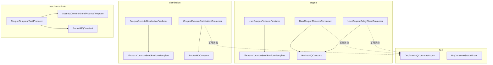
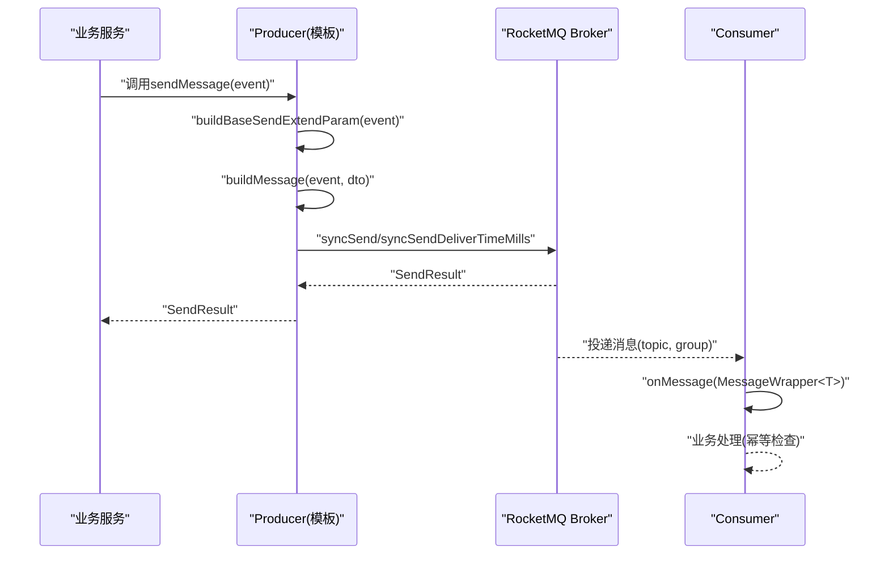
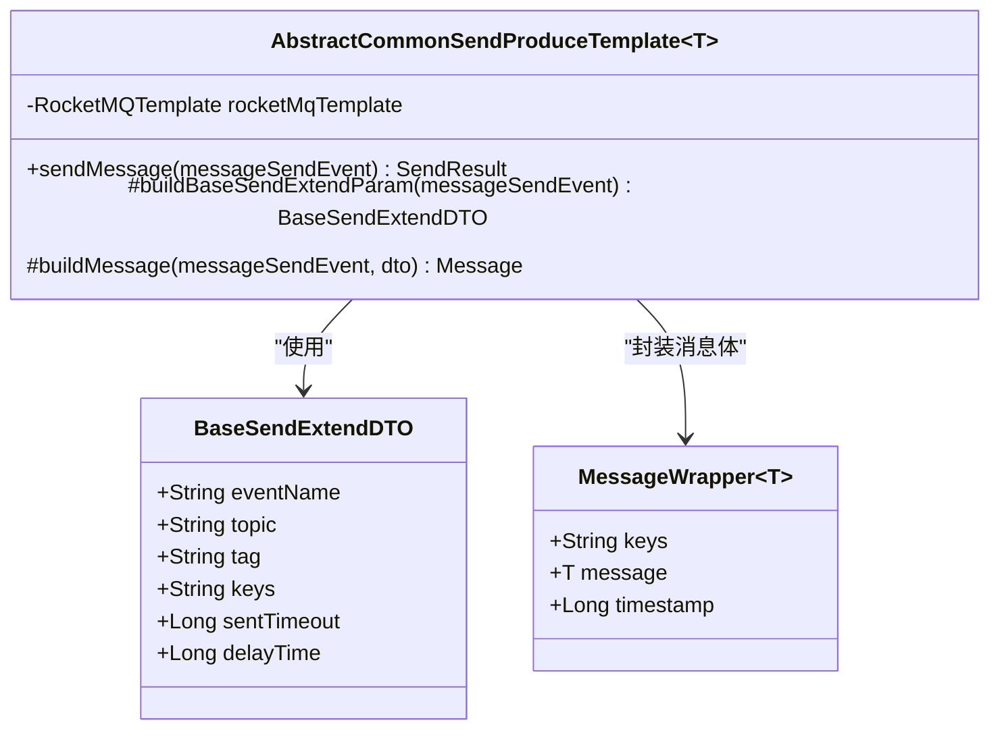
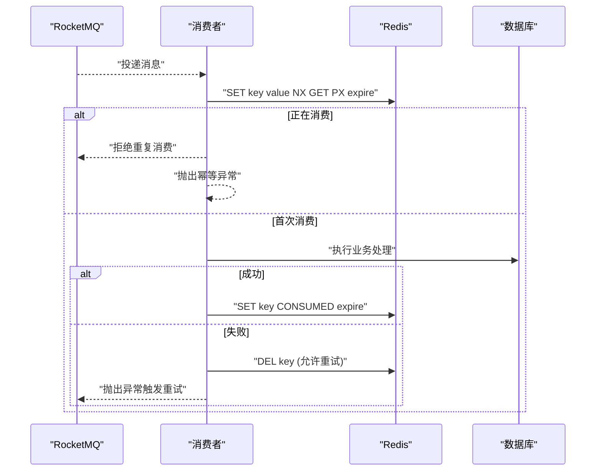
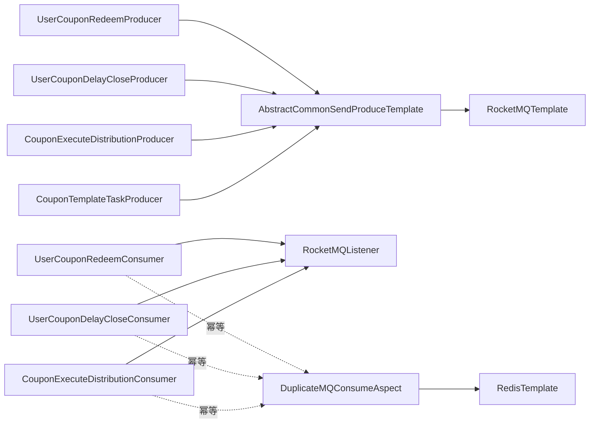

# RocketMQ集成架构

<cite>
**本文引用的文件**
- [engine\src\main\resources\application-prod.yaml](file://engine\src\main\resources\application-prod.yaml)
- [distribution\src\main\resources\application-prod.yaml](file://distribution\src\main\resources\application-prod.yaml)
- [merchant-admin\src\main\resources\application-prod.yaml](file://merchant-admin\src\main\resources\application-prod.yaml)
- [engine\src\main\java\com\fengxin\maplecoupon\engine\common\constant\RocketMQConstant.java](file://engine\src\main\java\com\fengxin\maplecoupon\engine\common\constant\RocketMQConstant.java)
- [distribution\src\main\java\com\fengxin\maplecoupon\distribution\common\constant\RocketMQConstant.java](file://distribution\src\main\java\com\fengxin\maplecoupon\distribution\common\constant\RocketMQConstant.java)
- [merchant-admin\src\main\java\com\fengxin\maplecoupon\merchantadmin\common\constant\RocketMQConstant.java](file://merchant-admin\src\main\java\com\fengxin\maplecoupon\merchantadmin\common\constant\RocketMQConstant.java)
- [engine\src\main\java\com\fengxin\maplecoupon\engine\mq\design\AbstractCommonSendProduceTemplate.java](file://engine\src\main\java\com\fengxin\maplecoupon\engine\mq\design\AbstractCommonSendProduceTemplate.java)
- [distribution\src\main\java\com\fengxin\maplecoupon\distribution\mq\design\AbstractCommonSendProduceTemplate.java](file://distribution\src\main\java\com\fengxin\maplecoupon\distribution\mq\design\AbstractCommonSendProduceTemplate.java)
- [merchant-admin\src\main\java\com\fengxin\maplecoupon\merchantadmin\mq\design\AbstractCommonSendProduceTemplate.java](file://merchant-admin\src\main\java\com\fengxin\maplecoupon\merchantadmin\mq\design\AbstractCommonSendProduceTemplate.java)
- [engine\src\main\java\com\fengxin\maplecoupon\engine\mq\design\BaseSendExtendDTO.java](file://engine\src\main\java\com\fengxin\maplecoupon\engine\mq\design\BaseSendExtendDTO.java)
- [engine\src\main\java\com\fengxin\maplecoupon\engine\mq\design\MessageWrapper.java](file://engine\src\main\java\com\fengxin\maplecoupon\engine\mq\design\MessageWrapper.java)
- [engine\src\main\java\com\fengxin\maplecoupon\engine\mq\producer\UserCouponRedeemProducer.java](file://engine\src\main\java\com\fengxin\maplecoupon\engine\mq\producer\UserCouponRedeemProducer.java)
- [engine\src\main\java\com\fengxin\maplecoupon\engine\mq\consumer\UserCouponRedeemConsumer.java](file://engine\src\main\java\com\fengxin\maplecoupon\engine\mq\consumer\UserCouponRedeemConsumer.java)
- [engine\src\main\java\com\fengxin\maplecoupon\engine\mq\producer\UserCouponDelayCloseProducer.java](file://engine\src\main\java\com\fengxin\maplecoupon\engine\mq\producer\UserCouponDelayCloseProducer.java)
- [engine\src\main\java\com\fengxin\maplecoupon\engine\mq\consumer\UserCouponDelayCloseConsumer.java](file://engine\src\main\java\com\fengxin\maplecoupon\engine\mq\consumer\UserCouponDelayCloseConsumer.java)
- [distribution\src\main\java\com\fengxin\maplecoupon\distribution\mq\producer\CouponExecuteDistributionProducer.java](file://distribution\src\main\java\com\fengxin\maplecoupon\distribution\mq\producer\CouponExecuteDistributionProducer.java)
- [distribution\src\main\java\com\fengxin\maplecoupon\distribution\mq\consumer\CouponExecuteDistributionConsumer.java](file://distribution\src\main\java\com\fengxin\maplecoupon\distribution\mq\consumer\CouponExecuteDistributionConsumer.java)
- [merchant-admin\src\main\java\com\fengxin\maplecoupon\merchantadmin\mq\producer\CouponTemplateTaskProducer.java](file://merchant-admin\src\main\java\com\fengxin\maplecoupon\merchantadmin\mq\producer\CouponTemplateTaskProducer.java)
- [framework\src\main\java\com\fengxin\idempotent\DuplicateMQConsumeAspect.java](file://framework\src\main\java\com\fengxin\idempotent\DuplicateMQConsumeAspect.java)
- [framework\src\main\java\com\fengxin\enums\MQConsumeStatusEnum.java](file://framework\src\main\java\com\fengxin\enums\MQConsumeStatusEnum.java)
- [framework\src\main\java\com\fengxin\idempotent\DuplicateMQConsume.java](file://framework\src\main\java\com\fengxin\idempotent\DuplicateMQConsume.java)
- [engine\src\main\java\com\fengxin\maplecoupon\engine\common\serializer\PhoneDesensitizationSerializer.java](file://engine\src\main\java\com\fengxin\maplecoupon\engine\common\serializer\PhoneDesensitizationSerializer.java)
- [auth\src\main\java\com\fengxin\maplecoupon\auth\common\serializer\LongToStringDeserializer.java](file://auth\src\main\java\com\fengxin\maplecoupon\auth\common\serializer\LongToStringDeserializer.java)
</cite>

## 目录
1. [简介](#简介)
2. [项目结构](#项目结构)
3. [核心组件](#核心组件)
4. [架构总览](#架构总览)
5. [详细组件分析](#详细组件分析)
6. [依赖关系分析](#依赖关系分析)
7. [性能考量](#性能考量)
8. [故障排查指南](#故障排查指南)
9. [结论](#结论)
10. [附录](#附录)

## 简介
本文件系统性梳理MapleCoupon中RocketMQ的集成架构与实现，覆盖NameServer配置、Producer与Consumer的创建与管理、消息发送模板设计（AbstractCommonSendProduceTemplate）、消息生产者的配置选项（重试、超时、延迟发送）、消费者监听机制（并发消费、消息过滤、幂等与异常处理）、消息序列化与反序列化最佳实践以及连接池与资源回收要点。内容以代码为依据，配合图示帮助读者快速理解各模块职责与交互。

## 项目结构
RocketMQ在MapleCoupon中按业务域拆分：engine（券核销与延时关闭）、distribution（券分发执行）、merchant-admin（任务与终止控制），三处均采用统一的模板化发送与常量定义，确保跨模块一致性。

图表来源
- [engine\src\main\java\com\fengxin\maplecoupon\engine\mq\producer\UserCouponRedeemProducer.java:26-51](file://engine\src\main\java\com\fengxin\maplecoupon\engine\mq\producer\UserCouponRedeemProducer.java#L26-L51)
- [engine\src\main\java\com\fengxin\maplecoupon\engine\mq\consumer\UserCouponRedeemConsumer.java:49-124](file://engine\src\main\java\com\fengxin\maplecoupon\engine\mq\consumer\UserCouponRedeemConsumer.java#L49-L124)
- [engine\src\main\java\com\fengxin\maplecoupon\engine\mq\consumer\UserCouponDelayCloseConsumer.java:37-70](file://engine\src\main\java\com\fengxin\maplecoupon\engine\mq\consumer\UserCouponDelayCloseConsumer.java#L37-L70)
- [distribution\src\main\java\com\fengxin\maplecoupon\distribution\mq\producer\CouponExecuteDistributionProducer.java:26-51](file://distribution\src\main\java\com\fengxin\maplecoupon\distribution\mq\producer\CouponExecuteDistributionProducer.java#L26-L51)
- [distribution\src\main\java\com\fengxin\maplecoupon\distribution\mq\consumer\CouponExecuteDistributionConsumer.java:67-163](file://distribution\src\main\java\com\fengxin\maplecoupon\distribution\mq\consumer\CouponExecuteDistributionConsumer.java#L67-L163)
- [merchant-admin\src\main\java\com\fengxin\maplecoupon\merchantadmin\mq\producer\CouponTemplateTaskProducer.java:27-52](file://merchant-admin\src\main\java\com\fengxin\maplecoupon\merchantadmin\mq\producer\CouponTemplateTaskProducer.java#L27-L52)
- [framework\src\main\java\com\fengxin\idempotent\DuplicateMQConsumeAspect.java:30-72](file://framework\src\main\java\com\fengxin\idempotent\DuplicateMQConsumeAspect.java#L30-L72)

章节来源
- [engine\src\main\resources\application-prod.yaml:12-18](file://engine\src\main\resources\application-prod.yaml#L12-L18)
- [distribution\src\main\resources\application-prod.yaml:13-19](file://distribution\src\main\resources\application-prod.yaml#L13-L19)
- [merchant-admin\src\main\resources\application-prod.yaml:13-20](file://merchant-admin\src\main\resources\application-prod.yaml#L13-L20)

## 核心组件
- NameServer配置：各模块在application-prod.yaml中集中配置rocketmq.name-server地址，确保集群发现一致。
- Producer模板：AbstractCommonSendProduceTemplate封装发送流程，子类仅需实现构建BaseSendExtendDTO与Message体。
- 消息模型：MessageWrapper统一封装业务键与消息体；BaseSendExtendDTO承载topic/tag/keys/sentTimeout/delayTime等元信息。
- 消费者常量：各模块独立维护RocketMQConstant，避免硬编码，便于扩展与维护。
- 幂等消费：DuplicateMQConsumeAspect结合MQConsumeStatusEnum实现消费者幂等，防止重复消费。

章节来源
- [engine\src\main\java\com\fengxin\maplecoupon\engine\mq\design\AbstractCommonSendProduceTemplate.java:19-75](file://engine\src\main\java\com\fengxin\maplecoupon\engine\mq\design\AbstractCommonSendProduceTemplate.java#L19-L75)
- [engine\src\main\java\com\fengxin\maplecoupon\engine\mq\design\BaseSendExtendDTO.java:18-48](file://engine\src\main\java\com\fengxin\maplecoupon\engine\mq\design\BaseSendExtendDTO.java#L18-L48)
- [engine\src\main\java\com\fengxin\maplecoupon\engine\mq\design\MessageWrapper.java:19-41](file://engine\src\main\java\com\fengxin\maplecoupon\engine\mq\design\MessageWrapper.java#L19-L41)
- [engine\src\main\java\com\fengxin\maplecoupon\engine\common\constant\RocketMQConstant.java:9-49](file://engine\src\main\java\com\fengxin\maplecoupon\engine\common\constant\RocketMQConstant.java#L9-L49)

## 架构总览
RocketMQ在MapleCoupon中采用“模板+常量”的标准化实现，Producer侧通过模板方法统一发送逻辑，Consumer侧通过注解声明监听topic与group，结合幂等切面保障可靠性。

图表来源
- [engine\src\main\java\com\fengxin\maplecoupon\engine\mq\design\AbstractCommonSendProduceTemplate.java:43-73](file://engine\src\main\java\com\fengxin\maplecoupon\engine\mq\design\AbstractCommonSendProduceTemplate.java#L43-L73)
- [engine\src\main\java\com\fengxin\maplecoupon\engine\mq\consumer\UserCouponRedeemConsumer.java:56-123](file://engine\src\main\java\com\fengxin\maplecoupon\engine\mq\consumer\UserCouponRedeemConsumer.java#L56-L123)

## 详细组件分析

### NameServer与Producer/Consumer初始化
- NameServer：engine、distribution、merchant-admin三模块在各自application-prod.yaml中配置rocketmq.name-server，确保Broker发现一致。
- Producer：各模块Producer继承AbstractCommonSendProduceTemplate，重写buildBaseSendExtendParam与buildMessage，注入RocketMQTemplate完成发送。
- Consumer：通过@RocketMQMessageListener声明topic与consumerGroup，实现RocketMQListener接收消息。

章节来源
- [engine\src\main\resources\application-prod.yaml:12-18](file://engine\src\main\resources\application-prod.yaml#L12-L18)
- [distribution\src\main\resources\application-prod.yaml:13-19](file://distribution\src\main\resources\application-prod.yaml#L13-L19)
- [merchant-admin\src\main\resources\application-prod.yaml:13-20](file://merchant-admin\src\main\resources\application-prod.yaml#L13-L20)
- [engine\src\main\java\com\fengxin\maplecoupon\engine\mq\producer\UserCouponRedeemProducer.java:26-51](file://engine\src\main\java\com\fengxin\maplecoupon\engine\mq\producer\UserCouponRedeemProducer.java#L26-L51)
- [engine\src\main\java\com\fengxin\maplecoupon\engine\mq\consumer\UserCouponRedeemConsumer.java:45-48](file://engine\src\main\java\com\fengxin\maplecoupon\engine\mq\consumer\UserCouponRedeemConsumer.java#L45-L48)

### 消息发送模板设计：AbstractCommonSendProduceTemplate
- 设计模式：模板方法模式，子类仅实现“构建发送参数”和“构建消息体”，统一处理destination拼接、同步/延迟发送、超时与异常日志。
- 关键字段：topic、tag、keys、sentTimeout、delayTime由BaseSendExtendDTO承载；MessageWrapper包裹业务对象并设置RocketMQ头部属性。
- 延迟消息：当delayTime非空时走deliverTimeMills路径；否则走syncSend并应用sentTimeout。

图表来源
- [engine\src\main\java\com\fengxin\maplecoupon\engine\mq\design\AbstractCommonSendProduceTemplate.java:19-75](file://engine\src\main\java\com\fengxin\maplecoupon\engine\mq\design\AbstractCommonSendProduceTemplate.java#L19-L75)
- [engine\src\main\java\com\fengxin\maplecoupon\engine\mq\design\BaseSendExtendDTO.java:18-48](file://engine\src\main\java\com\fengxin\maplecoupon\engine\mq\design\BaseSendExtendDTO.java#L18-L48)
- [engine\src\main\java\com\fengxin\maplecoupon\engine\mq\design\MessageWrapper.java:19-41](file://engine\src\main\java\com\fengxin\maplecoupon\engine\mq\design\MessageWrapper.java#L19-L41)

章节来源
- [engine\src\main\java\com\fengxin\maplecoupon\engine\mq\design\AbstractCommonSendProduceTemplate.java:43-73](file://engine\src\main\java\com\fengxin\maplecoupon\engine\mq\design\AbstractCommonSendProduceTemplate.java#L43-L73)
- [distribution\src\main\java\com\fengxin\maplecoupon\distribution\mq\design\AbstractCommonSendProduceTemplate.java:43-73](file://distribution\src\main\java\com\fengxin\maplecoupon\distribution\mq\design\AbstractCommonSendProduceTemplate.java#L43-L73)
- [merchant-admin\src\main\java\com\fengxin\maplecoupon\merchantadmin\mq\design\AbstractCommonSendProduceTemplate.java:43-73](file://merchant-admin\src\main\java\com\fengxin\maplecoupon\merchantadmin\mq\design\AbstractCommonSendProduceTemplate.java#L43-L73)

### 生产者配置选项与批量策略
- 重试与超时：各模块在application-prod.yaml中配置producer.group、send-message-timeout、retry-times-when-send-failed、retry-times-when-send-async-failed，确保发送失败时具备可控重试与超时。
- 延迟发送：UserCouponDelayCloseProducer在buildBaseSendExtendParam中设置delayTime，模板自动切换为延迟发送路径。
- 批量发送：当前模板未内置批量发送接口调用，如需批量建议在业务侧聚合消息后调用模板发送，或基于RocketMQTemplate扩展批量发送能力。

章节来源
- [engine\src\main\resources\application-prod.yaml:12-18](file://engine\src\main\resources\application-prod.yaml#L12-L18)
- [distribution\src\main\resources\application-prod.yaml:13-19](file://distribution\src\main\resources\application-prod.yaml#L13-L19)
- [merchant-admin\src\main\resources\application-prod.yaml:13-20](file://merchant-admin\src\main\resources\application-prod.yaml#L13-L20)
- [engine\src\main\java\com\fengxin\maplecoupon\engine\mq\producer\UserCouponDelayCloseProducer.java:32-41](file://engine\src\main\java\com\fengxin\maplecoupon\engine\mq\producer\UserCouponDelayCloseProducer.java#L32-L41)

### 消费者监听机制：并发、过滤与异常处理
- 并发消费：@RocketMQMessageListener通过consumerGroup与topic绑定，具体并发度由RocketMQ客户端与Broker配置决定，模板层不做额外并发控制。
- 消息过滤：模板未内置Tag过滤，可在buildBaseSendExtendParam中设置tag，消费者通过topic+group匹配；如需更细粒度过滤可在消费者侧实现。
- 幂等与异常：DuplicateMQConsumeAspect对标注@DuplicateMQConsume的方法进行幂等拦截，利用Redis Lua脚本保证“消费中/消费完成”状态原子性；消费者内部捕获异常并根据场景决定是否回滚或重试。

图表来源
- [framework\src\main\java\com\fengxin\idempotent\DuplicateMQConsumeAspect.java:40-72](file://framework\src\main\java\com\fengxin\idempotent\DuplicateMQConsumeAspect.java#L40-L72)
- [framework\src\main\java\com\fengxin\enums\MQConsumeStatusEnum.java:15-38](file://framework\src\main\java\com\fengxin\enums\MQConsumeStatusEnum.java#L15-L38)

章节来源
- [engine\src\main\java\com\fengxin\maplecoupon\engine\mq\consumer\UserCouponRedeemConsumer.java:56-123](file://engine\src\main\java\com\fengxin\maplecoupon\engine\mq\consumer\UserCouponRedeemConsumer.java#L56-L123)
- [engine\src\main\java\com\fengxin\maplecoupon\engine\mq\consumer\UserCouponDelayCloseConsumer.java:41-69](file://engine\src\main\java\com\fengxin\maplecoupon\engine\mq\consumer\UserCouponDelayCloseConsumer.java#L41-L69)
- [framework\src\main\java\com\fengxin\idempotent\DuplicateMQConsumeAspect.java:30-72](file://framework\src\main\java\com\fengxin\idempotent\DuplicateMQConsumeAspect.java#L30-L72)

### 消息序列化与反序列化最佳实践
- JSON格式：MessageWrapper作为消息载体，内部包含keys与message，建议message为可序列化对象；消费者侧通过Jackson等工具进行反序列化。
- 性能优化：优先使用二进制序列化（如JSON）并控制消息体大小；对大对象建议拆分或压缩；避免在消息中传递大字段。
- 脱敏与类型转换：针对敏感字段（如手机号）可采用自定义序列化器；针对长整型转字符串等场景可使用自定义序列化器简化下游处理。

章节来源
- [engine\src\main\java\com\fengxin\maplecoupon\engine\mq\design\MessageWrapper.java:19-41](file://engine\src\main\java\com\fengxin\maplecoupon\engine\mq\design\MessageWrapper.java#L19-L41)
- [engine\src\main\java\com\fengxin\maplecoupon\engine\common\serializer\PhoneDesensitizationSerializer.java:16-22](file://engine\src\main\java\com\fengxin\maplecoupon\engine\common\serializer\PhoneDesensitizationSerializer.java#L16-L22)
- [auth\src\main\java\com\fengxin\maplecoupon\auth\common\serializer\LongToStringDeserializer.java:12-20](file://auth\src\main\java\com\fengxin\maplecoupon\auth\common\serializer\LongToStringDeserializer.java#L12-L20)

### 连接池管理与资源回收
- RocketMQTemplate生命周期：由Spring管理，通常随应用启动初始化，无需手动销毁；模板内部封装发送与异常日志，避免业务侧直接持有底层连接。
- Redis幂等资源：DuplicateMQConsumeAspect使用Redis脚本与过期时间控制幂等状态，异常时删除key以便重试；注意合理设置超时时间避免长期占用。
- 数据库与事务：消费者内嵌数据库操作与事务控制，异常时回滚并记录日志；建议结合业务重试策略与告警机制。

章节来源
- [framework\src\main\java\com\fengxin\idempotent\DuplicateMQConsumeAspect.java:44-70](file://framework\src\main\java\com\fengxin\idempotent\DuplicateMQConsumeAspect.java#L44-L70)

## 依赖关系分析
- 模块间耦合：各模块Producer/Consumer与模板、常量解耦，通过统一接口与常量协作，降低跨模块变更成本。
- 外部依赖：RocketMQTemplate、RocketMQ注解、RedisTemplate、MyBatis-Plus等，模板与消费者对这些外部组件形成间接依赖。

图表来源
- [engine\src\main\java\com\fengxin\maplecoupon\engine\mq\design\AbstractCommonSendProduceTemplate.java:19-21](file://engine\src\main\java\com\fengxin\maplecoupon\engine\mq\design\AbstractCommonSendProduceTemplate.java#L19-L21)
- [engine\src\main\java\com\fengxin\maplecoupon\engine\mq\producer\UserCouponRedeemProducer.java:26-30](file://engine\src\main\java\com\fengxin\maplecoupon\engine\mq\producer\UserCouponRedeemProducer.java#L26-L30)
- [engine\src\main\java\com\fengxin\maplecoupon\engine\mq\producer\UserCouponDelayCloseProducer.java:26-30](file://engine\src\main\java\com\fengxin\maplecoupon\engine\mq\producer\UserCouponDelayCloseProducer.java#L26-L30)
- [distribution\src\main\java\com\fengxin\maplecoupon\distribution\mq\producer\CouponExecuteDistributionProducer.java:26-30](file://distribution\src\main\java\com\fengxin\maplecoupon\distribution\mq\producer\CouponExecuteDistributionProducer.java#L26-L30)
- [merchant-admin\src\main\java\com\fengxin\maplecoupon\merchantadmin\mq\producer\CouponTemplateTaskProducer.java:27-31](file://merchant-admin\src\main\java\com\fengxin\maplecoupon\merchantadmin\mq\producer\CouponTemplateTaskProducer.java#L27-L31)
- [engine\src\main\java\com\fengxin\maplecoupon\engine\mq\consumer\UserCouponRedeemConsumer.java:49-53](file://engine\src\main\java\com\fengxin\maplecoupon\engine\mq\consumer\UserCouponRedeemConsumer.java#L49-L53)
- [engine\src\main\java\com\fengxin\maplecoupon\engine\mq\consumer\UserCouponDelayCloseConsumer.java:37-40](file://engine\src\main\java\com\fengxin\maplecoupon\engine\mq\consumer\UserCouponDelayCloseConsumer.java#L37-L40)
- [distribution\src\main\java\com\fengxin\maplecoupon\distribution\mq\consumer\CouponExecuteDistributionConsumer.java:67-74](file://distribution\src\main\java\com\fengxin\maplecoupon\distribution\mq\consumer\CouponExecuteDistributionConsumer.java#L67-L74)
- [framework\src\main\java\com\fengxin\idempotent\DuplicateMQConsumeAspect.java:31-32](file://framework\src\main\java\com\fengxin\idempotent\DuplicateMQConsumeAspect.java#L31-L32)

## 性能考量
- 发送端：合理设置send-message-timeout与重试次数，避免阻塞；延迟消息用于削峰填谷，减少瞬时压力。
- 接收端：幂等与事务结合，减少重复处理；批量写入与Lua脚本提升Redis写入吞吐；对大消息体进行拆分或压缩。
- 连接与资源：RocketMQTemplate由Spring管理，避免在业务中自行创建；Redis幂等key设置合理过期时间，防止资源泄漏。

## 故障排查指南
- 发送失败：检查NameServer连通性、topic存在性、Producer配置（group、超时、重试）。查看模板日志定位异常。
- 消费堆积：确认消费者组配置、并发度与消息处理耗时；结合幂等日志排查重复消费与异常重试。
- 幂等异常：关注DuplicateMQConsumeAspect日志，确认Redis可用性与Lua脚本执行情况；必要时清理幂等key触发重试。
- 数据一致性：消费者内嵌事务与回滚逻辑，异常时检查数据库连接与事务边界；对批量写入失败进行差异化处理与恢复。

章节来源
- [engine\src\main\java\com\fengxin\maplecoupon\engine\mq\design\AbstractCommonSendProduceTemplate.java:68-71](file://engine\src\main\java\com\fengxin\maplecoupon\engine\mq\design\AbstractCommonSendProduceTemplate.java#L68-L71)
- [framework\src\main\java\com\fengxin\idempotent\DuplicateMQConsumeAspect.java:50-70](file://framework\src\main\java\com\fengxin\idempotent\DuplicateMQConsumeAspect.java#L50-L70)

## 结论
MapleCoupon通过统一的RocketMQ模板与常量体系，实现了跨模块的一致性与可维护性；结合幂等与异常处理机制，保障了消息处理的可靠性。建议在现有基础上进一步完善批量发送与延迟队列策略，持续优化消息体大小与序列化性能，以支撑更高并发场景。

## 附录
- 常量定义：各模块RocketMQConstant集中管理topic与consumerGroup，便于统一运维与扩展。
- 模板扩展：如需批量发送，可在业务侧聚合消息后调用模板；如需更细粒度过滤，可在消费者侧实现。

章节来源
- [engine\src\main\java\com\fengxin\maplecoupon\engine\common\constant\RocketMQConstant.java:9-49](file://engine\src\main\java\com\fengxin\maplecoupon\engine\common\constant\RocketMQConstant.java#L9-L49)
- [distribution\src\main\java\com\fengxin\maplecoupon\distribution\common\constant\RocketMQConstant.java:9-30](file://distribution\src\main\java\com\fengxin\maplecoupon\distribution\common\constant\RocketMQConstant.java#L9-L30)
- [merchant-admin\src\main\java\com\fengxin\maplecoupon\merchantadmin\common\constant\RocketMQConstant.java:9-32](file://merchant-admin\src\main\java\com\fengxin\maplecoupon\merchantadmin\common\constant\RocketMQConstant.java#L9-L32)